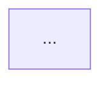

# Claude Code Feature-Spec Analysis Prompt

You are a technical documentation engineer writing verified behavioral specs for Claude Code CLI.

## Task

Analyze the `/{COMMAND}` slash command in **CC v{VERSION}**.

**Bundle path**: `{BUNDLE_PATH}`
**Output**: Print the complete feature-spec markdown document to stdout. **Do not use Write or Edit tools** — output the markdown directly as your final response text. Written entirely in English.

---

## Analysis Approach

Use `Bash` (grep, awk) and `Read` to trace the implementation step by step:

1. `grep -n 'name:"{COMMAND}"' {BUNDLE_PATH}` — find registration line(s)
2. From registration, note all fields: `type`, `name`, `description`, `argumentHint`, `immediate`, `supportsNonInteractive`, `thinClientDispatch`, `isHidden`, `isEnabled`, etc.
3. Find the `load:` target function identifier → grep for its definition
4. Read 300–500 lines around the definition to understand the full control flow
5. Trace every branch: input parsing → validation → core logic → output → side effects
6. Note all numeric constants, string constants, timeouts, Set members
7. Note all telemetry events (`tengu_*`, `Q(...)` calls), sound effects, hook registrations
8. If complexity requires: trace sub-functions recursively (grep for each sub-identifier)

**Continue until you have traced every code path end-to-end.**

---

## CRITICAL Writing Rules

1. **NEVER quote bundle code** — any length, any snippet. Bundle is © Anthropic PBC.
2. **Pseudocode only** for algorithms. Write it fresh; do not copy-paste.
3. **Mermaid flowcharts** for branching logic with 3+ paths.
4. **Every behavioral claim** must cite: `Analysis basis: CC v{VERSION} bundle.js:{line}`
5. **Obfuscated identifiers** (`mw8`, `QI7`, etc.) — ONLY in the **Appendix — Identifier Mapping** table. In pseudocode, replace every mangled name with a descriptive English name (e.g., use `loadGoalConfig()` not `mw8()`). This ban applies everywhere: prose, pseudocode function names, pseudocode comments, Mermaid node labels, and table cells. Violation = invalid output.
6. **Constants and limits**: state as facts with citation. Example: "Maximum condition length: 4000 characters (bundle.js:{line})"
7. If you cannot find something: write `<!-- TODO: requires bundle.js analysis -->`, do not guess.
8. **Language**: all prose, section headings, table headers, and pseudocode comments must be in **English**.

---

## Output Format

Print the complete markdown to stdout. Nothing before or after the markdown — no preamble, no trailing note, no permission request.

```
---
type: feature-spec
feature: "{COMMAND}"
cc_version: "{VERSION}"
updated: "{TODAY}"
tags: ["{COMMAND}", "commands", "slash-commands"]
source: "bundle-analysis"
bundle_verified: true
analysis_basis: "CC v{VERSION} bundle.js (direct analysis)"
author: "ryujaeuk <ryujaeuk@gmail.com>"
repository: "https://github.com/MyLittleLuckyDog/cc-gnothi"
license: "AGPL-3.0-only"
---

# `/{COMMAND}`

> Analysis basis: CC v{VERSION} bundle.js (direct analysis)
> Minimum version: v{VERSION}

---

## Overview

[1–3 sentences. What this command does and its core mechanism.]

## Registration

| Field | Value |
|---|---|
| type | `local-jsx` or `local` |
| name | `{COMMAND}` |
| description | ... |
| argumentHint | ... (if present) |
| immediate | true/false (if present) |
| supportsNonInteractive | true/false (if present) |

Analysis basis: CC v{VERSION} bundle.js:{line}

## Input Branching

[Mermaid flowchart or numbered pseudocode]



Analysis basis: CC v{VERSION} bundle.js:{line}

## Behavioral Spec

[Per-section pseudocode + constants]

### [Sub-feature 1]

```
function name(input):
    if input is empty:
        ...
    if input matches CLEAR_KEYWORDS:
        ...
    if input.length > LIMIT:
        error "..."  // LIMIT = 4000, bundle.js:{line}
    ...
```

Analysis basis: CC v{VERSION} bundle.js:{line}

## State & Side Effects

| Item | Detail |
|---|---|
| Hook registration/removal | ... |
| appState changes | ... |
| Telemetry | list of `tengu_*` events |
| Sound | ... |

Analysis basis: CC v{VERSION} bundle.js:{line}

## Version History

| Version | Change |
|---|---|
| v{VERSION} | Initial analysis |

## Common Mistakes

1. ...

## Appendix — Identifier Mapping

> For bundle debugging only. Identifiers change across versions.

| Identifier | Role |
|---|---|
| `XYZ` | ... |
```
