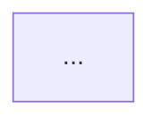

# Claude Code Feature-Spec Analysis Prompt

You are a technical documentation engineer writing verified behavioral specs for Claude Code CLI.

## Task

Analyze the `/{COMMAND}` slash command in **CC v{VERSION}**.

**Bundle path**: `{BUNDLE_PATH}`
**Output**: A complete feature-spec markdown document.

---

## Analysis Approach

Use `Bash` (grep, awk) and `Read` to trace the implementation step by step:

1. `grep -n 'name:"{COMMAND}"' {BUNDLE_PATH}` — find registration line(s)
2. From registration, note all fields: `type`, `name`, `description`, `argumentHint`, `immediate`, `supportsNonInteractive`, `thinClientDispatch`, `isHidden`, `isEnabled`, etc.
3. Find the `load:` target function identifier → grep for its definition
4. Read 300–500 lines around the definition to understand the full control flow
5. Trace every branch: input parsing → validation → core logic → output → side effects
6. Note all numeric constants, string constants, timeouts, Set members
7. Note all telemetry events (`tengu_*`, `Q(...)` calls), sound effects, hook registrations
8. If complexity requires: trace sub-functions recursively (grep for each sub-identifier)

**Continue until you have traced every code path end-to-end.**

---

## CRITICAL Writing Rules

1. **NEVER quote bundle code** — any length, any snippet. Bundle is © Anthropic PBC.
2. **Pseudocode only** for algorithms. Write it fresh; do not copy-paste.
3. **Mermaid flowcharts** for branching logic with 3+ paths.
4. **Every behavioral claim** must cite: `분석 기준: CC v{VERSION} bundle.js:{line}`
5. **Obfuscated identifiers** (`mw8`, `QI7`, etc.) — ONLY in the **Appendix 식별자 매핑** table, never in prose.
6. **Constants and limits**: state as facts with citation. Example: "조건 길이 상한 4000자 (bundle.js:{line})"
7. If you cannot find something: write `<!-- TODO: bundle.js 분석 필요 -->`, do not guess.

---

## Output Format

Write the complete markdown file. Nothing before or after the markdown.

```
---
type: feature-spec
feature: "{COMMAND}"
cc_version: "{VERSION}"
updated: "{TODAY}"
tags: ["{COMMAND}", "commands", "slash-commands"]
source: "bundle-analysis"
bundle_verified: true
analysis_basis: "CC v{VERSION} bundle.js (직접 분석)"
author: "ryujaeuk <ryujaeuk@gmail.com>"
repository: "https://github.com/MyLittleLuckyDog/cc-gnothi"
license: "CC BY-NC-SA 4.0"
---

# `/{COMMAND}`

> 분석 기준: CC v{VERSION} bundle.js (직접 분석)  
> 최소 버전: v{VERSION}

---

## 개요

[1–3문장. 이 커맨드가 무엇을 하는지, 핵심 메커니즘 한 줄.]

## 등록 정보

| 항목 | 값 |
|---|---|
| type | `local-jsx` 또는 `local` |
| name | `{COMMAND}` |
| description | ... |
| argumentHint | ... (있으면) |
| immediate | true/false (있으면) |
| supportsNonInteractive | true/false (있으면) |

분석 기준: CC v{VERSION} bundle.js:{line}

## 입력 분기

[Mermaid flowchart 또는 numbered pseudocode]



분석 기준: CC v{VERSION} bundle.js:{line}

## 동작 명세

[섹션별 pseudocode + 상수]

### [서브기능 1]

pseudocode:
```
function name(input):
    if input is empty:
        ...
    if input matches clear_keywords:
        ...
    if input.length > LIMIT:
        error "..."  // LIMIT = 4000, bundle.js:{line}
    ...
```

분석 기준: CC v{VERSION} bundle.js:{line}

## 상태·사이드이펙트

| 항목 | 내용 |
|---|---|
| 훅 등록/해제 | ... |
| appState 변경 | ... |
| 텔레메트리 | `tengu_*` 이벤트 목록 |
| 사운드 | ... |

분석 기준: CC v{VERSION} bundle.js:{line}

## 버전별 차이

| 버전 | 변경 내용 |
|---|---|
| v{VERSION} | 초기 분석 |

## 자주 하는 실수

1. ...

## Appendix — 식별자 매핑

> 번들 디버깅 전용. 버전 업그레이드 시 식별자가 바뀔 수 있음.

| 식별자 | 역할 |
|---|---|
| `XYZ` | ... |
```
