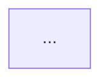

# Claude Code Feature-Spec Analysis Prompt

You are a technical documentation engineer writing verified behavioral specs for Claude Code CLI.

## Task

Write a complete feature-spec for the `/{COMMAND}` slash command in **CC v{VERSION}**.

**DO NOT use any tools.** All data you need is in the JSON block at the end of this prompt.
Written entirely in English.

---

## Source Data

The JSON block below was extracted deterministically from the CC v{VERSION} bundle via AST analysis.
It contains:
- `registration` — exact field values from the command registration object
- `callGraph` — call edges from the command's implementation (depth ≤ 2)
- `telemetry` — all `tengu_*` event strings found in the implementation
- `literals` — string/number constants found in the implementation
- `identifiers` — obfuscated function identifiers reached during traversal
- `_arbor_fallback` (optional) — when `true`, the index was built via the Arbor
  tree-sitter fallback (Babel tripped on this bundle). Add a one-line footnote
  near the bottom of the spec: "Note: index built via Arbor fallback; some
  signals (telemetry, literals) may be missing — see arbor-fallback.js."
- `registration.loc_byte_end` — the registration object's closing brace
  offset (inclusive of `}`). Use the `(loc_byte, loc_byte_end)` span when
  you need to cite the full registration block.
- `registration.prompt_body` (optional, `prompt`-type only) — the actual
  text the command sends to the agent at invocation. `length` and `trace`
  document provenance; `text` is the body when extraction succeeded.
  Ground the Behavioral Spec in what is really instructed. **Do not quote
  verbatim** beyond short citation fragments (≤30 chars) — the body is
  © Anthropic PBC.
- `registration.handler_method` (optional) — when set (currently
  `"getPromptForCommand"`), the handler lives inline as an ObjectMethod on
  the registration object rather than behind a module export. callGraph
  for this command then starts at the synthetic entry
  `__handler_<command>`; treat it as the command's main handler.
- `registration.load_ident` (optional) — when set, the handler ident was
  inlined into a `load:()=>Promise.resolve({call: IDENT})` shape (no
  `module_id`). callGraph entry will say `via:"load_ident"`. Reference
  this ident as the handler in the Behavioral Spec.
- `registration.dynamic_name: true` (optional) — the registration `name`
  is built at runtime (currently the `mcp__` prefix class). The spec
  should describe the command as a **prefix-class** (one entry covering
  many instantiations), not as a single fixed name.

Use these facts as your primary source. Do not guess. If something is not in the data, write
`<!-- TODO: not found in depth-2 traversal; needs --depth 4 -->`.

---

## Writing Rules

1. **NEVER quote bundle code** — any length, any snippet. Bundle is © Anthropic PBC.
2. **Pseudocode only** for algorithms. Write it fresh; do not copy-paste.
3. **Mermaid flowcharts** for branching logic with 3+ paths.
4. **Every behavioral claim** must cite the `loc_byte` from the JSON as:
   `Analysis basis: CC v{VERSION} bundle.js:+{loc_byte}`
5. **Obfuscated identifiers** (`mw8`, `QI7`, etc.) — ONLY in the **Appendix — Identifier Mapping**
   table. Replace every mangled name with a descriptive English name in pseudocode.
6. **Constants and limits**: state as facts with citation. Example:
   "Maximum condition length: 4000 characters (bundle.js:+{loc_byte})"
7. **Language**: all prose, section headings, table headers, and pseudocode in **English**.

---

## Output Format

Print the complete markdown below. Nothing before or after — no preamble, no trailing note.

```
---
type: feature-spec
feature: "{COMMAND}"
cc_version: "{VERSION}"
updated: "{TODAY}"
tags: ["{COMMAND}", "commands", "slash-commands"]
source: "bundle-analysis"
bundle_verified: true
analysis_basis: "CC v{VERSION} bundle.js (AST extraction + Claude interpretation)"
author: "ryujaeuk <ryujaeuk@gmail.com>"
repository: "https://github.com/MyLittleLuckyDog/cc-gnothi"
license: "AGPL-3.0-only"
---

# `/{COMMAND}`

> Analysis basis: CC v{VERSION} bundle.js (AST extraction + Claude interpretation)
> Minimum version: v{VERSION}

---

## Overview

[1–3 sentences. What this command does and its core mechanism.]

## Registration

| Field | Value |
|---|---|
| type | `...` |
| name | `{COMMAND}` |
| description | ... |
[Add rows for each non-null field in registration JSON]

Analysis basis: CC v{VERSION} bundle.js:+{loc_byte from registration}

## Input Branching

[Mermaid flowchart or numbered pseudocode derived from callGraph and literals]



## Behavioral Spec

[Pseudocode per sub-feature. Use descriptive names, not obfuscated IDs.]

### [Sub-feature derived from callGraph]

```
function descriptiveName(input):
    ...
```

Analysis basis: CC v{VERSION} bundle.js:+{loc_byte}

## State & Side Effects

| Item | Detail |
|---|---|
| Telemetry | [list events from telemetry array] |
| Hook registration | ... |
| appState changes | ... |
| Sound | ... |

## Version History

| Version | Change |
|---|---|
| v{VERSION} | Initial analysis |

## Common Mistakes

1. ...

## Appendix — Identifier Mapping

> For bundle debugging only. Identifiers change across versions.

| Identifier | Role |
|---|---|
[Row per entry in identifiers array that is obfuscated (short, non-English name)]
```

---

## Pre-Extracted AST Data

```json
{AST_JSON}
```

{PROMPT_BODY}
