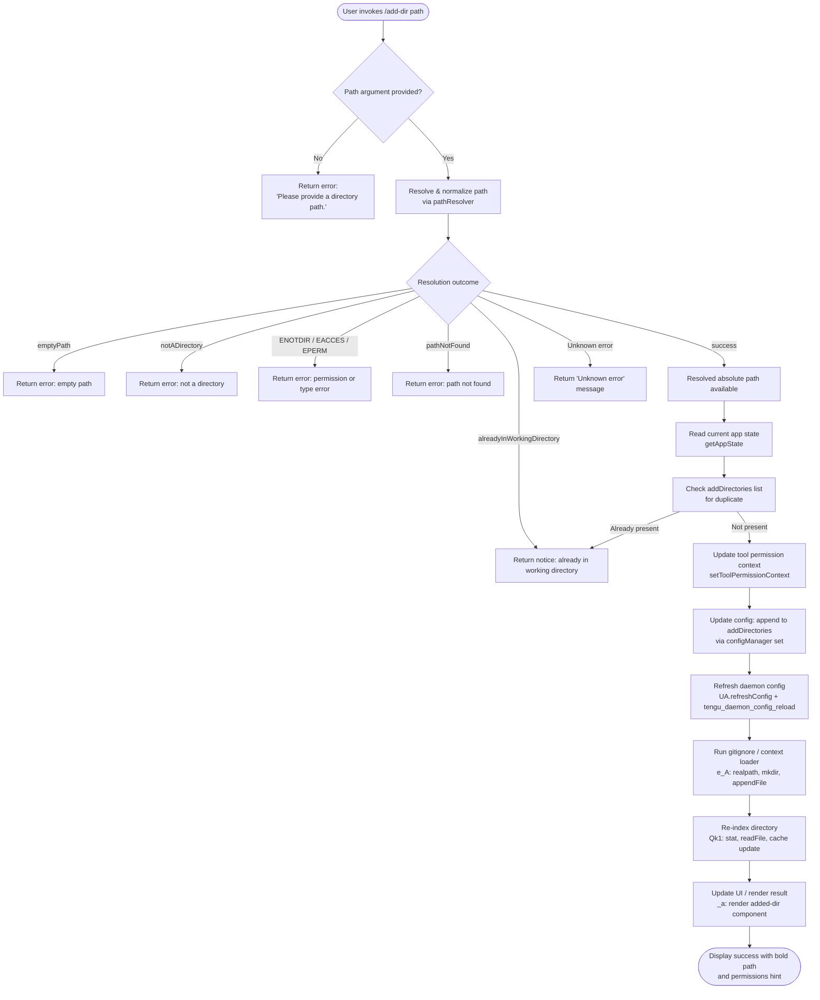

# `/add-dir`

> Analysis basis: CC v2.1.132 bundle.js (AST extraction + Claude interpretation)
> Minimum version: v2.1.132

---

## Overview

The `/add-dir` slash command adds a new working directory to the current Claude Code session, expanding the set of filesystem paths accessible to Claude's tooling. It resolves and validates the given path, updates tool permission contexts and configuration state, then re-indexes the new directory so that file-aware features (e.g., context loading, `--add-dir` startup flag handling) reflect the expanded working set. The command is registered as a local JSX command and accepts a single `<path>` argument.

---

## Registration

| Field | Value |
|---|---|
| type | `local-jsx` |
| name | `add-dir` |
| description | `Add a new working directory` |
| argumentHint | `<path>` |
| module\_id | `ah1` |

Analysis basis: CC v2.1.132 bundle.js:+3987272

---

## Input Branching

The command entry point (command handler `mbK`) begins by reading app state, then validates and processes the supplied path through path-resolution helper `exH`. Depending on the result, execution follows one of several branches:



Analysis basis: CC v2.1.132 bundle.js:+3986017, +3986034, +3579394, +3579492, +3579637, +3579748, +3579824, +3579909, +3986454, +3986719

---

## Behavioral Spec

### 1. Command Entry and App-State Acquisition

```
function commandHandler(args, appState):
    currentState = getAppState()                    // read full app state
    addDirectoriesList = currentState["addDirectories"]   // list literal "addDirectories"
    sessionContext     = currentState["session"]          // literal "session"
    localSettings      = currentState["localSettings"]    // literal "localSettings"

    rawPath = args[0]
    if rawPath is undefined or rawPath is empty:
        return renderError("Please provide a directory path.")

    result = resolveAndValidatePath(rawPath)
    if result.status != "success":
        return renderError(mapStatusToMessage(result.status))

    resolvedPath = result.path

    if addDirectoriesList includes resolvedPath:
        return renderNotice("alreadyInWorkingDirectory")

    updateToolPermissionContext(localSettings, sessionContext)
    configManager_set("addDirectories", resolvedPath)
    removeFromConfig("removeDirectories", resolvedPath)  // mirror cleanup

    UA.refreshConfig()
    // telemetry: tengu_daemon_config_reload fired inside daemon restart sequence

    runContextLoader(resolvedPath)
    reindexDirectory(resolvedPath)
    renderSuccess(resolvedPath)
```

Analysis basis: CC v2.1.132 bundle.js:+3985988, +3986034, +3986081, +3986097, +3986108, +3986140, +3986155, +3986164, +3986192

---

### 2. Path Resolution and Validation (`pathResolver` / `exH` + `c_`)

```
function resolveAndValidatePath(rawInput):
    if rawInput is null or rawInput is empty string:
        return { status: "emptyPath" }

    trimmed = rawInput.trim()

    if trimmed contains null bytes:
        raise TypeError("Path contains null bytes")

    // Tilde expansion
    if trimmed starts with "~/":
        home = os.homedir()
        trimmed = home + trimmed.slice(2)     // replace "~/" prefix

    // Windows drive-letter normalization
    if platform is "windows":
        trimmed = applyWindowsPathNormalization(trimmed)

    // Make absolute
    if not path.isAbsolute(trimmed):
        trimmed = path.resolve(currentWorkingDir, trimmed)

    trimmed = path.normalize(trimmed)

    // Filesystem check
    try:
        stat = await fs.stat(trimmed)
    catch error:
        if error.code == "ENOTDIR" or error.code == "EACCES" or error.code == "EPERM":
            return { status: "notADirectory" }
        return { status: "pathNotFound" }

    if not stat.isDirectory():
        return { status: "notADirectory" }

    // Check already-in-working-directory
    if currentWorkingDirectories includes trimmed:
        return { status: "alreadyInWorkingDirectory" }

    return { status: "success", path: trimmed }
```

Analysis basis: CC v2.1.132 bundle.js:+3579394, +3579413, +3579447, +3579492, +3579555, +3579582, +3579597, +3579611, +3579637, +3579748, +3579824, +948592, +948799, +948833, +948855, +948906, +948940, +948953, +948966, +948988, +949028, +949035, +949095, +949159

---

### 3. Tool Permission Context Update (`setToolPermissionContext` / `cf`)

```
function updateToolPermissionContext(localSettings, session):
    mode = deriveMode(localSettings, session)

    if mode == "bypassPermissions" and bypassPermissionsUnavailable:
        log.debug("Ignoring permission update: setMode 'bypassPermissions' rejected — " +
                  "mode is not available (disableBypassPermissionsMode set, or session " +
                  "not launched in bypassPermissions mode)")
        return

    for each rule in newRules:
        if rule.effect == "allow":
            appendToConfig("alwaysAllowRules", rule)
        else if rule.effect == "deny":
            appendToConfig("alwaysDenyRules", rule)
        else:
            appendToConfig("alwaysAskRules", rule)

    applyRuleOperation("addRules" | "replaceRules" | "removeRules", rules)
    configManager.set("addDirectories", ...)
    configManager.delete("removeDirectories", ...)
```

Analysis basis: CC v2.1.132 bundle.js:+3986108, +3884795, +3884817, +3884883, +3885159, +3885344, +3885352, +3885384, +3885391, +3885409, +3885507, +3886164, +3886548

---

### 4. Config Persistence and Daemon Reload (`configManager` / `D`)

```
function persistAndReload(resolvedPath):
    // Read existing config from disk (UTF-8)
    raw = fs.readFile(configPath, "utf8")
    if error.code == "ENOENT":
        config = {}
    else:
        config = JSON.parse(raw)

    // Append resolved path to addDirectories array
    config["addDirectories"] = deduplicate(
        (config["addDirectories"] ?? []) + [resolvedPath]
    )

    // Write back via supervisor channel
    supervisor.write(config)

    // Stop current watcher, apply updated config, restart watcher
    watcher.stop()
    watcher.updateConfig(config)
    watcher.start()

    // Emit heartbeat / reload signal
    emitEvent("heartbeat")

    // Fire telemetry
    emit("tengu_daemon_config_reload")
```

Analysis basis: CC v2.1.132 bundle.js:+11571580, +11571595, +11571615, +11571623, +14142462, +14142479, +14142681, +14142755, +14142875, +14142884, +14142902, +14143004, +14143049, +14143060, +14143278, +14143280

---

### 5. Context / Gitignore Loader (`e_A`)

```
function runContextLoader(resolvedPath):
    // Normalize unicode: NFC form
    normalizedPath = resolvedPath.normalize("NFC")

    realPath = await fs.realpath(normalizedPath)

    // Locate or create .claudeignore / context file
    contextFilePath = path.join(realPath, contextFileName)

    try:
        existing = await fs.readFile(contextFilePath, encoding)
    catch:
        // File does not exist — create parent directories (mode 0o700 / 0o600)
        await fs.mkdir(path.dirname(contextFilePath), { recursive: true, mode: 448 })
        await fs.appendFile(contextFilePath, initialContent, { mode: 384 })

    loadContextEntries(realPath)
```

File creation mode `448` (octal `0o700`) and `384` (octal `0o600`) are used for directory and file creation respectively.

Analysis basis: CC v2.1.132 bundle.js:+11785688, +11785722, +11785748, +11785768, +11785774, +11785795, +11785831, +11785860, +11785956, +11785965, +11785998, +11786037, +11786065

---

### 6. Directory Re-indexing (`Qk1`, `Jq`, `jM`)

```
function reindexDirectory(resolvedPath):
    // Clear any stale cache entries for this path
    fileCache.delete(resolvedPath)

    // Stat all immediate entries in parallel
    entries = await Promise.all(
        subPaths.map(p => fs.stat(p))
    )

    for each entry in entries:
        basename = path.basename(entry.path)

        // Warn on suspicious entries
        if entry has unexpected state:
            log.warn(...)

        // Read file content (utf-8, up to limit)
        content = await fs.readFile(entry.path, "utf-8")

        // Check numeric ordering fields
        order      = entry["order"]
        stateOrder = entry["stateOrder"]

        if Number.isFinite(order):
            fileCache.set(entry.path, { content, order, stateOrder })
        else:
            fileCache.clear()   // safety reset after 1000 ms debounce

    // Rebuild internal index
    rebuildIndex(resolvedPath)
    loadContextFile(resolvedPath)
```

Debounce timeout for cache reset: 1000 ms.
Analysis basis: CC v2.1.132 bundle.js:+3877939, +3877957, +3875017, +3875058, +3875085, +3875106, +3875143, +3875156, +3875298, +3875325, +3875403, +3875438, +3875463, +3875542, +3875647, +3875663, +3875808, +3875863, +3875920, +3876020, +3878122, +3878227, +3878233

---

### 7. Result Rendering (`_a`, `HuH`)

```
function renderResult(resolvedPath, status):
    if status == "success":
        displayPath = boldFormatter(resolvedPath)
        permissionsHint = dimFormatter("· /permissions to manage")
        render(<AddedDirComponent path=displayPath hint=permissionsHint />)
    else if status == "alreadyInWorkingDirectory":
        render(<NoticeComponent message="Did not add a working directory." />)
    else:
        render(<ErrorComponent message=mapStatusToMessage(status) />)
```

- Success message uses **bold** formatting for the path.
- Permissions hint string: `· /permissions to manage`
- Failure string for already-registered or rejected path: `Did not add a working directory.`
- Fallback error string: `Unknown error`

Analysis basis: CC v2.1.132 bundle.js:+3986269, +3986454, +3986555, +3986562, +3986719, +3579977, +3580045

---

### 8. `--add-dir` Startup Flag Equivalence

The literal `"--add-dir"` is present in the command's implementation scope, confirming that the slash command shares its core path-registration logic with the CLI startup flag of the same name. Both paths converge on the same config-persistence and re-indexing routines.

Analysis basis: CC v2.1.132 bundle.js:+3986222

---

## State & Side Effects

| Item | Detail |
|---|---|
| Telemetry | `tengu_daemon_config_reload` (fired during daemon config reload sequence; bundle.js:+14143280) |
| Config key written | `addDirectories` — resolved absolute path appended (bundle.js:+3986034) |
| Config key cleaned | `removeDirectories` — resolved path removed if present (bundle.js:+3886548) |
| Tool permission context | `setToolPermissionContext` called with updated `localSettings` and `session` (bundle.js:+3986108) |
| Daemon watcher | Stop → `updateConfig` → Start cycle executed on successful add (bundle.js:+14142875, +14142884, +14142902) |
| Filesystem side effects | `.claudeignore` / context file created (mode `0o600`) under new directory if absent; parent directories created (mode `0o700`) (bundle.js:+11785956, +11785998, +11786037, +11786065) |
| File cache | Stale entries for the added path cleared; directory re-indexed and cache repopulated (bundle.js:+3875017, +3875438, +3875808, +3876020) |
| Cache reset debounce | 1000 ms (bundle.js:+3876020) |
| UI render | JSX component rendered with bold path and dim permissions hint (bundle.js:+3986269, +3986555) |
| Sound | <!-- TODO: not found in depth-2 traversal; needs --depth 4 --> |

---

## Version History

| Version | Change |
|---|---|
| v2.1.132 | Initial analysis |

---

## Common Mistakes

1. **Omitting the path argument.** Invoking `/add-dir` with no argument returns `"Please provide a directory path."` immediately; no state is modified.

2. **Supplying a file path instead of a directory.** If the resolved path exists but is not a directory (stat result is not a directory, or `ENOTDIR` is raised), the command returns `notADirectory` and does not update config.

3. **Using a relative path expecting it to be resolved from the project root.** The path is resolved relative to the process current working directory at the time of invocation, not necessarily the primary project directory.

4. **Adding a directory that is already registered.** The command silently returns `"Did not add a working directory."` — no duplicate entry is created, but also no error is surfaced, which can be confused with a successful add.

5. **Expecting permission rules to survive across sessions without `localSettings` persistence.** The `setToolPermissionContext` call updates `localSettings`; if that config layer is ephemeral (e.g., in-memory only), permission grants for the new directory may not persist after restart.

6. **Paths with null bytes.** Any path containing a null byte triggers an immediate `TypeError` inside the path-resolution helper before any filesystem access occurs.

7. **Tilde expansion scope.** Only the `~/` prefix is expanded to the home directory. Bare `~username` forms are not expanded and will produce a `pathNotFound` or `notADirectory` error.

---

## Appendix — Identifier Mapping

> For bundle debugging only. Identifiers change across versions.

| Identifier | Role |
|---|---|
| `mbK` | Command handler — top-level `/add-dir` implementation function |
| `A` | App state accessor object (provides `getAppState`, `setToolPermissionContext`, `toUpperCase`) |
| `cf` | Tool permission context updater (processes rule sets, calls config set/delete) |
| `k` | Permission mode validator / debug logger (checks `bypassPermissions` mode availability) |
| `i4` | Rule formatter / serializer helper |
| `RH` | JSON serialization helper (wraps `JSON.stringify`) |
| `_` | Config store object (provides `set`, `delete`, `includes`, `filter`) |
| `L` | Rule-list formatter / filter helper (provides `filter`, `has`; uses `K.map`, `padEnd`) |
| `K` | Process / IPC channel manager (provides `has`, `process.exit`) |
| `MV` | Working-directory membership checker |
| `D` | Daemon / watcher manager (provides `stop`, `updateConfig`, `start`, `get`, `set`, `delete`) |
| `lDH` | Config file reader (reads UTF-8 config, handles ENOENT) |
| `q` | File writer / IPC write channel (provides `write`, `close`, `filter`, `has`, `startsWith`) |
| `Hwq` | Config display formatter (uses `Object.keys`, `Math.max`) |
| `f` | Connection/channel handle (provides `get`, `set`, `delete`, `close`) |
| `E` | Event stop handler (calls `preventDefault`, daemon restart) |
| `I` | Watcher instance (provides `stop`, `updateConfig`, `start`) |
| `VQq` | Heartbeat emitter |
| `Z` | Secondary watcher / process (provides `start`) |
| `d` | Telemetry emitter (fires `tengu_daemon_config_reload`) |
| `JaH` | Config refresh trigger |
| `e_A` | Context / gitignore loader (realpath, mkdir, readFile, appendFile) |
| `oDH` | Context environment detector (test/production mode selector) |
| `D8` | Error code extractor (reads `.code` property from error objects) |
| `fH` | Context file entry loader (reads individual context entries, logs errors) |
| `lg` | Logger instance |
| `_A` | Path utilities / config path resolver |
| `Qk1` | Directory re-indexer (orchestrates `YW`, `Jq`, `jM`, `fH`) |
| `YW` | Cache invalidator (calls `fileCache.delete`) |
| `Jq` | File stat and content loader (parallel stat, readFile, cache population) |
| `jM` | Index rebuilder (joins paths, calls `RH` for serialization, `YW` for cache clear) |
| `_a` | Result renderer — builds JSX output for success, duplicate, and error cases |
| `j_A` | Rendered component helper |
| `ok1` | Sub-directory context builder (maps tool lists, filters, calls `fH`) |
| `R8` | Tool-entry formatter (uses `IdA`, `G7_`, `VdA`) |
| `CA` | Tool permission resolver (resolves allow/deny/ask rules per tool, emits events) |
| `Q$` | Text truncation / substring helper |
| `H` | Random delay / animation helper (uses `Math.random`, `setTimeout`) |
| `exH` | Path resolution orchestrator (calls `c_`, `fs.stat`, `Qd`, `CS`) |
| `c_` | Low-level path normalizer (tilde expansion, null-byte check, `path.resolve`, `path.normalize`) |
| `j8` | Error code normalizer |
| `Qd` | Path display formatter |
| `CS` | Path alias substituter (replaces `/var/` → `/tmp$1`, normalizes display paths) |
| `HuH` | Success message renderer (applies `M6.bold`, `fl6.dirname`) |