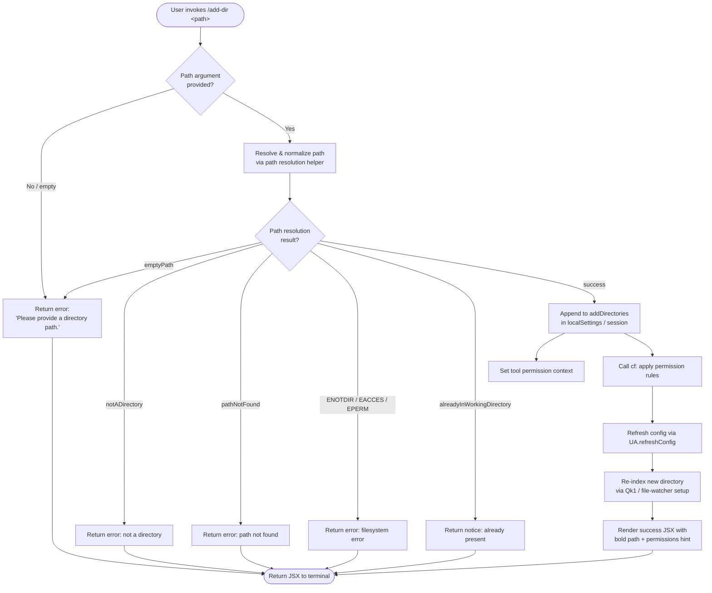

# `/add-dir`

> Analysis basis: CC v2.1.132 bundle.js (AST extraction + Claude interpretation)
> Minimum version: v2.1.132

---

## Overview

The `/add-dir` command adds a new working directory to the current Claude Code session. It accepts a single path argument, resolves and validates that path, then registers it in session state and refreshes configuration so that subsequent tool calls can access the new directory. The command renders inline JSX feedback (success, error, or "already present" notices) directly in the terminal UI.

---

## Registration

| Field | Value |
|---|---|
| type | `local-jsx` |
| name | `add-dir` |
| description | `Add a new working directory` |
| argumentHint | `<path>` |
| module_id | `ah1` |
| load_inline | `true` |
| handler (Arbor) | `mbK` (AsyncFunction, resolved via `module_id`) |
| `loc_byte_end` | `3987420` |
| `arbor_handler.name` | `mbK` |
| `arbor_handler.kind` | `AsyncFunction` |
| `arbor_handler.resolution_path` | `module_id` |
| `arbor_handler.fqn` | `claude-2.1.132::mbK` |
| `arbor_handler.n_hits` | `0` |

Analysis basis: CC v2.1.132 bundle.js:+3987272 – +3987420

---

## Input Branching

The handler `mbK` processes the user-supplied path through several validation stages before committing any state change. The flowchart below captures the primary decision paths.



Analysis basis: CC v2.1.132 bundle.js:+3985988, +3986034, +3986097, +3579394, +3579492, +3579637, +3579748, +3579824

---

## Behavioral Spec

### 1. Handler Entry — `mbK`

The top-level async handler is `mbK` (module `ah1`).

```
async function handleAddDir(input):
    appState  = getAppState()                         // A.getAppState
    rawPath   = input.trim()

    if rawPath is empty:
        return renderError("Please provide a directory path.")

    resolvedResult = resolveAndValidatePath(rawPath)  // exH

    switch resolvedResult.status:
        case "emptyPath":
            return renderError("Please provide a directory path.")
        case "notADirectory":
            return renderError(notADirectory message)
        case "pathNotFound":
            return renderError(pathNotFound message)
        case "ENOTDIR" | "EACCES" | "EPERM":
            return renderError(filesystem error message)
        case "alreadyInWorkingDirectory":
            return renderNotice(already-present message)
        case "success":
            resolvedPath = resolvedResult.path

    // Mutate session state
    appState.localSettings.session.addDirectories += [resolvedPath]  // literal "addDirectories", "localSettings", "session"

    setToolPermissionContext(appState, index=1)       // A.setToolPermissionContext, literal 1

    applyPermissionRules(appState)                    // cf

    checkAlreadyInDirectories(appState, resolvedPath) // D.includes

    refreshConfig()                                   // UA.refreshConfig

    reindexNewDirectory(resolvedPath)                 // e_A

    reinitFileWatcher(appState)                       // Qk1

    renderAddDirResult(appState, resolvedPath)        // _a
    return successJsx
```

Analysis basis: CC v2.1.132 bundle.js:+3985988, +3986017, +3986034, +3986081, +3986097, +3986108, +3986140, +3986155, +3986164, +3986178, +3986192, +3986211, +3986218, +3986252

---

### 2. Path Resolution — `exH` + `c_`

The path resolution helper `exH` wraps the lower-level normalizer `c_` and a filesystem `stat` call.

```
async function resolveAndValidatePath(rawPath):
    if rawPath is empty:
        return { status: "emptyPath" }

    normalizedPath = normalizePath(rawPath)           // c_
        // • trims whitespace
        // • expands leading "~/" using os.homedir()
        // • normalizes path separators (OZ.normalize)
        // • resolves to absolute (OZ.resolve / OZ.isAbsolute)
        // • rejects paths containing null bytes → Error "Path contains null bytes"
        // • on windows: applies windows-specific path handling

    statResult = await fs.stat(normalizedPath)        // NZ1.stat

    if stat error:
        if error.code == "ENOTDIR":
            return { status: "notADirectory" }
        if error.code in ["EACCES", "EPERM"]:
            return { status: "notADirectory" }   // access denied maps to notADirectory
        if error.code == "ENOENT" or path not found:
            return { status: "pathNotFound" }

    if stat result is not a directory:
        return { status: "notADirectory" }

    finalPath = canonicalize(normalizedPath)          // CS → display-safe form

    if finalPath already in appState working directories:
        return { status: "alreadyInWorkingDirectory" }

    return { status: "success", path: finalPath }
```

Analysis basis: CC v2.1.132 bundle.js:+3579394, +3579413, +3579447, +3579492, +3579555, +3579637, +3579698, +3579748, +3579824, +948593, +948799, +948833, +948855, +948906, +948940, +948966, +948988, +949028, +949095, +949159

---

### 3. Permission Rule Application — `cf`

After the path is validated and appended to session state, `cf` applies the existing permission rule context to the newly enlarged working directory set.

```
function applyPermissionRules(appState):
    // Walk alwaysAllowRules, alwaysDenyRules, alwaysAskRules
    for each ruleSet in ["alwaysAllowRules", "alwaysDenyRules", "alwaysAskRules"]:
        rules = appState[ruleSet]
        processedRules = rules
            .filter(isValidRule)                          // L.filter / K.has
            .map(normalizeRule)                           // i4 + CPL (replaceAll escaping)

    // Handle addRules merge
    mergeRuleSets(appState, "addRules", processedRules)   // _.set, literal "addRules"

    // Handle replaceRules replacement
    replaceRuleSets(appState, "replaceRules")             // literal "replaceRules"

    // Handle removeRules deletion
    removeRuleSets(appState, "removeRules")               // _.delete, literal "removeRules"

    // Handle removeDirectories cleanup
    pruneRemovedDirectories(appState, "removeDirectories") // literal "removeDirectories"

    // Guard: if mode is "bypassPermissions" and session does not allow it:
    if requestedMode == "bypassPermissions" AND bypassNotAvailable:
        log warning: "Ignoring permission update: setMode 'bypassPermissions' rejected..."
        // literal at bundle.js:+3884883
        return without applying bypassPermissions
```

Analysis basis: CC v2.1.132 bundle.js:+3884795, +3884817, +3884883, +3885159, +3885344, +3885352, +3885384, +3885391, +3885409, +3885507, +3886077, +3886164, +3886474, +3886548, +3886776

---

### 4. Configuration Refresh — `UA.refreshConfig`

After state mutation, the configuration subsystem is reloaded to pick up the new directory entry.

```
function refreshConfig():
    UA.refreshConfig()
    // Internally triggers reload of:
    //   policySettings, flagSettings, userSettings, projectSettings
    // File encoding: "utf-8"
    // Reads config with fs.readFile, normalizes to NFC unicode
```

Analysis basis: CC v2.1.132 bundle.js:+3986192, +1159426, +1159448, +1159978, +1160030, +1160093, +11785748

---

### 5. Directory Re-indexing — `e_A`

The new directory is indexed for context retrieval after being added.

```
async function reindexNewDirectory(resolvedPath):
    // Normalize path to production/test environment
    // Use yK.realpath to canonicalize symlinks
    // NFC-normalize the resolved string
    // Create directory structure if missing: yK.mkdir (mode 448 / 0o700)
    // Append index metadata: yK.appendFile (mode 384 / 0o600)
    // Read existing index: yK.readFile (utf8)
    // Join with D$.join / D$.dirname for sub-path construction
    // On ENOENT: treat as fresh directory (no pre-existing index)
    // Emit fH (error reporter) on unexpected read failures
```

File permission constants:
- Directory creation mode: **448** (`0o700`) — Analysis basis: CC v2.1.132 bundle.js:+11785998
- File append mode: **384** (`0o600`) — Analysis basis: CC v2.1.132 bundle.js:+11786065

---

### 6. File-Watcher Re-initialization — `Qk1`

After indexing, the file-watcher is refreshed so the new directory participates in incremental change tracking.

```
async function reinitFileWatcher(appState):
    clearExistingWatcher()                     // YW → bfH.delete
    newWatchState = buildWatchState(appState)  // Jq
        // vX.stat each watched path
        // NX.join / NX.basename for path construction
        // bfH.get / bfH.set / bfH.clear for watcher cache
        // Number.isFinite guard on mtime
        // Reads file content: vX.readFile
        // Parses JSON metadata: B6 → JSON.parse
        // Emits "warn" log on unexpected state: literal "warn"
    persistWatchState(newWatchState)           // jM
        // lY: atomic write via randomBytes + writeFile + rename
        // NX.join for path, RH for serialization (JSON.stringify)
    handleErrors(D8, fH)
```

Analysis basis: CC v2.1.132 bundle.js:+3877939, +3877957, +3878122, +3878227, +3878233, +3875017, +3875058, +3875143, +3875156, +3875298, +3875325, +3875403, +3875438, +3875463, +3875542, +3875647, +3875663, +3875808, +3875863, +3875920, +3876025

---

### 7. Result Rendering — `_a`

The JSX result renderer composes the terminal output for all outcomes.

```
function renderAddDirResult(appState, resolvedPath):
    // Success path:
    boldPath    = M6.bold(resolvedPath)
    hintLine    = M6.dim("· /permissions to manage")  // literal at +3986562
    successJsx  = render(boldPath + newline + hintLine)

    // Failure path (Did not add):
    if noPathAdded:
        return render("Did not add a working directory.")  // literal at +3986719

    // On unexpected error:
    fallbackMsg = error.message ?? "Unknown error"         // literal at +3986454

    // Uses ok1 to build per-directory permission rows,
    // CA to load settings layers (policySettings / flagSettings /
    //   userSettings / projectSettings),
    // R8 to classify permission entries,
    // aRK to resolve file-system accessibility of each entry,
    // v3 to lstatSync + check FIFO / socket / char / block device exclusions,
    // Q$ / i4 for rule-text formatting and escaping
```

Analysis basis: CC v2.1.132 bundle.js:+3986252, +3986269, +3986454, +3986555, +3986562, +3986595, +3986719, +3986770, +3986836, +3887014, +3887093, +3887383, +3887587, +3887674, +3887722, +3887969, +3887990, +3887993

---

### 8. CLI Alias

The string literal `"--add-dir"` at bundle.js:+3986222 indicates the command is also reachable as a CLI flag `--add-dir` in non-interactive / scripted invocations (passed to `_a`'s argument parser).

Analysis basis: CC v2.1.132 bundle.js:+3986222

---

## State & Side Effects

| Item | Detail |
|---|---|
| Telemetry | `tengu_daemon_config_reload` (bundle.js:+14143280); `tengu_mcp_retry_failed_remote` (bundle.js:+13846663) — both are downstream of the config/watcher refresh path, not emitted unconditionally by `/add-dir` itself |
| `appState` mutation | `localSettings.session.addDirectories` array is extended with the resolved path (bundle.js:+3986034, +3986081, +3986097) |
| Tool permission context | `setToolPermissionContext` called with index `1` immediately after path append (bundle.js:+3986108, +3986017) |
| Permission rules | `cf` re-evaluates `alwaysAllowRules`, `alwaysDenyRules`, `alwaysAskRules`, `addRules`, `replaceRules`, `removeRules` for the updated directory set (bundle.js:+3986140) |
| Config reload | `UA.refreshConfig()` triggers a full settings reload from disk (bundle.js:+3986192) |
| File-watcher cache | `bfH` (watcher cache Map) is cleared and rebuilt for all watched directories including the new one (bundle.js:+3875017, +3876025) |
| Index files | `yK.mkdir` + `yK.appendFile` create or update index artifacts for the new directory; directory mode `0o700`, file mode `0o600` (bundle.js:+11785956, +11785998, +11786037, +11786065) |
| Atomic writes | File-watcher state persisted via `randomBytes` + `writeFile` + `rename` sequence (bundle.js:+2861114, +2861161, +2861214) |
| Sound | None found in depth-2 traversal |
| Hook registration | None found in depth-2 traversal |

---

## Error Reference

| Status Code | User-Visible Message | Condition |
|---|---|---|
| `emptyPath` | "Please provide a directory path." | Argument is absent or blank (bundle.js:+3579394, +3579909) |
| `notADirectory` | *(filesystem-derived message)* | `stat` returns `ENOTDIR`, `EACCES`, or `EPERM` (bundle.js:+3579492, +3579582, +3579597, +3579611) |
| `pathNotFound` | *(filesystem-derived message)* | `stat` returns `ENOENT` (bundle.js:+3579637) |
| `alreadyInWorkingDirectory` | *(already-present notice)* | Path is already registered in session (bundle.js:+3579748) |
| *(catch-all)* | "Did not add a working directory." | Any unclassified failure (bundle.js:+3986719) |
| *(catch-all)* | `error.message` or `"Unknown error"` | Exception without recognized code (bundle.js:+3986454) |

---

## Version History

| Version | Change |
|---|---|
| v2.1.132 | Initial analysis |

---

## Common Mistakes

1. **Passing a file path instead of a directory path.** The command calls `fs.stat` and checks that the result is a directory; passing a regular file returns a `notADirectory` error before any state is mutated.
2. **Passing a relative path without a clear working context.** The normalizer resolves relative paths against `process.cwd()` at invocation time. If the terminal's working directory differs from the intended base, the resolved absolute path may not match expectations.
3. **Passing a `~/…` path in an environment where `os.homedir()` is unexpected (e.g., inside a container).** The tilde expansion uses `tv6.homedir()` at runtime; the expanded path must be accessible and stateable by the process.
4. **Assuming the command is idempotent without feedback.** If the directory is already registered, the command returns an `alreadyInWorkingDirectory` notice rather than silently succeeding; callers should handle this as a non-error informational response.
5. **Expecting immediate tool-call access without awaiting config refresh.** The sequence `setToolPermissionContext` → `cf` → `UA.refreshConfig` → `e_A` → `Qk1` is fully async; race conditions in scripts that immediately issue tool calls after `/add-dir` may see the old directory set.
6. **Providing a path containing null bytes.** The normalizer explicitly detects null bytes and throws (`"Path contains null bytes"`) before any filesystem access; such paths are unconditionally rejected.

---

## Appendix — Identifier Mapping

> For bundle debugging only. Identifiers change across versions.

| Identifier | Role |
|---|---|
| `mbK` | Top-level async handler for `/add-dir` command (module `ah1`) |
| `A` | App-state accessor object (`getAppState`, `setToolPermissionContext`) |
| `cf` | Permission-rule application function |
| `k` | Debug / logging helper (emits `"debug"` level) |
| `Lsq` | Lower-level log dispatcher |
| `rdA` | Log transport internals (`Nrq`, `krq`) |
| `H` | Multi-use local variable (context-dependent) |
| `RH` | JSON serializer wrapper (`JSON.stringify`) |
| `mf` | Path display formatter (redacts sensitive segments, `[REDACTED]`) |
| `MnA` | Path segment mapper |
| `_` | Generic utility / lodash-like object |
| `gNH` | Stream / writer helper (`slA → H.write`) |
| `slA` | Low-level write wrapper |
| `Msq` | Persistent-storage write coordinator (atomic file ops) |
| `GNH` | Debounce / flush buffer (`clearTimeout`, `setImmediate`, `setTimeout`) |
| `pHH` | Storage flush helper (`DnA`, `cwH.join`, `l8`, `v6`) |
| `F6` | Utility: possibly feature-flag or format helper |
| `JG8` | Utility calling `j8` (internal helper) |
| `jnA` | Path join helper (`cwH.join`, `v6`) |
| `JnA` | Atomic rename helper (`YV.stat`, `YV.rename`, `YV.unlink`) |
| `fsq` | File-append-and-rotate writer (`YV.mkdir`, `YV.appendFile`) |
| `N1` | In-flight request set manager (`vrq`, `J08.add`, `J08.delete`) |
| `i4` | Rule-text escape pre-processor → `CPL` |
| `CPL` | String escape normalizer (`replaceAll` for `\\`, `\(`, `\)`) |
| `L` | Filtered list / collection helper |
| `K` | Process-exit-capable task runner |
| `q` | Generic collection / queue |
| `vH` | String coercion wrapper |
| `AZ` | Sync file-write helper (`FNH.writeFileSync`) |
| `f` | File-descriptor / stream handle |
| `MV` | Likely MCP-version or metadata object |
| `D` | Daemon / supervisor controller (`lDH`, `Hwq`, `E.stop`, `I.stop`) |
| `lDH` | Config-file reader (`eYq.readFile`, `utf8`) |
| `j8` | Internal utility (called by many helpers) |
| `qCA` | Config-parse helper (`_CA`) |
| `Hwq` | Config display formatter (`Object.keys`, `Math.max`, `i3`) |
| `E` | Event / input handler (`u.preventDefault`, `CP`) |
| `u` | UI event object |
| `CP` | Remote-control startup handler (`CA`, literal `"remoteControlAtStartup"`) |
| `CA` | Settings loader (reads `policySettings`, `flagSettings`, `userSettings`, `projectSettings`) |
| `I` | Watcher/service instance (`I.stop`, `I.updateConfig`, `I.start`) |
| `VQq` | Daemon config-change handler (`Do`) |
| `Do` | Daemon reload worker |
| `Z` | Secondary service (`.start`) |
| `d` | Final callback / cleanup in daemon path |
| `JaH` | Likely "just-added helper" — called between `D.includes` check and `UA.refreshConfig` |
| `e_A` | Directory re-indexer (`yK.realpath`, `yK.readFile`, `yK.mkdir`, `yK.appendFile`) |
| `oDH` | Environment classifier (`"production"`, `"test"`) |
| `yH` | String normalizer (coerces to String) |
| `tjq` | Test-environment detector |
| `vh` | Possibly verbose/hidden flag |
| `D8` | Error-code extractor (`j8`, literal `"EISDIR"`, `"code"`) |
| `fH` | Error reporter / logger (`HA`, `yH`, `kq`, `$wL`, `kyH.push`, `EQ.logError`) |
| `HA` | Error factory (wraps `Error` + `String`) |
| `kq` | Log-queue flusher (`h1_`) |
| `h1_` | Log-entry formatter (`yH`) |
| `$wL` | Rolling log buffer (`uv6.shift`, `uv6.push`) |
| `lg` | Likely logger reference |
| `_A` | App-level state accessor (used in multiple contexts) |
| `Qk1` | File-watcher re-initializer (`YW`, `Jq`, `jM`, `D8`, `fH`) |
| `YW` | Watcher teardown (`bfH.delete`) |
| `Jq` | Watcher state builder (`vX.stat`, `vX.readFile`, `bfH.*`) |
| `B6` | JSON parse wrapper |
| `jM` | Watcher state persister (`lY`, `NX.join`, `RH`, `YW`) |
| `lY` | Atomic file writer (`Uo8.randomBytes`, `or.writeFile`, `or.rename`, `or.copyFile`, `or.unlink`) |
| `_a` | Add-dir result renderer (JSX, uses `ok1`, `R8`, `CA`, `exH`, `HuH`) |
| `j_A` | Sub-renderer or message builder |
| `ok1` | Permission-row builder (`kK6`, `R8`, `aRK`, `eRK`, `Q$`, `i4`, `CA`, `fH`) |
| `kK6` | Permission classifier (`R8`) |
| `R8` | Permission entry resolver (`IdA`, `G7_`, `VdA`) |
| `aRK` | File-accessibility resolver (`EO`, `F6`, `wE`, `v3`, `Z9`) |
| `EO` | Settings-layer merger (`MX.join`, `E6H`, `ePL`, `xb`, `sPL`, `ULH`) |
| `v3` | Filesystem entry type checker (`lstatSync`, `isFIFO`, `isSocket`, `isCharacterDevice`, `isBlockDevice`, `realpathSync`) |
| `wE` | Possibly "working-entry" builder (`bp`) |
| `eRK` | Extended rule resolver |
| `Q$` | Rule-text formatter (`xPL`, `XE`, `uPL`, `bPL`, `H.substring`) |
| `xPL` | Rule prefix formatter |
| `XE` | `Object.hasOwn` guard helper |
| `uPL` | Rule suffix formatter |
| `bPL` | Rule body escape (`H.replaceAll`) |
| `M` | MCP server manager (`UZH`, `ZBq`, `K.get`, `K.values`, `j6`, `$F7`) |
| `UZH` | MCP connection enumerator |
| `ZBq` | MCP update applier (`H.applyMcpUpdate`, `_.cleanup`) |
| `$` | Misc helper object |
| `j6` | MCP server-state lookup (`V5H.has`, `mU.has`, `mU.get`) |
| `$F7` | MCP client-filter and reconnect controller |
| `exH` | Path resolver entry point (`c_`, `NZ1.stat`, `Qd`, `CS`) |
| `c_` | Path normalizer (homedir expand, `OZ.normalize`, `OZ.resolve`, null-byte check) |
| `N6` | Async-local-storage context getter (`Qv6`, `_A`) |
| `Qv6` | Store accessor (`gv6.getStore`, `ng`) |
| `Qd` | Path display formatter (`_A`) |
| `CS` | Canonical-path builder (`c_`, `_.replace`, `q.replace`, `Y2`, `vbA`, `xi`) |
| `Y2` | Case normalizer (`H.toLowerCase`) |
| `vbA` | Platform path adjuster (`s6`, `LX`, `/var/` → `/tmp$1` substitution) |
| `xi` | Final path canonicalizer |
| `HuH` | Success-JSX builder (`M6.bold`, `fl6.dirname`) |