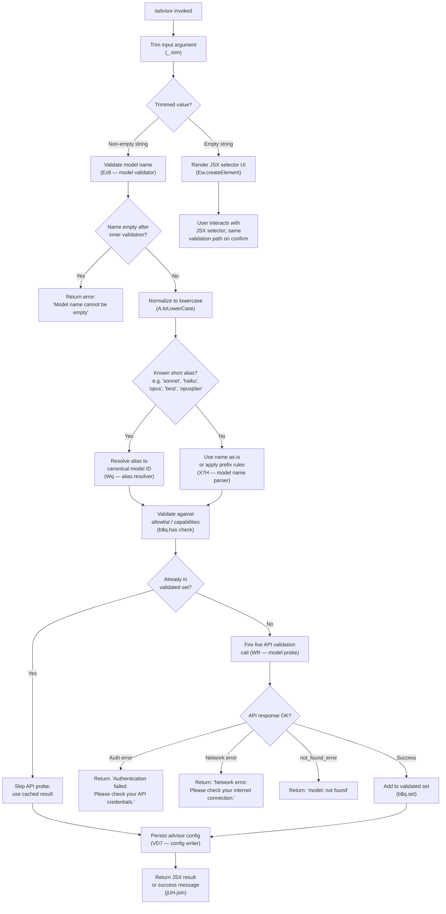

# `/advisor`

> Analysis basis: CC v2.1.132 bundle.js (AST extraction + Claude interpretation)
> Minimum version: v2.1.132

---

## Overview

The `/advisor` command configures the Advisor Tool, which enables Claude Code to consult a stronger or more capable model at key decision points during a task. The command renders a JSX component allowing the user to select or modify the advisor model, and invokes an async handler (`mD7`) that validates the requested model name, performs a live API check to confirm model availability, and persists the configuration into the session's advisor settings. This is a `local-jsx` type command, meaning it renders a React element directly in the CLI rather than submitting a text prompt.

---

## Registration

| Field | Value |
|---|---|
| type | `local-jsx` |
| name | `advisor` |
| description | `Configure the Advisor Tool to consult a stronger model for guidance at key moments during a task` |
| module_id | `U$q` |
| load_inline | `true` |
| argumentHint | *(null)* |
| isHidden | *(null)* |
| handler | `mD7` (resolved via `module_id` path) |
| loc_byte span | `+11314670` – `+11314957` |
| `loc_byte_end` | `11314957` |
| `arbor_handler.name` | `mD7` |
| `arbor_handler.kind` | `AsyncFunction` |
| `arbor_handler.resolution_path` | `module_id` |
| `arbor_handler.fqn` | `claude-2.1.132::mD7` |
| `arbor_handler.n_hits` | `1` |

Analysis basis: CC v2.1.132 bundle.js:+11314670

---

## Input Branching

The handler `mD7` begins by trimming whitespace from any user-supplied argument, then evaluates the trimmed value to decide which execution path to follow.



Analysis basis: CC v2.1.132 bundle.js:+11314129, +11314165, +11306628, +11306771, +11306873, +11307081, +11307328, +11307430, +11307549, +11307631

---

## Behavioral Spec

### 1. Entry Point — Handler Dispatch (`mD7`)

The primary handler is the async function `mD7`, resolved via module `U$q` through the `module_id` resolution path.

```
async function advisorCommandHandler(context):
    rawArg = trim(context.input)
    if rawArg is empty:
        return renderJsxAdvisorSelector(context)
    else:
        return runModelValidationAndPersist(rawArg, context)
```

Analysis basis: CC v2.1.132 bundle.js:+11314129, +11314165, +11314283, +11314297, +11314323

---

### 2. JSX Selector Rendering

When no argument is supplied, a React element is rendered via `Ew.createElement`. The component presents the user with a picker for the advisor model. The literals `"off"` and `"unset"` appear directly in this rendering path and represent valid non-model sentinel states that disable the advisor.

```
function renderJsxAdvisorSelector(context):
    currentValue = getCurrentAdvisorSetting(context)  // may be "off", "unset", or a model ID
    element = createElement(AdvisorSelectorComponent, {
        currentValue: currentValue,
        onSelect: (choice) => runModelValidationAndPersist(choice, context)
    })
    return element
```

Known sentinel values:
- `"off"` — advisor is explicitly disabled (bundle.js:+11314205)
- `"unset"` — advisor has never been configured (bundle.js:+11314216)

Analysis basis: CC v2.1.132 bundle.js:+11314165, +11314205, +11314216

---

### 3. Model Name Validation (`Ez8`)

The model validation function performs the following sequence:

```
function validateModelName(rawName):
    trimmed = trim(rawName)
    if trimmed is empty:
        raise Error("Model name cannot be empty")

    normalized = toLowerCase(trimmed)

    // Check against known model name allowlist (K8H.includes)
    if normalized not in knownModelList:
        // Still allow — proceed to alias resolution and API probe

    // Check in-memory validated-models cache (b$q.has)
    if validatedModelsCache.has(normalized):
        return CachedValidationResult(normalized)

    // Fire live API validation probe
    result = probeModelViaApi(normalized)  // calls WR
    if result is success:
        validatedModelsCache.set(normalized, result)
        return ValidResult(normalized)
    else:
        return ErrorResult(result.errorMessage)
```

Error message constants:
- `"Model name cannot be empty"` (bundle.js:+11306628)
- `"Authentication failed. Please check your API credentials."` (bundle.js:+11307328)
- `"Network error. Please check your internet connection."` (bundle.js:+11307430)
- Model-not-found error includes prefix `"model:"` (bundle.js:+11307631) with the error `type` field checked against `"not_found_error"` (bundle.js:+11307549)

The telemetry event `"model_validation"` (bundle.js:+11306968) is associated with this sub-flow.

Analysis basis: CC v2.1.132 bundle.js:+11306591, +11306628, +11306662, +11306752, +11306771, +11306873, +11306918, +11306968, +11307081

---

### 4. Short-Name Alias Resolution (`Wq`)

The alias resolver maps user-friendly short names to canonical model identifiers. It normalizes the input to lowercase, checks against a known alias table, and applies a replacement if a match is found.

```
function resolveModelAlias(inputName):
    name = trim(inputName)
    lower = toLowerCase(name)

    // Known short aliases (from literals):
    aliasMap = {
        "opusplan": <canonical-opusplan-id>,   // +2114931
        "sonnet":   <canonical-sonnet-id>,     // +2114972
        "haiku":    <canonical-haiku-id>,      // +2115011
        "opus":     <canonical-opus-id>,       // +2115050
        "best":     <canonical-best-id>        // +2115087
    }

    if lower in aliasMap:
        return aliasMap[lower]

    // Also handles "[1m]" marker for 1-minute cache control variant (+2114957)
    // Provider-specific checks: "bedrock", "foundry", "anthropicAws",
    //   "mantle", "vertex", "firstParty" are recognized provider tags

    return applyModelNameReplacement(name)  // _.replace path
```

Analysis basis: CC v2.1.132 bundle.js:+2114835, +2114846, +2114864, +2114874, +2114910, +2114931, +2114949, +2114957, +2114972, +2115011, +2115050, +2115087

---

### 5. Model Name Parsing and Prefix Logic (`X7H`)

When an alias is not matched, the model name parser applies structured prefix and domain rules:

```
function parseModelName(rawName):
    parts = rawName.trim().split(...)     // M.trim, _.map
    
    for each part in parts:
        part = part.trim()
        
        // Anthropic-prefixed names (e.g. "anthropic.<model>")
        if part.startsWith("anthropic."):    // +2109444
            applyAnthropicPrefixRules(part)
        
        // Claude-prefixed names (e.g. "claude-3-*", "claude-opus-4-0")
        if part.startsWith("claude-"):      // +2109064
            applyClaudePrefixRules(part)
        
        // Check against disallowed / restricted model list (q.includes)
        if part in restrictedModelList:
            applyRestriction(part)
        
        // Run capability checks (mb6, PRH, Wd_, deL, ceL)
        validateCapabilities(part)
    
    return resolvedModelDescriptor
```

Named model identifiers present in the literals under this path include:
- `"claude-3-"` prefix group (bundle.js:+2855899)
- `"claude-opus-4-0"` (bundle.js:+2855917)
- `"claude-sonnet-4-0"` (bundle.js:+2855940)
- `"claude-opus-4-7"` (bundle.js:+2856016)
- `"opus-4-7"` / `"opus_4_7"` (bundle.js:+11307898, +11307922)
- `"opus-4-6"` / `"opus_4_6"` (bundle.js:+11307967, +11307991)
- `"opus-4-5"` / `"opus_4_5"` (bundle.js:+11308036, +11308060)
- `"sonnet-4-6"` / `"sonnet_4_6"` (bundle.js:+11308105, +11308131)
- `"sonnet-4-5"` / `"sonnet_4_5"` (bundle.js:+11308180, +11308206)

Analysis basis: CC v2.1.132 bundle.js:+11306662, +2109291, +2109368, +2109379, +2109405, +2109431, +2109444, +2109459, +2109488, +2109538, +2109547, +2109602, +2109623, +2109637, +2109793

---

### 6. Live API Model Probe (`WR`)

When a model name is not cached, a live side-query is dispatched to the Anthropic API (or configured provider endpoint) to verify the model exists and is accessible.

```
async function probeModelViaApi(modelName):
    // Construct a minimal "Hi" probe message (+11307037)
    // with cache control set to "ephemeral" (+11307062)
    // Uses "side_query" request type (+12060746)
    
    headers = buildApiHeaders()    // includes User-Agent, session ID, etc.
    
    // Abort after 10000 ms (+2163833)
    signal = AbortSignal.timeout(10000)
    
    response = await fetch(apiEndpoint, {
        method: "POST",
        headers: headers,
        body: probePayload,
        signal: signal
    })
    
    if response indicates auth failure:
        return AuthError("Authentication failed. Please check your API credentials.")
    
    if response indicates network failure:
        return NetworkError("Network error. Please check your internet connection.")
    
    if response.error.type == "not_found_error":
        return NotFoundError("model: " + modelName + " " + response.error.message)
    
    return Success(modelName)
```

The probe uses `"Hi"` as the message body (bundle.js:+11307037) and `"ephemeral"` cache-control (bundle.js:+11307062). The `"side_query"` label (bundle.js:+12060746) identifies this as a non-primary inference call. A SHA-256 hash (`fxA` → `QPq.createHash`) is used as a request fingerprint (bundle.js:+12019524).

Analysis basis: CC v2.1.132 bundle.js:+11307037, +11307062, +12060714, +12060746, +12060799, +12060831, +12060866, +12061281, +2163813

---

### 7. Configuration Persistence (`VD7` / `vD7`)

After successful validation, the advisor model is persisted to the session configuration:

```
function persistAdvisorConfig(resolvedModelName):
    // Normalize the model name for storage
    normalized = String(resolvedModelName)
    lower = toLowerCase(normalized)
    
    // Check provider-specific routing:
    // "opus-4-7" → "opus_4_7" key form for config storage
    // "sonnet-4-5" → "sonnet_4_5" key form, etc.
    
    // Determine applicable capability flags (A.includes check)
    storageKey = deriveStorageKey(lower)
    
    // Write to configuration via DM (config writer)
    writeAdvisorSetting(storageKey, normalized)
```

The `vD7` function normalizes hyphenated model names to underscore-keyed forms for internal config storage. It also performs a final `A.includes` guard to confirm the model is within the supported advisor model list (bundle.js:+11307887).

Analysis basis: CC v2.1.132 bundle.js:+11307122, +11307177, +11307818, +11307850, +11307868, +11307887, +11307898, +11307922, +11307941

---

### 8. Result Assembly

The handler assembles the final output using `jUH.join` (bundle.js:+11314440), which joins one or more result fragments into the message returned to the CLI display layer.

```
function assembleResult(parts):
    return jUH.join(parts)   // jUH is the result-joining utility
```

Analysis basis: CC v2.1.132 bundle.js:+11314371, +11314440

---

## State & Side Effects

| Item | Detail |
|---|---|
| Telemetry — `tengu_api_success` | Fired after a successful API probe response (bundle.js:+12062168) |
| Telemetry — `tengu_prompt_cache_1h_config` | Fired when a 1-hour prompt-cache configuration is active during the side query (bundle.js:+12024822) |
| Telemetry — `tengu_mcp_retry_failed_remote` | Fired if a remote MCP server fails during the surrounding MCP connection refresh triggered by the command (bundle.js:+13846663) |
| Telemetry — `tengu_bg_spare_enable` | May fire if a background spare session is enabled as a side effect of the command context (bundle.js:+14130767) |
| Telemetry — `tengu_bg_spare_claim` | Fired when a background spare session slot is claimed (bundle.js:+14130886) |
| Telemetry — `tengu_bg_spare_claim_fail` | Fired when a background spare session claim fails (bundle.js:+14131149) |
| Telemetry — `tengu_bg_attach` | Fired on background session attachment events (bundle.js:+14123228) |
| Telemetry — `tengu_bg_dispatch_sigkill_escalate` | Fired when a background dispatch requires SIGKILL escalation (bundle.js:+14129972) |
| Telemetry — `tengu_bg_attach_stall_gave_up` | Fired when an attach stall times out (bundle.js:+14124062) |
| Telemetry — `tengu_bg_attach_stall_respawn` | Fired when a stalled attach triggers a respawn (bundle.js:+14124331) |
| Telemetry — `tengu_bg_proto_mismatch` | Fired on background protocol version mismatch (bundle.js:+14119698) |
| Telemetry — `tengu_bg_dispatch_stale_drop` | Fired when a stale dispatch message is dropped (bundle.js:+14120937) |
| Telemetry — `tengu_bg_attach_legacy_autorespawn` | Fired on legacy PTY auto-respawn during attach (bundle.js:+14122818) |
| Validated-models cache | In-memory Set (`b$q`) is updated via `.set` after successful API probe (bundle.js:+11307081); `.has` is checked to avoid redundant probes (bundle.js:+11306873) |
| Advisor config storage | `vD7` / `VD7` write the selected model name to the session's persistent advisor configuration (bundle.js:+11307122) |
| MCP server refresh | The command's execution context may trigger `$F7` (MCP server refresh), which applies `UZH`, `ZBq`, and related MCP lifecycle functions (bundle.js:+13846699, +13847618, +13847627) |
| Hook registration | <!-- TODO: not found in depth-2 traversal; needs --depth 4 --> |
| appState changes | The advisor model field in app state is updated via the config persistence path |
| Sound | <!-- TODO: not found in depth-2 traversal; needs --depth 4 --> |

---

## Version History

| Version | Change |
|---|---|
| v2.1.132 | Initial analysis. Handler `mD7` confirmed via Arbor `module_id` resolution. Supported advisor models include opus-4-7, opus-4-6, opus-4-5, sonnet-4-6, sonnet-4-5 and aliased short-names. Sentinel values `"off"` and `"unset"` supported. |

---

## Common Mistakes

1. **Supplying a model short-name that is not in the alias table** — Names like `"sonnet"`, `"haiku"`, `"opus"`, `"best"`, and `"opusplan"` are resolved through the alias map (`Wq`). Arbitrary abbreviations not in that table are passed to the full model name parser and may fail the API probe with a `not_found_error`.

2. **Expecting `/advisor` to immediately activate on the current task** — The command configures the advisor setting for future key moments; it does not inject the advisor model into the currently running agent loop immediately upon invocation.

3. **Setting the advisor model to the same model already in use** — The command does not warn when the advisor model matches the primary model. The user is responsible for ensuring the advisor is a genuinely stronger or different model.

4. **Ignoring `"off"` and `"unset"` as valid values** — Passing `"off"` disables the advisor. Passing nothing (empty input) opens the interactive JSX selector. These are distinct behaviors; a string like `"off"` bypasses the validation and persistence path and is handled as a sentinel directly.

5. **Assuming API validation is instant** — The live probe uses `AbortSignal.timeout(10000)` (10-second limit, bundle.js:+2163833). On slow networks the command may pause noticeably before confirming or rejecting a model name.

6. **Re-running `/advisor` after a network error thinking the config was saved** — A network error during the probe prevents `b$q.set` from being called, so the model is not cached and the advisor configuration is not persisted. The user must retry once connectivity is restored.

---

## Appendix — Identifier Mapping

> For bundle debugging only. Identifiers change across versions.

| Identifier | Role |
|---|---|
| `mD7` | Primary async handler for the `/advisor` command (Arbor-resolved entry point) |
| `Ez8` | Model name validation function; trims, normalizes, checks cache, fires API probe |
| `Wq` | Short-name alias resolver; maps `"sonnet"`, `"haiku"`, `"opus"`, `"best"`, `"opusplan"` to canonical IDs |
| `X7H` | Structured model name parser; applies prefix rules (`anthropic.`, `claude-`) and capability checks |
| `WR` | Live API side-query dispatcher; fires the probe request to confirm model availability |
| `VD7` | Advisor config write coordinator; delegates to `vD7` for normalized key storage |
| `vD7` | Low-level config writer; normalizes hyphenated model names to underscore keys, writes advisor setting |
| `b$q` | In-memory validated-models cache (Set); `.has` = read, `.set` = write |
| `jf6` | Post-persistence finalizer; lowercases and checks includes before returning |
| `jUH` | Result-joining utility; assembles final output fragments |
| `f8H` | Model capability / allowlist checker used within alias resolution and parsing paths |
| `PRH` | Restricted-model-list checker (`QeL.includes`); guards against disallowed model names |
| `Wd_` | Model index finder; used within structured name parsing (`_.indexOf`) |
| `deL` | Alias-aware model name dispatcher combining `f8H` and `Wq` |
| `ceL` | Composite model-name validator combining capability check, alias resolution, and prefix guard |
| `Pd_` | Prefix-check helper (`H.startsWith`) used inside `ceL` |
| `mb6` | Model entry lookup via `uA` and `Object.entries`; used in name resolution |
| `uA` | Underlying model-entry accessor |
| `FV` | Model resolution pipeline entry (calls `zM` then `DM`) |
| `zM` | Model descriptor builder (calls `g_`) |
| `DM` | Model metadata enricher; calls `MNH`, `XaL`, `Kx_`, `ub6`, `g_` |
| `XaL` | Model attribute assembler |
| `Kx_` | Model properties object builder (`Object.entries`) |
| `ub6` | Model registry lookup (`dU8.find`) |
| `MNH` | Model name helper |
| `g_` | Base model string normalizer (calls `yH`) |
| `yH` | String conversion utility (wraps `String`) |
| `m0` | Model registry accessor (calls `O8H`) |
| `O8H` | Model registry data source (calls `yH`) |
| `WRH` | Model wrapper calling `DM` |
| `jk` | Model pipeline combiner (`zM` + `DM`) |
| `Gd_` | Model pipeline entry delegating to `jk` |
| `Ou6` | Model list filter (`leL.includes`) |
| `GRH` | Model group resolver (calls `yH`) |
| `UZH` | MCP server connection initializer; handles transport types stdio/sse/http/sse-ide/ws-ide |
| `ZBq` | MCP update applier (`H.applyMcpUpdate`, cleanup, etc.) |
| `$F7` | MCP server refresh orchestrator; calls `UZH`, `ZBq`, `Object.fromEntries` |
| `k` | Model string formatter; handles uppercasing, trimming, debug labeling |
| `j6` | Seen-models deduplication tracker (`V5H.has`, `kq6.add`, `mU.get`) |
| `M` | Session model state manager; calls `UZH`, `ZBq`, `K.get`, `K.values`, `$F7` |
| `$` | Session cleanup helper (calls `mzq`) |
| `IPH` | Model provider resolver combining `Gq`, `_S`, `nw` |
| `Gq` | Model identifier classifier; checks `application-inference-profile`, claude model variants |
| `_S` | Provider-specific path resolver (calls `g_`) |
| `nw` | Provider normalization helper (`xb6`, `JaL`, `g_`, `Lx_`) |
| `vF6` | Model variant probe (calls `Gq`) |
| `JE7` | Side-query message builder (`H.find`, `_.find`) |
| `fxA` | Request fingerprint generator (SHA-256 via `QPq.createHash`) |
| `tQ6` | Context store accessor (calls `Iq`, `g_`, `UF6`, `k`) |
| `sQ6` | Supplementary context resolver (calls `g_`) |
| `UF6` | Async-local storage accessor (`m41.getStore`) |
| `Iq` | String identity wrapper |
| `g1H` | Main-thread prompt-cache configuration handler; fires `tengu_prompt_cache_1h_config` |
| `kk` | Model flag builder (calls `xo8`, `yH`) |
| `xo8` | Flag string normalizer (calls `g_`) |
| `vP` | Model name sanitizer (`H.replace`) |
| `ofH` | Request object builder (calls `Z9`, `k`, `RH`, `hU`, `g7`, `v6`) |
| `RH` | JSON serializer wrapper (`JSON.stringify`) |
| `hU` | Random bytes generator (`xJ1.randomBytes`) |
| `g7` | Nonce builder (`nY`, `R6`) |
| `S76` | Provider backend router (calls `GFK`, `fH`) |
| `GFK` | Backend capability checker (`oWH`, `MLA.has`) |
| `fH` | Authentication helper (`HA`, `yH`, `kq`, `$wL`, `EQ.logError`) |
| `ha` | Auth token resolver (calls `WFK`, `fH`) |
| `WFK` | Token format handler; strips prefixes, calls `fLA`, `B9A`, `JMH` |
| `toH` | Final request dispatcher |
| `fx` | Full API request execution pipeline |
| `WwH` | Request wrapper or filter |
| `d` | Low-level transport or state object |
| `RwH` | Model-routing header resolver (`yrq.find`, `yG6`) |
| `RRH` | Provider-specific auth header builder; handles `wif_token_exchange`, `mH`, `UHK` |
| `Uu6` | WIF credential resolver (`wif_credentials_resolve`, `fetch`, `AbortSignal.timeout`) |
| `P` | Token provider (`gX8`, `HN`, `qm`, `fH`, `HA`) |
| `CS6` | Proxy auth helper executor (30-second timeout, `Date.now`, `IuL`, `AU`, `TP`) |
| `BzK` | SSE/streaming session manager (`cK1.randomUUID`, `M.has`, `M.set`, `M.get`) |
| `mzK` | Stream line parser (`A.split`, `q.trim`, `q.indexOf`, `q.slice`) |
| `G9` | Background transport type resolver (`Tr`) |
| `Mx` | SDK version/info block (`UF6`) |
| `uzK` | Stream event processor (`GF6`, `eT`, `INH`, `RwH`, `__`) |
| `GF6` | Stream event classifier (`Gq`, `Lj`, `eT`) |
| `WF6` | Header normalizer (`Object.entries`, `q.toLowerCase`) |
| `zX` | Auth error handler (`yH`, `AU`, `o6H`, `Wk6`, `oE_`) |
| `TPH` | SDK error logger (`console.error`) |
| `L7` | Request lifecycle handler (`no8`) |
| `R_` | Retry policy executor (`nY`, `fU`, `E_`) |
| `xzK` | Stream buffer handler (`HbH`) |
| `vA` | Request context carrier |
| `GS` | Response normalizer (`db6`, `tL`, `B96`, `Dr`, `zx`, `yH`) |
| `Hj` | Response result builder (`o$`) |
| `v` | Focus/blur timing tracker (`BU`, `Date.now`, `Math.min`, `Z`, `I`, `HRq`) |
| `X2q` | Request metadata builder |
| `w` | Background process manager (`bm.spawn`, `R.dispose`, `j6`, `mH`, `SH`) |
| `X` | Background IPC channel handler (`Buffer.concat`, `uQ7`, `vH`) |
| `j` | IPC message framer (`w`) |
| `$f` | IPC connection closer (`H.end`, `RH`) |
| `uQ7` | Background daemon protocol handler; processes ping/pong, nudge, yield, lease, shutdown, kill, reply, resize, attach, snapshot, stream, state, subscribe |
| `BU` | Focus state tracker |
| `HRq` | Focus/blur event handler |
| `q08` | Cache control flag resolver |
| `L08` | Long-context flag resolver |
| `E` | Remote control event handler (`u.preventDefault`, `CP`, `D`, `H`) |
| `G` | Session-state evaluator (`Qw6`, `gX8`) |
| `I` | Request identity object |
| `Z` | Timeout/interval state holder |