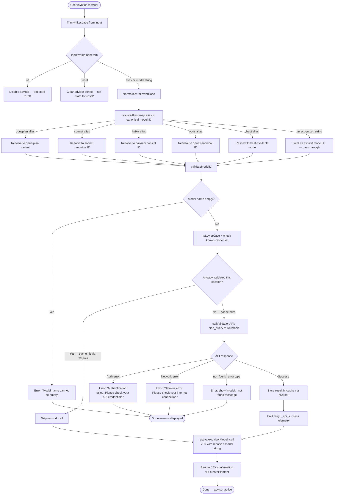

# `/advisor`

> Analysis basis: CC v2.1.132 bundle.js (AST extraction + Claude interpretation)
> Minimum version: v2.1.132

---

## Overview

The `/advisor` slash command configures the **Advisor Tool**, which enables Claude Code to consult a stronger or alternative model at key decision points during a task. Users invoke the command to select a target model (or disable the feature), and Claude Code validates, resolves, and activates that model as the advisory backend. This provides a mechanism for lightweight models to escalate complex reasoning to a more capable peer without leaving the current session.

---

## Registration

| Field | Value |
|---|---|
| type | `local-jsx` |
| name | `advisor` |
| description | Configure the Advisor Tool to consult a stronger model for guidance at key moments during a task |
| argumentHint | *(null — no argument hint displayed)* |
| module_id | `U$q` |

Analysis basis: CC v2.1.132 bundle.js:+11314670

---

## Input Branching

The command entry point (`commandHandler`) trims the raw user input, then routes through three major phases: **alias resolution → model validation → model activation**.



Analysis basis: CC v2.1.132 bundle.js:+11314129, +11314205, +11314216, +11306628, +11306752, +11306873, +11307081, +12060746, +12062168

---

## Behavioral Spec

### 1. Command Entry Point — Input Normalization

```
function commandHandler(rawInput):
    trimmed = rawInput.trim()                      // bundle.js:+11314129

    if trimmed == "off":
        disableAdvisor()                           // bundle.js:+11314205
        return renderConfirmation("off")

    if trimmed == "unset":
        clearAdvisorConfig()                       // bundle.js:+11314216
        return renderConfirmation("unset")

    normalized = trimmed.toLowerCase()
    canonicalId = resolveAlias(normalized)
    result = validateAndActivate(canonicalId)
    return renderJSX(result)                       // bundle.js:+11314165
```

Analysis basis: CC v2.1.132 bundle.js:+11314129, +11314205, +11314216, +11314165

---

### 2. Alias Resolution

The alias resolver maps short friendly names to canonical model identifiers. It first lowercases the input, then matches against a fixed alias table. Unmatched strings are forwarded unchanged as explicit model IDs.

```
function resolveAlias(normalizedInput):
    // Aliases recognized (bundle.js:+2114931, +2114972, +2115011, +2115050, +2115087)
    aliasTable = {
        "opusplan": <opus-plan-canonical>,
        "sonnet":   <sonnet-canonical>,
        "haiku":    <haiku-canonical>,
        "opus":     <opus-canonical>,
        "best":     <best-available-canonical>,
    }

    // Annotated token "[1m]" observed in alias processing path (bundle.js:+2114957)
    // Likely a terminal formatting marker, not a user-facing alias.

    if normalizedInput in aliasTable:
        return aliasTable[normalizedInput]

    // Check provider prefix — IDs starting with "anthropic." are
    // treated as first-party and routed accordingly (bundle.js:+2109444)
    if normalizedInput.startsWith("anthropic."):
        return routeFirstPartyModel(normalizedInput)

    return normalizedInput   // pass-through as explicit model ID
```

Known model strings present in the implementation (used by `checkKnownModels`):
- `"opus-4-7"` (bundle.js:+5038116)
- `"opus-4-6"` (bundle.js:+5038140)
- `"sonnet-4-6"` (bundle.js:+5038164)

Analysis basis: CC v2.1.132 bundle.js:+2114931, +2114972, +2115011, +2115050, +2115087, +2109444, +5038116, +5038140, +5038164

---

### 3. Model Validation

Validation is a two-stage process: a fast in-memory cache check, followed by a live network probe when the model has not been seen before in this session.

```
function validateModelId(modelId):
    if modelId is empty or blank:
        raise UserError("Model name cannot be empty")   // bundle.js:+11306628

    normalized = modelId.toLowerCase()                  // bundle.js:+11306752

    if sessionCache.has(normalized):                    // bundle.js:+11306873
        return sessionCache.get(normalized)             // cache hit — skip network

    // Network probe — dispatched as a "side_query" (bundle.js:+12060746)
    response = callValidationAPI(normalized)

    if response is auth_error:
        raise UserError("Authentication failed. Please check your API credentials.")
        // bundle.js:+11307328

    if response is network_error:
        raise UserError("Network error. Please check your internet connection.")
        // bundle.js:+11307430

    if response.type == "not_found_error":              // bundle.js:+11307549
        raise UserError("model: " + modelId + " not found")
        // bundle.js:+11307631

    sessionCache.set(normalized, response)              // bundle.js:+11307081
    emitTelemetry("tengu_api_success")                  // bundle.js:+12062168
    return response
```

Analysis basis: CC v2.1.132 bundle.js:+11306628, +11306752, +11306873, +11307081, +11307328, +11307430, +11307549, +11307631, +12062168

---

### 4. Validation API Call — Side Query

The network probe sends a minimal validation message to the Anthropic API using the `side_query` label. The request is constructed with an ephemeral cache hint and a stub user message, then dispatched via `globalThis.fetch`.

```
function callValidationAPI(modelId):
    // Max tokens for probe: 1024 (bundle.js:+12060562)
    // Stub message role: "user" (bundle.js:+11307003)
    // Stub message content: "Hi" (bundle.js:+11307037)
    // Cache control: "ephemeral" (bundle.js:+11307062)
    // Request type label: "side_query" (bundle.js:+12060746)
    // Request source: "@anthropic-ai/claude-code" v2.1.132 (bundle.js:+12061106)
    // Build timestamp: "2026-05-06T17:56:43Z" (bundle.js:+12061195)
    // Build SHA: "f9c2aef1b03555fabbb4ec60302d6750f2ff689e" (bundle.js:+12061226)

    payload = buildMinimalPayload(
        model    = modelId,
        messages = [{ role: "user", content: "Hi" }],
        maxTokens = 1024,
        cacheControl = "ephemeral",
        stream = false
    )

    // Deduplication: if identical modelId is already in-flight, skip (bundle.js:+12060866/882)
    if inFlightRequests.includes(modelId):
        return waitForExistingResult(modelId)
    inFlightRequests.push(modelId)

    raw = await globalThis.fetch(anthropicEndpoint, payload)  // bundle.js:+12060799

    // Response contains "text" content type (bundle.js:+12061299)
    // advisor feature flag may be "disabled" or "enabled" in response (bundle.js:+12061493, +12061532)
    // Rate-limit window observed: "1h" (bundle.js:+12061598)

    return parseResponse(raw)
```

Analysis basis: CC v2.1.132 bundle.js:+12060562, +12060746, +12060799, +12061106, +12061195, +12061226, +11307003, +11307037, +11307062, +12061299, +12061493, +12061532, +12061598

---

### 5. Model Activation

After successful validation, the resolved model identifier is committed to application state.

```
function activateAdvisorModel(canonicalModelId):
    // Calls into the advisor state writer (VD7), which:
    //   1. Delegates to the internal state setter (vD7)    // bundle.js:+11307177
    //   2. Coerces the value to String for storage         // bundle.js:+11307818
    stringId = String(canonicalModelId)
    advisorStateWriter(stringId)
```

Analysis basis: CC v2.1.132 bundle.js:+11307122, +11307177, +11307818

---

### 6. JSX Rendering and Display

The command renders its confirmation output using `Ew.createElement` (React-compatible JSX factory). The current list of available model aliases is joined with `", "` as the separator for display purposes.

```
function renderConfirmation(resolvedState, availableAliases):
    // Separator for alias list display: ", " (bundle.js:+11314449)
    displayList = availableAliases.join(", ")

    // Checks whether the active model is in the "opus-4-7"-class family
    // for conditional display logic (bundle.js:+11314371, +5038116)
    isOpus47Family = checkModelFamily(resolvedState)

    return createElement(
        ConfirmationComponent,
        { state: resolvedState, modelList: displayList, highlightOpus: isOpus47Family }
    )
```

Analysis basis: CC v2.1.132 bundle.js:+11314165, +11314283, +11314297, +11314371, +11314440, +11314449

---

### 7. Route Closing on Navigation

When the advisor dialog or panel is closed (e.g., user navigates away), two close handlers are invoked in sequence. A numeric index `0` is used to target the initial panel position.

```
function onClose():
    primaryPanel.close(0)     // bundle.js:+14139789, +14139791
    secondaryPanel.close()    // bundle.js:+14139801
    invokeCloseCallback()     // bundle.js:+14139941
```

Analysis basis: CC v2.1.132 bundle.js:+14139789, +14139791, +14139801, +14139941

---

### 8. Random Retry / Jitter (Internal Helper)

An internal helper reachable from the alias resolution path applies jitter to retry timing. This is consistent with retry-with-backoff logic for transient API failures.

```
function jitteredDelay(baseDelayMs):
    // Uses Math.random() with multiplier 2 and additive offset 1
    // (bundle.js:+12264283, +12264285, +12264299)
    jitter = Math.random() * 2 + 1
    setTimeout(retryCallback, baseDelayMs * jitter)
```

Analysis basis: CC v2.1.132 bundle.js:+12264283, +12264285, +12264299, +12264322

---

### 9. Provider Routing

The model ID's provider affiliation is determined via a routing check. Two recognized provider labels are `"firstParty"` and `"anthropicAws"`.

```
function resolveProviderRoute(modelId):
    providerTag = getProviderTag(modelId)    // bundle.js:+1975862
    if providerTag == "firstParty":          // bundle.js:+1975879
        return routeToFirstPartyEndpoint()
    if providerTag == "anthropicAws":        // bundle.js:+1975897
        return routeToAwsEndpoint()
    return routeToDefaultEndpoint()
```

Analysis basis: CC v2.1.132 bundle.js:+1975862, +1975879, +1975897

---

### 10. Known-Model Inclusion Check

Before the network probe, the validator checks whether the normalized model ID appears in a static set of known Anthropic-prefixed model strings (`K8H`). If found, some validation branches are short-circuited.

```
function checkKnownModels(normalizedId):
    // K8H is the static known-model set (bundle.js:+11306771, +2108592)
    // Membership check also used in the multi-model parse path (bundle.js:+2109459)
    if knownModelSet.includes(normalizedId):
        return KNOWN_MODEL
    return UNKNOWN_MODEL
```

Analysis basis: CC v2.1.132 bundle.js:+11306771, +2108592, +2109459

---

## State & Side Effects

| Item | Detail |
|---|---|
| Telemetry | `tengu_api_success` — emitted after a successful model validation API call (bundle.js:+12062168) |
| Session cache | Model IDs that pass validation are stored in a `Map`-like structure (`b$q`) keyed by normalized (lowercased) model ID; persists for the lifetime of the session (bundle.js:+11306873, +11307081) |
| In-flight deduplication | Model IDs currently being validated are tracked in an array (`G`); duplicate concurrent requests are suppressed (bundle.js:+12060866, +12060882) |
| Advisor state | Written to application state via `advisorStateWriter`; stored as a `String`; special values `"off"` and `"unset"` have distinct semantic meanings (bundle.js:+11307818, +11314205, +11314216) |
| Panel close handlers | Two close handlers (`primaryPanel.close`, `secondaryPanel.close`) are fired on dialog dismissal (bundle.js:+14139791, +14139801) |
| Network side effect | `globalThis.fetch` to the Anthropic API endpoint is called for unrecognized model IDs; labeled internally as `"side_query"` (bundle.js:+12060799, +12060746) |
| JSX rendering | Output is rendered via `Ew.createElement` (React-compatible); no DOM mutation outside of the normal CC UI component tree (bundle.js:+11314165) |
| Sound | <!-- TODO: not found in depth-2 traversal; needs --depth 4 --> |

---

## Version History

| Version | Change |
|---|---|
| v2.1.132 | Initial analysis. `/advisor` command registered as `local-jsx`. Validation API uses `side_query` label. Known aliases: `opusplan`, `sonnet`, `haiku`, `opus`, `best`. Known models: `opus-4-7`, `opus-4-6`, `sonnet-4-6`. |

---

## Common Mistakes

1. **Passing a model name with leading/trailing whitespace** — The command trims input automatically, but embedded spaces within a model ID are not stripped and will cause a validation failure if the API does not recognize the resulting string.

2. **Using `"off"` and `"unset"` interchangeably** — These are distinct states. `"off"` explicitly disables the advisor; `"unset"` clears the configuration entirely (returning to default behavior). Using the wrong one may leave the advisor in an unexpected state.

3. **Expecting instant re-validation** — Validated model IDs are cached for the session. If a model is removed or restricted server-side during an active session, `/advisor <model>` will appear to succeed because the cache reports a prior success.

4. **Using the full API model path instead of an alias** — Short aliases (`sonnet`, `opus`, etc.) are resolved internally. Using a raw API model string that is not in the known-model set will trigger a live network probe, which adds latency.

5. **Invoking `/advisor` without arguments** — The command expects either a model name/alias or a control keyword (`off`/`unset`). Providing no argument results in empty input after trimming, which falls through to the validation path with an empty string and produces the "Model name cannot be empty" error.

6. **Assuming `"best"` always resolves to the same model** — The `"best"` alias resolves dynamically and may change across Claude Code versions as new models are released.

---

## Appendix — Identifier Mapping

> For bundle debugging only. Identifiers change across versions.

| Identifier | Role |
|---|---|
| `mD7` | Command entry-point / handler function for `/advisor` |
| `_` | Intermediate closure or utility scope within the command handler |
| `f` | Panel / dialog close coordinator |
| `Wq` | Alias resolution function |
| `H` | Jitter / retry delay helper; also used as a trim target in multiple paths |
| `A` | Input string being normalized (toLowerCase, replace targets) |
| `m0` | Sub-resolver called during alias lookup |
| `f8H` | Known-model inclusion checker |
| `FV` | Provider route dispatcher (firstParty / anthropicAws branch) |
| `WRH` | Secondary provider dispatch helper |
| `jk` | Internal model route resolver (calls `zM` and `DM`) |
| `Gd_` | Wrapper that delegates to `jk` for alias-to-route mapping |
| `zM` | First-party endpoint router |
| `Ou6` | List-inclusion checker (checks model ID against `leL`) |
| `GRH` | Response handler helper (`yH` delegation) |
| `Ez8` | Model validation orchestrator (trim → normalize → cache → API → activate) |
| `X7H` | Multi-model string parser (splits, trims, maps multiple model IDs) |
| `WR` | Validation API caller (`side_query` fetch, dedup, response parse) |
| `VD7` | Advisor state writer (delegates to `vD7`, coerces to String) |
| `jf6` | Model-family membership checker (identifies opus-4-7-class models) |