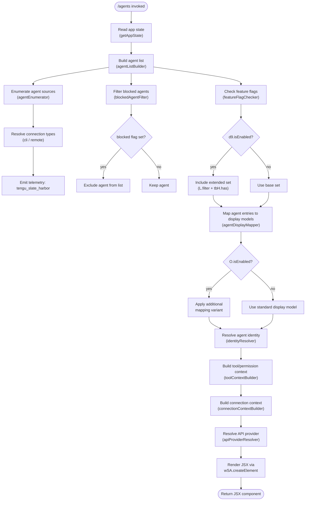

# `/agents`

> Analysis basis: CC v2.1.132 bundle.js (AST extraction + Claude interpretation)
> Minimum version: v2.1.132

---

## Overview

The `/agents` command provides an interactive management interface for agent configurations within Claude Code. It is implemented as a `local-jsx` command that renders a React element, allowing users to view, create, configure, and remove agent definitions from within the CLI session. The handler is an async function (`Wz7`) that reads application state, assembles an agent list, and returns a JSX component for display.

---

## Registration

| Field | Value |
|---|---|
| type | `local-jsx` |
| name | `agents` |
| description | `Manage agent configurations` |
| module_id | `Y3q` |
| load_inline | `true` |
| handler | `Wz7` (AsyncFunction, resolved via `module_id` path) |
| loc_byte span | `11253411` – `11253536` |
| `loc_byte_end` | `11253536` |
| `arbor_handler.name` | `Wz7` |
| `arbor_handler.kind` | `AsyncFunction` |
| `arbor_handler.resolution_path` | `module_id` |
| `arbor_handler.fqn` | `claude-2.1.132::Wz7` |
| `arbor_handler.n_hits` | `0` |

Analysis basis: CC v2.1.132 bundle.js:+11253411

---

## Input Branching

The handler (`Wz7`) first reads current application state, then delegates to the agent-list builder (`NT`). The builder performs a multi-stage pipeline: it enumerates available agents, resolves their connection types, filters blocked entries, checks feature flags, and finally produces the JSX tree. Below is the top-level flow.



Analysis basis: CC v2.1.132 bundle.js:+11253218 (handler entry), +8877018 (agentListBuilder pipeline), +8877280 (feature-flag check)

---

## Behavioral Spec

### 1. Handler Entry Point

```
async function agentsCommandHandler(context):
    appState = getAppState()                   // reads current app state
    agentListComponent = buildAgentList(appState)
    element = createElement(agentListComponent)
    return element
```

Analysis basis: CC v2.1.132 bundle.js:+11253218, +11253258, +11253271

---

### 2. Agent Enumeration and Connection-Type Resolution

The agent enumerator (`zj`) iterates over known agent sources and classifies each by its connection type. Two recognised values are the string literals `"cli"` and `"remote"`.

```
function enumerateAgents(sourceList):
    results = []
    for each source in sourceList:
        agentEntry = resolveAgentEntry(source)     // ch / Iq helpers
        agentEntry.connectionType = resolveConnectionType(source)
        // connectionType is one of: "cli" | "remote"
        results.append(agentEntry)
    emitTelemetry("tengu_slate_harbor")
    return results
```

SDK-type literals encountered within this path: `"sdk-ts"`, `"sdk-py"`, `"sdk-cli"`, `"local-agent"`.  
Analysis basis: CC v2.1.132 bundle.js:+3134143, +3134295, +3134306, +3134552–3134595, +3134325 (telemetry)

---

### 3. Agent-Teams Flag and List Filtering

The list builder checks for the `--agent-teams` CLI argument before enabling team-level agent grouping. This is a compile-time string constant consumed by the list-builder helper (`l1`).

```
function applyAgentTeamsFilter(agentList, cliArgs):
    if "--agent-teams" in cliArgs:
        groupedList = groupByTeam(agentList)        // TXK helper
        return buildTeamEntries(groupedList)         // j6 helper
    else:
        return agentList
```

Telemetry `tengu_amber_flint` is emitted within this path.  
Analysis basis: CC v2.1.132 bundle.js:+3059085, +3059194, +3059197 (telemetry)

---

### 4. Blocked-Agent Filtering

The pipeline filters agents whose status is marked `"blocked"` before presenting them to the user.

```
function filterBlockedAgents(agentList):
    return agentList.filter(agent =>
        agent.status != "blocked"
    )
```

Analysis basis: CC v2.1.132 bundle.js:+8876386, +8876401, +8876447

---

### 5. Feature-Flag Gating

Two feature flags govern which agents are surfaced.

```
function applyFeatureFlags(agentList):
    if featureFlagChecker.isEnabled():          // d9.isEnabled
        extended = agentList.filter(agent =>
            knownAgentSet.has(agent.id)         // tbH.has
        )
        mapped = extended.map(agent =>
            buildDisplayModel(agent)            // MD helper
        )
        if secondaryFlag.isEnabled():           // O.isEnabled
            return mapped.map(agent =>
                applyAlternateMapping(agent)    // Q8 helper
            )
        return mapped
    else:
        baseList = agentList.filter(...)
        return baseList
```

Analysis basis: CC v2.1.132 bundle.js:+8877280 (d9.isEnabled), +8877356, +8877371 (tbH.has), +8877399, +8877410 (O.isEnabled), +8877452 (MD)

---

### 6. Connection Context Builder

For each agent that passes filtering, the connection context is built by `cx`. On Windows the path handling takes a different branch (string literal `"windows"` detected).

```
function buildConnectionContext(agent):
    if platform == "windows":
        path = buildWindowsPath(agent)      // s6 helper
    else:
        path = buildPosixPath(agent)        // yH / Iq helpers
    context = assembleContext(path, agent)  // J6H, j6 helpers
    emitTelemetry("tengu_cobalt_ridge")
    return context
```

Analysis basis: CC v2.1.132 bundle.js:+4258711, +4258718, +4258735, +4258744, +4258780, +4258809, +4258812 (telemetry)

---

### 7. API Provider Resolution

The provider resolver (`g_`) maps the active API endpoint to a canonical provider name. The following provider identifiers are recognised:

| Literal | Meaning |
|---|---|
| `"bedrock"` | Amazon Bedrock |
| `"foundry"` | Azure AI Foundry |
| `"anthropicAws"` | Anthropic-on-AWS |
| `"mantle"` | Mantle |
| `"vertex"` | Google Vertex AI |
| `"firstParty"` | Direct Anthropic API |
| `"api.anthropic.com"` | First-party endpoint hostname |

When the provider is Vertex AI, tool-search is explicitly disabled unless `ENABLE_TOOL_SEARCH=true` is set; the literal message `"[ToolSearch:optimistic] disabled: Vertex AI does not accept the tool-search beta header. Set ENABLE_TOOL_SEARCH=true to override."` is emitted in that case.

Analysis basis: CC v2.1.132 bundle.js:+1975229, +1975269, +1975319, +1975375, +1975429, +1975477, +1975486, +1976104, +9360687

---

### 8. Agent Display Model Builder

Each agent entry is converted to a display model via the `agentDisplayMapper` (`Bt`). The mapper applies up to three sub-renderers (for different visual sections) and then delegates to the agent-groups renderer (`JGA`). It also invokes an agent-status checker (`OU9`) and a text-transformation helper (`tu`).

```
function buildAgentDisplayModel(agent, appState):
    base = resolveBaseLayout(agent)          // _L helper
    base.primary   = renderPrimarySection(agent)    // FB4 → dp9 + nA
    base.secondary = renderSecondarySection(agent)  // UB4 → Ip9 + nA
    base.tertiary  = renderTertiarySection(agent)   // BB4 → hp9 + nA
    base.groups    = renderAgentGroups(agent)        // JGA
    base.status    = checkAgentStatus(agent)         // OU9
    base.label     = transformLabel(agent.label)     // tu → xTA + k
    return base
```

Analysis basis: CC v2.1.132 bundle.js:+8875784, +8875800, +8875904, +8875981, +8876052, +8876071, +8876112, +8876118, +8876124, +8876275, +8876316, +8876343

---

### 9. Label Transformation Logic

The label transformer (`tu` → `xTA` → `k`) performs the following normalisation steps:

```
function transformAgentLabel(label):
    mode = determineMode(label)        // "standard" | "tst" | "tst-auto"
    if mode == "tst":
        truncate label at 100 chars    // literal 100
    else if mode == "tst-auto":
        apply auto-transform rules
    else:
        // standard path
        pass

    if label contains debug markers:   // "debug" literal
        apply debug formatting

    label = label.toUpperCase() if applicable
    label = label.trim()
    return label
```

Recognised mode literals: `"standard"` (bundle.js:+9359673), `"tst"` (bundle.js:+9359752), `"tst-auto"` (bundle.js:+9359802). Truncation limit: 100 characters (bundle.js:+9359765).

Analysis basis: CC v2.1.132 bundle.js:+9360151, +9360191, +161637, +161661, +161763, +161786

---

### 10. Daemon Status Check

The daemon status file path is constructed via `PX6`, which joins paths using the literal filename `"daemon.status.json"`. This file is read as part of the agent status resolution pipeline.

```
function resolveDaemonStatus(basePath):
    statusPath = path.join(basePath, "daemon.status.json")
    raw = readFile(statusPath, encoding="utf8")
    return parseStatus(raw)
```

Analysis basis: CC v2.1.132 bundle.js:+11389877, +11389886, +11389891

---

### 11. Persistent State Write (mzq)

When an agent configuration change is committed, the state writer (`mzq`) performs an atomic file write:

```
function writeAgentConfig(config, basePath):
    id = generateId(Er)                  // uses Date.now()
    tempPath = buildTempPath(PX6)
    randomSuffix = randomBytes(4).toString("hex")   // 4-byte hex nonce
    write(tempPath, serialize(config), encoding="utf8")
    rename(tempPath, finalPath)
    // conditional copy/unlink depending on change flags
    // z41.has / D41.has guard copy vs unlink paths
    updateCache(lY, RH)                  // RH uses JSON.stringify
```

Analysis basis: CC v2.1.132 bundle.js:+11390003, +11390035, +2861114, +2861130, +2861142, +2861161, +2861188, +2861214, +2861265, +2861287, +2861316, +2861341

---

### 12. Boolean Literal Normalisation

Several sub-helpers normalise user-supplied boolean-like strings. Recognised truthy tokens: `"yes"`, `"on"`. Recognised falsy tokens: `"no"`, `"off"`.

Analysis basis: CC v2.1.132 bundle.js:+25237, +25243, +25388, +25393

---

## State & Side Effects

| Item | Detail |
|---|---|
| Telemetry — `tengu_slate_harbor` | Emitted after agent enumeration and connection-type resolution (bundle.js:+3134325) |
| Telemetry — `tengu_cobalt_ridge` | Emitted after connection-context assembly (bundle.js:+4258812) |
| Telemetry — `tengu_amber_flint` | Emitted within the agent-teams filter/grouping path (bundle.js:+3059197) |
| App state read | `getAppState()` called at handler entry (bundle.js:+11253218) |
| JSX rendering | `wSA.createElement` called to produce the returned component (bundle.js:+11253271) |
| File system — read | `daemon.status.json` read during status check (bundle.js:+11389891) |
| File system — atomic write | Temp-file write + rename pattern used when persisting config changes (bundle.js:+2861161, +2861214) |
| File system — copy/unlink | Conditional copy or unlink of agent config files guarded by set-membership checks (bundle.js:+2861287, +2861341) |
| Random bytes | 4-byte cryptographic nonce generated for temp-file naming (bundle.js:+2861114, +2861130) |
| Process exit | `process.exit` reachable through the uncaught-error path labelled `"spare_uncaught"` (bundle.js:+14110289, +14110307) |
| Hook registration | `nA` registers module hooks using `J06.call` and `j06.bind` patterns; `QFA.set` records the registration (bundle.js:+1603, +1630, +1692) |

---

## Version History

| Version | Change |
|---|---|
| v2.1.132 | Initial analysis — `local-jsx` command registered at bundle.js:+11253411; handler `Wz7` resolved via `module_id` path |

---

## Common Mistakes

1. **Assuming `/agents` accepts free-form text arguments.** The command is a `local-jsx` type; it renders a React component rather than forwarding text to a language-model agent. Passing arguments beyond what the UI layer consumes will have no effect.

2. **Expecting `--agent-teams` to be active by default.** The team-grouping branch is only entered when the `--agent-teams` CLI argument is explicitly present; without it, agents are listed flat.

3. **Confusing `"cli"` and `"remote"` connection types.** Each has a different path-resolution branch. Misconfiguring a remote agent as `cli` (or vice-versa) will cause the connection-context builder to produce an incorrect path.

4. **Assuming Vertex AI supports tool-search.** The provider resolver explicitly disables tool-search for Vertex AI endpoints unless `ENABLE_TOOL_SEARCH=true` is set in the environment. This is a known limitation documented inline in the bundle.

5. **Treating `daemon.status.json` as optional.** The daemon status file is read unconditionally during agent status resolution. A missing or malformed file in the expected base path may cause the status check to fail silently or surface an error in the component.

6. **Expecting synchronous config writes.** The `writeAgentConfig` path uses an async rename-based atomic write; callers must await the result before assuming the configuration is persisted.

---

## Appendix — Identifier Mapping

> For bundle debugging only. Identifiers change across versions.

| Identifier | Role |
|---|---|
| `Wz7` | Main async handler for `/agents` command (AsyncFunction, module `Y3q`) |
| `A` | App-state holder; `.getAppState()` called at handler entry |
| `NT` | Agent-list builder — top-level pipeline coordinator |
| `yH` | String utility / path fragment helper (uses `String` constructor) |
| `zj` | Agent enumerator — iterates sources, resolves connection types |
| `ch` | Agent-entry resolver (helper inside enumerator) |
| `Iq` | Secondary string resolver (uses `String` constructor) |
| `j6` | Agent-teams / grouping entry builder |
| `hq6` | Sub-helper within agent-teams builder (role A) |
| `Rq6` | Sub-helper within agent-teams builder (role B) |
| `Oo` | Agent-teams display helper (calls `yH`, `Mo`) |
| `uQ6` | Cache/set membership resolver (`Kt8`, `V5H` operations) |
| `R6` | Agent record builder; calls `Date.now`, `DPK` |
| `mt` | Blocked-agent filter coordinator |
| `H` | Random-delay / jitter utility (`Math.random`, `setTimeout`) |
| `g78` | Agent-source resolver entry (calls `xzH`, `MIA`, `un9`) |
| `xzH` | Agent-source flattener (`fIA.flatMap`, `Q$`) |
| `MIA` | Agent-source mapper (`ph8`, `M66`, `Lk`) |
| `un9` | Post-source-resolution helper |
| `JGA` | Agent-groups renderer (`cx`, `MZH`, `nA`) |
| `cx` | Connection-context assembler (Windows-aware, emits `tengu_cobalt_ridge`) |
| `nA` | Module hook registrar (`fwH`, `lP8`, `J06`, `j06`, `QFA`) |
| `j06` | Bound hook function (used inside `nA`) |
| `_L` | Base-layout resolver (`s6`, `J6H`) |
| `Bt` | Agent display-model builder — top-level |
| `MD` | Display-model detail resolver (calls `yH`) |
| `Ij` | Identity resolver (`yH`, `vA`) |
| `vA` | Identity sub-helper |
| `tdH` | Display-model timing/metadata helper |
| `FB4` | Primary-section renderer (`dp9`, `nA`) |
| `l1` | Agent-teams list helper (`yH`, `TXK`, `j6`); consumes `--agent-teams` literal |
| `TXK` | Team-grouping transform |
| `UB4` | Secondary-section renderer (`Ip9`, `nA`) |
| `BB4` | Tertiary-section renderer (`hp9`, `nA`) |
| `tu` | Label-transformer coordinator (`xTA`, `k`, `g_`, `a3`) |
| `xTA` | Label-transformer core (`yH`, `jd9`, `Rn4`, `Iq`) |
| `k` | Label normaliser (`YsH`, `Lsq`, `RH`, `mf`, `FN`, `gNH`, `Msq`) |
| `g_` | API-provider resolver (bedrock / foundry / vertex / etc.) |
| `a3` | Post-label transformation helper |
| `_` | Process/session map (`.has`, `.toLowerCase` on keys) |
| `f` | Session closer (`.close` on internal handles) |
| `q` | Temp-file unlinker (`tgq.unlinkSync`) |
| `K` | Process exit coordinator (`vH`, `AZ`, `process.exit`, `"spare_uncaught"`) |
| `L` | Agent display list (`K.map`, `f.padEnd`, column width 40) |
| `eL` | Extra list helper |
| `O` | Secondary feature-flag checker (`.isEnabled`, `Q8`) |
| `Q8` | Alternate display-model mapping helper |
| `$` | Agent config includes-checker (`mzq`) |
| `mzq` | Agent-config state writer (`Er`, `Date.now`, `lY`, `PX6`, `RH`) |
| `Er` | ID generator (`G7H`) |
| `lY` | Atomic file writer (`randomBytes`, `writeFile`, `rename`, `copyFile`, `unlink`) |
| `PX6` | Path builder for daemon status (`uzq.join`, `l8`, `"daemon.status.json"`) |
| `RH` | JSON serialiser (wraps `JSON.stringify`) |