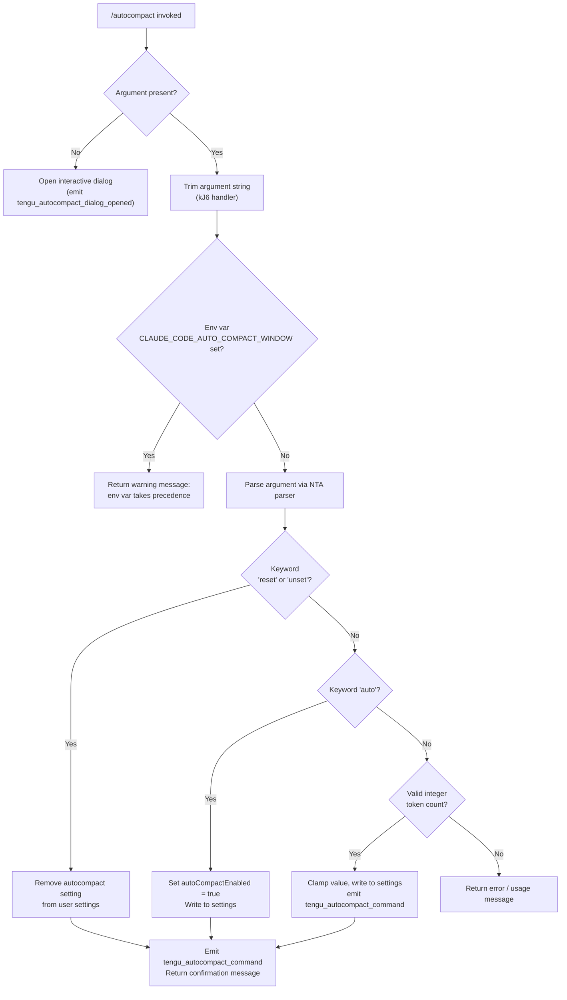

# `/autocompact`

> Analysis basis: CC v2.1.132 bundle.js (AST extraction + Claude interpretation)
> Minimum version: v2.1.132

---

## Overview

`/autocompact` configures the automatic context-window compaction threshold for the current Claude Code session. It accepts either the keyword `auto` (to enable heuristic-driven compaction) or an explicit integer token count, writes the resulting value to user settings, and emits telemetry. When invoked with no argument it opens an interactive dialog instead of immediately applying a change.

---

## Registration

| Field | Value |
|---|---|
| type | `local-jsx` |
| name | `autocompact` |
| description | `Configure the auto-compact window size` |
| argumentHint | `[auto\|<tokens>]` |
| isHidden | `false` |
| module_id | `$a9` |
| load_inline | `true` |
| handler | `vH7` (AsyncFunction, resolved via `module_id`) |
| `loc_byte_end` | `9866294` |
| `arbor_handler.name` | `vH7` |
| `arbor_handler.kind` | `AsyncFunction` |
| `arbor_handler.resolution_path` | `module_id` |
| `arbor_handler.fqn` | `claude-2.1.132::vH7` |
| `arbor_handler.n_hits` | `1` |

Analysis basis: CC v2.1.132 bundle.js:+9866045 – +9866294

---

## Input Branching

The top-level handler (`vH7`) inspects the raw argument string and forks into two top-level paths: **dialog mode** (no argument) and **direct-set mode** (argument present).



Analysis basis: CC v2.1.132 bundle.js:+9860519 (handler `kJ6`), +9865730 (handler `vH7`), +9860553 (env-var warning literal), +9342979 (env-var name literal)

---

## Behavioral Spec

### 1. Top-Level Handler — Dialog vs. Direct-Set Dispatch

```
async function autocompactCommandHandler(args, context):
    emit_telemetry("tengu_autocompact_dialog_opened")   // only when no args
    if args is empty or whitespace:
        render JSX dialog via IM.createElement
        return                                           // dialog handles further interaction
    else:
        result = applyAutocompactSetting(args.trim(), context)
        return result
```

Analysis basis: CC v2.1.132 bundle.js:+9865730, +9865746, +9865763, +9865807, +9865818

---

### 2. Direct-Set Handler — Environment Variable Guard

```
async function applyAutocompactSetting(rawArg, context):
    trimmedArg = rawArg.trim()

    // Env-var check: CLAUDE_CODE_AUTO_COMPACT_WINDOW takes precedence
    if process.env["CLAUDE_CODE_AUTO_COMPACT_WINDOW"] is set:
        return warning("CLAUDE_CODE_AUTO_COMPACT_WINDOW is set and takes precedence. Unset it to change this setting.")

    parsedValue = parseAutocompactArgument(trimmedArg)

    if trimmedArg is "reset" or "unset":
        removeSettingKey("autoCompactEnabled", settingsLayer="userSettings")
        emit_telemetry("tengu_autocompact_command", {action: "unset"})
        return confirmationMessage()

    if parsedValue.mode == "auto":
        appState.setAppState({autoCompactEnabled: true})
        writeToSettings("autoCompactEnabled", true)
        emit_telemetry("tengu_autocompact_command", {action: "set", value: "auto"})
        return "Auto-compact window set to auto"

    if parsedValue.mode == "tokens":
        clampedValue = clampTokenCount(parsedValue.tokens)
        writeToSettings("autoCompactEnabled", clampedValue)
        emit_telemetry("tengu_autocompact_command", {action: "set", value: clampedValue})
        return confirmationMessage(clampedValue)

    return usageError()
```

Analysis basis: CC v2.1.132 bundle.js:+9860553 (env-var warning string), +9860655 (`H.trim`), +9860684 (`"reset"` literal), +9860697 (`"unset"` literal), +9861072 (`A.setAppState`), +9861201 (`"set"` literal), +9861345 (success path `GK`), +9861361 (`"Auto-compact window set to auto"` literal)

---

### 3. Argument Parser — `parseAutocompactArgument` (NTA)

```
function parseAutocompactArgument(input):
    trimmed = input.trim()

    if trimmed ends with "%":
        // Percentage-style input
        raw = parseFloat(trimmed)
        if not Number.isFinite(raw):
            return {status: "invalid"}
        percent = Math.round(raw)
        return {status: "valid", mode: "percent", value: percent}

    if trimmed == "auto":
        return {status: "valid", mode: "auto"}

    // Integer token count path
    asInt = parseInt(trimmed, 10)   // radix 10 minimum: 1000
    if Number.isFinite(asInt):
        rounded = Math.round(asInt / 100) * 100  // snap to nearest 100
        return {status: "valid", mode: "tokens", value: rounded}

    return {status: "invalid"}
```

- Minimum accepted integer: `1000` (bundle.js:+9342513)
- Rounding granularity: `100` tokens (bundle.js:+9342549)
- Keyword `"auto"` recognized explicitly (bundle.js:+9342408)

Analysis basis: CC v2.1.132 bundle.js:+9342378 – +9342622 (`NTA` function body)

---

### 4. Token Count Validator — `tokenCountValidator` (XX)

The validator (`XX`) is used when the settings layer or another caller needs to validate a stored token-count value independently of the argument parser.

```
function tokenCountValidator(rawValue):
    asString = toString(rawValue)    // via yH helper
    asInt    = parseInt(asString)
    if isNaN(asInt):
        return {status: "invalid"}
    if asInt < 0 or asInt > 1_000_000:
        return {status: "invalid"}
    // Additional model-specific checks via lQ / $8H / ZF6
    return {status: "valid", value: asInt}
```

- Hard lower bound: `0` (bundle.js:+9342979 / literal +2852252)
- Hard upper bound: `1,000,000` (bundle.js:+2852279)
- Minimum meaningful value before parse check: `10` (bundle.js:+2852232)

Analysis basis: CC v2.1.132 bundle.js:+2852097 – +2852347 (`XX` body), +2852180 (`parseInt`), +2852240 (`isNaN`), +2852266 (`m0`), +2852303 (`lQ`), +2852323 (`$8H`), +2852347 (`ZF6`)

---

### 5. Settings Resolution Order — `resolveEffectiveCompactWindow` (ol)

When reading the current effective value the runtime consults sources in priority order:

```
function resolveEffectiveCompactWindow():
    // 1. Environment variable (highest priority)
    envVal = process.env["CLAUDE_CODE_AUTO_COMPACT_WINDOW"]
    if envVal is defined:
        parsed = Na(envVal)       // Na = integer-or-"valid" parser
        source = "env"
        return {value: parsed, source}

    // 2. Settings layers (decreasing priority)
    settingsVal = readSetting("autoCompactEnabled",
                              layers=["policySettings","flagSettings",
                                      "userSettings","projectSettings",
                                      "localSettings"])
    if settingsVal is defined:
        source = "settings"
        return {value: settingsVal, source}

    // 3. Computed default (Math.max / Math.min clamping)
    defaultVal = Math.max(lowerBound, Math.min(upperBound, modelDefault))
    source = "default"
    return {value: defaultVal, source}
```

- Source label `"env"` (bundle.js:+9343174)
- Source label `"settings"` (bundle.js:+9343244)
- `Math.max` call: bundle.js:+9343100
- `Math.min` call: bundle.js:+9343140
- Env-var name `CLAUDE_CODE_AUTO_COMPACT_WINDOW`: bundle.js:+9342982

Analysis basis: CC v2.1.132 bundle.js:+9342906 – +9343283 (`ol` body)

---

### 6. Model-Aware Context-Limit Lookup — `modelContextLimit` (K5)

```
function modelContextLimit(modelId):
    // Checks known model prefixes and IDs
    // Falls through to legacyGlobalConfig or "default" bucket
    // Returns integer context-window size for the given model
    if modelId in knownModels:
        return knownModels[modelId].contextWindow
    if modelId.includes("legacyGlobalConfig"):
        return legacyLimit
    return DEFAULT_CONTEXT_WINDOW
```

Known model strings checked (from literals, depth ≤ 2):
`claude-opus-4-7`, `claude-opus-4-6`, `claude-opus-4-5`, `claude-opus-4-1`, `claude-opus-4-0`, `claude-sonnet-4-6`, `claude-sonnet-4-5`, `claude-sonnet-4-0`, `claude-haiku-4-5`, `claude-3-7-sonnet`, `claude-3-5-sonnet`, `claude-3-5-haiku`, `claude-3-opus`, `claude-3-sonnet`, `claude-3-haiku`

Analysis basis: CC v2.1.132 bundle.js:+3177391 – +3177620 (`K5` body), +2112127 – +2112986 (model-string literals), +3177575 (`"legacyGlobalConfig"` literal), +3177619 (`"default"` literal)

---

### 7. Integer/Validity Parser — `intOrValidParser` (Na)

```
function intOrValidParser(rawString):
    asInt = parseInt(rawString)
    if isNaN(asInt):
        return {status: "invalid"}
    // caps applied via helper k
    return {status: "valid", value: asInt}
```

- Returns string `"valid"` on success, `"invalid"` on failure (bundle.js:+4376735, +4376810)
- Result may be `"capped"` when value exceeds model limit (bundle.js:+4376940)

Analysis basis: CC v2.1.132 bundle.js:+4376750 – +4376881 (`Na` body)

---

### 8. Settings Write Path — `saveSettings` (CA)

```
async function saveSettings(key, value, layer):
    // Reads existing settings from disk via EO / E6H
    // Merges key/value into the appropriate layer object
    // Writes back atomically via QyH (temp-file + rename pattern)
    // Clears internal caches via C2
    // Reloads settings via NN6
    // Emits Jk6 event to notify subscribers

    existing = loadSettingsFile(layer)
    merged   = {...existing, [key]: value}
    atomicWriteJSON(settingsFilePath(layer), merged)
    clearSettingsCache()
    reloadSettings()
    emit("settingsChanged")
```

- Settings file names: `settings.json` (bundle.js:+1157999), `settings.local.json` (bundle.js:+1158360), `managed-settings.json` (bundle.js:+1154849), `cowork_settings.json` (bundle.js:+1157970)
- Atomic write uses temp file + `renameSync` (bundle.js:+953485)
- Cache cleared via `s06.clear` and `j28.clear` (bundle.js:+24901, +24913)

Analysis basis: CC v2.1.132 bundle.js:+1159488 – +1160313 (`CA` body)

---

## State & Side Effects

| Item | Detail |
|---|---|
| Telemetry | `tengu_amber_redwood2` (bundle.js:+9342794), `tengu_autocompact_command` (bundle.js:+9861147), `tengu_autocompact_dialog_opened` (bundle.js:+9865765) |
| appState changes | `A.setAppState` called with updated `autoCompactEnabled` value (bundle.js:+9861072) |
| Settings write | Persists `autoCompactEnabled` to `userSettings` layer (`settings.json`) via atomic write (bundle.js:+1159609) |
| Settings cache | Cleared via `C2` (`s06.clear`, `j28.clear`) after write (bundle.js:+1160139) |
| Settings reload | Full reload triggered via `NN6` after write (bundle.js:+1160164) |
| Event emission | `Jk6.emit` fires a settings-changed notification to subscribers (bundle.js:+1160313) |
| Dialog render | JSX dialog rendered via `IM.createElement` when no argument is given (bundle.js:+9865818) |
| Sound | <!-- TODO: not found in depth-2 traversal; needs --depth 4 --> |

---

## Version History

| Version | Change |
|---|---|
| v2.1.132 | Initial analysis |

---

## Common Mistakes

1. **Setting the value while `CLAUDE_CODE_AUTO_COMPACT_WINDOW` env var is exported** — the command will silently refuse and display the precedence warning instead of writing to settings. Unset the env var first.
2. **Passing a token count below 1000** — values below the minimum threshold (`1000`, bundle.js:+9342513) are rejected as invalid by the argument parser (`NTA`).
3. **Passing a non-integer float without a `%` suffix** — only integer token counts or the keyword `auto` are accepted; bare floats (e.g. `0.8`) fail validation unless expressed as a percentage string (e.g. `80%`).
4. **Expecting immediate effect without session reload** — `A.setAppState` updates the in-memory state, but the persistent setting is written to `settings.json`; other running sessions pick up the change only after their settings cache is cleared.
5. **Using `reset` vs. `unset` interchangeably with other settings** — both keywords are treated identically by this command and remove the `autoCompactEnabled` key entirely, reverting to the computed default.

---

## Appendix — Identifier Mapping

> For bundle debugging only. Identifiers change across versions.

| Identifier | Role |
|---|---|
| `vH7` | Top-level command handler (AsyncFunction); dispatches dialog vs. direct-set |
| `kJ6` | Direct-set sub-handler; enforces env-var guard, calls NTA parser, writes settings |
| `ol` | Effective compact-window resolver; checks env, settings layers, then default |
| `Gq` | Model-string normalizer / lookup helper |
| `mb6` | Model metadata enumeration helper |
| `BY` | Model-string case-normalizer and include/replace helper |
| `M08` | Auxiliary model lookup helper |
| `vP` | Model-string replace/transform helper |
| `XX` | Token-count validator (range + model checks) |
| `yH` | Value-to-string converter (`String()` wrapper) |
| `m0` | Settings-layer reader helper (used by XX) |
| `lQ` | Model-specific token limit checker |
| `$8H` | Alternate token limit path resolver |
| `ZF6` | Token count finalizer (parseInt + Number.isFinite + R6 path) |
| `vY` | Auxiliary value/state helper used by `ol` |
| `Na` | Integer-or-valid string parser for env-var value |
| `k` | String formatting / locale helper (toUpperCase, trim, etc.) |
| `hW` | Settings-write orchestrator (calls yH, K5) |
| `K5` | Model-aware context-limit lookup |
| `ie6` | Compact-window write coordinator (calls hW, vA, j6, NTA) |
| `vA` | Auxiliary write-path helper |
| `j6` | Hook/subscriber registration helper |
| `NTA` | Argument parser for autocompact value (auto/percent/integer) |
| `CA` | Settings persistence function (read-merge-write-reload) |
| `EO` | Settings file path resolver |
| `E6H` | Settings file resolver (resolve + dirname) |
| `ePL` | Settings path helper (OaH + yH) |
| `xb` | `.claude` directory path builder |
| `sPL` | Managed-settings path builder |
| `ULH` | Settings path utility |
| `F6` | File-existence / stat helper |
| `G7_` | Settings object merger |
| `MjH` | Settings merge helper |
| `D66` | Settings diff/validation helper |
| `ni` | Settings loader helper (kdA, BN, tPL, ydA) |
| `W7_` | Settings writer helper (KaH, BN, bb, g2, tKH) |
| `wE` | File-read wrapper (calls bp) |
| `bp` | Low-level file reader (readFileSync + slice + replaceAll) |
| `D8` | Error-code checker (`ENOENT` etc.) |
| `j8` | Error constructor / rethrow helper |
| `Wh8` | Timestamp cache setter (`xN6.set`, `Date.now`) |
| `QyH` | Atomic JSON write (temp file, fchmod, fsync, rename, unlink) |
| `q` | File-system module reference |
| `O` | fs.Stats / stat-result helper |
| `f` | File descriptor wrapper |
| `RH` | JSON serializer (`JSON.stringify`) |
| `C2` | Settings cache clearer (`s06.clear`, `j28.clear`) |
| `NN6` | Settings reload orchestrator (reads file, writes back, appends log) |
| `N6` | Settings path helper (Qv6 + _A) |
| `_h8` | Settings module-key helper (MK) |
| `fh8` | git-check-ignore helper (PA) |
| `fXL` | XDG config path builder (vN6.join + PK_.homedir) |
| `fH` | Settings log writer (HA, yH, kq, $wL, EQ.logError) |
| `_A` | Path utility (resolve/join) |
| `ub` | Settings load coordinator (Kp, _2L, $q, ZdA) |
| `Kp` | Settings pre-load helper |
| `_2L` | Full settings-load-from-disk implementation |
| `$q` | Memory usage sampler (process.memoryUsage) |
| `ZdA` | Post-load cleanup helper |
| `uA` | Settings accessor / reader |
| `A` | App-state / context object |
| `d` | Diagnostic / logging helper |
| `GK` | Success-message formatter (Bq) |
| `Bq` | Number formatter (zsq, locale `"en-US"`, style `"compact"`) |
| `zsq` | Locale-format sub-helper |