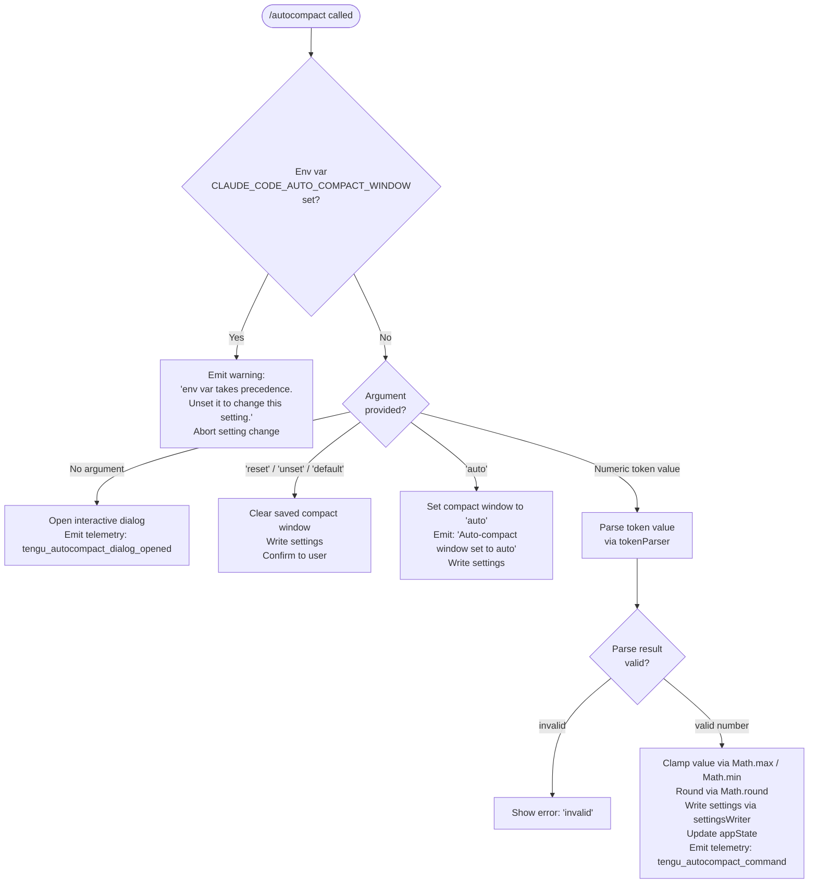

# `/autocompact`

> Analysis basis: CC v2.1.132 bundle.js (AST extraction + Claude interpretation)
> Minimum version: v2.1.132

---

## Overview

The `/autocompact` command configures the auto-compact window size, which controls the token threshold at which Claude Code automatically compacts the conversation context. When invoked without arguments, it opens an interactive dialog; when invoked with a token value or the keyword `auto`, it directly applies the setting. The effective value is resolved from a priority stack: environment variable → policy settings → flag settings → user/project/local settings.

---

## Registration

| Field | Value |
|---|---|
| type | `local-jsx` |
| name | `autocompact` |
| description | Configure the auto-compact window size |
| argumentHint | `[auto\|<tokens>]` |
| isHidden | `false` |
| module\_id | `$a9` |

Analysis basis: CC v2.1.132 bundle.js:+9866045

---

## Input Branching

The command dispatcher (`commandEntrypoint`) calls the command handler (`commandHandler`) with the raw argument string. The handler first checks whether the environment variable `CLAUDE_CODE_AUTO_COMPACT_WINDOW` overrides user configuration, then branches on the trimmed argument value.



Analysis basis: CC v2.1.132 bundle.js:+9860519, +9860553, +9860655, +9860684, +9860695, +9860710, +9861072, +9861147, +9865765

---

## Behavioral Spec

### Token Argument Parsing

The token parser (`tokenParser`) accepts a raw string argument and attempts to interpret it as a token count in one of two formats: a plain integer, or a shorthand value suffixed with `k` (thousands) or `M` (millions).

```
function tokenParser(rawInput):
    trimmed = rawInput.trim()

    if trimmed ends with "k" or "K":
        numeric = parseFloat(trimmed excluding last char)
        result  = Math.round(numeric * 1_000)
    else if trimmed ends with "m" or "M":
        numeric = parseFloat(trimmed excluding last char)
        result  = Math.round(numeric * 1_000_000)
    else:
        result = parseInt(trimmed, 10)

    if not Number.isFinite(result):
        return { valid: false, reason: "invalid" }

    // Clamp to [1_000, 1_000_000]
    clamped = Math.max(1_000, Math.min(1_000_000, result))
    return { valid: true, value: clamped }
```

Analysis basis: CC v2.1.132 bundle.js:+9342378, +9342437, +9342455, +9342513, +9342529, +9342575, +9342622, +9343083, +9343100, +9343140

Constants:
- Upper bound: 1,000,000 tokens (bundle.js:+9342469)
- Lower bound: 1,000 tokens (bundle.js:+9342513)
- Multiplier for `k` suffix: 1,000 (bundle.js:+9342513)
- Multiplier for `M` suffix: 1,000,000 (bundle.js:+9342469)
- Percentage-mode divisor (100): 100 (bundle.js:+9342549); minimum percentage: 10 (bundle.js:+9342540)

### Environment Variable Precedence Check

Before applying any user-supplied argument, the command handler reads the resolved compact window configuration. The resolver (`compactWindowResolver`) checks the source of the current value.

```
function compactWindowResolver(appState):
    envValue = process.env["CLAUDE_CODE_AUTO_COMPACT_WINDOW"]
    if envValue is set and non-empty:
        return { source: "env", value: envValue }

    if policySettings has autoCompactWindow:
        return { source: "policySettings", value: ... }

    if flagSettings has autoCompactWindow:
        return { source: "flagSettings", value: ... }

    // Falls through to settings layers
    if userSettings has autoCompactWindow:
        return { source: "settings", value: ... }

    return { source: "settings", value: null }
```

When the resolved source is `"env"`, the handler emits the warning string and returns early without writing any setting.

Analysis basis: CC v2.1.132 bundle.js:+9342906, +9342914, +9342919, +9342979, +9342982, +9343174, +9343244, +9860553

### Settings Writer

When a valid token value or `"auto"` is provided and the env-var guard passes, the settings writer (`settingsWriter`) persists the new compact window value.

```
function settingsWriter(targetLayer, key, value):
    configPath  = resolveConfigPath(targetLayer)   // uses MX.dirname
    existingRaw = readFile(configPath, "utf-8")    // may not exist
    parsed      = parseJSON(existingRaw) or {}

    if value is null or undefined:
        delete parsed[key]
    else:
        parsed[key] = value

    writeFile(configPath, formatJSON(parsed), "utf-8")
    emit event via eventEmitter                    // Jk6.emit
```

The settings writer distinguishes at least five settings layers by name: `policySettings`, `flagSettings`, `userSettings`, `projectSettings`, and `localSettings`.

Analysis basis: CC v2.1.132 bundle.js:+1159426, +1159448, +1159538, +1159978, +1160030, +1160093, +1160116, +1160164, +1160313

### Reset / Unset / Default Handling

If the trimmed argument is exactly `"reset"`, `"unset"`, or `"default"`, the command handler calls the settings writer with `null` for the compact window key, effectively removing the persisted override and reverting to the default behavior.

```
function handleReset(appState, settingsWriter):
    settingsWriter(layer: "settings", key: "autoCompactWindow", value: null)
    appState.setAppState({ autoCompactWindow: undefined })
    displayConfirmation(to: user)
```

Analysis basis: CC v2.1.132 bundle.js:+9860684, +9860697, +9860710

### Auto Mode Handling

If the trimmed argument is exactly `"auto"`, the command stores the string `"auto"` as the compact window value rather than a numeric token count. Claude Code interprets `"auto"` as a signal to use model-determined context management.

```
function handleAuto(appState, settingsWriter):
    settingsWriter(layer: "settings", key: "autoCompactWindow", value: "auto")
    appState.setAppState({ autoCompactWindow: "auto" })
    displayMessage("Auto-compact window set to auto")
```

Analysis basis: CC v2.1.132 bundle.js:+9343344, +9861361

### App State Update

After a successful numeric or `"auto"` write, the handler calls `appState.setAppState` to update the in-memory application state immediately without requiring a restart.

```
function applyToAppState(appState, newValue):
    appState.setAppState({ autoCompactWindow: newValue })
```

Analysis basis: CC v2.1.132 bundle.js:+9861072

### Interactive Dialog

When `/autocompact` is invoked with no argument, the command entrypoint (`dialogEntrypoint`) renders a JSX dialog component via `IM.createElement` and emits the `tengu_autocompact_dialog_opened` telemetry event. The dialog renders with type `"dialog"`.

```
function dialogEntrypoint(appState):
    emit telemetry("tengu_autocompact_dialog_opened")
    element = createElement(AutocompactDialogComponent, { appState })
    render(element)
```

Analysis basis: CC v2.1.132 bundle.js:+9865730, +9865746, +9865763, +9865807, +9865818, +9865765

### Formatted Decimal Rendering

When displaying the current compact window value (e.g., in the dialog), the formatter (`valueFormatter`) appends `".0"` to integer values to indicate they are exact token counts rather than percentages.

Analysis basis: CC v2.1.132 bundle.js:+166568, +166582

---

## State & Side Effects

| Item | Detail |
|---|---|
| Telemetry — command path | `tengu_autocompact_command` fired after a successful numeric/auto set (bundle.js:+9861147) |
| Telemetry — dialog path | `tengu_autocompact_dialog_opened` fired when no argument is given and the dialog is opened (bundle.js:+9865765) |
| Environment variable read | `CLAUDE_CODE_AUTO_COMPACT_WINDOW` checked at command invocation; if set, blocks all user changes (bundle.js:+9342982) |
| Settings file write | On success, the appropriate settings layer JSON file is updated on disk (bundle.js:+1160030) |
| Event emitter | `Jk6.emit` called after settings write (bundle.js:+1160313) |
| `appState` mutation | `setAppState({ autoCompactWindow: <value> })` called immediately after successful write (bundle.js:+9861072) |
| Dialog render | JSX element created via `IM.createElement` with type `"dialog"` (bundle.js:+9865807, +9865818) |
| Sound | <!-- TODO: not found in depth-2 traversal; needs --depth 4 --> |

---

## Version History

| Version | Change |
|---|---|
| v2.1.132 | Initial analysis |

---

## Common Mistakes

1. **Setting the value while `CLAUDE_CODE_AUTO_COMPACT_WINDOW` is exported.** The env var silently takes full precedence. The command will display a warning and make no change; unset the env var first.
2. **Expecting fractional `k` values to be accepted as-is.** Values like `1.5k` are parsed via `parseFloat` and then multiplied and rounded; the stored value will be an integer (1500).
3. **Passing a number outside the 1,000–1,000,000 range.** The value is clamped, not rejected; users may not realize their input was silently adjusted.
4. **Assuming `reset`/`unset`/`default` are interchangeable everywhere.** All three are handled identically in v2.1.132, but only these exact lowercase strings trigger the reset path; any other spelling falls through to the numeric parser and produces an `"invalid"` error.
5. **Expecting an immediate restart to apply changes.** The setting is applied to in-memory `appState` via `setAppState` in the same command invocation, so no session restart is needed.
6. **Confusing the no-argument (dialog) path with the `auto` keyword path.** Invoking `/autocompact` with no argument opens an interactive dialog; invoking `/autocompact auto` directly sets the mode to `"auto"` without any dialog.

---

## Appendix — Identifier Mapping

> For bundle debugging only. Identifiers change across versions.

| Identifier | Role |
|---|---|
| `vH7` | Dialog entrypoint — renders the autocompact JSX dialog component |
| `kJ6` | Command handler — core logic: env-var guard, argument branch, settings write |
| `ol` | Compact window resolver — determines effective value and its source layer |
| `NTA` | Token argument parser — parses k/M suffixes, clamps, and rounds numeric input |
| `CA` | Settings writer — reads, mutates, and persists a settings layer JSON file |
| `uA` | Secondary settings utility (reads/validates settings; calls `ub`) |
| `A` | App state / argument carrier passed into the command handler |
| `d` | Display / output helper used in both handler and entrypoint paths |
| `GK` | Value formatter — appends `.0` suffix for integer compact window display |
| `H` | Async utility with random jitter and setTimeout (used in dialog render path) |