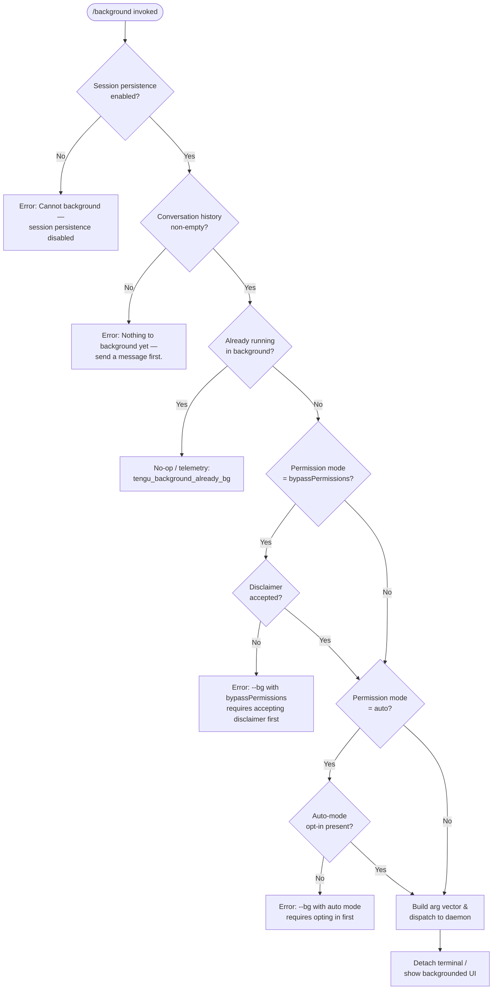

# `/background`

> Analysis basis: CC v2.1.132 bundle.js (AST extraction + Claude interpretation)
> Minimum version: v2.1.132

---

## Overview

The `/background` command (alias `/bg`) detaches the current interactive Claude Code session from the terminal and hands it off to a background daemon process, allowing the user to reclaim the terminal while the session continues running. Internally, the command performs permission and precondition checks, constructs a CLI argument vector for the background worker, and dispatches the job via a Unix domain socket to the daemon — spawning the daemon transiently if no persistent service is registered.

---

## Registration

| Field | Value |
|---|---|
| type | `local-jsx` |
| name | `background` |
| aliases | `["bg"]` |
| description | `"Continue this session in the background and free the terminal"` |
| module\_id | `lJq` |
| load\_inline | `true` |
| handler | `j27` (AsyncFunction, resolved via `module_id` path) |
| `loc_byte_end` | `11692628` |
| `arbor_handler.name` | `j27` |
| `arbor_handler.kind` | `AsyncFunction` |
| `arbor_handler.resolution_path` | `module_id` |
| `arbor_handler.fqn` | `claude-2.1.132::j27` |
| `arbor_handler.n_hits` | `0` |

Analysis basis: CC v2.1.132 bundle.js:+11692408 – +11692628

---

## Input Branching

The handler `j27` performs several ordered gate checks before dispatching. Each failed gate returns an error message to the user without spawning anything.



Analysis basis: CC v2.1.132 bundle.js:+11691774 (handler entry), +11691855 (persistence guard), +11692031 (empty-history guard), +11691788 (already-bg telemetry), +11686651 (bypassPermissions disclaimer error), +11686813 (auto-mode opt-in error)

---

## Behavioral Spec

### 1. Pre-flight Guard: Session Persistence

Before any dispatch work, the handler checks whether the current session has persistence enabled (i.e., a session ID exists that could be resumed). If persistence is disabled, the command aborts with an explanatory message.

```
function checkSessionPersistence(sessionState):
    if not sessionState.persistenceEnabled:
        return Error("Cannot background — session persistence is disabled, ...")
    return OK
```

Analysis basis: CC v2.1.132 bundle.js:+11691855

---

### 2. Pre-flight Guard: Non-empty Conversation

The handler checks that at least one message has been sent in the current session. Attempting to background an empty session is rejected.

```
function checkConversationNonEmpty(messages):
    if messages.length == 0:
        return Error("Nothing to background yet — send a message first.")
    return OK
```

Analysis basis: CC v2.1.132 bundle.js:+11692031

---

### 3. Pre-flight Guard: Already Backgrounded

If the session is already running as a background job, the command records a telemetry event (`tengu_background_already_bg`) and exits early without spawning a duplicate.

```
function checkNotAlreadyBackground(sessionMode):
    if sessionMode == "bg":
        emit telemetry("tengu_background_already_bg")
        return SKIP
    return OK
```

Analysis basis: CC v2.1.132 bundle.js:+11691788

---

### 4. Permission Mode Gate

Two permission-related gates are evaluated sequentially:

**Gate A — `bypassPermissions` mode**

If the current permission mode is `bypassPermissions`, the command requires that the user has previously accepted the dangerous-skip disclaimer by running `claude --dangerously-skip-permissions` at least once interactively. Without that acceptance, the command aborts.

**Gate B — `auto` mode**

If the current permission mode is `auto`, the user must have previously opted in by running `claude --permission-mode auto` interactively. Without that opt-in, the command aborts.

```
function checkPermissionGates(permMode, settings):
    if permMode == "bypassPermissions":
        if not settings.dangerouslySkipPermissionsAccepted:
            return Error("--bg with bypassPermissions requires accepting the disclaimer first. ...")
    if permMode == "auto":
        if not settings.autoModeOptIn:
            return Error("--bg with auto mode requires opting in first. ...")
    return OK
```

Analysis basis: CC v2.1.132 bundle.js:+11686451 (`--permission-mode`), +11686482 (`bypassPermissions`), +11686514 (`--dangerously-skip-permissions`), +11686651 (error text), +11686793 (`auto`), +11686813 (auto-mode error text)

---

### 5. Argument Vector Construction

After passing all gates, the handler builds the CLI argument vector that will be passed to the background worker process. The construction logic (`_27`, called via `rDH`) performs the following steps:

1. **Generate a job ID**: a UUID is generated and truncated to 8 hex characters, forming the background job identifier.
2. **Resolve the jobs directory**: the path is derived via the path utilities (joining a base config directory under the `jobs` subdirectory).
3. **Create the jobs directory** if absent (`Ce.mkdir`).
4. **Parse the current session's argument list** for recognized flags, including:
   - `--agent` flag
   - `--name` / `-n` (session name)
   - `--resume=<id>` / `-r=<id>` / `--resume` / `-r` (resume flags, consuming 9 characters for the `=` variants)
   - `--fork-session` / `--session-id=<id>` / `--session-id <id>` (session forking)
   - `-c` / `--continue` (continue flags)
   - `--permission-mode` and permission values
   - `--dangerously-skip-permissions` / `--allow-dangerously-skip-permissions`
5. **Append environment variables** to the child's environment from several keys: `CLAUDE_CONFIG_DIR`, `CLAUDE_INTERNAL_FC_OVERRIDES`, `AWS_REGION`, `AWS_DEFAULT_REGION`, `AWS_PROFILE`, `GOOGLE_APPLICATION_CREDENTIALS`, `GOOGLE_CLOUD_PROJECT`, `GCLOUD_PROJECT`.
6. **Append runtime flags**: `--model` and `--effort` from the current session's configuration.
7. **Mark the job type**: the literal `"continue"` is appended to signal that this is a continuation of an existing session.

```
function buildBackgroundArgVector(currentArgs, sessionId, permMode, config):
    jobId = randomUUID().slice(0, 8)
    jobsDir = pathJoin(configDir, "jobs")
    mkdir(jobsDir, recursive=True)

    filteredArgs = parseAndFilterArgs(currentArgs)  // strips --bg, deduplicates resume flags

    if sessionId:
        filteredArgs.append("--resume=" + sessionId)

    envOverrides = collectEnvVars([
        "CLAUDE_CONFIG_DIR", "CLAUDE_INTERNAL_FC_OVERRIDES",
        "AWS_REGION", "AWS_DEFAULT_REGION", "AWS_PROFILE",
        "GOOGLE_APPLICATION_CREDENTIALS", "GOOGLE_CLOUD_PROJECT", "GCLOUD_PROJECT"
    ])

    if config.model:
        filteredArgs.append("--model", config.model)
    if config.effort:
        filteredArgs.append("--effort", config.effort)

    filteredArgs.append("continue")

    return { jobId, jobsDir, args: filteredArgs, env: envOverrides }
```

Analysis basis: CC v2.1.132 bundle.js:+11671799 (UUID), +11671828 (slice length 8), +11671856 (mkdir), +11672257 (`--agent`), +11672284 (`--name`), +11672300 (`-n`), +11685635 (`--resume=`), +11685663 (9-char offset), +11685746 (`--resume`), +11672485 (`--fork-session`), +11685989 (`--session-id=`), +11672374 (`-c`), +11672384 (`--continue`), +11687400–+11687555 (env vars), +11688909 (`--model`), +11688931 (`--effort`), +11688972 (`continue`)

---

### 6. Daemon Lifecycle: Ensure Running

Before dispatching the job, the system attempts to ensure the background daemon is reachable (`Rm`, called via `mCA → rX6 → Rm`). The lifecycle sequence is:

1. **Check daemon status**: query whether a daemon process is alive (`up` state).
2. **If stale exec**: the registered service binary path no longer exists (binary was updated). Fall back to a transient spawn; emit `tengu_bg_daemon_service_stale_exec`.
3. **If no daemon and platform supports a service**: prompt the user interactively — `"Install as a service now? [y/N/never, or 'once' just for now] "`. Response options are `yes`, `once`, `never`, `no`. This prompt is guarded by `tengu_bg_daemon_cold_start_ask`.
4. **If platform has no service manager** or user declines: spawn a transient daemon process using `YJq.spawn` with flags `run`, `--origin`, `--spawned-by`, with the child's `stdio` set to `ignore` and the handle `unref`-ed so it outlives the parent.
5. **Timeout**: if the transient daemon does not become reachable within 5000 ms, emit `tengu_bg_daemon_spawn_failed` and abort with an error.
6. **Daemon unreachable after service poll**: emit `tengu_bg_daemon_service_poll_fallthrough`.

```
async function ensureDaemonRunning(platform, settings):
    status = checkDaemonStatus()
    if status == "up":
        return OK
    if status == "stale-exec":
        emit telemetry("tengu_bg_daemon_service_stale_exec")
        return spawnTransient()
    if serviceManagerAvailable(platform):
        answer = promptUser("Install as a service now? [y/N/never, or 'once' just for now] ")
        emit telemetry("tengu_bg_daemon_cold_start_ask")
        recordAnswer(answer)  // tengu_bg_daemon_cold_start_ask_answer
        if answer in ["yes", "once"]:
            installService()  // tengu_bg_daemon_install
            waitForDaemon(timeout=5000)  // tengu_bg_daemon_service_poll_fallthrough on failure
            return
    return spawnTransient(timeout=5000)  // tengu_bg_daemon_spawn_failed on failure
```

Analysis basis: CC v2.1.132 bundle.js:+11639410 (`up`), +11639425 (`daemon_ensure_running`), +11639500 (stale exec), +11639543 (stale exec message), +11640003–+11640065 (platform strings `macos`/`linux`/`windows`), +11640390 (`ask`), +11640448 (cold start ask telemetry), +11644296 (install prompt text), +11644371 (answer telemetry), +11639883 (install telemetry), +11640124 (poll fallthrough), +11640835 (spawn), +11640928 (`ignore` stdio), +11640964 (unref), +11644827 (5000 ms timeout), +11641068 (spawn failed telemetry), +11641189 (spawn failed error string)

---

### 7. Job Dispatch via Control Socket

With the daemon running, the dispatch function (`mCA`) writes a dispatch file and communicates with the daemon over a Unix domain socket:

1. **Generate a random socket path** using `xJq.randomBytes` to produce a temporary file name.
2. **Write the dispatch file** to the jobs directory (via `lY` — atomic write with rename).
3. **Connect to the daemon control socket** (`O$` → `X38.connect`). Connection timeout: 6000 ms. If no acknowledgement is received within this window (`no ack`), emit `tengu_bg_dispatch_fallback`.
4. **Send the dispatch message** over the socket (serialized with `RH` → `JSON.stringify`).
5. **Await acknowledgement**: internal states `await-ack` and `ESTARTING` (200 ms retry window). Error codes: `EALIVE`, `ESTALE`, `ETIMEOUT`, `ENOCONN`.
6. **On success**: emit `tengu_bg_dispatch`.
7. **On socket-level failures** — categorized as: `daemon-unreachable`, `ack-timeout`, `dispatch-write`, `enoconn`, `stale-short`, `short-alive`, `respawn`. Emit `tengu_bg_dispatch_fallback` with the failure category.
8. **Rescue path** (`Op`): if an initial dispatch fails but the daemon can be respawned, retry once; emit `tengu_bg_dispatch_rescued`.

```
async function dispatchBackgroundJob(jobId, args, env, jobsDir):
    dispatchFilePath = pathJoin(jobsDir, jobId + ".json")
    atomicWriteJSON(dispatchFilePath, { jobId, args, env })  // via lY

    socket = connectToControlSocket(timeout=6000)
    if not socket:
        emit telemetry("tengu_bg_dispatch_fallback", { reason: "daemon-unreachable" })
        return Error("not running")

    sendDispatchMessage(socket, jobId)
    ack = awaitAck(socket, timeout=6000)

    if ack.ok:
        emit telemetry("tengu_bg_dispatch")
        return OK
    else:
        category = classifyFailure(ack.error)
        emit telemetry("tengu_bg_dispatch_fallback", { reason: category })
        if category == "respawn":
            retryResult = rescueDispatch(jobId)
            if retryResult.ok:
                emit telemetry("tengu_bg_dispatch_rescued")
                return OK
        return Error(humanReadableError(category))
```

Human-readable error mapping (Analysis basis: CC v2.1.132 bundle.js:+11677074–+11677243):

| Internal category | User-facing message |
|---|---|
| `daemon-unreachable` | `"not running"` |
| `ack-timeout` | `"timed out"` |
| `dispatch-write` | `"couldn't write dispatch file"` |
| `enoconn` | `"socket missing"` |
| ID collision | `"id collision with a prior job"` |

Analysis basis: CC v2.1.132 bundle.js:+11668095 (random bytes), +11668169 (socket connect), +11668240 (6000 ms timeout), +11668084 (`no ack`), +11668342 (`EALIVE`), +11668472 (`ESTALE`), +11668895 (`await-ack`), +11668991 (`ESTARTING`), +11669022 (200 ms), +11669750 (dispatch telemetry), +11670276 (dispatch fallback telemetry), +11674795 (rescued telemetry)

---

### 8. Terminal Detach and UI Update

After a successful dispatch, the command triggers a terminal detach sequence. The detach mechanism (`i9H`) distinguishes between environment types:

- **tmux** sessions: sends a `detach-client` signal via `spawnSync` to detach the tmux client pane.
- **Non-tmux** sessions: sends a `detach-request` signal and writes to the terminal output stream (`v9H` → `Fl.write`).

The UI reflects the backgrounded state by displaying `"(backgrounded)"` in the session header. The session title is updated using the `background session` descriptor. An `AbortSignal.timeout` of 120 seconds is applied as a completion fence.

```
async function detachTerminalAndUpdateUI(sessionState, terminalEnv):
    if terminalEnv.isTmux:
        spawnSync("tmux", ["detach-client"])
    else:
        sendDetachRequest()
        writeToTerminal("(backgrounded)")

    updateSessionTitle("background session")
    sessionState.mode = "bg"
    applyAbortFence(timeout=120_000)
```

Analysis basis: CC v2.1.132 bundle.js:+11689417 (`AbortSignal.timeout`), +11689749 (120 seconds), +11689942 (`(backgrounded)`), +14163925 (`background session`), +9845856 (tmux spawnSync), +9845870 (`tmux`), +9845878 (`detach-client`), +9845797 (`detach-request`), +11689283 (telemetry `tengu_background`)

---

### 9. Spawn-Failed Error Path

If the background spawn itself fails (distinct from daemon failure), the handler emits `tengu_background_spawn_failed` and surfaces the error to the user. The gate-blocked state is recorded with the literal `"gate_blocked"` for diagnostic purposes.

```
function handleSpawnFailure(error):
    emit telemetry("tengu_background_spawn_failed")
    log("spawn_failed", error)
    return displayError(error)
```

Analysis basis: CC v2.1.132 bundle.js:+11689222 (spawn failed telemetry), +11671774 (`gate_blocked`), +11672116 (`spawn_failed`)

---

## State & Side Effects

| Item | Detail |
|---|---|
| Telemetry — primary | `tengu_background` (emitted on every invocation that passes guards) |
| Telemetry — already bg | `tengu_background_already_bg` (session already detached) |
| Telemetry — spawn fail | `tengu_background_spawn_failed` |
| Telemetry — dispatch | `tengu_bg_dispatch` (successful job handoff) |
| Telemetry — dispatch fallback | `tengu_bg_dispatch_fallback` (socket/write failure) |
| Telemetry — dispatch rescued | `tengu_bg_dispatch_rescued` (retry succeeded) |
| Telemetry — daemon cold start ask | `tengu_bg_daemon_cold_start_ask` |
| Telemetry — cold start answer | `tengu_bg_daemon_cold_start_ask_answer` |
| Telemetry — daemon install | `tengu_bg_daemon_install` |
| Telemetry — stale exec | `tengu_bg_daemon_service_stale_exec` |
| Telemetry — poll fallthrough | `tengu_bg_daemon_service_poll_fallthrough` |
| Telemetry — spawn failed | `tengu_bg_daemon_spawn_failed` |
| Telemetry — daemon yield | `tengu_daemon_yield` (daemon-side, triggered when foreground reclaims) |
| File system | Writes a dispatch JSON file to `<configDir>/jobs/<jobId>.json` |
| File system | Creates `<configDir>/jobs/` directory if absent |
| Socket I/O | Connects to the daemon control socket; disconnects after ACK |
| Session state | Sets `mode = "bg"`; updates UI title to `"background session"` |
| Terminal | Sends detach signal (tmux `detach-client` or raw `detach-request`) |
| AbortSignal | 120-second completion fence applied after dispatch |
| Config — user preference | `"never"` answer to the service install prompt is persisted |
| Environment propagation | Eight environment variables forwarded to background worker (see §5) |

---

## Version History

| Version | Change |
|---|---|
| v2.1.132 | Initial analysis |

---

## Common Mistakes

1. **Invoking `/bg` before sending any message**: the command aborts with `"Nothing to background yet — send a message first."` — at least one exchange must exist in the session transcript.
2. **Using `bypassPermissions` mode without prior interactive acceptance**: running `/bg` in this mode will fail unless the user has previously run `claude --dangerously-skip-permissions` interactively in the same environment.
3. **Using `auto` permission mode without prior opt-in**: similarly, `/bg` in `auto` mode requires a prior `claude --permission-mode auto` interactive run.
4. **Expecting backgrounding to work without session persistence**: if the session was started with persistence disabled, `/bg` cannot create a resumable job and will refuse with an explicit error.
5. **Assuming the daemon is always present**: the first `/bg` invocation on a fresh system may prompt for daemon installation. Answering `"never"` permanently suppresses the service prompt and forces transient spawns on every use.
6. **Alias confusion**: `/bg` and `/background` are identical in behavior; no functionality differs between them.
7. **Session collision**: if a prior background job with the same derived ID is still registered, dispatch will fail with `"id collision with a prior job"` — this is rare but can occur if the UUID truncation produces a collision within the jobs directory.

---

## Appendix — Identifier Mapping

> For bundle debugging only. Identifiers change across versions.

| Identifier | Role |
|---|---|
| `j27` | Main handler for `/background` (AsyncFunction, entry point) |
| `sD8` | Background command render/call wrapper (JSX component or call shim) |
| `tD8` | Terminal detach and UI update coordinator |
| `rDH` | Argument vector builder (gate checks + arg parsing) |
| `_27` | Core arg-parsing and dispatch preparation function |
| `mCA` | Dispatch-to-daemon function (socket write + ack wait) |
| `Rm` | Daemon lifecycle manager (ensure running, spawn if needed) |
| `rX6` | Service install prompter (cold-start interactive question) |
| `Y27` | Permission mode gate checker |
| `Re` | Resume-flag parser |
| `gJq` | `--resume=` / `-r=` flag extractor |
| `w27` | `--allow-dangerously-skip-permissions` flag checker |
| `z27` | `--fork-session` flag processor |
| `QJq` | `--session-id` flag processor |
| `D27` | Continuation flag builder |
| `hQ` | Settings loader (user/local/flag/policy layers) |
| `R8` | Multi-layer settings reader |
| `Fp` | Auto-mode opt-in checker |
| `k` | Auto-mode consent evaluator |
| `lCA` | Session state accessor (checks background mode flag) |
| `hK` | Background-mode state reader |
| `N1` | Session-mode set/delete via `J08` |
| `vrq` | Background mode type constant resolver |
| `O$` | Control socket connector |
| `bJq` | Socket acknowledgement awaiter |
| `xCA` | Dispatch result classifier (maps error codes to categories) |
| `jIH` | Dispatch message serializer |
| `lY` | Atomic file writer (write + rename) |
| `jM` | Dispatch file path builder |
| `Jq` | Jobs-directory file manager (stat, read, cache) |
| `UL` | Jobs directory path resolver |
| `DW` | Base jobs path builder |
| `i9H` | Terminal detach executor (tmux vs raw) |
| `v9H` | Raw terminal write for detach signal |
| `uo9` | Detach message type router |
| `n9H` | Tmux detach-client spawner (spawnSync) |
| `oDH` | Environment/mode classifier for handler |
| `tjq` | Test/production environment detector |
| `vh` | Environment mode value holder |
| `G9` | Daemon-worker role marker |
| `Tr` | Daemon-worker identifier constant |
| `Op` | Dispatch rescue / retry path |
| `sD` | Background service descriptor |
| `v5H` | Background service type resolver |
| `L27` | Session-not-found error emitter |
| `UbH` | Uncaught-error handler for background path |
| `DAH` | Error code classifier for spawn failures |
| `o9H` | Background invocation telemetry wrapper |
| `A8` | Global config reader (used for permission settings) |
| `Nt8` | Config file loader with lock and backup |
| `k5H` | Raw config file reader |
| `wnH` | JSX message builder for backgrounded confirmation |
| `Xv` | Main conversation renderer (used to render final UI state) |
| `A$` | Conversation history accessor |
| `Ht4` | History tail extractor |
| `xfH` | Session file context builder |
| `fH` | Error display / logging helper |
| `tD8` | Detach-and-render coordinator (also listed above) |
| `Iy` | Array-type checker used in UI rendering |
| `$M8` | Tool-use content block checker |
| `eR` | Content-type renderer |
| `flH` | System-prompt prefix detector |
| `k$` | Session-mode display helper (v6 + hK) |
| `wm` | Session-mode display variant |
| `KV` | App-state context accessor |
| `Vf` | Conversation messages accessor |
| `lDH` | Session persistence state reader |
| `Hwq` | Argument width/layout calculator |
| `RJq` | Argument list mapper |
| `J27` | Job-list display builder |
| `cAH` | Working-directory formatter |
| `mf` | Path redaction helper (`[REDACTED]`) |
| `RH` | JSON serializer (`JSON.stringify`) |
| `B6` | JSON parser (`JSON.parse`) |
| `vH` | String coercion helper |
| `yH` | String constructor wrapper |
| `d` | Debug/trace logger |
| `dcH` | MCP connection state reader |
| `UZH` | MCP server initializer |
| `ZBq` | MCP update applier |
| `$F7` | MCP retry coordinator |
| `M` | MCP server registry |
| `j6` | MCP server instance manager |
| `mzq` | Session snapshot writer |
| `Nr4` | Session stats aggregator |
| `a18` | Tool registration helper |
| `K8` | MCP debug logger |
| `Z7` | MCP error logger |
| `tTA` | OAuth-tool handler (MCP auth flow) |
| `eTA` | OAuth callback tool handler |
| `mc9` | MCP needs-auth state writer |
| `aTA` | MCP connection config helper |
| `gwA` | MCP transport type filter |
| `Qw6` | MCP connection filter |
| `qt` | MCP transport builder |
| `wI` | MCP stdio/sse connection builder |
| `qA` | MCP capability accumulator |
| `Cc9` | MCP state compactor |
| `dw6` | MCP retry-count parser |
| `PZA` | MCP max-retry parser |
| `bI` | MCP cleanup executor |
| `AZ` | Config file writer (writeFileSync) |
| `K` | Process-exit wrapper (`process.exit`) |