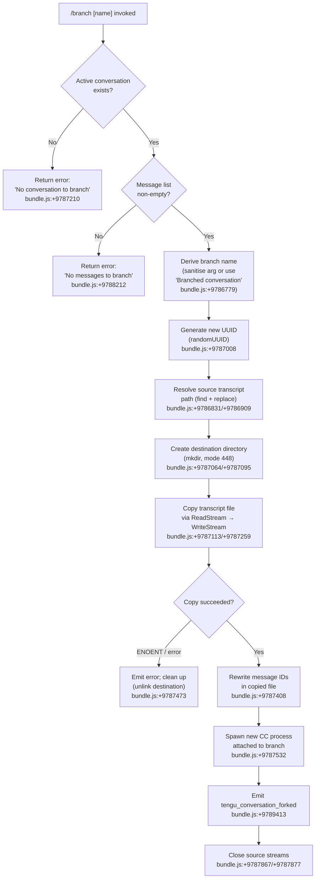

# `/branch`

> Analysis basis: CC v2.1.132 bundle.js (AST extraction + Claude interpretation)
> Minimum version: v2.1.132

---

## Overview

The `/branch` command (also invocable as `/fork`) creates an independent copy of the current conversation at the point it is invoked, allowing the user to explore an alternative direction without affecting the original session. Internally it copies the current conversation's JSONL transcript file into a new session directory, reassigns a fresh UUID, and spawns a new Claude Code process attached to that branched history. On success it emits the `tengu_conversation_forked` telemetry event.

---

## Registration

| Field | Value |
|---|---|
| type | `local-jsx` |
| name | `branch` |
| description | `Create a branch of the current conversation at this point` |
| argumentHint | `[name]` |
| aliases | `["fork"]` |
| module\_id | `iIA` |
| load\_inline | `true` |
| handler (Arbor) | `qe4` (AsyncFunction, resolved via `module_id`) |
| `loc_byte_end` | `11167127` |
| `arbor_handler.name` | `qe4` |
| `arbor_handler.kind` | `AsyncFunction` |
| `arbor_handler.resolution_path` | `module_id` |
| `arbor_handler.fqn` | `claude-2.1.132::qe4` |
| `arbor_handler.n_hits` | `0` |

Analysis basis: CC v2.1.132 bundle.js:+11166933–+11167127

---

## Input Branching

The top-level handler (`qe4`) delegates to an orchestration function (`Cr9`) which fans out into several sub-paths depending on runtime conditions.



---

## Behavioral Spec

### 1. Handler Entry Point

The Arbor-resolved handler is the async function `qe4` (FQN: `claude-2.1.132::qe4`), reached via `module_id` resolution (`iIA`). It immediately calls the orchestration function (`Cr9`).

Analysis basis: CC v2.1.132 bundle.js:+9790153

### 2. Branch-Name Derivation

```
function deriveBranchName(userArg):
    raw = userArg trimmed
    if raw is empty:
        return "Branched conversation"   // bundle.js:+9786779
    // Sanitise: find first disallowed character, replace with safe substitute
    sanitised = findInvalidChars(raw)    // bundle.js:+9786831
    sanitised = replaceInvalidChars(sanitised)  // bundle.js:+9786909
    return sanitised
```

The fallback label `"Branched conversation"` is used whenever the user provides no positional argument.
Analysis basis: CC v2.1.132 bundle.js:+9786779, +9786831, +9786909

### 3. Pre-flight Checks

```
function preFlight(conversationState):
    if conversationState is null or undefined:
        throw UserError("No conversation to branch")  // bundle.js:+9787210
    messages = conversationState.messages
    if messages is empty:
        throw UserError("No messages to branch")      // bundle.js:+9788212
    return ok
```

Both errors surface as user-facing strings rendered in the terminal; no telemetry is emitted for these guard clauses.
Analysis basis: CC v2.1.132 bundle.js:+9787210, +9788212

### 4. UUID and Path Resolution

```
function resolveDestination(sourceSession):
    newId   = crypto.randomUUID()          // bundle.js:+9787008
    srcPath = resolveTranscriptPath(sourceSession, v6, f$, _A, qN)
              // calls tf() to compute joined path  // bundle.js:+9787034–+9787053
    dstDir  = joinPath(srcPath, newId)
    return { newId, srcPath, dstDir }
```

Analysis basis: CC v2.1.132 bundle.js:+9787008, +9787027–+9787053

### 5. Directory Creation and File Copy

```
async function copyTranscript(srcFile, dstDir):
    await fs.mkdir(dstDir, { recursive: true, mode: 0o700 })   // 448 decimal  // bundle.js:+9787064/+9787095
    readStream  = fs.createReadStream(srcFile, { encoding: "utf8" })  // bundle.js:+9787113, +9787146
    writeStream = fs.createWriteStream(dstPath, { mode: 0o600 })      // bundle.js:+9787259, +9787305 (384 decimal)
    readStream.pipe(writeStream)
    await streamFinished(writeStream)           // bundle.js:+9788622
    return dstPath
```

The directory mode is 448 (octal 0o700) and file mode is 384 (octal 0o600), ensuring branch data is owner-private.

Analysis basis: CC v2.1.132 bundle.js:+9787064, +9787095, +9787146, +9787259, +9787305, +9788622

### 6. Message-ID Rewrite Pass

After the raw copy completes, the handler reads the copied JSONL line-by-line (via `readline.createInterface`) and rewrites internal message references so that the branch is self-consistent and does not share message-ID space with the parent session.

```
function rewriteMessageIds(lines, parentMessages):
    rewrittenLines = []
    for each line in lines:
        parsed = JSON.parse(line)       // bundle.js:+9787657 (B6 → JSON.parse)
        parsed.id = remapId(parsed.id)
        rewrittenLines.push(JSON.stringify(parsed))
    return rewrittenLines
```

Analysis basis: CC v2.1.132 bundle.js:+9787353, +9787408, +9787657, +9787730

### 7. New Session Spawn

```
async function spawnBranchSession(dstDir, branchName, userArg):
    // Build session metadata: custom-title = branchName  // bundle.js:+9789380 (_m → "custom-title")
    // Set agent-name if applicable                        // bundle.js:+9789398 (I9H → "agent-name")
    // Determine open mode: "auto" unless user passed "fork" alias  // bundle.js:+9789367, +9789889
    newProcess = spawnCC({
        sessionDir : dstDir,
        title      : branchName,
        mode       : "auto"
    })
    await attachToNewProcess(newProcess)   // background daemon attach path
    emit("tengu_conversation_forked")      // bundle.js:+9789413
```

The alias `fork` resolves identically to `branch`; a string constant `"fork"` is read at bundle.js:+9789889.
Analysis basis: CC v2.1.132 bundle.js:+9787532, +9789367, +9789380, +9789398, +9789413, +9789889

### 8. Error Recovery

```
function handleCopyError(err, dstDir):
    if err.code === "ENOENT":           // bundle.js:+134118
        // source transcript was already deleted; surface clean message
    cleanupDestination(dstDir):
        fs.unlink(dstDir)               // bundle.js:+9787473
    destroyReadStream()                 // bundle.js:+9787455
    throw UserError("Unknown error occurred")  // bundle.js:+9790037
```

Analysis basis: CC v2.1.132 bundle.js:+9787455, +9787473, +9790037, +134118

### 9. Progress Notification

While the copy stream is in flight the handler emits a `"progress"` event token to give the UI a spinner or progress indication.

Analysis basis: CC v2.1.132 bundle.js:+9788130 (`"progress"`)

### 10. Content-Replacement Signal

After the branch completes, a `"content-replacement"` event is written to the parent session's output stream so that the UI can update the conversation pane.

Analysis basis: CC v2.1.132 bundle.js:+9787690 (`"content-replacement"`)

---

## State & Side Effects

| Item | Detail |
|---|---|
| Telemetry — primary | `tengu_conversation_forked` (emitted on successful branch; bundle.js:+9789413) |
| Telemetry — background session | `tengu_bg_spare_claim`, `tengu_bg_spare_spawn`, `tengu_bg_spare_enable`, `tengu_bg_sendclaim_failed`, `tengu_bg_spare_claim_fail` (emitted by background-session machinery invoked during spawn) |
| Telemetry — daemon | `tengu_daemon_control`, `tengu_daemon_config_reload`, `tengu_daemon_idle_exit` (daemon lifecycle, invoked transitively) |
| Telemetry — attach path | `tengu_bg_attach`, `tengu_bg_attach_stall_ms`, `tengu_bg_attach_stall_gave_up`, `tengu_bg_attach_stall_respawn`, `tengu_bg_attach_legacy_autorespawn` |
| Telemetry — session metadata | `tengu_session_renamed` (if branch name triggers rename), `tengu_agent_name_set` (if agent-name is set on the branch) |
| Filesystem — created | New session directory under the CC sessions root, containing copied JSONL transcript |
| Filesystem — read | Source session's JSONL transcript (streaming read) |
| Filesystem — deleted on error | Partially written destination directory/file |
| Session state | Spawns an independent CC process; does **not** modify the parent session |
| UI side-effect | Emits `"progress"` during copy, `"content-replacement"` on completion |
| Hook registration | None specific to `/branch`; general hook infrastructure (`tengu_run_hook`) is present in the traversal but is not wired by this command |
| Sound | None found in traversal |

---

## Version History

| Version | Change |
|---|---|
| v2.1.132 | Initial analysis |

---

## Common Mistakes

1. **Invoking `/branch` with no active conversation.** If no session is loaded the command aborts immediately with `"No conversation to branch"` — start a conversation first.
2. **Invoking `/branch` on an empty conversation.** The command requires at least one message in the transcript (`"No messages to branch"`); send at least one message before branching.
3. **Assuming `/fork` behaves differently from `/branch`.** The two names are registered aliases of the same handler; they are functionally identical.
4. **Expecting the parent session to be modified.** The branch is an entirely separate session; changes in the branch do not propagate back to the original.
5. **Special characters in the branch name argument.** The name is sanitised before use as a directory component; characters that are invalid in filesystem paths will be replaced or stripped silently.
6. **Interrupting during the copy.** If the process is killed while the stream copy is in progress the destination directory may be left in a partially written state; CC attempts cleanup via `fs.unlink` on error, but an abrupt kill bypasses this handler.

---

## Appendix — Identifier Mapping

> For bundle debugging only. Identifiers change across versions.

| Identifier | Role |
|---|---|
| `qe4` | Top-level async handler for `/branch` (Arbor-resolved entry point) |
| `Cr9` | Orchestration function — coordinates all branch sub-steps |
| `Sr9` | Branch-name sanitisation helper (find + replace invalid chars) |
| `Rr9` | File-copy engine — mkdir, createReadStream, createWriteStream, readline, unlink |
| `_e4` | Source-transcript path resolver (parses session ID, maps to file path) |
| `_m` | Session metadata writer — sets custom-title on branched session |
| `I9H` | Agent-name setter for branched session |
| `rF` | Worktree-detection / git context helper called during spawn |
| `gIH` | Git worktree enumeration (runs `git worktree --porcelain`) |
| `OXq` | File-path completion / directory-listing helper |
| `KVH` | Binary buffer builder used in protocol framing |
| `LVH` | Log-file writer (appendFileSync, mkdirSync) for session metadata |
| `v6` | Session-storage root path accessor |
| `f$` | Session-directory path component helper |
| `_A` | Platform path separator / join helper |
| `qN` | Session-path join utility |
| `tf` | Full session transcript path builder (joins v6 + f$ + _A + D$.join) |
| `hK` | Session-configuration reader |
| `k$` | Session-state accessor wrapping hK |
| `N1` | Observable / subscription helper (add/delete pattern) |
| `a9` | String slice helper (indexOf + slice) |
| `ag` | Regex-escape helper (H.replace with `\\$&`) |
| `B6` | JSON.parse wrapper |
| `RH` | JSON.stringify wrapper |
| `D8` | ENOENT / error-code classifier |
| `j8` | Promise-rejection / error propagation helper |
| `vH` | String coercion helper |
| `HA` | Error constructor wrapper (Error + String) |
| `yH` | String cast helper |
| `fH` | Logging / error-reporting dispatcher |
| `kq` | Log queue helper (wraps h1_) |
| `h1_` | Inner log formatter |
| `$wL` | Rolling log-buffer manager (shift + push) |
| `w` | Background-session lifecycle manager (get/set/kill/spawn/timers) |
| `Y` | Background-session kill orchestrator (dispose, qFA, Date.now, recursive) |
| `j` | Background-session map accessor wrapping w |
| `J` | Background-session collection (values + kill) |
| `v` | Background-session kill helper (BU, Date.now, Math.min, backoff) |
| `LFA` | Daemon claim sender (bm.claim, socket connect/write/end) |
| `NQ7` | Claim timeout enforcer (5000 ms; Date.now, Error, kQ7, j8, o8) |
| `vQ7` | Claim frame builder (bm.buildClaimFrame) |
| `k` | Log-level formatter (toUpperCase, trim, FN, gNH, Msq) |
| `Ym` | IPC frame serialiser (Buffer.from, allocUnsafe, writeUInt32BE, writeUInt8, copy) |
| `OFA` | Daemon job-state tracker (add/delete/finally, UL, L, Jq, tY, jM, fH, SlH) |
| `UL` | Job roster path helper (NX.join + DW) |
| `L` | Output formatter / padEnd helper |
| `Jq` | Job roster reader (stat, readFile, JSON cache, bfH set/get/clear) |
| `tY` | Active-job state updater (UE) |
| `jM` | Job metadata writer (lY, NX.join, RH, YW) |
| `SlH` | Async job-completion listener (We9.then, Pm, Date.now, c_7, A.catch) |
| `HqH` | Job path builder A ($$.join + XIH) |
| `KN` | Job path builder B (s6, $$.join, XIH, H.split) |
| `Xm` | Job path builder C (s6, UvA, $$.join, ylH) |
| `R` | Supervisor resource handle (kQq, tQ7, z.write) |
| `kQq` | Supervisor real-path verifier (_P8.realpath, _P8.stat) |
| `tQ7` | Supervisor session loader (Oq8) |
| `z` | Supervisor output stream (SH, mH, Jx, pC) |
| `D` | Session terminal driver (lDH, q.write, Hwq, f.get/delete/set, E.stop, I lifecycle, VQq, Z.start, d) |
| `lDH` | JSONL transcript reader (eYq.readFile, j8, qCA, vH, Z9, _CA, Object.keys, L.has) |
| `qCA` | Transcript entry classifier (_CA) |
| `Hwq` | Column-width calculator (Object.keys, Math.max, i3) |
| `E` | Input event handler (u.preventDefault, CP, D, H) |
| `CP` | Permission controller (CA) |
| `CA` | Settings loader (EO, F6, MX.dirname, G7_, wE, D8, Z9, Error, k, z6H, Array.isArray, Wh8, E6H, QyH, RH, C2, NN6, xb, _A, fH, ub, Jk6.emit) |
| `VQq` | Session-config reloader (Do) |
| `$` | Session-state store (mzq) |
| `mzq` | Daemon-status JSON writer (Er, Date.now, lY, PX6, RH) |
| `Er` | Error-context builder (G7H) |
| `G7H` | Error message trimmer (dh, A.trim) |
| `lY` | Atomic file writer (randomBytes, writeFile, rename, copyFile, unlink) |
| `PX6` | Status-file path helper (uzq.join, l8) |
| `W` | Debounced change emitter (z.add, clearTimeout, setTimeout, z.clear, BfH, uuH, k, s58, nt, K, PcH, f.emit) |
| `BfH` | Hook + skill runner (aK, qP, L.map) |
| `aK` | Hook dispatcher (v6, xN, qN, N6) |
| `N6` | Hook emitter (Qv6, _A) |
| `qP` | Async hook executor — main hook pipeline (yH, F_H, k, UqH, gbA, IPq, FbA, VPq, uJH, GT, pe, VC, UbA, mY8, pbA, ZPq, pY8, Promise.all, SH, Error, zVH.randomUUID, j.callback, RH, fH, mH, String) |
| `gbA` | Hook-type classifier (c07, EPq.basename, k, K.filter, g07, Array.from, $.filter, VP6, xWH, O, RH, P.some, Q07, P.filter, W, E.filter) |
| `FbA` | Third-party hook filter (H.filter, d07) |
| `UqH` | Hook environment builder (vA, v5) |
| `mY8` | Hook output parser — JSON branch (H.trim, A.startsWith, k, TPq, RH) |
| `ZPq` | Hook output parser — text branch (H.trim, SiH, k, A.startsWith, A.slice, TPq) |
| `pY8` | Spawn-based hook executor (Date.now, s6, xWH, LX, mK, I.includes, Error, W4, I.replaceAll, D_H, _T, E3H, I.trim, xK8, ak, Object.entries, LH.replace, String, Go1, N6, _A, k, lu, BbA.spawn, CD6, J6H, gK8, vA, $W8, GPq, Promise.resolve, AH.split, OH.pop, MH.trim, B6, gXq, s.add, r.then, TH, RH, H5, OH.includes, pe, It6, LH, OH, u.on, Promise.all, Q.split, s.has, EH.trim, E8, Promise.race, j8, vH, DH, h.cleanup) |
| `pbA` | HTTP-based hook executor (x07, s$6, k, GT, w.filter, Object.entries, m07, b07, AU, o6H, J8.post, M, vH) |
| `GT` | Abort-signal + timeout wrapper (Lq, L.abort, clearTimeout, setTimeout) |
| `UbA` | MCP-tool hook executor (kwH, k, K.find, p07, GT, Object.keys, z, Array.isArray, vH) |
| `uuH` | Pending-hook existence check (H.some) |
| `nt` | Hook event-type normaliser (a_H, N58, cF9, s58) |
| `PcH` | Hook cache clearer (PEA.clear) |
| `X` | IPC frame parser (Buffer.concat, j.indexOf, w.off, $f, w.setTimeout, j.subarray, uQ7, vH) |
| `$f` | IPC frame finaliser (H.end, RH) |
| `uQ7` | Daemon message router — central dispatcher (full attach/kill/resize/snapshot/stream/state protocol) |
| `mQ7` | Message-type constant set |
| `M` | MCP server manager (UZH, ZBq, K.get, k, K.values, $, j6, $F7) |
| `UZH` | MCP server connection orchestrator |
| `ZBq` | MCP update applier (H.applyMcpUpdate, df8, _.cleanup, bI, YD) |
| `$F7` | MCP client filter + reconnect (Object.entries, _.filter, A.getClients, t18, q, o8, k, dcH, UZH, ZBq, Object.fromEntries, L.map) |
| `sD` | Background-service anchor (v5H) |
| `v5H` | Service-registry lookup (j6) |
| `qQq` | Lease timeout manager (Date.now, Math.min, H.get, MFA, o8, $f, sD) |
| `o8` | Timer-with-unref helper (L, Error, q, setTimeout, O, clearTimeout, K.unref) |
| `k0` | Project-path resolver (myH.join, $Z, GO) |
| `$Z` | Project-root path builder (myH.join, l8) |
| `GO` | Path normaliser (H.replace, A.slice, lwL) |
| `g$` | Real-path canonicaliser (vb.realpath, H.normalize) |
| `UKH` | JSONL conversation reader (vb.open, N9_.createInterface, A.createReadStream, q.includes, _.close, A.close) |
| `bQ7` | Stall-detection helper (j6, Math.max) |
| `xQ7` | Respawn-stale handler (Jq, UL, $FA.join, k0, g$, UKH, QrH.rm, H.getPhase, q, H.kill, _) |
| `Q` | Conversation file I/O (pJ6, _e9) |
| `pJ6` | Conversation file reader (PC.readFile, rzH, D8, Z9) |
| `_e9` | Conversation file unlinker (PC.unlink, rzH, D8) |
| `p` | Heartbeat / keep-alive timer (h, clearTimeout, setTimeout, z.write, Math.round, d, u.unref) |
| `g` | Permission gate (aq8, Bt) |
| `aq8` | Permission classifier (djA, Xz6, SE, k) |
| `Bt` | Permission UI renderer (_L, MD, Ij, yH, tdH, FB4, l1, UB4, BB4, JGA, OU9, tu) |
| `hW6` | IPC write helper (H.destroy, H.write, RH) |
| `G` | Queueing helper (Qw6, gX8) |
| `_e4` | Transcript-path parser (rF, ag, L.add, parseInt, L.has) |
| `rF` | Session-file lister (gIH, _A, OXq, KVH, H.toLowerCase, f.filter, Y.includes, EM, O.get/set, Array.from, O.values, z.sort/slice) |
| `gIH` | Git worktree list parser (Date.now, PA, RA, d, _.split, $.startsWith, $.slice, K.find, H.startsWith, K.filter, $.localeCompare) |
| `OXq` | Directory-tree walker (Mn, _A, X.replaceAll, L, H.filter, K.startsWith, T1, Promise.all, $.map, sDH, f$, MP6, P.concat, H.map, GO, P.toLowerCase, D.sort, yK.readdir, k, G.concat, X.isDirectory, Y.has/add, P.startsWith, J.push, D$.join, J.map, j.flat) |
| `KVH` | Binary protocol buffer builder (Buffer.alloc, q07, q.push, k) |
| `_m` | Branch session title writer (qN, LVH, v6, hK, wP6.emit, d) |
| `LVH` | Append-log writer (F6, RH, _.appendFileSync, _.mkdirSync, D$.dirname, hK) |
| `I9H` | Agent-name setter (qN, LVH, v6, hK, YU, JbA.emit, d) |
| `YU` | Settings-file updater (mA6, Date.now) |
| `mA6` | Atomic settings read-modify-write (D8H.join, pA6, Xg8.then, B6, QV.readFile, QV.writeFile, RH, k, vH) |
| `a9` | ISO-timestamp slice helper (H.indexOf, H.slice) |