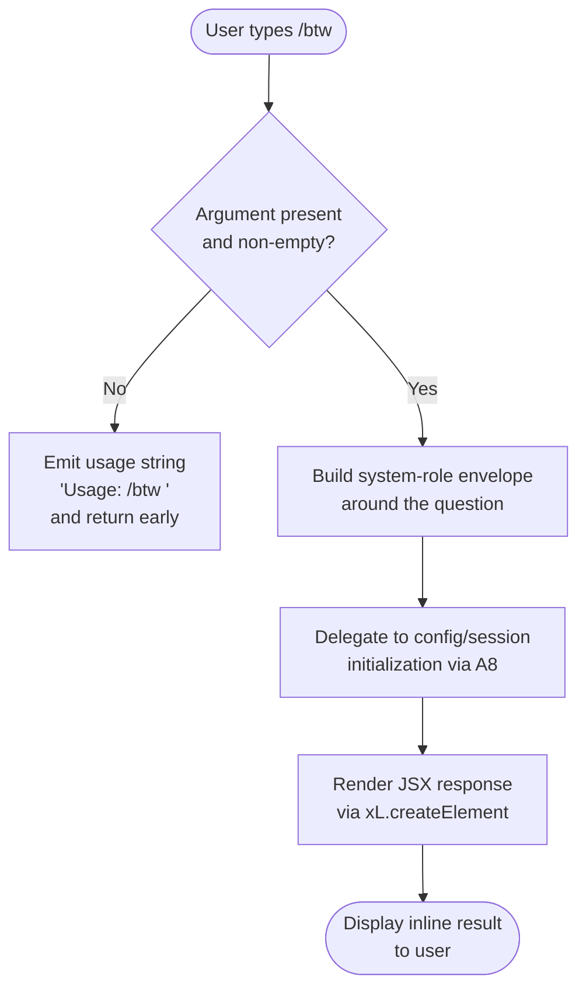

# `/btw`

> Analysis basis: CC v2.1.132 bundle.js (AST extraction + Claude interpretation)
> Minimum version: v2.1.132

---

## Overview

The `/btw` ("by the way") command lets the user pose a quick side question to the agent without derailing the main conversation thread. It is a `local-jsx` command that fires immediately on invocation, dispatches the question as a `control-request` to the thin client, and renders its response inline via a JSX component. The command requires a `<question>` argument; if no argument is supplied the handler emits a usage string and returns early.

---

## Registration

| Field | Value |
|---|---|
| type | `local-jsx` |
| name | `btw` |
| description | `Ask a quick side question without interrupting the main conversation` |
| argumentHint | `<question>` |
| immediate | `true` |
| thinClientDispatch | `control-request` |
| module_id | `ur9` |
| load_inline | `true` |
| handler (Arbor) | `Ye4` (AsyncFunction, resolved via `module_id`) |
| loc_byte span | 9795621 – 9795860 |
| `loc_byte_end` | `9795860` |
| `arbor_handler.name` | `Ye4` |
| `arbor_handler.kind` | `AsyncFunction` |
| `arbor_handler.resolution_path` | `module_id` |
| `arbor_handler.fqn` | `claude-2.1.132::Ye4` |
| `arbor_handler.n_hits` | `0` |

Analysis basis: CC v2.1.132 bundle.js:+9795621

---

## Input Branching

The handler `Ye4` checks whether the user supplied a non-empty question argument immediately on entry. If no argument is present it issues a usage hint and exits; otherwise it prepares a system-role message and renders the JSX response component.



Analysis basis: CC v2.1.132 bundle.js:+9795228 (early-exit / usage path), +9795269 (system role literal), +9795338 (JSX render call)

---

## Behavioral Spec

### 1 — Argument Validation and Usage Guard

When the command is invoked, the handler inspects the trimmed argument string. If that string is absent or empty, it returns the literal usage message `"Usage: /btw <your question>"` immediately, performing no further work.

```
async function btwCommandHandler(args, context):
    question = args.trim()
    if question is empty:
        return usageMessage("Usage: /btw <your question>")

    envelope = buildSystemMessage(question)
    sessionResult = await initializeSessionState(envelope, context)
    return renderJSXResponse(sessionResult)
```

Analysis basis: CC v2.1.132 bundle.js:+9795228 (usage literal), +9795230

### 2 — Message Envelope Construction

The question text is wrapped in a message object whose `role` field is set to `"system"`. This ensures the side question is injected with system-level framing rather than appearing as a raw user turn, preserving the main conversation structure.

```
function buildSystemMessage(questionText):
    return {
        role: "system",
        content: questionText
    }
```

Analysis basis: CC v2.1.132 bundle.js:+9795269

### 3 — Session and Configuration Initialization (`A8` subtree)

After envelope construction, the handler calls the session-state initializer (identifier `A8`). This function:

1. Reads or acquires the per-session configuration via the config-lock subsystem (`Nt8`).
2. Checks for an `ENOENT` condition on the config file; if missing it skips the read gracefully.
3. Applies file-backup rotation: up to **5 backup copies** are kept (Analysis basis: CC v2.1.132 bundle.js:+3106328), with filenames containing the `.backup.` infix (Analysis basis: CC v2.1.132 bundle.js:+3106195).
4. Acquires a file-system lock; if lock acquisition exceeds the expected window it records a `tengu_config_lock_contention` event and logs the warning `"Lock acquisition took longer than expected - another Claude instance may be running"` (Analysis basis: CC v2.1.132 bundle.js:+3105309).
5. If a stale write is detected (re-read config is missing auth data that the in-memory cache holds) it fires `tengu_config_stale_write` and refuses to persist, guarding against credential wipe (Analysis basis: CC v2.1.132 bundle.js:+3105534; see also literal at +3105725).
6. Config files are written with octal permission `0o600` (decimal **384**) (Analysis basis: CC v2.1.132 bundle.js:+3106610).
7. Lock-wait timeout for config persistence is **60 000 ms** (Analysis basis: CC v2.1.132 bundle.js:+3106079).

```
async function initializeSessionState(envelope, context):
    configData = acquireConfigWithLock()   // Nt8 subtree
    if configData is missing (ENOENT):
        configData = defaultConfig()

    if lockContentionDetected:
        emit telemetry("tengu_config_lock_contention")
        log warning("Lock acquisition took longer than expected ...")

    if authLossWouldOccurOnWrite:
        emit telemetry("tengu_config_stale_write")
        abort write

    return buildSessionBundle(envelope, configData)
```

Analysis basis: CC v2.1.132 bundle.js:+3102400 (`A8` entry), +3105098 (config read), +3105664 (ENOENT guard), +3105398 (lock-contention telemetry)

### 4 — Background Spare-Session Management (reachable via `A8 → w`)

The `w` function manages background spare sessions that can be claimed by foreground requests to reduce latency. Relevant behaviours observed in the call graph:

- A SIGKILL escalation path exists for unresponsive background processes: processes are first sent a softer signal; after a **30-second** wait (Analysis basis: CC v2.1.132 bundle.js:+14129927) escalating to **15 seconds** (Analysis basis: CC v2.1.132 bundle.js:+14129938) a `SIGKILL` is issued (Analysis basis: CC v2.1.132 bundle.js:+14130020). The escalation is recorded as `tengu_bg_dispatch_sigkill_escalate`.
- A new background spare is enabled (`tengu_bg_spare_enable`) and, when claimed by a control-request, recorded as `tengu_bg_spare_claim`.
- If claiming fails the event `tengu_bg_spare_claim_fail` is fired and the string `"unknown"` is used as the failure-reason sentinel (Analysis basis: CC v2.1.132 bundle.js:+14131137).

```
function manageBackgroundSpareSession(sessionRegistry):
    if existingProcess is unresponsive:
        wait(30s)
        if still unresponsive:
            wait(15s)
            send SIGKILL
            emit telemetry("tengu_bg_dispatch_sigkill_escalate")

    newSpare = spawnSpareProcess()
    emit telemetry("tengu_bg_spare_enable")

    if claimRequest arrives:
        try:
            claim(newSpare)
            emit telemetry("tengu_bg_spare_claim")
        catch:
            emit telemetry("tengu_bg_spare_claim_fail", reason="unknown")
```

Analysis basis: CC v2.1.132 bundle.js:+14129927, +14130020, +14130767, +14130886, +14131149

### 5 — Atomic File-Write Helper (reachable via `QyH`)

The safe-write utility uses a write-to-temp-then-rename pattern with `fsync` and `fchmod`. It:

1. Generates a random hex suffix of **6 bytes** (12 hex chars) for the temp filename (Analysis basis: CC v2.1.132 bundle.js:+952813).
2. Reads and preserves existing file permissions before writing (**permission mode `0o600`** / decimal 384 used as default).
3. Calls `fchmodSync` to apply original permissions to the temp file and logs `"Applied original permissions to temp file"` (Analysis basis: CC v2.1.132 bundle.js:+953312).
4. Calls `fsyncSync` before rename to guarantee durability.
5. Renames the temp file atomically; on failure unlinks the temp file.
6. Handles `ELOOP` and `ENOTDIR` as terminal symlink errors (Analysis basis: CC v2.1.132 bundle.js:+952458, +952471).

```
function atomicWriteFile(targetPath, content):
    randomSuffix = randomBytes(6).toString("hex")  // 12-char hex
    tempPath     = targetPath + "." + randomSuffix

    existingMode = readExistingPermissions(targetPath) or DEFAULT_MODE
    writeFileSync(tempPath, content)
    fchmodSync(tempPath, existingMode)
    log("Applied original permissions to temp file")
    fsyncSync(tempPath)
    renameSync(tempPath, targetPath)
    if rename fails:
        unlinkSync(tempPath)
        raise
```

Analysis basis: CC v2.1.132 bundle.js:+952797, +952975, +953233, +953291, +953357, +953485, +953642

### 6 — JSX Response Rendering

After the session bundle is resolved, `Ye4` calls `xL.createElement` to mount the inline response component. Because the command is marked `immediate: true`, this render happens synchronously within the command lifecycle without waiting for a separate user confirmation.

```
function renderInlineResponse(sessionBundle):
    element = createElement(BtwResponseComponent, { session: sessionBundle })
    return element
```

Analysis basis: CC v2.1.132 bundle.js:+9795338

### 7 — Jitter Utility (`H`)

The `H` helper (called from `Ye4` at depth 1) generates a random delay for retry back-off and similar use-cases. It combines `Math.random` with constants **2** and **1** (Analysis basis: CC v2.1.132 bundle.js:+12264283, +12264299) to produce a bounded jitter value and schedules the deferred action via `setTimeout` (Analysis basis: CC v2.1.132 bundle.js:+12264322).

```
function jitterDelay(baseMs):
    factor = Math.random() * 2 + 1   // range [1, 3)
    setTimeout(callback, baseMs * factor)
```

Analysis basis: CC v2.1.132 bundle.js:+12264285, +12264322

---

## State & Side Effects

| Item | Detail |
|---|---|
| Telemetry — `tengu_config_lock_contention` | Fired when the config file lock takes longer than expected (bundle.js:+3105398) |
| Telemetry — `tengu_config_stale_write` | Fired when a write would silently drop auth credentials (bundle.js:+3105534) |
| Telemetry — `tengu_config_parse_error` | Fired when the config JSON cannot be parsed (bundle.js:+3107927) |
| Telemetry — `tengu_config_auth_loss_prevented` | Fired when auth-credential loss is actively blocked (bundle.js:+3105877) |
| Telemetry — `tengu_bg_dispatch_sigkill_escalate` | Fired when a background process is SIGKILL-escalated (bundle.js:+14129972) |
| Telemetry — `tengu_bg_spare_enable` | Fired when a background spare session is spawned (bundle.js:+14130767) |
| Telemetry — `tengu_bg_spare_claim` | Fired when a spare session is successfully claimed (bundle.js:+14130886) |
| Telemetry — `tengu_bg_spare_claim_fail` | Fired when spare-session claim fails (bundle.js:+14131149) |
| Config file write | Atomic write via temp-file + rename; permissions enforced at `0o600` (decimal 384) |
| Config backup rotation | Up to 5 `.backup.`-infix copies retained |
| Config lock | File-system lock with 60 000 ms timeout |
| Background spare session | May be spawned or claimed as a side effect of command dispatch |
| JSX render | Mounts inline response component synchronously (immediate: true) |
| thinClientDispatch | `control-request` — the question is forwarded to the thin client control channel |

---

## Version History

| Version | Change |
|---|---|
| v2.1.132 | Initial analysis |

---

## Common Mistakes

1. **Omitting the argument**: Because `/btw` requires `<question>`, invoking it as bare `/btw` returns only the usage string `"Usage: /btw <your question>"` — no model call is made.
2. **Expecting conversation-thread interruption**: The command is explicitly designed *not* to interrupt the main conversation. Responses are rendered inline as a side channel; do not rely on `/btw` output appearing in the primary assistant turn.
3. **Assuming synchronous config writes are safe**: The config-write path is guarded by a file-system lock with a 60 000 ms timeout. Running multiple Claude Code instances simultaneously can trigger lock-contention telemetry and delayed writes.
4. **Ignoring auth-loss protection**: If the in-memory config cache holds auth data that a re-read of the config file does not, the write is deliberately aborted. This is not a bug; it is an intentional safeguard (see `tengu_config_stale_write`).
5. **Confusing `immediate: true` semantics**: The `immediate` flag means the command fires without a secondary confirmation prompt. It does not mean the underlying async operations are synchronous.

---

## Appendix — Identifier Mapping

> For bundle debugging only. Identifiers change across versions.

| Identifier | Role |
|---|---|
| `Ye4` | Main `/btw` command handler (AsyncFunction; Arbor `module_id` resolution) |
| `H` | Jitter/delay utility (wraps `Math.random` + `setTimeout`) |
| `A8` | Session and global config initializer |
| `Nt8` | Config file read-with-lock core |
| `A` | Filesystem abstraction (readdirStringSync, statSync) |
| `F6` | File-existence / access check helper |
| `K` | Secondary filesystem layer (statSync, copyFileSync, unlinkSync, readdirStringSync, mkdirSync) |
| `q` | Tertiary filesystem layer (unlinkSync, readFileSync, statSync, mkdirSync, readdirStringSync, copyFileSync, renameSync) |
| `vH` | String conversion utility |
| `AZ` | File write helper (writeFileSync + path join) |
| `Wc_` | Config object merge/update (uses Object.assign) |
| `Bg8` | Config state builder |
| `k` | Message formatting / header builder |
| `Lsq` | Log-level / debug-output router |
| `RH` | JSON serializer wrapper |
| `mf` | Content-redaction / truncation helper |
| `gNH` | Sanitization helper (delegates to `slA`) |
| `Msq` | Large-payload / chunked write handler (uses Buffer.byteLength) |
| `d` | Internal error/diagnostic logger |
| `j8` | Error-type discriminator |
| `k5H` | Config file reader with backup and parse logic |
| `B6` | JSON.parse wrapper |
| `Fh` | String prefix-strip utility |
| `bJ1` | Backup directory walker |
| `fH` | File-hook / watcher registration |
| `kt8` | Backup path builder (Xz.join + version label) |
| `w` | Background spare-session manager |
| `uq6` | Config-lock acquisition helper |
| `_` | Case-normalizer (toLowerCase) |
| `f` | Socket/connection close helper |
| `Z` | Startswith-gated filter |
| `P` | SDK/HTTP transport connector |
| `gX8` | Transport type selector |
| `HA` | Error constructor wrapper |
| `I` | Versioned slice helper |
| `QyH` | Atomic file-write (temp + rename + fsync + fchmod) |
| `O` | Process/session state object (isSymbolicLink, Q8) |
| `D8` | Error-tag helper |
| `FbH` | Session flags validator |
| `CJ1` | Object.entries iterator helper |
| `gbH` | Timestamp/Date.now sampler |
| `vt8` | Versioned config-directory resolver |