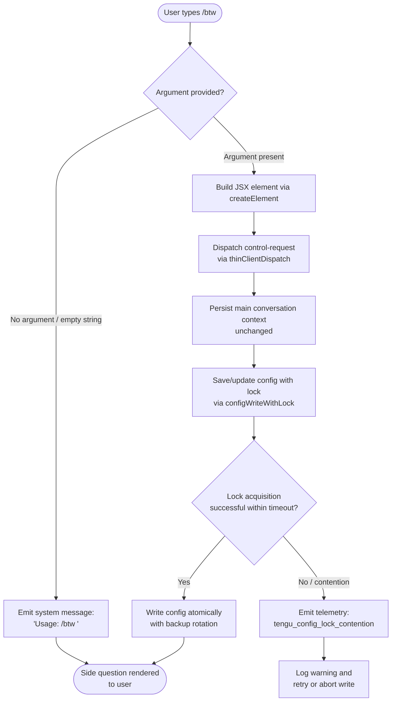

# `/btw`

> Analysis basis: CC v2.1.132 bundle.js (AST extraction + Claude interpretation)
> Minimum version: v2.1.132

---

## Overview

The `/btw` ("by the way") slash command allows a user to ask a quick side question without breaking the flow of the main ongoing conversation. When invoked with a question argument, it dispatches the question immediately as a `control-request` to the thin client, rendering the question via a JSX element while persisting the main conversation context. If no argument is provided, the command responds with a usage hint.

---

## Registration

| Field | Value |
|---|---|
| type | `local-jsx` |
| name | `btw` |
| description | Ask a quick side question without interrupting the main conversation |
| argumentHint | `<question>` |
| immediate | `true` |
| thinClientDispatch | `control-request` |
| module_id | `ur9` |

Analysis basis: CC v2.1.132 bundle.js:+9795621

---

## Input Branching

The command handler inspects the trimmed argument string immediately upon invocation. The `immediate: true` flag means the handler fires without waiting for a follow-up Enter keypress.



Analysis basis: CC v2.1.132 bundle.js:+9795228, +9795230, +9795269, +9795338

---

## Behavioral Spec

### Entry Point: Command Handler

```
function btwCommandHandler(inputArgument):
    trimmed = inputArgument.trim()
    if trimmed is empty:
        emit message of type "system" with text "Usage: /btw <your question>"
        return
    element = createElement(BtwDisplayComponent, { question: trimmed })
    dispatch("control-request", element)
    persistConfigState()
```

Analysis basis: CC v2.1.132 bundle.js:+9795228, +9795230, +9795269, +9795292, +9795338

---

### Sub-feature: Randomised Jitter Delay

The call graph shows that the random-jitter helper is reached from the command entry point. It generates a small random delay before certain async operations (most likely used internally during config lock acquisition retries).

```
function randomJitterDelay(baseDelayMs):
    // Observed constants: multiplier range [1, 2]
    jitter = Math.random() * (2 - 1) + 1   // result in [1.0, 2.0)
    actualDelay = baseDelayMs * jitter
    setTimeout(callback, actualDelay)
```

Analysis basis: CC v2.1.132 bundle.js:+12264283, +12264285, +12264299, +12264322

---

### Sub-feature: Config Write with File Lock

When the command triggers a state update, it calls through to a locked config-write subsystem. The subsystem:

1. Resolves the config file path and ensures the parent directory exists.
2. Acquires a filesystem lock by creating a lock file; if the lock file already exists (`EEXIST`) and is older than the lock timeout, it is considered stale and removed.
3. Reads the current on-disk config and compares it against the in-memory cache before writing, specifically to detect auth-field loss (guarding against the regression described in GH #3117).
4. Writes the config atomically: the new content is written to a timestamped backup file, then copied to the canonical path.
5. Rotates old backup files, keeping only the most recent 5.
6. Releases the lock by unlinking the lock file.

```
function configWriteWithLock(configPath, newConfigData, cachedConfig):
    parentDir = path.dirname(configPath)
    ensureDirectoryExists(parentDir)
    lockFilePath = buildLockPath(configPath)

    acquired = false
    deadline = Date.now() + LOCK_TIMEOUT_MS          // 60000 ms
    while not acquired:
        try:
            createLockFileExclusive(lockFilePath)     // fails with EEXIST if held
            acquired = true
        except EEXIST:
            stat = fs.statSync(lockFilePath)
            age = Date.now() - stat.mtimeMs
            if age > LOCK_TIMEOUT_MS:                 // 60000 ms
                emitTelemetry("tengu_config_lock_contention")
                fs.unlinkSync(lockFilePath)            // remove stale lock
            elif Date.now() > deadline:
                logWarning("Lock acquisition took longer than expected" +
                           " - another Claude instance may be running")
                break
            else:
                wait(randomJitterDelay(100))           // 100 ms base

    diskConfig = readAndParseConfig(configPath)

    if cachedConfig has auth fields AND diskConfig is missing those auth fields:
        emitTelemetry("tengu_config_stale_write")
        logError("saveConfigWithLock: re-read config is missing auth that" +
                 " cache has; refusing to write to avoid wiping ~/.claude.json." +
                 " See GH #3117.")
        releaseLock(lockFilePath)
        return

    backupPath = buildBackupPath(configPath, Date.now())  // contains ".backup."
    writeFileSync(backupPath, serialize(newConfigData), { encoding: "utf-8",
                                                          mode: 0o600 })  // 384 decimal
    fs.copyFileSync(backupPath, configPath)

    rotateBackups(configPath, maxKeep=5)

    releaseLock(lockFilePath)
```

Lock timeout: 60 000 ms (Analysis basis: CC v2.1.132 bundle.js:+3106079)
Lock retry base delay: 100 ms (Analysis basis: CC v2.1.132 bundle.js:+3105303)
Maximum backup files retained: 5 (Analysis basis: CC v2.1.132 bundle.js:+3106328)
Config file write mode: `0o600` (384 decimal) (Analysis basis: CC v2.1.132 bundle.js:+3106610)
Config file encoding: `utf-8` (Analysis basis: CC v2.1.132 bundle.js:+3106597)
Lock-contention warning text: "Lock acquisition took longer than expected - another Claude instance may be running" (Analysis basis: CC v2.1.132 bundle.js:+3105309)
Auth-loss guard message (saveConfigWithLock path): "saveConfigWithLock: re-read config is missing auth that cache has; refusing to write to avoid wiping ~/.claude.json. See GH #3117." (Analysis basis: CC v2.1.132 bundle.js:+3105725)
Auth-loss guard message (saveGlobalConfig fallback path): "saveGlobalConfig fallback: re-read config is missing auth that cache has; refusing to write. See GH #3117." (Analysis basis: CC v2.1.132 bundle.js:+3102607)

---

### Sub-feature: Config Read with Access Guard

Before any read of the global config is permitted, an access-allowed guard is evaluated. If config is accessed before the system is ready, an `Error` is thrown with the message "Config accessed before allowed."

```
function guardedReadConfig(configPath):
    if not configAccessAllowed():
        raise Error("Config accessed before allowed.")
    raw = fs.readFileSync(configPath, encoding)
    parsed = parseJSON(raw)
    return parsed
```

Analysis basis: CC v2.1.132 bundle.js:+3107284, +3107290, +3107346

---

### Sub-feature: Global Config Save (Fallback Path)

A separate fallback save path exists (reached via `saveGlobalConfig`). It performs the same auth-loss check as the primary locked path and refuses to write if auth fields present in the cache are absent from the on-disk re-read.

```
function saveGlobalConfigFallback(configPath, newData, cachedConfig):
    diskConfig = readAndParseConfig(configPath)
    if cachedConfig has auth AND diskConfig lacks auth:
        emitTelemetry("tengu_config_auth_loss_prevented")
        logError("saveGlobalConfig fallback: re-read config is missing auth" +
                 " that cache has; refusing to write. See GH #3117.")
        return
    writeConfig(configPath, newData)
```

Analysis basis: CC v2.1.132 bundle.js:+3102597, +3102607

---

### Sub-feature: Message Log Write

When the system-message usage hint is emitted, or when the side question is recorded, a message-log write is performed. The log writer uses `path.dirname`, ensures the directory exists, and writes with a timestamp sourced from `Date.now`.

```
function writeMessageToLog(logDir, message):
    dir = path.dirname(logDir)
    fs.mkdirSync(dir, { recursive: true })
    timestamp = Date.now()
    entry = buildLogEntry(timestamp, message)
    appendToLog(logDir, entry)
```

Analysis basis: CC v2.1.132 bundle.js:+3105098, +3105104, +3105125, +3105170

---

### Sub-feature: Logger / Severity Routing

Internal log calls route through a severity-aware logger. The `/btw` call graph reaches log levels `"debug"` and `"error"`.

```
function routeLog(level, messageText):
    if level is "debug":
        forwardToDebugSink(messageText)
    elif level is "error":
        forwardToErrorSink(messageText)
    // additional levels handled by caller
```

Analysis basis: CC v2.1.132 bundle.js:+161637, +3105266

---

## State & Side Effects

| Item | Detail |
|---|---|
| Telemetry — `tengu_config_lock_contention` | Fired when a stale or contested filesystem lock is detected during config write (bundle.js:+3105398) |
| Telemetry — `tengu_config_stale_write` | Fired when a config write is blocked because the on-disk file is missing auth data present in the cache (bundle.js:+3105534) |
| Telemetry — `tengu_config_auth_loss_prevented` | Fired on the global-config fallback path when an auth-loss write is refused (bundle.js:+3105877) |
| Telemetry — `tengu_config_parse_error` | Fired when the config file cannot be parsed during a guarded read (bundle.js:+3107927) |
| Hook registration | <!-- TODO: not found in depth-2 traversal; needs --depth 4 --> |
| appState changes | The main conversation message history is left untouched; only the side-question payload is dispatched as a `control-request` (bundle.js:+9795621) |
| Config file side effect | Atomic write + backup rotation of the global config file (`~/.claude.json`); up to 5 `.backup.` files retained (bundle.js:+3106195, +3106328) |
| Config file permissions | Written with mode `0o600` (384 decimal) (bundle.js:+3106610) |
| Sound | <!-- TODO: not found in depth-2 traversal; needs --depth 4 --> |
| thinClientDispatch | Dispatches a `control-request` event to the thin client layer carrying the JSX-rendered side question (bundle.js:+9795621) |

---

## Version History

| Version | Change |
|---|---|
| v2.1.132 | Initial analysis — command registered as `local-jsx`, `immediate: true`, dispatching via `control-request` |

---

## Common Mistakes

1. **Omitting the argument entirely.** Typing `/btw` with no text produces the system-level usage hint `"Usage: /btw <your question>"` and does not dispatch any request. Always include the question text directly after the command.
2. **Expecting the side question to interrupt or replace the main conversation.** The command is explicitly designed to leave the primary conversation context intact. The side question is injected as a separate `control-request` and does not alter the ongoing message thread.
3. **Assuming the command is asynchronous or requires confirmation.** The `immediate: true` flag means the handler executes the moment the command is recognised; there is no secondary confirmation step.
4. **Ignoring lock-contention warnings.** If the log emits "Lock acquisition took longer than expected - another Claude instance may be running", a concurrent Claude process may be writing the config. Running multiple Claude instances against the same config file simultaneously can lead to write contention.
5. **Expecting auth credentials to survive a corrupt config round-trip.** The guard described in GH #3117 is intentional: if the on-disk config is found to be missing auth fields that exist in the cache, the write is refused entirely to prevent wiping credentials. This is a safety mechanism, not a bug.

---

## Appendix — Identifier Mapping

> For bundle debugging only. Identifiers change across versions.

| Identifier | Role |
|---|---|
| `Ye4` | `/btw` command handler (entry point) |
| `H` | Random jitter delay helper |
| `A8` | Global config save orchestrator |
| `Nt8` | Config write with filesystem lock (primary path) |
| `FbH` | Config serialiser / formatter |
| `CJ1` | Config object entry iterator (uses `Object.entries`) |
| `gbH` | Timestamp helper for config writes (uses `Date.now`) |
| `k` | Severity-aware logger / log router |
| `k5H` | Guarded config read (enforces access-allowed check) |
| `uq6` | Auth-loss detection / comparison utility |
| `d` | Log entry builder / appender |
| `vt8` | Message log write helper (path resolution + directory creation) |