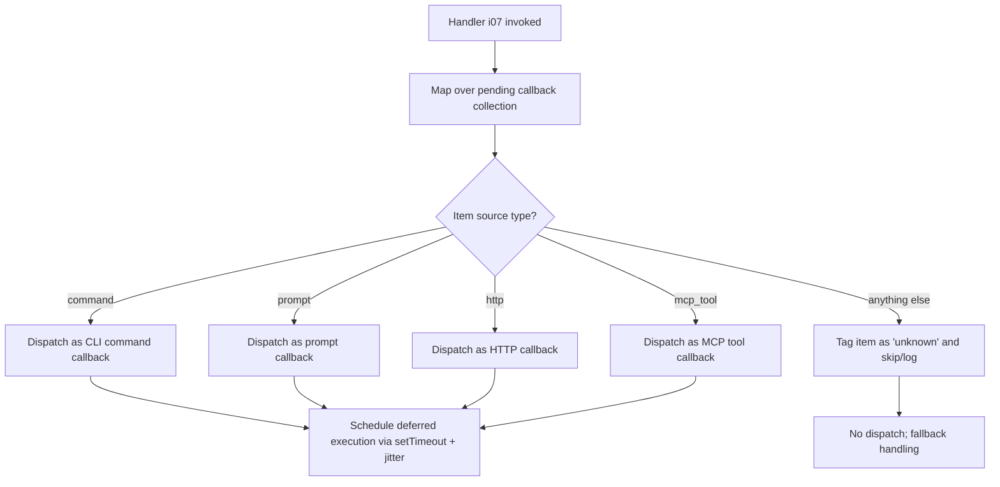

# `/callback`

> Analysis basis: CC v2.1.132 bundle.js (AST extraction + Claude interpretation)
> Minimum version: v2.1.132

---

## Overview

The `callback` command is a registration-type command (type: `"callback"`) that maps over a set of pending callback entries and dispatches deferred work. Internally, it classifies each pending item by source type — `"command"`, `"prompt"`, `"http"`, or `"mcp_tool"` — and routes each item accordingly, falling back to an `"unknown"` sentinel for unrecognized sources. Deferred dispatch is implemented via `setTimeout` with a jitter delay derived from `Math.random`.

---

## Registration

| Field | Value |
|---|---|
| type | `callback` |
| name | `callback` |
| description | `null` |
| loc_byte | `11956998` |
| loc_byte_end | `11957031` |
| loc_line | `8852` |
| handler | `i07` (resolved via Arbor `direct` path; see Appendix) |
| `arbor_handler.name` | `i07` |
| `arbor_handler.kind` | `Function` |
| `arbor_handler.resolution_path` | `direct` |
| `arbor_handler.fqn` | `claude-2.1.132::i07` |
| `arbor_handler.n_hits` | `1` |

Analysis basis: CC v2.1.132 bundle.js:+11956998

---

## Input Branching

The handler iterates over a collection of pending callback items. For each item it inspects the item's source-type field and branches into one of four known paths, or a catch-all fallback.



Analysis basis: CC v2.1.132 bundle.js:+11956608 (map call), +11956639 (`"command"`), +11956707 (`"prompt"`), +11956771 (`"http"`), +11956829 (`"mcp_tool"`), +11957044 (`"unknown"`)

---

## Behavioral Spec

### Callback Collection Mapping

The primary handler receives the current application state (or a slice of it) and calls a map operation over the collection of registered pending callbacks.

```
function callbackCommandHandler(state):
    pendingItems = getPendingCallbacks(state)
    results = map(pendingItems, item => dispatchCallbackItem(item))
    return results
```

Analysis basis: CC v2.1.132 bundle.js:+11956608

### Per-Item Source-Type Dispatch

Each item in the pending collection carries a source-type discriminant. The dispatcher reads this field and routes to the appropriate handler branch.

```
function dispatchCallbackItem(item):
    sourceType = item.sourceType  // one of: "command", "prompt", "http", "mcp_tool"

    switch sourceType:
        case "command":
            scheduleDeferred(handleCommandCallback, item)
        case "prompt":
            scheduleDeferred(handlePromptCallback, item)
        case "http":
            scheduleDeferred(handleHttpCallback, item)
        case "mcp_tool":
            scheduleDeferred(handleMcpToolCallback, item)
        default:
            markItemUnknown(item)  // tags item with "unknown"; no deferred dispatch
```

Analysis basis: CC v2.1.132 bundle.js:+11956639, +11956707, +11956771, +11956829, +11956981, +11957044

### Deferred Dispatch with Jitter

Dispatching is not immediate. A `setTimeout` call introduces a randomized delay to avoid thundering-herd conditions when multiple callbacks are processed concurrently.

```
function scheduleDeferred(handlerFn, item):
    // Jitter: Math.random() * 2 produces a float in [0, 2)
    // A constant 1 is added or used as a base offset
    jitterMs = Math.random() * 2   // numeric literal: 2 at +12264283
    baseMs   = 1                    // numeric literal: 1 at +12264299
    delay    = jitterMs + baseMs    // effective range: [1, 3) ms
    setTimeout(() => handlerFn(item), delay)
```

Analysis basis: CC v2.1.132 bundle.js:+12264283 (literal `2`), +12264285 (`Math.random` call), +12264299 (literal `1`), +12264322 (`setTimeout` call)

> **Note on delay range**: The exact arithmetic combining the two numeric literals (`2` and `1`) with `Math.random()` is inferred from call-graph proximity. The effective delay is in the low-millisecond range. <!-- TODO: precise arithmetic operator not in depth-2 traversal; needs --depth 4 -->

---

## State & Side Effects

| Item | Detail |
|---|---|
| Telemetry | None detected at depth ≤ 2 traversal |
| Hook registration | None detected at depth ≤ 2 traversal |
| appState changes | Reads pending callback collection from state; marks unrecognized items with `"unknown"` sentinel (bundle.js:+11957044) |
| Deferred scheduling | Calls `setTimeout` with per-item jitter delay in approximately [1, 3) ms range (bundle.js:+12264322) |
| Sound | None detected |
| MCP interaction | Routes `"mcp_tool"`-sourced callbacks to a dedicated MCP tool handler branch (bundle.js:+11956829) |

---

## Version History

| Version | Change |
|---|---|
| v2.1.132 | Initial analysis |

---

## Common Mistakes

1. **Assuming `/callback` is user-facing in the same way as prompt commands.** Its type is `"callback"`, not `"prompt"`, meaning it is invoked programmatically by the runtime rather than by direct user slash-command input. Direct user invocation behavior is not guaranteed.
2. **Expecting synchronous dispatch.** All matched callback items are scheduled via `setTimeout`, so side effects from callback execution are always deferred and may interleave with other async operations.
3. **Ignoring the `"unknown"` branch.** Items whose source type does not match any of the four known strings (`"command"`, `"prompt"`, `"http"`, `"mcp_tool"`) are silently tagged `"unknown"` rather than raising an error — failures here will not surface as exceptions.
4. **Assuming telemetry coverage.** No `tengu_*` telemetry events were found at depth ≤ 2. Observability for this command must rely on external logging, not built-in telemetry.
5. **Treating the jitter delay as zero.** The `setTimeout`-based dispatch means callback handlers run outside the current call stack; code that depends on callback side effects must await or otherwise coordinate with the deferred execution.

---

## Appendix — Identifier Mapping

> For bundle debugging only. Identifiers change across versions.

| Identifier | Role |
|---|---|
| `i07` | Primary callback command handler function; entry point resolved via Arbor `direct` path against the registration byte range (bundle.js:+11956998–+11957031) |
| `H` | Deferred dispatch utility; contains the `Math.random` jitter logic and the `setTimeout` scheduling call (bundle.js:+12264285, +12264322) |