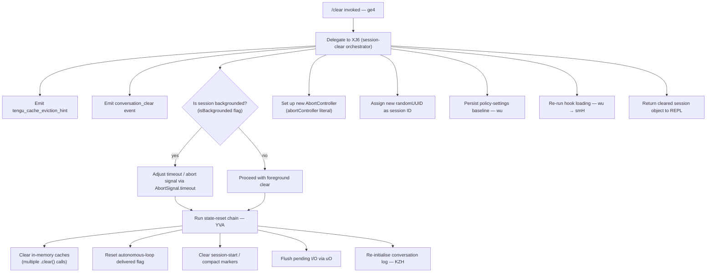

# `/clear`

> Analysis basis: CC v2.1.132 bundle.js (AST extraction + Claude interpretation)
> Minimum version: v2.1.132

---

## Overview

The `/clear` command (also reachable via `/reset` and `/new`) starts a fresh conversation session with an empty context window while preserving the previous session on disk. The prior session remains resumable via `/resume`. Internally the command fires a cache-eviction hint, emits a `conversation_clear` telemetry event, and orchestrates a full in-process state reset before handing control back to the REPL loop.

---

## Registration

| Field | Value |
|---|---|
| type | `local` |
| name | `clear` |
| description | `Start a new session with empty context; previous session stays on disk (resumable with /resume)` |
| aliases | `reset`, `new` |
| supportsNonInteractive | `true` |
| thinClientDispatch | `post-text` |
| module\_id | `Oo9` |
| load\_inline | `true` |
| handler (Arbor) | `ge4` (AsyncFunction, resolved via `module_id`) |
| `loc_byte_end` | `9828918` |
| `arbor_handler.name` | `ge4` |
| `arbor_handler.kind` | `AsyncFunction` |
| `arbor_handler.resolution_path` | `module_id` |
| `arbor_handler.fqn` | `claude-2.1.132::ge4` |
| `arbor_handler.n_hits` | `0` |

Analysis basis: CC v2.1.132 bundle.js:+9828649 – +9828918

---

## Input Branching

The handler `ge4` immediately delegates to `XJ6` (the session-clear orchestrator). `XJ6` performs several parallel branches whose activation depends on current session state.



Analysis basis: CC v2.1.132 bundle.js:+9828564 (ge4→XJ6), +9826749 (XJ6→session-end branch), +9826888 (`conversation_clear` literal), +9826956 (`isBackgrounded` literal)

---

## Behavioral Spec

### 1. Entry and delegation

```
async function clearCommandHandler(ctx):
    return await sessionClearOrchestrator(ctx)
```

`ge4` is an `AsyncFunction`. Its sole observable effect at this level is forwarding execution to `XJ6`.

Analysis basis: CC v2.1.132 bundle.js:+9828564

---

### 2. Session-end signalling

Before mutating any state, the orchestrator (`XJ6`) calls `sessionEndEmitter` (`oZH`), which emits a `"SessionEnd"` lifecycle event and fires the `tengu_cache_eviction_hint` telemetry event.

```
function signalSessionEnd(sessionCtx):
    emit("SessionEnd")                 // literal at +11904023
    telemetry("tengu_cache_eviction_hint")
    emit("conversation_clear")         // literal at +9826888
```

Analysis basis: CC v2.1.132 bundle.js:+9826749 (XJ6→oZH), +11903996 (oZH→aK), +9826853 (tengu_cache_eviction_hint)

---

### 3. Background-session detection

```
function adjustForBackgroundedSession(sessionCtx):
    if sessionCtx.isBackgrounded == true:
        signal = AbortSignal.timeout(timeoutMs)
    else:
        signal = defaultSignal
    return signal
```

The string literal `"isBackgrounded"` at +9826956 and the call to `AbortSignal.timeout` at +9826809 confirm that the orchestrator reads a background flag from session state and arms a timeout abort signal when the session is not in the foreground.

Analysis basis: CC v2.1.132 bundle.js:+9826809, +9826956

---

### 4. In-process state reset (`YVA` / `cc`)

`YVA` is the main reset routine, reached via `XJ6→YVA`. It calls a large set of cache-clearing helpers in sequence:

```
function inProcessReset(appState):
    clearConversationCache()            // kx1 → ix.clear
    clearPostCompactCache()             // Os1 → $M6.clear, lfA.clear
    clearCompactionResultCache()        // D09 → FEH.clear, oJA.clear
    clearSessionStartState()            // da1 → nUH.clear, AM6.clear
    clearAsyncRequestCache()            // sy8 → ayH.clear
    clearFileChangedCache()             // Ze1 → fH8.clear
    clearBackgroundCache()              // By8 → ryH.clear
    clearPermissionEvalCache()          // PcH → PEA.clear
    clearRenderableCache()              // uo1 → Rc.clear, u3H.clear
    appState.$84.resetAutonomousLoopDelivered()
    notifySessionStart()                // J76 → session_start literal +4367564
    resetCompactFlag()                  // cc → compact literal +5298289
    resetPostCompactCleanupFlag()       // cc → post_compact_cleanup literal +5298237
    resetReplMainThread()               // cc → repl_main_thread literal +5298185
```

The constant `"repl_main_thread"` (+5298185), `"post_compact_cleanup"` (+5298237), `"compact"` (+5298289), and `"session_start"` (+4367564) are all reset during this phase.

Analysis basis: CC v2.1.132 bundle.js:+9825725 (YVA→MVA), +9825741 (YVA→kx1), +9825760 (YVA→cc), +9825992 (YVA→By8), +9826004 (YVA→uo1)

---

### 5. Conversation-log re-initialisation (`KZH`)

After the in-memory reset, `XJ6` calls the log-init routine (`KZH`), which creates a new conversation directory, writes an initial symlink, and opens a fresh log file handle.

```
async function reinitConversationLog(paths):
    await mkdirForNewSession(paths.taskDir)   // SbA → kn.mkdir
    writeDirectoryEntry(paths)                 // GdH, O3
    await kn.symlink(newPath, symlinkPath)
    handle = await kn.open(logFile, "w")
    return handle
```

Analysis basis: CC v2.1.132 bundle.js:+9828252 (XJ6→KZH), +11874850 (kn.symlink), +11874675 (hq8→kn.open)

---

### 6. Pending I/O flush (`uO`)

Before the log is replaced, any pending async writes are drained:

```
async function flushPendingIO(pendingSet):
    for each pendingEntry in pendingSet:
        await pendingEntry.flush()    // uO → A.flush at +11874088
    pendingSet.delete(entry)          // IY8.delete at +11874098
```

Analysis basis: CC v2.1.132 bundle.js:+9827583 (XJ6→uO), +11874088 (A.flush)

---

### 7. New session identity assignment

```
function assignNewSessionId(sessionCtx):
    sessionCtx.id = Mo9.randomUUID()      // +9827155
    sessionCtx.abortController = new AbortController()  // literal +9827518
```

A fresh UUID and a new `AbortController` are assigned so that any in-flight operations from the old session cannot inadvertently cancel the new one.

Analysis basis: CC v2.1.132 bundle.js:+9827155, +9827518

---

### 8. Policy-settings and hook reload (`wu`)

After the session identity is fresh, the plugin/hook system is re-initialised:

```
async function reloadPolicyAndHooks(sessionCtx):
    baseline = loadPolicySettings()         // kj → policySettings literal +5217479
    hookList = buildHookList(sessionCtx)    // smH
    sessionCtx.hooks = hookList
    if allowManagedHooksOnly and no managed plugins:
        log("Skipping plugin hooks...")     // literal +5223407
    else:
        await loadPluginHooks(sessionCtx)   // literal +5223509
```

Analysis basis: CC v2.1.132 bundle.js:+9828342 (XJ6→wu), +5217479 (policySettings), +5223392 (wu→smH), +5223509 (load_plugin_hooks)

---

### 9. Timeout arithmetic (`WJ6`)

`WJ6` is called from `XJ6` to compute an appropriate timeout for the cache-eviction step. It uses:

- `parseInt` (radix 10, literal `10` at +11912035)
- `Number.isFinite` guard (literal `0` floor at +11912068)
- `Math.max` / `Math.min` clamping
- A 1 000 ms constant (+11912211)

```
function computeEvictionTimeout(rawValue):
    parsed = parseInt(rawValue, 10)
    if not Number.isFinite(parsed):
        parsed = 0
    return Math.min(Math.max(parsed, 0), 1000)
```

Analysis basis: CC v2.1.132 bundle.js:+11912024, +11912035, +11912046, +11912068, +11912211, +11912242, +11912255

---

## State & Side Effects

| Item | Detail |
|---|---|
| Telemetry | `tengu_cache_eviction_hint` (+9826853); `tengu_run_hook` (+11947700); `tengu_feature_ok` / `tengu_feature_bad` (+906461 / +906517); `tengu_repl_hook_finished` (+11932935); `tengu_hook_plugin_injected` (+11946284); `tengu_shell_set_cwd` (+8364053); `tengu_session_renamed` (+11811319) |
| Lifecycle events emitted | `"SessionEnd"` (+11904023); `"conversation_clear"` (+9826888); `"SessionStart"` (via J76 / `session_start` literal +4367564) |
| In-memory caches cleared | At least 9 distinct cache stores cleared via `.clear()` calls (ix, $M6, lfA, FEH, oJA, nUH, AM6, ayH, fH8, ryH, PEA, Rc, u3H, kn9) |
| Flags reset | `repl_main_thread`, `post_compact_cleanup`, `compact`, `autonomousLoopDelivered` |
| Session ID | Replaced with a new `randomUUID()` |
| AbortController | A new instance is created; old one is replaced |
| Conversation log | Directory created, symlink updated, new file handle opened |
| Pending I/O | Flushed before log replacement |
| Hooks | Plugin hooks reloaded from settings; managed-hooks-only path skips non-managed plugins |
| Disk persistence | Previous session data is **not** deleted — it remains resumable via `/resume` |
| Sound | <!-- TODO: not found in depth-2 traversal; needs --depth 4 --> |

---

## Version History

| Version | Change |
|---|---|
| v2.1.132 | Initial analysis |

---

## Common Mistakes

1. **Expecting context to be lost permanently.** `/clear` only starts a new context window; the old session is preserved on disk and can be restored with `/resume`. No conversation data is deleted.
2. **Confusing `/clear` with process restart.** The command resets in-memory state and re-opens the conversation log within the running process; it does not restart the `claude` binary.
3. **Using `/clear` to reset MCP connections.** MCP server connections (managed by `UZH` / `M`) are orchestrated at a different level; `/clear` does not tear down or restart MCP transports.
4. **Assuming `/reset` and `/new` behave differently.** Both `reset` and `new` are registered as aliases and trigger the identical handler (`ge4`).
5. **Running `/clear` non-interactively and expecting hooks to fire fully.** Hook types such as `Prompt` stop hooks and `Agent` stop hooks are documented in-bundle as unsupported outside the REPL context (literals at +11948835 and +11949827); non-interactive clears may silently skip those hooks.

---

## Appendix — Identifier Mapping

> For bundle debugging only. Identifiers change across versions.

| Identifier | Role |
|---|---|
| `ge4` | Main async handler for `/clear`; entry point resolved via `module_id` `Oo9` |
| `XJ6` | Session-clear orchestrator; coordinates all sub-steps |
| `WJ6` | Eviction-timeout arithmetic (parseInt + clamp) |
| `kj` | Policy-settings loader (`policySettings`) |
| `R8` | Settings store accessor |
| `Mp` | Miscellaneous helper called during timeout calc |
| `sB` | Secondary helper in timeout path |
| `xfA` | Inner helper called by `sB` |
| `oZH` | Session-end emitter; fires `SessionEnd` and `conversation_clear` |
| `aK` | Lifecycle-event dispatcher |
| `v6` | Shared utility / value accessor |
| `xN` | Auxiliary used by dispatcher and hook runner |
| `qN` | Event-name builder (joins parts with `.join`) |
| `N6` | Notification helper |
| `qP` | Hook-execution runner (central hook pipeline) |
| `yH` | String coercion helper |
| `F_H` | Settings reader used in hook pipeline |
| `k` | Hook-type classifier (reads `debug` / `verbose` flags) |
| `UqH` | Hook context accessor |
| `H` | Random-delay helper (`Math.random` + `setTimeout`) |
| `gbA` | Hook-list builder (reads `PreToolUse`, `PostToolUse`, etc.) |
| `O` | Background-session checker |
| `IPq` | Hook input preparation |
| `FbA` | Hook filter (third-party filter) |
| `VPq` | Hook validation helper |
| `d` | Shared async-state helper |
| `RH` | JSON-stringify wrapper |
| `fH` | Hook log writer (`kyH.push` + `EQ.logError`) |
| `mH` | Async-state mutation helper |
| `uJH` | Notification dispatcher |
| `GT` | Abort/timeout manager (`L.abort`, `clearTimeout`, `setTimeout`) |
| `j` | Callback container |
| `pe` | Permission-evaluation helper |
| `VC` | Validation / context helper |
| `UbA` | MCP-tool hook executor |
| `mY8` | Plain-text hook-output parser |
| `pbA` | HTTP hook executor (`J8.post`) |
| `ZPq` | HTTP hook response parser |
| `pY8` | Shell/spawn hook executor (`BbA.spawn`) |
| `SH` | Session-state sync helper |
| `DD6` | Secondary dispatch helper called by `oZH` |
| `soH` | Abort-signal helper used by orchestrator |
| `M` | MCP-server manager / reload coordinator |
| `UZH` | MCP connection pool manager |
| `qt` | MCP transport builder |
| `wI` | MCP transport init (`oM`, `nwA`) |
| `L` | Padding / list formatter |
| `qA` | MCP server query helper |
| `Qw6` | MCP filter utility |
| `Nr4` | MCP connection timestamper (`Date.now`) |
| `a18` | MCP server property reader |
| `K8` | MCP debug logger (`EQ.logMCPDebug`) |
| `tTA` | MCP OAuth/auth flow handler |
| `eTA` | MCP auth-complete handler |
| `mc9` | MCP state serialiser (`p9H.writeFile`) |
| `aTA` | MCP transport adapter |
| `gwA` | MCP server capability checker |
| `J` | Process-kill list builder (`v.kill`) |
| `S` | Stream-write helper |
| `Z7` | MCP error logger (`EQ.logMCPError`) |
| `vH` | String-conversion wrapper |
| `Cc9` | MCP connection cleanup helper |
| `dw6` | MCP retry-count parser (`parseInt`) |
| `PZA` | MCP timeout-count parser (`parseInt`) |
| `ZBq` | MCP update applier (`H.applyMcpUpdate`) |
| `df8` | MCP diff helper |
| `_` | MCP cleanup / lowercase helper |
| `bI` | MCP client cleanup (`L.cleanup`) |
| `K` | Process-exit / file-write helper |
| `q` | File-unlink helper (`tgq.unlinkSync`) |
| `AZ` | Sync file writer (`FNH.writeFileSync`) |
| `$` | Telemetry batch emitter |
| `mzq` | Telemetry record builder (`Date.now`, `lY`) |
| `j6` | Background-session roster lookup |
| `hq6` | Roster helper A |
| `Rq6` | Roster helper B |
| `Oo` | Roster formatter (`yH`, `Mo`) |
| `uQ6` | Roster deduplication (`Kt8`, `V5H`) |
| `R6` | Roster entry recorder (`Date.now`, `DPK`) |
| `$F7` | MCP remote-retry manager |
| `A` | App-state accessor |
| `t18` | MCP capability-set checker (`KE4`, `fE4`) |
| `o8` | Timeout/abort wrapper |
| `dcH` | MCP disconnect helper |
| `X` | IPC buffer splitter (`Buffer.concat`, `j.indexOf`) |
| `w` | Background-worker lifecycle manager |
| `y` | PTY image handler (`aiH`, `siH`) |
| `LFA` | Background-worker claim+connect (`bm.claim`, `sX8.connect`) |
| `OFA` | Background-worker session framer (roster entry, state transitions) |
| `Y` | Background-session dispose helper |
| `j8` | Shared async joinpoint |
| `R` | IPC write stream |
| `$f` | Stream-end helper |
| `uQ7` | IPC message dispatcher (handles ping/nudge/yield/lease/dispatch/reply etc.) |
| `B6` | JSON parse wrapper |
| `f` | Socket close helper |
| `mQ7` | IPC dispatch sub-helper |
| `sD` | Background-service identifier |
| `MFA` | IPC rate-limit / lease helper |
| `qQq` | IPC back-pressure calculator (`Math.min`, `Date.now`) |
| `k0` | Path join helper (`myH.join`) |
| `g$` | Realpath normaliser (`vb.realpath`) |
| `UKH` | Log-file reader (`vb.open`, `N9_.createInterface`) |
| `bQ7` | Stall-detection helper (`Math.max`) |
| `x` | Write-with-timeout helper |
| `u` | Interval-based poller |
| `Z` | Batch-write buffer |
| `n9H` | IPC nonce generator |
| `UL` | Unix-socket path builder (`NX.join`) |
| `xQ7` | Respawn / idle-stale handler |
| `v` | Blur/focus timer (`BU`, `Math.min`) |
| `l` | Worker-list accessor |
| `c` | Worker-filter accessor |
| `W` | Debounced-batch emitter (`z.add`, `setTimeout`) |
| `Q` | PTY write stream (`pJ6`, `_e9`) |
| `p` | Heartbeat / round-trip timer |
| `g` | Permission classifier (`aq8`, `Bt`) |
| `hW6` | Socket destroy/write helper |
| `G` | Render-queue helper (`Qw6`, `gX8`) |
| `xj` | Session-title helper |
| `LY` | Log-rotation helper |
| `YVA` | Full in-process state-reset coordinator |
| `MVA` | State-reset pre-step |
| `nt` | State-name registry (`a_H`, `N58`, `cF9`, `s58`) |
| `a_H` | State-atom A |
| `N58` | State-atom B |
| `cF9` | State-atom C |
| `s58` | State-atom D |
| `kx1` | Conversation-cache clearer (`ix.clear`) |
| `BWH` | Cache-directory writer (`qo6.mkdir`, `qo6.writeFile`) |
| `waH` | State helper called during reset |
| `cc` | Flag-reset coordinator (resets `repl_main_thread`, `compact`, etc.) |
| `rx` | Helper used by `cc` |
| `me6` | Ready-state cleaner (`dc.delete`) |
| `J76` | Session-start notifier (`session_start`) |
| `Ds` | Dual-store accessor (`A08`, `z08`) |
| `is1` | Inline-state accessor |
| `Qc` | Compact-state accessor |
| `Fe6` | kn9-cache clearer |
| `Os1` | Post-compact cache clearer (`$M6.clear`, `lfA.clear`) |
| `SN` | Object-values enumerator |
| `XMA` | Extra mutation step in `cc` |
| `PcH` | Permission-eval cache clearer (`PEA.clear`) |
| `D09` | Diff-cache clearer (`FEH.clear`, `oJA.clear`) |
| `da1` | Session-name-cache clearer (`nUH.clear`, `AM6.clear`) |
| `sy8` | Async-request cache clearer (`ayH.clear`) |
| `KR1` | Additional reset step |
| `Ze1` | File-changed cache clearer (`fH8.clear`) |
| `sW8` | Existence-check helper (`H.has`) |
| `By8` | Background cache clearer (`ryH.clear`) |
| `SQ9` | Supplemental reset step |
| `uo1` | Renderable-cache clearer (`Rc.clear`, `u3H.clear`) |
| `kD` | Working-directory setter (`FK8.isAbsolute`, `FK8.resolve`) |
| `F6` | File-system flag constant |
| `D8` | Async join helper |
| `Qk8` | CWD-store reader (`gv6.getStore`) |
| `THH` | Path normaliser |
| `_A` | Shared accessor |
| `nWH` | Notification writer |
| `xv` | Extra orchestrator step |
| `uO` | Pending-write flusher (`A.flush`, `IY8.delete`) |
| `vY8` | Tracked-promise wrapper (`SXq.add`, `H.finally`) |
| `nBH` | CLI-client notifier (`jK9`) |
| `jK9` | CLI notification dispatcher |
| `yi1` | Log-format helper (`FLH`) |
| `FLH` | Log formatter |
| `k$` | Session-state helper |
| `hK` | Session-state atom writer |
| `N1` | Atom-subscription manager (`J08.add`, `J08.delete`) |
| `PJ6` | Session-state reader |
| `T28` | UUID emitter (`WHH.randomUUID`, `_G6.emit`) |
| `oF` | Session-state observer |
| `_m` | Conversation-log appender (`wP6.emit`, `LVH`) |
| `LVH` | File-append helper (`_.appendFileSync`, `_.mkdirSync`) |
| `KZH` | Conversation-log re-initialiser (mkdir, symlink, open) |
| `SbA` | Log-directory creator (`kn.mkdir`) |
| `GdH` | Directory-entry builder (`ybA.join`, `ZY8`) |
| `O3` | Alternative directory-entry builder |
| `hq8` | Log-file opener fallback (`kn.open`) |
| `hG` | Subagent-path resolver (`LbA.get`, `D$.join`) |
| `lg` | Subagent-path helper |
| `nf` | Extra orchestrator step |
| `Vf` | Extra orchestrator step |
| `OC` | Worktree-state writer (`$58.emit`, `LVH`) |
| `qe` | Isolation-latch writer (`fXq`) |
| `fXq` | Async file appender (`yK.appendFile`, `yK.mkdir`) |
| `wu` | Policy-settings and hook reload coordinator |
| `tL` | Settings loader factory |
| `smH` | Hook-list builder from settings (`R8`, `Object.entries`) |
| `RyH` | Hook-recording helper (`Date.now`, `E8`) |
| `E8` | Sync file-append hook recorder (`K.appendFileSync`) |
| `D` | Watcher / file-watcher restart manager |
| `lDH` | Settings-file reader (`eYq.readFile`) |
| `Hwq` | Settings-diff calculator (`Math.max`) |
| `E` | Input-event stop handler (`u.preventDefault`) |
| `I` | Watcher instance |
| `VQq` | Watcher-do helper |
| `KM6` | Conversation-runner re-initialiser |
| `iX` | Full conversation-loop runner (the main REPL agent loop) |
| `M1` | UUID generator (`CF9.randomUUID`) |