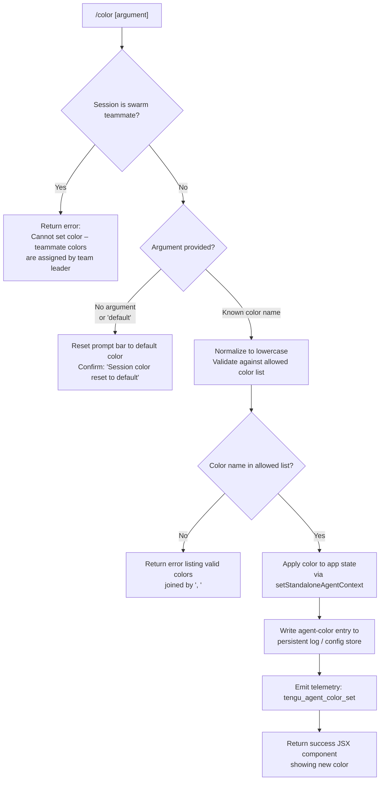

# `/color`

> Analysis basis: CC v2.1.132 bundle.js (AST extraction + Claude interpretation)
> Minimum version: v2.1.132

---

## Overview

The `/color` command sets or resets the visual color of the prompt bar for the current Claude Code session. It accepts an optional color name argument; when omitted or set to `"default"`, it resets the bar to the default appearance. The command is blocked when the current session is a swarm teammate, because teammate colors are controlled by the team leader.

---

## Registration

| Field | Value |
|---|---|
| type | `local-jsx` |
| name | `color` |
| description | `Set the prompt bar color for this session` |
| argumentHint | *(none)* |
| immediate | `true` |
| module\_id | `Yo9` |
| load\_inline | `true` |
| handler | `ce4` (AsyncFunction, resolved via `module_id` path) |
| `loc_byte_end` | `9830301` |
| `arbor_handler.name` | `ce4` |
| `arbor_handler.kind` | `AsyncFunction` |
| `arbor_handler.resolution_path` | `module_id` |
| `arbor_handler.fqn` | `claude-2.1.132::ce4` |
| `arbor_handler.n_hits` | `0` |

Analysis basis: CC v2.1.132 bundle.js:+9830084–+9830301

> **Handler resolution note:** The Arbor symbol graph resolves the handler as `ce4` via the `module_id` path (module `Yo9`). The call graph confirms `ce4` as the true entry point; the BFS synthetic identifier `RM8` is its primary delegate, not the registration entry itself.

---

## Input Branching



Analysis basis: CC v2.1.132 bundle.js:+9829089, +9829100, +9829235, +9829272, +9829290, +9829314, +9829344, +9829418, +9829434, +9829459, +9829470, +9829518, +9829529

---

## Behavioral Spec

### Entry Handler (`ce4`)

The async entry handler (`ce4`) performs two actions before delegating: it retrieves the current app-state handle (via the app-state accessor, `H`) and then immediately calls the primary color-processing function (`RM8`).

```
async function colorCommandEntry(context):
    appStateHandle  = getAppState()           // H
    return await processColorCommand(context, appStateHandle)  // RM8
```

Analysis basis: CC v2.1.132 bundle.js:+9829020, +9829028

---

### Swarm-Teammate Guard

Before any color logic runs, the command checks whether the session participates in a swarm as a *teammate* (non-leader). If so, it immediately returns an error message without modifying any state.

```
function swarmGuard(sessionContext):
    role = getSessionRole(sessionContext)   // p7 → NP → Dg8.getStore
    if role == TEAMMATE:
        return errorResult(
            "Cannot set color: This session is a swarm teammate. " +
            "Teammate colors are assigned by the team leader."
        )
    return PASS
```

Error string (exact): `"Cannot set color: This session is a swarm teammate. Teammate colors are assigned by the team leader."` (bundle.js:+9829100)

Analysis basis: CC v2.1.132 bundle.js:+9829089, +9829100

---

### Color Name Normalization and Validation

When the swarm guard passes, the argument string is processed:

1. Convert the argument to lowercase (`.toLowerCase()`).
2. Check whether the lowercased value is present in the predefined allowed-color list (`de4`).
3. If absent, return an error that lists the valid color names joined by `", "`.

```
function normalizeAndValidate(rawArgument, allowedColors):
    normalized = rawArgument.toLowerCase()

    if normalized not in allowedColors:
        validList = allowedColors.join(", ")
        return errorResult("Invalid color. Valid colors: " + validList)

    return normalized
```

The random-selection path (`Math.floor(Math.random(...))`) indicates that when no argument is provided (or a special random-selection sentinel is used), a random color is chosen from the allowed list.

Analysis basis: CC v2.1.132 bundle.js:+9829235, +9829246, +9829272, +9829290, +9829314, +9829336, +9829344

---

### Default / Reset Path

When the normalized argument equals `"default"`, the command skips color application and instead resets the prompt bar to its default appearance, returning the confirmation message `"Session color reset to default"`.

```
function applyOrReset(normalizedColor, context):
    if normalizedColor == "default":
        resetPromptBarColor(context)        // v6
        return successResult("Session color reset to default")
    else:
        return applyColor(normalizedColor, context)
```

Literal `"default"` — Analysis basis: CC v2.1.132 bundle.js:+9829434
Literal `"Session color reset to default"` — Analysis basis: CC v2.1.132 bundle.js:+9829529

---

### Color Application and State Persistence

When a valid, non-default color is chosen, the command:

1. Calls `setStandaloneAgentContext` to propagate the color into the running agent context (`A.setStandaloneAgentContext`).
2. Invokes the config-persistence function (`le4`) which reads current app state (`H.getAppState`), constructs an update object with the new color, and resolves a promise carrying the result.
3. Delegates to the log-append path (`GJ6`) which writes an `"agent-color"` entry to the persistent log store and emits the `tengu_agent_color_set` telemetry event.

```
async function applyColor(color, context):
    setStandaloneAgentContext(context, color)     // A.setStandaloneAgentContext

    currentState = getAppState()                 // H.getAppState (inside le4)
    updatedState = buildColorUpdate(currentState, color)
    await persistColorConfig(updatedState)        // KzH, ul, Promise.resolve

    writeAgentColorLog("agent-color", color)     // GJ6 → LVH → appendFileSync
    emitTelemetry("tengu_agent_color_set")       // GJ6 → d

    return renderColorResult(color)              // ut, L (padEnd width 40)
```

`"agent-color"` key literal — Analysis basis: CC v2.1.132 bundle.js:+11813646
`tengu_agent_color_set` telemetry — Analysis basis: CC v2.1.132 bundle.js:+11813730
`setStandaloneAgentContext` call — Analysis basis: CC v2.1.132 bundle.js:+9829470

---

### Log / Config Write Sub-path (`GJ6` → `LVH`)

The persistent write path appends the color assignment record to a log file, creating parent directories as needed:

```
function writeAgentColorLog(key, value):
    logEntry = buildLogEntry(key, value)         // qN → tf, f$, _A, D$.join, v6
    serialized = serializeEntry(logEntry)        // RH → JSON.stringify

    try:
        appendFileSync(logFilePath, serialized)  // LVH → _.appendFileSync
    except directoryMissing:
        mkdirSync(dirname(logFilePath))          // LVH → _.mkdirSync, D$.dirname
        appendFileSync(logFilePath, serialized)

    notifyStateSubscribers(logEntry)             // hK → N1 → Object.assign, J08.add/delete
```

Log record size constants: 384 (bundle.js:+11810301), 448 (bundle.js:+11810345)

Analysis basis: CC v2.1.132 bundle.js:+11813625, +11813634, +11810253, +11810274, +11810313, +11810325

---

### Result Rendering

The success result is rendered as a JSX component. Column padding uses a width of 40 characters (`f.padEnd`) with a two-space separator (`"  "`).

```
function renderColorResult(color):
    columns = buildColumns(color)               // L → K.map
    padded  = columns.map(c => c.padEnd(40))   // f.padEnd width 40
    return JSXComponent(padded.join("  "))      // separator "  "
```

Padding width 40 — Analysis basis: CC v2.1.132 bundle.js:+14154022
Separator `"  "` — Analysis basis: CC v2.1.132 bundle.js:+14152051

---

## State & Side Effects

| Item | Detail |
|---|---|
| Telemetry | `tengu_agent_color_set` (bundle.js:+11813730) — fired once per successful non-default color application |
| appState changes | Prompt bar color updated via `A.setStandaloneAgentContext` (bundle.js:+9829470) and `H.getAppState` read-modify path (bundle.js:+9829615) |
| Persistent log write | `"agent-color"` key appended to log file via `appendFileSync`; parent directory created if missing (bundle.js:+11813646, +11810274, +11810313) |
| State subscriber notification | Internal store subscribers notified via `Object.assign` + `J08.add` / `J08.delete` pattern (bundle.js:+53801, +53757, +53779) |
| Sound | <!-- TODO: not found in depth-2 traversal; needs --depth 4 --> |
| Random color selection | `Math.floor(Math.random())` used when no explicit color argument is supplied (bundle.js:+9829235, +9829246) |
| Swarm teammate block | No state changes occur; only an error message is returned (bundle.js:+9829100) |

---

## Version History

| Version | Change |
|---|---|
| v2.1.132 | Initial analysis |

---

## Common Mistakes

1. **Invoking `/color` in a swarm teammate session** — The command will always fail with a swarm-guard error; color assignment for teammates must be performed by the team leader session.
2. **Passing an unrecognized color name** — The argument is validated against a fixed allowed list. Misspellings or hex codes are not accepted; the error response lists the valid names.
3. **Expecting `/color` to persist across unrelated sessions** — The color is stored in the session-level agent context and a per-session log entry. Starting a completely new session does not inherit a previously set color unless the initialization path re-reads the log.
4. **Relying on capitalization** — The argument is normalized to lowercase before validation; however, callers should pass lowercase names to avoid any edge cases in case-sensitive log storage.
5. **Confusing `/color default` with no argument** — Both paths result in a reset, but the no-argument path may trigger the random-selection branch depending on internal argument-parsing state.

---

## Appendix — Identifier Mapping

> For bundle debugging only. Identifiers change across versions.

| Identifier | Role |
|---|---|
| `ce4` | Async entry-point handler for the `/color` command (Arbor-resolved, module `Yo9`) |
| `RM8` | Primary color-processing function; performs guard checks, validation, and dispatch |
| `p7` | Session-role lookup helper (called to determine swarm teammate status) |
| `NP` | Role store accessor (reads from `Dg8.getStore`) |
| `v6` | Prompt bar color reset / apply utility |
| `tf` | Log entry builder (constructs structured entry with path join) |
| `lg` | Sub-component of log entry building |
| `_A` | Sub-component of log entry building |
| `GJ6` | Agent-color log-write coordinator; calls entry builder, file writer, telemetry emitter |
| `qN` | Log entry construction helper called inside `GJ6` |
| `LVH` | File append + directory creation handler for config log |
| `F6` | Sub-helper inside `LVH` log write path |
| `RH` | Serializer helper (wraps `JSON.stringify`) |
| `hK` | State-subscriber notification trigger |
| `N1` | Store subscriber updater (uses `Object.assign`, `J08.add/delete`) |
| `d` | Telemetry emission call site inside `GJ6` |
| `A` | Agent context accessor (exposes `setStandaloneAgentContext`) |
| `le4` | Color config persistence function (reads app state, builds update, resolves promise) |
| `H` | App-state provider (exposes `getAppState`; also contains `Math.random` / `setTimeout` paths) |
| `ul` | Promise/result helper used inside `le4` |
| `KzH` | Color update object builder used inside `le4` |
| `L` | Result column builder (maps entries, applies padding) |
| `ut` | Final JSX result wrapper returned to the CLI renderer |
| `vH` | String coercion helper (wraps `String()`) |
| `AZ` | File write helper (uses `FNH.writeFileSync` and `IG8.join`) |
| `K` | Process-exit / crash-write helper (calls `process.exit`) |