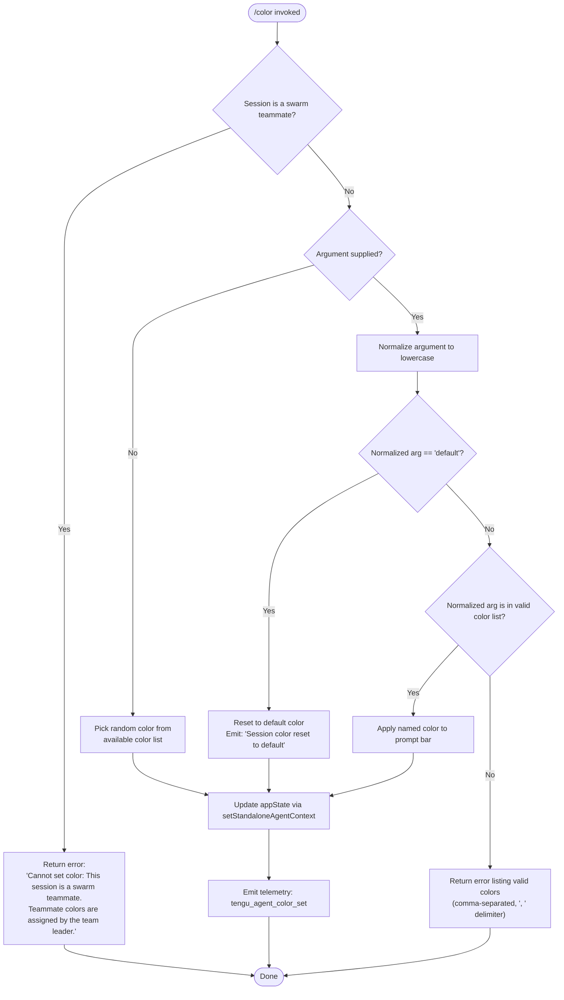

# `/color`

> Analysis basis: CC v2.1.132 bundle.js (AST extraction + Claude interpretation)
> Minimum version: v2.1.132

---

## Overview

The `/color` command sets the visual color of the prompt bar for the current Claude Code session. It accepts an optional color name argument; when invoked without an argument or with the literal word `default`, it resets the prompt bar to the default color scheme. The command executes immediately upon invocation (`immediate: true`) and is scoped to the local session only.

---

## Registration

| Field | Value |
|---|---|
| type | `local-jsx` |
| name | `color` |
| description | Set the prompt bar color for this session |
| argumentHint | *(none)* |
| immediate | `true` |
| module_id | `Yo9` |

Analysis basis: CC v2.1.132 bundle.js:+9830084

---

## Input Branching

The command handler evaluates the user-supplied argument through a series of checks before applying or rejecting the color change.



Analysis basis: CC v2.1.132 bundle.js:+9829089, +9829100, +9829235, +9829246, +9829272, +9829290, +9829314, +9829336, +9829344, +9829434, +9829459, +9829470, +9829529

---

## Behavioral Spec

### Swarm Teammate Guard

Before any color logic executes, the handler checks whether the current session is operating as a swarm teammate agent. If so, no color changes are permitted because color assignment for teammate sessions is managed exclusively by the swarm team leader.

```
function colorCommandHandler(argument, sessionContext):
    if isSwarmTeammate(sessionContext):
        return errorMessage(
            "Cannot set color: This session is a swarm teammate. " +
            "Teammate colors are assigned by the team leader."
        )
    return processColorArgument(argument, sessionContext)
```

Analysis basis: CC v2.1.132 bundle.js:+9829100

---

### Argument Normalization and Routing

The raw argument string is converted to lowercase before any comparison, ensuring case-insensitive matching against the available color list.

```
function processColorArgument(argument, sessionContext):
    if argument is null or argument is empty:
        selectedColor = pickRandomColor(availableColorList)
        return applyColor(selectedColor, sessionContext)

    normalized = argument.toLowerCase()

    if normalized == "default":
        return resetToDefaultColor(sessionContext)

    if availableColorList.includes(normalized):
        return applyColor(normalized, sessionContext)
    else:
        validNames = availableColorList.join(", ")
        return errorMessage("Invalid color. Valid colors: " + validNames)
```

Analysis basis: CC v2.1.132 bundle.js:+9829272, +9829290, +9829314, +9829336, +9829344, +9829434

---

### Random Color Selection

When no argument is provided, the implementation uses `Math.floor` and `Math.random` to select a color uniformly at random from the available color list.

```
function pickRandomColor(colorList):
    index = Math.floor(Math.random() * colorList.length)
    return colorList[index]
```

Analysis basis: CC v2.1.132 bundle.js:+9829235, +9829246

---

### Default Color Reset

When the argument resolves to `"default"`, the session color is cleared and a confirmation string is emitted to the UI.

```
function resetToDefaultColor(sessionContext):
    applyColorValue("default", sessionContext)
    emitUserMessage("Session color reset to default")
```

Confirmation string: `"Session color reset to default"`
Analysis basis: CC v2.1.132 bundle.js:+9829434, +9829529

---

### Color Application and State Update

Once a valid color value is determined (whether named, random, or default), the handler writes it to the session's standalone agent context via `setStandaloneAgentContext`. This propagates the color to the prompt bar rendering layer.

```
function applyColor(colorValue, sessionContext):
    agentContext = sessionContext.getAppState()
    agentContext.promptBarColor = colorValue
    setStandaloneAgentContext(agentContext)
    emitTelemetry("tengu_agent_color_set", { color: colorValue })
    renderColoredPromptBar(agentContext)
```

Analysis basis: CC v2.1.132 bundle.js:+9829418, +9829425, +9829459, +9829470, +9829518, +9829615, +9829670, +9829675

---

### Telemetry Logging (agent-color event)

After a successful color application, the implementation appends a structured log entry tagged `"agent-color"` to a persistent log file. Directory creation is performed if the log path does not already exist.

```
function logAgentColorEvent(colorValue):
    logEntry = buildLogRecord("agent-color", { color: colorValue })
    dirPath = path.dirname(logFilePath)
    if not exists(dirPath):
        fs.mkdirSync(dirPath, { recursive: true })
    fs.appendFileSync(logFilePath, serialize(logEntry))
    emitTelemetry("tengu_agent_color_set")
```

Log tag string: `"agent-color"`
Analysis basis: CC v2.1.132 bundle.js:+11813646, +11813730, +11810274, +11810313, +11810325

File write buffer sizes observed in implementation: 384 bytes, 448 bytes.
Analysis basis: CC v2.1.132 bundle.js:+11810301, +11810345

---

### App State Retrieval

The current application state is fetched from a centralized store before any mutation is applied.

```
function getApplicationState():
    store = globalStore.getStore()
    return store.appState
```

Analysis basis: CC v2.1.132 bundle.js:+9829615, +2118574, +2119715

---

### Color List Formatting for Error Messages

When the user supplies an unrecognized color name, the valid options are presented as a comma-and-space-separated list using `", "` as the delimiter.

```
function buildValidColorList(colorList):
    return colorList.join(", ")
```

Delimiter literal: `", "`
Analysis basis: CC v2.1.132 bundle.js:+9829336, +9829344

---

### Output Padding

Display output lines are padded to a fixed column width of 40 characters using `String.prototype.padEnd`.

Column width: 40 characters
Analysis basis: CC v2.1.132 bundle.js:+14154022, +14152030

---

### Session Type Check (system context)

The swarm-teammate guard uses the session type string `"system"` to identify system-level sessions during context evaluation.

Session type literal: `"system"`
Analysis basis: CC v2.1.132 bundle.js:+9829046

---

## State & Side Effects

| Item | Detail |
|---|---|
| Telemetry | `tengu_agent_color_set` (emitted on every successful color change, including reset to default) — bundle.js:+11813730 |
| Hook registration | `setStandaloneAgentContext` is called to propagate the new color into session agent context — bundle.js:+9829470 |
| appState changes | `promptBarColor` field updated in the current session's app state via `H.getAppState` — bundle.js:+9829615 |
| File system | `fs.appendFileSync` writes a log record tagged `"agent-color"` to the agent log file; `fs.mkdirSync` ensures the log directory exists — bundle.js:+11810274, +11810313 |
| Sound | <!-- TODO: not found in depth-2 traversal; needs --depth 4 --> |
| Swarm restriction | Command is a no-op with an error message when the session is a swarm teammate; the team leader controls teammate colors — bundle.js:+9829100 |
| Random seed | `Math.random` used for color selection when no argument is provided; no fixed seed — bundle.js:+9829246 |
| Promise | `Promise.resolve` is used in the execution path, confirming the handler is async — bundle.js:+9829675 |

---

## Version History

| Version | Change |
|---|---|
| v2.1.132 | Initial analysis |

---

## Common Mistakes

1. **Passing a color name in mixed or upper case** — The argument is normalized to lowercase before matching, so `"Red"` and `"RED"` are treated the same as `"red"`. However, users may assume the command is case-sensitive and believe their input is invalid when it is not.

2. **Attempting to set color in a swarm teammate session** — Teammate sessions reject all `/color` calls with an explicit error. Color assignment for teammates must be performed by the swarm team leader, not by invoking `/color` inside the teammate agent's context.

3. **Expecting the color to persist across sessions** — The command description explicitly states "for this session." The color is applied to the current session's app state only and is not guaranteed to survive a session restart.

4. **Providing no argument and expecting the default color** — When invoked with no argument, the command picks a **random** color, not the default. To explicitly reset to the default appearance, pass `default` as the argument: `/color default`.

5. **Supplying an unrecognized color name and not reading the error** — The error response lists all valid color names separated by `", "`. Users should read this list rather than guessing alternatives.

---

## Appendix — Identifier Mapping

> For bundle debugging only. Identifiers change across versions.

| Identifier | Role |
|---|---|
| `RM8` | Main color command handler function |
| `ce4` | Command entry-point / module export wrapper |
| `p7` | Standalone agent context accessor helper |
| `NP` | App state store retrieval helper |
| `le4` | Color application and state-update orchestrator |
| `v6` | UI render / prompt bar update function |
| `tf` | Output formatting / display helper |
| `lg` | Log record builder |
| `_A` | Serialization / record finalization helper |
| `GJ6` | Agent color telemetry and file-log dispatcher |
| `qN` | Telemetry record construction helper |
| `LVH` | File system log-write helper (appendFileSync + mkdirSync) |
| `hK` | Telemetry emission wrapper |
| `d` | Post-log cleanup or callback |
| `A` | Session context object holding `setStandaloneAgentContext` |
| `H` | App state container with `getAppState`; also uses `Math.random` / `setTimeout` |
| `ul` | Async flow helper (used alongside Promise.resolve) |
| `L` | List display formatter (uses `map` and `padEnd`) |
| `ut` | Final output emitter / resolver |