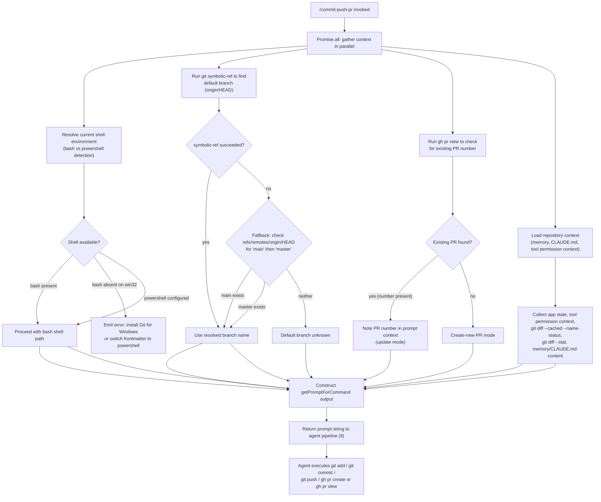

# `/commit-push-pr`

> Analysis basis: CC v2.1.132 bundle.js (AST extraction + Claude interpretation)
> Minimum version: v2.1.132

---

## Overview

`/commit-push-pr` is a `prompt`-type slash command that, when invoked, sends a structured natural-language prompt to the Claude agent instructing it to stage changes, create a commit, push the current branch to the remote, and open a pull request via the GitHub CLI (`gh`). The command resolves contextual information — current branch, default branch, existing PR state, git diff summary, and repository memory — before constructing the final prompt. It delegates all git and GitHub operations to the agent through the normal tool-use pipeline rather than executing them directly in the command handler.

---

## Registration

| Field | Value |
|---|---|
| type | `prompt` |
| name | `commit-push-pr` |
| description | `Commit, push, and open a PR` |
| handler\_method | `getPromptForCommand` |
| handler\_method\_start (byte) | 9855471 |
| handler\_method\_end (byte) | 9856006 |
| loc\_byte span | 9855267 – 9856007 |
| `loc_byte_end` | `9856007` |
| `handler_method` | `getPromptForCommand` (inline ObjectMethod) |
| `handler_method_start` | `9855471` |
| `handler_method_end` | `9856006` |
| `prompt_body.length` | `203` chars |
| `prompt_body.trace` | `call→lt(...) (1 literals)` |
| `arbor_handler.name` | `getPromptForCommand` |
| `arbor_handler.kind` | `Method` |
| `arbor_handler.resolution_path` | `direct` |
| `arbor_handler.fqn` | `claude-2.1.132::getPromptForCommand` |
| `arbor_handler.n_hits` | `4` |

Analysis basis: CC v2.1.132 bundle.js:+9855267

The handler is resolved via `arbor_handler` with `resolution_path: direct` — the `getPromptForCommand` method sits inline on the registration object. The synthetic entry `__handler_commit-push-pr` in the call graph is BFS bookkeeping, not a real exported symbol.

---

## Input Branching

The handler performs several parallel and sequential checks before producing the final prompt string. The branching logic derived from the call graph is summarised below.



Analysis basis: CC v2.1.132 bundle.js:+9855517 (Promise.all), +9855530 (default-branch resolver `zZ`), +9855558 (`so9` / PR-state resolver), +9855668 (`lt` prompt builder)

---

## Behavioral Spec

### 1. Shell Environment Detection

Before the prompt is constructed, the handler checks whether `bash` is available on the current platform.

```
function detectShellEnvironment(appState):
    platform = appState.platform          // e.g. "win32", "darwin", "linux"
    shellConfig = appState.shellOverride  // may be "bash" or "powershell"

    if platform == "win32":
        if not gitBashFound():
            if shellConfig == "powershell":
                return { shell: "powershell", ok: true }
            else:
                return {
                    shell: null,
                    ok: false,
                    error: "requires bash but Git Bash was not found; " +
                           "install Git for Windows or change frontmatter to powershell"
                }
    return { shell: "bash", ok: true }
```

Analysis basis: CC v2.1.132 bundle.js:+9292319 (`"bash"` literal), +9292565 (`"powershell"` literal), +986163 (`"win32"` literal), +986195 (`".exe"` literal)

The error message fragment preserved in `registration.prompt_body` ("requires bash … but Git Bash was not found. Install Git for Windows … or change the skill's frontmatter to `shell: powershell`") confirms this is the exact user-visible error emitted when the detection fails on Windows. Analysis basis: CC v2.1.132 bundle.js:+9855471

---

### 2. Default-Branch Resolution

The handler resolves the upstream default branch so the PR can be opened against the correct target.

```
function resolveDefaultBranch(runGit):
    // Attempt 1: ask git for the symbolic ref of origin/HEAD
    result = runGit(["symbolic-ref", "--short", "refs/remotes/origin/HEAD"])
    if result.ok and result.stdout.trim() != "":
        return result.stdout.trim()   // e.g. "origin/main" → strip prefix

    // Attempt 2: probe well-known branch names directly
    for candidate in ["main", "master"]:
        probeResult = runGit(["show-ref", "--verify", "--quiet",
                               "refs/remotes/origin/" + candidate])
        if probeResult.exitCode == 0:
            return candidate

    // Attempt 3: read cached value from app state
    cached = appStateCache.get("defaultBranch")
    if cached:
        return cached

    return null   // unknown; agent will decide
```

Analysis basis: CC v2.1.132 bundle.js:+1007509 (`"symbolic-ref"`), +1007524 (`"--short"`), +1007534 (`"refs/remotes/origin/HEAD"`), +1007647 (`"main"`), +1007654 (`"master"`), +1007716 (`"show-ref"`), +1007727 (`"--verify"`), +1007738 (`"--quiet"`), +997621 (`"defaultBranch"` cache key), +1007604 (`A.trim`)

---

### 3. Existing-PR State Check

The handler runs a `gh pr view` command to determine whether a PR already exists for the current branch, selecting the appropriate shell syntax.

```
function checkExistingPR(shell):
    if shell == "powershell":
        cmd = "gh pr view --json number 2>$null; if (-not $?) { \"\" }"
    else:
        cmd = "gh pr view --json number 2>/dev/null || true"

    output = runShellCommand(cmd)
    parsed = JSON.tryParse(output.stdout)
    if parsed and parsed.number:
        return { exists: true, number: parsed.number }
    return { exists: false }
```

Analysis basis: CC v2.1.132 bundle.js:+9852344 (bash `gh pr view` literal), +9852391 (powershell `gh pr view` literal), +9851462 (`dZH` — PR-state resolver), +9851477 (`to9` — output transformer)

---

### 4. Repository Context Collection

Contextual information is gathered in parallel with the branch/PR checks and assembled into the prompt.

```
function collectRepositoryContext(appState, toolPermissionContext):
    context = {}

    // Staged diff summary (file names + status)
    context.stagedFiles = runGit(["diff", "--cached", "--name-status"],
                                  timeout=5000)

    // Diff statistics (insertions / deletions summary)
    context.diffStat = runGit(["diff", "--stat"],
                               timeout=5000)

    // Memory content (CLAUDE.md and in-session memories)
    context.memory = loadMemoryContent(appState)   // keys: "memory", "memories"

    // PR attribution note
    context.attributionNote = ", ending with the attribution text shown in the example below"

    // Tool permission context for Bash tool gating
    context.toolPermissionContext = toolPermissionContext

    return context
```

Analysis basis: CC v2.1.132 bundle.js:+6553980 (`"diff"` literal), +6553987 (`"--cached"`), +6553998 (`"--name-status"`), +6554037 (timeout `5000`), +6553577 (`"--stat"`), +9571154 (`"memory"`), +9571163 (`"memories"`), +9853527 (attribution suffix literal), +9855712 (`A.getToolPermissionContext`), +9855828 (`A.getAppState`)

---

### 5. Prompt Construction (`getPromptForCommand`)

The prompt builder (`lt`) assembles all gathered context into the string returned to the agent pipeline.

```
function buildCommitPushPRPrompt(shellEnv, defaultBranch, existingPR, repoContext):
    if not shellEnv.ok:
        // Return the Windows Git Bash error message immediately; abort.
        return shellEnv.error

    prompt = ""

    // Describe the three-phase task to the agent:
    //   Phase 1 — Stage and commit (with a meaningful commit message derived
    //             from the diff).
    //   Phase 2 — Push the current branch to origin.
    //   Phase 3 — Open a new PR (or update the existing one) against
    //             defaultBranch, including the attribution suffix.

    prompt += describeCommitPhase(repoContext.stagedFiles, repoContext.diffStat)
    prompt += describePushPhase()
    prompt += describePRPhase(existingPR, defaultBranch, repoContext.attributionNote)

    // Inject memory/CLAUDE.md context if present
    if repoContext.memory:
        prompt += formatMemorySection(repoContext.memory)

    return prompt
```

The returned string is fed to the agent via the standard `lt` → `TJ` → tool-execution pipeline, which routes Bash tool calls through the normal permission-checking infrastructure (sandbox check, classifier, allow/deny rules).

Analysis basis: CC v2.1.132 bundle.js:+9855668 (`lt` call), +9292757 (`TJ` — tool execution orchestrator), +9292776 (`zw` — session UUID), +9855471 (handler start)

---

### 6. PR Attribution Requirement

The prompt explicitly instructs the agent to append an attribution text block at the end of the PR description. This is injected via the literal at +9853527.

```
function describePRPhase(existingPR, defaultBranch, attributionNote):
    base = buildPRDescription(existingPR, defaultBranch)
    // Agent is told the PR body must end with the attribution text
    // shown in the example embedded in the prompt.
    return base + attributionNote
```

Analysis basis: CC v2.1.132 bundle.js:+9853527 (`", ending with the attribution text shown in the example below"`)

---

### 7. Tool Permission Gating

All Bash commands that the agent runs as part of this workflow are subject to the standard permission pipeline.

```
function gateToolExecution(tool, input, permissionContext):
    // 1. Check deny rules from settings
    if matchesDenyRule(tool, input):
        return DENY

    // 2. Sandbox check (UA.isSandboxingEnabled)
    if sandboxingEnabled and not autoAllowBashIfSandboxed:
        result = evaluateSandboxPolicy(tool, input)
        if result == DENY: return DENY

    // 3. Auto-mode classifier (two-stage XML classifier)
    if mode == "auto":
        classifierResult = runAutoModeClassifier(tool, input)  // rv4 / Xz6
        return classifierResult

    // 4. Interactive ask (if interactive session)
    if not headless:
        return promptUser(tool, input)

    // Headless + no auto-mode → deny with guidance
    return DENY
```

Analysis basis: CC v2.1.132 bundle.js:+9641603 (`"deny"`), +9641852 (`"ask"`), +9642836 (`"allow"`), +9642433 (`"bypassPermissions"`), +9634438 (`UA.isSandboxingEnabled`), +9634574 (`ta4`), +7924488 (`Xz6` auto-mode classifier)

---

## State & Side Effects

| Item | Detail |
|---|---|
| Telemetry — `tengu_auto_mode_decision` | Fired each time the auto-mode classifier approves or denies a Bash tool call triggered by this command (bundle.js:+9646450) |
| Telemetry — `tengu_auto_mode_outcome` | Fired after the classifier pipeline completes for a tool invocation (bundle.js:+7929589) |
| Telemetry — `tengu_auto_mode_fallback_to_ask` | Fired when the classifier cannot render a decision and falls back to interactive ask (bundle.js:+9645678) |
| Telemetry — `tengu_iron_gate_closed` | Fired when the auto-mode classifier is unavailable and the action is denied (bundle.js:+9650284) |
| Telemetry — `tengu_auto_mode_denial_limit_exceeded` | Fired when too many classifier denials accumulate in headless mode (bundle.js:+9639739) |
| Telemetry — `tengu_bash_allowlist_strip_all` | Fired if all allowlist entries are stripped before classifier evaluation (bundle.js:+9647758) |
| Telemetry — `tengu_tool_result_persisted` | Fired after a tool result is saved to the conversation transcript (bundle.js:+4384127) |
| Telemetry — `tengu_tool_empty_result` | Fired when a tool returns an empty result (bundle.js:+4383887) |
| Telemetry — `tengu_bg_spare_spawn` / `tengu_bg_spare_claim` | Background PTY pool events; may fire if a spare process is claimed to run git/gh commands (bundle.js:+14129749, +14130886) |
| Telemetry — `tengu_cobalt_ridge` | Fired during session/environment initialisation (bundle.js:+4258812) |
| App state reads | `A.getAppState()` (bundle.js:+9855828), `_.getAppState()` (multiple sites) |
| App state writes | `H.setAppState()` via `HlH` (bundle.js:+9639285) — updates tool permission context after execution |
| Tool permission context | Read via `A.getToolPermissionContext()` (bundle.js:+9855712); written via `q.setToolPermissionContext()` (bundle.js:+9638688) |
| Hook registration | `hL_` registers `exit` and `error` event handlers on the spawned process handle (bundle.js:+981626, +981631, +981678) |
| Process side effects | `gh pr create` or `gh pr view --json number` shell commands executed via PTY/spawn infrastructure (`qFA` → `Bun.spawn`, bundle.js:+14111281); `git` commands similarly spawned |
| Sound | None detected in depth-2 traversal |
| File I/O | Transcript tool-result files written by `CMH` → `Go6.writeFile` (bundle.js:+4382871); temporary PTY socket files created/unlinked by `qFA` (bundle.js:+14111142, +14111201) |

---

## Version History

| Version | Change |
|---|---|
| v2.1.132 | Initial analysis; command registered as `prompt` type with inline `getPromptForCommand` handler; Windows Git Bash detection, `gh pr view` pre-flight, and PR attribution suffix confirmed |

---

## Common Mistakes

1. **Missing `gh` CLI** — The command requires the GitHub CLI (`gh`) to be authenticated and in `PATH`. If `gh` is absent, the agent's `gh pr create` call will fail. There is no pre-flight check in the handler for `gh` availability; the error surfaces only after the agent attempts the command.

2. **Windows without Git Bash** — On `win32`, if neither Git Bash nor a `powershell` shell override is configured, the handler aborts immediately with a Windows-specific error before any prompt is sent to the agent. Install Git for Windows or set `shell: powershell` in the skill frontmatter to resolve this (bundle.js:+9292319, +986163).

3. **No staged changes** — If there are no staged changes and no unstaged changes, the agent may produce an empty or trivial commit. `/commit-push-pr` does not guard against a clean working tree; callers should ensure work is present.

4. **Detached HEAD state** — Default-branch resolution via `git symbolic-ref` will succeed, but the push step will fail if the repository is in a detached HEAD state. The handler does not detect this condition.

5. **Existing open PR on the same branch** — When `gh pr view` returns a PR number, the command switches to update mode and the agent will attempt to update the existing PR rather than creating a new one. Callers who always want a fresh PR should close the existing one first.

6. **Headless / non-interactive mode** — If Claude Code is running headlessly with `auto` mode disabled, Bash tool calls issued by the agent will be denied by the permission pipeline (bundle.js:+9645560). Ensure `--dangerously-skip-permissions` or appropriate allow-rules are configured before invoking this command in CI.

7. **PR attribution text** — The prompt explicitly requires the PR body to end with a specific attribution block (bundle.js:+9853527). Manual edits to the PR description after creation will not be affected, but users who post-process PR bodies programmatically should be aware of the appended text.

---

## Appendix — Identifier Mapping

> For bundle debugging only. Identifiers change across versions.

| Identifier | Role |
|---|---|
| `__handler_commit-push-pr` | Synthetic BFS entry point for the command handler (not a real symbol) |
| `zZ` | Default-branch resolver (runs `git symbolic-ref` / `show-ref` fallback) |
| `dy8` | App-state cache getter (reads `defaultBranch` key from `QKH`) |
| `PA` | Process execution orchestrator (wraps `rJH` spawn infrastructure) |
| `rJH` | Core process spawn/management function |
| `lL_` | Process argument builder (prepends shell wrapper, handles `win32` `.exe`/`cmd` path) |
| `hy8` | Stdout stream handler |
| `Sy8` | Stderr stream handler |
| `Cy8` | Combined output (all) stream handler |
| `eq_` | Numeric validation utility (uses `Number.isFinite`) |
| `VH6` | Buffered output accumulator / error constructor |
| `yy8` | `Reflect.apply` / `Reflect.defineProperty` utility for process proxy |
| `hL_` | Process `exit`/`error` event hook registrar |
| `tq_` | Promise-race timeout wrapper (uses `setTimeout` / `clearTimeout`) |
| `HL_` | Process kill orchestrator (`H.kill`, `ZQ`) |
| `aq_` | Process stdin writer (bound) |
| `sq_` | Process SIGTERM sender (bound, `H.kill`) |
| `kL_` | Parallel output collection (`Promise.all`, `Ny8`) |
| `yH6` | Post-execution output formatter (`$y8`) |
| `vL_` | Output pipe builder (`IjL`, `ON6`, `_.pipe`) |
| `NL_` | Writable stream adder (`ZL_.default`, `_.add`) |
| `LL_` | Bound stream writer (`Wy8.bind`) |
| `Y` | Background PTY session manager |
| `j6` | Session registry lookup / creation |
| `qFA` | PTY host spawn function (`Bun.spawn`, socket setup, `--bg-pty-host`) |
| `fH` | Error logger / app-state error push (`EQ.logError`, `kyH.push`) |
| `ujL` | String coercion utility for process output |
| `ll9` | Prompt-context assembler (collects remote, memory, model, tool context) |
| `ONH` | Remote-name extractor (`"remote"` literal) |
| `p46` | Context property getter |
| `zD` | Environment / API-base resolver |
| `nA` | Module-exports initialiser (`fwH`, `lP8`, `j06`) |
| `u9A` | URL / staging environment classifier |
| `uA` | Settings loader entry point |
| `ub` | Settings disk-load orchestrator |
| `Kp` | Settings key parser |
| `_2L` | Full settings-from-disk implementation (reads policy, flag, remote settings) |
| `$q` | Memory-usage sampler (`process.memoryUsage`) |
| `ZdA` | Settings post-processor |
| `H` | Background session registry / random-delay helper |
| `k` | Log-writer / debug-output formatter |
| `Lsq` | Log transport initialiser |
| `rdA` | Log-level resolver (`Nrq`, `krq`) |
| `RH` | JSON stringifier wrapper |
| `mf` | Log-line formatter (redacts, slices) |
| `MnA` | Log-field mapper |
| `_` | Path / stream utility namespace |
| `gNH` | stdout write wrapper |
| `slA` | Raw `H.write` adapter |
| `Msq` | Log-file sink (appends to rotating log file via `fsq`) |
| `GNH` | Batched-write flusher (`setImmediate`, `setTimeout`) |
| `pHH` | Log-file path builder |
| `F6` | File-system path joiner |
| `JG8` | Log-rotation checker (`j8`) |
| `jnA` | Log-file path resolver |
| `JnA` | Log-file rotation handler (`YV.stat`, `YV.rename`, `YV.unlink`) |
| `fsq` | Log-file appender (`YV.mkdir`, `YV.appendFile`) |
| `N1` | Active-writer set manager (`J08.add/delete`) |
| `ro4` | Model-context assembler (keys, `m$A`, `fH`) |
| `m$A` | Model-capability / file-context builder (diff, stat, `OK9`, `DK9`) |
| `L$H` | Model-name normaliser (`N6`, `MK`, `_A`) |
| `v6` | Path join utility |
| `f` | WebSocket/stream close manager |
| `D` | Daemon config live-reload handler |
| `z` | Daemon stop controller |
| `OK9` | File-extension / language classifier |
| `v54` | Model diff runner (calls `PA`, `RA`) |
| `DK9` | Staged-diff parser (`--stat`, `file changed`, `files changed`) |
| `K` | Process exit handler |
| `so4` | Conversation-history context preparer |
| `tf` | Compact-boundary message builder |
| `lg` | Message-type constant |
| `_A` | App-state accessor |
| `sv6` | File binary-header reader (BOM / encoding detection) |
| `rwL` | Buffer-from factory |
| `twL` | UTF-8 BOM decoder |
| `ewL` | Extended encoding detector |
| `HJL` | Buffer copy/merge helper |
| `AJL` | Buffer allocate-and-copy helper |
| `_JL` | Encoding line-end normaliser |
| `AjH` | JSONL stream parser |
| `jXL` | JSONL boundary detector |
| `XXL` | JSONL token accumulator |
| `WXL` | JSONL object extractor |
| `PXL` | JSONL chunk pusher |
| `L` | Column-padder utility |
| `io4` | Message filter (removes sidechain / meta messages) |
| `no4` | Message predicate (checks `isSidechain`, `isMeta`, `isCompactSummary`) |
| `ao4` | Tool-use message filter |
| `iZA` | Team-member file checker (`Fl9`, `bZH`, `Bl9.isTeamMemFile`) |
| `Gq` | Model display-name formatter |
| `mb6` | Model-entry enumerator |
| `BY` | Model-ID normaliser (lowercase, replace) |
| `M08` | Model metadata lookup |
| `vP` | Model-ID replace helper |
| `xq` | Model-selection resolver |
| `OU` | Model-alias resolver (`KV`, `K_`, `X7H`) |
| `KV` | Model constant table |
| `X7H` | Model-ID expansion (handles `anthropic.` prefix, opus/sonnet/haiku aliases) |
| `Wq` | Full model-ID builder (tier + version → canonical ID) |
| `m0` | Model-family classifier |
| `f8H` | Model-tier checker (`K8H.includes`) |
| `FV` | Sonnet-model builder |
| `WRH` | Haiku-model builder |
| `jk` | Versioned-model ID builder |
| `Gd_` | Alias-to-versioned-ID resolver |
| `zM` | Provider type resolver (`"firstParty"`, `"anthropicAws"`) |
| `Ou6` | Extended-context suffix checker (`" (1M context)"`) |
| `GRH` | Model display string builder |
| `Kj` | Model-selection entry point |
| `r2` | Full model-resolution pipeline |
| `JK9` | Opus-4 model feature flag check |
| `so9` | PR-state pre-flight runner |
| `dZH` | PR-state context builder (runs `gh pr view`, builds model/tool context) |
| `P7H` | Model-name display formatter (appends `" (1M context)"` for Opus 4.7) |
| `Og8` | Model display-name wrapper |
| `to9` | PR-view output transformer (`H.replace`) |
| `_L` | i18n / locale string loader (`s6`, `J6H`) |
| `lt` | Prompt builder / main agent invocation function |
| `cx` | Locale-string lookup (`s6`, `yH`, `Iq`, `J6H`, `j6`) |
| `yH` | String coercion (wraps `String`) |
| `Iq` | Interpolated string builder |
| `Wo6` | String replace helper |
| `TJ` | Tool execution orchestrator (permission check, auto-mode, transcript update) |
| `Ms4` | Tool pre-execution permission evaluator |
| `g78` | Sandboxed-tool allow-list checker |
| `mn9` | Auto-allow-bash-if-sandboxed checker |
| `ev` | Sandbox policy evaluator |
| `p5` | Permission-reason builder |
| `KM8` | Permission-cache manager (recursive) |
| `bzH` | Dangerous-operation detector (`rm`, `rmdir`) |
| `bn9` | Bypass-permissions flag reader |
| `Ls4` | Tool metadata loader |
| `zM6` | Tool-result update helper |
| `HlH` | App-state setter (`Object.assign`, `H.setAppState`) |
| `gn9` | Transcript append helper |
| `H9` | MCP tool-name prefix checker (`"mcp__"`) |
| `Ne6` | Non-interactive denial helper |
| `fb` | Permission-prompt display helper |
| `djA` | Auto-mode allowlist tool checker |
| `ls1` | Tool-use tracking set adder |
| `Xz6` | Auto-mode classifier pipeline entry |
| `wE9` | Classifier input map setter |
| `jE9` | Classifier inner dispatcher |
| `qE9` | Classifier session/model resolver |
| `gv4` | Classifier prompt template builder |
| `YE9` | Classifier message array builder |
| `Uv4` | Classifier request builder |
| `JE9` | Classifier tool-input serialiser |
| `w` | Background agent session handle |
| `YJ` | Token-usage recorder |
| `hF` | Classifier fast-path helper |
| `nq8` | Auto-mode config accessor (`"auto_mode"`, `"1h"`) |
| `av4` | Classifier stage-dispatch |
| `rv4` | Two-stage XML classifier implementation |
| `sv4` | Classifier result formatter |
| `_E9` | Classifier abort-signal handler |
| `WE9` | Classifier wall-clock timeout tracker |
| `F1H` | Classifier tool-filter (ephemeral vs global) |
| `FjA` | Classifier invocation wrapper |
| `UjA` | Classifier stage-1 result accessor |
| `MaH` | Classifier stage metadata |
| `BjA` | Classifier stage-2 result accessor |
| `oG9` | Tool-use block finder (`H.find`) |
| `yF` | Auto-mode outcome recorder (`tengu_auto_mode_outcome`) |
| `iq8` | Classifier request error handler |
| `aG9` | Classifier schema validator (`A.safeParse`) |
| `TE9` | Classifier transcript-length guard |
| `vH` | String coercion (wraps `String`) |
| `DE9` | Classifier output file writer (`ATH.writeFile`, `ATH.mkdir`) |
| `EE9` | Classifier error logger (`FwH`, `j8`) |
| `Q_H` | Tool-use tracking set deleter |
| `Mu6` | MCP tool-call result handler |
| `j7H` | MCP response parser (`FeL`, `BeL`) |
| `roH` | Input-token counter |
| `SN` | Output-token counter |
| `ooH` | Cache-read-token counter |
| `aoH` | Cache-creation-token counter |
| `SE` | Session-end handler |
| `dn9` | Transcript compaction helper |
| `Cs1` | Conversation-state snapshot helper |
| `fs4` | Tool-loop abort-on-denial counter |
| `bs1` | Denial-count state accessor |
| `Qn9` | Loop iteration bookkeeping |
| `Ks4` | Permission-request hook runner (`F9H`, `HJ6`, `aTH`) |
| `F9H` | Permission hook executor (`aK`, `iX`) |
| `HJ6` | Permission hook config loader |
| `aTH` | Permission post-hook evaluator |
| `FS` | Sandbox override flag reader (`_a`) |
| `pZ` | Permission-context finaliser (`cf`) |
| `HA` | Error wrapper constructor |
| `Fn9` | Final permission-denied error emitter |
| `zw` | Session UUID generator |
| `Ti9` | UUID generator wrapper (`SG.randomUUID`) |
| `cmH` | Tool-result mapper (`H.mapToolResultToToolResultBlockParam`, `Hm1`) |
| `Hm1` | Tool-result content normaliser |
| `sBK` | Text-only result checker |
| `qm1` | Array result type checker |
| `Lm1` | Result reducer |
| `CMH` | Large-result file persister (`Go6.writeFile`, `"wx"` flag) |
| `xMH` | Result content type router |
| `bMH` | Result size estimator (`B9`) |
| `tu1` | Token-count estimator (`Number.isFinite`, `Math.min`) |
| `IQ9` | Prompt string assembler (trim, push, join) |
| `Ul4` | Prompt section builder (wraps `IQ9`, `vH`) |