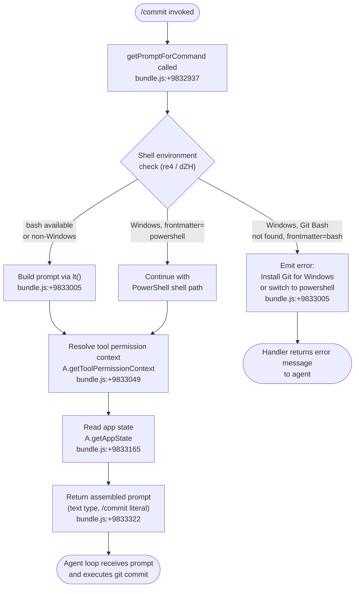

# `/commit`

> Analysis basis: CC v2.1.132 bundle.js (AST extraction + Claude interpretation)
> Minimum version: v2.1.132

---

## Overview

The `/commit` command is a `prompt`-type slash command that instructs the Claude Code agent to create a git commit. When invoked, the handler assembles a prompt via `getPromptForCommand`, applies shell-environment checks (bash vs. PowerShell), resolves tool permission context, and then dispatches the assembled prompt to the agent loop. The command does not accept free-form user arguments; its behavior is fully determined by the current repository state and the agent's environment at invocation time.

---

## Registration

| Field | Value |
|---|---|
| type | `prompt` |
| name | `commit` |
| description | `Create a git commit` |
| handler_method | `getPromptForCommand` |
| handler_method_start (byte) | `9832931` |
| handler_method_end (byte) | `9833335` |
| loc_byte (registration open) | `9832784` |
| loc_byte_end (registration close) | `9833336` |
| loc_line | `5555` |
| arbor_handler.name | `getPromptForCommand` |
| arbor_handler.fqn | `claude-2.1.132::getPromptForCommand` |
| arbor_handler.kind | `Method` |
| arbor_handler.resolution_path | `direct` |
| `loc_byte_end` | `9833336` |
| `handler_method_start` | `9832931` |
| `handler_method_end` | `9833335` |
| `prompt_body.length` | `203` chars |
| `prompt_body.trace` | `call→lt(...) (1 literals)` |
| `arbor_handler.n_hits` | `3` |

Analysis basis: CC v2.1.132 bundle.js:+9832784

---

## Input Branching

The handler's first decision is whether the current shell environment can run `bash`. On Windows, if Git Bash is absent, the command either aborts with an installation hint or falls back to PowerShell, depending on the skill's frontmatter. After the shell check, tool-permission context is resolved and the prompt is finalized.



Analysis basis: CC v2.1.132 bundle.js:+9832931

---

## Behavioral Spec

### Shell Environment Validation

The handler delegates shell-detection logic to the environment-resolution subsystem (reached via `environmentChecker` → `shellDetector`). The key check determines whether `bash` is available, specifically looking for Git Bash on Windows.

```
function validateShellEnvironment(context):
    shellType = detectShell(context)          // re4 → dZH, bundle.js:+9832968
    if shellType == "remote":                 // literal: bundle.js:+9568357
        return REMOTE_SHELL_CONTEXT
    if platform == "windows":
        gitBashFound = probeGitBash()         // dZH → ONH, bundle.js:+9568349
        if not gitBashFound:
            frontmatter = readSkillFrontmatter()
            if frontmatter.shell == "bash":
                return ERROR_INSTALL_GIT_BASH  // prompt_body fragment
            elif frontmatter.shell == "powershell":
                return POWERSHELL_FALLBACK
    return BASH_CONTEXT
```

Analysis basis: CC v2.1.132 bundle.js:+9832968, +9568349

---

### Prompt Assembly (`lt`)

Once the shell context is confirmed, `lt` (the prompt-builder) assembles the commit instruction. It applies template substitution, scans for backtick-escaped shell commands (`!`` prefix, literal bundle.js:+9292635), resolves referenced context strings (matching via `H.matchAll`, bundle.js:+9292606), and collapses multi-part segments into a single text body.

```
function buildCommitPrompt(shellContext, permissionContext, appState):
    // Detect shell type: "bash" or "powershell"
    // bundle.js:+9292319, +9292565
    rawTemplate = loadTemplate(shellContext)      // lt → _L, bundle.js:+9292328

    // Expand any !` escape sequences
    segments = rawTemplate.matchAll(BACKTICK_PATTERN)  // bundle.js:+9292606
    expanded = replaceBacktickSegments(segments, substitutor)  // Wo6, bundle.js:+9292641

    // Await all async substitutions
    resolved = await Promise.all(expansionTasks)  // bundle.js:+9292678

    // Generate a unique invocation ID
    invocationId = randomUUID()                   // ZQ9.randomUUID, bundle.js:+9293078

    // Normalise whitespace in each segment
    finalBody = normaliseSegments(resolved)       // IQ9, bundle.js:+9293136

    // Apply trailing replacement pass
    finalBody = finalBody.replace(CLEANUP_PATTERN, replacement)  // L.replace, bundle.js:+9293161

    return { type: "text", body: finalBody }      // literal "text", bundle.js:+9832987
```

Analysis basis: CC v2.1.132 bundle.js:+9292328, +9292606, +9292678, +9293078

---

### Permission Context Resolution

Before handing the prompt to the agent loop, the handler reads both the tool-permission context and the current app state. These are passed into the downstream tool-execution subsystem (`toolExecutionLoop` / `TJ`) which enforces allow/deny rules, sandboxing, and auto-mode classifier decisions.

```
function resolvePermissions(handlerContext):
    permCtx = handlerContext.getToolPermissionContext()   // bundle.js:+9833049
    appState = handlerContext.getAppState()               // bundle.js:+9833165

    // Sandboxing and auto-allow checks happen inside the tool loop (Ms4/TJ)
    // Relevant permission values observed in literals:
    //   "allow", "deny", "ask", "bypassPermissions", "plan"
    //   bundle.js:+9642836, +9641603, +9641852, +9642433, +9642485

    return { permCtx, appState }
```

Analysis basis: CC v2.1.132 bundle.js:+9833049, +9833165

---

### Tool Execution Loop (agent-side)

After the prompt is delivered, the agent-side tool-execution loop (`toolLoop` / `TJ`) handles the actual `git commit` bash invocation. This loop evaluates permissions through multiple layers:

```
function toolLoop(prompt, permCtx, appState):
    // 1. Check sandboxing state
    sandboxEnabled = UA.isSandboxingEnabled()           // bundle.js:+9641763
    autoAllowBash  = UA.isAutoAllowBashIfSandboxedEnabled()  // bundle.js:+9641789

    // 2. Evaluate permission decision
    decision = evaluatePermission(permCtx, appState)
    // Possible outcomes: "allow", "deny", "ask", "dontAsk", "auto"
    // bundle.js:+9642836, +9641603, +9645027, +9644881

    if decision == "deny":
        emitTelemetry("tengu_auto_mode_fallback_to_ask")  // bundle.js:+9645678
        return PERMISSION_DENIED                           // literal: bundle.js:+9292999

    if decision == "ask" and headlessMode:
        return ERROR_NO_INTERACTIVE_APPROVAL  // bundle.js:+9645560

    // 3. Run auto-mode classifier if needed (Xz6)
    classifierResult = runAutoModeClassifier(prompt, permCtx)
    // bundle.js:+9647410; emits tengu_auto_mode_decision, tengu_auto_mode_outcome

    // 4. Execute bash tool with git commit command
    executeShellCommand(bashArgs)  // spawns via bm.spawn, bundle.js:+14131208

    // 5. Persist tool result
    persistResult(toolResult)     // CMH, bundle.js:+9293070
                                  // emits tengu_tool_result_persisted
```

Analysis basis: CC v2.1.132 bundle.js:+9641763, +9644881, +9645560, +9647410, +9293070

---

### Windows / Git Bash Error Path

When Git Bash is not found on Windows and the skill's frontmatter specifies `shell: bash`, the handler surfaces an actionable error. The error message text (from `prompt_body.text`, which the extraction pipeline traced to `lt(...)`) advises the user to either install Git for Windows (`https://git-scm.com/downloads/win`) or update their skill's frontmatter to `shell: powershell`.

```
function handleMissingGitBash(skillFrontmatter):
    if skillFrontmatter.shell == "bash" and platform == "windows":
        if not gitBashDetected():
            return userFacingError(
                // Advises: install Git for Windows or switch frontmatter to powershell
                // bundle.js:+9833005 (lt invocation carries this message)
            )
```

Analysis basis: CC v2.1.132 bundle.js:+9833005, +9292319, +9292565

---

## State & Side Effects

| Item | Detail |
|---|---|
| Telemetry: `tengu_cobalt_ridge` | Fired during environment/settings resolution (bundle.js:+4258812) |
| Telemetry: `tengu_auto_mode_fallback_to_ask` | Fired when auto-mode falls back to ask permission flow (bundle.js:+9645678) |
| Telemetry: `tengu_auto_mode_decision` | Records the auto-mode classifier's permission decision (bundle.js:+9646450) |
| Telemetry: `tengu_auto_mode_config` | Records classifier configuration at invocation (bundle.js:+7928729) |
| Telemetry: `tengu_auto_mode_malformed_tool_input` | Fired when classifier receives malformed tool input (bundle.js:+7915033) |
| Telemetry: `tengu_bg_dispatch_sigkill_escalate` | Fired when a background process requires SIGKILL escalation (bundle.js:+14129972) |
| Telemetry: `tengu_bg_spare_enable` | Fired when a background spare process is enabled (bundle.js:+14130767) |
| Telemetry: `tengu_bg_spare_claim` | Fired when a spare process is claimed (bundle.js:+14130886) |
| Telemetry: `tengu_bg_spare_claim_fail` | Fired on spare process claim failure (bundle.js:+14131149) |
| Telemetry: `tengu_auto_mode_outcome` | Records final auto-mode outcome (bundle.js:+7929589) |
| Telemetry: `tengu_bash_allowlist_strip_all` | Fired when the entire bash allowlist is stripped (bundle.js:+9647758) |
| Telemetry: `tengu_iron_gate_closed` | Fired when the auto-mode classifier is unavailable and denies the action (bundle.js:+9650284) |
| Telemetry: `tengu_auto_mode_denial_limit_exceeded` | Fired when denial count limit is exceeded (bundle.js:+9639739) |
| Telemetry: `tengu_tool_empty_result` | Fired when a tool returns an empty result (bundle.js:+4383887) |
| Telemetry: `tengu_tool_result_persisted` | Fired when a tool result is successfully persisted (bundle.js:+4384127) |
| App state reads | `A.getAppState()` called at bundle.js:+9833165 and within the tool loop |
| App state writes | `H.setAppState()` called within `appStateUpdater` (HlH) at bundle.js:+9639285 |
| Shell spawning | `bm.spawn` used to launch the git process (bundle.js:+14131208) |
| File I/O | Tool results may be written to disk via `Go6.writeFile` (bundle.js:+4382871); temp files cleaned via `tgq.unlinkSync` (bundle.js:+14110155) |
| UUID generation | A random UUID is generated per invocation via `ZQ9.randomUUID` (bundle.js:+9293078) and `SG.randomUUID` (bundle.js:+9682354) |
| Permission context | Read via `A.getToolPermissionContext()` (bundle.js:+9833049); written via `q.setToolPermissionContext()` (bundle.js:+9638688) |
| Hook registration | `ls1` (hook adder) and `Q_H` (hook remover) manage lifecycle hooks around tool execution (bundle.js:+9647360, +9647501) |
| Sound | <!-- TODO: not found in depth-2 traversal; needs --depth 4 --> |

---

## Version History

| Version | Change |
|---|---|
| v2.1.132 | Initial analysis — `prompt`-type command; `getPromptForCommand` handler resolved via Arbor `direct` path; Windows/Git Bash error path confirmed in prompt body |

---

## Common Mistakes

1. **Invoking `/commit` without a git repository initialised** — the command instructs the agent to run `git commit`; if the working directory is not a git repo, the bash tool will fail and the agent will surface the git error.
2. **Running on Windows without Git Bash installed** — if the skill frontmatter specifies `shell: bash` and Git Bash is not on the PATH, the handler emits an actionable error before any git operations occur. Install Git for Windows or switch the frontmatter to `shell: powershell`.
3. **Expecting free-form commit messages as arguments** — `/commit` takes no user-supplied arguments; the agent generates the commit message autonomously based on staged changes.
4. **Assuming the command stages files** — `/commit` instructs the agent to commit already-staged changes. Use the agent to stage files first (e.g., via a preceding prompt or `/git add`) before invoking `/commit`.
5. **Auto-mode classifier interference** — in headless or non-interactive environments, the auto-mode classifier may block the underlying bash tool invocation if permission rules are too restrictive. The telemetry event `tengu_iron_gate_closed` indicates this has occurred; adjust bash permission rules in settings.
6. **Confusing the prompt-body extraction artefact with the commit prompt** — the `prompt_body.text` field shown in the raw extraction data is a Windows-environment error string surfaced by the `lt()` call chain, not the primary git commit instruction text; the actual commit instruction is assembled dynamically by the agent.

---

## Appendix — Identifier Mapping

> For bundle debugging only. Identifiers change across versions.

| Identifier | Role |
|---|---|
| `__handler_commit` | Synthetic BFS entry point for the `/commit` registration's inline handler |
| `re4` | Shell/environment resolver called immediately after prompt assembly |
| `dZH` | Core shell-detection logic; checks for remote context and Git Bash on Windows |
| `ONH` | Git Bash probe sub-function inside shell detector |
| `p46` | Helper used by shell detector and URL-builder |
| `zD` | Environment URL / connection context builder |
| `nA` | Module initialiser / ES-module shim |
| `q` | Temp-file unlink utility (calls `tgq.unlinkSync`) |
| `u9A` | Localhost URL builder |
| `xq` | Model-name resolution entry point |
| `OU` | Model capability lookup |
| `Wq` | Model display-name formatter (trim, lowercase, replace) |
| `Kj` | Model alias resolver |
| `P7H` | Model suffix / context-window annotation checker |
| `H` | General utility / Math.random + setTimeout holder |
| `Gq` | Inference-profile type checker |
| `Og8` | Model suffix decorator (wraps `P7H`) |
| `uA` | Settings loader entry point |
| `ub` | Settings disk-load orchestrator |
| `_L` | Platform detection helper (checks for `"windows"`) |
| `lt` | Prompt builder / template expander for the commit command |
| `cx` | String coercion / platform-aware context builder |
| `yH` | String converter (wraps `String()`) |
| `Iq` | Additional string coercion helper |
| `j6` | Tool-registry / tool-lookup function |
| `hq6` | Tool-registry helper A |
| `Rq6` | Tool-registry helper B |
| `Oo` | Tool descriptor formatter |
| `uQ6` | Tool deduplication / cache lookup |
| `R6` | Tool execution recorder / timestamp logger |
| `Wo6` | Backtick-escape substitutor (`H.replace`) |
| `TJ` | Main tool execution loop (agent-side) |
| `Ms4` | Permission evaluation orchestrator |
| `_` | App-state accessor namespace |
| `g78` | Permission rule evaluator A (deny/rule path) |
| `mn9` | Permission rule evaluator B |
| `ev` | Sandboxing / unsandboxed-command permission gate |
| `p5` | Permission prompt builder |
| `fH` | Error logger / error-push helper |
| `KM8` | Recursive permission-check helper |
| `bzH` | Dangerous-operation detector (rm / rmdir checks) |
| `bn9` | Allow-decision finaliser |
| `Ls4` | Permission result label resolver |
| `k` | Commit-message formatter / string normaliser |
| `RH` | JSON serialiser wrapper |
| `zM6` | App-state delta helper |
| `HlH` | App-state writer (`Object.assign` + `setAppState`) |
| `gn9` | Post-decision state updater |
| `d` | Generic data-shape helper |
| `H9` | Object-key inspector (`Object.hasOwn` + `startsWith`) |
| `Ne6` | Permission context narrower |
| `fb` | Permission fast-path helper |
| `djA` | Auto-mode allowlist checker |
| `ls1` | Hook registration adder |
| `Xz6` | Auto-mode classifier orchestrator |
| `wE9` | Classifier state map setter |
| `jE9` | Classifier job entry point |
| `qE9` | Classifier config resolver |
| `gv4` | Permissions template builder |
| `YE9` | Classifier input array builder |
| `Uv4` | Classifier request sender |
| `JE9` | Classifier input serialiser |
| `w` | Background process manager (spawn / kill / timeout) |
| `YJ` | Token-budget / context-window slicer |
| `f` | Process close helper |
| `hF` | Classifier HTTP helper |
| `nq8` | Auto-mode cache key builder |
| `av4` | Classifier result accessor |
| `rv4` | Classifier full pipeline runner |
| `sv4` | Classifier result finaliser |
| `_E9` | Classifier abort-signal helper |
| `WE9` | Classifier wall-clock timeout tracker |
| `F1H` | Ephemeral/global cache filter |
| `FjA` | Classifier output formatter |
| `UjA` | Classifier denial reason extractor |
| `MaH` | Classifier metadata recorder |
| `BjA` | Classifier block-reason builder |
| `oG9` | Tool-use block finder (`H.find`) |
| `yF` | Classifier outcome emitter (telemetry) |
| `iq8` | Classifier stage-routing helper |
| `aG9` | Classifier schema validator (`A.safeParse`) |
| `TE9` | Classifier transcript-too-long handler |
| `vH` | String cast utility |
| `DE9` | Classifier attachment file writer |
| `EE9` | Classifier timeout/connection-error classifier |
| `Q_H` | Hook deregistration remover |
| `Mu6` | Token-count aggregator |
| `j7H` | Token-field extractor |
| `roH` | Input-token counter |
| `SN` | Output-token counter |
| `ooH` | Cache-read-token counter |
| `aoH` | Cache-creation-token counter |
| `SE` | Tool deduplication gate |
| `dn9` | Post-execution state cleaner |
| `Cs1` | Continuation / retry helper |
| `fs4` | Tool-result state recorder |
| `bs1` | Tool-result base writer |
| `Qn9` | Result finalisation helper |
| `Ks4` | Permission-request handler (hook-rewrite path) |
| `F9H` | Permission request object constructor |
| `HJ6` | Permission request validator |
| `aTH` | Permission re-evaluation after hook rewrite |
| `FS` | Hook executor |
| `pZ` | Hook configuration reader |
| `HA` | Error constructor wrapper |
| `Fn9` | Final permission-denial emitter |
| `zw` | Stop-sequence / UUID generator wrapper |
| `Ti9` | UUID generation helper (`SG.randomUUID`) |
| `K` | Uncaught-exception handler / `process.exit` caller |
| `AZ` | Crash-dump file writer (`FNH.writeFileSync`) |
| `cmH` | Tool-result mapper and persister |
| `Hm1` | Tool-result content normaliser |
| `sBK` | Text-content validator |
| `qm1` | Non-text content detector |
| `Lm1` | Result reducer |
| `CMH` | Tool-result persistence writer (`Go6.writeFile`) |
| `xMH` | Result truncation helper |
| `bMH` | Result byte-count checker |
| `tu1` | Token-limit math helper (`Math.min`) |
| `IQ9` | Prompt-segment whitespace normaliser |
| `A` | General namespace / app-state holder |
| `L` | Column padding helper (`f.padEnd`) |
| `Ul4` | Prompt finalisation wrapper (calls `IQ9`) |