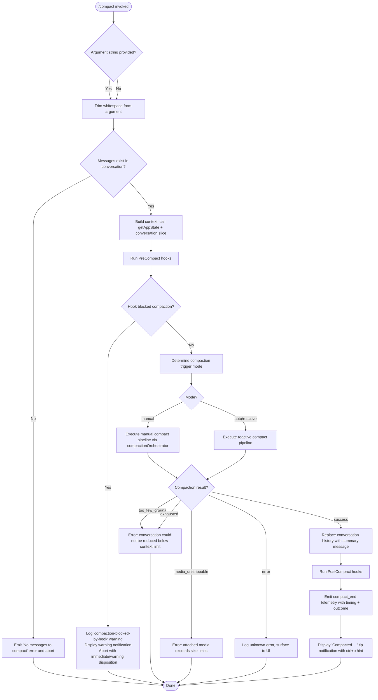

# `/compact`

> Analysis basis: CC v2.1.132 bundle.js (AST extraction + Claude interpretation)
> Minimum version: v2.1.132

---

## Overview

The `/compact` command frees up available context window space by replacing the full conversation history with a concise AI-generated summary. It operates both as a manual user-invoked command and as an automatic (reactive) mechanism triggered when the context window approaches saturation. An optional custom instruction argument allows the user to guide the summarization style or focus.

---

## Registration

| Field | Value |
|---|---|
| type | `local` |
| name | `compact` |
| description | Free up context by summarizing the conversation so far |
| argumentHint | `<optional custom summarization instructions>` |
| supportsNonInteractive | `true` |
| thinClientDispatch | `post-text` |
| module_id | `qa9` |

Analysis basis: CC v2.1.132 bundle.js:+9859304

---

## Input Branching

The top-level command handler (see `commandEntryPoint` / `WH7` in the identifier table) inspects the trimmed argument string and the current conversation state before deciding how to proceed.



Analysis basis: CC v2.1.132 bundle.js:+9858424, +9858449, +9858455, +9858487, +9858533, +9858553, +9858577, +9858603, +9858617, +9858641, +9858655, +9858680, +9858752, +9859062

---

## Behavioral Spec

### 1. Argument Validation and Early Exit

```
function validateAndPrepare(rawArgument, conversationMessages):
    trimmedArg = rawArgument.trim()                    // bundle.js:+9858487
    if conversationMessages is empty:
        raise UserFacingError("No messages to compact") // bundle.js:+9858455
    return trimmedArg
```

If the conversation contains no messages the command raises an error immediately and exits without making any API call.

Analysis basis: CC v2.1.132 bundle.js:+9858449, +9858455, +9858487

---

### 2. PreCompact Hook Execution

Before any summarization request is dispatched, the system runs lifecycle hooks of type `PreCompact`.

```
function runPreCompactHooks(conversationState):
    hookResults = executeHooks(hookType = "PreCompact",   // bundle.js:+9856129, +11899570
                               stage = "hooks_start")     // bundle.js:+9856106
    for result in hookResults:
        if result.blocksCompaction:
            logWarning("compaction-blocked-by-hook")      // bundle.js:+9325520
            displayNotification(
                level    = "warning",                     // bundle.js:+9325621
                message  = "compaction blocked by PreCompact hook", // bundle.js:+9325554
                disposition = "immediate"                 // bundle.js:+9325603
            )
            return BLOCKED
    return ALLOWED
```

Hook infrastructure is loaded through the plugin-hook loader (see `pluginHookLoader` / `wu`). The hook type string `"PreCompact"` is passed to the hook dispatcher.

Analysis basis: CC v2.1.132 bundle.js:+9856106, +9856129, +11899570, +9325520, +9325554, +9325603, +9325621

---

### 3. Compaction Mode Selection

```
function selectCompactionMode(invocationSource):
    // invocationSource is injected at call site
    if invocationSource == "manual":                      // bundle.js:+9856256
        return MANUAL                                     // telemetry: "compact_manual" bundle.js:+9326102
    else:
        return AUTO                                       // telemetry: "compact_auto"  bundle.js:+9326087
```

The string `"manual"` is set when `/compact` is typed directly by the user. The reactive (auto) path is set when the system triggers compaction autonomously due to context pressure.

Analysis basis: CC v2.1.132 bundle.js:+9856256, +9326087, +9326102

---

### 4. Message Slice and Group Assembly

The conversation history is sliced and grouped before being forwarded to the summarization model.

```
function buildMessageGroups(conversationMessages, customInstruction):
    // Apply bottom-20% safety trim to ensure a minimum context margin
    safetyFraction = 0.2                                  // bundle.js:+9325198
    sliceIndex = computeSliceIndex(
                     conversationMessages,
                     Math.max, Math.floor, Math.min)      // bundle.js:+9325167,+9325178,+9325209
    messageSlice = conversationMessages.slice(sliceIndex) // bundle.js:+9325254

    groups = groupConsecutiveMessages(messageSlice)
    if groups.count is too_few:
        return Failure(reason = "too_few_groups")         // bundle.js:+9856571

    return Success(groups, customInstruction)
```

Analysis basis: CC v2.1.132 bundle.js:+9325028, +9325082, +9325139, +9325167, +9325178, +9325198, +9325209, +9325254, +9856571

---

### 5. Summarization API Request

The summarization call is handled by the streaming API dispatcher (`streamingRequestRunner` / `qd9`). The summarization model is identified by the literal string `"claude-opus-4-7"`.

```
function requestSummary(messageGroups, customInstruction, appState):
    systemPrompt = "You are a helpful AI assistant tasked with summarizing conversations."
                                                          // bundle.js:+9337302
    modelId = "claude-opus-4-7"                           // bundle.js:+9342760
    requestTimeout = 30000  // milliseconds              // bundle.js:+9335830

    stream = openStreamingRequest(
                 model          = modelId,
                 systemPrompt   = systemPrompt,
                 messages       = messageGroups,
                 customHint     = customInstruction,
                 toolUse        = "disabled"              // bundle.js:+9337397
             )

    summaryText = ""
    for event in stream:
        if event.type == "content_block_start":           // bundle.js:+9338023
            if event.contentType == "text":               // bundle.js:+9338075
                set state = "responding"                  // bundle.js:+9338105
        elif event.type == "content_block_delta":         // bundle.js:+9338162
            if event.deltaType == "text_delta":           // bundle.js:+9338206
                summaryText += event.delta
        // cache-sharing events handled separately

    if summaryText is empty:
        emitTelemetry("tengu_compact_failed")             // bundle.js:+9338416
        raise CompactionError(
            reason  = "no_text_response",                 // bundle.js:+9336804
            message = "Failed to generate conversation summary - response did not contain valid text content"
                                                          // bundle.js:+9327518
        )
    return summaryText
```

The streaming event loop also handles cache-prefix sharing:
- On cache-sharing success → emit `tengu_compact_cache_sharing_success` (bundle.js:+9336224)
- On cache-sharing fallback → emit `tengu_compact_cache_sharing_fallback` (bundle.js:+9336757)

Analysis basis: CC v2.1.132 bundle.js:+9337302, +9342760, +9335830, +9337397, +9338023, +9338075, +9338105, +9338162, +9338206, +9338416, +9336804, +9327518, +9336224, +9336757

---

### 6. Prompt-Too-Long Retry

If the summarization prompt itself exceeds the model's context limit, the system performs a retry with a reduced message slice.

```
function handlePromptTooLong(messageGroups, customInstruction, appState):
    emitTelemetry("tengu_compact_ptl_retry")             // bundle.js:+9327154
    logEvent(level = "warn",                             // bundle.js:+9325461
             code  = "prompt_too_long")                  // bundle.js:+9327024

    // Reduce the group set and retry once
    reducedGroups = trimGroupsForRetry(messageGroups)
    if reducedGroups is insufficient:
        raise CompactionError(reason = "compact_prompt_too_long") // bundle.js:+9327114
    return requestSummary(reducedGroups, customInstruction, appState)
```

Analysis basis: CC v2.1.132 bundle.js:+9327024, +9327114, +9327154, +9325461

---

### 7. Error Classification and Surface

```
function classifyAndSurfaceError(error):
    match error.reason:
        case "exhausted":                                 // bundle.js:+9856640
            displayError("Compaction failed · conversation could not be reduced below the context limit")
                                                          // bundle.js:+9856666
        case "media_unstrippable":                        // bundle.js:+9856754
            displayError("Compaction failed · attached media exceeds size limits")
                                                          // bundle.js:+9856789
        case "no_summary":                                // bundle.js:+9327419
            logEvent(code = "compact_no_summary")         // bundle.js:+9327490
        case "api_error":                                 // bundle.js:+9327660
            logEvent(code = "compact_api_error")          // bundle.js:+9327730
        case default:
            displayError("unknown error")                 // bundle.js:+9856914
    emitTelemetry("tengu_compact_failed")                 // bundle.js:+9338416
```

The reactive (auto) compaction path additionally emits `tengu_reactive_compact_failed` on failure (bundle.js:+5301168) and logs `"reactive compaction failed"` (bundle.js:+9857334).

Analysis basis: CC v2.1.132 bundle.js:+9856640, +9856666, +9856754, +9856789, +9327419, +9327490, +9327660, +9327730, +9856914, +9857334, +5301168

---

### 8. Conversation Replacement and Boundary Marking

On success, the existing conversation messages are replaced with a single synthetic summary message.

```
function replaceConversationWithSummary(summaryText, originalMessages):
    boundaryMarker = "compact_boundary"                   // bundle.js:+9856978
    compactMetadata = buildMetadata(
        marker         = "compactMetadata",               // bundle.js:+9856998
        originalLength = originalMessages.length,
        summaryRole    = "assistant"                      // bundle.js:+9338289
    )
    summaryMessage = {
        role    : "system",                               // bundle.js:+9736331
        content : "Conversation compacted",               // bundle.js:+9736375
        summary : summaryText
    }
    replaceConversationHistory([summaryMessage])
    updateAppState(compactMetadata)
```

Analysis basis: CC v2.1.132 bundle.js:+9856978, +9856998, +9338289, +9736331, +9736375

---

### 9. PostCompact Hooks

After the conversation is replaced, `PostCompact` hooks are executed.

```
function runPostCompactHooks(summaryResult):
    executeHooks(hookType = "PostCompact",                // bundle.js:+9329892, +11900496
                 payload  = summaryResult)
    // File-restore telemetry emitted inside hook runner:
    //   tengu_post_compact_file_restore_success  bundle.js:+9338898
    //   tengu_post_compact_file_restore_error    bundle.js:+9338940
```

Analysis basis: CC v2.1.132 bundle.js:+9329892, +11900496, +9338898, +9338940

---

### 10. Completion Notification

```
function displayCompletionTip(summaryTokenCount):
    tipMessage = "Compacted " + format(summaryTokenCount) // bundle.js:+9857837
    displayTip(
        type        = "tip",                              // bundle.js:+9857686
        message     = tipMessage,
        keybinding  = "ctrl+o",                          // bundle.js:+9857730
        action      = "app:toggleTranscript",            // bundle.js:+9857698
        scope       = "Global"                           // bundle.js:+9857721
    )
```

Analysis basis: CC v2.1.132 bundle.js:+9857686, +9857698, +9857721, +9857730, +9857837

---

### 11. Timing Metrics

Wall-clock timing is measured around the full compaction pipeline using `performance.now()`.

```
function recordCompactionTiming(startTime):
    endTime  = performance.now()                          // bundle.js:+9856182, +5301075
    elapsed  = Math.round(endTime - startTime)            // bundle.js:+5301293
    return {
        durationMs : elapsed,
        event      : "compact_end"                        // bundle.js:+9857459
    }
```

The timing result is included in the `compact_end` telemetry payload together with the outcome label (`"success"` or `"failed"`).

Analysis basis: CC v2.1.132 bundle.js:+9856182, +5301075, +5301293, +9857459, +9857613, +9857622

---

### 12. Reactive (Auto) Compact Path

The reactive path is invoked automatically when context pressure is detected, without user input. It shares the same core compaction orchestrator but:

- Sets trigger mode to `"auto"` (bundle.js:+5301679)
- Emits `tengu_reactive_compact_failed` on failure (bundle.js:+5301168)
- Emits `compact_reactive` as the event label (bundle.js:+5301351)
- May emit `"aborted"` status if no suitable compaction window is found (bundle.js:+5301338)

Analysis basis: CC v2.1.132 bundle.js:+5301168, +5301338, +5301351, +5301679

---

### 13. Cancellation

If the user cancels during the operation, the system emits a final message:

```
function handleCancellation():
    display("Compaction canceled.")                       // bundle.js:+9858922
    restoreState()
```

Analysis basis: CC v2.1.132 bundle.js:+9858922

---

## State & Side Effects

| Item | Detail |
|---|---|
| Telemetry: `tengu_compact` | Master compaction event emitted once per invocation (bundle.js:+9328870) |
| Telemetry: `tengu_compact_cache_prefix` | Emitted when cache prefix is computed for summarization request (bundle.js:+9326703) |
| Telemetry: `tengu_compact_cache_sharing_success` | Emitted when prompt cache sharing succeeds (bundle.js:+9336224) |
| Telemetry: `tengu_compact_cache_sharing_fallback` | Emitted when cache sharing falls back to non-cached path (bundle.js:+9336757) |
| Telemetry: `tengu_compact_failed` | Emitted on summarization API failure (bundle.js:+9338416) |
| Telemetry: `tengu_compact_ptl_retry` | Emitted when prompt-too-long retry is attempted (bundle.js:+9327154) |
| Telemetry: `tengu_post_compact_file_restore_success` | Emitted when PostCompact hook restores files successfully (bundle.js:+9338898) |
| Telemetry: `tengu_post_compact_file_restore_error` | Emitted when PostCompact hook file restore fails (bundle.js:+9338940) |
| Telemetry: `tengu_reactive_compact_failed` | Emitted when auto compaction fails (bundle.js:+5301168) |
| Telemetry: `tengu_cobalt_raccoon` | Internal model-dispatch telemetry (bundle.js:+5298639) |
| Telemetry: `tengu_amber_redwood2` | Internal streaming telemetry (bundle.js:+9342794) |
| Telemetry: `tengu_feature_ok` | Emitted on successful feature path completion (bundle.js:+906461) |
| Telemetry: `tengu_feature_bad` | Emitted on feature path failure (bundle.js:+906517) |
| Telemetry: `tengu_slate_harbor` | Internal REPL context telemetry (bundle.js:+3134325) |
| Hook registration: PreCompact | Registered before compaction; blocking result aborts operation (bundle.js:+9856129, +11899570) |
| Hook registration: PostCompact | Registered after conversation replacement; used for file restore (bundle.js:+9329892, +11900496) |
| appState changes | `compactMetadata` field written with boundary marker and summary stats (bundle.js:+9856978, +9856998) |
| appState changes | Conversation message array replaced with single summary message (bundle.js:+9736331, +9736375) |
| appState changes | `setState` called to push compaction status to UI layer (bundle.js:+4290907) |
| UUID generation | New UUID generated for summary message via `crypto.randomUUID()` (bundle.js:+9683349, +9736450) |
| Interval / timer | `setInterval` used inside streaming runner for progress polling; cleared on completion (bundle.js:+9335787, +9338565) |
| Sound | <!-- TODO: not found in depth-2 traversal; needs --depth 4 --> |

---

## Version History

| Version | Change |
|---|---|
| v2.1.132 | Initial analysis. Manual and reactive compaction paths confirmed. PreCompact/PostCompact hook lifecycle confirmed. Model `claude-opus-4-7` confirmed as summarization target. |

---

## Common Mistakes

1. **Running `/compact` on an empty conversation.** The command exits immediately with `"No messages to compact"` and performs no API call. Ensure at least one exchange exists before invoking.

2. **Expecting the original conversation to be recoverable.** After successful compaction the full message array is permanently replaced in the session. The original turn-by-turn history cannot be retrieved from within the CLI; use `ctrl+o` to review the transcript view if available.

3. **Supplying a custom instruction that is too prescriptive about format.** The summarization model (`claude-opus-4-7`) is configured with tool use disabled and a fixed system prompt. Overly structural instructions (e.g., "respond in JSON") may produce unexpected output because the response is captured as raw streaming text.

4. **Assuming `/compact` and auto-compaction are identical.** The reactive path runs with trigger mode `"auto"` and has a distinct failure telemetry path (`tengu_reactive_compact_failed`). Its retry and abort behaviour differs from the manual path.

5. **Ignoring PreCompact hook blocks.** If a `PreCompact` hook returns a blocking result, compaction is silently aborted from the user perspective (only a warning notification is shown). Users relying on hook-guarded compaction must ensure hooks are configured correctly before expecting `/compact` to proceed.

6. **Not accounting for the prompt-too-long retry.** On very long conversations the system automatically retries with a trimmed message set. This retry is transparent to the user but adds latency and emits `tengu_compact_ptl_retry`. If the retry also fails, a `compact_prompt_too_long` error is surfaced.

---

## Appendix — Identifier Mapping

> For bundle debugging only. Identifiers change across versions.

| Identifier | Role |
|---|---|
| `WH7` | Top-level command entry point (handles argument validation, branching, cancellation) |
| `A$` | Message array accessor / conversation slicer helper |
| `Ht4` | Conversation message iterator / getter |
| `l3H` | Pre-compaction context builder (assembles state for hook runner) |
| `XM6` | Context snapshot helper called by pre-compaction builder |
| `XX` | Token / context-window size calculator (uses `parseInt`, `isNaN`, `Math`) |
| `vY` | Supplementary state accessor used during context build |
| `Gq` | Model profile resolver (checks `"application-inference-profile"`) |
| `ie6` | Model identifier resolver (returns `"claude-opus-4-7"`) |
| `GH7` | Compaction orchestrator (coordinates hooks, API call, state replacement) |
| `iZ` | Async iterator / streaming helper |
| `eB` | Summarization prompt builder (assembles `PreCompact` payload, joins message content) |
| `_a9` | AppState reader and conversation-replacement writer |
| `Lf8` | Logging / structured-event emitter (depth-1 wrapper around `k`) |
| `ZTA` | Compaction status state machine transition helper |
| `WMA` | Reactive compaction metrics collector (timing, `compact_reactive`, `aborted`) |
| `cc` | Post-compaction cleanup dispatcher (`post_compact_cleanup` stage) |
| `FWH` | UI state setter (calls `s46.setState` to push compaction status to renderer) |
| `Aa9` | Completion tip builder (assembles `"Compacted …"` notification with `ctrl+o` hint) |
| `mMH` | Timing metric formatter (formats `"compaction"` duration with `Math.round` / `String`) |
| `Za` | State restoration helper on cancellation |
| `yx1` | Inner setState caller used by `Za` |
| `OcH` | Full compaction pipeline runner (manual path; coordinates all sub-steps) |
| `mH` | Error logger wrapper used inside pipeline runner |
| `YJ` | Message-slice boundary calculator (uses `iZ`, `H.slice`) |
| `oUH` | AppState snapshot capture used inside pipeline |
| `j6` | Cache-prefix tracker (Set-based deduplication of cache keys) |
| `Se6` | Summary text post-processor (trims whitespace from model response) |
| `$8` | UUID factory wrapper (calls `crypto.randomUUID`) |
| `qd9` | Streaming summarization request runner (manages `setInterval`, event loop, retries) |
| `Iy` | Response type guard (`Array.isArray` check on streaming response) |
| `eQ9` | Message group assembler for prompt construction |
| `d` | Generic logger / debug emitter |
| `k` | Structured log emitter (formats level + message for output) |
| `RH` | JSON serializer wrapper (`JSON.stringify`) |
| `td` | Message-role classifier (checks `startsWith` for role detection) |
| `Y76` | Object entry transformer (`Object.fromEntries` / `H.entries`) |
| `nWH` | Parallel async coordinator used before PostCompact phase |
| `Qe6` | Per-agent context file restorer (iterates entries, calls `Promise.all`) |
| `ne6` | Local-agent task-status checker (`"pending"` / `"running"` filter) |
| `de6` | Plan-file reference handler |
| `le6` | Plan-mode state handler |
| `ce6` | Invoked-skills aggregator |
| `n3H` | Deferred-tools delta handler |
| `M1` | Attachment message factory (generates `"attachment"` type messages with UUID) |
| `fBH` | Tool-permission context builder and MCP instruction assembler |
| `MBH` | MCP instructions delta handler |
| `wu` | Plugin hook loader (clones hooks, validates schema, maps errors to categories) |
| `PM6` | Secondary UUID factory (calls `crypto.randomUUID`) |
| `Ys` | Content-block accumulator for streaming response |
| `tf` | System-prompt assembler (joins prompt parts) |
| `zj` | REPL context classifier (`"cli"` vs `"remote"`) |
| `gq6` | REPL context getter reference |
| `YM6` | REPL context formatter |
| `Lc` | Usage/token-count tracker |
| `hMH` | Message-cache membership tester (`G76.has`) |
| `cE` | Compaction error classifier and surface dispatcher |
| `Oe6` | Percentage-based metric normalizer (`Math.round`, factor 100) |
| `$e6` | Hook output processor (iterates `humanMessages` / `assistantMessages` arrays) |
| `fH` | Error event logger (calls `EQ.logError`, pushes to `kyH`) |
| `ZB` | Notification display helper |
| `a46` | Plugin registry accessor (`ix.get`) |
| `KNH` | Compaction failure state marker |
| `$BH` | Hook key builder (`hK`) |
| `i3H` | PostCompact prompt builder (joins content with `K.join`) |
| `SH` | Generic async scheduler / dispatcher |
| `_d9` | Error-compacting-conversation notification builder (`"error-compacting-conversation"`) |
| `yTA` | Cancellation message emitter (outputs `"Compaction canceled."`) |
| `yH` | String coercion utility |
| `aLH` | Final state cleanup called on both success and cancellation paths |