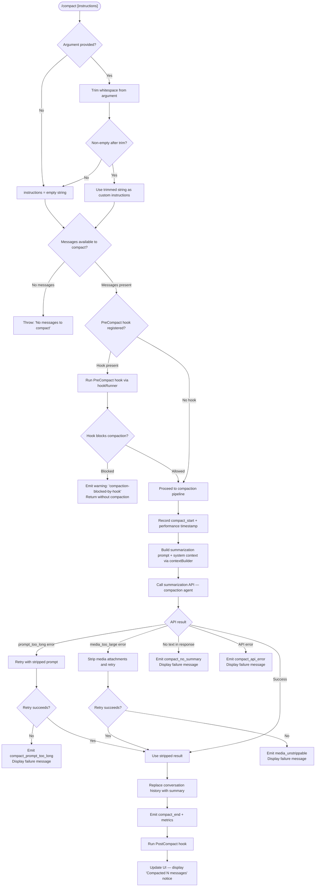

# `/compact`

> Analysis basis: CC v2.1.132 bundle.js (AST extraction + Claude interpretation)
> Minimum version: v2.1.132

---

## Overview

The `/compact` command reduces context window consumption by requesting a summarization of the current conversation and replacing the existing message history with a compact summary. It accepts an optional user-supplied instruction string to guide how the summary is generated, and supports both interactive (REPL) and non-interactive (pipeline) execution. The command is the user-visible entry point into a broader reactive-compaction subsystem that also runs automatically when context limits are approached.

---

## Registration

| Field | Value |
|---|---|
| type | `local` |
| name | `compact` |
| description | `Free up context by summarizing the conversation so far` |
| argumentHint | `<optional custom summarization instructions>` |
| supportsNonInteractive | `true` |
| thinClientDispatch | `post-text` |
| module_id | `qa9` |
| load_inline | `true` |
| handler (Arbor) | `WH7` (AsyncFunction, resolved via `module_id`) |
| `loc_byte_end` | `9859617` |
| `arbor_handler.name` | `WH7` |
| `arbor_handler.kind` | `AsyncFunction` |
| `arbor_handler.resolution_path` | `module_id` |
| `arbor_handler.fqn` | `claude-2.1.132::WH7` |
| `arbor_handler.n_hits` | `0` |

Analysis basis: CC v2.1.132 bundle.js:+9859304 – +9859617

---

## Input Branching



Analysis basis: CC v2.1.132 bundle.js:+9858424 (handler entry `WH7`), +9858449 (no-messages guard), +9856182 (phase state machine in `GH7`), +9325520 (PreCompact hook block path), +9327114 (prompt-too-long retry), +9327490 (no-summary path), +9327660 (API error path)

---

## Behavioral Spec

### 1. Handler Entry — Argument Parsing and Guard

```
async function compactCommandHandler(userArgument, context):
    # Guard: reject if no messages exist
    if conversationMessages is empty:
        throw Error("No messages to compact")   # loc +9858455

    # Normalize optional custom instructions
    rawInstructions = userArgument ?? ""
    customInstructions = rawInstructions.trim()   # loc +9858487

    # Proceed to hook + compaction pipeline
    return await compactionPipeline(customInstructions, context)
```

Analysis basis: CC v2.1.132 bundle.js:+9858424, +9858449, +9858487

---

### 2. Compaction Pipeline — Phase State Machine

The internal pipeline function (identified as `GH7`) advances through named phases, recording a `performance.now()` timestamp at entry, then fanning out to several parallel preparatory steps before issuing the summarization API call.

```
async function compactionPipeline(customInstructions, context):
    startTime = performance.now()               # loc +9856182

    # Phase labels observed in literals
    setPhase("hooks_start")                     # loc +9856106
    runPreCompactHooks(context)                 # → hookRunner (eB)

    if preCompactHookBlocked:
        emitWarning("compaction-blocked-by-hook")   # loc +9325520
        return

    setPhase("pre_compact")                     # loc +9856129
    contextData = await buildContext(context)   # → contextBuilder (_a9)

    setPhase("compacting")                      # loc +9856162
    triggerMode = "manual"                      # loc +9856256

    result = await runReactiveCompact(
        contextData,
        customInstructions,
        triggerMode
    )                                           # → compactionCore (WMA / zt1 / OcH)

    if result.error is "prompt_too_long":
        emit("tengu_compact_ptl_retry")         # loc +9327154
        result = await runReactiveCompact(contextData, customInstructions, triggerMode, stripped=true)

    handleResult(result)
    emit("compact_end")                         # loc +9857459
    updateUI(result)
```

Analysis basis: CC v2.1.132 bundle.js:+9856182, +9856106, +9856129, +9856162, +9856256, +9856319 (`_a9`), +9856330 (`Lf8`), +9856345 (`ZTA`), +9856492 (`WMA`)

---

### 3. Context Builder — System Prompt and Message Preparation

The context builder (`_a9`) performs the following steps in parallel:

```
async function buildContext(context):
    appState    = context.getAppState()        # loc +9857893
    messageList = Array.from(messageStore)     # loc +9857960
    systemPromptParts = await buildSystemPrompt(appState)  # → iR / getSystemPrompt
    [contextSections, toolContext] = await Promise.all([
        buildAppStateContext(appState),        # → BW
        collectFileReferences(messageList)     # → iR
    ])                                         # loc +9858221
    return { appState, messageList, systemPromptParts, contextSections }
```

The system prompt builder (`BW`) assembles many named sections including memory, environment info, guidance layers, and hooks context. Notable section names observed in literals: `thinking_guidance`, `session_guidance`, `memory_load_prompt`, `env_info_static`, `env_info_simple`, `language`, `output_style`, `focus_mode`, `summarize_tool_results`.

Analysis basis: CC v2.1.132 bundle.js:+9857893, +9857960, +9858221, +9858234

---

### 4. Reactive Compact Core — Summarization Request

The actual compaction (handler chain `WMA → zt1 → OcH`) issues a special summarization API request:

```
async function runSummarizationRequest(contextData, customInstructions, options):
    # Build the message slice to summarize
    messagesToSummarize = selectCompactionWindow(contextData.messageList)
    # loc +9736843: insert "system" role boundary marker "compact_boundary"

    systemPrompt = [
        "You are a helpful AI assistant tasked with summarizing conversations.",
        # loc +9337302
        ...contextData.systemPromptParts
    ]

    # Tool use is denied during compaction
    toolUsePolicy = "deny"                    # loc +9335448
    toolUseDenialReason = "Tool use is not allowed during compaction"  # loc +9335463

    response = await callSummarizationModel(
        messages     = messagesToSummarize,
        systemPrompt = systemPrompt,
        tools        = [],
        maxTokens    = derivedFromModelLimits
    )                                         # → qd9 (compaction agent runner)

    if response has no text block:
        emit("tengu_compact_failed")          # loc +9338416
        record("compact_no_summary")          # loc +9327490
        raise CompactionError("Failed to generate conversation summary - response did not contain valid text content")
        # loc +9327518

    summaryText = response.firstTextBlock.trim()
    return summaryText
```

Analysis basis: CC v2.1.132 bundle.js:+9736843, +9736865, +9337302, +9335448, +9335463, +9327490, +9327518, +9338416

---

### 5. Compaction Window Selection — Message Grouping

The function responsible for choosing which messages to include in the compaction window (`A$`) applies a grouping strategy:

```
function selectCompactionWindow(messages):
    # Groups messages into contiguous blocks; boundaries tracked by "compact_boundary" markers
    # Returns a slice starting at index 1, retaining the most-recent portion
    groups = groupMessages(messages)     # → Ht4 / hj
    slicedMessages = messages.slice(1)  # loc +9737018, literals: index 1 and 0 at +9736919/+9736924
    return slicedMessages
```

When fewer than 2 groups are present, the reactive compact path bails early:

```
if groups.length < 2:
    log("Reactive compact: fewer than 2 groups, nothing to compact")  # loc +9858455 area
    emit("too_few_groups")              # loc +9274940 (reactive path)
    return { aborted: true }
```

Analysis basis: CC v2.1.132 bundle.js:+9858424, +9736995, +9737018, +9736919, +9736924, +9736843, +9736865

---

### 6. Auto-Compact Threshold Check

A separate subsystem (`ie6` / `NTA`) evaluates whether the current token consumption warrants automatic compaction. The check uses:

- A configuration key `autoCompactEnabled` (string literal at +9344205)
- A threshold labeled `auto` with values parsed as percentage floats, scaled by `1000` and `100` (literals at +9342513, +9342549)
- `parseFloat` / `parseInt` / `Math.round` for numeric normalization (loc +9342455, +9342529, +9342622)

```
function shouldAutoCompact(appState, tokenUsage):
    if not appState.autoCompactEnabled:    # loc +9344205
        return false
    threshold = parseAutoThreshold(appState)  # → NTA
    currentRatio = tokenUsage.used / tokenUsage.limit
    return currentRatio >= threshold
```

Analysis basis: CC v2.1.132 bundle.js:+9342726, +9344205, +9342408, +9342513, +9342549

---

### 7. Post-Compaction Result Handling and UI Update

After a successful summarization, the handler (`GH7` → `Aa9`) replaces the message list and updates the UI:

```
function applyCompactionResult(summaryText, context):
    # Replace conversation history
    newMessages = [
        { role: "system", content: "Conversation compacted" },  # loc +9736375
        { role: "user",   content: summaryText }
    ]
    context.replaceMessages(newMessages)

    # Emit metrics event
    emitOtelEvent("compaction", { duration_ms, token_savings })  # loc +4401157

    # Update UI
    registerKeybinding(
        action = "app:toggleTranscript",     # loc +9857698
        scope  = "Global",                   # loc +9857721
        key    = "ctrl+o"                    # loc +9857730
    )
    displayNotice("Compacted " + messageCount + " messages")  # loc +9857837 ("Compacted ")
```

On failure, one of three messages is displayed:

| Failure type | User-facing string |
|---|---|
| Context could not be reduced | `"Compaction failed · conversation could not be reduced below the context limit"` (loc +9856666) |
| Media too large | `"Compaction failed · attached media exceeds size limits"` (loc +9856789) |
| Unknown | `"unknown error"` (loc +9856914) |

Analysis basis: CC v2.1.132 bundle.js:+9857278, +9857459, +9857698, +9857730, +9857837, +9857850, +9856666, +9856789, +9856914

---

### 8. PreCompact and PostCompact Hooks

The hook lifecycle around compaction uses two named hook types:

- **PreCompact** hook type string: `"PreCompact"` (loc +11899570). Runs before summarization begins. If any hook returns a block decision, compaction is cancelled and a `compaction-blocked-by-hook` warning is emitted (loc +9325520, +9325554).
- **PostCompact** hook type string: `"PostCompact"` (loc +11928704). Runs after the conversation has been replaced with the summary.

```
function runPreCompactHooks(context):
    hookResult = hookRunner.run("PreCompact", context)  # → eB / qP
    if hookResult.decision == "block":
        emitNotification({
            type    = "warning",          # loc +9325621
            subtype = "immediate",        # loc +9325603
            message = "compaction blocked by PreCompact hook"  # loc +9325554
        })
        return BLOCKED
    return ALLOWED
```

Analysis basis: CC v2.1.132 bundle.js:+11899570, +11928704, +9325520, +9325554, +9325603, +9325621, +9856106

---

### 9. Error Recovery and Cancellation

```
function handleCompactionError(error, context):
    if error.type == "prompt_too_long":
        emit("tengu_compact_ptl_retry")          # → retry with stripped messages
    elif error.type == "api_error":
        record("compact_api_error")              # loc +9327730
        displayError(error.message)
    elif error.type == "no_summary":
        record("compact_no_summary")             # loc +9327490

    # Cancellation path (e.g. user interrupt)
    if wasCancelled:
        displayMessage("Compaction canceled.")   # loc +9858922
```

A `compact_not_enough_messages` metric is emitted when the message slice is too short to compact (loc +9326176).

Analysis basis: CC v2.1.132 bundle.js:+9327114, +9327490, +9327660, +9327730, +9326176, +9858922

---

## State & Side Effects

| Item | Detail |
|---|---|
| Telemetry — compact lifecycle | `tengu_compact` (loc +9328870), `tengu_compact_failed` (loc +9338416), `tengu_compact_cache_prefix` (loc +9326703), `tengu_compact_cache_sharing_success` (loc +9336224), `tengu_compact_cache_sharing_fallback` (loc +9336757), `tengu_compact_ptl_retry` (loc +9327154) |
| Telemetry — reactive compact | `tengu_reactive_compact_attempt` (loc +5275394), `tengu_reactive_compact_failed` (loc +5301168), `tengu_reactive_compact_succeeded` (loc +5302994), `tengu_precomputed_compact_discarded` (loc +5281812) |
| Telemetry — hooks | `tengu_run_hook` (loc +11947700), `tengu_repl_hook_finished` (loc +11932935), `tengu_hook_plugin_injected` (loc +11946284) |
| Telemetry — file restore | `tengu_post_compact_file_restore_success` (loc +9338898), `tengu_post_compact_file_restore_error` (loc +9338940) |
| Hook registration | PreCompact hook fires before summarization; PostCompact hook fires after replacement. Both run through the shared hook runner (`eB` / `qP`). |
| appState changes | `compactMetadata` key written to appState after compaction (literal `"compactMetadata"` at loc +9856998). App state is read via `getAppState()` at multiple points. |
| Message history | Replaced in-place with a single summary message. A `compact_boundary` system-role marker is inserted before the summary content (loc +9736865). |
| OTEL metric | A `compaction` metric is emitted via the OTEL telemetry pipeline (`T4`), tagged with `event.name`, `event.timestamp`, `event.sequence`, `prompt.id` (loc +4401157, +4400648–4400745). |
| Sound | <!-- TODO: not found in depth-2 traversal; needs --depth 4 --> |
| File references | Post-compact file reference restoration attempted; emits success/error telemetry (loc +9338898, +9338940). |

---

## Version History

| Version | Change |
|---|---|
| v2.1.132 | Initial analysis. Handler `WH7` (AsyncFunction), pipeline state machine `GH7`, context builder `_a9`, core compaction `WMA`/`zt1`/`OcH`. PreCompact and PostCompact hook lifecycle documented. Auto-compact threshold key `autoCompactEnabled` confirmed. |

---

## Common Mistakes

1. **Invoking `/compact` on an empty conversation.** The handler throws `"No messages to compact"` immediately if the message list is empty. Ensure at least one exchange has occurred before running the command.

2. **Expecting tool use to succeed during compaction.** All tool calls are denied during the summarization API request (`policy = "deny"`; literal `"Tool use is not allowed during compaction"` at loc +9325463). Any hooks or background tasks that try to use tools will be blocked.

3. **Assuming compaction always succeeds on the first attempt.** The handler silently retries with a stripped prompt when a `prompt_too_long` error is returned. If the stripped retry also fails, a failure message is shown and the conversation history is left unchanged.

4. **Supplying a blank argument expecting it to be ignored.** The argument is trimmed; an all-whitespace argument is treated identically to no argument — no custom instructions are passed to the summarization model.

5. **Relying on the old message history after `/compact`.** The entire history prior to the compact boundary is replaced with the summary text. Any content not captured in the summary is permanently removed from the active context window.

6. **Ignoring PreCompact hook blocks.** If a registered PreCompact hook returns a block decision, compaction is silently cancelled (a warning notification is shown). Scripts that depend on compaction having run should check for the `compactMetadata` key in appState.

---

## Appendix — Identifier Mapping

> For bundle debugging only. Identifiers change across versions.

| Identifier | Role |
|---|---|
| `WH7` | Main async handler for `/compact` command (Arbor-resolved entry point) |
| `GH7` | Compaction pipeline phase state machine; orchestrates hooks → context → API |
| `_a9` | Context builder: reads appState, assembles message list and system prompt parts |
| `BW` | System prompt assembler: builds all guidance/memory/env sections |
| `WMA` | Reactive compact orchestrator: wraps `zt1` and timing logic |
| `zt1` | Core compaction runner: selects window, calls summarization, applies result |
| `OcH` | Summarization sub-runner: sends API request, handles retry/error paths |
| `qd9` | Compaction agent executor: manages the summarization model call loop |
| `Ce6` | Compaction window builder: groups and slices messages for summarization |
| `A$` | Message slice selector: returns the subset of messages to be summarized |
| `Ht4` | Message grouper: splits messages into contiguous groups |
| `hj` | Group boundary detector (called by `Ht4`) |
| `l3H` | Pre-pipeline check: validates message set before compaction proceeds |
| `XM6` | Part of pre-check; delegates to token-counting and event utilities |
| `ie6` | Auto-compact threshold evaluator |
| `hW` | Auto-compact configuration reader |
| `NTA` | Threshold parser: converts `auto` setting string to a numeric ratio |
| `K5` | Configuration key reader for `autoCompactEnabled` and related settings |
| `eB` | Hook runner entry: dispatches PreCompact / PostCompact hooks |
| `qP` | Hook execution core: handles command/prompt/http/mcp hook types |
| `aK` | Hook initialization and configuration loader |
| `iX` | Per-hook executor: resolves hook type and calls appropriate handler |
| `pY8` | Shell/process hook executor (spawn-based hooks) |
| `pbA` | HTTP hook executor |
| `UbA` | MCP tool hook executor |
| `mY8` | Hook output parser: JSON vs plain-text disambiguation |
| `ZPq` | Hook output processor: extracts decision fields |
| `iZ` | Agent / sub-process query launcher (used for summarization model call) |
| `in4` | Query initialization: sets up assistant/user/api_system roles |
| `gTA` | Message normalizer: converts internal message format to API format |
| `Aa9` | Post-compaction UI updater: registers keybinding, displays notice |
| `jj` | Keybinding registration helper |
| `mMH` | OTEL metric emitter for `compaction` event |
| `T4` | OTEL gauge/counter writer |
| `rmH` | OTEL attribute builder (user.id, session.id, org.id, etc.) |
| `FWH` | App state setter (calls `s46.setState`) |
| `Za` | App state updater wrapper (calls `yx1` → `s46.setState`) |
| `cc` | Post-compact cleanup: clears caches, resets autonomous loop state |
| `me6` | Precomputed compact cache reader/deleter |
| `Fe6` | Cache clear for `kn9` (compact-related cache) |
| `Os1` | Clears `$M6` and `lfA` caches after compaction |
| `ss1` | Precomputed compact cache entry validator |
| `Qe6` | File reference restorer: re-attaches file context after compaction |
| `GEA` | File-at-mention resolver used during context restoration |
| `ne6` | Local-agent task context restorer |
| `de6` | Working-directory file context restorer |
| `le6` | Additional file context restorer |
| `ce6` | Compact attachment restorer |
| `wu` | Plugin/hook loader used in hook pipeline setup |
| `KM6` | API client factory for hook HTTP calls |
| `GP6` | Memory-load prompt builder (CLAUDE.md etc.) |
| `yH` | String coercion utility |
| `Iq` | String coercion utility (alternative path) |
| `vH` | String coercion utility (error path) |
| `RH` | JSON serializer wrapper |
| `fH` | Structured logger (error-level) |
| `mH` | Structured logger (general) |
| `SH` | Structured logger (state) |
| `d` | Generic logger / sink |
| `vA` | Event emitter / dispatcher |
| `j6` | Event subscription manager |
| `R6` | Telemetry event recorder |
| `PM6` | UUID generator (uses `SG.randomUUID`) |
| `Ys` | Token usage tracker |
| `e5` | Performance timer (Math.round wrapper) |
| `GT` | Abort / timeout controller |
| `g_H` | Max-output-token resolver (`CLAUDE_CODE_MAX_OUTPUT_TOKENS`) |
| `D5H` | Context-window size lookup by model |
| `Na` | Token cap parser (parseInt / isNaN guard) |
| `iP` | Last-message finder (`H.findLast`) |
| `Iy` | Array-type content checker |
| `N6` | Role/format normalizer |
| `v6` | Message role resolver |
| `XX` | Model capability checker (used to select summarization model) |
| `lQ` | Model family classifier |
| `Gq` | Model prefix/suffix tester |
| `m0` | Model output-token limit resolver |
| `O8H` | Model metadata fetcher |
| `ZF6` | Extended model capability resolver |
| `vY` | Vision/media capability checker |
| `nw` | API provider type classifier (firstParty / anthropicAws / foundry / mantle) |
| `_S` | Provider sub-type resolver |
| `D84` | Parallel compaction task runner (Promise.all over sub-tasks) |
| `YJ` | Conversation history formatter for summarization prompt |
| `W76` | Message slice formatter |
| `hMH` | Cache-prefix inclusion checker |
| `Lc` | Compact-cache prefix helper |
| `zj` | Message role tagger (cli / remote) |
| `YM6` | Attachment normalizer |
| `Q64` | Text attachment cleaner |
| `Se6` | Text trimmer for compaction content |
| `gq6` | REPL-context collector |
| `iR` | System-prompt collector (main-thread path) |
| `gq` | System-prompt reader |
| `fw` | System-prompt formatter |
| `Lf8` | Formatting helper for context sections |
| `ZTA` | Context section joiner |
| `D84` | Parallel sub-task launcher for compaction pipeline |
| `Ww6` | Tool-schema builder for compaction agent |
| `jG` | Full agent query executor (used for compaction model call) |
| `cdH` | Compaction agent wrapper (calls `pTA` + `j2q`) |
| `j2q` | Core agent query loop (streaming, retries, tool-deny, message assembly) |
| `pTA` | Pre-query message preparer |
| `jGH` | Language/locale normalizer |
| `zZH` | Tool availability checker |
| `tu` | Tool name normalizer |
| `xTA` | Tool-search mode decision maker |
| `Ww6` | Tool schema assembler for agent call |
| `$e6` | Context-efficiency statistics gatherer |
| `Oe6` | Context-efficiency ratio calculator |
| `i3H` | Prompt builder: assembles final prompt string for summarization API |
| `GMA` | Last-message accessor |
| `c_H` | Context hint formatter |
| `SN` | Output-token counter |
| `_NH` | Output-token registry |