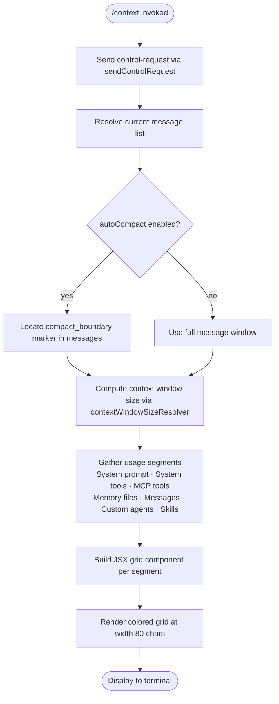

# `/context`

> Analysis basis: CC v2.1.132 bundle.js (AST extraction + Claude interpretation)
> Minimum version: v2.1.132

---

## Overview

The `/context` slash command visualizes the current conversation's context-window usage as a colored grid rendered in the terminal. It dispatches a control request (type `local-jsx`) to the running session, collects token-usage data from the live agent state, and renders a multi-category breakdown — covering messages, system prompt, tools, memory files, and other tracked segments — so that the user can see at a glance how much of the available context has been consumed.

---

## Registration

| Field | Value |
|---|---|
| `type` | `local-jsx` |
| `name` | `context` |
| `description` | Visualize current context usage as a colored grid |
| `thinClientDispatch` | `control-request` |
| `module_id` | `kt9` |
| `load_inline` | `true` |
| `handler` | `D_7` (resolved via `module_id` path) |
| `loc_byte_end` | `10246774` |
| `arbor_handler.name` | `D_7` |
| `arbor_handler.kind` | `AsyncFunction` |
| `arbor_handler.resolution_path` | `module_id` |
| `arbor_handler.fqn` | `claude-2.1.132::D_7` |
| `arbor_handler.n_hits` | `0` |

Analysis basis: CC v2.1.132 bundle.js:+10246569 – +10246774

---

## Input Branching

The command takes no user-supplied arguments. All branching is driven by internal session state accessed during handler execution.



Analysis basis: CC v2.1.132 bundle.js:+10245297, +10245469, +10245700

---

## Behavioral Spec

### Handler Entry Point

The asynchronous handler `D_7` is the sole entry point for this command. It is resolved from module `kt9` via the `load_inline` mechanism.

```
async function contextCommandHandler(controlApi, appState):
    sendControlRequest(controlApi)                  // dispatch to session
    jsxElement = createElement(contextGridComponent)
    animatedDelay = scheduleRandomDelay(2)          // jitter in [0,2) * multiplier
    usageData = buildContextUsageData(appState)
    contextSize = resolveContextWindowSize(appState)
    stateSnapshot = captureAppStateSnapshot(appState)
    display render(jsxElement)
```

Analysis basis: CC v2.1.132 bundle.js:+10245297, +10245324, +10245384, +10245388, +10245433, +10245469, +10245553, +10245642, +10245668, +10245705

---

### Context Window Size Resolution (`xJ6`)

The function `xJ6` determines the effective context window ceiling, applying the following logic:

```
function resolveContextWindowSize(appState):
    allSegments = filterMessageSegments(appState.messages)
    freeSpaceSegment = findSegment(allSegments, label="Free space")
    autocompactSegment = findSegment(allSegments, label="Autocompact buffer")
    modelContextLimit = lookupModelContextLimit(appState.model)
        // context limits found at depth-2: 64000, 128000, 32000 tokens
    usagePercentage = computeUsage(allSegments) * 100   // constant 100 at +10243701
    stringRepresentation = String(usagePercentage)
    return { total: modelContextLimit, segments: allSegments, pct: usagePercentage }
```

Segment labels found in literals:
- `"Free space"` (bundle.js:+10243486)
- `"Autocompact buffer"` (bundle.js:+10243509)

Settings-key labels used for non-message segments:
- `"projectSettings"` → display label `"Project"` (bundle.js:+10244435, +10244455)
- `"userSettings"` → `"User"` (bundle.js:+10244475, +10244492)
- `"localSettings"` → `"Local"` (bundle.js:+10244509, +10244527)
- `"flagSettings"` → `"Flag"` (bundle.js:+10244545, +10244562)
- `"policySettings"` → `"Policy"` (bundle.js:+10244579, +10244598)
- `"plugin"` → `"Plugin"` (bundle.js:+10244617, +10244628)
- `"built-in"` → `"Built-in"` (bundle.js:+10244647, +10244660)

Analysis basis: CC v2.1.132 bundle.js:+10243410, +10243451, +10243769, +10244687, +10245119

---

### Compact Boundary Detection (`z_7` / `A$`)

```
function findCompactBoundary(messages):
    boundary = findMessageByMarker(messages, marker="compact_boundary")
    // literal "compact_boundary" at bundle.js:+9736865
    if boundary found:
        return messages.slice(fromBoundaryIndex)
    else:
        return messages   // full window
```

Analysis basis: CC v2.1.132 bundle.js:+10245261, +9736995, +9737018

---

### Context Window Size Computation (`Mf8` / `N9H`)

`Mf8` is the primary context-data assembly function, called by `D_7`. It orchestrates all segment collectors and produces the final token-count breakdown rendered in the grid.

```
function assembleContextUsage(appState):
    // Collect all context segments in parallel
    segments = []

    // System prompt tokens
    systemPromptTokens = countTokensForSystemPrompt(appState)

    // Tool tokens: system tools, MCP tools, deferred variants
    systemToolTokens  = countSystemToolTokens(appState)
    mcpToolTokens     = countMcpToolTokens(appState)
    deferredSystemTokens = countDeferredSystemToolTokens(appState)
    deferredMcpTokens    = countDeferredMcpToolTokens(appState)

    // Memory and agent tokens
    memoryFileTokens  = countMemoryFileTokens(appState)
    customAgentTokens = countCustomAgentTokens(appState)
    skillsTokens      = countSkillsTokens(appState)

    // Message tokens (conversation history)
    messageTokens = countMessageTokens(appState)

    // Compute totals
    totalUsed   = sum(all segment token counts)
    contextMax  = resolveContextWindowSize(appState)
    freeSpace   = max(0, contextMax - totalUsed)
    autocompact = computeAutocompactBuffer(appState)

    // Apply min/max clamping
    displayPct = Math.round(totalUsed / contextMax * 100)
    // Math.floor also used for grid cell allocation: bundle.js:+9356058

    return { segments, totalUsed, freeSpace, autocompact, displayPct }
```

Display width constant: **80 characters** (bundle.js:+10245700)

Analysis basis: CC v2.1.132 bundle.js:+9353508, +9354179, +9354241, +9354247, +9354262, +9354277, +9354284, +9354295, +9354313, +9355243, +9355308, +9355319, +9355896, +9356058, +9356296, +9356343, +9356438

---

### Grid Color Scheme

Segment color names found in literals (bundle.js range +9354464 – +9355004):

| Segment | Color / Style Key |
|---|---|
| System prompt | `"promptBorder"` |
| System tools | `"inactive"` |
| MCP tools | `"cyan_FOR_SUBAGENTS_ONLY"` |
| MCP tools (deferred) | `"MCP tools (deferred)"` label |
| System tools (deferred) | `"System tools (deferred)"` label |
| Custom agents | `"permission"` |
| Memory files | `"claude"` |
| Skills | `"warning"` |
| Messages | `"purple_FOR_SUBAGENTS_ONLY"` |

Analysis basis: CC v2.1.132 bundle.js:+9354464 – +9355004

---

### Token Counting Helpers

Several helper functions are called by `Mf8` to count individual segment types:

```
function countMessageTokens(messages):
    // vn4: filters messages, maps each through tokenEstimator (e5),
    // aggregates with Math.round and Math.max.
    // Uses G.prompt accessor for prompt content.
    filteredMessages = messages.filter(isCountableMessage)
    tokenCounts = await Promise.all(filteredMessages.map(tokenEstimate))
    return tokenCounts.reduce(sum, 0)

function countSystemToolTokens(appState):
    // Nn4: maps built-in tool definitions through bcH (token-count accumulator)

function countMcpToolTokens(appState):
    // Sn4: iterates MCP server tool lists; calls kn4/yn4/hn4 per tool category

function countMemoryFileTokens(appState):
    // In4: reads memory directory state via IzH; respects N6 (team memory path)

function countSkillsTokens(appState):
    // wo6 → hMH: checks G76 usage-flag map

function countCustomAgentTokens(appState):
    // l3H: iterates registered custom agent definitions
```

Analysis basis: CC v2.1.132 bundle.js:+9350524, +9351651, +9352752, +9349773, +9355023, +9355130

---

### Autocompact Window Resolution (`ol`)

```
function resolveAutocompactWindow(appState):
    // Reads env var CLAUDE_CODE_AUTO_COMPACT_WINDOW first
    envValue = process.env["CLAUDE_CODE_AUTO_COMPACT_WINDOW"]
    // literal at bundle.js:+9342982
    if envValue is valid integer:
        return clamp(envValue, min, max)

    // Then falls back to settings key "settings" → "auto"
    settingsValue = readSetting("settings")
    if settingsValue == "auto":
        return computeAutoWindow(contextSize)  // via NTA: parseFloat/parseInt/Math.round

    return defaultAutocompactWindow
```

Analysis basis: CC v2.1.132 bundle.js:+9342906, +9342914, +9342979, +9343100, +9343140, +9343262, +9343449, +9343472, +9343497

---

### Rendering Pipeline (`KgH`)

```
function buildContextGridElement(usageData):
    // KgH: registers a listener for "data" events (literal at bundle.js:+7361471)
    // then calls toString on the grid buffer and passes to Nx for JSX rendering

    gridLines = usageData.segments.map(seg =>
        seg.label.padEnd(columnWidth)   // padEnd call at bundle.js:+14152030
    )
    gridText = gridLines.join("  ")     // separator literal "  " at bundle.js:+14152051
    element = createElement(contextGridComponent, { gridText, usageData })
    return element
```

Analysis basis: CC v2.1.132 bundle.js:+7361466, +7361503, +7361530, +7361533, +14152017, +14152030, +14152051

---

### Control Request Dispatch (`A3` / `_.sendControlRequest`)

```
function dispatchControlRequest(controlApi):
    // A3 calls ywH internally (a general request utility)
    // D_7 also calls _.sendControlRequest directly with type "get_context_usage"
    // literal "get_context_usage" at bundle.js:+10245354
    controlApi.sendControlRequest({
        type: "get_context_usage"
    })
```

Analysis basis: CC v2.1.132 bundle.js:+10245297, +10245324, +10245354

---

## State & Side Effects

| Item | Detail |
|---|---|
| Telemetry | `tengu_amber_redwood2` (bundle.js:+9342794) — fired during autocompact-window resolution |
| Telemetry | `tengu_sparrow_ledger` (bundle.js:+12000014) — fired during system-prompt assembly path |
| Telemetry | `tengu_slate_harrier` (bundle.js:+12009420) — fired in LxA (additive prompt logic) |
| Control request | Sends `"get_context_usage"` control request to session daemon |
| appState changes | Read-only — no mutations to conversation state or config |
| JSX render | Emits a `local-jsx` component to the terminal output stream |
| Timer | `setTimeout` with randomized delay (`Math.random() * 2`) used for animation jitter (bundle.js:+12264285, +12264322) |
| Sound | None found in depth-2 traversal |
| Hook registration | `L.on("data", ...)` event listener registered during grid rendering (bundle.js:+7361466) |

---

## Version History

| Version | Change |
|---|---|
| v2.1.132 | Initial analysis |

---

## Common Mistakes

1. **Expecting text output instead of a visual grid.** The command renders a colored JSX grid component, not plain text. Redirecting stdout or running in a non-TTY context may produce garbled output or nothing visible.
2. **Assuming the percentages reflect only messages.** The grid includes system prompt, tools (both built-in and MCP), memory files, custom agents, and skills — not only conversation messages. The displayed percentage is the aggregate of all these segments against the model's context limit.
3. **Relying on `/context` for token counts in automated scripts.** Because the command type is `local-jsx` dispatched as a `control-request`, it cannot be trivially captured in non-interactive (headless) usage; it is intended for interactive terminal sessions only.
4. **Misinterpreting the `Autocompact buffer` segment.** This segment reflects the reserved headroom for the auto-compaction mechanism, not tokens that have been compacted away. Its size depends on the `CLAUDE_CODE_AUTO_COMPACT_WINDOW` environment variable or the `"auto"` setting.
5. **Expecting the command to accept arguments.** `/context` takes no parameters; any trailing text is ignored.

---

## Appendix — Identifier Mapping

> For bundle debugging only. Identifiers change across versions.

| Identifier | Role |
|---|---|
| `D_7` | Main async handler for `/context` command (AsyncFunction, module `kt9`) |
| `A3` | Control-request dispatch helper (calls `ywH`) |
| `ywH` | Low-level request utility called by `A3` |
| `KgH` | Grid rendering function; registers `"data"` event listener and builds JSX element |
| `Nx` | JSX component factory for context grid |
| `TZ1` | JSX element creator wrapper (calls `EZ1.createElement`) |
| `xJ6` | Context window size resolver; filters and finds segments |
| `GK` | Sub-helper of `xJ6` (calls `Bq`) |
| `Bq` | Token-counting sub-routine (calls `zsq`) |
| `zsq` | Lowest-level token estimator |
| `qhH` | Additional segment helper called by `xJ6` |
| `z_7` | Compact-boundary locator (calls `A$`) |
| `A$` | Message slice utility; calls `Ht4` and `H.slice` |
| `Ht4` | Finds compact-boundary marker in message list (calls `hj`) |
| `hj` | Marker-match predicate used by `Ht4` |
| `Za` | App-state snapshot capture (calls `yx1`) |
| `yx1` | setState wrapper for snapshot (calls `s46.setState`) |
| `Mf8` | Context-usage data assembly orchestrator |
| `p0` | Settings loader called by `Mf8` (calls `OU`, `jk`, `FV`) |
| `OU` | Config-object builder (calls `KV`, `K_`, `X7H`) |
| `X7H` | Settings-field mapper; handles `"anthropic."` prefix filtering |
| `hW` | Token-count accumulator called by `Mf8` (calls `yH`, `K5`) |
| `K5` | Legacy-config handler (calls `hb`, `R8`, `R6`) |
| `ol` | Autocompact-window resolver; reads env and settings |
| `ie6` | Helper for `ol`; calls `hW`, `vA`, `j6`, `NTA` |
| `NTA` | String-to-number parser with `parseFloat`/`parseInt`/`Math.round` |
| `BW` | System-prompt builder; assembles all system-prompt sections |
| `HxA` | System-prompt header builder (calls `yH`) |
| `N6` | Context-store accessor (calls `Qv6`, `_A`) |
| `Qv6` | Async-local-storage getter (calls `gv6.getStore`, `ng`) |
| `Oi9` | MCP/tool-list enumerator (calls `KlH`, `N6`, `k`) |
| `uA` | Settings utility (calls `ub`) |
| `KG7` | Coding-style guidance builder (calls `s3`, `Bt8`, `Ft8`, `Gq`) |
| `fG7` | File-preference guidance builder (calls `s3`) |
| `LxA` | Additive-prompt assembler (calls `Gq`, `yH`, `Iq`, `s3`, `j6`) |
| `uG7` | Wrapper for `LxA` |
| `MG7` | Memory-mode guidance builder (calls `ebA`) |
| `ebA` | Memory prompt constructor (calls `Gq`, `j6`) |
| `GG7` | Session-guidance builder; handles schedule/routines/session-specific guidance |
| `PG7` | Sub-builder for `GG7` (calls `lZ`) |
| `lZ` | Permission/memory flag checker (calls `rb1`) |
| `WG7` | Additional session-guidance helper |
| `XqH` | Capabilities builder (calls `knH`, `hBH`, `SA`) |
| `Om` | Content-block flattener (flatMap + Array.isArray) |
| `GP6` | Memory-directory loader; checks team-memory flag, builds memory prompt |
| `VL` | Memory-file validator (calls `ig`, `yH`, `Iq`, `UQ6`, `uA`) |
| `pqH` | Memory directory creator (calls `A.mkdir`, `j8`, `k`) |
| `Nn` | Directory-entry checker (`isFile`/`isDirectory`) |
| `SH` | File-system stat helper (calls `d`) |
| `jz` | Memory-path helper (calls `j6`) |
| `SU9` | Path-join utility for memory prompt (calls `O.push`, `O.join`) |
| `fVH` | Memory-file content reader (calls `j6`, `f$`, `_A`, `MD`, `zj`, `_L`) |
| `hU9` | Memory-loading helper (calls `a0H`) |
| `yU9` | Auto-memory loader (calls `a0H`, `K.push`) |
| `ZbA` | Memory-file aggregator (calls `a0H`, `f.push`, `fVH`) |
| `OG7` | Placeholder/stub system-prompt section |
| `NG7` | Environment-info section builder (calls `o2`, `AxA`, `Om`) |
| `o2` | OS/environment query (calls `g_`, `H.toLowerCase`, `Gq`) |
| `AxA` | Additional env-info helper (calls `Gq`) |
| `vG7` | Full env-info builder; gathers OS version, release, type |
| `qxA` | OS metadata reader (reads `wVH.version`, `.release`, `.type`) |
| `_xA` | Shell-detection helper (checks `H.includes`, `_L`, `cx`) |
| `BV` | Bedrock/network helper (calls `nb`) |
| `zG7` | Stub/empty section builder |
| `DG7` | Stub/empty section builder |
| `yG7` | Stub/empty section builder |
| `hG7` | Scratchpad section builder (calls `me`, `tDH`) |
| `me` | Scratchpad content helper (calls `j6`) |
| `tDH` | Scratchpad-path builder (calls `H4.join`, `ZY8`, `v6`) |
| `SG7` | Stub section builder |
| `CG7` | Stub section builder |
| `xG7` | Context-limit section builder (calls `vA`, `uA`, `R6`) |
| `ZG7` | Final system section builder (calls `yH`, `j6`, `k`) |
| `gs1` | Cached-computation helper; uses `jNH`, `Promise.all`, `_.compute` |
| `TG7` | Stub section builder |
| `YG7` | Stub section builder |
| `wG7` | Auto-compact description section (calls `$G7`, `Om`) |
| `$G7` | Auto-compact text generator |
| `JG7` | Tool-verification section builder (calls `j6`, `Om`) |
| `jG7` | Inline-system-prompt section (calls `LxA`) |
| `XG7` | MCP-permission section (calls `H.has`, `zj`, `Om`, `MD`) |
| `zj` | Permission-status formatter (calls `ch`, `Iq`, `yH`, `j6`) |
| `EG7` | Stub section builder (calls `Om`) |
| `JXq` | Memory-header section (calls `wXq`, `ZbA`) |
| `wXq` | Memory-check helper (calls `VL`, `jz`, `MVH.isTeamMemoryEnabled`, `s3`) |
| `Y5H` | Boolean-setting helper (calls `kk`, `a3`, `g_`) |
| `kk` | Config-key presence checker (calls `xo8`, `yH`) |
| `g_` | Generic config getter (calls `yH`) |
| `iR` | System-prompt retrieval helper (calls `gq`, `fw`, `H.getSystemPrompt`, `d`, `Array.isArray`) |
| `gq` | Sub-prompt getter |
| `fw` | Sub-prompt getter |
| `En4` | Tool-definition tokenizer; maps tool schemas through `bcH` |
| `Gn4` | Tool-schema parser (calls `H.match`, `H.split`, `q.trim`, `_.slice`) |
| `Of8` | Per-server MCP tool tokenizer (calls `kG7`, `jXq`, `uPq`) |
| `kG7` | Full MCP-tool token counter (calls `Promise.all`, `CY`, `qxA`, `N6`, `Vf`, `_xA`, `Om`) |
| `jXq` | MCP-tool context assembler (calls `wXq`, `GP6`, `rM`, `pqH`, `Nn`, `fVH`) |
| `uPq` | URL/path extractor for MCP tools (calls `H.indexOf`, `H.slice`, `_.startsWith`) |
| `bcH` | Token-count accumulator for tool definitions (calls `Gw6`, `k`, `vH`, `fH`, `wd9`) |
| `Gw6` | Full token-count pipeline for a tool definition |
| `fH` | Token-count result handler (calls `HA`, `yH`, `kq`, `$wL`, `EQ.logError`) |
| `wd9` | Token-count alternative path (calls `UTA`, `Ed9`, `yH`, `RwH`, `Lj`, `FV`, `fx`, `nn4`, `$x`, `vP`) |
| `Tn4` | Custom-agent tokenizer (calls `yH`, `j76`, `Gj`, `Promise.all`, `bcH`) |
| `j76` | Agent-filter helper (calls `j6`, `H.filter`) |
| `Zn4` | Message-content tokenizer; handles `assistant`/`tool_use`/`tool_result` types |
| `M` | MCP-server manager called by `Zn4` (calls `UZH`, `ZBq`, `K.get`, `k`, `j6`, `$F7`) |
| `UZH` | MCP-server state aggregator |
| `ZBq` | MCP-server update applicator |
| `$F7` | MCP-server filter/rebuild helper |
| `IzH` | Async message-token counter (calls `Promise.all`, `H.map`, `zf8`, `bcH`, `k`, `f.slice`) |
| `zf8` | Per-message token-count computation function |
| `z` | Daemon/process helpers used inside message processing |
| `mH` | Process-signal helper (calls `d`) |
| `Jx` | IPC-message helper (calls `Mo`, `rPH`, `qt8`) |
| `pC` | Daemon-wait utility (calls `Promise.race`, `Promise.all`, `uU`, `UU`, `o8`, `process.exit`) |
| `G` | MCP-server set (calls `Qw6`, `gX8`) |
| `X` | Buffer/stream multiplexer |
| `j` | Process/stream handle |
| `w` | Worker/session handle |
| `$f` | Stream-end helper |
| `uQ7` | Daemon IPC handler; dispatches ping/nudge/yield/lease/kill/resize etc. |
| `vn4` | Message-list token counter (calls `H.filter`, `IzH`, `Math.max`, `Promise.all`, `e5`, `RH`) |
| `e5` | Token-count rounding helper (calls `Math.round`) |
| `RH` | JSON stringifier helper (calls `JSON.stringify`) |
| `O` | Queue/list helper (calls `Q8`) |
| `Y` | Background-session lifecycle manager |
| `qFA` | Background-session spawner (Bun.spawn path) |
| `Nn4` | Built-in tool token counter (calls `Promise.all`, `A.map`, `bcH`, `A.entries`) |
| `In4` | Memory-token counter (calls `d7A`, `N6`, `Yd9`, `IzH`) |
| `d7A` | Memory-directory helper (calls `pX`, `h_H`, `$p`) |
| `h_H` | Memory-filter predicate (calls `H.filter`, `A.some`, `Ujq`) |
| `Yd9` | Memory-path resolver (calls `rq`) |
| `rq` | Path-lookup helper (calls `H.find`, `eL`) |
| `Sn4` | MCP-tool token counter; main entry for MCP segment (calls `Za`, `kn4`, `yn4`, `hn4`, `bcH`, `jG`) |
| `kn4` | MCP server-tool entry tokenizer (calls `RH`, `e5`) |
| `yn4` | MCP tool-schema tokenizer (calls `e5`, `RH`, `_.get`) |
| `hn4` | MCP tool-description tokenizer (calls `RH`, `e5`) |
| `jG` | Full message-normalizer and turn-assembler — largest node in the call graph |
| `Is4` | Content-block assembler (calls `QY6`, `L.push`, `Array.isArray`, `q.push`, `q.reverse`) |
| `ys4` | Message-type categorizer (calls `W1A`, `G1A`, `E1A`, `Ni6`, `T1A`) |
| `EIA` | Error-content handler |
| `hs4` | Tool-use validation helper (calls `Array.isArray`, `_.some`, `A.has`) |
| `y` | Image/attachment handler (calls `aiH`, `siH`, `Y`) |
| `$M8` | Message-metadata checker (calls `A.some`) |
| `Bs4` | UUID generator wrapper (calls `SG.randomUUID`) |
| `$8` | Second UUID wrapper (calls `SG.randomUUID`) |
| `QW` | Message-deduplication helper |
| `$PA` | Attachment-processing helper |
| `OM8` | Message-order enforcer (calls `zM8`, `Ci9`, `xs4`) |
| `tu` | Standard-turn builder (calls `xTA`, `k`, `g_`, `a3`) |
| `VIA` | Array-type message mapper (calls `Array.isArray`, `A.some`, `A.map`, `al`) |
| `Vs4` | Tool-reference validator (calls `Array.isArray`, `_.some`, `al`, `A.has`, `XE`, `_.map`, `k`) |
| `v` | Focus/blur state tracker |
| `E` | Keyboard/input event handler |
| `I` | Miscellaneous internal reference |
| `vs4` | Message-validation helper (calls `H.some`, `Array.isArray`) |
| `eL` | Entity-lookup helper |
| `ii9` | Injection-detection helper |
| `Rs4` | Response-filter (calls `_.filter`, `q.some`, `Cs4`) |
| `D` | Daemon supervisor |
| `gTA` | Full turn-assembly orchestrator; handles plan_mode, diagnostics, tool results, memory |
| `Fs4` | Tool-result formatter (calls `A.push`, `Yi9`, `A.join`, `_.trim`) |
| `W` | Debounce/batch utility |
| `Ss4` | Message-status checker (calls `zM8`, `Ci9`, `us4`) |
| `_z6` | Orphaned-thinking-message filter |
| `_t4` | Trailing-thinking-block filter |
| `Az6` | Whitespace-only assistant filter |
| `qt4` | Empty-assistant-content fixer |
| `bs4` | Message-slice/append helper |
| `Si9` | System-reminder injector |
| `Ri9` | Message-push helper (calls `_.at`, `OM8`, `_.push`) |
| `ks4` | Content-slice helper |
| `Vn4` | Virtual-tool token counter (calls `c7A`, `N6`, `Yd9`, `IzH`, `q.map`, `B4`, `Jw6`, `pX`, `fH`, `HA`) |
| `c7A` | Virtual-tool helper (calls `h_H`, `pX`, `$p`) |
| `Jw6` | Token-estimate helper (calls `e5`) |
| `HA` | Error/string constructor helper |
| `N9H` | Top-level context-usage aggregator; called last in `Mf8`; clamps with `Math.min` |
| `g_H` | Context-size lookup (calls `D5H`, `Na`) |
| `D5H` | Model-context-window table lookup (calls `Gq`, `aK1`, `Math.min`) |
| `s` | Main session loop / recording controller |
| `Q` | File I/O helper (calls `pJ6`, `_e9`) |
| `pJ6` | File reader (calls `PC.readFile`, `rzH`, `D8`, `Z9`) |
| `_e9` | File unlinker (calls `PC.unlink`, `rzH`, `D8`) |
| `BUA` | Recording-queue pusher |
| `c` | Filter utility (calls `r.filter`) |
| `r` | Stream/window reference |
| `g` | Permission classifier (calls `aq8`, `Bt`) |
| `aq8` | Tool-permission router (calls `djA`, `Xz6`, `SE`, `k`) |
| `Bt` | Permission-UI builder (calls `_L`, `MD`, `Ij`, `yH`, `tdH`, `FB4`, `l1`, `UB4`, `BB4`, `JGA`, `OU9`, `tu`) |
| `o` | Session-run loop (large); handles load, start, resume, transcript |
| `R` | IPC write helper (calls `kQq`, `tQ7`, `z.write`) |
| `JO8` | Message-filter for session resume (calls `_A`, `_.some`, `EM`, `wq`) |
| `bE` | Base64 encoder (calls `EX`, `zWK`, `$WK`, `MWK`) |
| `F` | Tool-filter (calls `uH.filter`, `wH.has`) |
| `wt` | Session-resume loader |
| `G0` | Event emitter wrapper (calls `_G6.emit`) |
| `yX` | Session-transcript helper |
| `B26` | Project-path rename helper |
| `oF` | Session-hook helper (calls `hK`) |
| `$t6` | Session-attachment helper (calls `V5A`, `AaH`) |
| `TZH` | Session-hook helper (calls `hK`) |
| `cVH` | Config-validation helper (calls `fp`, `TYH`, `k`, `KV`, `HE`, `Wq`) |
| `Q26` | Session-stats helper |
| `YU` | Timestamp helper (calls `mA6`, `Date.now`) |
| `xe` | Transcript-hook helper (calls `hK`) |
| `d26` | Working-directory changer (calls `Vf`, `OC`, `N6`, `process.chdir`, `kD`, `LV`, `nZ`, `Ds`, `UY8`) |
| `be` | Session-metadata appender (calls `hK`, `tf`, `H.reAppendSessionMetadata`) |
| `ibq` | Audio-energy calculator (calls `Math.sqrt`, `Math.min`) |
| `TH` | Tool-list manager (calls `vt`, `YD`, `cnH`, `xN`, `WH.find`, `El`, `JH.filter`, `eL`, `WG6`, `Dr6`) |
| `vt` | Tool-version sorter (calls `NT`, `mt`, `L.concat`, `L.sort`, `YD`) |
| `cnH` | Tool-deduplication helper |
| `xN` | Tool-name normalizer |
| `WH` | Tool-lookup array |
| `El` | Tool-set updater (large; manages tool additions/removals) |
| `JH` | Tool-filter array (calls `g6`) |
| `WG6` | Tool-watcher helper |
| `Dr6` | Tool-registry cache (calls `eR1.get`, `qmK`, `eR1.set`) |
| `l` | Utility combiner (calls `w`, `c`) |
| `qNH` | Language-code normalizer (calls `H.toLowerCase`, `bdA.has`, `A.split`) |
| `ZnA` | Date/time formatter (calls `Intl.DateTimeFormat`) |
| `yD8` | Voice-stream WebSocket manager |
| `L7` | Token-stream helper (calls `no8`) |
| `__` | OAuth-URL validator (calls `W__`, `eDL`, `A.replace`, `Zv6.includes`) |
| `Mx` | Platform identifier (calls `UF6`) |
| `e8H` | Extra voice-config field |
| `Z6H` | Voice-codec helper (calls `Qp`, `SQ`) |
| `qr` | Voice-API endpoint builder (calls `AU`, `o6H`) |
| `B6` | JSON parser (calls `JSON.parse`) |
| `MH` | Audio-module status holder |
| `Km7` | Audio-module loader |
| `XH` | WebSocket connection object |
| `t` | Focus-silence timeout controller |
| `_H` | Session state reference (calls `s`) |
| `qH` | Toggle-silence timeout controller |
| `VH` | Message-queue array |
| `CH` | Context-window slice handler |
| `$P6` | Slice-start calculator |
| `Tn` | Tool-availability checker (calls `DY8`, `aW7.has`) |
| `Ne` | Notification helper |
| `sc` | Session-context builder (calls `PP6`, `v6`, `qVH`, `oDH`, `f.has`, `d`, `Ne`, `M.push`, `hK`, `M.findLast`) |
| `UUA` | Unique-session-name generator (calls `mK`, `pUA.basename`, `A.add`, `dw`, `dbq`, `Lm7`) |
| `mK` | Session-name base generator |
| `dw` | Git-branch reader (calls `Fy8`, `PA`, `RA`, `A.trim`) |
| `dbq` | Branch-name sanitizer (calls `H.replace`, `A.trim`) |
| `Lm7` | Branch-name formatter (calls `pUA.basename`, `dbq`) |
| `wo6` | Skills-token counter entry (calls `hMH`) |
| `hMH` | Skills-usage-flag checker (calls `G76.has`) |
| `l3H` | Custom-agent token counter (calls `XM6`, `XX`, `vY`, `Gq`, `ie6`) |
| `XM6` | Custom-agent resolver (calls `vA`, `j6`) |
| `q6` | Plugin/tool registration list |
| `pDH` | Plugin-install orchestrator (calls `Og9`, `$3`, `VE9`, `Oh9`, `Promise.all`, `vZH`, `HI`, `_A`, `ts`, `kTH`, `vz7`, `YK8`, `fs`, `fH`, `vH`, `Dz8.emit`) |
| `Og9` | Plugin-cache clearer (calls `k`) |
| `$3` | Plugin-state initializer (calls `Ed4`, `nt`, `m7A`, `l7A`, `PcH`) |
| `ts` | Plugin-loader (calls `ywA`, `dB`, `LJ9`, `Array.isArray`, `Promise.all`, `L.map`, `k`, `Object.keys`) |
| `kTH` | LSP-config reader (calls `UOH.join`, `zPA.readFile`, `B6`, `N.record`, `N.string`, `$hH`, `Object.assign`, `fH`, `HA`, `jS4`, `Object.keys`) |
| `vz7` | Plugin-list differencer (calls `H.filter`, `A.map`, `_.filter`, `q.has`, `Z3q`) |
| `yiH` | Tool-filter predicate (calls `H.filter`) |
| `ZT` | Tool-list deduplicator (calls `xjq`, `hQ9`, `A.filter`, `Sjq`, `K9H`, `q.map`, `_.filter`, `L.has`, `tCA`, `q.findIndex`, `f.has`, `q.slice`) |
| `hQ9` | Tool-ID set builder (calls `Array.from`) |
| `Sjq` | Tool-sort comparator (calls `R_`, `J5H`, `a3`) |
| `K9H` | Tool-category key |
| `GH` | App-state mutation helper (calls `h5`) |
| `h5` | State-update executor (calls `e3.push`, `qMH`, `PWH`) |
| `qMH` | State freeze + event emitter (calls `Object.freeze`, `dR1.emit`) |
| `PWH` | State-publish helper (calls `v6`, `t1A`) |
| `P6` | Turn-list manager (large); handles tool dispatch, read-only mode, MCP routing |
| `uH` | Turn-item array (calls `A`, `E`) |
| `a` | Process-exit wrapper (calls `process.exit`) |
| `tH` | Turn-metadata manager (calls `a.map`, `Object.keys`, `Object.entries`, `lwA`, `Xgq`, `Object.fromEntries`, `pH.has`, `Object.assign`, `T1`, `$`, `gH.some`, `Rb`) |
| `lwA` | Turn-label helper |
| `Xgq` | MCP-server policy enforcer (calls `_t`, `Object.entries`, `Object.keys`, `Y.has`, `X.find`, `E.cleanup`, `X.filter`, `P.filter`, `J.push`, `D.has`, `w.push`, `Pgq`) |
| `pH` | Read-only flag holder |
| `T1` | Turn-type classifier |
| `gH` | Session-ID generator (calls `MJ6`, `ha`, `biH.randomUUID`) |
| `Rb` | Routing-key builder (calls `FK`) |
| `Ht` | Tool-name sanitizer (calls `FK`, `H.filter`) |
| `FK` | URL/path normalizer (calls `H.replace`, `H.startsWith`, `A.replace`) |
| `GIH` | Channel-path helper (calls `j6`) |
| `PNA` | Plugin-name assembler (calls `P1`, `C38`) |
| `P1` | String-split helper (calls `H.includes`, `H.split`) |
| `C38` | Plugin-name formatter (calls `j6`, `d97`) |
| `IH` | Session-cache Map; stores and retrieves context data per session |
| `RyH` | Cache-timestamp helper (calls `Date.now`, `E8`) |
| `E8` | Log-append helper (calls `uwL`, `F6`, `RH`, `K.appendFileSync`, `K.mkdirSync`, `M9_.dirname`) |
| `Y68` | Cache-expiry checker |
| `qt` | Settings-source enumerator (calls `PF`, `VEH`, `c$H`, `_t`, `LO6`, `Object.assign`) |
| `VEH` | Enterprise-config loader (calls `tP`, `PF`, `Object.entries`, `VgH`, `Tj`, `M3`, `wJ`, `fH`, `Error`, `k`, `Promise.all`, `MJ9`, `Object.assign`, `IgH`, `wI`, `YE4`, `W.split`, `O.push`, `I.slice`) |
| `_t` | Config-entry flattener (calls `Object.entries`, `VgH`, `_.push`) |
| `LO6` | Local-config file loader (calls `o18`, `Object.entries`, `wI`, `a18`, `aJ9`, `l$H`, `q.has`, `q.set`, `q.get`, `k`, `K.push`) |
| `oFq` | Headless-plugin-install orchestrator (large) |
| `cB` | Plugin-type checker (calls `yH`) |
| `C58` | Plugin-cache manager (calls `uMH`, `qf`, `kd4`, `Object.entries`, `_.has`, `yd4`, `k`, `_.add`, `i3`, `it`) |
| `jzH` | Plugin-cache clearer (calls `S58.clear`) |
| `qT` | Plugin-state validator (calls `k`, `t06`, `C2`, `RdA`) |
| `F6` | File-existence checker |
| `Zn1` | Marketplace-require helper (calls `d56`, `Error`, `Nv.join`) |
| `In1` | Plugin-require helper (calls `d56`, `Error`, `Nv.join`) |
| `XzH` | Plugin-schema validator (calls `rWH`, `uA`, `Object.entries`, `P1`, `Gm1`) |
| `zX8` | Plugin-diff reconciler (large) |
| `kn1` | Plugin-cleanup helper |
| `iFq` | Plugin-install finalizer (calls `lB`, `Object.entries`, `iF7`, `k`, `lF7`, `nF7`) |
| `Aw8` | Plugin-state updater (calls `LAq`, `ST`, `slH`, `lB`, `Object.keys`, `oZ`, `jT7`, `$.some`, `fqH`, `k`, `vH`, `KAq`, `q.push`) |
| `N1` | App-state flag mutator (calls `vrq`, `J08.add`, `J08.delete`, `Object.assign`) |
| `K6` | CLI-argument parser; handles `server:` prefix and other flags |
| `V_` | CLI output stream descriptor |
| `hL` | CLI help-line array |
| `q9` | CLI argument queue |
| `H1` | CLI header array |
| `h_` | Fatal-error printer (calls `console.error`, `M6.red`, `AZ`, `process.exit`) |
| `miH` | Millisecond-rounding helper (calls `Math.round`) |
| `vH` | Number-to-string formatter (calls `String`) |
| `yH` | Generic string coercer (calls `String`) |
| `j6` | Logging/telemetry sink |
| `Gq` | Model-name normalizer |
| `mb6` | Model-alias expander (calls `uA`, `Object.entries`) |
| `BY` | Model-string matcher (calls `H.toLowerCase`, `H.includes`, `H.replace`) |
| `Na` | Token-budget validator (calls `parseInt`, `isNaN`, `k`) |
| `k` | Config-key accessor |
| `vA` | Config-value accessor |
| `ie6` | Autocompact-window resolver sub-entry |
| `Iq` | String coercer (calls `String`) |
| `a3` | Default-value helper |
| `MD` | Display-name formatter (calls `yH`) |
| `SH` | Stat helper (calls `d`) |
| `d` | File-system primitive |