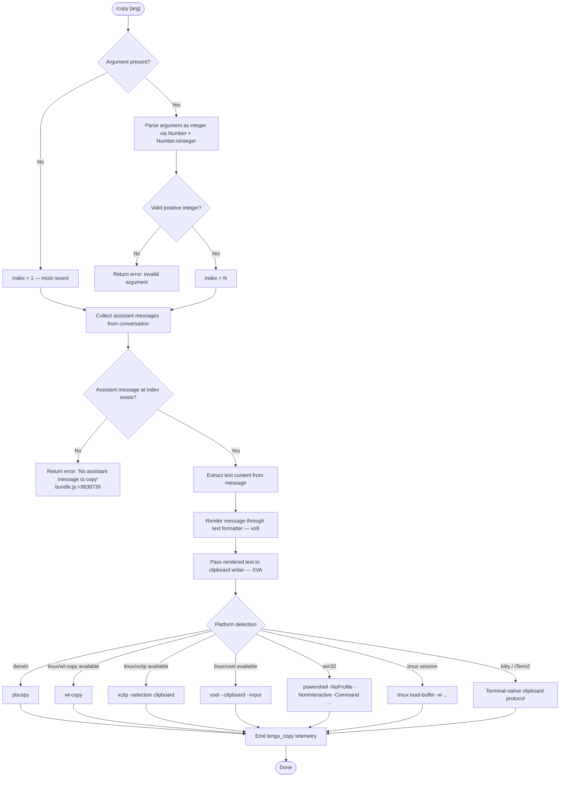

# `/copy`

> Analysis basis: CC v2.1.132 bundle.js (AST extraction + Claude interpretation)
> Minimum version: v2.1.132

---

## Overview

The `/copy` command copies the text of Claude's most recent assistant response to the system clipboard. An optional integer argument `N` selects the Nth-latest assistant message instead of the most recent one. The command is implemented as an async function (`qH7`) resolved via the `yo9` module and invokes a platform-aware clipboard utility to write the extracted text.

---

## Registration

| Field | Value |
|---|---|
| type | `local-jsx` |
| name | `copy` |
| description | `Copy Claude's last response to clipboard (or /copy N for the Nth-latest)` |
| module_id | `yo9` |
| load_inline | `true` |
| handler (Arbor) | `qH7` (AsyncFunction, resolved via `module_id`) |
| `loc_byte_end` | `9839699` |
| `arbor_handler.name` | `qH7` |
| `arbor_handler.kind` | `AsyncFunction` |
| `arbor_handler.resolution_path` | `module_id` |
| `arbor_handler.fqn` | `claude-2.1.132::qH7` |
| `arbor_handler.n_hits` | `0` |

Analysis basis: CC v2.1.132 bundle.js:+9839513–+9839699

---

## Input Branching

The handler parses the raw argument string, validates it, locates the target assistant message, and dispatches to the clipboard writer.



Analysis basis: CC v2.1.132 bundle.js:+9838698–+9839499

---

## Behavioral Spec

### 1. Argument Parsing

The handler receives the raw argument string and determines which assistant message to target.

```
async function copyCommandHandler(rawArg, conversationContext):
    trimmedArg = rawArg.trim()

    if trimmedArg is empty:
        targetIndex = 1                       # most recent assistant message
    else:
        parsed = Number(trimmedArg)
        if not Number.isInteger(parsed) or parsed < 1:
            displayError("invalid argument")
            return
        targetIndex = parsed                  # Nth-latest (1 = most recent)
```

Analysis basis: CC v2.1.132 bundle.js:+9838808, +9838822

---

### 2. Assistant Message Selection

The handler scans the conversation message list, filters for assistant-role entries, and picks the one at `targetIndex` counting from the end.

```
function selectAssistantMessage(messages, targetIndex):
    # messages is the full conversation array
    assistantMessages = messages.filter(m => m.role == "assistant")
    # reverse-index: index 1 = last, index 2 = second-to-last, ...
    candidate = assistantMessages[ assistantMessages.length - targetIndex ]

    if candidate is undefined:
        return Error("No assistant message to copy")   # literal: bundle.js:+9838739

    return candidate
```

Analysis basis: CC v2.1.132 bundle.js:+9838737, +9838739, +9839003

---

### 3. Text Extraction and Formatting

The selected message is passed through the text-content extractor (`vo9`) and then through the message-level formatter (`Vo9`) before the result is handed to the clipboard layer.

```
function extractText(assistantMessage):
    # vo9: filters content blocks by type == "text" (literal: bundle.js:+9705707)
    #      and collects their text values into an array
    textBlocks = filterTextBlocks(assistantMessage.content)  # vo9 / vL path
    textArray  = textBlocks.map(block => block.text)
    return textArray.join("")

function formatForClipboard(rawText):
    # Vo9: runs the markdown/table lexer (Gf.lexer) then normalises whitespace
    # Produces a "plaintext" representation (literal: bundle.js:+9834851)
    lexed    = lexer(rawText)
    rendered = renderPlaintext(lexed)   # Io9 pipeline
    return rendered
```

Analysis basis: CC v2.1.132 bundle.js:+9834716, +9834748, +9834297, +9834851

---

### 4. Platform-Aware Clipboard Writer (`XVA` → `bE`)

After text is prepared, `XVA` selects the appropriate system clipboard mechanism and spawns the relevant process.

```
function writeToClipboard(text):
    platform = process.platform

    if platform == "darwin":
        spawnAndWrite(["pbcopy"], text)                          # +3182437

    elif platform == "linux":
        if commandExists("wl-copy"):
            spawnAndWrite(["wl-copy"], text)                     # +3182502
        elif commandExists("xclip"):
            spawnAndWrite(["xclip", "-selection", "clipboard"], text)  # +3182548
        elif commandExists("xsel"):
            spawnAndWrite(["xsel", "--clipboard", "--input"], text)    # +3182614

    elif platform == "win32":
        spawnAndWrite(
            ["powershell", "-NoProfile", "-NonInteractive", "-Command", ...],
            text
        )                                                        # +3182926

    # Terminal multiplexer / emulator overrides (checked independently):
    if insideTmux():
        runTmux(["load-buffer", "-w", ...], text)               # +3182036

    if terminalIsKitty() or terminalIsITerm2():
        useTerminalClipboardProtocol(text)                       # +3182026, +3181536
```

Analysis basis: CC v2.1.132 bundle.js:+9839206, +3182228, +3182282, +3182298, +3182312

---

### 5. Temporary File Handling (`ko9` / `xP`)

The clipboard write path for some platforms (notably the Kitty/iTerm2 image protocol and possibly large payloads) stages content through a temporary file in the configured temp directory.

```
function writeTempAndCopy(content):
    tmpDir = getTmpDir()                         # defaults to /tmp (+3745811)
                                                 # overridable via CLAUDE_CODE_TMPDIR
    ensureDir(tmpDir)                            # xP: mkdirSync + chmod 448 (+3746492)
    validateDirSafety(tmpDir)                    # KSK: lstatSync + isDirectory check
    filePath = path.join(tmpDir, generatedName)  # ko9: To9.join (+9834927)
    fs.mkdir(filePath, ...)                      # +9834954
    fs.writeFile(filePath, content)              # +9834997
```

Analysis basis: CC v2.1.132 bundle.js:+9835062, +9835103, +9835142, +3746457, +3746492

---

### 6. Telemetry Emission

Upon successful completion the handler fires a single telemetry event.

```
function emitTelemetry(result):
    emit("tengu_copy", { ... })    # bundle.js:+9839117
```

Analysis basis: CC v2.1.132 bundle.js:+9839117

---

## State & Side Effects

| Item | Detail |
|---|---|
| Telemetry | `tengu_copy` (emitted on handler completion, bundle.js:+9839117) |
| Clipboard write | Spawns a platform-specific subprocess (`pbcopy` / `wl-copy` / `xclip` / `xsel` / `powershell` / tmux / terminal protocol) to place text in the system clipboard |
| Temporary files | May create a short-lived file under `CLAUDE_CODE_TMPDIR` (default `/tmp`) for staging content; cleaned up after write |
| appState changes | None detected in depth-2 traversal |
| Hook registration | None detected in depth-2 traversal |
| Sound | None detected in depth-2 traversal |
| Error display | Renders an inline error if no assistant message exists or the argument is invalid |

---

## Version History

| Version | Change |
|---|---|
| v2.1.132 | Initial analysis |

---

## Common Mistakes

1. **Passing a non-integer argument** — `/copy 1.5` or `/copy last` will fail argument validation because `Number.isInteger` is used. Only positive whole numbers are accepted.
2. **Index out of range** — `/copy 5` when the conversation contains fewer than five assistant messages produces the "No assistant message to copy" error. The index is 1-based and counts backward from the most recent message.
3. **Clipboard tool not installed on Linux** — the command tries `wl-copy`, `xclip`, and `xsel` in order. If none is present in `PATH`, the copy silently fails or errors. Install at least one of these tools.
4. **Running in a headless/SSH environment without a clipboard** — on remote machines without a display server or tmux, none of the clipboard backends will have a target to write to. Use `tmux` to give the command a buffer target.
5. **`CLAUDE_CODE_TMPDIR` pointing to a non-directory path** — the safety check (`KSK`) will throw if the path exists but is not a directory. Set `CLAUDE_CODE_TMPDIR` to a directory you control.

---

## Appendix — Identifier Mapping

> For bundle debugging only. Identifiers change across versions.

| Identifier | Role |
|---|---|
| `qH7` | Main async handler for `/copy` (Arbor-resolved entry point) |
| `vo9` | Text-block filter — extracts `type=="text"` content blocks from a message |
| `vL` | Inner filter helper used by the text-block extractor |
| `Vo9` | Message-level text formatter — runs lexer and produces plaintext output |
| `Io9` | Plaintext render pipeline (table/column layout, padding) |
| `te4` | Column-map helper used inside the render pipeline |
| `No9` | String replacement helper used in the plaintext formatter |
| `se4` | Lexer token accumulator — collects tokens for the formatter |
| `IOH` | Token string replacement helper used inside token accumulation |
| `Gf` | Markdown/table lexer wrapper (`Gf.lexer`) |
| `XVA` | Clipboard-write dispatcher — selects platform backend and invokes it |
| `bE` | Core clipboard write implementation |
| `EX` | Text-join helper used within the clipboard writer |
| `zWK` | Darwin (`pbcopy`) clipboard backend |
| `$WK` | tmux `load-buffer` clipboard backend |
| `MWK` | Linux `wl-copy`/`xclip`/`xsel` clipboard backend (uses `replaceAll`) |
| `Y8` | Subprocess spawn helper used by clipboard backends |
| `ko9` | Temporary-file writer — joins path and calls `mkdir` + `writeFile` |
| `xP` | Temp-directory initialiser — `mkdirSync` + permission/safety setup |
| `KSK` | Temp-directory safety validator — `lstatSync` + `isDirectory` check |
| `R6` | Config/session read helper reached from the handler |
| `k5H` | File-system config reader used in the config layer |
| `Msq` | Logger / append-file helper (writes debug output) |
| `GNH` | Batched log flusher (uses `setTimeout` / `setImmediate`) |
| `G7H` | String trimming / padding utility (uses `A.trim`) |
| `z8` | String-width calculator (`Bun.stringWidth`) |
| `n4` | Index-of utility helper |
| `nd` | Path normalisation helper used by the temp-dir initialiser |