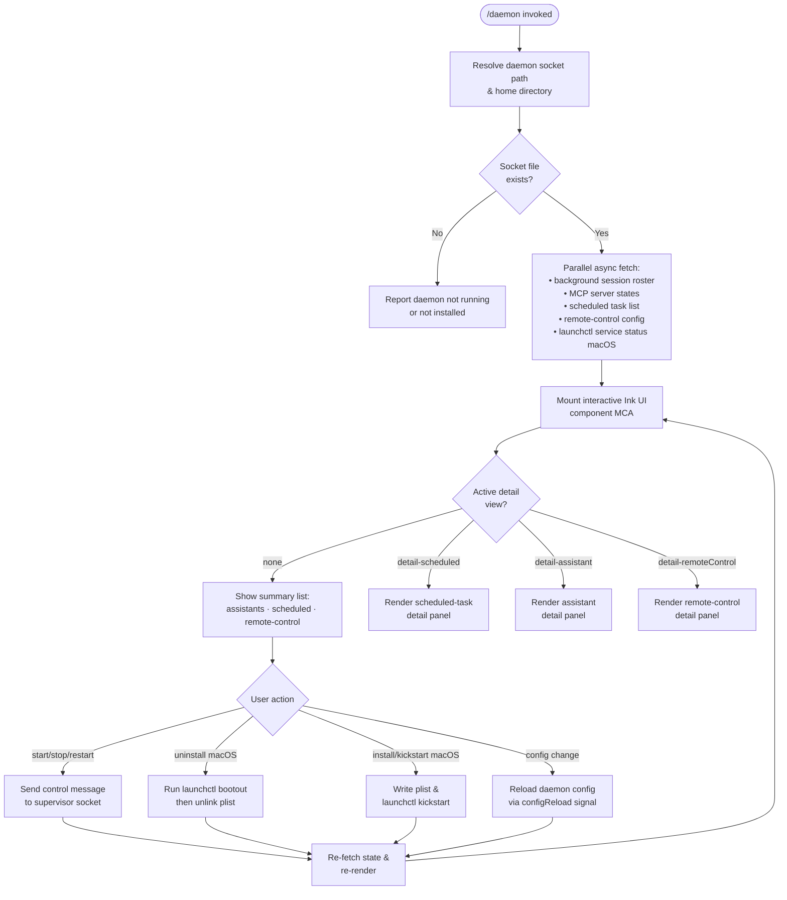

# `/daemon`

> Analysis basis: CC v2.1.132 bundle.js (AST extraction + Claude interpretation)
> Minimum version: v2.1.132

---

## Overview

The `/daemon` command is the primary management interface for Claude Code's background service layer. It allows users to inspect, start, stop, restart, and configure background services including assistant sessions, scheduled tasks, and remote-control listeners. The command renders an interactive terminal UI (via an Ink/React component tree) and communicates with the daemon supervisor process over a Unix socket protocol, applying configuration reloads and MCP server state updates in real time.

---

## Registration

| Field | Value |
|---|---|
| type | `local-jsx` |
| name | `daemon` |
| description | `Manage background services: assistants, scheduled tasks, and remote control` |
| immediate | `true` |
| module_id | `$CA` |

Analysis basis: CC v2.1.132 bundle.js:+11600293

---

## Input Branching

The command entry point resolves several parallel async data sources, then delegates rendering to a stateful React component. User interaction within the rendered UI drives sub-view selection among three detail panels.



Analysis basis: CC v2.1.132 bundle.js:+11599250, +11599582, +11599588, +11589068, +11589279, +11589891, +11590049, +11590170

---

## Behavioral Spec

### Command Entry Point

```
async function daemonCommandEntry(args, appState):
    results = await Promise.all([
        resolveServiceStatus(),      // launchctl print (macOS)
        fetchBackgroundRoster(),     // background session list
        listScheduledTasks(),        // scheduled task list
        fetchMcpServerStates(),      // MCP connection states
        resolveRemoteControlConfig() // remote-control settings
    ])
    uiInstance = renderInkComponent(DaemonUI, {
        initialData: results,
        appState:    appState
    })
    await uiInstance.waitForUnmount()
```

Analysis basis: CC v2.1.132 bundle.js:+11599250, +11599263, +11599293, +11599333, +11599404, +11599471, +11599545, +11599582, +11599588, +11599617, +11599634, +11599667, +11599817, +11599869, +11599881

---

### Background Session Roster Fetch

```
async function fetchBackgroundRoster():
    rosterData = await Promise.all([
        readRosterIndex(),     // enumerate known session IDs
        fetchSessionDetails(), // per-session status objects
        buildSessionMap()      // keyed map of session entries
    ])
    return rosterData
```

Internally, `readRosterIndex` reads session entries and maps each to a base name via `path.basename`. Session map keys use the `"same-dir"` path strategy literal.

Analysis basis: CC v2.1.132 bundle.js:+11588589, +11588619, +11588632, +11583381, +11583394, +11576949, +11577018, +11577037, +11577073, +11577116

---

### macOS Service Status Check (`launchctl print`)

```
function checkMacOsServiceStatus():
    result = spawnSync("launchctl", ["print", <service-target>])
    return parseLaunchctlOutput(result.stdout)
```

The literals `"launchctl"` and `"print"` are used as the command and subcommand respectively.

Analysis basis: CC v2.1.132 bundle.js:+10275206, +10275219

---

### Daemon Socket Path Resolution

```
function resolveDaemonSocketPath():
    home = os.homedir()
    socketDir = path.join(home, "Library", "LaunchAgents")  // macOS path
    // Falls back to XDG / tmpdir on non-darwin
    return buildSocketPath(socketDir, "code", "assistant")
```

Directory segment constants `"Library"` and `"LaunchAgents"` are used on macOS. Sub-path segments `"code"` and `"assistant"` distinguish Claude Code's daemon socket from other sockets.

Analysis basis: CC v2.1.132 bundle.js:+11573193, +11573201, +11573223, +11573232, +11573246, +11573253, +11573276, +10271996, +10272006

---

### Background Process Kill / Escalation

```
async function killBackgroundProcess(pid, signal):
    process.kill(pid, signal)   // initial signal (SIGTERM or SIGKILL)
    if signal == "SIGTERM":
        await sleep(100ms)      // grace period (100 ms)
        if processStillAlive(pid):
            process.kill(pid, "SIGKILL")
            emit telemetry("tengu_bg_dispatch_sigkill_escalate")
```

Grace period before escalation: 100 ms (literal value `100`).
SIGTERM → SIGKILL escalation timeout: 100 ms.

Analysis basis: CC v2.1.132 bundle.js:+14130013, +14130020, +14130044, +10271217, +11390369, +11480269

---

### Supervisor Socket Protocol Handler

The daemon UI communicates with the supervisor over a Unix socket using a length-framed JSON protocol. The handler buffers incoming `Buffer` chunks, locates newline delimiters, and dispatches message objects by their `type` field.

```
function handleSocketData(rawChunk, receiveBuffer):
    receiveBuffer = Buffer.concat([receiveBuffer, rawChunk])
    while delimiterIndex = receiveBuffer.indexOf('\n') >= 0:
        frame    = receiveBuffer.subarray(0, delimiterIndex)
        receiveBuffer = receiveBuffer.subarray(delimiterIndex + 1)
        message  = parseJsonFrame(frame)   // raises EUNKNOWN on bad json
        dispatch(message)
    if receiveBuffer.length > MAX_FRAME_SIZE:
        raise error("ETOOLARGE")
```

Maximum frame size before `ETOOLARGE` error: 65536 bytes.
Maximum reconnect attempts before giving up: 20.

Analysis basis: CC v2.1.132 bundle.js:+14116901, +14116928, +14116972, +14116999, +14117041, +14117116, +14117138, +14117189, +14118609, +14118625, +14124956

---

### Supervisor Message Dispatch

The protocol supports the following message types (derived from string literals):

| Message Type | Direction | Purpose |
|---|---|---|
| `ping` | Client → Daemon | Keepalive / health check |
| `nudge` | Client → Daemon | Prompt daemon to re-evaluate queue |
| `yield` | Client → Daemon | Release scheduling lease |
| `lease` / `leases` | Bidirectional | Scheduling lease grant/query |
| `shutdown` | Client → Daemon | Graceful daemon shutdown |
| `list` | Client → Daemon | Enumerate active background jobs |
| `has` | Client → Daemon | Test whether a job ID exists |
| `dispatch` | Client → Daemon | Submit a new background task |
| `reply` | Client → Daemon | Forward user reply to a waiting job |
| `resize` | Client → Daemon | Notify PTY size change |
| `attach` | Client → Daemon | Attach terminal to a background session |
| `respawn` | Client → Daemon | Request job respawn |
| `resume` | Client → Daemon | Resume a suspended session |
| `snapshot` | Daemon → Client | Full terminal state snapshot |
| `settled` | Daemon → Client | Session reached settled state |
| `stream` | Daemon → Client | Incremental terminal output |
| `state` | Daemon → Client | Session lifecycle state update |
| `subscribe` | Client → Daemon | Subscribe to session events |
| `ensure-spare` | Client → Daemon | Ensure a spare session is pre-warmed |
| `permission-response` | Client → Daemon | Respond to daemon permission prompt |
| `await-ack` | Daemon → Client | Daemon waiting for acknowledgement |
| `heartbeat` | Daemon → Client | Periodic liveness signal |

Analysis basis: CC v2.1.132 bundle.js:+14118743, +14119168, +14119236, +14119296, +14119374, +14119435, +14120592, +14120751, +14121001, +14121386, +14122013, +14122892, +14122917, +14123129, +14125935, +14126025, +14126122, +14126178, +14125779, +14125686, +14125751, +14120834, +14141709

---

### Background Session Lifecycle States

Sessions can be in the following states (string literals found in implementation):

| State | Meaning |
|---|---|
| `starting` | Session is initializing; not yet interactive |
| `adopted` | Supervisor has adopted an existing session |
| `active` | Session is actively running |
| `working` | Session is processing a task |
| `idle` | Session is running but awaiting work |
| `blocked` | Session is blocked on a permission prompt |
| `crashed` | Session terminated unexpectedly |
| `killed` | Session was explicitly killed |
| `stopped` | Session exited cleanly |
| `done` | Task completed successfully |
| `resuming` | Session is resuming from suspension |

Analysis basis: CC v2.1.132 bundle.js:+14123668, +14123700, +14134091, +14134065, +14134625, +14133991, +14134005, +14133889, +14133898, +14133871, +14135265

---

### Spare Session Pool Management

The daemon pre-warms spare background sessions to reduce cold-start latency.

```
async function manageSparePool(config):
    emit telemetry("tengu_bg_spare_enable")
    
    while true:
        spare = await claimSpareSession()
        if spare.success:
            emit telemetry("tengu_bg_spare_claim")
        else:
            errorCode = spare.error.code
            if errorCode in ["enoent", "ECONNREFUSED", "econnrefused"]:
                emit telemetry("tengu_bg_spare_claim_fail")
                break
            else:
                emit telemetry("tengu_bg_spare_claim_fail")
        
        spawnNewSpare()
        emit telemetry("tengu_bg_spare_spawn")
```

Spawn-to-claim retry uses `bm.spawn` (supervisor spawn) and `bm.claim` (supervisor claim).

Analysis basis: CC v2.1.132 bundle.js:+14130767, +14130821, +14130850, +14130867, +14130880, +14130886, +14131067, +14131080, +14131095, +14131137, +14131149, +14131208

---

### Session Attach with Stall Detection

```
async function attachSession(sessionId, terminal):
    emit telemetry("tengu_bg_attach")
    
    stallCount = 0
    MAX_STALLS = 6
    STALL_CHECK_INTERVAL_MS = 500
    
    while not settled:
        await waitForSettled(STALL_CHECK_INTERVAL_MS)
        if isStalled():
            stallCount += 1
            if stallCount >= MAX_STALLS:
                emit telemetry("tengu_bg_attach_stall_gave_up")
                displayMessage("Session keeps stalling at startup.")
                break
            else:
                emit telemetry("tengu_bg_attach_stall_respawn")
                displayMessage("Session not responding — restarting it…")
                respawnSession(sessionId)
    
    if sessionState == "ERESPAWNING":
        // Legacy PTY respawn path
        emit telemetry("tengu_bg_attach_legacy_autorespawn")
```

Maximum stall retries before giving up: 6 (literal value `6`).
Stall check interval: 500 ms (literal value `500`).

Analysis basis: CC v2.1.132 bundle.js:+14123228, +14124062, +14124331, +14123343, +14123421, +14124107, +14124285, +14124376, +14122818, +14122525, +14122488

---

### macOS LaunchAgent Install / Uninstall

```
function installDaemonMacOs(plistPath):
    writePlistFile(plistPath)
    spawnSync("launchctl", ["kickstart", <service-label>])

function uninstallDaemonMacOs(plistPath):
    spawnSync("launchctl", ["bootout", <service-label>])
    fs.unlink(plistPath)
    // Note: "service uninstall not available on darwin" path exists
    //       for non-launchctl fallback (raises an informational error)

function restartDaemonMacOs():
    sendStop()
    waitForExit(timeoutMs=10000, pollIntervalMs=200, maxPolls=50)
    if not exitedWithin10s:
        raise Error("daemon did not exit within 10s of SIGTERM; restart aborted before kickstart")
    spawnSync("launchctl", ["kickstart", <service-label>])
```

SIGTERM wait budget before restart abort: 10 000 ms (10 s).
Poll interval during wait: 200 ms; maximum poll count: 50.

Analysis basis: CC v2.1.132 bundle.js:+10273767, +10273807, +10273898, +10274118, +10274129, +10274154, +10274194, +10274283, +10274422, +10274451, +10274777

---

### MCP Server State Machine (Background Reconnect)

```
async function syncMcpServers(configuredServers, currentConnections):
    entries = Object.entries(configuredServers)
    for each [name, serverConfig] in entries:
        if serverConfig.status == "disabled":
            continue
        
        transport = serverConfig.transport  // "stdio" | "sse" | "http" | "sse-ide" | "ws-ide"
        
        if transport == "claudeai-proxy":
            // Special handling for Claude.ai proxy transport
            if cachedStatus == "needs-auth":
                log("Skipping connection (cached needs-auth)")
                continue
        
        if currentStatus == "connected":
            applyMcpUpdate(name, serverConfig)
        else if currentStatus == "failed":
            scheduleRetry(name, serverConfig)
        
    await Promise.all(connectionPromises)
    
    if allRemoteServersRecovered:
        log("[MCP] Retry: all remote servers recovered, stopping")
        emit telemetry("tengu_mcp_retry_failed_remote")
```

Recognized transport type literals: `"stdio"`, `"sse"`, `"http"`, `"sse-ide"`, `"ws-ide"`, `"claudeai-proxy"`.

Analysis basis: CC v2.1.132 bundle.js:+9461875, +9461900, +9461938, +9461947, +9461973, +9462075, +9462109, +9462141, +9462174, +9462210, +9462482, +9462541, +9462586, +9462597, +9462602, +9462668, +9462770, +9463337, +13846663, +13846850

---

### Daemon Configuration Reload

```
async function reloadDaemonConfig(configSnapshot, activeSchedulers):
    // Read config file from disk
    rawConfig = await fs.readFile(configPath, "utf8")
    parsed    = parseConfigJson(rawConfig)
    
    // Diff active schedulers against new config
    for each schedulerId in Object.keys(activeSchedulers):
        scheduler = activeSchedulers[schedulerId]
        newEntry  = parsed[schedulerId]
        if newEntry differs from scheduler.currentConfig:
            scheduler.stop()
            scheduler.updateConfig(newEntry)
            scheduler.start()
        // Track via Map: f.set / f.delete / f.get
    
    // Start any new schedulers not previously active
    for each newId in newEntries:
        newScheduler = createScheduler(newId, parsed[newId])
        newScheduler.start()
    
    emit telemetry("tengu_daemon_config_reload")
```

Analysis basis: CC v2.1.132 bundle.js:+14142462, +14142479, +14142681, +14142735, +14142755, +14142764, +14142875, +14142884, +14142902, +14143004, +14143049, +14143060, +14143278, +14143280, +11571580, +11571615, +11571652, +11571717, +11571732, +11571810, +11571924, +11572010

---

### Daemon Stop / Stop-Failed Control Flow

```
async function stopDaemon(sessionId):
    try:
        sendShutdownMessage(sessionId)
        waitForProcessExit()
        emit telemetry("tengu_daemon_control")  // via SH path → "daemon_stop"
    catch error:
        emit telemetry("tengu_daemon_control")  // via mH path → "daemon_stop_failed"
```

The `"daemon_stop"` and `"daemon_stop_failed"` string literals annotate the two outcome branches of the stop control path.

Analysis basis: CC v2.1.132 bundle.js:+14163920, +14163925, +14163970, +14163973, +14163993, +14164010, +14164045, +14164048, +14164099

---

### Background Session Create Telemetry

When a new background session is successfully created the event `"daemon_bg_session_create"` is emitted, and when the duplicate-session retry limit is exhausted the event `"dup_retry_exhausted"` is emitted.

Analysis basis: CC v2.1.132 bundle.js:+14130282, +14130309

---

### Scheduled Task UI Panel

The detail view keyed `"detail-scheduled"` renders the state of scheduled background tasks. The panel label is `"Scheduled"`. The daemon recognises the sub-service type `"scheduled"` (as distinct from `"hub"`) when classifying background sessions for display.

Analysis basis: CC v2.1.132 bundle.js:+11589352, +11589378, +11589891, +11590818

---

### Remote Control UI Panel

The detail view keyed `"detail-remoteControl"` renders the remote-control service status under the label `"Remote Control"`. The `"remoteControlAtStartup"` configuration key gates whether remote-control is activated on daemon start. The daemon itself is presented to users as `"Claude Daemon"`.

Analysis basis: CC v2.1.132 bundle.js:+11590170, +11590467, +11591139, +11591424, +12579502

---

### Assistant Detail UI Panel

The detail view keyed `"detail-assistant"` renders the list of active assistant background sessions. New sessions created from this panel use the `"new"` action literal.

Analysis basis: CC v2.1.132 bundle.js:+11590049, +11589989

---

### Focus / Blur Idle Timer

The UI component tracks window focus state to manage an idle timer that blurs background task activity after inactivity.

```
function updateIdleTimer(focusState, lastActivityTime):
    now      = Date.now()
    elapsed  = now - lastActivityTime
    maxIdle  = 3600000   // 1 hour in milliseconds
    factor   = 0.8       // fraction of maxIdle before blur warning

    if focusState == "blurred":
        idleRatio = Math.min(elapsed / maxIdle, 1.0)
        if idleRatio >= factor:
            transitionTo("focused")   // force a re-focus event

    return { state: focusState == "blurred" ? "blurred" : "focused" }
```

Maximum idle window: 3 600 000 ms (1 hour).
Blur-warning threshold: 0.8 × maximum idle window.

Analysis basis: CC v2.1.132 bundle.js:+12950563, +12950575, +12950636, +12950671, +12950692, +12950709, +12950725

---

### Ink UI Polling Interval

The React component (`MCA`) sets up a polling `setInterval` to refresh daemon state at a fixed cadence.

Polling interval: 1000 ms (1 second).

Analysis basis: CC v2.1.132 bundle.js:+11589532, +11589584

---

### Roster Parse Failure Handling

If the background session roster file cannot be parsed (malformed JSON or unexpected schema), the error is logged and the telemetry event `tengu_bg_roster_parse_failed` is emitted. The roster entry is skipped rather than crashing the command.

Analysis basis: CC v2.1.132 bundle.js:+10280864, +10280873, +10280886, +10280913, +10280926, +10280946, +10280952, +10281020, +10281043, +10281087, +10281154, +10281184, +10281368, +10281384, +10280954

---

### Feature Flag Validation

The daemon component evaluates feature flags before activating optional sub-services. Success is reported via `tengu_feature_ok`; an invalid or unsupported feature flag emits `tengu_feature_bad`.

Analysis basis: CC v2.1.132 bundle.js:+906461, +906459, +906515, +906517

---

### Skill / Policy Config Broadcast

When daemon configuration includes a `"ConfigChange"` event (e.g. policy settings update), the daemon broadcasts the change with a `"policy_settings"` payload. Skills are refreshed under the `"skills"` key.

Analysis basis: CC v2.1.132 bundle.js:+11901113, +11901140, +11901185, +11901235, +11901260

---

## State & Side Effects

| Item | Detail |
|---|---|
| Telemetry — attach | `tengu_bg_attach` on every session attach attempt |
| Telemetry — attach stall gave up | `tengu_bg_attach_stall_gave_up` after 6 consecutive stall cycles |
| Telemetry — attach stall respawn | `tengu_bg_attach_stall_respawn` on each intermediate stall respawn |
| Telemetry — legacy auto-respawn | `tengu_bg_attach_legacy_autorespawn` on ERESPAWNING legacy path |
| Telemetry — SIGKILL escalation | `tengu_bg_dispatch_sigkill_escalate` when SIGTERM is escalated to SIGKILL |
| Telemetry — dispatch stale drop | `tengu_bg_dispatch_stale_drop` when a stale dispatch is discarded |
| Telemetry — spare enable | `tengu_bg_spare_enable` when spare pool is activated |
| Telemetry — spare claim | `tengu_bg_spare_claim` on successful spare claim |
| Telemetry — spare spawn | `tengu_bg_spare_spawn` on new spare session spawn |
| Telemetry — spare claim fail | `tengu_bg_spare_claim_fail` on failed spare claim |
| Telemetry — sendclaim failed | `tengu_bg_sendclaim_failed` when sending a claim message to supervisor fails |
| Telemetry — proto mismatch | `tengu_bg_proto_mismatch` on supervisor protocol version mismatch |
| Telemetry — roster parse failed | `tengu_bg_roster_parse_failed` when roster file is malformed |
| Telemetry — MCP retry failed remote | `tengu_mcp_retry_failed_remote` when all remote MCP servers recover |
| Telemetry — feature ok | `tengu_feature_ok` on successful feature flag activation |
| Telemetry — feature bad | `tengu_feature_bad` on invalid feature flag |
| Telemetry — daemon control | `tengu_daemon_control` on daemon stop (success and failure) |
| Telemetry — config reload | `tengu_daemon_config_reload` after each config reload cycle |
| Telemetry — bg session create | `daemon_bg_session_create` (string literal) on new session creation |
| Telemetry — dup retry exhausted | `dup_retry_exhausted` (string literal) when session duplicate retry limit is hit |
| Socket lifecycle | Unix domain socket connection opened to supervisor; listeners registered via `f.on` / `f.once`; connection torn down on unmount via `_.cleanup` |
| Ink UI mount / unmount | `M.render` mounts the Ink component tree; `M.unmount` is called on command exit |
| Scheduler state | Active schedulers tracked in a Map; `start` / `stop` / `updateConfig` lifecycle managed on config reload |
| MCP connections | `H.applyMcpUpdate` mutates live MCP server connection objects; failed servers schedule retries |
| File system | Roster index read; launchd plist written/deleted on macOS install/uninstall; PID files read via `gz8.readFile` / `HYq.readFile`; socket file unlinked via `WY.unlink` on session teardown |
| `appState` changes | `remoteControlAtStartup` config key read and conditionally applied at startup |
| Process signals | `process.kill` used for SIGTERM and SIGKILL on background PIDs; `process.exit` used in uncaught-spare error path (`spare_uncaught`) |
| Polling | `setInterval` at 1 000 ms for UI state refresh; `clearInterval` on component unmount |
| Sound | <!-- TODO: not found in depth-2 traversal; needs --depth 4 --> |

---

## Version History

| Version | Change |
|---|---|
| v2.1.132 | Initial analysis |

---

## Common Mistakes

1. **Invoking `/daemon` when the daemon is not running**: The command will attempt to read the supervisor socket and report the daemon as unavailable. Start the daemon first via the install/start flow before expecting interactive management features.

2. **Expecting `/daemon` to block indefinitely**: Because the registration marks `immediate: true`, the command launches the Ink UI immediately without waiting for a user confirmation prompt. Pressing the appropriate detach key (Ctrl+Z) exits the UI without stopping the daemon.

3. **Assuming macOS-only management works on Linux**: The `launchctl` / `bootout` / `kickstart` paths are gated on `platform == "darwin"`. On Linux, the service install/uninstall sub-commands are unavailable and the command surfaces an informational error (`"service uninstall not available on darwin"` is the macOS variant; the Linux variant is analogous).

4. **Expecting instant restart after SIGTERM**: The restart flow polls for process exit up to 50 times at 200 ms intervals (10 s total). If the daemon process does not exit within this window, the restart is aborted and an error is displayed rather than issuing `launchctl kickstart`.

5. **Confusing session states**: The `"idle"` state means the session is alive and waiting for work, not that it has stopped. Only `"stopped"`, `"killed"`, and `"crashed"` indicate a terminated session.

6. **Modifying config files externally while `/daemon` is open**: The daemon config reload is triggered by a signal/message, not by inotify. External file changes will not be reflected in the UI until the reload is explicitly triggered or the daemon is restarted.

---

## Appendix — Identifier Mapping

> For bundle debugging only. Identifiers change across versions.

| Identifier | Role |
|---|---|
| `wX7` | Command entry point function |
| `fCA` | Parallel state fetch coordinator |
| `azH` | Async roster initializer |
| `wwq` | Background session list fetcher |
| `Kwq` | Session detail mapper (uses `path.basename`, `"same-dir"`) |
| `w2` | Background process kill helper (calls `process.kill`) |
| `Uzq` | PID file reader for one service type (uses `gz8.readFile`, `"utf8"`) |
| `LYq` | PID file reader for second service type (uses `HYq.readFile`) |
| `Pm` | Roster entry parser (raises `Error`, applies regex via `l9H.test`) |
| `eF` | launchctl service status checker (uses `"launchctl"`, `"print"`) |
| `LCA` | Daemon socket path resolver (uses `os.homedir`, `path.join`, `"code"`, `"assistant"`) |
| `_A` | App state accessor |
| `_N6` | Config directory resolver |
| `D8` | Logger / debug output helper |
| `fH` | Error emission / log-error helper (calls `EQ.logError`) |
| `L` | Column pad/format helper (uses `f.padEnd`, `"  "`) |
| `K` | Process exit wrapper (calls `process.exit`) |
| `f` | PTY / socket stream object (has `.close`, `.toLowerCase`) |
| `H` | Jitter / random delay helper (uses `Math.random`, `setTimeout`, literal `2`) |
| `A` | Shared data array / arg object |
| `M` | Ink renderer instance (has `.render`, `.unmount`, `.values`, `.get`) |
| `UZH` | MCP server state machine / connection handler |
| `ZBq` | MCP update applier (calls `H.applyMcpUpdate`, `_.cleanup`) |
| `k` | Input string normalizer (trims, uppercases, checks includes) |
| `$` | Session map / helper (has `.dispose`) |
| `j6` | Deduplication tracker (uses `V5H.has`, `kq6.add`, `mU.get`) |
| `$F7` | MCP retry coordinator (iterates entries, calls `A.getClients`) |
| `Ewq` | Model/alias resolver (interprets `"opusplan"`, `"opus"`, `"claude-opus-4-6"`) |
| `PlH` | Model string parser (handles `"anthropic."`, `"Custom model"`) |
| `KX7` | Top-level async initializer (wraps `fCA`, `LCA`, `Ewq`) |
| `MCA` | Root Ink React component for the daemon UI |
| `Z` | Interval / timer reference |
| `v` | Idle/focus timer calculator (uses `Math.min`, `3600000`, `0.8`) |
| `BU` | Focus-state reader |
| `I` | Scheduler instance (has `.stop`, `.updateConfig`, `.start`) |
| `HRq` | Away-summary producer |
| `w` | Session worker manager (kill, spawn, attach, set/get state) |
| `_` | Session registry Map (has `.get`, `.set`, `.delete`, `.cleanup`, `.toLowerCase`) |
| `d` | Logger / output sink |
| `y` | Image paste handler (uses `"image/png"`, `"Pasted image"`) |
| `mH` | Daemon stop-failed telemetry emitter |
| `SH` | Daemon stop-success telemetry emitter |
| `LFA` | Supervisor claim sender (uses `bm.claim`, `sX8.connect`, `"warn"`, `"SIGTERM"`) |
| `OFA` | Session lifecycle state updater (manages `"done"`, `"killed"`, `"working"`, `"active"`, `"daemon"`, `"idle"`, `"windows"`) |
| `Y` | Session dispose / cleanup function |
| `j8` | JSON serializer |
| `R` | Supervisor socket writer (has `.write`; uses `"mtime changed"`, `"supervisor"`) |
| `j` | Session spawn wrapper (calls `w`) |
| `NlH` | macOS launchctl uninstall helper (calls `"bootout"`, `ze.unlink`) |
| `uvA` | macOS LaunchAgents path builder (`"Library"`, `"LaunchAgents"`) |
| `Y8` | Plist writer helper |
| `z38` | Plist template renderer |
| `vH` | String coercion / type-check utility |
| `gJ6` | macOS daemon start/restart helper (uses `"kickstart"`, `"start"`, `"stop"`, `"restart"`) |
| `mvA` | Daemon restart orchestrator (polls exit, enforces 10 s timeout) |
| `X` | Socket data framer / buffer accumulator |
| `$f` | Socket end / error handler |
| `uQ7` | Supervisor protocol message dispatcher (handles all message types) |
| `O` | Background-session Ink sub-component |
| `Q8` | Background session label (`"background session"`) |
| `q` | Cleanup / unlink helper (calls `tgq.unlinkSync`) |
| `G` | MCP state display renderer |
| `Qw6` | MCP status formatter |
| `gX8` | Connection display helper |
| `P` | MCP connection detail panel (handles `"Connection failed"`) |
| `HA` | Error wrapper (`Error`, `String`) |
| `W` | Event-broadcast / dirty-queue manager (uses `setTimeout`, `clearTimeout`) |
| `z` | Session set (has `.add`, `.clear`; backed by `SH`, `mH`, `Jx`, `pC`) |
| `BfH` | ConfigChange broadcaster (uses `"ConfigChange"`, `"policy_settings"`) |
| `uuH` | Skill-needs-update checker (`H.some`) |
| `s58` | Skill registry reference |
| `nt` | Notification sub-system initializer |
| `PcH` | Cache-clear helper (`PEA.clear`) |
| `D` | Config reload handler (diffs scheduler map, calls `I.stop/start/updateConfig`) |
| `lDH` | Config file reader and parser (uses `eYq.readFile`, `"utf8"`, `qCA`) |
| `Hwq` | Config diff calculator (`Object.keys`, `Math.max`) |
| `E` | Key-event interceptor (`u.preventDefault`, `"remoteControlAtStartup"`) |
| `VQq` | Scheduler factory (`Do`) |