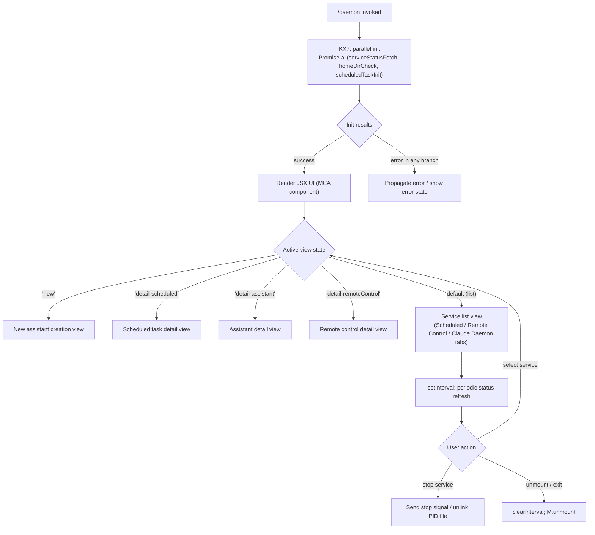

# `/daemon`

> Analysis basis: CC v2.1.132 bundle.js (AST extraction + Claude interpretation)
> Minimum version: v2.1.132

---

## Overview

The `/daemon` command provides a unified management interface for Claude Code's background services, covering three distinct subsystems: AI assistants running as background agents, scheduled tasks, and remote-control connections. When invoked, it resolves the current service status from multiple status files and presents an interactive JSX-rendered terminal UI for monitoring and controlling those services.

---

## Registration

| Field | Value |
|---|---|
| type | `local-jsx` |
| name | `daemon` |
| description | `Manage background services: assistants, scheduled tasks, and remote control` |
| immediate | `true` |
| module_id | `$CA` |
| load_inline | `true` |
| handler (Arbor) | `KX7` (AsyncFunction, resolved via `module_id` path) |
| `loc_byte_end` | `11600497` |
| `arbor_handler.name` | `KX7` |
| `arbor_handler.kind` | `AsyncFunction` |
| `arbor_handler.resolution_path` | `module_id` |
| `arbor_handler.fqn` | `claude-2.1.132::KX7` |
| `arbor_handler.n_hits` | `0` |

Analysis basis: CC v2.1.132 bundle.js:+11600293 – +11600497

---

## Input Branching

The command's top-level handler (`KX7`) runs a parallel initialization sequence and then delegates rendering to a React/Ink JSX component. The UI component (`MCA`) manages internal view state and dispatches sub-view transitions based on the currently selected tab or detail panel.



Analysis basis: CC v2.1.132 bundle.js:+11589068 (KX7 entry), +11589279 (MCA useState), +11589532 (setInterval), +11589604 (clearInterval), +11599881 (M.unmount)

---

## Behavioral Spec

### 1. Top-Level Handler: Parallel Initialization

The real handler for `/daemon` is the async function `KX7` (resolved via `module_id → $CA`). It fans out three concurrent operations before mounting the UI.

```
async function daemonCommandHandler(context):
    [serviceStatus, homeDirInfo, scheduledInit] = await Promise.all([
        fetchAllServiceStatus(),   // fCA
        checkHomeDirAssistant(),   // LCA
        initScheduledServices()    // Ewq
    ])
    mountDaemonUI(serviceStatus, homeDirInfo, scheduledInit)
```

Analysis basis: CC v2.1.132 bundle.js:+11589068

---

### 2. Service Status Collection (`fCA`)

`fCA` is the primary status aggregation function. It reads multiple on-disk status files in parallel and returns a consolidated view of all background service states.

```
async function fetchAllServiceStatus():
    [wwqResult, kwqResult, w2Result, uzqResult, lyqResult, pmResult, eF_Result] =
        await Promise.all([
            readScheduledStatusFiles(),   // wwq
            readMcpAssistantStatus(),     // Kwq
            checkWorkerProcesses(),       // w2
            readDaemonStatusJson(),       // Uzq  → "daemon.status.json"
            readScheduledDaemonStatus(),  // LYq  → "daemon.scheduled.status.json"
            parseRosterFile(),            // Pm   → "roster.json"
            checkLaunchctlStatus()        // eF
        ])
    return mergedStatus(Object.keys(...))
```

Key file constants found in the implementation:

- Daemon status file: `daemon.status.json` (bundle.js:+11389891)
- Scheduled daemon status file: `daemon.scheduled.status.json` (bundle.js:+11479863)
- Roster file: `roster.json` (bundle.js:+10277712)
- Daemon configuration file: `daemon.json` (bundle.js:+10271682)
- MCP auth-needs cache: `mcp-needs-auth-cache.json` (bundle.js:+9456044)

Analysis basis: CC v2.1.132 bundle.js:+11588589 (fCA body start), +11588860 (Object.keys call)

---

### 3. Scheduled Task Reader (`wwq` / `$iH` / `DRA`)

```
async function readScheduledStatusFiles():
    tasks = await Promise.all(readRawScheduledEntries())   // $iH
    for each task entry:
        raw = readFile(path, "utf8")                       // dz8.readFile
        trimmed = _.trim(raw)
        parsed = JSON.parse(trimmed)
        validate(parsed)                                   // Fh
        if not Array.isArray(parsed):
            throw Error
        // task type tagged as "scheduled" (bundle.js:+11481368)
    return tasks
```

Stale lock files are removed via `tgq.unlinkSync` when encountered.
(bundle.js:+11481356 `$iH`, +11390679 `DRA`, +14110155 `q → tgq.unlinkSync`)

---

### 4. Home-Directory Assistant Check (`LCA`)

```
function checkHomeDirAssistant():
    config = getConfig()           // _A
    configValue = resolveValue()   // _N6 → F6, D8
    homePath = path.join(
        os.homedir(),              // Awq.homedir
        SqH.join(...)
    )
    stat = await fs.stat(homePath) // UX6.stat
    // assistant type string: "assistant" (bundle.js:+11573253)
    return { type: "assistant", path: homePath, exists: ... }
```

Analysis basis: CC v2.1.132 bundle.js:+11573193

---

### 5. Worker Process Status Check (`w2`)

`w2` reads a PID file and attempts to verify whether the corresponding process is alive.

```
async function checkWorkerProcesses():
    pidData = await fs.readFile(pidFilePath)  // pJ6 → PC.readFile
    pid = parseInt(pidData)

    try:
        process.kill(pid, 0)   // signal 0 = liveness probe
        commandLine = await readProcessCommandLine(pid)  // RvA
        // reads /proc/<pid>/cmdline or platform equivalent
        args = commandLine.split(...).slice(...)
        return { alive: true, pid, args }
    catch:
        return { alive: false }

    // "claude daemon" label found at bundle.js:+10271108
    // signal column width: 4 (bundle.js:+10271135)
```

Analysis basis: CC v2.1.132 bundle.js:+10271189 (`pJ6`), +10271217 (`process.kill`), +10271267 (`RvA`)

---

### 6. Daemon Status File Readers (`Uzq`, `LYq`)

Both follow the same pattern — read a JSON status file, parse it, and probe the PID:

```
async function readDaemonStatusJson():
    raw = await fs.readFile(statusFilePath)  // gz8.readFile
    // path helper: PX6 → uzq.join + l8
    pid = parseJson(raw).pid                 // Z9
    process.kill(pid, 0)                     // liveness check
    if not alive: call NE (notify/cleanup)
    return status

async function readScheduledDaemonStatus():
    raw = await fs.readFile(scheduledStatusPath) // HYq.readFile
    // path helper: qYq → AYq.join + l8
    pid = parseJson(raw).pid                     // Z9
    process.kill(pid, 0)
    if not alive: call NE
    return status
```

Analysis basis: CC v2.1.132 bundle.js:+11390162 (`Uzq`), +11480070 (`LYq`)

---

### 7. Roster File Parser (`Pm`)

```
async function parseRosterFile():
    raw = await fs.readFile(rosterPath)   // hlH.readFile
    // path: e9H → JIH → $$.join + l8
    parsed = JSON.parse(raw)              // B6
    ts = gvA()                            // Date.now
    validate schema via D8, d_7
        // d_7 checks Array.isArray and Object.keys
    if validation fails:
        emit telemetry: tengu_bg_roster_parse_failed  // bundle.js:+10280954
        throw Error
    // optional: rename stale file via Pe9 (hlH.rename + Date.now)
    // schedule re-read via Uo9, d_7
    // regex test via l9H.test; String coercion
    return rosterEntries
```

Roster file path constant: `roster.json` (bundle.js:+10277712)
PTY-pids sub-key: `pty-pids` (bundle.js:+10278181)
PTY key: `pty` (bundle.js:+10277895)

Analysis basis: CC v2.1.132 bundle.js:+10280864 (`Pm`), +10280954 (telemetry)

---

### 8. launchctl Status Check — macOS Only (`eF` / `z38` / `fe9`)

```
function checkLaunchctlStatus():
    // Only runs on darwin (bundle.js:+10274777)
    uid = process.getuid()          // fe9 → process.getuid
    result = spawnSync("launchctl", ["print", ...])
    // strings: "launchctl" +10275206, "print" +10275219
    return parsedServiceStatus
```

Analysis basis: CC v2.1.132 bundle.js:+10275203 (`Y8`), +10275227 (`z38`), +10272065 (`fe9`)

---

### 9. MCP Connection Management (`UZH` / `tTA`)

The daemon UI incorporates MCP server management. `UZH` orchestrates connection lifecycle, and `tTA` manages individual server connections including OAuth flows.

```
async function manageMcpConnections(serverMap):
    for each [name, config] in Object.entries(serverMap):
        if config.type == "disabled": skip

        switch config.type:
            case "stdio":   connect via stdio transport
            case "sse":     connect via SSE transport
            case "sse-ide": connect via SSE-IDE transport
            case "ws-ide":  connect via WebSocket-IDE transport
            case "claudeai-proxy": connect via proxy transport

        conn = await connectServer(name, config)   // tTA
        if conn.status == "needs-auth":
            log "Skipping connection (cached needs-auth)"
            // bundle.js:+9462602
        results.push(conn)

    return results
```

MCP server type constants (bundle.js:+9462075, +9462174, +9462210, +9462482):
- `stdio`, `sse-ide`, `ws-ide`, `claudeai-proxy`

Analysis basis: CC v2.1.132 bundle.js:+9461875 (`UZH`), +9416357 (`tTA` / `Ci4`)

---

### 10. MCP OAuth Flow (`ot`)

When an MCP server returns a `needs-auth` state, the command triggers an OAuth flow:

```
async function runMcpOAuthFlow(server):
    emit telemetry: tengu_mcp_oauth_flow_start  // bundle.js:+9393502
    uuid = crypto.randomUUID()
    state = { uuid, ... }

    // Start local HTTP server on 127.0.0.1 (bundle.js:+9397340)
    // Callback path: "/callback" (bundle.js:+9396187)
    // Timeout: 300000 ms = 5 minutes (bundle.js:+9397437)

    server = http.createServer(handler)
    server.listen(port)
    server.unref()

    result = await Promise.race([authPromise, timeoutPromise])

    if result == "AUTHORIZED":
        emit telemetry: tengu_mcp_oauth_flow_success   // bundle.js:+9397849
    else:
        emit telemetry: tengu_mcp_oauth_flow_error     // bundle.js:+9398936

    // Error subtypes stored (bundle.js: +9398081 "unknown", +9398116 "cancelled",
    //   +9398223 "timeout", +9398278 "OAuth state mismatch",
    //   +9398332 "provider_denied", +9398486 "port_unavailable",
    //   +9398545 "sdk_auth_failed", +9398674 "invalid_client")
```

OAuth callback response pages:
- Success: `"<h1>Authentication Successful</h1>..."` (bundle.js:+9396903)
- Error: `"<h1>Authentication Error</h1>..."` (bundle.js:+9396367)
- CSRF check: `"OAuth state mismatch - possible CSRF attack"` (bundle.js:+9395554)

Analysis basis: CC v2.1.132 bundle.js:+9393357 (`ot`)

---

### 11. Background Session / Spare Worker Management (`w` / `OFA` / `LFA`)

The daemon UI manages a pool of background worker sessions ("spare" processes):

```
async function manageBackgroundSession(config):
    // Spawn spare worker if not present
    emit tengu_bg_spare_enable   (bundle.js:+14129457)

    worker = spawnSpareWorker(bm.spawn)   // bundle.js:+14131208
    emit tengu_bg_spare_spawn            (bundle.js:+14129749)

    // Claim an existing spare:
    claimed = await sendClaimFrame(socket)  // LFA → bm.claim, vQ7 → bm.buildClaimFrame
    if claim succeeds:
        emit tengu_bg_spare_claim          (bundle.js:+14130886)
    else:
        emit tengu_bg_spare_claim_fail     (bundle.js:+14131149)

    // Kill stale worker:
    process.kill(pid, SIGKILL)   // "SIGKILL" bundle.js:+14130020
    emit tengu_bg_dispatch_sigkill_escalate (bundle.js:+14129972)

    // Idle exit after inactivity
    emit tengu_daemon_idle_exit            (bundle.js:+14148068)
```

Claim send timeout: 5000 ms (bundle.js:+14112920)
Reconnect retry delay: 500 ms (bundle.js:+14113124)
Session state labels: `"starting"`, `"adopted"`, `"bg"`, `"idle"`, `"working"`, `"blocked"`, `"crashed"`, `"done"`, `"killed"`, `"resuming"` (bundle.js:+14123668, +14123700, +14134190, +14134625, +14134065, +14133991, +14134005, +14133871, +14133889, +14135265)

Analysis basis: CC v2.1.132 bundle.js:+14129457 (`Y`), +14133776 (`OFA`), +14112369 (`LFA`)

---

### 12. Daemon Lifecycle Controls (`NlH` / `gJ6`)

```
async function uninstallDaemonService():
    // macOS: runs "launchctl bootout" (bundle.js:+10273767)
    // On non-darwin: returns "service uninstall not available on darwin"
    //   (bundle.js:+10273898)
    unlink pidFile    // ze.unlink
    cleanup

async function startOrRestartDaemon(action):
    // action ∈ { "start", "kickstart", "stop", "restart" }
    // bundle.js:+10274118, +10274129, +10274154, +10274194
    if restart:
        wait for exit with 50 poll intervals (bundle.js:+10274422)
        if not exited within 10 s:
            log "daemon did not exit within 10s of SIGTERM; restart aborted"
            // bundle.js:+10274451
        then kickstart
```

Analysis basis: CC v2.1.132 bundle.js:+10273739 (`NlH`), +10274012 (`gJ6`)

---

### 13. Supervisor Protocol Message Handler (`uQ7`)

The daemon communicates with background workers over a binary framing protocol. The supervisor handler processes messages sent over a socket connection.

Message type constants (all from `uQ7` at bundle.js:+14118743 onwards):
- `"ping"`, `"nudge"`, `"yield"`, `"lease"`, `"leases"`, `"shutdown"`, `"list"`, `"has"`, `"dispatch"`, `"reply"`, `"resize"`, `"attach"`, `"respawn"`, `"resume"`, `"snapshot"`, `"settled"`, `"stream"`, `"ensure-spare"`, `"permission-response"`, `"subscribe"`

Error codes used in protocol responses:
- `"ESTARTING"`, `"EPROTO"`, `"ESTALE"`, `"ETIMEOUT"`, `"ENOJOB"`, `"ENOREPLY"`, `"EUNVERIFIED"`, `"ERESPAWNING"`, `"ETOOLARGE"`, `"EUNKNOWN"`

Read/write timeout: 30000 ms (bundle.js:+14117850)
Max concurrent in-flight dispatches: 25 (bundle.js:+14118026)
PTY buffer size: 65536 bytes (bundle.js:+14124956)

Analysis basis: CC v2.1.132 bundle.js:+14118572 (`uQ7`)

---

### 14. JSX UI Component (`MCA`)

`MCA` is the React/Ink component rendered by the `/daemon` command.

```
function DaemonUIComponent(props):
    [viewState, setViewState] = useState(initialState)   // U9.useState
    [timestamp, setTimestamp] = useState(Date.now())

    useEffect(() => {
        interval = setInterval(refreshStatus, INTERVAL)   // U9.useEffect + setInterval
        return () => clearInterval(interval)
    }, [])

    switch viewState:
        case "new":                   return <NewAssistantView />
        case "detail-scheduled":      return <ScheduledDetailView />
        case "detail-assistant":      return <AssistantDetailView />
        case "detail-remoteControl":  return <RemoteControlDetailView />
        default:
            return <ServiceListView
                tabs=["Scheduled", "Remote Control", "Claude Daemon"]
                onSelect=(item) => setViewState("detail-" + item.type)
                onAction=(action) => dispatchServiceAction(action)
            />
```

Tab label strings: `"Scheduled"` (bundle.js:+11590818), `"Remote Control"` (bundle.js:+11591139), `"Claude Daemon"` (bundle.js:+11591424)

View state keys (bundle.js:+11589989, +11589891, +11590049, +11590170):
`"new"`, `"detail-scheduled"`, `"detail-assistant"`, `"detail-remoteControl"`

Analysis basis: CC v2.1.132 bundle.js:+11589279 (`MCA`)

---

### 15. MCP Server Retry Logic (`$F7` / `ZBq`)

```
function retryFailedMcpServers(serverMap):
    // Filters servers by failed/disconnected state
    candidates = Object.entries(serverMap)
        .filter(([_, s]) => s.state == "failed")
        .filter(([name, _]) => isRetryableServer(name))  // t18

    for each candidate:
        attempt reconnect via UZH
        apply updated config via ZBq → H.applyMcpUpdate
        clean up old connection via bI → L.cleanup

    if all remote servers recovered:
        log "[MCP] Retry: all remote servers recovered, stopping"
        // bundle.js:+13847420
        emit tengu_mcp_retry_failed_remote  // bundle.js:+13846663
```

Analysis basis: CC v2.1.132 bundle.js:+13847224 (`$F7`), +13846850 (`ZBq`)

---

## State & Side Effects

| Item | Detail |
|---|---|
| Telemetry: `tengu_bg_roster_parse_failed` | Emitted when `roster.json` cannot be parsed (bundle.js:+10280954) |
| Telemetry: `tengu_mcp_oauth_flow_start` | Emitted when MCP OAuth flow begins (bundle.js:+9393502) |
| Telemetry: `tengu_mcp_oauth_flow_success` | Emitted on successful OAuth authorization (bundle.js:+9397849) |
| Telemetry: `tengu_mcp_oauth_flow_error` | Emitted when OAuth flow fails (bundle.js:+9398936) |
| Telemetry: `tengu_bg_spare_enable` | Emitted when spare-worker pool is enabled (bundle.js:+14129457) |
| Telemetry: `tengu_bg_spare_spawn` | Emitted when a spare worker is spawned (bundle.js:+14129749) |
| Telemetry: `tengu_daemon_config_reload` | Emitted when daemon config is hot-reloaded (bundle.js:+14143280) |
| Telemetry: `tengu_config_auth_loss_prevented` | Emitted when a config write is rejected to prevent auth data loss (bundle.js:+3102735) |
| Telemetry: `tengu_daemon_control` | Emitted on daemon start/stop/restart actions (bundle.js:+14164048) |
| Telemetry: `tengu_daemon_yield` | Emitted when daemon yields to a foreground session (bundle.js:+14147314) |
| Telemetry: `tengu_config_parse_error` | Emitted on config parse failure (bundle.js:+3107927) |
| Telemetry: `tengu_mcp_retry_failed_remote` | Emitted after MCP server retry cycle completes (bundle.js:+13846663) |
| Telemetry: `tengu_bg_dispatch_sigkill_escalate` | Emitted when SIGTERM escalates to SIGKILL for a background worker (bundle.js:+14129972) |
| Telemetry: `tengu_feature_bad` / `tengu_feature_ok` | Feature flag evaluation results (bundle.js:+906517, +906461) |
| Telemetry: `tengu_bg_sendclaim_failed` | Emitted when claim message delivery fails (bundle.js:+14112495) |
| Telemetry: `tengu_bg_spare_claim` / `tengu_bg_spare_claim_fail` | Spare worker claim success/failure (bundle.js:+14130886, +14131149) |
| Telemetry: `tengu_amber_anchor` | Emitted during config versioning/migration (bundle.js:+3099132) |
| Telemetry: `tengu_bg_proto_mismatch` | Protocol version mismatch between supervisor and worker (bundle.js:+14119698) |
| Telemetry: `tengu_bg_dispatch_stale_drop` | Stale dispatch message dropped (bundle.js:+14120937) |
| Telemetry: `tengu_bg_attach_legacy_autorespawn` | Legacy worker auto-respawned on attach (bundle.js:+14122818) |
| Telemetry: `tengu_bg_attach` | Background session attach attempt (bundle.js:+14123228) |
| Telemetry: `tengu_bg_attach_stall_ms` | Duration of attach stall in milliseconds (bundle.js:+14115690) |
| Telemetry: `tengu_bg_attach_stall_gave_up` | Attach stall exceeded retry limit (bundle.js:+14124062) |
| Telemetry: `tengu_bg_attach_stall_respawn` | Stalled session respawned during attach (bundle.js:+14124331) |
| Telemetry: `tengu_daemon_idle_exit` | Daemon process exiting due to inactivity (bundle.js:+14148068) |
| Telemetry: `tengu_iron_gate_closed` | Permission gate closed event (bundle.js:+7930461) |
| File reads | `daemon.status.json`, `daemon.scheduled.status.json`, `roster.json`, `daemon.json`, `mcp-needs-auth-cache.json` |
| File writes / renames | Roster file renamed atomically on staleness; PID files unlinked on daemon stop; config written via atomic rename pattern (`lY`) |
| Process signals | `process.kill(pid, 0)` for liveness checks; `SIGTERM` then `SIGKILL` for worker termination |
| Interval timers | `setInterval` for periodic status refresh; `clearInterval` on component unmount |
| HTTP server | Ephemeral OAuth callback server bound to `127.0.0.1` with 5-minute timeout (300000 ms) |
| Unix socket | Supervisor protocol socket (`sX8.connect`, `bm.spawn`, `cd9.createServer`) |
| appState changes | MCP config updates applied via `H.applyMcpUpdate`; MCP needs-auth cache written/deleted |
| Sound | None detected |

---

## Version History

| Version | Change |
|---|---|
| v2.1.132 | Initial analysis; three-subsystem daemon UI (assistants, scheduled tasks, remote control); OAuth flow; spare-worker pool; binary supervisor protocol |

---

## Common Mistakes

1. **Assuming `/daemon` is only for MCP** — the command manages three distinct subsystems: background AI assistant agents, cron-like scheduled tasks, and remote-control connections. Each has its own status file and PID tracking.
2. **Expecting immediate termination** — stopping a background worker first sends `SIGTERM`; `SIGKILL` escalation only occurs after the process does not exit within the timeout window. The `tengu_bg_dispatch_sigkill_escalate` telemetry event marks this escalation.
3. **Editing `daemon.json` while the daemon is running** — the daemon watches for config changes and hot-reloads them (emitting `tengu_daemon_config_reload`). Manual edits may be overwritten if a concurrent config write wins the atomic rename race.
4. **Expecting the OAuth callback server to persist** — the local HTTP server on `127.0.0.1` is ephemeral and self-terminates after 300 000 ms (5 minutes). On remote/SSH sessions the redirect URL won't load in the browser, but the full URL can be passed via the `complete_authentication` tool (bundle.js:+9418242).
5. **Treating `service uninstall` as cross-platform** — the `bootout` / `launchctl` integration is macOS-only; attempting the uninstall flow on non-Darwin platforms will result in an explicit error message (bundle.js:+10273898).
6. **Ignoring protocol error codes** — the supervisor protocol exposes structured error codes (`ENOJOB`, `ENOREPLY`, `EUNVERIFIED`, `ERESPAWNING`, etc.) that indicate distinct failure modes. Treating all failures as generic errors prevents correct retry logic.

---

## Appendix — Identifier Mapping

> For bundle debugging only. Identifiers change across versions.

| Identifier | Role |
|---|---|
| `KX7` | Main async handler for `/daemon` command (Arbor-resolved, module_id path) |
| `wX7` | Inner render/dispatch coordinator called by the UI layer |
| `fCA` | Parallel service-status aggregator |
| `MCA` | JSX/Ink UI component (daemon management TUI) |
| `wwq` | Scheduled-task status file collection orchestrator |
| `$iH` | Individual scheduled task file reader and validator |
| `DRA` | Low-level JSON file reader with trim + parse + array validation |
| `BRA` | Array validation helper for scheduled task entries |
| `Kwq` | MCP assistant status reader and connection-type resolver |
| `lDH` | MCP config file reader (reads assistant config, checks `ENOENT`) |
| `qCA` | Config path resolver helper (`_CA`) |
| `w2` | Worker process liveness checker (reads PID file, `process.kill` probe) |
| `pJ6` | PID file reader (`PC.readFile`) |
| `RvA` | Process command-line reader (reads `/proc/<pid>/cmdline` equivalent) |
| `Uzq` | `daemon.status.json` reader and PID prober |
| `PX6` | Path builder for daemon status files (`uzq.join + l8`) |
| `LYq` | `daemon.scheduled.status.json` reader and PID prober |
| `qYq` | Path builder for scheduled daemon status file |
| `Pm` | `roster.json` parser with schema validation and stale-file rotation |
| `e9H` | Roster file path builder |
| `JIH` | Roster subdirectory path builder |
| `Pe9` | Roster file atomic rename on staleness (`hlH.rename`) |
| `d_7` | Roster schema validator (`Array.isArray`, `Object.keys`) |
| `gvA` | Timestamp helper (`Date.now`) |
| `eF` | macOS `launchctl` status check dispatcher |
| `Y8` | `launchctl print` invocation wrapper |
| `PA` | Service status formatter (signal column, PID display) |
| `N6` | Status text builder helper |
| `z38` | macOS UID-based service label builder |
| `fe9` | UID fetcher (`process.getuid`) |
| `LCA` | Home-directory assistant existence checker (`os.homedir` + `fs.stat`) |
| `_N6` | Config value resolver for home-dir assistant path |
| `UZH` | MCP connection lifecycle orchestrator |
| `tTA` | Individual MCP server connection manager (includes OAuth) |
| `ot` | MCP OAuth flow implementation (local HTTP callback server) |
| `pcH` | In-flight OAuth request tracker (`Vf8` Map) |
| `hf8` | MCP auth-needs cache file unlinker |
| `QF` | MCP reconnect orchestrator |
| `Rb` | MCP auth token storage accessor |
| `D` | Supervisor config-change handler (stop/updateConfig/start cycle) |
| `eTA` | MCP connection status updater |
| `mcH` | In-flight connection map reader (`If8.get`) |
| `UcH` | Pending connection map reader (`Vf8.get`) |
| `mc9` | MCP PID/auth-needs cache writer (`p9H.writeFile`) |
| `Qf8` | MCP cache file path builder (`gf8.join + l8`) |
| `aTA` | MCP token-clearing handler (`Nw6` clear stored tokens) |
| `Nw6` | Stored-token clearer (reads, clears, logs "Cleared stored tokens") |
| `Nr4` | MCP server snapshot reader with timestamp (`XZA + Date.now`) |
| `XZA` | MCP snapshot file reader (`p9H.readFile`) |
| `gwA` | MCP server transport capability checker |
| `A8` | Transport-level capability resolver |
| `qt` | MCP server per-entry connection entry point |
| `VEH` | Individual MCP server connection executor (handles all transport types) |
| `_t` | SDK-type MCP server connection helper |
| `LO6` | SSE/HTTP MCP server connection helper |
| `a18` | MCP server identifier hasher (`oJ9.createHash sha256`) |
| `WJ` | Hash-based server key builder |
| `o18` | MCP server entry key extractor |
| `K8` | MCP debug log emitter (`EQ.logMCPDebug`, `kyH.push`) |
| `Z7` | MCP error log emitter (`EQ.logMCPError`, `kyH.push`) |
| `ZBq` | MCP config update applier (`H.applyMcpUpdate + _.cleanup + bI`) |
| `bI` | MCP connection cleanup helper (`dcH + L.cleanup`) |
| `dcH` | MCP connection detail serializer (`RH`) |
| `df8` | MCP state serializer |
| `$F7` | MCP server retry-failed-remote controller |
| `t18` | MCP retryable-server filter (`KE4.has + fE4.has`) |
| `Ri4` | SSH environment detector for MCP auth (`$A.isSSH`) |
| `Cc9` | Async batch processor (`zMH`) |
| `zMH` | Concurrency-limited async mapper |
| `dw6` | MCP port integer parser (first `parseInt`) |
| `PZA` | MCP port integer parser (second `parseInt`) |
| `fH` | Feature-flag evaluator (ok/bad telemetry) |
| `HA` | Feature-flag error handler |
| `yH` | String coercion utility |
| `kq` | Feature traffic classifier (`h1_`) |
| `$wL` | Ring-buffer feature-traffic queue (`uv6.shift/push`) |
| `w` | Background session manager (spawn, claim, kill, OFA) |
| `OFA` | Background job queue manager (add/delete/UL/Jq/tY/jM/SlH/HqH/KN/Xm) |
| `LFA` | Spare-worker claim sender (Unix socket, `bm.claim`, `bm.buildClaimFrame`) |
| `NQ7` | Claim frame send-and-wait loop with 5 s timeout |
| `kQ7` | Low-level socket connect and frame write |
| `vQ7` | Claim frame builder (`bm.buildClaimFrame`) |
| `Ym` | Binary frame encoder (`Buffer`, `writeUInt32BE`, `writeUInt8`) |
| `uQ7` | Supervisor protocol message router (all message types) |
| `qQq` | Message dispatch retry/timeout scheduler |
| `xQ7` | Background job state probe (phase check, kill, re-adopt) |
| `bQ7` | Attach stall duration calculator |
| `SlH` | Scheduled-task roster entry writer (`Pm + lY`) |
| `c_7` | Roster directory creator and file writer (`hlH.mkdir + lY`) |
| `HqH` | PTY-pids roster path builder |
| `XIH` | PTY-pids subdirectory path builder |
| `KN` | PTY session registry path resolver |
| `Xm` | PTY device path resolver |
| `UvA` | PTY path helper (`g_7`) |
| `ylH` | PTY device name builder |
| `R` | Background session disposer (`kQq + tQ7 + z.write`) |
| `kQq` | File realpath resolver for session cleanup |
| `tQ7` | Session cleanup orchestrator (`Oq8`) |
| `Oq8` | Session directory cleaner (`dO6.join + B$H`) |
| `NlH` | macOS daemon uninstall handler (`launchctl bootout`) |
| `uvA` | macOS LaunchAgent path builder |
| `gJ6` | macOS daemon start/restart handler (`kickstart`) |
| `mvA` | macOS kickstart command builder and executor |
| `X` | Attacher data framer (Buffer concat, indexOf, subarray) |
| `$f` | Attacher frame finisher (`H.end + RH`) |
| `hW6` | Attacher stream writer (`H.destroy + H.write`) |
| `j` | Background session job lookup wrapper |
| `UL` | Job directory path builder (`NX.join + DW`) |
| `DW` | Job base-directory resolver |
| `Jq` | Job status file stat reader (reads `order`, `stateOrder`, stat) |
| `tY` | Job active-state checker (`UE`) |
| `jM` | Job metadata file writer (`lY + NX.join + RH + YW`) |
| `YW` | Job metadata file cleanup (`bfH.delete`) |
| `mzq` | Daemon status file writer (`Er + Date.now + lY + PX6 + RH`) |
| `Er` | Daemon event emitter helper (`G7H`) |
| `lY` | Atomic file writer (`Uo8.randomBytes + or.writeFile + or.rename`) |
| `j6` | Session registry (has/get/add for `V5H`, `kq6`, `mU`) |
| `uQ6` | Session registration and worker adoption |
| `Lt8` | Worker adoption helper (`Mo + rPH + hU + _t8.randomUUID + fo.emit`) |
| `Dt8` | Worker state initializer |
| `R6` | Worker entry creator (`F6 + B2 + Et8 + k5H + DPK`) |
| `k5H` | Config file reader with backup/restore logic |
| `DPK` | Config file watcher (`lQ6.watchFile / unwatchFile`) |
| `Pm` | Roster file parser (also listed above) |
| `o8` | Timer-backed async queue with `setTimeout/clearTimeout` |
| `O` | Output stream wrapper (`Q8`) |
| `Ewq` | Scheduled-task initialization orchestrator |
| `PlH` | Model/plan selection UI component |
| `Y67` | Model registry builder (all model variants) |
| `zM` | Model base-class constructor |
| `DM` | Model descriptor builder (`MNH + XaL + Kx_ + ub6 + g_`) |
| `lM8` | Default model resolver |
| `pVA` | Model picker UI entry builder |
| `qj` | Foundry-type model entry builder |
| `Tt` | SSH-environment model entry builder |
| `i1H` | SSH-environment model UI entry builder |
| `ma9` | Sonnet-1M model entry |
| `ua9` | Sonnet base model entry |
| `Qa9` | Opus-1M model entry |
| `ga9` | Opus base model entry |
| `ba9` | Opus-1M alternate context entry |
| `ha9` | Haiku model URL resolver |
| `Sa9` | Model description builder (Sonnet variant) |
| `Ca9` | Model description builder (Opus variant) |
| `xa9` | Model URL resolver |
| `Fa9` | Model entry finalizer |
| `M67` | Opus-1M composite model entry |
| `Ua9` | Opus legacy model entry |
| `Ba9` | Opus 4.6-1M model entry |
| `O67` | OpusPlan mode entry (`WRH + Fa9 + $67`) |
| `Ra9` | Alternate model URL resolver (`UVA + m0`) |
| `f67` | Model entry list builder |
| `ka9` | Gateway model list fetcher (`Va9 + xVA + Na9`) |
| `Va9` | Gateway models JSON reader |
| `Na9` | Gateway model cache path builder (`uVA.join + va9`) |
| `OU` | Model picker option filter |
| `X7H` | Option text parser and filter |
| `qIH` | Model filter chain executor |
| `D67` | Model display name formatter |
| `J67` | Model identifier mapper (`o2 + w67`) |
| `o2` | Model string normalizer (lowercase, `Gq`) |
| `w67` | Model slug resolver (`FV + jk + WRH`) |
| `TwH` | Model picker header renderer |
| `mH` | Telemetry "stop" event emitter |
| `SH` | Telemetry "ok" event emitter |
| `LFA` | (see above — spare-worker claim sender) |
| `Msq` | Log/transcript file writer (mkdir, appendFile, rotate) |
| `GNH` | Log batch flusher (clearTimeout/setTimeout/setImmediate) |
| `pHH` | Log file path builder |
| `JG8` | Log file format helper |
| `jnA` | Log subdirectory path builder |
| `JnA` | Log file rotator (stat, endsWith ".txt", rename, unlink) |
| `fsq` | Log append-and-rotate orchestrator |
| `N1` | Log subscriber registry (`J08.add/delete`) |
| `Lsq` | Transcript writer entry point |
| `rdA` | Transcript encoding resolver |
| `mf` | Transcript text redactor (`[REDACTED]` replacement) |
| `MnA` | Transcript line mapper |
| `gNH` | Transcript output writer (`slA → H.write`) |
| `k` | Full transcript write pipeline |
| `$` | Daemon status persistence orchestrator (`mzq`) |
| `P` | MCP connection failure reporter (`gX8 + HN + Promise.all`) |
| `G` | Output stream selector (`Qw6 + gX8`) |
| `W` | Permissions-change notification queue |
| `BfH` | Config-change event batcher (`aK + qP`) |
| `uuH` | Policy-setting change detector |
| `nt` | Skills/policy renderer (`a_H + N58 + cF9 + s58`) |
| `PcH` | Permissions cache clearer (`PEA.clear`) |
| `Q` | PTY write proxy (`pJ6 + _e9`) |
| `_e9` | PTY cleanup on close (`PC.unlink + rzH + D8`) |
| `p` | Heartbeat timer manager (clearTimeout/setTimeout/z.write) |
| `h` | Heartbeat inner tick |
| `g` | Permission classifier (`aq8 + Bt`) |
| `aq8` | Permission request dispatcher (`djA + Xz6 + SE`) |
| `Bt` | Permission UI renderer (`_L + MD + Ij + yH + ...`) |
| `y` | Subprocess image/clipboard handler (`aiH + siH`) |
| `aiH` | PNG screenshot capturer |
| `siH` | Screenshot file writer (`OEq`) |
| `MEq` | Screenshot path builder |
| `zEq` | Screenshot metadata builder |
| `OEq` | Screenshot atomic file writer (`Zw8.open + writeFile + datasync + close`) |
| `v` | Background worker process wrapper (blur/focus/kill) |
| `S` | Output write-and-drain helper |
| `z` | Session write router (`SH + mH + Jx + pC`) |
| `Rb` | Auth token reader (`FK`) |