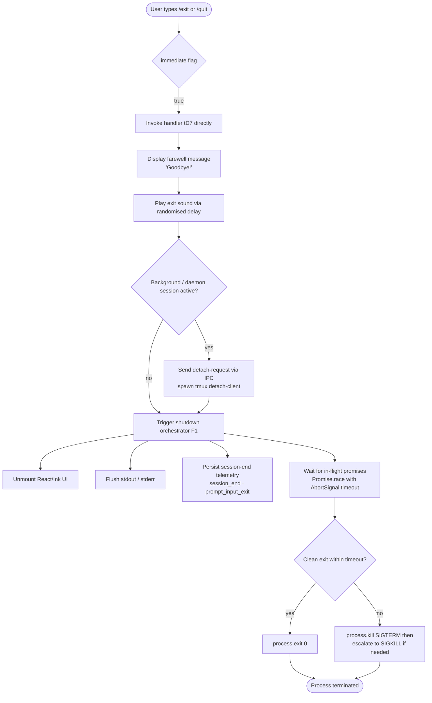

# `/exit`

> Analysis basis: CC v2.1.132 bundle.js (AST extraction + Claude interpretation)
> Minimum version: v2.1.132

---

## Overview

The `/exit` command (also aliased as `/quit`) terminates the current Claude Code CLI session immediately upon invocation. It is implemented as a `local-jsx` command with the `immediate` flag set, meaning it executes without requiring further user confirmation or input. The command orchestrates an orderly shutdown sequence: it displays a farewell message, flushes pending I/O, fires telemetry, and then terminates the process.

---

## Registration

| Field | Value |
|---|---|
| type | `local-jsx` |
| name | `exit` |
| description | `null` |
| aliases | `["quit"]` |
| immediate | `true` |
| module\_id | `HOq` |
| load\_inline | `true` |
| handler (Arbor) | `tD7` (AsyncFunction, resolved via `module_id`) |
| `loc_byte_end` | `11327159` |
| `arbor_handler.name` | `tD7` |
| `arbor_handler.kind` | `AsyncFunction` |
| `arbor_handler.resolution_path` | `module_id` |
| `arbor_handler.fqn` | `claude-2.1.132::tD7` |
| `arbor_handler.n_hits` | `1` |

Analysis basis: CC v2.1.132 bundle.js:+11326998 – +11327159

---

## Input Branching

Because `immediate: true` is set, the command fires as soon as the user types `/exit` or `/quit` — no argument parsing or sub-command branching occurs at the dispatch layer. All branching happens inside the shutdown sequence itself.



---

## Behavioral Spec

### 1. Handler Entry — `exitCommandHandler` (`tD7`)

```
async function exitCommandHandler(context):
    // Step 1: emit farewell JSX element containing the literal "Goodbye!"
    renderFarewellText(context)               // calls sD7 → Nj

    // Step 2: play exit sound (random selection, async delay)
    playSoundWithDelay()                      // calls H → Math.random, setTimeout
                                              //   random range: [1, 2]
                                              //   delay constant: from H literals

    // Step 3: handle background/daemon session detach
    if backgroundSessionActive():             // calls i9H → uo9, v9H, n9H
        writeDetachRequest("detach-request")  // v9H → Fl.write
        spawnTmuxDetachClient()               // i9H → Fo9.spawnSync
                                              //   argv: ["tmux", "detach-client"]
                                              //   stdio: "ignore"

    // Step 4: append to session history / scroll summary
    appendScheduledTaskEntry()               // calls bM8 → CN, KH7, n9

    // Step 5: render exit UI element
    createElement(USA, ...)                  // calls USA.createElement

    // Step 6: invoke main shutdown orchestrator
    await shutdownOrchestrator()             // calls F1

    // Step 7: fire prompt_input_exit telemetry marker
    emitTelemetryMarker("prompt_input_exit") // literal at +11326436
```

Analysis basis: CC v2.1.132 bundle.js:+11326248 (tD7 → G9), +11326260 (tD7 → H), +11326264 (tD7 → i9H), +11326295 (tD7 → bM8), +11326325 (tD7 → USA.createElement), +11326418 (tD7 → sD7), +11326431 (tD7 → F1), +11326436 (literal `prompt_input_exit`)

---

### 2. Farewell Rendering — `renderFarewellText` (`sD7`)

```
function renderFarewellText(context):
    // Renders a JSX node through Nj with the text "Goodbye!"
    // The string literal "Goodbye!" appears at bundle offset +11326212
    return jsx(Nj, { text: FAREWELL_LITERAL })
```

**Constant:** farewell string `"Goodbye!"` (bundle.js:+11326212)

Analysis basis: CC v2.1.132 bundle.js:+11326203 (sD7 → Nj), +11326212 (literal)

---

### 3. Background Session Detach — `backgroundDetachHandler` (`i9H`)

```
async function backgroundDetachHandler():
    // Resolve running background job reference
    jobRef = resolveBackgroundJob()          // i9H → Ju6

    // Mark job status as 0 (stopped/completed)
    updateJobStatus(jobRef, 0)               // i9H → uo9 → Q8
                                             //   status constant: 0 (+9840803)

    // Write IPC message "detach-request" to socket
    writeIpcMessage("detach-request")        // i9H → v9H → Fl.write
                                             //   message type literal: "detach-request"
                                             //   serialised via JSON.stringify (RH)

    // Spawn tmux detach synchronously
    spawnSync("tmux", ["detach-client"], {   // i9H → Fo9.spawnSync
        stdio: "ignore"                      //   literal "ignore" at +9845902
    })
```

**Constants:**
- IPC message type: `"detach-request"` (bundle.js:+9845797)
- Spawn command: `"tmux"` (bundle.js:+9845870), argument `"detach-client"` (bundle.js:+9845878)
- stdio mode: `"ignore"` (bundle.js:+9845902)
- Job status on exit: `0` (bundle.js:+9840803)

Analysis basis: CC v2.1.132 bundle.js:+9845768 (i9H → Ju6), +9845781 (i9H → uo9), +9845787 (i9H → v9H), +9845843 (i9H → n9H), +9845856 (i9H → Fo9.spawnSync)

---

### 4. Shutdown Orchestrator — `shutdownOrchestrator` (`F1`)

```
async function shutdownOrchestrator():
    // Phase A: Unmount UI and flush output
    await unmountInkUI()                     // WUH → H.unmount, XUH.writeSync

    // Phase B: Write final terminal escape sequences
    writeTerminalCleanup()                   // X5A → XUH.writeSync, M6.dim
                                             //   escape chars ESC-7, ESC-8 (+3522762/3522773)

    // Phase C: fire session_end telemetry
    emitEvent("session_end")                 // literal at +5044644

    // Phase D: collect and flush scroll summary telemetry
    emitScrollSummary()                      // ft6 → tengu_scroll_summary

    // Phase E: flush startup perf data if enabled
    flushStartupProfiling()                  // WsH → SnA (tengu_startup_perf)

    // Phase F: wait for all async shutdown tasks with timeout
    timeoutMs = Math.max(5000, 3500)         // literals at +5044273, +5044280
    result = await Promise.race([
        Promise.all(pendingShutdownTasks),   // ENH
        AbortSignal.timeout(timeoutMs)       // +5044535
    ])

    // Phase G: determine exit path
    exitHandler = resolveExitHandler()       // P5A → p4.get
    if cleanExit:
        process.exit(0)                      // P5A → process.exit
    else:
        process.kill(pid, "SIGTERM")         // P5A → process.kill
        // escalation to SIGKILL handled by background spare manager (w → y.kill)

    // Phase H: unref keepalive timer
    keepaliveTimer.unref()                   // F1 → h3H.unref
```

**Constants:**
- Shutdown timeout upper bound: `5000` ms (bundle.js:+5044273)
- Shutdown timeout lower bound: `3500` ms (bundle.js:+5044280)
- Keepalive unref: `h3H.unref` (bundle.js:+5044289)
- SIGTERM literal: `"SIGTERM"` (bundle.js:+14131382)
- SIGKILL literal: `"SIGKILL"` (bundle.js:+14130020)

Analysis basis: CC v2.1.132 bundle.js:+5044176 (F1 → Promise.resolve), +5044244 (F1 → WUH), +5044250 (F1 → X5A), +5044256 (F1 → P5A), +5044264 (F1 → Math.max), +5044289 (F1 → h3H.unref), +5044369 (F1 → ENH), +5044393 (F1 → Promise.race), +5044535 (F1 → AbortSignal.timeout), +5044571 (F1 → WsH), +5044584 (F1 → ft6), +5044596 (F1 → soH), +5044740 (F1 → Promise.all), +5044920 (F1 → XUH.writeSync)

---

### 5. Process-Kill Escalation — `processKillManager` (`P5A`)

```
async function processKillManager():
    clearTimeout(pendingExitTimeout)         // P5A → clearTimeout
    exitHandler = p4.get(currentPid)         // P5A → p4.get

    if exitHandler exists:
        process.exit(exitHandler.code)       // P5A → process.exit
    else:
        process.kill(process.pid, "SIGTERM") // P5A → process.kill
        // If still alive after grace period → throw Error("unreachable")
        throw new Error("unreachable")       // literal at +5043120
```

**Constant:** error sentinel `"unreachable"` (bundle.js:+5043120)

Analysis basis: CC v2.1.132 bundle.js:+5042966 (P5A → clearTimeout), +5042999 (P5A → p4.get), +5043047 (P5A → process.exit), +5043072 (P5A → process.kill), +5043114 (P5A → Error)

---

### 6. Cache-Eviction Hint on Exit — `cacheEvictionHint` (`soH`)

```
function cacheEvictionHint():
    // Fires tengu_cache_eviction_hint just before final teardown
    // Allows the telemetry pipeline to record memory/cache state at session end
    emitTelemetry("tengu_cache_eviction_hint")
```

Analysis basis: CC v2.1.132 bundle.js:+5044596 (F1 → soH), telemetry event `tengu_cache_eviction_hint` at +5044609

---

### 7. Background Spare Management (triggered indirectly via `w` / `Y`)

The exit path touches the daemon spare-process subsystem when a background session is active:

```
function backgroundSpareManager(context):
    // Attempt to claim a spare background process
    if spareAvailable():
        claimSpare()                         // tengu_bg_spare_claim
    else:
        spawnNewSpare()                      // tengu_bg_spare_spawn
        if exhausted:
            emitTelemetry("tengu_bg_dispatch_sigkill_escalate")
            kill(targetPid, "SIGKILL")       // w → y.kill, timeout 100ms (+14130044)

    // Grace period constants for spare teardown
    //   30 seconds (+14129927), 15 seconds (+14129938)
```

**Constants:**
- SIGKILL escalation delay: `100` ms (bundle.js:+14130044)
- Spare grace period (long): `30` (bundle.js:+14129927)
- Spare grace period (short): `15` (bundle.js:+14129938)
- Spare retry exhaustion sentinel: `"dup_retry_exhausted"` (bundle.js:+14130309)

Analysis basis: CC v2.1.132 bundle.js:+14129972 (tengu_bg_dispatch_sigkill_escalate), +14130767 (tengu_bg_spare_enable), +14130886 (tengu_bg_spare_claim), +14131149 (tengu_bg_spare_claim_fail), +14129749 (tengu_bg_spare_spawn)

---

## State & Side Effects

| Item | Detail |
|---|---|
| Telemetry — `session_end` | Fired inside `shutdownOrchestrator` (F1); literal at bundle.js:+5044644 |
| Telemetry — `prompt_input_exit` | Fired at the very end of `exitCommandHandler` (tD7); literal at bundle.js:+11326436 |
| Telemetry — `tengu_scroll_summary` | Fired by `ft6` during shutdown; captures scroll/display statistics |
| Telemetry — `tengu_cache_eviction_hint` | Fired by `soH` just before process teardown; bundle.js:+5044609 |
| Telemetry — `tengu_startup_perf` | Flushed by `WsH → SnA` if startup profiling was enabled; bundle.js:+170315 |
| Telemetry — `tengu_bg_spare_*` | Background spare lifecycle events emitted when a daemon session is active |
| Telemetry — `tengu_bg_dispatch_sigkill_escalate` | Emitted when SIGKILL escalation is required during spare teardown |
| Telemetry — `tengu_daemon_config_reload` | May fire via `D → I.updateConfig` during supervisor reconfiguration on exit |
| Telemetry — `tengu_amber_creek` | Fired via `r_ → j6 → WWK`; render/UI pipeline metric |
| Telemetry — `tengu_pewter_brook` | Fired via `r_ → j6`; companion UI pipeline metric |
| UI unmount | Ink/React component tree is unmounted via `WUH → H.unmount` |
| stdout / stderr flush | `XUH.writeSync` called twice: during UI teardown and after terminal cleanup |
| Terminal cursor/scroll | ANSI escape sequences ESC-7 / ESC-8 written via `X5A` (bundle.js:+3522762, +3522773) |
| Background IPC | If a daemon session is live, `"detach-request"` is written to the IPC socket and `tmux detach-client` is spawned synchronously |
| Process state | Terminates via `process.exit` (clean) or `process.kill(SIGTERM)` → `SIGKILL` escalation (unclean) |
| Keepalive timer | `h3H.unref()` called to allow Node/Bun event loop to drain (bundle.js:+5044289) |
| Scheduled-task record | `bM8` appends a `"scheduled task"` entry to the session history before shutdown |
| Hook registration | No persistent hook registration; `immediate: true` bypasses the normal prompt lifecycle |
| Sound | Exit sound played with a randomised selection in range `[1, 2]` and a `setTimeout`-based delay (bundle.js:+12264283, +12264299, +12264322) |
| appState changes | Job status set to `0` (`"stopped"`) via `uo9 → Q8` when a background session is detached (bundle.js:+9840803) |

---

## Version History

| Version | Change |
|---|---|
| v2.1.132 | Initial analysis — `immediate` flag, dual telemetry markers (`session_end`, `prompt_input_exit`), background-session IPC detach, SIGKILL escalation path documented |

---

## Common Mistakes

1. **Expecting a confirmation prompt.** Because `immediate: true` is set, `/exit` fires instantly — there is no "are you sure?" step. Users who type it accidentally cannot cancel.

2. **Assuming `/quit` behaves differently.** The `aliases: ["quit"]` registration means `/quit` is identical in every respect to `/exit`; both invoke `tD7`.

3. **Expecting instant process death in a daemon session.** When a background/daemon session is active, the exit sequence first sends a `"detach-request"` IPC message and spawns `tmux detach-client` synchronously before proceeding to process teardown. This adds a small but observable delay.

4. **Misreading the shutdown timeout.** The orchestrator races `Promise.all` against an `AbortSignal.timeout`. The effective timeout is `Math.max(5000, 3500)` = **5000 ms** (bundle.js:+5044264, +5044273, +5044280). If in-flight tasks do not resolve within 5 seconds, the process is killed forcibly.

5. **Assuming a zero exit code is guaranteed.** If `p4.get(pid)` does not return a registered exit handler, the code path falls through to `process.kill(SIGTERM)`. Unhandled errors in the shutdown sequence may produce non-zero exit codes or the `"unreachable"` error sentinel.

6. **Ignoring the `description: null` field.** The command intentionally has no user-visible description in the command palette (bundle.js:+11326998). Do not expect it to appear in help listings that filter by description presence.

---

## Appendix — Identifier Mapping

> For bundle debugging only. Identifiers change across versions.

| Identifier | Role |
|---|---|
| `tD7` | Main exit command handler (AsyncFunction; Arbor resolution: `module_id`) |
| `G9` | Mode/context resolver called at handler entry |
| `Tr` | Context type classifier (called by G9) |
| `H` | Exit sound player (calls `Math.random` + `setTimeout`) |
| `i9H` | Background session detach coordinator |
| `Ju6` | Background job reference resolver (called by i9H) |
| `uo9` | Job status updater (calls jZH, Q8) |
| `jZH` | Job state store accessor |
| `Q8` | Job status write primitive |
| `v9H` | IPC socket writer (calls `Fl.write`, serialises via RH) |
| `RH` | JSON serialiser wrapper (calls `JSON.stringify`) |
| `n9H` | Background session cleanup helper |
| `Vf` | Session context accessor |
| `bM8` | Scheduled-task history appender (calls CN, KH7, n9) |
| `CN` | History store accessor |
| `KH7` | Task entry builder (calls lE, cZ, VmH, Math.max, Date.now, Cq) |
| `lE` | Schedule expression parser (handles "Every minute", "Every hour", cron-like patterns) |
| `L` | Column-padding formatter (calls `K.map`, `f.padEnd`) |
| `w` | Background process lifecycle manager (SIGKILL escalation, spare spawn) |
| `K` | Process exit coordinator (calls `process.exit`, `vH`, `AZ`) |
| `J` | All-child-process killer (calls `_.values`, `v.kill`) |
| `Y` | Background session teardown (calls `j6`, `$.dispose`, `s6`, `Date.now`) |
| `$` | Resource disposable manager (calls `mzq`) |
| `j` | UTC date manipulator (calls `w` for process ops) |
| `cZ` | Schedule string tokeniser (calls `H.trim`, `wpK`, `_.push`) |
| `wpK` | Schedule token parser (calls `H.split`, `K.match`, `parseInt`, `L.add`, `Array.from`) |
| `_` | Token normaliser (calls `f.toLowerCase`) |
| `VmH` | Time-slot matcher (calls various `O.set*` / `O.get*` date methods) |
| `O` | Date object wrapper (calls `Q8`) |
| `f` | File-descriptor / resource closer (calls `_.close`, `q.close`, `K`) |
| `q` | Temp-file cleanup (calls `tgq.unlinkSync`) |
| `Cq` | Duration formatter using `Math.floor` / `Math.round` |
| `n9` | String truncation utility (calls `H.indexOf`, `H.substring`, `z8`, `o1`) |
| `z8` | Unicode string-width measurer (calls `Bun.stringWidth`) |
| `o1` | Grapheme cluster iterator (calls `z8`, `Az`) |
| `Az` | Unicode segment helper |
| `sD7` | Farewell text renderer (calls `Nj` JSX component) |
| `F1` | Shutdown orchestrator (main async teardown pipeline) |
| `WUH` | UI unmount handler (calls `H.unmount`, `XUH.writeSync`, `mk`, `nc6`, `yH`) |
| `mk` | Post-unmount cleanup helper |
| `nc6` | Terminal restore writer (emits ESC-7 / ESC-8 sequences via `bo.writeSync`) |
| `Ac6` | Terminal emulator version checker (Ghostty ≥ 1.2.0, iTerm2 ≥ 3.6.6) |
| `W2H` | Terminal state restore helper |
| `CE` | Escape sequence replacer (calls `H.replaceAll`) |
| `yH` | String coercion helper (calls `String`) |
| `X5A` | Terminal cleanup writer (calls `XUH.writeSync`, `M6.dim`, `A.replaceAll`, `Cr1`) |
| `tT` | Terminal state accessor |
| `vh` | Viewport dimensions helper |
| `v6` | Terminal capability checker |
| `Tf6` | File stats resolver (calls `lg`, `f$`, `_A`, `D$.join`, `F6`, `q.statSync`) |
| `k$` | Config path builder (calls `v6`, `hK`) |
| `hK` | Home-directory resolver (calls `N1`) |
| `Cr1` | Output formatter/dimmer |
| `P5A` | Process-kill manager (clean exit or SIGTERM/SIGKILL) |
| `ENH` | Parallel shutdown-task awaiter (calls `Promise.all`, `Array.from`) |
| `D` | Supervisor/daemon lifecycle manager (calls `lDH`, `Hwq`, `E`, `VQq`, `Z`) |
| `lDH` | Daemon config file reader (calls `eYq.readFile`, `j8`, `qCA`, `vH`, `Z9`, `Object.keys`) |
| `j8` | JSON parse wrapper |
| `qCA` | Config schema coercer (calls `_CA`) |
| `vH` | Buffer-to-string converter (calls `String`) |
| `Hwq` | Config diff/summary formatter (calls `Object.keys`, `Math.max`, `i3`) |
| `E` | Remote-control event handler (calls `u.preventDefault`, `CP`, `D`, `H`) |
| `u` | Input event object |
| `CP` | User-settings accessor (calls `CA`) |
| `I` | Supervisor controller (calls `I.stop`, `I.updateConfig`, `I.start`) |
| `VQq` | Heartbeat manager (calls `Do`) |
| `Do` | Heartbeat tick handler |
| `Z` | Background watcher (calls `Z.start`) |
| `d` | Logger / diagnostics sink |
| `WsH` | Startup profiling flusher (calls `SnA`, `hnA`, `SE6.dirname`, `F6`, `KE`, `VnA`, `k`) |
| `SnA` | Perf-mark collector (fires `tengu_startup_perf`) |
| `Jb` | `perf_hooks` module importer (calls `require`) |
| `hnA` | Profiling report path builder (calls `SE6.join`, `l8`, `v6`) |
| `KE` | Atomic file writer (calls `xHH.openSync`, `xHH.writeFileSync`, `xHH.fsyncSync`, `xHH.closeSync`) |
| `VnA` | Profiling report formatter (calls `Jb`, `_.push`, `A.entries`, `yE6`, `A.at`, `tg`, `_.join`) |
| `yE6` | Perf entry formatter (calls `B9`, `tg`) |
| `tg` | Duration-to-fixed-string formatter (calls `H.toFixed`) |
| `k` | Telemetry batch sender (calls `YsH`, `Lsq`, `RH`, `mf`, `gNH`, `Msq`) |
| `Lsq` | Telemetry serialiser (calls `_Z`, `qsq`, `rdA`) |
| `mf` | Field redactor (replaces with `"[REDACTED]"`, calls `MnA`, `H.replace`, `_.lastIndexOf`, `_.slice`) |
| `gNH` | Telemetry gzip compressor (calls `slA`) |
| `Msq` | Telemetry HTTP poster (calls `GNH`, `pHH`, `cwH.dirname`, `_Z`, `F6`, `JG8`, `jnA`, `JnA`, `Buffer.byteLength`, `PnA`, `ZE6.then`, `fsq.bind`, `N1`) |
| `ft6` | Scroll/display summary emitter (fires `tengu_scroll_summary`, calls `tT`, `Rr1`, `d`, `Sr1`, `r_`) |
| `Rr1` | Scroll metrics collector |
| `Sr1` | Scroll summary aggregator (calls `Date.now`, `Math.max`, `Math.round`, `Object.assign`, `yr1`) |
| `yr1` | Summary record constructor |
| `r_` | UI render-path dispatcher (fires `tengu_amber_creek`, `tengu_pewter_brook`; calls `jyH`, `Ne8`, `yH`, `Id`, `k`, `oq6`, `uA`, `WWK`, `j6`) |
| `jyH` | Agent type detector (calls `aDL.has`) |
| `Ne8` | Render error handler (calls `Iq`, `yH`) |
| `Id` | Render path selector (calls `PWK`) |
| `oq6` | Boolean flag resolver (calls `s6`, `Boolean`) |
| `uA` | Utility adapter (calls `ub`) |
| `WWK` | Amber-creek metric emitter (calls `j6`, fires `tengu_amber_creek`) |
| `j6` | Pewter-brook metric emitter (calls `hq6`, `Rq6`, `Oo`, `V5H.has`, `uQ6`, `kq6.add`, `mU.has`, `mU.get`, `R6`) |
| `soH` | Cache-eviction hint emitter (fires `tengu_cache_eviction_hint`) |
| `o8` | Retry/timeout helper (calls `L`, `Error`, `q`, `setTimeout`, `O`, `clearTimeout`, `K.unref`) |