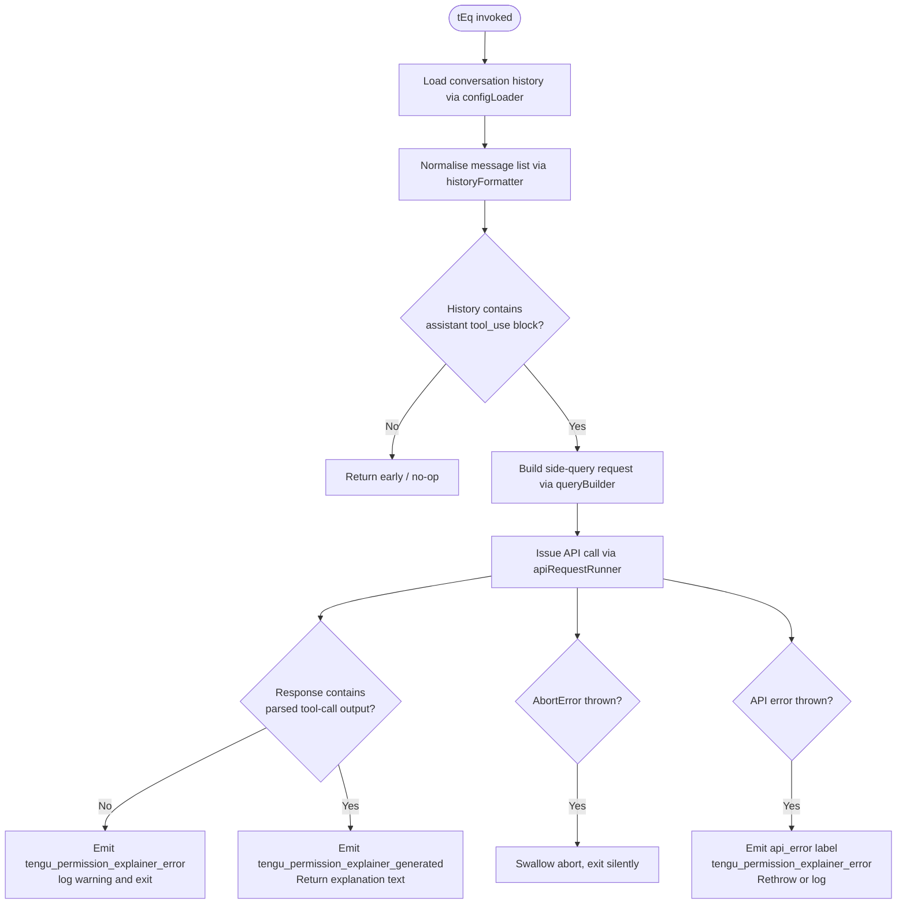

# `/explain_command`

> Analysis basis: CC v2.1.132 bundle.js (AST extraction + Claude interpretation)
> Minimum version: v2.1.132

---

## Overview

The `explain_command` tool is an internal slash-command registered as a **tool-type** command that generates a natural-language permission explanation for a given tool use. When invoked, it consults recent conversation history, identifies the relevant tool invocation, and issues a targeted side-query to the model to produce a human-readable explanation of why that tool call was made — surfacing the result as the `permission_explainer` output. The command is driven by the async handler `tEq` (resolved via `direct` Arbor path against the registration byte range).

---

## Registration

| Field | Value |
|---|---|
| type | `tool` |
| name | `explain_command` |
| description | `null` (not present in bundle at this range) |
| handler | `tEq` (AsyncFunction, Arbor `direct` resolution) |
| loc_byte | 12385199 |
| loc_byte_end | 12385235 |
| loc_line | 9137 |
| `arbor_handler.name` | `tEq` |
| `arbor_handler.kind` | `AsyncFunction` |
| `arbor_handler.resolution_path` | `direct` |
| `arbor_handler.fqn` | `claude-2.1.132::tEq` |
| `arbor_handler.n_hits` | `1` |

Analysis basis: CC v2.1.132 bundle.js:+12385199

Literal confirmation — the strings `"tool"`, `"explain_command"`, and `"permission_explainer"` appear consecutively at offsets +12385205, +12385217, and +12385257, consistent with the registration object fields. Analysis basis: CC v2.1.132 bundle.js:+12385205

---

## Input Branching

The handler `tEq` performs the following high-level branch logic after entry:



Analysis basis: CC v2.1.132 bundle.js:+12384894 (tEq→BuA), +12384918 (Date.now timestamp capture), +12384939 (kV7 call), +12384957 (yV7 call), +12385104 (xq call), +12385117 (WR call)

---

## Behavioral Spec

### 1. Handler Entry and Timestamp Capture

```
async function permissionExplainerHandler(toolInput):
    startTime = Date.now()
    // startTime used later for duration telemetry
    conversationHistory = loadConfig(toolInput)
    ...
```

Analysis basis: CC v2.1.132 bundle.js:+12384918

### 2. Message History Normalisation

The handler calls `historyFormatter` (mapped to `kV7`) to convert raw message objects into a stable format, applying a hard limit of **2** recent turns (numeric literal `2` at +12384414) and converting entries to strings via `String()`. It then calls `reverseAndSliceHistory` (mapped to `yV7`) which:

1. Filters messages to only those with role `"assistant"` (literal at +12384493).
2. Reverses the list.
3. Slices to at most **3** entries (numeric literal `3` at +12384513), keeping the most recent ones first.
4. Unshifts a separator and joins segments with `"..."` (literal at +12384694) to form a condensed context block.
5. Appends a block of `"text"` (literal at +12384596)-typed content.

```
function formatHistory(rawMessages, limit=2):
    formatted = rawMessages.map(m => String(m))
    return formatted.slice(-limit)

function reverseAndSliceHistory(messages):
    assistantMessages = messages.filter(m => m.role == "assistant")
    recent = assistantMessages.reverse().slice(0, 3)
    parts = []
    parts.unshift(recentContext)
    return parts.join("...")
```

Analysis basis: CC v2.1.132 bundle.js:+12384404 (kV7→RH→JSON.stringify), +12384430 (kV7→String), +12384414 (literal 2), +12384458 (literal 1000), +12384470 (yV7→H.filter), +12384538 (yV7→_.reverse), +12384681 (yV7→f.slice), +12384694 (literal "..."), +12384702 (yV7→q.unshift), +12384735 (yV7→q.join)

### 3. Tool-Use Block Detection

The handler inspects the formatted history for a `"tool_use"` content block (literal at +12385412). If none is found, execution short-circuits. If found, the tool name is cross-checked against known MCP prefix patterns via `mcpToolChecker` (mapped to `H9`):

- `H9` calls `Object.hasOwn` (bundle.js:+3059789) and checks whether the tool name starts with `"mcp__"` (literal at +3059854), classifying it as `"mcp_tool"` (literal at +3059869).

```
function detectToolUseBlock(formattedHistory):
    for block in formattedHistory.content:
        if block.type == "tool_use":
            return block
    return null

function isMcpTool(toolName):
    return Object.hasOwn(toolName) and toolName.startsWith("mcp__")
```

Analysis basis: CC v2.1.132 bundle.js:+12385412 (literal "tool_use"), +12385732 (tEq→H9), +3059789 (H9→Object.hasOwn), +3059841 (H9→H.startsWith), +3059854 (literal "mcp__"), +3059869 (literal "mcp_tool")

### 4. Side-Query Construction and API Call

The handler delegates to `commandResolver` (mapped to `xq`) which internally calls `slashCommandParser` (mapped to `OU`) and `fullCommandResolver` (mapped to `X7H`) to resolve command metadata. A side-query is assembled under the label `"side_query"` (literal at +12060746) and dispatched through `apiRequestRunner` (mapped to `WR`).

The `apiRequestRunner` internally:
- Attaches standard request headers including `"User-Agent"`, `"X-Claude-Code-Session-Id"`, `"x-app": "cli-bg"` (literals at +2841635, +2841650, +2841668).
- Applies a maximum request timeout of **600000 ms** (10 minutes) (literal at +2842324).
- Uses a 1024-byte buffer for initial data (literal at +12060562).
- Computes a SHA-256 cache key via `cacheKeyHasher` (mapped to `fxA`) (literal `"sha256"` at +12019539).
- Enforces a minimum of **1** API retry (literal `1` at +3103200) and classifies responses under labels `"1h"` (literal at +12061598) for cache-control headers.

```
function buildAndDispatchSideQuery(toolUseBlock, commandMetadata, history):
    request = {
        type: "side_query",
        tool: toolUseBlock,
        context: history,
        headers: buildStandardHeaders()
    }
    response = await apiRequestRunner(request, timeout=600000)
    return response
```

Analysis basis: CC v2.1.132 bundle.js:+12385104 (tEq→xq), +12385117 (tEq→WR), +12060746 (literal "side_query"), +12060562 (literal 1024), +2842324 (literal 600000), +12019539 (literal "sha256"), +12061598 (literal "1h")

### 5. Response Parsing and Output

After the API call returns, the handler uses `responseOutputExtractor` (mapped to `RH`) and `outputValidator` (mapped to `NV7`) to extract structured output from the model response. If no parsed output is found, it logs the warning `"Permission explainer: no parsed output in response"` (literal at +12386029) and fires the `tengu_permission_explainer_error` telemetry event.

On success the handler fires `tengu_permission_explainer_generated` (telemetry at +12385682) and returns the explanation string.

```
function extractAndValidateOutput(apiResponse):
    parsed = responseOutputExtractor(apiResponse)
    if parsed == null:
        logWarning("Permission explainer: no parsed output in response")
        emitTelemetry("tengu_permission_explainer_error")
        return null
    emitTelemetry("tengu_permission_explainer_generated")
    return parsed.explanationText
```

Analysis basis: CC v2.1.132 bundle.js:+12385490 (tEq→RH), +12385524 (tEq→NV7), +12385784 (literal "permission_explainer_generate"), +12385782 (tengu_permission_explainer_generated telemetry), +12385894 (tengu_permission_explainer_error telemetry), +12386029 (literal warning string)

### 6. Error Handling

Two distinct error paths exist in `tEq`:

1. **AbortError**: caught by name comparison against `"AbortError"` (literal at +12386342). The handler swallows the error and exits silently, emitting nothing.
2. **API error**: caught and labelled `"api_error"` (literal at +12386413), followed by `tengu_permission_explainer_error` telemetry emission and logging via `fH`/`mH`/`vH` (the standard structured logger chain).

```
try:
    result = await buildAndDispatchSideQuery(...)
    return extractAndValidateOutput(result)
catch error:
    if error.name == "AbortError":
        return   // silent exit
    emitTelemetry("tengu_permission_explainer_error", {type: "api_error"})
    log(error)
    throw error
```

Analysis basis: CC v2.1.132 bundle.js:+12386342 (literal "AbortError"), +12386413 (literal "api_error"), +12386233 (tEq→vH), +12386242 (tEq→fH), +12386378 (tEq→mH)

### 7. Configuration Loading

`configLoader` (mapped to `BuA`) → `configReader` (mapped to `R6`) → `fileSystemConfigLoader` (mapped to `k5H`) performs the actual on-disk config read with the following noteworthy behaviours:

- Files are read with encoding `"utf-8"` (literal at +3107373).
- A guard throws `"Config accessed before allowed."` (literal at +3107290) if config is accessed too early.
- Missing files (`"ENOENT"` at +3107520) are silently swallowed; the loader returns a default object.
- File-system errors labelled `"error"` (literal at +3107841) trigger `tengu_config_parse_error` telemetry.
- Config backups are stored under directory named `"backups"` (literal at +3106858).
- Backup files are timestamped with `Date.now()` and copied via `q.copyFileSync` (bundle.js:+3108435).

Analysis basis: CC v2.1.132 bundle.js:+12384894 (tEq→BuA), +12384770 (BuA→R6), +3107290 (literal guard string), +3107373 (literal "utf-8"), +3107520 (literal "ENOENT"), +3107841 (literal "error"), +3107927 (telemetry tengu_config_parse_error), +3106858 (literal "backups"), +3108435 (q.copyFileSync)

---

## State & Side Effects

| Item | Detail |
|---|---|
| Telemetry — primary success | `tengu_permission_explainer_generated` (bundle.js:+12385682) |
| Telemetry — primary failure | `tengu_permission_explainer_error` (bundle.js:+12385894) |
| Telemetry — config parse error | `tengu_config_parse_error` (bundle.js:+3107927) |
| Telemetry — API/infra (inherited) | `tengu_api_success`, `tengu_stream_watchdog_default_on`, `tengu_byte_watchdog_fired_late`, `tengu_oauth_token_refresh_*` (via shared API runner) |
| Telemetry — feature flags (inherited) | `tengu_feature_ok`, `tengu_feature_bad`, `tengu_feature_sad` |
| Telemetry — background daemon (inherited) | `tengu_bg_spare_enable`, `tengu_bg_spare_claim`, `tengu_bg_spare_claim_fail`, `tengu_bg_dispatch_sigkill_escalate` |
| Config file side effect | May write a timestamped backup of the config file under `backups/` subdirectory when config is mutated (bundle.js:+3108435) |
| appState changes | None directly observed in depth-2 traversal; side-query result is returned, not stored |
| Hook registration | None observed in depth-2 traversal |
| Sound | None observed |
| File I/O | Config read (`readFileSync`, `"utf-8"`); optional backup copy (`copyFileSync`) |
| Network | One outbound API call (side-query) with 600 000 ms timeout; uses standard Anthropic endpoint headers |

---

## Version History

| Version | Change |
|---|---|
| v2.1.132 | Initial analysis — `explain_command` registered as `tool` type at bundle.js:+12385199; handler `tEq` confirmed via Arbor direct resolution |

---

## Common Mistakes

1. **Expecting a description field**: The registration `description` is `null` in v2.1.132. Do not rely on a description string being present when enumerating commands programmatically.
2. **Triggering on non-assistant turns**: The command filters to `"assistant"`-role messages only; invoking it in a context where no assistant message with a `"tool_use"` block exists will produce a silent no-op rather than an error.
3. **Assuming synchronous completion**: `tEq` is an `AsyncFunction`. Callers must `await` it; the side-query API call carries up to a 600 000 ms timeout.
4. **Misidentifying AbortError as a failure**: An `AbortError` (e.g. user cancellation) is caught and swallowed silently — no telemetry is emitted and no exception propagates. Do not treat the absence of `tengu_permission_explainer_generated` as a failure if the session was interrupted.
5. **Confusing `explain_command` with a prompt-type command**: This command is registered as `type: "tool"`, not `type: "prompt"`. It has no `prompt_body`; its behaviour is entirely driven by the handler `tEq` and the inline side-query.
6. **Relying on the history window being large**: The formatter caps context at 2 turns and the reverser caps assistant blocks at 3. Explanations are generated from a deliberately narrow window; do not assume full conversation context is available to the explainer.

---

## Appendix — Identifier Mapping

> For bundle debugging only. Identifiers change across versions.

| Identifier | Role |
|---|---|
| `tEq` | Main async handler for `explain_command` (Arbor direct, AsyncFunction) |
| `BuA` | Config loader wrapper (called first by `tEq`) |
| `R6` | Core config reader / file-system config orchestrator |
| `k5H` | File-system config loader (reads, backs up, parses config file) |
| `bJ1` | Config directory/backup path resolver |
| `kt8` | Config backup directory path builder |
| `DPK` | Config file watcher / reload trigger |
| `N1` | Config watcher subscription manager |
| `F6` | Utility: possibly logger or formatter (called widely) |
| `Et8` | Config schema validator or transformer |
| `B6` | JSON parse wrapper |
| `Fh` | String prefix/slice utility (startsWith + slice) |
| `kV7` | History formatter — formats raw messages, applies turn limit of 2 |
| `RH` | JSON stringify / response output extractor |
| `yV7` | History reverser and slicer — filters assistant messages, reverses, slices to 3 |
| `xq` | Command resolver — resolves slash-command metadata |
| `OU` | Slash-command parser |
| `KV` | Command key/value extractor |
| `K_` | Command lookup helper |
| `X7H` | Full command resolver (maps command name → metadata) |
| `mb6` | Command option enumerator (Object.entries based) |
| `PRH` | Provider inclusion checker |
| `Wd_` | Command index finder |
| `deL` | Command description/label extractor |
| `f8H` | Feature flag set membership checker |
| `Wq` | Command name normaliser (trim, toLowerCase, replace) |
| `ceL` | Command content/prefix handler |
| `Kj` | Command joiner / full-name builder |
| `r2` | Command routing table |
| `R_` | Route entry builder |
| `Gr` | Route: "max" plan handler |
| `W7H` | Route: "team" plan handler |
| `ERH` | Route: "enterprise" plan handler |
| `jk` | Route: model aliaser (zM + DM) |
| `qj` | Route: query dispatcher |
| `zM` | Model alias resolver (calls g_) |
| `g_` | Core model getter / provider state accessor |
| `DM` | Model descriptor builder |
| `FV` | Model alias + descriptor combiner |
| `WR` | API request runner (main outbound fetch orchestrator) |
| `fx` | Core API fetch function (auth, headers, streaming) |
| `mzK` | URL builder / path parser |
| `G9` | Transport selector |
| `Tr` | Transport mode constant holder |
| `Mx` | AsyncLocalStorage context fetcher |
| `UF6` | Store getter (m41.getStore) |
| `v6` | Request version tagger |
| `yH` | String coercion / error formatter |
| `L7` | OAuth + lock orchestrator |
| `no8` | OAuth token refresh + lock manager |
| `xzK` | Request interceptor chain builder |
| `HbH` | Request interceptor entry (Date.now timestamp) |
| `vA` | Credential/token validator |
| `CS6` | Proxy auth helper configurator |
| `CjH` | Proxy credential formatter |
| `rE_` | Proxy credential resolver |
| `IuL` | Port-number parser (parseInt + Number.isNaN) |
| `AU` | Auth header builder |
| `TP` | Auth token provider |
| `BzK` | Request session manager (UUID, caching, streaming watchdog) |
| `a3` | Session cache key builder |
| `FzK` | Session header inspector (authorization, anthropic-beta) |
| `UzK` | Session state tracker |
| `yo8` | Session backoff calculator (Math.max + Number) |
| `pzK` | Streaming byte watchdog (performance.now, clearTimeout, setTimeout, pipe) |
| `nw` | Provider classifier (anthropicAws, bedrock, foundry, etc.) |
| `xb6` | Provider state reader |
| `JaL` | Provider prefix checker (H.startsWith) |
| `Lx_` | Provider name normaliser (toLowerCase, Object.values) |
| `zX` | Request context builder (yH, AU, o6H, Wk6) |
| `o6H` | URL/host parser (split, toLowerCase, includes, startsWith, substring, endsWith) |
| `Wk6` | Queue/semaphore pair (Qp + SQ) |
| `oE_` | Request option extender |
| `uzK` | Header normaliser / environment resolver |
| `GF6` | Header group builder (Gq, Lj, eT) |
| `eT` | Header entry factory |
| `INH` | Header injection helper |
| `RwH` | Remote header finder (yrq.find, H.startsWith, yG6) |
| `__` | OAuth URL validator/replacer |
| `WF6` | Header entry lowercaser (Object.entries, q.toLowerCase) |
| `TPH` | Error logger (console.error) |
| `Pa_` | Request finaliser |
| `Hq1` | Response handler setup |
| `I` | Response iterator |
| `wq1` | Response stream reader |
| `ZPH` | Response completion handler |
| `XF6` | Response data extractor |
| `PF6` | Response error classifier |
| `G` | Global state accessor (Qw6, gX8) |
| `Hj` | Request executor wrapper |
| `o$` | Fetch executor (tL, zx, co8, HZ, $aH, yH, _B8, R6) |
| `GS` | Auth credential assembler (db6, tL, B96, Dr, zx, yH) |
| `db6` | Token descriptor builder (t6H) |
| `tL` | Token loader |
| `B96` | Auth header value formatter |
| `Dr` | OAuth descriptor resolver (Ex_) |
| `zx` | Auth entry builder (tL, R8, K_) |
| `RRH` | WIF/OAuth credential exchange handler |
| `Uu6` | WIF credential resolver (fetch, AbortSignal.timeout) |
| `SH` | Status emitter (success path) |
| `mH` | Status emitter (error path) |
| `UHK` | Response body classifier (A.includes) |
| `P` | Token provider (gX8, HN, qm, Promise.all) |
| `HA` | Error/string wrapper (Error + String) |
| `X` | Socket/buffer reader (Buffer.concat, indexOf, subarray) |
| `j` | Socket handle |
| `$f` | Socket writer (H.end, RH) |
| `uQ7` | IPC/daemon message dispatcher (large multiplexer) |
| `mQ7` | Message type constant |
| `$` | IPC output stream |
| `sD` | Background service descriptor |
| `MFA` | Message frame assembler |
| `qQq` | Queue poller (Date.now, Math.min, H.get, MFA, o8, $f, sD) |
| `o8` | Timer-based retrier (setTimeout, clearTimeout) |
| `k0` | Job path builder (myH.join, $Z, GO) |
| `g$` | Path realpath normaliser (vb.realpath, H.normalize) |
| `UKH` | File-based lease reader (vb.open, N9_.createInterface, readline) |
| `bQ7` | Stall detector (j6, Math.max) |
| `x` | Write-with-timeout helper |
| `n9H` | Notification handler |
| `UL` | Lock file path builder (NX.join, DW) |
| `xQ7` | Session respawn handler (Jq, UL, k0, g$, UKH, QrH.rm) |
| `v` | Idle blur/focus timer (BU, Date.now, Math.min) |
| `l` | Lease list (w, c) |
| `c` | Capability filter (r.filter) |
| `W` | Batch event scheduler (z.add, clearTimeout, setTimeout, BfH, uuH) |
| `Q` | PTY output writer (pJ6, _e9) |
| `p` | Write throttler (h, clearTimeout, setTimeout, z.write, Math.round) |
| `g` | Permission classifier (aq8, Bt — deny/classify/ask) |
| `hW6` | Socket destroy/write helper |
| `vH` | Version/string formatter (String) |
| `IPH` | Provider include-list checker (Gq, _S, nw, A.includes) |
| `Gq` | Model-family resolver (mb6, BY, H.includes, M08, vP) |
| `BY` | Model string normaliser (toLowerCase, includes, replace) |
| `M08` | Model constant table |
| `vP` | Model ID replacer (H.replace) |
| `_S` | Provider state snapshot (g_) |
| `JE7` | Message finder (H.find, _.find) |
| `fxA` | Cache key hasher (QPq.createHash, sha256, hex) |
| `tQ6` | Context cache writer (Iq, g_, UF6, k) |
| `Iq` | String identity wrapper |
| `sQ6` | Context cache reader (g_) |
| `g1H` | Prompt cache configurator (yH, g_, R_, q08, j6, L08) |
| `q08` | Cache configuration constant |
| `j6` | Tool registry accessor (hq6, Rq6, Oo, V5H.has, uQ6, kq6.add, mU.has, mU.get, R6) |
| `hq6` | Tool registry getter |
| `Rq6` | Tool registration helper |
| `Oo` | Tool descriptor builder (yH, Mo) |
| `uQ6` | Tool deduplication guard (Kt8.has, V5H.get, Kt8.add, Lt8, Dt8) |
| `L08` | Cache control label constant |
| `kk` | Model snapshot builder (xo8, yH) |
| `xo8` | Model snapshot getter (g_) |
| `X2q` | Request metadata builder |
| `vF6` | Model context formatter (Gq) |
| `ofH` | Response output formatter (Z9, Array.isArray, k, RH, hU, g7, v6) |
| `hU` | Random hex ID generator (R6, xJ1.randomBytes, A8) |
| `A8` | Global config accessor (Nt8, B2, H, FbH, CJ1, gbH, k, k5H, uq6, d, vt8) |
| `g7` | Message content normaliser (nY, R6) |
| `nY` | Conversation turn builder (tL, GS, yH, K_, o$, B96) |
| `WwH` | Response warnings handler |
| `S76` | Agent flag checker (GFK, fH) |
| `GFK` | Built-in agent registry checker (oWH, MLA.has) |
| `oWH` | Agent descriptor |
| `ha` | Custom agent resolver (WFK, fH) |
| `WFK` | Agent name parser (H.startsWith, H.slice, fLA, B9A, JMH) |
| `fLA` | Agent prefix stripper (B9A) |
| `B9A` | Agent name slicer (H.indexOf, H.slice) |
| `JMH` | Thread type checker (H.startsWith) |
| `toH` | Response transform finaliser |
| `H9` | MCP tool name checker (Object.hasOwn, H.startsWith — "mcp__" prefix) |
| `Z8` | Status/state emitter variant (d) |
| `NV7` | Output validator (called by tEq after API response) |
| `k` | Logger / debug utility (YsH, Lsq, H.includes, RH, A.toUpperCase, mf, H.trim, FN, gNH, Msq) |
| `fH` | Structured logger — error channel (HA, yH, kq, $wL, kyH.push, EQ.logError) |
| `d` | Core logger dispatcher |
| `Wd` | Config watch debouncer |
| `Z9` | Array/object normaliser |