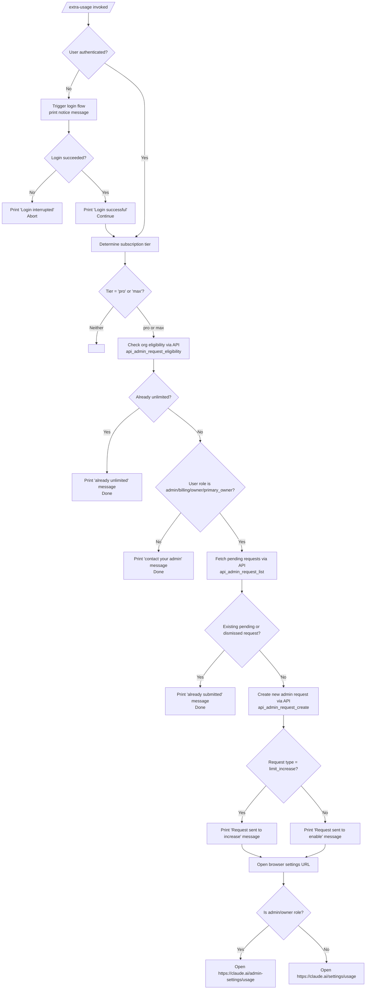

# `/extra-usage`

> Analysis basis: CC v2.1.132 bundle.js (AST extraction + Claude interpretation)
> Minimum version: v2.1.132

---

## Overview

The `/extra-usage` command allows users to configure extra usage capacity so that Claude Code can continue operating after account usage limits are reached. It determines the user's subscription tier (`pro` or `max`), checks whether the user's organization already has unlimited extra usage or a pending admin request, and either submits a new admin request or opens the appropriate browser-based settings page. When the user is not yet authenticated, it triggers a login flow before proceeding.

---

## Registration

| Field | Value |
|---|---|
| type | `local-jsx` |
| name | `extra-usage` |
| description | `Configure extra usage to keep working when limits are hit` |
| module\_id | `_Z9` |
| load\_inline | `true` |
| handler | `Fz6` (AsyncFunction, resolved via `module_id`) |
| loc\_byte span | `8033291`–`8033496` |
| `loc_byte_end` | `8033496` |
| `arbor_handler.name` | `Fz6` |
| `arbor_handler.kind` | `AsyncFunction` |
| `arbor_handler.resolution_path` | `module_id` |
| `arbor_handler.fqn` | `claude-2.1.132::Fz6` |
| `arbor_handler.n_hits` | `0` |

Analysis basis: CC v2.1.132 bundle.js:+8033291

---

## Input Branching

The handler `Fz6` performs a multi-stage flow. The high-level decision tree is shown below, followed by detailed pseudocode for each stage.



Analysis basis: CC v2.1.132 bundle.js:+8032251

---

## Behavioral Spec

### 1. Authentication Gate

Before any usage-management logic runs, the handler checks whether the current session has a valid authentication credential. If no credential is present, a notice is printed:

> "Starting new login following /extra-usage. Exit with Ctrl-C to use existing account."
> (bundle.js:+8032518)

A login sub-flow is then started (calling the `loginFlow` helper, identified as `j6` in the bundle). If the login flow completes successfully, the message `"Login successful"` (bundle.js:+8032641) is printed and execution continues. If the flow is interrupted or fails, `"Login interrupted"` (bundle.js:+8032660) is printed and the command exits early.

```
async function authenticationGate(appState):
    if not hasValidCredential(appState):
        print("Starting new login following /extra-usage. Exit with Ctrl-C to use existing account.")
        result = await runLoginFlow(appState)
        if result.interrupted:
            print("Login interrupted")
            return ABORT
        print("Login successful")
    return CONTINUE
```

Analysis basis: CC v2.1.132 bundle.js:+8032413, +8032518, +8032641, +8032660

The `A.onChangeAPIKey` call observed at bundle.js:+8032618 suggests the handler also subscribes to API key change events during or immediately after the login flow, so that credential updates propagate to subsequent API calls.

---

### 2. Subscription Tier Detection

The handler resolves the subscription tier string, which is expected to be either `"pro"` or `"max"` (bundle.js:+8032262, +8032273). This is used to gate eligibility checks and to tailor the admin-request payload.

```
function resolveSubscriptionTier(accountInfo):
    tier = accountInfo.subscriptionTier   // e.g. "pro", "max"
    return tier
```

Analysis basis: CC v2.1.132 bundle.js:+8032262, +8032273

The subscription-detection helper (`w5H` / `subscriptionStateHelper`) calls two sub-helpers: one that retrieves the raw subscription object (`g7` → `nY`) and one that coerces it to a boolean availability flag (`R_` → `fU` → `Boolean`, bundle.js:+1979675).

Supported subscription kind strings seen at depth-2 include: `"stripe_subscription"` (bundle.js:+2883978), `"stripe_subscription_contracted"` (+2884005), `"apple_subscription"` (+2884043), `"google_play_subscription"` (+2884069).

---

### 3. Organization Eligibility Check

A GET request is made to the Anthropic API endpoint identified by the operation name `"api_admin_request_eligibility"` (bundle.js:+7985961). The `x-organization-uuid` header is populated from the resolved organization UUID (bundle.js:+7986055). Authentication uses OAuth or API-key credentials following the same pattern as all other first-party API calls (host `api.anthropic.com`, bundle.js:+3084382).

If the eligibility response indicates the organization already has unlimited extra usage, the command prints:

> "Your organization already has unlimited extra usage. No request needed."
> (bundle.js:+7987449)

and exits successfully.

If the user's role is not one of `"admin"`, `"billing"`, `"owner"`, or `"primary_owner"` (bundle.js:+1977758–+1977784), the command prints:

> "Please contact your admin to manage extra usage settings."
> (bundle.js:+7987606)

and exits.

```
async function checkEligibility(orgUUID, authHeaders):
    response = await apiGet("api_admin_request_eligibility", orgUUID, authHeaders)
    if response.alreadyUnlimited:
        print("Your organization already has unlimited extra usage. No request needed.")
        return DONE
    if currentUserRole not in ["admin", "billing", "owner", "primary_owner"]:
        print("Please contact your admin to manage extra usage settings.")
        return DONE
    return ELIGIBLE
```

Analysis basis: CC v2.1.132 bundle.js:+7985961, +7987449, +7987606, +1977758

---

### 4. Pending-Request Check

An API call identified as `"api_admin_request_list"` (bundle.js:+7985649) is made to retrieve existing admin requests for the organization. If any request with status `"pending"` or `"dismissed"` (bundle.js:+7987720, +7987730) is found, the command informs the user that a request has already been submitted:

> "You have already submitted a request for extra usage to your admin."
> (bundle.js:+7987789)

```
async function checkPendingRequests(orgUUID, authHeaders):
    requests = await apiGet("api_admin_request_list", orgUUID, authHeaders)
    existing = requests.filter(r => r.status in ["pending", "dismissed"])
    if existing.length > 0:
        print("You have already submitted a request for extra usage to your admin.")
        return ALREADY_SUBMITTED
    return NONE_PENDING
```

Analysis basis: CC v2.1.132 bundle.js:+7985649, +7987720, +7987730, +7987789

---

### 5. Admin Request Creation

A POST request identified as `"api_admin_request_create"` (bundle.js:+7985386) is sent to the API. The request type is `"limit_increase"` (bundle.js:+7987542). The response determines which confirmation message is displayed:

- If the request type is `"limit_increase"` → `"Request sent to your admin to increase extra usage."` (bundle.js:+7987978)
- Otherwise → `"Request sent to your admin to enable extra usage."` (bundle.js:+7988032)

```
async function createAdminRequest(orgUUID, tier, authHeaders):
    payload = { type: "limit_increase", tier: tier }
    response = await apiPost("api_admin_request_create", orgUUID, payload, authHeaders)
    if response.requestType == "limit_increase":
        print("Request sent to your admin to increase extra usage.")
    else:
        print("Request sent to your admin to enable extra usage.")
    return response
```

Analysis basis: CC v2.1.132 bundle.js:+7985386, +7987542, +7987978, +7988032

---

### 6. Browser URL Launch

After a successful admin request (or in the post-request flow), the command opens the appropriate usage-settings page in the default browser. Two URLs are in use:

- Admin/owner role: `https://claude.ai/admin-settings/usage` (bundle.js:+7988246)
- Non-admin role (personal settings): `https://claude.ai/settings/usage` (bundle.js:+7988287)

The browser-open helper (`LL` / `openBrowser`) supports macOS (`open`), Windows (`rundll32 url,OpenURL`), and Linux (`xdg-open`) (bundle.js:+7355558, +7355574, +7355732, +7355739). The literal `"browser-opened"` (bundle.js:+7988354) is used as a status token after the launch.

```
function openUsageSettings(isAdminOrOwner):
    url = isAdminOrOwner
          ? "https://claude.ai/admin-settings/usage"
          : "https://claude.ai/settings/usage"
    platform = detectPlatform()
    if platform == "darwin":
        exec("open", url)
    elif platform == "win32":
        exec("rundll32", "url,OpenURL", url)
    else:
        exec("xdg-open", url)
    return "browser-opened"
```

Analysis basis: CC v2.1.132 bundle.js:+7988246, +7988287, +7988354, +7355558

---

### 7. API Call Infrastructure

All Anthropic API calls made by this command share a common request helper (`IQH` / `apiRequestWithRetry`) that:

- Sets `Content-Type: application/json` and `User-Agent` headers (bundle.js:+7986591, +7986625).
- Includes the `x-organization-uuid` header (bundle.js:+7986055).
- Uses a 5 000 ms timeout (bundle.js:+7986665).
- On a `401` response, attempts a single token-refresh-and-retry cycle, logging the outcome with the annotation `" (401→refresh→retry succeeded)"` (bundle.js:+7986733).
- On a `403` or persistent `401`, delegates to the error-handling path.
- Cache TTL for usage data: 300 000 ms (5 minutes) (bundle.js:+1984391).
- Error responses with status ≥ 500 use the `"detail"` field of the response body (bundle.js:+7987152, +7986946).

The `tengu_ember_latch` telemetry event fires from within the `loginFlow` call at bundle.js:+8032298.

Authentication credential resolution (helper chain `o$` / `resolveCredentials`) checks, in order:

1. `ANTHROPIC_API_KEY` environment variable (bundle.js:+2868107).
2. `apiKeyHelper` helper (bundle.js:+2868201).
3. OAuth token via `CLAUDE_CODE_OAUTH_TOKEN_FILE_DESCRIPTOR` (bundle.js:+1992170).
4. API key via `CLAUDE_CODE_API_KEY_FILE_DESCRIPTOR` (bundle.js:+1992314).

If neither API key nor OAuth token is available, the error `"ANTHROPIC_API_KEY or CLAUDE_CODE_OAUTH_TOKEN env var is required"` is thrown (bundle.js:+2868528).

```
async function apiRequestWithRetry(method, operation, orgUUID, payload, authHeaders):
    headers = buildHeaders(authHeaders, orgUUID)
    headers["Content-Type"] = "application/json"
    headers["User-Agent"]   = buildUserAgent()
    response = await httpRequest(method, resolveEndpoint(operation), headers, payload, timeout=5000)
    if response.status == 401:
        refreshCredentials()
        response = await httpRequest(method, resolveEndpoint(operation), headers, payload, timeout=5000)
        log(" (401→refresh→retry succeeded)")
    if response.status >= 500:
        raise ApiError(response.body["detail"])
    return response
```

Analysis basis: CC v2.1.132 bundle.js:+7986591, +7986665, +7986733, +7986946

---

## State & Side Effects

| Item | Detail |
|---|---|
| Telemetry | `tengu_ember_latch` fired during the login sub-flow (bundle.js:+8032298); `tengu_feature_ok` fired on feature-flag check success (bundle.js:+906461); `tengu_feature_bad` fired on feature-flag check failure (bundle.js:+906517) |
| API calls (GET) | `api_admin_request_eligibility` (bundle.js:+7985961); `api_admin_request_list` (bundle.js:+7985649) |
| API calls (POST) | `api_admin_request_create` (bundle.js:+7985386) |
| Credential side-effect | `A.onChangeAPIKey` listener registered after login (bundle.js:+8032618) |
| Browser launch | Opens `https://claude.ai/admin-settings/usage` or `https://claude.ai/settings/usage` (bundle.js:+7988246, +7988287) |
| Usage cache TTL | 300 000 ms; stale cache may cause the eligibility check to return outdated results (bundle.js:+1984391) |
| appState changes | Credential state updated on successful login; API-key change event propagated to active session |
| Sound | None observed |

---

## Version History

| Version | Change |
|---|---|
| v2.1.132 | Initial analysis |

---

## Common Mistakes

1. **Invoking `/extra-usage` without being on a `pro` or `max` subscription.** The command gates its eligibility checks on the subscription tier. Users on other tiers will not reach the admin-request flow.

2. **Expecting instant effect after `/extra-usage`.** The command submits a *request* to the organization admin — the admin must approve it. The command opens `https://claude.ai/settings/usage` for non-admins to track status.

3. **Running the command multiple times.** If a `"pending"` or `"dismissed"` request already exists, the command will print "You have already submitted a request" and will not create a duplicate. Re-running does not reset or escalate the request.

4. **Assuming API-key authentication is sufficient.** The web-session and admin-API paths require OAuth authentication. A plain `ANTHROPIC_API_KEY` may not satisfy the org-UUID resolution step needed for `api_admin_request_*` calls.

5. **Interrupting the login flow with Ctrl-C.** If `/extra-usage` triggers a login because no credential is present, pressing Ctrl-C aborts both the login and the entire `/extra-usage` flow; the usage request is not queued.

6. **Misreading the "already unlimited" message as an error.** `"Your organization already has unlimited extra usage. No request needed."` is a success state — no further action is required.

---

## Appendix — Identifier Mapping

> For bundle debugging only. Identifiers change across versions.

| Identifier | Role |
|---|---|
| `Fz6` | Main `/extra-usage` command handler (AsyncFunction) |
| `F9` | Subscription-info fetch helper |
| `wx_` | Subscription field extractor (called from F9) |
| `Yx_` | Subscription state normalizer (called from F9) |
| `nY` | Credential/account-state resolver |
| `tL` | Platform/environment string helper |
| `yH` | Generic string formatting utility |
| `GS` | Auth-context builder (claude-desktop / vscode detection) |
| `db6` | OAuth token descriptor reader |
| `B96` | API-key string formatter |
| `Dr` | OAuth token file-descriptor loader |
| `zx` | Flag-settings reader |
| `o$` | Credential resolution (ANTHROPIC_API_KEY / OAuth chain) |
| `co8` | API-key helper invoker |
| `HZ` | Auth-none / no-auth sentinel check |
| `$aH` | VSCode platform token handler |
| `_B8` | API-key file-descriptor loader |
| `R6` | Timestamp / event record constructor |
| `qS` | History slice helper (last 20 entries) |
| `TZ` | Session/token state accessor |
| `j6` | Login flow orchestrator |
| `hq6` | Login step: initiate OAuth |
| `Rq6` | Login step: poll / verify OAuth |
| `Oo` | Login UI renderer |
| `Mo` | OAuth token manager |
| `Yx` | OAuth token store accessor |
| `uQ6` | Login dedup / in-flight guard |
| `Lt8` | OAuth token writer (emits GrowthbookExperimentEvent) |
| `rPH` | First-party token classifier |
| `hU` | Random token generator (32-byte hex) |
| `RH` | JSON serializer wrapper |
| `BXK` | Token persistence helper |
| `Dt8` | Post-login session setup |
| `U41` | Session field builder |
| `uA` | User-account info fetcher |
| `EJ1` | Organization UUID extractor |
| `jyH` | ADL feature-flag set checker |
| `w5H` | Subscription state helper |
| `g7` | Raw subscription object getter |
| `R_` | Subscription availability coercer |
| `fU` | Boolean coercion wrapper |
| `kq` | Telemetry / feature-flag resolver |
| `h1_` | Feature-flag string builder |
| `JL8` | Core extra-usage API request coordinator |
| `Qb` | Role / permission checker (admin, billing, owner, primary_owner) |
| `IQH` | HTTP request with 401-retry logic |
| `y9` | API operation-name resolver |
| `A` | Base URL / environment config accessor |
| `SH` | Prod-environment URL selector |
| `mH` | Non-prod-environment URL selector |
| `IE` | Error-response wrapper |
| `s6H` | Cache timestamp recorder (Date.now) |
| `__` | OAuth/custom endpoint validator |
| `W__` | Approved-endpoint allowlist |
| `eDL` | Environment-override reader |
| `rV` | HTTP error classifier (401/403 / Axios) |
| `H` | Exponential-backoff / retry scheduler |
| `cQ` | In-flight request dedup cache |
| `hP` | Request builder (headers + body) |
| `Hj` | Auth-header injector |
| `k` | HTTP client wrapper (Content-Type, User-Agent, timeout) |
| `Lsq` | URL path builder |
| `mf` | Path segment sanitizer ([REDACTED] helper) |
| `gNH` | Slug normalizer |
| `Msq` | File-based request helper (Buffer.byteLength) |
| `x7` | Response body extractor |
| `fH` | Output / message display helper |
| `HA` | Error string formatter |
| `$wL` | Output queue manager (shift/push) |
| `ST9` | `api_admin_request_list` fetch function |
| `Vz` | Org-UUID–gated API call wrapper |
| `L7` | No-op / passthrough response helper |
| `xV` | Org-UUID resolver |
| `x5` | Anthropic-version / client-platform header builder |
| `e8H` | Header assembly finisher |
| `hT9` | `api_admin_request_eligibility` fetch function |
| `yT9` | `api_admin_request_create` POST function |
| `pN4` | Axios error status extractor |
| `LL` | Browser URL launcher |
| `T04` | URL scheme validator (http/https) |
| `Y8` | Platform-specific open-command dispatcher |
| `PA` | Child-process spawner for browser open |
| `N6` | Process-spawn queue manager |