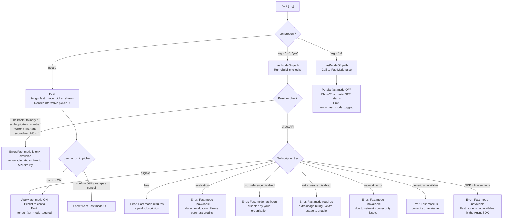

# `/fast`

> Analysis basis: CC v2.1.132 bundle.js (AST extraction + Claude interpretation)
> Minimum version: v2.1.132

---

## Overview

The `/fast` command toggles **Fast mode** — a research-preview feature that switches the active model tier to a higher-capability (Opus-class) model — on or off for the current session. When invoked without an explicit argument, it renders an interactive JSX picker UI that lets the user confirm or change the mode; when invoked with `on` or `off` it applies the toggle immediately. Fast mode is subject to multiple eligibility gates (API provider, subscription tier, organization policy, network reachability, and rate-limit state) that each produce a distinct user-facing error message.

---

## Registration

| Field | Value |
|---|---|
| `type` | `local-jsx` |
| `name` | `fast` |
| `description` | `"Toggle fast mode ( ... only)"` |
| `argumentHint` | `[on\|off]` |
| `thinClientDispatch` | `control-request` |
| `module_id` | `n5q` |
| `load_inline` | `true` |
| `immediate` | `null` |
| `isHidden` | `null` |
| `handler` | `p$7` (AsyncFunction, resolved via `module_id` → `n5q`) |
| `loc_byte_end` | `11109946` |
| `arbor_handler.name` | `p$7` |
| `arbor_handler.kind` | `AsyncFunction` |
| `arbor_handler.resolution_path` | `module_id` |
| `arbor_handler.fqn` | `claude-2.1.132::p$7` |
| `arbor_handler.n_hits` | `3` |

Analysis basis: CC v2.1.132 bundle.js:+11109669 – +11109946

---

## Input Branching

The top-level handler (`p$7`) inspects the trimmed, lower-cased argument token and dispatches along three primary paths.



Analysis basis: CC v2.1.132 bundle.js:+11108716 (handler entry), +2100991 (eligibility error strings), +11108830 (off literal)

---

## Behavioral Spec

### 1. Handler Entry — `p$7`

```
async function handleFastCommand(context, args):
    arg = args.trim().toLowerCase()

    if arg == "off":
        applyFastModeOff(context)
        return renderJsx("Fast mode OFF")

    if arg is empty:
        emitTelemetry("tengu_fast_mode_picker_shown")
        return renderInteractivePicker(context)

    // Treat anything else (including "on", "yes") as a request to enable
    eligibility = checkFastModeEligibility(context)
    if eligibility.blocked:
        return renderErrorMessage(eligibility.reason)

    applyFastModeOn(context)
    emitTelemetry("tengu_fast_mode_toggled")
    return renderJsx(fastModeStatusLine(context))
```

Analysis basis: CC v2.1.132 bundle.js:+11108716, +11108849, +11108937, +11108998

---

### 2. Eligibility Check — `checkFastModeAvailability` (`wr`)

The eligibility function (call-graph entry `wr`, reached from `p$7` at +11108730) performs a series of ordered gate checks and returns a structured result.

```
function checkFastModeAvailability(context):
    settings = loadCurrentSettings(context)          // iq, g_
    provider = resolveApiProvider(settings)          // yH, g_

    // Gate 1 – Provider
    if provider in {bedrock, foundry, anthropicAws, mantle, vertex, firstParty}:
        return blocked("Fast mode is only available when using the Anthropic API directly")

    // Gate 2 – SDK inline settings
    if runningInAgentSdk(settings):
        return blocked("Fast mode is not available in the Agent SDK")

    // Gate 3 – Subscription tier
    tier = resolveSubscriptionTier(settings)
    match tier:
        "free"                -> return blocked("Fast mode requires a paid subscription")
        "evaluation"          -> return blocked("Fast mode unavailable during evaluation …")
        "preference_disabled" -> return blocked("Fast mode has been disabled by your organization")
        "extra_usage_disabled"-> return blocked("Fast mode requires extra usage billing …")

    // Gate 4 – Network / server status
    status = fetchFastModeStatus(context)            // R8, G7_
    match status:
        "network_error"  -> return blocked("Fast mode unavailable due to network connectivity issues")
        "unavailable"    -> return blocked("Fast mode is currently unavailable")

    return allowed()
```

Analysis basis: CC v2.1.132 bundle.js:+2100991, +2101059, +2101143, +2101181, +2101243, +2101313, +2100487, +2100513, +2100554, +2100645, +2100700, +2100729, +2100824, +2100903

---

### 3. Provider Resolution — `resolveProviderClass` (`g_` / `yH`)

```
function resolveProviderClass(settings):
    providerName = settings.apiProvider  // yH normalises to string

    knownNonDirect = ["bedrock", "foundry", "anthropicAws", "mantle", "vertex"]
    if providerName in knownNonDirect:
        return providerName              // blocked upstream

    if settings.firstParty:
        return "firstParty"              // also blocked

    return "direct"                      // passes Gate 1
```

Analysis basis: CC v2.1.132 bundle.js:+1975229 (bedrock), +1975319 (foundry), +1975375 (anthropicAws), +1975429 (mantle), +1975477 (vertex), +1975486 (firstParty)

---

### 4. Fast-Mode Status Fetch / Cache — `fetchFastModeStatus` (`XRH`)

`XRH` (called from `p$7` at +11108777) implements a short-circuit cache and prefetch mechanism.

```
async function fetchFastModeStatus(context):
    if inFlightPromise exists:
        log("Fast mode prefetch in progress, returning in-flight promise")
        return await inFlightPromise

    if fetchedRecently(lastFetchTimestamp):
        log("Skipping fast mode prefetch, fetched recently")
        return cachedStatus            // "enabled (cached)" or "disabled (network_error)"

    try:
        auth = resolveAuth(context)    // ueL → __  (OAuth / API-key resolution)
        if auth is null:
            throw Error("No auth available")

        response = await httpGet(fastModeEndpoint, {
            headers: {
                "anthropic-beta": betaHeader,
                "x-api-key": auth.accessToken
            }
        })                             // o$ → R6 (HTTP call + file store)

        if response.status == 401:
            handleOauthRecovery(context)   // cQ → wDK
            return retry()

        if response.status == 403:
            emitTelemetry("tengu_org_penguin_mode_fetch_failed")

        status = parseStatus(response)
        cacheStatus(status, Date.now())    // Wh8 → xN6.set
        return status

    catch networkError:
        emitTelemetry("tengu_org_penguin_mode_fetch_failed")
        return {state: "network_error"}
```

**Key literals observed in this path:**
- Cache sentinel string `"enabled (cached)"` (bundle.js:+2105965)
- Cache sentinel string `"disabled (network_error)"` (bundle.js:+2105984)
- HTTP 401 response code (bundle.js:+2105177)
- HTTP 403 response code (bundle.js:+2105203)
- OAuth revocation message `"OAuth token has been revoked"` (bundle.js:+2105269)
- Log string `"Fast mode prefetch in progress, returning in-flight promise"` (bundle.js:+2104619)
- Log string `"Skipping fast mode prefetch, fetched recently"` (bundle.js:+2104866)

Analysis basis: CC v2.1.132 bundle.js:+11108777, +2104536, +2104552, +2104567, +2104692, +2104839, +2105036, +2105070, +2105119, +2105338

---

### 5. Interactive Picker UI — `cO8`

When no argument is supplied, the command renders a JSX picker component (`cO8`, referenced from the `p$7` render call at +11108998).

```
function FastModePickerComponent(props):
    [fastModeOn, setFastModeOn] = useState(currentFastModeState)
    fastModeStatus = useAppStore(s => s.fastMode)  // O6 / dA / N8A

    // Display columns: "Fast mode" label + "ON " / "OFF" indicator
    // Status warnings rendered conditionally:
    //   "overloaded" → "Fast mode overloaded and is temporarily unavailable"
    //   fast limit hit → "You've hit your fast limit · resets in <countdown>"

    // Countdown display via Cq: formats milliseconds into human-readable string
    // using thresholds 86400000 ms (days), 3600000 ms (hours), 60 s (minutes)

    // Keyboard bindings:
    //   escape / cancel  → dismiss, keep OFF
    //   tab              → toggle selection
    //   enter            → confirm

    onConfirm():
        if selected == ON:
            emitTelemetry("tengu_fast_mode_toggled")
            applyFastModeOn()
        else:
            showMessage("Kept Fast mode OFF")

    return renderLayout(
        title = " Fast mode (research preview)",
        docUrl = "https://code.claude.com/docs/en/fast-mode",
        columns = [fastModeLabel, onOffToggle, warningBadge]
    )
```

**Key literals observed:**
- Title string `" Fast mode (research preview)"` (bundle.js:+11106979)
- Documentation URL `"https://code.claude.com/docs/en/fast-mode"` (bundle.js:+11108201)
- ON label `"ON "` (bundle.js:+11107755)
- OFF label `"OFF"` (bundle.js:+11107761)
- Overload message `"Fast mode overloaded and is temporarily unavailable"` (bundle.js:+11107927)
- Limit message `"You've hit your fast limit"` (bundle.js:+11107981)
- Reset suffix `" · resets in "` (bundle.js:+11108010)
- Dismiss message `"Kept Fast mode OFF"` (bundle.js:+11106374)
- Status line `"Fast mode OFF"` (bundle.js:+11105417)

Analysis basis: CC v2.1.132 bundle.js:+11108998, +11105641, +11105715, +11106013, +11107686, +11108029, +11108042

---

### 6. Fast-Mode Cooldown — `cooldownMonitor` (`qg8`)

A background cooldown monitor (`qg8`, reached from `cO8` at +11105715) watches for cooldown expiry and automatically re-enables Fast mode.

```
function cooldownMonitor(context):
    // Runs on mount via React state / effect
    if fastMode.state == "cooldown":
        scheduleAt(fastMode.cooldownExpiry, () => {
            log("Fast mode cooldown expired, re-enabling fast mode")
            setFastMode(true)
            emitEvent("fd_.emit")
        })
    trackTimestamp(Date.now())   // qg8 → Date.now at +2102139
```

Analysis basis: CC v2.1.132 bundle.js:+2102127 (cooldown literal), +2102139 (Date.now), +2102180 (log string)

---

### 7. Config Persistence — `persistFastModeSetting` (`dO8`)

`dO8` (called from `p$7` at +11108849) persists the new fast-mode toggle value to the global config file (`.claude.json`), using the full config-write pipeline.

```
async function persistFastModeSetting(enabled, context):
    currentConfig = readConfigSafe()          // A
    newConfig = applyFlagSettings(currentConfig, {fastMode: enabled})  // QO8
    await saveConfigWithLock(newConfig)        // Nt8 (via A8)
    emitTelemetry("tengu_fast_mode_toggled")
    broadcastStateChange(context)              // hDH, K5
```

**Key literals:**
- Config key `"apply_flag_settings"` (bundle.js:+11104890)
- AppState key `"fastMode"` (bundle.js:+11104674)

Analysis basis: CC v2.1.132 bundle.js:+11108849, +11105161, +11105228, +11105235, +11105244, +11105246

---

### 8. Model Resolution for Fast Mode — `resolveModelForFastMode` (`nb` / `qj` / `Wq`)

The picker and toggle path map Fast-mode state to a concrete model identifier.

```
function resolveModelForFastMode(fastModeOn, modelAlias):
    if fastModeOn:
        if modelAlias includes "opus-4-7":
            return {display: "Opus 4.7", apiId: "claude-opus-4-7-..."}
        if modelAlias includes "opus-4-6":
            return {display: "Opus 4.6", apiId: "claude-opus-4-6"}
        // Additional model aliases: opusplan, sonnet, haiku, best
        return defaultFastModel()
    else:
        return currentNonFastModel()
```

**Key literals:**
- `"opus"` (bundle.js:+2101781)
- `"claude-opus-4-6"` (bundle.js:+2101788)
- `"Opus 4.7"` (bundle.js:+2101732), `"Opus 4.6"` (bundle.js:+2101743)
- `"[1m]"` token (bundle.js:+2101813)
- `"opus-4-6"` (bundle.js:+2102054), `"opus-4-7"` (bundle.js:+2102084)
- `"opusplan"`, `"sonnet"`, `"haiku"`, `"best"` (bundle.js:+2114931–+2115087)

Analysis basis: CC v2.1.132 bundle.js:+2101776, +2101808, +2102009, +2102016

---

## State & Side Effects

| Item | Detail |
|---|---|
| Telemetry — `tengu_fast_mode_toggled` | Fired on every successful toggle (ON or OFF). bundle.js:+11105246 |
| Telemetry — `tengu_fast_mode_picker_shown` | Fired when the interactive picker is opened (no-arg invocation). bundle.js:+11108939 |
| Telemetry — `tengu_org_penguin_mode_fetch_failed` | Fired when the eligibility fetch returns 403 or a network error. bundle.js:+2106038 |
| Telemetry — `tengu_penguins_off` | Fired from the `wr` eligibility path when Fast mode is explicitly turned off. bundle.js:+2101097 |
| Telemetry — `tengu_config_parse_error` | Fired if config read fails during the persistence step. bundle.js:+3107927 |
| Telemetry — `tengu_config_lock_contention` | Fired if the config write lock is slow to acquire. bundle.js:+3105398 |
| Telemetry — `tengu_config_stale_write` | Fired if a stale config write is detected. bundle.js:+3105534 |
| Telemetry — `tengu_config_auth_loss_prevented` | Fired when a write is blocked to prevent wiping auth credentials. bundle.js:+3105877 |
| Telemetry — `tengu_oauth_401_sdk_callback_refreshed` | Fired during OAuth 401 recovery when the SDK callback refreshes the token. bundle.js:+2880133 |
| Telemetry — `tengu_oauth_401_recovered_from_disk` | Fired during OAuth 401 recovery from disk token. bundle.js:+2880828 |
| Telemetry — `tengu_oauth_401_recovered_from_keychain` | Fired during OAuth 401 recovery from keychain. bundle.js:+2881181 |
| appState changes | `fastMode` key updated in the global app state store (`xN6.set`). bundle.js:+1033866 |
| Config file write | New `fastMode` value written to `~/.claude.json` via the lock-protected `saveConfigWithLock` path. bundle.js:+3105183 |
| Cooldown timer | If `fastMode.state == "cooldown"`, a timer is registered to auto-re-enable after cooldown expiry. bundle.js:+2102127 |
| Event bus | `fd_.emit` fired after cooldown expiry re-enables fast mode. bundle.js:+2102240 |
| HTTP prefetch | A status prefetch request is issued (and cached) against the Anthropic API whenever the freshness window has elapsed. bundle.js:+2104536 |
| `thinClientDispatch` | `"control-request"` — the command is dispatched as a control-plane request in thin-client mode. bundle.js:+11109669 |
| Sound | `<!-- TODO: not found in depth-2 traversal; needs --depth 4 -->` |
| Hook registration | `<!-- TODO: not found in depth-2 traversal; needs --depth 4 -->` |

---

## Version History

| Version | Change |
|---|---|
| v2.1.132 | Initial analysis. Fast mode supports `[on\|off]` argument and interactive picker. Eligibility gates include provider, subscription tier, org policy, Agent SDK detection, and network reachability. Model choices include Opus 4.6 and Opus 4.7 classes. Documentation URL: `https://code.claude.com/docs/en/fast-mode`. |

---

## Common Mistakes

1. **Invoking `/fast` inside the Agent SDK** — Fast mode is explicitly blocked when Claude Code detects it is running under SDK inline settings (`"Fast mode is not available in the Agent SDK"`). There is no workaround short of using a direct Anthropic API key outside the SDK.

2. **Using a third-party API provider** — Any of the provider values `bedrock`, `foundry`, `anthropicAws`, `mantle`, `vertex`, or `firstParty` will always produce the "only available when using the Anthropic API directly" error, regardless of subscription tier.

3. **Expecting immediate activation on a free tier** — The command checks the subscription tier before attempting to activate. Free-tier accounts receive a hard block with an upgrade prompt, not a temporary error.

4. **Treating the `off` argument as case-sensitive** — The argument is trimmed and lower-cased before comparison, so `OFF`, `Off`, and `off` are all accepted.

5. **Confusing the cooldown state with a permanent block** — When Fast mode enters `overloaded` or rate-limit cooldown, it will automatically re-enable once the cooldown timer expires; this is not a permanent disablement.

6. **Supplying unexpected argument values** — Only `on`, `yes`, and `off` are specifically handled. Any other value (e.g. `/fast enable`) will be treated as an enable request and routed through the eligibility gates, not rejected with a usage error.

7. **Expecting the picker to appear when passing `on`** — The interactive picker is only rendered on a no-argument invocation. Passing `on` bypasses the picker and applies the toggle directly.

---

## Appendix — Identifier Mapping

> For bundle debugging only. Identifiers change across versions.

| Identifier | Role |
|---|---|
| `p$7` | Top-level `/fast` command async handler (main entry point) |
| `iq` | Settings accessor — reads current config value |
| `g_` | Provider-class resolver — maps API settings to provider enum |
| `yH` | String normaliser / provider name extractor |
| `H` | Utility: random delay / setTimeout wrapper |
| `wr` | Fast-mode eligibility check pipeline |
| `j6` | Feature-flag / experiment lookup |
| `hq6` | Experiment bucket resolver (sub-function of `j6`) |
| `Rq6` | Experiment variant resolver (sub-function of `j6`) |
| `Oo` | Feature-flag string formatter |
| `Mo` | Underlying feature-flag store accessor |
| `uQ6` | Feature-flag cache read/write |
| `Lt8` | Feature-flag event emitter (GrowthBook) |
| `Dt8` | Feature-flag update dispatcher |
| `R6` | Config file read helper |
| `F6` | Config path resolver |
| `Et8` | Config encoding helper |
| `k5H` | Config file read-with-backup |
| `DPK` | Config file watcher |
| `k` | Transcript / conversation log writer |
| `Lsq` | Log level router |
| `rdA` | Log sink dispatcher |
| `RH` | JSON serialiser wrapper |
| `mf` | Log line formatter |
| `MnA` | Log level label mapper |
| `_` | String utility (toLowerCase, etc.) |
| `gNH` | stdout writer helper |
| `slA` | Raw stream writer |
| `Msq` | Conversation transcript file writer |
| `GNH` | Debounced write scheduler |
| `pHH` | Transcript chunk flusher |
| `JG8` | JSON config serialiser |
| `jnA` | Transcript path builder |
| `JnA` | Atomic file rename helper |
| `fsq` | Async append-file writer |
| `N1` | Write-lock state manager |
| `vA` | Network error type resolver |
| `$aH` | VS Code environment detector |
| `fV` | Auth type discriminator (oauth / api-key) |
| `R8` | OAuth / API-key credential resolver |
| `IdA` | Credential cache lookup |
| `G7_` | Settings merger (policy + user + project + local + flag layers) |
| `MjH` | Policy settings accessor |
| `D66` | User + project settings merger |
| `EO` | User settings loader |
| `ni` | Project settings loader |
| `W7_` | Local settings loader |
| `VdA` | Credential cache setter |
| `Ag8` | Eligibility-result message formatter |
| `CeL` | Auth-type label formatter |
| `XRH` | Fast-mode availability status fetcher / HTTP caller |
| `kq` | HTTP request builder |
| `h1_` | HTTP header builder |
| `Hj` | Anthropic API endpoint resolver |
| `o$` | Core HTTP request executor |
| `tL` | Error response parser |
| `zx` | OAuth 401 retry wrapper |
| `co8` | HTTP response body reader |
| `HZ` | API key file-descriptor reader |
| `_B8` | OAuth token file-descriptor reader |
| `qS` | Response body slicer |
| `IE` | Error type classifier |
| `ueL` | Auth header builder (Bearer / x-api-key) |
| `__` | OAuth endpoint URL resolver |
| `W__` | OAuth base URL builder |
| `eDL` | OAuth staging/prod switcher |
| `q` | File-system module reference |
| `cQ` | In-flight request deduplication map manager |
| `wDK` | OAuth 401 recovery orchestrator |
| `vPH` | Token expiry checker |
| `U96` | Async OAuth token refresh |
| `HaH` | OAuth recovery error logger |
| `d` | Chalk-style terminal colour formatter |
| `SH` | Single-colour terminal formatter |
| `mH` | Dim-colour terminal formatter |
| `Dr` | OAuth token reader (generic) |
| `EK` | API key loader |
| `ZHH` | OAuth 401 recovery state tracker |
| `fH` | MCP / structured error logger |
| `L7` | Post-401-recovery reconnect scheduler |
| `CA` | Full settings reload + file-watch pipeline |
| `wE` | Raw settings file reader |
| `bp` | Settings file parser (JSON + YAML fallback) |
| `D8` | JSON parse wrapper |
| `j8` | Safe JSON parse helper |
| `Wh8` | Fast-mode status cache writer |
| `E6H` | User settings file locator |
| `_A` | Home directory resolver |
| `ULH` | User config directory resolver |
| `QyH` | Atomic file writer (temp + rename) |
| `O` | Process / OS object reference |
| `f` | File-descriptor wrapper |
| `C2` | Config cache invalidator |
| `NN6` | Settings file append / write orchestrator |
| `N6` | Git ignore-check helper |
| `_h8` | MK module accessor |
| `fh8` | Git binary locator |
| `fXL` | XDG config path builder |
| `xb` | `.claude` settings path joiner |
| `ub` | Settings load orchestrator (all layers) |
| `Kp` | Remote managed settings fetcher |
| `_2L` | Full settings-load-from-disk implementation |
| `$q` | Memory usage sampler |
| `ZdA` | Remote settings applier |
| `A8` | Global config save (top-level) |
| `Nt8` | Config-with-lock save implementation |
| `K` | Wrapped fs module |
| `Wc_` | Config object merge helper |
| `uq6` | Config schema validator |
| `kt8` | Config backup path builder |
| `Z` | Generic string reference |
| `P` | Generic Promise-chain helper |
| `I` | Array slice reference |
| `FbH` | Config file existence checker |
| `CJ1` | Config entry iterator |
| `gbH` | Config timestamp recorder |
| `vt8` | Config atomic write helper |
| `L` | Generic list / array reference |
| `dO8` | Fast-mode toggle persistence + broadcast |
| `QO8` | Flag-settings application pipeline |
| `J7H` | Flag-settings store accessor |
| `Jv` | CCR (remote config) feature flag reader |
| `A3` | CCR accessor |
| `jRH` | Model alias parser |
| `nb` | Model display name resolver |
| `qj` | Model API identifier resolver |
| `UY` | Model alias → config mapping |
| `r2` | Full model resolution pipeline |
| `Wq` | Model alias normaliser (toLowerCase + trim) |
| `hDH` | UI theme / style applicator |
| `Go` | Theme colour picker |
| `iq6` | QWK colour scheme resolver |
| `_k6` | Theme name validator |
| `h5H` | ANSI escape sequence stripper |
| `EX1` | Extended theme property accessor |
| `K5` | App-state broadcaster after config change |
| `hb` | Subscription / feature-access store |
| `q_` | Terminal foreground colour resolver |
| `g5H` | Full ANSI colour string builder |
| `Up` | Fallback colour handler |
| `BV` | Model badge renderer |
| `vE` | Number formatter (toFixed) |
| `Xd_` | Integer / float display helper |
| `njH` | Compact model name formatter |
| `cO8` | Fast-mode interactive picker JSX component |
| `O6` | `useAppStore` Zustand hook |
| `N8A` | `AppStateContext` consumer |
| `dA` | Derived app-state selector |
| `qg8` | Fast-mode cooldown monitor |
| `$` | Telemetry / analytics dispatcher |
| `mzq` | Telemetry event sender |
| `Er` | Telemetry event builder |
| `G7H` | Telemetry payload formatter |
| `lY` | Telemetry file writer |
| `PX6` | Telemetry file path builder |
| `rA` | MCP server state handler registration |
| `t0` | MCP context consumer |
| `M` | MCP server map update handler |
| `UZH` | MCP server connection manager |
| `qt` | MCP transport builder |
| `wI` | MCP server initialiser |
| `qA` | MCP capability negotiator |
| `Qw6` | MCP server filter |
| `Nr4` | MCP server retry scheduler |
| `a18` | MCP server config normaliser |
| `K8` | MCP debug logger |
| `tTA` | MCP OAuth-gated tool executor |
| `eTA` | MCP OAuth callback handler |
| `mc9` | MCP server state persistence |
| `aTA` | MCP tool invocation wrapper |
| `gwA` | MCP server list filter |
| `J` | Process kill list |
| `S` | Output stream writer |
| `Z7` | MCP error logger |
| `vH` | Generic String coercer |
| `Cc9` | MCP status summariser |
| `dw6` | MCP port parser |
| `PZA` | MCP timeout parser |
| `ZBq` | MCP server update applier |
| `df8` | MCP state serialiser |
| `bI` | MCP server cleanup handler |
| `$F7` | MCP server reconciler (full diff) |
| `t18` | MCP server capability flags checker |
| `o8` | MCP connection timeout manager |
| `dcH` | MCP server debug state emitter |
| `Cq` | Duration formatter (ms → human-readable) |