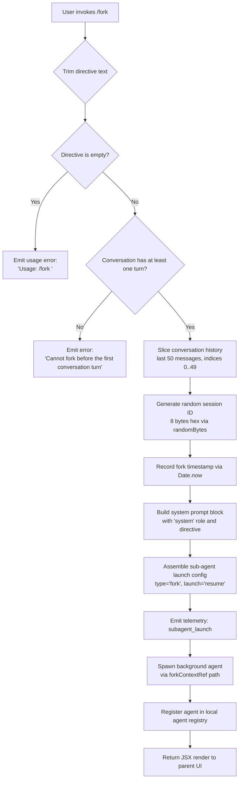

# `/fork`

> Analysis basis: CC v2.1.132 bundle.js (AST extraction + Claude interpretation)
> Minimum version: v2.1.132

---

## Overview

`/fork` spawns a background agent that inherits the full conversation history from the current session. The command takes a directive string, prepends the full conversation context as a system prompt, then launches an independent sub-agent that runs asynchronously while the parent session remains interactive. The forked agent operates in `bg-session` mode with a `resume` launch type, making it suitable for long-running parallel tasks.

---

## Registration

| Field | Value |
|---|---|
| type | `local-jsx` |
| name | `fork` |
| description | `Spawn a background agent that inherits the full conversation` |
| argumentHint | `<directive>` |
| module_id | `_jq` |
| load_inline | `true` |
| handler | `S27` (AsyncFunction, resolved via `module_id` path) |
| `loc_byte_end` | `11696953` |
| `arbor_handler.name` | `S27` |
| `arbor_handler.kind` | `AsyncFunction` |
| `arbor_handler.resolution_path` | `module_id` |
| `arbor_handler.fqn` | `claude-2.1.132::S27` |
| `arbor_handler.n_hits` | `0` |

Analysis basis: CC v2.1.132 bundle.js:+11696757 – +11696953

---

## Input Branching



Analysis basis: CC v2.1.132 bundle.js:+11696361, +11696385, +11696494, +11694058, +11694264, +11694330, +11694343, +11694387

---

## Behavioral Spec

### Entry Point: Handler Dispatch (`S27`)

The Arbor symbol graph identifies `S27` (AsyncFunction, `claude-2.1.132::S27`) as the unambiguous handler for this command, resolved via `module_id` → `_jq`. The handler is the real entry point; the BFS synthetic label is bookkeeping only.

```
async function forkCommandHandler(input, context):
    directive = trim(input.userText)
    if directive is empty:
        return errorMessage("Usage: /fork <directive>")

    conversationMessages = getConversationHistory(context)
    if conversationMessages has no turns:
        return errorMessage("Cannot fork before the first conversation turn")

    // Slice to last 50 messages (indices 0..49)
    slicedHistory = conversationMessages.slice(0, 50)

    sessionId    = randomBytes(8).toString("hex")
    launchTime   = Date.now()

    agentConfig = buildAgentLaunchConfig(
        type    = "fork",
        launch  = "resume",
        mode    = "bg-session",
        history = slicedHistory,
        system  = { role: "system", content: directive }
    )

    emitTelemetry("subagent_launch")

    subAgent = await spawnSubAgent(agentConfig, sessionId)
    registerAgent(subAgent)

    return renderForkConfirmation(subAgent)
```

Analysis basis: CC v2.1.132 bundle.js:+11696361 (`_.trim`), +11694145 (`"fork"`), +11694264 (`"resume"`), +11694330 (slice bound 50), +11694343 (slice bound 49), +11694387 (`Date.now`), +11696425 (`"system"` role), +11694078 (`"subagent_launch"` telemetry key)

---

### Conversation History Snapshot (`y27`)

Before spawning, the handler calls the conversation-snapshot function (`y27`) which reads the current app state and copies message history.

```
function buildConversationSnapshot(appState):
    messages = Array.from(appState.getMessages())
    systemPrompt = appState.getSystemPrompt()

    // Normalise each message: trim whitespace,
    // keep role fields (assistant / user / tool_use / tool_result)
    normalised = messages.map(normaliseMessage)

    return { messages: normalised, systemPrompt }
```

Analysis basis: CC v2.1.132 bundle.js:+11695627 (`H.getAppState`), +11695727 (`Array.from`), +11695807 (`BW`), +11695860 (`iR`)

---

### System Prompt Construction (`iR` / `GP6` chain)

The system prompt for the forked agent is assembled by the same system-prompt builder used for normal sub-agents (`GP6`). Key behaviours:

- Memory files are loaded if auto-memory is enabled (`MVH.isTeamMemoryEnabled`, `MVH.getTeamMemPath`).
- Team memory is merged when available (label `"team"`).
- The combined memory prompt is assembled via `K07.buildCombinedMemoryPrompt`.
- The directive supplied by the user is inserted as a `"system"` role block.
- Language, output-style, session-guidance, and thinking-guidance prompt sections are included from the standard system-prompt pipeline.

Analysis basis: CC v2.1.132 bundle.js:+11853034, +11853060, +11853685, +11696425, +12000450, +12000485

---

### Session ID and Worktree Setup (`FQH` / `KZH` chain)

A new background session directory is created under the `subagents/` path.

```
async function createForkSession(sessionId):
    sessionDir = path.join(subagentsRoot, sessionId)
    await fs.mkdir(sessionDir, { recursive: true })

    // Create a symlink so the agent can locate the session file
    symlinkTarget = buildSessionPath(sessionDir)
    await fs.symlink(...)               // EEXIST is silently swallowed
    await fs.unlink(staleLink)          // clean up any stale prior link

    trackActiveSession(sessionId)       // SXq.add / SXq.delete via finally
    return sessionDir
```

The session is tracked in an in-memory `Set` (`SXq`) with a `finally` guard that removes it on completion or error.

Analysis basis: CC v2.1.132 bundle.js:+11874850, +11874909, +11874886 (`"EEXIST"`), +11872814 (`SXq.add`), +11872825, +11872839 (`SXq.delete`), +11783808 (`"subagents"`)

---

### Agent Launch Config (`FQH` / `cP` / local-agent registration)

```
function buildLocalAgentRecord(sessionId, sessionDir):
    record = {
        id:          sessionId,
        type:        "local_agent",
        status:      "pending"  → "running" after spawn,
        agentType:   "general-purpose",
        launchTime:  Date.now(),
        sessionPath: buildPath(sessionDir)
    }
    L.register(record)   // registers with the local agent registry
    return record
```

The agent type constant `"general-purpose"` is used. Status transitions: `"pending"` → `"running"`.

Analysis basis: CC v2.1.132 bundle.js:+9534121 (`"local_agent"`), +9534166 (`"running"`), +9534240 (`"general-purpose"`), +11875763 (`"pending"`), +9534432 (`L.register`)

---

### Sub-agent Process Spawn (`qC` / `PQH` / agent-runner chain)

Once the session record is registered, the full agent-runner (`qC` → `PQH` → `ug4`) is invoked asynchronously. Relevant observable behaviours:

- **Stall watchdog**: 600 000 ms timeout (10 minutes) before emitting `"subagent_stall_timeout"`.
  - Analysis basis: CC v2.1.132 bundle.js:+7953958 (value `600000`), +7954957 (`"subagent_stall_timeout"`)
- **Completion signal**: `"subagent_complete"` is emitted when the agent exits cleanly.
  - Analysis basis: CC v2.1.132 bundle.js:+7954937 (`"subagent_complete"`)
- **Kill signal**: user-initiated abort emits `"user_kill_async"`.
  - Analysis basis: CC v2.1.132 bundle.js:+7956903 (`"user_kill_async"`)
- **Error exit**: unhandled errors emit `"subagent_async_errored"`.
  - Analysis basis: CC v2.1.132 bundle.js:+7957210 (`"subagent_async_errored"`)
- **Max output-token recovery**: the agent automatically resumes after hitting output-token limits with an injected continuation prompt.
  - Analysis basis: CC v2.1.132 bundle.js:+9033745, +9033840
- **Parent notification**: `"subagent_end"` is emitted on the parent-side channel when the forked agent finishes.
  - Analysis basis: CC v2.1.132 bundle.js:+7951543 (`"subagent_end"`)

---

### Missing Directive Guard

```
function validateDirective(directive):
    if trim(directive).length == 0:
        emitTelemetry("subagent_fork_prompt_missing")
        return { error: "Usage: /fork <directive>" }
    return { ok: true }
```

`"subagent_fork_prompt_missing"` is emitted only when the user runs `/fork` with no argument.

Analysis basis: CC v2.1.132 bundle.js:+11694096 (`"subagent_fork_prompt_missing"`), +11696385 (`"Usage: /fork <directive>"`)

---

### Pre-turn Guard

The fork is rejected before any conversation turn has occurred:

```
if conversationMessages.length == 0:
    return errorMessage("Cannot fork before the first conversation turn")
```

Analysis basis: CC v2.1.132 bundle.js:+11696494 (`"Cannot fork before the first conversation turn"`)

---

### History Truncation

The history slice sent to the forked agent is bounded to the last **50** messages (slice positions 0 through 49). This prevents excessive context being copied into the background agent.

Analysis basis: CC v2.1.132 bundle.js:+11694330 (number `50`), +11694343 (number `49`), +11694333 (`H.slice`)

---

### Background Session Mode and Output Style

The forked agent is launched with `"bg-session"` output-style, which suppresses interactive UI elements. The system-prompt pipeline injects a note that the agent is running as a background agent and that absolute file paths must always be used (because the agent's `cwd` is reset between bash calls).

Analysis basis: CC v2.1.132 bundle.js:+12000784 (`"bg-session"`), +12006001 (absolute-path reminder), +12006925 (`"bg"`), +12007033 (`"worktree"`)

---

### Spare Agent Pre-warming (`Y` / spare-enable path)

CC maintains a pool of pre-warmed spare agent processes. When a fork is successfully launched, the spare-enable telemetry fires to request a replacement spare be pre-warmed.

- `"tengu_bg_spare_enable"` — triggered on successful agent claim.
- `"tengu_bg_spare_spawn"` — replacement spare is spawned.
- `"tengu_bg_spare_claim"` — spare agent claimed by the fork launch.
- `"tengu_bg_spare_claim_fail"` — no spare available; a fresh agent is started instead.

Analysis basis: CC v2.1.132 bundle.js:+14129457, +14129749, +14130886, +14131149

---

## State & Side Effects

| Item | Detail |
|---|---|
| Telemetry — launch | `subagent_launch` (bundle.js:+11694078) |
| Telemetry — missing directive | `subagent_fork_prompt_missing` (bundle.js:+11694096) |
| Telemetry — subagent complete | `subagent_complete` (bundle.js:+7954937) |
| Telemetry — stall timeout | `subagent_stall_timeout` (bundle.js:+7954957) |
| Telemetry — user kill | `user_kill_async` (bundle.js:+7956903) |
| Telemetry — async error | `subagent_async_errored` (bundle.js:+7957210) |
| Telemetry — subagent end | `subagent_end` (bundle.js:+7951543) |
| Telemetry — spare enable | `tengu_bg_spare_enable` (bundle.js:+14129457) |
| Telemetry — spare spawn | `tengu_bg_spare_spawn` (bundle.js:+14129749) |
| Telemetry — spare claim | `tengu_bg_spare_claim` (bundle.js:+14130886) |
| Telemetry — spare claim fail | `tengu_bg_spare_claim_fail` (bundle.js:+14131149) |
| Telemetry — forked agent default turns exceeded | `tengu_forked_agent_default_turns_exceeded` (bundle.js:+5258091) |
| Filesystem | Creates `~/.claude/subagents/<sessionId>/` directory; creates session symlink |
| Active-session set | `SXq.add(sessionId)` on start; `SXq.delete(sessionId)` in `finally` |
| Local agent registry | Agent record registered via `L.register`; status transitions `pending` → `running` |
| appState changes | None in parent — the fork is non-mutating to the parent's conversation state |
| Stall watchdog | 600 000 ms hard timeout on forked agent |
| Hook registration | `SubagentStart` and `SubagentStop` hooks are fired around the forked agent lifecycle (bundle.js:+11903778, +9041969) |
| Sound | <!-- TODO: not found in depth-2 traversal; needs --depth 4 --> |

---

## Version History

| Version | Change |
|---|---|
| v2.1.132 | Initial analysis |

---

## Common Mistakes

1. **Running `/fork` with no argument** — the command silently validates that the directive is non-empty; omitting it emits `subagent_fork_prompt_missing` and shows the usage string rather than doing anything useful.
2. **Running `/fork` as the very first message** — the pre-turn guard rejects the command with "Cannot fork before the first conversation turn". At least one exchange must exist before forking.
3. **Expecting the fork to share live state** — the forked agent receives a snapshot of the first 50 conversation messages at launch time; it does not reflect subsequent parent-session turns.
4. **Assuming the fork blocks the parent** — `/fork` is fully asynchronous; the parent session remains interactive immediately after issuing the command.
5. **Using relative paths inside the forked agent** — the forked agent's working directory is reset between bash calls; all file references must use absolute paths.
6. **Expecting interactive UI inside the fork** — the agent runs in `bg-session` output-style mode; UI-only features (voice, interactive elicitation, etc.) are not available to the forked agent.

---

## Appendix — Identifier Mapping

> For bundle debugging only. Identifiers change across versions.

| Identifier | Role |
|---|---|
| `S27` | Main fork command handler (AsyncFunction, entry point) |
| `Hjq` | Fork session assembler — builds agent launch config from history snapshot |
| `y27` | Conversation history snapshot builder |
| `BW` | System-prompt section aggregator |
| `GP6` | Memory and system-prompt loader |
| `iR` | System-prompt reader (reads `getSystemPrompt` from app state) |
| `FQH` | Sub-agent spawner — orchestrates session-dir creation + process launch |
| `KZH` | Session-directory and symlink setup |
| `vY8` | Active-session set tracker (`SXq.add` / `SXq.delete`) |
| `SbA` | Directory creation helper (`kn.mkdir`) |
| `O3` | Session path builder (`ybA.join`) |
| `hq8` | Session file opener (`kn.open`) |
| `hG` | Sub-agent path resolver (`LbA.get`, `D$.join`) |
| `cP` | Launch timestamp recorder (`Date.now`, `O3`) |
| `Wv` | AbortController factory for agent cancellation |
| `Lq` | AbortController with `setMaxListeners` |
| `qC` | Full agent-runner (main agent execution loop) |
| `PQH` | Agent turn-runner / stall-watchdog manager |
| `ug4` | Core query / API loop (calls model, handles tool execution) |
| `h27` | Directive whitespace trimmer (`H.trim`) |
| `ju` | Session ID generator (`xs1.randomBytes`) |
| `DOH` | Agent model-selector and routing helper |
| `nf` | Logging / notification helper |
| `X78` | Message-history normaliser |
| `wp4` | Tool-use message filter |
| `Jp4` | Tool-result message filter |
| `Yp4` | Code-block message filter |
| `jp4` | Error-message filter |
| `VBH` | Background-session render helper |
| `r46` | Fork confirmation JSX renderer |
| `KG7` | `claude-opus-4-7` model-override section builder |
| `LxA` | Output-style system-prompt section builder (off / additive / compact / focus) |
| `GG7` | Session-guidance system-prompt section builder |
| `uG7` | Thinking-guidance section builder (delegates to `LxA`) |
| `ZG7` | System section assembler (`yH`, `j6`, `k`) |
| `wG7` | Auto-compact/injection-warning section builder |
| `JG7` | Doing-tasks section builder |
| `XG7` | Tool-use section builder |
| `EG7` | Base-agent system section builder |
| `JXq` | Context-reference section builder (`fork-context-ref`) |
| `Y5H` | Auth-provider section builder (`firstParty`, `anthropicAws`) |
| `HxA` | Conversation-snapshot helper (`yH`) |
| `gs1` | REPL-context hydration helper |
| `Oi9` | MCP-plugin section builder |
| `uA` | User-settings injector |
| `NG7` | Environment-info section builder (`AxA`, `Om`) |
| `vG7` | Git-worktree environment builder |
| `hG7` | Background-mode section builder (`me`, `tDH`) |
| `xG7` | Focus-mode section builder (`vA`, `uA`, `R6`) |
| `fG7` | Code-style section builder (`s3`) |
| `MG7` | Model-override section builder (`ebA`) |
| `CG7` | <!-- TODO: not found in depth-2 traversal; needs --depth 4 --> |
| `SG7` | <!-- TODO: not found in depth-2 traversal; needs --depth 4 --> |
| `TG7` | <!-- TODO: not found in depth-2 traversal; needs --depth 4 --> |
| `YG7` | <!-- TODO: not found in depth-2 traversal; needs --depth 4 --> |
| `zG7` | <!-- TODO: not found in depth-2 traversal; needs --depth 4 --> |
| `DG7` | <!-- TODO: not found in depth-2 traversal; needs --depth 4 --> |
| `yG7` | <!-- TODO: not found in depth-2 traversal; needs --depth 4 --> |
| `OG7` | <!-- TODO: not found in depth-2 traversal; needs --depth 4 --> |
| `vH` | String coercion utility |
| `AZ` | File-write helper (`FNH.writeFileSync`, `IG8.join`) |
| `H` | Random-jitter helper (`Math.random`, `setTimeout`); also used as generic context ref |
| `fH` | Error logger (`EQ.logError`, `kyH.push`) |
| `SH` | State-write helper (`d`) |
| `yH` | String converter (`String`) |
| `j6` | Telemetry event emitter (deduplication via `kq6`, `mU`) |
| `k` | Model-name formatter (`A.toUpperCase`, `H.trim`) |
| `M` | MCP tool aggregator and router |
| `ZBq` | MCP update applier (`H.applyMcpUpdate`) |
| `UZH` | MCP connection state machine |
| `$F7` | MCP client refresh orchestrator |
| `El` | Tool permission context builder |
| `sjA` | Tool-filter helper |
| `Q$` | Sub-command parser helper |
| `zj` | Tool renderer (`ch`, `Iq`, `yH`, `j6`) |
| `MD` | Message-display helper (`yH`) |
| `LH` | Main UI render loop / input handler |
| `qC` | Full agent session runner (see above) |
| `J6` | Agent turn loop and orchestrator |
| `wH` | Agent turn loop (mirrors `J6` — parallel/re-entrant path) |
| `iX` | Sub-agent hook executor |
| `nY6` | Sub-agent initialiser |
| `aK` | Agent-state builder (`v6`, `xN`, `qN`, `N6`) |
| `zzH` | Agent-context assembler (`iX`, `hG`, `aK`) |
| `Uy` | Tool-output renderer (`sB`, `kj`, `Mp`, `Kb`) |
| `ZR` | Agent exit / compact orchestrator |
| `ug4` | Core model-query loop (see above) |
| `me6` | Agent exit finisher (`ue6`, `ss1`) |
| `qEA` | Fork-context reference resolver (`hK`) |
| `hK` | Session-handle resolver (`N1`) |
| `zs` | Session stream helper (`hK`, `PP6`) |
| `qD6` | Agent metadata writer (`yK.writeFile`, `.meta.json`, `.jsonl`) |
| `ajq` | Agent path helper (`hG`) |
| `RH` | JSON serialiser wrapper (`JSON.stringify`) |
| `HMA` | Sub-agent launch wrapper (`Wv`, `H.getAppState`, `z_H`) |
| `z_H` | State-dump / load helper (`ax`, `A.load`, `H.dump`) |
| `at6` | Activity tracker (`va1`, `Va1`, `rt6.set`, `O64`) |
| `fGH` | Activity cleanup (`rt6.delete`, `hfA.delete`) |
| `_EA` | Agent-map cleanup (`LbA.delete`) |
| `AEA` | Agent-map setter (`LbA.set`) |
| `_p9` | Monitor update dispatcher (`edH`, `KmH`) |
| `edH` | Monitor entry updater (`A.update`, `uO`) |
| `KmH` | Notification queue pusher (`e3.push`, `qMH`, `PWH`) |
| `r46` | Fork launch UI component renderer |
| `VBH` | Background-session status display renderer |
| `gq` | <!-- TODO: not found in depth-2 traversal; needs --depth 4 --> |
| `fw` | <!-- TODO: not found in depth-2 traversal; needs --depth 4 --> |
| `mH` | Debug/no-op helper (`d`) |
| `ju` | Random-bytes session-ID generator (`xs1.randomBytes`) |