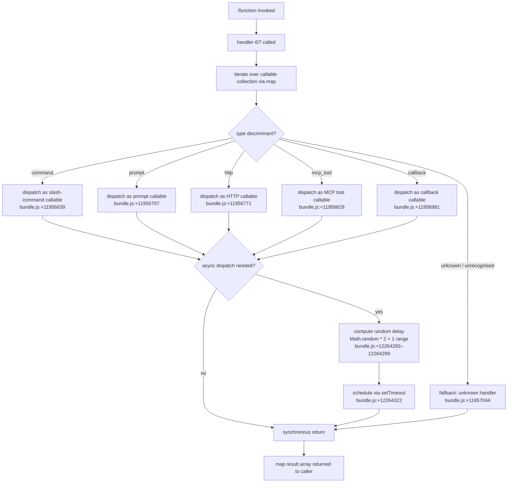

# `/function`

> Analysis basis: CC v2.1.132 bundle.js (AST extraction + Claude interpretation)
> Minimum version: v2.1.132

---

## Overview

The `/function` command is a registration-type slash command that classifies and dispatches callable items by their kind. It iterates over a collection of registered callables, categorises each by a type discriminant (one of `"command"`, `"prompt"`, `"http"`, `"mcp_tool"`, `"callback"`, or `"unknown"`), and resolves the appropriate handler. A stochastic delay mechanism (`Math.random` + `setTimeout`) is present in the depth-2 call graph, suggesting asynchronous or debounced dispatch for at least one callable class.

---

## Registration

| Field | Value |
|---|---|
| type | `function` |
| name | `function` |
| description | `null` |
| loc_byte | `11956930` |
| loc_byte_end | `11956963` |
| loc_line | `8852` |
| handler | `i07` (resolved via `direct` path; see Appendix) |
| `arbor_handler.name` | `i07` |
| `arbor_handler.kind` | `Function` |
| `arbor_handler.resolution_path` | `direct` |
| `arbor_handler.fqn` | `claude-2.1.132::i07` |
| `arbor_handler.n_hits` | `1` |

Analysis basis: CC v2.1.132 bundle.js:+11956930

---

## Input Branching

The handler `i07` maps over a collection (`H.map`) and branches on the type discriminant of each entry. Six discriminant strings are present in the literal table; an `"unknown"` fallback guards unrecognised kinds.



Analysis basis: CC v2.1.132 bundle.js:+11956608, +11956639, +11956707, +11956771, +11956829, +11956981, +11957044

---

## Behavioral Spec

### Callable Collection Iteration

```
function functionCommandHandler(context):
    callables = resolveCallableCollection(context)   // H.map target
    results = callables.map(entry =>
        dispatchByKind(entry)
    )
    return results
```

Analysis basis: CC v2.1.132 bundle.js:+11956608

---

### Kind Discriminant Dispatch

```
function dispatchByKind(entry):
    switch entry.type:
        case "command":
            return handleAsCommand(entry)
        case "prompt":
            return handleAsPrompt(entry)
        case "http":
            return handleAsHttp(entry)
        case "mcp_tool":
            return handleAsMcpTool(entry)
        case "callback":
            return handleAsCallback(entry)
        default:                          // "unknown"
            return handleAsUnknown(entry)
```

Analysis basis: CC v2.1.132 bundle.js:+11956639 (`"command"`), +11956707 (`"prompt"`), +11956771 (`"http"`), +11956829 (`"mcp_tool"`), +11956981 (`"callback"`), +11957044 (`"unknown"`)

---

### Asynchronous Delay Mechanism

A random delay is introduced for at least one dispatch path within the callable collection's dependency (`H`). The numeric literals `2` and `1` at adjacent byte offsets, combined with `Math.random`, indicate a jitter window. The computed delay is passed to `setTimeout`.

```
function computeJitteredDelay():
    // numeric constants: 2 (loc +12264283), 1 (loc +12264299)
    base    = 1
    jitter  = Math.random() * 2
    delayMs = base + jitter          // range: [1, 3) ms
    return delayMs

function scheduleWithJitter(fn):
    delay = computeJitteredDelay()
    setTimeout(fn, delay)            // loc +12264322
```

> **Note:** The depth-2 traversal places `Math.random` and `setTimeout` inside `H`, which is the collection dependency, not the top-level handler `i07` itself. Whether every dispatch path uses this jitter, or only specific kinds, cannot be determined without a deeper traversal.

Analysis basis: CC v2.1.132 bundle.js:+12264283, +12264285, +12264299, +12264322

---

## State & Side Effects

| Item | Detail |
|---|---|
| Telemetry | None detected in depth-2 traversal |
| Hook registration | <!-- TODO: not found in depth-2 traversal; needs --depth 4 --> |
| appState changes | <!-- TODO: not found in depth-2 traversal; needs --depth 4 --> |
| Async side effects | `setTimeout` scheduled for at least one callable class (bundle.js:+12264322) |
| Sound | <!-- TODO: not found in depth-2 traversal; needs --depth 4 --> |

---

## Version History

| Version | Change |
|---|---|
| v2.1.132 | Initial analysis |

---

## Common Mistakes

1. **Assuming `/function` is a developer utility** — the registration `type` is `"function"`, which is the command's own type token, not a signal that it exposes raw function editing. Its purpose is callable-kind dispatch across five registered categories.
2. **Expecting a description in the UI** — `description` is `null` in the registration object (bundle.js:+11956930), so the command may appear without a help string in command palettes or `/help` output.
3. **Treating dispatch as fully synchronous** — the presence of `Math.random` + `setTimeout` in the call graph means at least one path returns a pending promise or defers a side effect; callers should not assume immediate completion for all callable kinds.
4. **Missing the `"unknown"` fallback** — unrecognised type discriminants do not throw; they are silently routed to the `"unknown"` handler (bundle.js:+11957044). This can mask misconfigured callable registrations.
5. **Confusing `"callback"` with `"command"`** — both are distinct discriminant strings with separate dispatch branches; conflating them may cause incorrect callable wiring when registering new entries.

---

## Appendix — Identifier Mapping

> For bundle debugging only. Identifiers change across versions.

| Identifier | Role |
|---|---|
| `i07` | Primary handler for `/function` command; entry point resolved via `direct` path against the registration byte range (bundle.js:+11956930–+11956963) |
| `H` | Callable collection object (or module) iterated by `i07` via `H.map`; contains the `Math.random` / `setTimeout` async delay logic at depth 2 (bundle.js:+12264285, +12264322) |