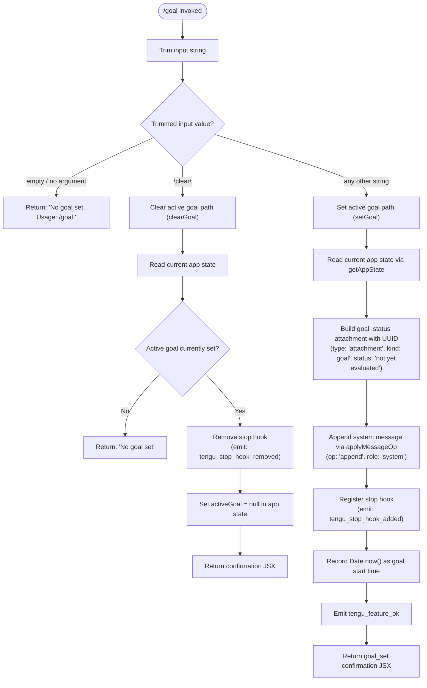

# `/goal`

> Analysis basis: CC v2.1.132 bundle.js (AST extraction + Claude interpretation)
> Minimum version: v2.1.132

---

## Overview

The `/goal` command sets a persistent completion condition that the agent monitors across iterations. When invoked with a condition string, the agent keeps working autonomously until it evaluates that condition as satisfied. Invoking with the literal keyword `clear` removes the active goal and stops the loop.

---

## Registration

| Field | Value |
|---|---|
| `type` | `local-jsx` |
| `name` | `goal` |
| `description` | `Set a goal — keep working until the condition is met` |
| `argumentHint` | `[<condition> \| clear]` |
| `immediate` | `true` |
| `module_id` | `Uwq` |
| `load_inline` | `true` |
| `handler` | `oX7` (AsyncFunction, resolved via `module_id` path) |
| `loc_byte_end` | `11615172` |
| `arbor_handler.name` | `oX7` |
| `arbor_handler.kind` | `AsyncFunction` |
| `arbor_handler.resolution_path` | `module_id` |
| `arbor_handler.fqn` | `claude-2.1.132::oX7` |
| `arbor_handler.n_hits` | `0` |

Analysis basis: CC v2.1.132 bundle.js:+11614952–11615172

---

## Input Branching

The handler first trims the raw input string, then dispatches based on the resulting value.



Analysis basis: CC v2.1.132 bundle.js:+11613866 (trim), +11613958 (clear branch), +11613892 (set branch)

---

## Behavioral Spec

### 1. Entry Point — `goalCommandHandler` (handler: `oX7`)

The top-level handler is an `AsyncFunction`. It receives the raw argument string and orchestrates all sub-operations.

```
async function goalCommandHandler(rawInput, appContext):
    trimmedInput = trim(rawInput)                          // _.trim

    if trimmedInput is empty:
        return errorMessage("No goal set. Usage: `/goal <condition>`")

    sessionInfo   = buildSessionInfo(appContext)           // aX7
    randomDelay   = computeRandomJitter()                  // H (uses Math.random, setTimeout, factor 2)
    appState      = appContext.getAppState()

    if trimmedInput.toLowerCase() == "clear":
        return clearActiveGoal(appState)                   // dnH
    else:
        return setActiveGoal(trimmedInput, appState)       // QnH

    return renderResultJSX(...)                            // rX7
```

Analysis basis: CC v2.1.132 bundle.js:+11613866, +11613892, +11613894, +11613898, +11613973, +11614182, +11614240

---

### 2. Session Info Builder — `buildSessionInfo` (`aX7`)

Collects context needed for the goal (queue state, elapsed time).

```
function buildSessionInfo(appContext):
    queueState  = readQueue(appContext)                    // Q8
    elapsed     = computeElapsedTime(appContext)           // gN → BHH
    return { queueState, elapsed }
```

#### Elapsed Time Formatter — `formatElapsed` (`BHH` via `gN`)

Computes human-readable elapsed duration using a fixed time-unit ladder:

| Unit | Threshold (seconds) | Display suffix |
|---|---|---|
| year | 31,536,000 | `year` |
| month | 2,592,000 | `mo` |
| week | 604,800 | `week` |
| day | 86,400 | `day` |
| hour | 3,600 | `hour` |
| minute | 60 | `minute` |
| second | 1 | `second` |

- Times are compared using `getTime()` with millisecond resolution divided by 1000 (bundle.js:+166711).
- Truncation uses `Math.trunc`; absolute value uses `Math.abs` (bundle.js:+166698, +167063).
- Locale is fixed to `"en"` with style `"long"` (bundle.js:+163701, +167178).
- A cached `Intl.RelativeTimeFormat` instance is stored and retrieved via `WnA.get` / `WnA.set` (bundle.js:+163654, +163727).
- Special-case zero output: `"0s ago"` or `"in 0s"` (bundle.js:+167228, +167237).
- The iteration label `"iteration"` is also recorded at this stage (bundle.js:+11613333).

Analysis basis: CC v2.1.132 bundle.js:+167341, +166672, +166684, +166698

---

### 3. Set Goal Path — `setActiveGoal` (`QnH`)

```
async function setActiveGoal(conditionText, appState):
    // 1. Prepare state
    stateSnapshot = appState.getAppState()                 // A.getAppState

    // 2. Append goal-status system message
    attachmentId  = generateAttachmentId()                 // $O7 → Ffq.randomUUID
    attachment    = {
        type:   "attachment",
        kind:   "goal",
        status: "not yet evaluated",
        text:   conditionText
    }
    appendSystemMessage(stateSnapshot, attachment)         // iO8 → uOH (L.set, iv9)
    // message role: "prompt", op: "append"

    // 3. Register stop hook
    appState.setActiveGoal({
        condition: conditionText,
        startTime: Date.now(),
        attachmentId
    })                                                     // A.setActiveGoal

    // 4. Emit telemetry
    emitTelemetry("tengu_stop_hook_added")                 // loc: +11164611
    emitFeatureOk("goal_set")                              // SH → tengu_feature_ok, loc: +906461

    return buildGoalSetResponse(conditionText)             // d
```

Analysis basis: CC v2.1.132 bundle.js:+11164422, +11164548, +11164596, +11164609, +11164671, +11165014

---

### 4. Clear Goal Path — `clearActiveGoal` (`dnH`)

```
async function clearActiveGoal(appState):
    // 1. Validate
    stateSnapshot = appState.getAppState()                 // H.getAppState

    if stateSnapshot.activeGoal is null or undefined:
        return staticMessage("No goal set")               // literal: +11613998

    // 2. Inject "Stop" system message to halt iteration
    stopMsg = buildSystemMessage("Stop")                  // v6, iO8 → _.push
    // role: "prompt"

    // 3. Remove stop hook and clear goal state
    appState.setActiveGoal(null)                          // H.setActiveGoal
    appState.applyMessageOp(stopMsg, { op: "append" })    // H.applyMessageOp, literal: +11164895

    // 4. Emit telemetry
    emitTelemetry("tengu_stop_hook_removed")              // loc: +11164926

    return buildClearResponse()                           // d
```

Analysis basis: CC v2.1.132 bundle.js:+11164708, +11164715, +11164719, +11164848, +11164872, +11164914, +11164924

---

### 5. Random Jitter Delay — `computeRandomJitter` (`H`)

A small randomized delay is introduced to prevent synchronization artifacts between iterations.

```
function computeRandomJitter():
    factor = 2                                            // literal: +12264283
    delay  = Math.random() * factor
    setTimeout(resolve, delay)
    return delay
```

Analysis basis: CC v2.1.132 bundle.js:+12264285, +12264322

---

### 6. Goal Status Attachment Format

When a goal is set, a structured attachment is appended to the conversation as a system-role message. The attachment carries:

| Field | Value |
|---|---|
| `type` | `"attachment"` |
| `kind` | `"goal"` |
| `status` | `"not yet evaluated"` (initial) |
| `id` | UUID generated via `crypto.randomUUID()` |

The status field is expected to be updated by the agent as it evaluates the condition across iterations (bundle.js:+11613278 for initial value, +11165083 for the `"goal_status"` key).

Analysis basis: CC v2.1.132 bundle.js:+11164957, +11164996, +11165083, +11165014

---

### 7. Process Exit on Uncaught Spare Error — `exitOnUncaughtSpare` (reached via `K`)

A separate code path reachable from the close/cleanup branch handles a fatal-error scenario labeled `"spare_uncaught"`. It:

1. Closes open handles (`_.close`, `q.close`).
2. Calls `tgq.unlinkSync` to remove a temporary file (bundle.js:+14110155).
3. Writes an exit-state file via `AZ` → `FNH.writeFileSync` / `IG8.join` (bundle.js:+149948, +149966).
4. Calls `process.exit(1)` (bundle.js:+14110307).

This path is not directly triggered by `/goal` logic but is reachable from the same module's shared cleanup utilities.

Analysis basis: CC v2.1.132 bundle.js:+14139789, +14139791, +14139801, +14139941, +14110155, +14110289, +14110307

---

## State & Side Effects

| Item | Detail |
|---|---|
| **Telemetry: `tengu_stop_hook_added`** | Emitted when a new goal condition is registered (bundle.js:+11164611) |
| **Telemetry: `tengu_stop_hook_removed`** | Emitted when the active goal is cleared via `clear` (bundle.js:+11164926) |
| **Telemetry: `tengu_feature_ok`** | Emitted on successful `goal_set` completion (bundle.js:+906461) |
| **Stop hook registration** | `/goal <condition>` registers a stop hook against the session's stop-hook list; `/goal clear` removes it |
| **`appState.activeGoal`** | Set to goal object `{ condition, startTime, attachmentId }` on set; set to `null` on clear |
| **System message injection** | A `"prompt"`-role system message with a `"goal_status"` attachment is appended to conversation history on set; a `"Stop"` system message is appended on clear |
| **UUID generation** | `crypto.randomUUID()` called once per goal set to identify the attachment |
| **Random jitter** | A `Math.random() * 2` millisecond delay is introduced at handler entry |
| **Process exit** | `process.exit(1)` reachable via spare-uncaught cleanup path in the same module |
| **Sound** | <!-- TODO: not found in depth-2 traversal; needs --depth 4 --> |

---

## Usage Notes

- The hint string `"`/goal clear` to remove"` (bundle.js:+11613435) is surfaced in the UI when a goal is active.
- The `immediate: true` flag means the command executes without waiting for the agent to finish any in-progress turn.
- Column padding of 40 characters is applied to display output (literal `40` at bundle.js:+14154022); two-space separator `"  "` used between columns (bundle.js:+14152051).

---

## Version History

| Version | Change |
|---|---|
| v2.1.132 | Initial analysis |

---

## Common Mistakes

1. **Invoking `/goal` with no argument** — returns the usage hint `"No goal set. Usage: /goal <condition>"` rather than doing anything; you must supply a non-empty condition string.
2. **Expecting `/goal clear` to error when no goal is set** — it returns the silent message `"No goal set"` without an error code or exception; callers should not treat this as a failure state.
3. **Assuming `/goal` blocks** — the `immediate: true` flag means it fires synchronously relative to the current turn; the goal evaluation loop is driven by the stop hook, not by a blocking wait in the handler.
4. **Reusing a goal across sessions** — `activeGoal` is stored in `appState`, which is session-scoped; restarting Claude Code clears the goal silently.
5. **Setting a new goal without clearing the old one** — the handler does not check whether a goal is already active before registering a new stop hook; calling `/goal <new-condition>` while a goal is active will overwrite `appState.activeGoal` but the old stop hook behavior depends on the runtime's deduplication logic, which is <!-- TODO: not found in depth-2 traversal; needs --depth 4 -->.

---

## Appendix — Identifier Mapping

> For bundle debugging only. Identifiers change across versions.

| Identifier | Role |
|---|---|
| `oX7` | Main async handler for `/goal` command (`goalCommandHandler`) |
| `_` | Module-level utility / string helper namespace (hosts `trim`, `close`, `push`) |
| `f` | File/handle object in cleanup path (hosts `close`, `padEnd`) |
| `q` | Secondary handle in cleanup path (hosts `close`); also calls `tgq.unlinkSync` |
| `K` | Spare-uncaught cleanup orchestrator (calls `vH`, `AZ`, `process.exit`) |
| `vH` | String coercion helper (wraps `String()`) |
| `AZ` | Exit-state file writer (calls `FNH.writeFileSync`, `IG8.join`) |
| `H` | Random jitter delay function (uses `Math.random`, `setTimeout`) |
| `aX7` | Session info builder (calls queue reader `Q8` and elapsed-time formatter `gN`) |
| `Q8` | Queue state reader |
| `gN` | Elapsed time computation wrapper (delegates to `BHH`) |
| `BHH` | Human-readable relative-time formatter (time-unit ladder, `Intl.RelativeTimeFormat`) |
| `L` | Row/line formatter (hosts `map`, `padEnd`) |
| `uG8` | `Intl.RelativeTimeFormat` cache manager (get/set via `WnA`) |
| `A` | App context / state accessor object (hosts `getAppState`, `setActiveGoal`) |
| `dnH` | Clear-goal path handler (`clearActiveGoal`) |
| `v6` | System message builder helper |
| `iO8` | Message list mutator (appends to conversation list; calls `uOH`, `_.push`) |
| `uOH` | Conversation state setter (calls `L.set`, `iv9`) |
| `iv9` | Conversation map transform (calls `H.map`) |
| `$O7` | Goal attachment builder (calls `Ffq.randomUUID`) |
| `d` | JSX response renderer (shared across set and clear paths) |
| `QnH` | Set-goal path handler (`setActiveGoal`) |
| `SH` | Feature-OK telemetry emitter (calls `d`, emits `tengu_feature_ok`) |
| `rX7` | Final JSX render step for the goal command result |