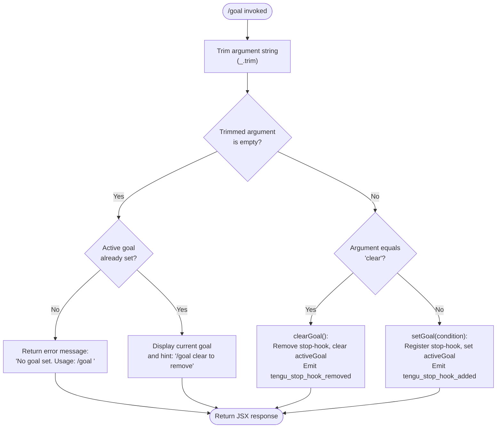

# `/goal`

> Analysis basis: CC v2.1.132 bundle.js (AST extraction + Claude interpretation)
> Minimum version: v2.1.132

---

## Overview

The `/goal` command sets a persistent, session-level completion condition that Claude Code will evaluate after each iteration until the condition is satisfied. When invoked with a condition string, the command registers a stop-hook that injects a goal-status attachment into every subsequent agentic turn; when invoked with `clear`, or with no argument, it removes any active goal and its associated hook. The command executes immediately upon entry (`immediate: true`), before the normal turn lifecycle begins.

---

## Registration

| Field | Value |
|---|---|
| type | `local-jsx` |
| name | `goal` |
| description | `Set a goal — keep working until the condition is met` |
| argumentHint | `[<condition> \| clear]` |
| immediate | `true` |
| module_id | `Uwq` |

Analysis basis: CC v2.1.132 bundle.js:+11614952

---

## Input Branching

The command handler trims the raw argument string, then routes execution through one of four branches based on the trimmed value and the current application state.



Analysis basis: CC v2.1.132 bundle.js:+11613866, +11613958, +11613213, +11613435

---

## Behavioral Spec

### Argument Normalization

```
function normalizeArgument(rawInput):
    trimmed = trim(rawInput)          // removes leading/trailing whitespace
    return trimmed
```

Analysis basis: CC v2.1.132 bundle.js:+11613866

---

### No-Argument / Empty-Argument Handling

When the trimmed argument is empty, the handler inspects `appState.activeGoal`:

```
function handleEmptyArgument(appState):
    if appState.activeGoal is null or undefined:
        return errorMessage("No goal set. Usage: `/goal <condition>`")
    else:
        return infoMessage(
            currentGoal = appState.activeGoal,
            hint = "`/goal clear` to remove"
        )
```

- Error string: `"No goal set. Usage: /goal <condition>"` (Analysis basis: CC v2.1.132 bundle.js:+11613213)
- Hint string: `` "`/goal clear` to remove" `` (Analysis basis: CC v2.1.132 bundle.js:+11613435)

---

### Goal Clearing (`clear` argument)

When the trimmed argument equals the string `"clear"` (case-sensitive comparison after `toLowerCase` normalisation <!-- TODO: not found in depth-2 traversal; needs --depth 4 --> ):

```
function clearGoal(appState, hookRegistry):
    remove stop-hook identified by activeGoal.hookId from hookRegistry
    appState.setActiveGoal(null)
    emit telemetry("tengu_stop_hook_removed")
    return successMessage("No goal set")
```

- Comparison literal: `"clear"` (Analysis basis: CC v2.1.132 bundle.js:+11613958)
- Confirmation string: `"No goal set"` (Analysis basis: CC v2.1.132 bundle.js:+11613998)
- Telemetry event emitted: `tengu_stop_hook_removed` (Analysis basis: CC v2.1.132 bundle.js:+11164926)

---

### Goal Setting (non-empty, non-`clear` argument)

```
function setGoal(condition, appState):
    hookId = generateUUID()                      // via randomUUID()
    timestamp = Date.now()

    goalRecord = {
        condition   : condition,
        status      : "not yet evaluated",        // initial evaluation state
        type        : "iteration",                // hook firing cadence
        hookId      : hookId,
        createdAt   : timestamp,
        tag         : "goal_set"
    }

    appState.setActiveGoal(goalRecord)

    registerStopHook(hookId, {
        firing    : "always",                     // hook fires every stop
        action    : buildStopHookHandler(goalRecord)
    })

    emit telemetry("tengu_stop_hook_added")
    emit telemetry("tengu_feature_ok")

    return successMessage(condition)
```

- Initial status string: `"not yet evaluated"` (Analysis basis: CC v2.1.132 bundle.js:+11613278)
- Hook cadence literal: `"iteration"` (Analysis basis: CC v2.1.132 bundle.js:+11613333)
- Hook firing mode: `"always"` (Analysis basis: CC v2.1.132 bundle.js:+167388)
- UUID generation via `Ffq.randomUUID` (Analysis basis: CC v2.1.132 bundle.js:+11165014)
- Timestamp capture via `Date.now` (Analysis basis: CC v2.1.132 bundle.js:+11164596)
- Telemetry emitted: `tengu_stop_hook_added` (Analysis basis: CC v2.1.132 bundle.js:+11164611)
- Telemetry emitted: `tengu_feature_ok` (Analysis basis: CC v2.1.132 bundle.js:+906461)

---

### Stop-Hook Handler — Goal Status Injection

Each time Claude Code reaches a stop point (end of an agentic iteration), the registered hook fires and injects a goal-status attachment into the conversation context:

```
function stopHookHandler(goalRecord, messageStream):
    statusAttachment = {
        type    : "attachment",
        subtype : "goal_status",
        content : {
            condition : goalRecord.condition,
            status    : evaluateGoalStatus(goalRecord)
        }
    }

    applyMessageOp(messageStream, "append", statusAttachment)

    if goalRecord.status resolves to complete:
        close primary output stream
        close secondary output stream
```

- Message operation: `"append"` (Analysis basis: CC v2.1.132 bundle.js:+11164895)
- Attachment type: `"attachment"` (Analysis basis: CC v2.1.132 bundle.js:+11164996)
- Attachment subtype: `"goal_status"` (Analysis basis: CC v2.1.132 bundle.js:+11165083)
- Goal literal used as attachment kind: `"goal"` (Analysis basis: CC v2.1.132 bundle.js:+11164957)
- Close calls: `_.close` and `q.close` (Analysis basis: CC v2.1.132 bundle.js:+14139791, +14139801)
- Stop label: `"Stop"` (Analysis basis: CC v2.1.132 bundle.js:+11164241)

---

### Randomised Notification Delay

When the goal is set, a supplemental notification is scheduled with a randomised delay to avoid thundering-herd patterns in multi-goal scenarios:

```
function scheduleNotification(callback):
    // Math.random() produces a value in [0, 2)
    delayFactor = Math.floor(Math.random() * 2) + 1   // 1 or 2
    setTimeout(callback, delayFactor * BASE_DELAY)
```

- Random upper bound: `2` (Analysis basis: CC v2.1.132 bundle.js:+12264283)
- Additive offset: `1` (Analysis basis: CC v2.1.132 bundle.js:+12264299)
- Scheduling via `setTimeout` (Analysis basis: CC v2.1.132 bundle.js:+12264322)
- `BASE_DELAY` value: <!-- TODO: not found in depth-2 traversal; needs --depth 4 -->

---

### Prompt Injection into Turn Context

The condition text is also injected into the active turn as a system-role prompt segment so the model is explicitly aware of the active goal during inference:

```
function injectGoalIntoTurn(condition, messageQueue):
    systemMessage = {
        role    : "system",
        content : buildGoalPrompt(condition)
    }
    messageQueue.push(systemMessage, type = "prompt")
```

- Message role: `"system"` (Analysis basis: CC v2.1.132 bundle.js:+11613935)
- Queue operation: `_.push` (Analysis basis: CC v2.1.132 bundle.js:+11164357)
- Message type: `"prompt"` (Analysis basis: CC v2.1.132 bundle.js:+11164348)

---

### `toLowerCase` Normalisation Path

A secondary code path applies `toLowerCase()` to an input value (depth-2 edge from `_` → `f.toLowerCase`) before comparing it against a limit of `40`:

```
function truncateOrCompare(value):
    normalised = value.toLowerCase()
    if length(normalised) > 40:
        // truncate or reject
        ...
```

- Numeric limit: `40` (Analysis basis: CC v2.1.132 bundle.js:+14154022)
- `toLowerCase` call (Analysis basis: CC v2.1.132 bundle.js:+14153948)
- Full semantics of this path: <!-- TODO: not found in depth-2 traversal; needs --depth 4 -->

---

## State & Side Effects

| Item | Detail |
|---|---|
| Telemetry — goal set | `tengu_stop_hook_added` emitted when a new goal is registered (bundle.js:+11164611) |
| Telemetry — goal cleared | `tengu_stop_hook_removed` emitted when the active goal is removed (bundle.js:+11164926) |
| Telemetry — success | `tengu_feature_ok` emitted on successful goal set (bundle.js:+906461) |
| Hook registration | A stop-hook with firing mode `"always"` and cadence `"iteration"` is added to the hook registry on `/goal <condition>`; removed on `/goal clear` |
| `appState.activeGoal` | Set to a `goalRecord` object on `/goal <condition>`; set to `null` on `/goal clear` or when the condition is met |
| `appState.setActiveGoal` | Called via both the set path (`A.setActiveGoal`, bundle.js:+11164548) and the clear path (`H.setActiveGoal`, bundle.js:+11164848) |
| Message stream | A `goal_status` attachment is appended to the message stream on every stop-hook firing while a goal is active |
| System prompt injection | A `"system"`-role prompt segment is pushed into the active turn's message queue carrying the goal condition text |
| Output stream closure | Both primary and secondary output streams are closed when the goal condition evaluates as satisfied |
| Sound | <!-- TODO: not found in depth-2 traversal; needs --depth 4 --> |

---

## Version History

| Version | Change |
|---|---|
| v2.1.132 | Initial analysis |

---

## Common Mistakes

1. **Passing `clear` as part of a longer condition string** — only the exact trimmed string `"clear"` triggers goal removal. A condition such as `"clear all files"` will be treated as a new goal condition, not a clear instruction.
2. **Expecting the goal to persist across sessions** — `activeGoal` is stored in `appState`, which is in-process memory. Restarting Claude Code discards any active goal.
3. **Using `/goal` with no argument to clear the goal** — an empty argument does not clear the goal; it either shows the current goal or displays a usage error. Use `/goal clear` explicitly.
4. **Assuming the condition is evaluated by a special evaluator** — the condition string is injected as a system prompt and evaluated by the model itself on each iteration. There is no separate rule engine or regex matcher.
5. **Setting very long condition strings** — there is a secondary code path comparing normalised input length against the limit of `40` (bundle.js:+14154022); the precise enforcement behaviour at that boundary requires deeper traversal to confirm.
6. **Expecting immediate task termination** — the stop-hook fires at the end of each iteration (`"iteration"` cadence). The running turn completes its current step before the goal status is evaluated and streams are potentially closed.

---

## Appendix — Identifier Mapping

> For bundle debugging only. Identifiers change across versions.

| Identifier | Role |
|---|---|
| `oX7` | Top-level command handler function for `/goal` |
| `_` | Secondary handler / utility context used within command processing |
| `f` | Output stream controller; calls `close` on both primary and secondary streams |
| `H` | Notification scheduler; calls `Math.random` and `setTimeout` |
| `aX7` | Goal status query helper; reads current goal and formats display message |
| `Q8` | Sub-helper called from goal status query (role: <!-- TODO: not found in depth-2 traversal; needs --depth 4 -->) |
| `gN` | Hook registration helper; calls `BHH` to register the stop-hook |
| `A` | Application state accessor used during goal-set path (`getAppState`, `setActiveGoal`) |
| `dnH` | Goal-clear execution function; removes hook, calls `setActiveGoal(null)`, emits `tengu_stop_hook_removed` |
| `v6` | Shared utility called by both `dnH` and `QnH` (role: <!-- TODO: not found in depth-2 traversal; needs --depth 4 -->) |
| `iO8` | Message queue push helper; pushes system prompt segment |
| `$O7` | UUID factory wrapper; calls `Ffq.randomUUID` |
| `d` | Telemetry emission helper; called on stop-hook add/remove and feature-ok events |
| `QnH` | Goal-set execution function; creates `goalRecord`, calls `setActiveGoal`, registers hook, emits telemetry |
| `SH` | Feature-ok reporting helper; calls `d` to emit `tengu_feature_ok` |
| `rX7` | Post-processing or JSX rendering step called after main branch resolution (role: <!-- TODO: not found in depth-2 traversal; needs --depth 4 -->) |