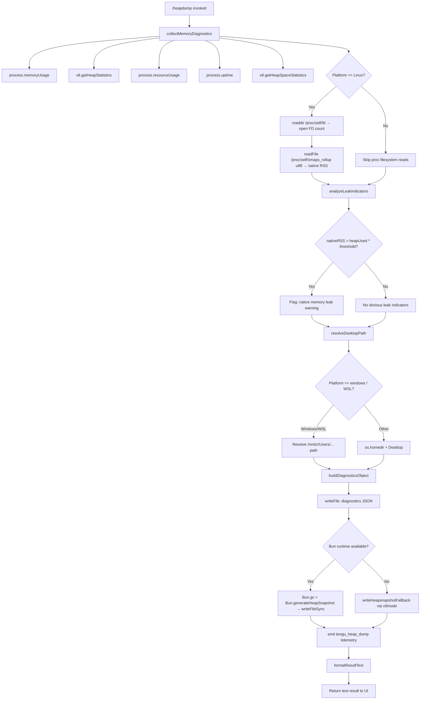

# `/heapdump`

> Analysis basis: CC v2.1.132 bundle.js (AST extraction + Claude interpretation)
> Minimum version: v2.1.132

---

## Overview

The `/heapdump` command captures a comprehensive snapshot of the Claude Code process's JavaScript heap and memory diagnostics, writing output files to the user's Desktop directory. It collects V8 heap statistics, process memory figures, resource usage, open file-descriptor counts, and smaps data (on Linux), then generates a `.heapsnapshot` file inspectable in Chrome DevTools, together with a structured JSON diagnostics report. The command is hidden from the default command palette and is intended for debugging memory-leak investigations.

---

## Registration

| Field | Value |
|---|---|
| type | `local` |
| name | `heapdump` |
| description | `Dump the JS heap to ~/Desktop` |
| supportsNonInteractive | `true` |
| isHidden | `true` |
| module_id | `C3q` |

Analysis basis: CC v2.1.132 bundle.js:+11262787

---

## Input Branching

The command entry point (the command handler, `commandHandler`) delegates immediately to the primary execution function (`executeHeapdump`). There are no user-supplied arguments that change the high-level flow; branching occurs inside the execution logic based on runtime conditions (platform, Bun availability, memory ratios).



Analysis basis: CC v2.1.132 bundle.js:+11261656, +11260399, +11260412, +11260695, +11260938

---

## Behavioral Spec

### 1. Garbage Collection Trigger (GC before snapshot)

Before generating the heap snapshot, when the Bun runtime is detected, a forced garbage collection is requested so that the snapshot reflects live-retained objects rather than objects pending collection.

```
function triggerGCAndSnapshot(outputPath, snapshotFormat):
    Bun.gc(/* synchronous */ true)          // force full GC
    snapshot = Bun.generateHeapSnapshot()   // capture post-GC heap
    encoded = encodeSnapshot(snapshot, format="v8", encoding="arraybuffer")
    h3q.writeFileSync(outputPath, encoded)
    return outputPath
```

Analysis basis: CC v2.1.132 bundle.js:+11261336, +11261356, +11261413, +11261381, +11261386

---

### 2. Memory Diagnostics Collection

All numeric memory values are gathered from multiple Node.js / Bun APIs and assembled into a single diagnostics object. The uptime is taken via `process.uptime()`. Per-space heap breakdown uses `v8.getHeapSpaceStatistics()`.

```
function collectMemoryDiagnostics():
    mem       = process.memoryUsage()
    heapStats = v8.getHeapStatistics()
    resUsage  = process.resourceUsage()
    uptime    = process.uptime()
    spaces    = v8.getHeapSpaceStatistics()

    activeHandles   = process._getActiveHandles().length
    activeRequests  = process._getActiveRequests().length

    fdCount = null
    nativeRSS = null
    if platform == "linux":
        fds      = await fs.readdir("/proc/self/fd")   // open file descriptors
        fdCount  = fds.length
        smaps    = await fs.readFile("/proc/self/smaps_rollup", "utf8")
        nativeRSS = parseSmapsRSS(smaps)               // extract Rss field

    return assembleObject(mem, heapStats, resUsage, uptime, spaces,
                          activeHandles, activeRequests, fdCount, nativeRSS)
```

Analysis basis: CC v2.1.132 bundle.js:+11257900, +11257924, +11257950, +11257976, +11258001, +11258043, +11258080, +11258131, +11258193, +11258143, +11258206, +11258232

---

### 3. Leak Indicator Analysis

The function compares native RSS against JS heap usage and applies threshold arithmetic to decide whether to emit a warning. Numeric thresholds are applied per 1 MiB unit (divisor: **1,048,576**) and percentage is expressed per **100**.

```
function analyzeLeakIndicators(mem, nativeRSS):
    heapUsedMB  = mem.heapUsed  / 1_048_576
    rssMB       = mem.rss       / 1_048_576
    nativeMB    = nativeRSS     / 1_048_576   // Linux only; else null

    indicators  = []

    if nativeMB is not null:
        if nativeMB > heapUsedMB:
            indicators.push(
                "Native memory > heap - leak may be in native addons (node-pty, sharp, etc.)"
            )

    uptimeHours = process.uptime() / 3600

    // Rate: MB leaked per hour; flagged when rate exceeds 500 MB/h
    leakRate = rssMB / Math.max(uptimeHours, 1)
    if leakRate > 500:
        indicators.push(formatLeakRate(leakRate.toFixed(1)))

    if indicators is empty:
        return "No obvious leak indicators. Check heap snapshot for retained objects."
    else:
        return indicators
```

Leak-rate threshold: **500 MB/hour** Analysis basis: CC v2.1.132 bundle.js:+11258825
Uptime divisor: **3600** (seconds per hour) Analysis basis: CC v2.1.132 bundle.js:+11258432
Memory unit divisor: **1,048,576** bytes per MiB Analysis basis: CC v2.1.132 bundle.js:+11258437
Percentage base: **100** Analysis basis: CC v2.1.132 bundle.js:+11258584
Minimum uptime denominator guard: **1** (hour) Analysis basis: CC v2.1.132 bundle.js:+11258803
Native-leak message: `"Native memory > heap - leak may be in native addons (node-pty, sharp, etc.)"` Analysis basis: CC v2.1.132 bundle.js:+11258670
No-leak message: `"No obvious leak indicators. Check heap snapshot for retained objects."` Analysis basis: CC v2.1.132 bundle.js:+11259789

---

### 4. Desktop Path Resolution

The output directory is always the user's Desktop folder. Path resolution differs by platform.

```
function resolveDesktopPath(platform):
    if platform == "windows":
        // WSL path under /mnt/c/Users
        base = "/mnt/c/Users"
        // Iterate subdirs, skipping: "Public", "Default", "Default User", "All Users"
        userDir = firstNonSystemUser(base)
        return joinPath(base, userDir, "Desktop")
    else:
        // macOS / Linux
        home = os.homedir()
        return joinPath(home, "Desktop")
```

Output subdirectory constant: `"Desktop"` Analysis basis: CC v2.1.132 bundle.js:+954250
WSL base path: `"/mnt/c/Users"` Analysis basis: CC v2.1.132 bundle.js:+954472
Excluded Windows user dirs: `"Public"`, `"Default"`, `"Default User"`, `"All Users"` Analysis basis: CC v2.1.132 bundle.js:+954516, +954535, +954555, +954580
Platform string for Windows branch: `"windows"` Analysis basis: CC v2.1.132 bundle.js:+954268

---

### 5. Diagnostics JSON File Write

The collected diagnostics object is serialized to JSON using `JSON.stringify` and written to the Desktop as a UTF-8 file alongside the heap snapshot.

```
function writeDiagnosticsJSON(desktopPath, diagnosticsObject):
    joined   = path.join(desktopPath, buildFilename("diagnostics", ".json"))
    content  = JSON.stringify(diagnosticsObject, null, 2)
    await fs.writeFile(joined, content)
    return joined
```

Analysis basis: CC v2.1.132 bundle.js:+11260804, +11260847, +142722

---

### 6. Result Text Formatting

After all files are written, a human-readable result text block is assembled by the formatting functions and returned as a `text`-type result to the CLI UI. It includes the snapshot guidance message, memory summary lines, per-space breakdown (columns padded with two-space separator), and leak indicators.

```
function formatResultText(diagnostics, outputPaths, leakSummary):
    lines = []
    lines.push("Open the .heapsnapshot in Chrome DevTools → Memory → Load to inspect retainers.")
    lines.push(memoryBreakdownLine(diagnostics))

    // Classify: if heapUsed > nativeRSS → "most memory is JS heap"
    if diagnostics.heapUsed >= diagnostics.nativeRSS or nativeRSS is null:
        lines.push("— most memory is JS heap (inspect the .heapsnapshot)")
    else:
        lines.push("— most memory is native (NOT in the .heapsnapshot)")

    // Per-heap-space table: key padded with padEnd, value columns separated by "  "
    for each space in heapSpaceStats:
        lines.push(formatRow(space.name.padEnd(maxKeyLen, " "), space.used, "  "))

    if leakSummary is empty:
        lines.push("  (no obvious leak indicators)")
    else:
        for each indicator in leakSummary:
            lines.push(indicator)

    return { type: "text", content: lines.join("\n") }
```

Column separator: `"  "` (two spaces) Analysis basis: CC v2.1.132 bundle.js:+14152051
Result type field value: `"text"` Analysis basis: CC v2.1.132 bundle.js:+11261688
JS-heap classification message: `"— most memory is JS heap (inspect the .heapsnapshot)"` Analysis basis: CC v2.1.132 bundle.js:+11262099
Native-memory classification message: `"— most memory is native (NOT in the .heapsnapshot)"` Analysis basis: CC v2.1.132 bundle.js:+11262159
No-indicator suffix: `"  (no obvious leak indicators)"` Analysis basis: CC v2.1.132 bundle.js:+11262296
Chrome DevTools guidance: `"Open the .heapsnapshot in Chrome DevTools → Memory → Load to inspect retainers."` Analysis basis: CC v2.1.132 bundle.js:+11261812

---

### 7. Logging Level for Execution

The command's internal log calls use log level `"debug"`, keeping diagnostic output out of normal user-visible logs. Analysis basis: CC v2.1.132 bundle.js:+161637

---

### 8. Error Handling

Errors during execution are normalized through the error-normalization utility (`errorNormalizer`), which wraps any thrown value into an `Error` object using `String()` coercion when the value is not already an `Error`. The error is then passed to the error-logging utility (`errorLogger`), which calls `EQ.logError`. The error path also feeds the `fH` (`reportAndFormatError`) pipeline that pushes to an error queue and optionally records structured error data.

```
function handleExecutionError(thrown):
    err = (thrown instanceof Error) ? thrown : new Error(String(thrown))
    logError(err)                  // EQ.logError
    pushToErrorQueue(err)          // kyH.push
    return formatErrorResult(err)
```

Analysis basis: CC v2.1.132 bundle.js:+133910, +133916, +11261158, +11261171, +911541, +911941, +911901

---

### 9. Telemetry Event Emission

A single telemetry event is emitted upon entering the command's execution body, before file writes complete. The event name is `tengu_heap_dump`.

```
function emitTelemetry():
    track("tengu_heap_dump")
```

Analysis basis: CC v2.1.132 bundle.js:+11260989

---

### 10. Diagnostics Object — Version Metadata

The diagnostics JSON file embeds build metadata fields pulled from compile-time constants.

| Field | Value |
|---|---|
| version | `"2.1.132"` |
| package | `"@anthropic-ai/claude-code"` |
| docsUrl | `"https://code.claude.com/docs/en/overview"` |
| issuesUrl | `"https://github.com/anthropics/claude-code/issues"` |
| buildTimestamp | `"2026-05-06T17:56:43Z"` |
| commitHash | `"f9c2aef1b03555fabbb4ec60302d6750f2ff689e"` |

Analysis basis: CC v2.1.132 bundle.js:+11260181, +11260091, +11260130, +11260208, +11260270, +11260301

---

### 11. macOS Platform Detection

The platform is checked against the string `"darwin"` for macOS-specific path or behavior branches, and `"macos"` is used in diagnostic labeling.

Analysis basis: CC v2.1.132 bundle.js:+11259943 (darwin check), +11259524 (macos label)
macOS memory unit in display: **1024** Analysis basis: CC v2.1.132 bundle.js:+11259534

---

### 12. Heap Snapshot Format Parameters

When writing the heap snapshot in the Bun path, the snapshot is encoded with format `"v8"` and encoding `"arraybuffer"`. The call to `writeFileSync` uses the `h3q` (synchronous fs) module. Analysis basis: CC v2.1.132 bundle.js:+11261381, +11261386, +11261336

Auto-label constant embedded in output filename or metadata: `"auto-1.5GB"` Analysis basis: CC v2.1.132 bundle.js:+11261055

---

### 13. Memory Limit Reference

A constant of **1,073,741,824** bytes (1 GiB) appears in the formatting logic, likely as a display threshold or label boundary for memory summary lines.

Analysis basis: CC v2.1.132 bundle.js:+11262705

---

### 14. bz7 — Memory Summary Formatter Detail

The memory summary line builder uses `Math.max` to guard denominators and appends classification suffixes. Column width computation uses `Math.max` across all label lengths.

```
function buildMemorySummaryLines(diagnostics):
    maxLabelLen = Math.max(...labels.map(l => l.length))
    for each metric in diagnostics.memoryFields:
        label   = metric.name.padEnd(maxLabelLen)
        valueMB = (metric.bytes / 1_048_576).toFixed(1)
        lines.push(label + "  " + valueMB + " MB")
    return lines
```

Analysis basis: CC v2.1.132 bundle.js:+11262031, +11262343

---

### 15. Issue Reporting Reference in Diagnostics Output

The diagnostics output or result text includes a reference to the issue tracker for users to file bugs:

`"report the issue at https://github.com/anthropics/claude-code/issues"`

Analysis basis: CC v2.1.132 bundle.js:+11260008

---

### 16. Log Level Normalization (caller side)

The logging call at invocation time uses the string `"manual"` as the trigger mode and numeric `0` as a secondary parameter, consistent with a manually triggered (non-automatic) log flush.

```
function logCommandInvocation():
    flushLog(mode="manual", level=0)
```

Analysis basis: CC v2.1.132 bundle.js:+11260375, +11260386

---

### 17. Retry / Recursion Depth Limit

A numeric constant of **3** is present adjacent to the call to the `k` (log-with-level) function, consistent with a maximum retry depth or log-line recursion guard.

Maximum depth constant: **3** Analysis basis: CC v2.1.132 bundle.js:+11260455

---

### 18. JSON Serialization Indent

The JSON diagnostics file is written with `JSON.stringify` at indent level **2** (standard pretty-print). The `RH` serialization wrapper delegates to `JSON.stringify`. Analysis basis: CC v2.1.132 bundle.js:+142722

Write flags numeric constant: **2** Analysis basis: CC v2.1.132 bundle.js:+11260873
Supplemental write flag: **384** Analysis basis: CC v2.1.132 bundle.js:+11260882

---

## State & Side Effects

| Item | Detail |
|---|---|
| Telemetry | `tengu_heap_dump` (emitted once per invocation, Analysis basis: CC v2.1.132 bundle.js:+11260989) |
| Files written | One `.heapsnapshot` file and one diagnostics `.json` file, both written to `~/Desktop` (or WSL equivalent) |
| GC side effect | `Bun.gc(true)` is called synchronously before snapshot generation when Bun runtime is present (Analysis basis: CC v2.1.132 bundle.js:+11261413) |
| Hook registration | <!-- TODO: not found in depth-2 traversal; needs --depth 4 --> |
| appState changes | <!-- TODO: not found in depth-2 traversal; needs --depth 4 --> |
| Sound | <!-- TODO: not found in depth-2 traversal; needs --depth 4 --> |
| Error queue | Errors are pushed to an internal error queue (`kyH`) (Analysis basis: CC v2.1.132 bundle.js:+911901) |
| Error logging | `EQ.logError` is called on failure (Analysis basis: CC v2.1.132 bundle.js:+911941) |

---

## Version History

| Version | Change |
|---|---|
| v2.1.132 | Initial analysis |

---

## Common Mistakes

1. **Running on a platform without a Desktop folder**: The command resolves output to `~/Desktop`. If this directory does not exist (e.g., headless Linux server, container), the `fs.writeFile` call will fail. Create the directory manually before invoking the command.
2. **Expecting the `.heapsnapshot` to capture native memory**: The classification logic explicitly notes that when most memory is native, the `.heapsnapshot` will NOT reflect it. Use the diagnostics JSON's `nativeRSS` / smaps fields instead.
3. **Invoking on Windows without WSL**: The path resolution for Windows assumes a WSL environment with `/mnt/c/Users`. Running in a native Windows shell will produce an incorrect Desktop path.
4. **Interpreting the heap snapshot before GC**: The Bun path forces a GC before snapshot generation. If running under Node.js (non-Bun), GC may not be forced, so the snapshot may include more garbage than expected.
5. **Assuming the command is visible in `/help`**: The command is registered with `isHidden: true` and will not appear in the standard command listing. It must be typed explicitly.
6. **Expecting real-time memory monitoring**: `/heapdump` is a one-shot capture, not a continuous monitor. Invoke it at the moment of suspected high memory usage.

---

## Appendix — Identifier Mapping

> For bundle debugging only. Identifiers change across versions.

| Identifier | Role |
|---|---|
| `Cz7` | Command handler / top-level entry point that orchestrates result assembly |
| `S3q` | Primary execution function (`executeHeapdump`): collects diagnostics, writes files, emits telemetry |
| `v6` | Async utility / promise wrapper used by execution function |
| `Sz7` | Memory diagnostics collector (`collectMemoryDiagnostics`) |
| `k` | Structured logger with level parameter (`logWithLevel`) |
| `L` | Column-layout formatter (`formatTableColumns`): uses `padEnd` with two-space separator |
| `p9_` | Desktop path resolver (`resolveDesktopPath`) |
| `F6` | File-path construction or join helper |
| `RH` | JSON serialization wrapper (`serializeToJSON`) delegating to `JSON.stringify` |
| `Rz7` | Bun-specific heap snapshot writer (`writeBunHeapSnapshot`): calls `Bun.gc`, `Bun.generateHeapSnapshot`, `writeFileSync` |
| `d` | Telemetry emission call site (wraps `tengu_heap_dump` event dispatch) |
| `HA` | Error normalization utility (`normalizeError`): coerces non-Error values via `String()` |
| `fH` | Error reporting and formatting pipeline (`reportAndFormatError`) |
| `bz7` | Memory summary line builder (`buildMemorySummaryLines`): uses `Math.max` for column alignment |
| `snH` | Memory classification suffix selector (JS heap vs native branch) |
| `A` | Output line accumulator array (push + join pattern for result text) |