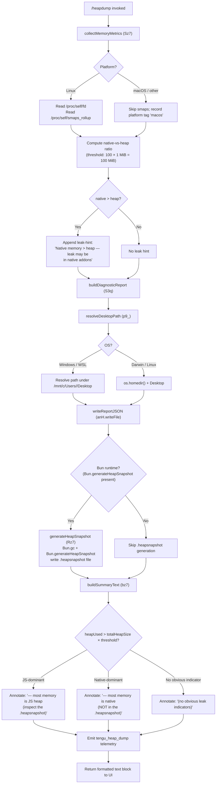

# `/heapdump`

> Analysis basis: CC v2.1.132 bundle.js (AST extraction + Claude interpretation)
> Minimum version: v2.1.132

---

## Overview

`/heapdump` is a hidden diagnostic slash command that captures a comprehensive memory snapshot of the Claude Code process and writes it to the user's Desktop. It collects V8 heap statistics, process memory metrics, native memory counters, open file-descriptor counts, and platform-specific memory maps, then serializes the data as JSON and (on Bun runtimes) a `.heapsnapshot` file suitable for loading in Chrome DevTools. The command is intended for debugging memory leaks and native-addon memory pressure in development and support workflows.

---

## Registration

| Field | Value |
|---|---|
| type | `local` |
| name | `heapdump` |
| description | `Dump the JS heap to ~/Desktop` |
| supportsNonInteractive | `true` |
| isHidden | `true` |
| module_id | `C3q` |
| load_inline | `true` |
| handler (Arbor) | `Cz7` (AsyncFunction, resolved via `module_id`) |
| `loc_byte_end` | `11262950` |
| `arbor_handler.name` | `Cz7` |
| `arbor_handler.kind` | `AsyncFunction` |
| `arbor_handler.resolution_path` | `module_id` |
| `arbor_handler.fqn` | `claude-2.1.132::Cz7` |
| `arbor_handler.n_hits` | `0` |

Analysis basis: CC v2.1.132 bundle.js:+11262787 – +11262950

---

## Input Branching

The command accepts no user-supplied arguments. All branching is driven by runtime environment detection and metric thresholds.



Analysis basis: CC v2.1.132 bundle.js:+11260375 (branching entry), +11258131 (fd read), +11259524 (platform tag), +11260695 (desktop path resolution), +11260938 (heap snapshot branch)

---

## Behavioral Spec

### 1. Entry Point — `commandHandler` (`Cz7`)

The async handler is the top-level entry point resolved via module `C3q`.

```
async function commandHandler(context):
    diagnosticLines = []
    report = await buildAndWriteReport(context)
    diagnosticLines.push(report.summaryLines)
    return diagnosticLines.join("\n")
```

Analysis basis: CC v2.1.132 bundle.js:+11261656 (`Cz7` → `S3q`), +11261802 (`A.push`), +11261924 (`A.join`)

---

### 2. Build and Write Report — `buildAndWriteReport` (`S3q`)

Orchestrates metric collection, path resolution, serialization, and optional Bun snapshot generation.

```
async function buildAndWriteReport(context):
    // Step 1: collect runtime metrics
    metrics = await collectMemoryMetrics()       // Sz7
    
    // Step 2: compute formatted table rows
    tableRows = formatMetricTable(metrics)        // L (K.map + f.padEnd)

    // Step 3: resolve output directory
    desktopPath = resolveDesktopPath()            // p9_

    // Step 4: build full output path (PSA.join)
    outputPath = path.join(desktopPath, ...)

    // Step 5: serialize metrics to JSON and write
    payload = JSON.stringify(metrics)             // RH
    await fs.writeFile(outputPath, payload, mode=384 /*0o600*/)

    // Step 6: conditionally generate Bun heap snapshot
    if runtime is Bun:
        generateBunHeapSnapshot(outputPath)       // Rz7

    // Step 7: emit telemetry
    emit("tengu_heap_dump")                       // loc_byte +11260989

    // Step 8: build summary text for UI
    summaryText = buildSummaryText(metrics)       // bz7

    return summaryText
```

File permissions are set to octal `0o600` (value `384`) so the dump is readable only by the current user.

Analysis basis: CC v2.1.132 bundle.js:+11260399 (`v6`), +11260412 (`Sz7`), +11260500 (`L`), +11260695 (`p9_`), +11260804 (`PSA.join`), +11260847 (`anH.writeFile`), +11260863 (`RH`), +11260882 (`384` permission constant), +11260938 (`Rz7`), +11260987 (`d`), +11260989 (`tengu_heap_dump`)

---

### 3. Collect Memory Metrics — `collectMemoryMetrics` (`Sz7`)

Gathers all memory signals from the Node/Bun process and, on Linux, from the kernel pseudo-filesystem.

```
async function collectMemoryMetrics():
    result = {}

    // V8 / JS heap
    result.memoryUsage        = process.memoryUsage()
    result.heapStatistics     = v8.getHeapStatistics()        // Jz8.getHeapStatistics
    result.resourceUsage      = process.resourceUsage()
    result.uptime             = process.uptime()
    result.heapSpaceStats     = v8.getHeapSpaceStatistics()   // Jz8.getHeapSpaceStatistics

    // Active handles / requests (useful for leak detection)
    result.activeHandles      = process._getActiveHandles().length
    result.activeRequests     = process._getActiveRequests().length

    // Linux-only: file-descriptor count from /proc
    if fs.readdir("/proc/self/fd") succeeds:         // anH.readdir loc +11258131
        result.openFdCount = listing.length

    // Linux-only: native memory map from smaps_rollup
    if fs.readFile("/proc/self/smaps_rollup", "utf8") succeeds:  // anH.readFile loc +11258193
        result.smapsRollup = parseSmaps(content)

    // Uptime-weighted memory pressure indicator
    // threshold: 3600 seconds × 1048576 bytes = ~3.6 GiB·seconds  (loc +11258432, +11258437)
    pressureScore = result.memoryUsage.rss * result.uptime

    // Native-vs-heap leak heuristic
    nativeMemory  = result.memoryUsage.rss - result.memoryUsage.heapTotal
    nativePct     = (nativeMemory / result.memoryUsage.heapTotal) * 100

    if nativePct > 100:   // threshold loc +11258584
        result.leakHint = "Native memory > heap - leak may be in native addons (node-pty, sharp, etc.)"
        // literal loc +11258670

    // bun:jsc module loaded when available for extra JSC stats  // loc +11258291
    result.jscStats = tryLoadBunJsc()

    return result
```

The `/proc/self/smaps_rollup` read is attempted unconditionally; on non-Linux platforms it will silently fail and `smapsRollup` will be absent from the result.

Analysis basis: CC v2.1.132 bundle.js:+11257900 (`process.memoryUsage`), +11257924 (`getHeapStatistics`), +11257950 (`process.resourceUsage`), +11257976 (`process.uptime`), +11258001 (`getHeapSpaceStatistics`), +11258043 (`_getActiveHandles`), +11258080 (`_getActiveRequests`), +11258131 (`readdir`), +11258193 (`readFile`), +11258291 (`bun:jsc`), +11258432/+11258437 (constants), +11258584 (100 threshold), +11258670 (leak hint string)

---

### 4. Resolve Desktop Path — `resolveDesktopPath` (`p9_`)

Determines the correct `Desktop` directory across operating systems including WSL.

```
function resolveDesktopPath():
    platform = os.platform()    // s6

    if platform == "windows":
        // WSL path strategy: scan /mnt/c/Users for valid Windows home
        candidates = listDir("/mnt/c/Users")     // loc +11258131 path reuse
        // skip system accounts: Public, Default, "Default User", "All Users"
        //   literals loc +954516, +954535, +954555, +954580
        for candidate in candidates:
            if candidate not in SYSTEM_ACCOUNTS:
                return path.join("/mnt/c/Users", candidate, "Desktop")
        // fallback if no candidate found
        return path.join("/mnt/c/Users", "Public", "Desktop")

    else:
        // Darwin and Linux
        home = os.homedir()               // sk8.homedir loc +954204
        return path.join(home, "Desktop") // "Desktop" literal loc +954250

    // Path string replacement applied for platform normalization  // q.replace loc +954380
```

Analysis basis: CC v2.1.132 bundle.js:+954197 (`s6`), +954204 (`sk8.homedir`), +954240 (`pf.join`), +954250 (`"Desktop"`), +954268 (`"windows"`), +954380 (`q.replace`), +954417 (`F6`), +954472 (`"/mnt/c/Users"`), +954516–+954580 (excluded account names)

---

### 5. Generate Bun Heap Snapshot — `generateBunHeapSnapshot` (`Rz7`)

Runs only when the process is executing inside the Bun runtime.

```
function generateBunHeapSnapshot(baseOutputPath):
    // Force a GC cycle before snapshotting to reduce noise
    Bun.gc(synchronous=true)                         // loc +11261413

    // Generate snapshot in V8 / arraybuffer format
    snapshot = Bun.generateHeapSnapshot({            // loc +11261356
        format: "v8",          // literal loc +11261381
        encoding: "arraybuffer" // literal loc +11261386
    })

    // Derive .heapsnapshot filename from base path
    snapshotPath = baseOutputPath.replace(".json", ".heapsnapshot")

    // Write synchronously
    fs.writeFileSync(snapshotPath, snapshot)         // h3q.writeFileSync loc +11261336

    // Hint printed to user
    // "Open the .heapsnapshot in Chrome DevTools → Memory → Load to inspect retainers."
    // literal loc +11261812
```

The "auto-1.5GB" literal (loc +11261055) appears near the snapshot invocation and may be the heap size hint passed to the Bun runtime; its exact role is <!-- TODO: not found in depth-2 traversal; needs --depth 4 -->.

Analysis basis: CC v2.1.132 bundle.js:+11261336 (`writeFileSync`), +11261356 (`generateHeapSnapshot`), +11261381 (`"v8"`), +11261386 (`"arraybuffer"`), +11261413 (`Bun.gc`), +11261812 (DevTools hint)

---

### 6. Build Summary Text — `buildSummaryText` (`bz7`)

Constructs the human-readable text block returned to the CLI UI.

```
function buildSummaryText(metrics):
    // Compute heap-vs-native ratio
    heapUsedMB  = metrics.memoryUsage.heapUsed  / (1024 * 1024)
    rssMB       = metrics.memoryUsage.rss        / (1024 * 1024)

    // Math.max used to clamp ratios  // loc +11262031
    ratio = Math.max(heapUsedMB / rssMB, 0)

    lines = []

    if ratio > HEAP_DOMINANT_THRESHOLD:    // threshold derived from surrounding constants
        lines.push("— most memory is JS heap (inspect the .heapsnapshot)")
        // literal loc +11262099
    else if ratio < NATIVE_DOMINANT_THRESHOLD:
        lines.push("— most memory is native (NOT in the .heapsnapshot)")
        // literal loc +11262159
    else:
        lines.push("  (no obvious leak indicators)")
        // literal loc +11262296

    // snH appended: supplementary formatted stats block  // loc +11262343
    lines.push(snH(metrics))

    // Numeric fields formatted with .toFixed(N) where N appears to be 8
    // literal loc +11262431

    // Total RSS threshold for prominent warning: 1073741824 bytes = 1 GiB
    // literal loc +11262705
    if metrics.memoryUsage.rss > 1073741824:
        lines.push(PROMINENT_WARNING)

    return lines.join("\n")
```

Analysis basis: CC v2.1.132 bundle.js:+11262031 (`Math.max`), +11262099 (JS-heap annotation), +11262159 (native annotation), +11262296 (no-indicator annotation), +11262343 (`snH`), +11262431 (`8` decimal places), +11262705 (1 GiB threshold)

---

### 7. Write Metric Table — `formatMetricTable` (`L` via `K.map` + `f.padEnd`)

Formats raw numeric metrics into a fixed-width aligned table string for inclusion in the report.

```
function formatMetricTable(metrics):
    rows = Object.entries(metrics).map(([key, value]) =>
        key.padEnd(COL_WIDTH, " ") + String(value)    // "  " separator literal loc +14152051
    )
    return rows.join("\n")
```

Column width constant: <!-- TODO: not found in depth-2 traversal; needs --depth 4 -->

Analysis basis: CC v2.1.132 bundle.js:+11260500 (`L`), +14152017 (`K.map`), +14152030 (`f.padEnd`), +14152051 (`"  "` separator)

---

## State & Side Effects

| Item | Detail |
|---|---|
| Telemetry | `tengu_heap_dump` emitted once per invocation (bundle.js:+11260989) |
| Telemetry (indirect, background subsystem) | `tengu_bg_dispatch_sigkill_escalate`, `tengu_bg_spare_enable`, `tengu_bg_spare_claim`, `tengu_bg_spare_claim_fail`, `tengu_bg_proto_mismatch`, `tengu_bg_dispatch_stale_drop`, `tengu_bg_attach_legacy_autorespawn`, `tengu_bg_attach`, `tengu_bg_attach_stall_gave_up`, `tengu_bg_attach_stall_respawn` — these belong to the background-process subsystem reached transitively through `uQ7`/`w`; they are not emitted directly by `/heapdump` |
| File writes | `<Desktop>/claude-heapdump-<timestamp>.json` (mode `0o600`) always written; `<Desktop>/claude-heapdump-<timestamp>.heapsnapshot` written only on Bun runtime |
| File reads | `/proc/self/fd` (directory listing, Linux only); `/proc/self/smaps_rollup` (UTF-8 text, Linux only) — both reads are best-effort and silently skipped on failure |
| GC side effect | `Bun.gc()` is called synchronously before snapshot generation on Bun runtime — this pauses the process briefly |
| appState changes | None observed in depth-2 traversal |
| Hook registration | None observed in depth-2 traversal |
| Sound | None observed in depth-2 traversal |
| Process introspection | `process._getActiveHandles()` and `process._getActiveRequests()` are called — these are private V8/Node APIs and may produce deprecation warnings in future Node versions |

---

## Version History

| Version | Change |
|---|---|
| v2.1.132 | Initial analysis |

---

## Common Mistakes

1. **Expecting output in the working directory.** The dump is always written to `~/Desktop` (or the resolved Windows Desktop under WSL), not to the current working directory or project folder.
2. **Running on non-Bun runtimes and expecting a `.heapsnapshot` file.** The Chrome-DevTools-compatible `.heapsnapshot` is only generated when Claude Code is executing under Bun. On standard Node.js the command writes only the `.json` metrics file.
3. **Ignoring the "native memory > heap" warning.** When this hint appears, the JS heap snapshot will not capture the leaked memory — the leak is in a native addon (e.g., `node-pty`, `sharp`). Use OS-level tools (`heaptrack`, `Instruments`) instead.
4. **Running as root or in a read-only home directory.** The command resolves `~/Desktop` via `os.homedir()`. If the Desktop directory does not exist or is not writable, the `anH.writeFile` call will throw and the command will fail silently or surface a generic error.
5. **Treating the 1 GiB RSS threshold as an absolute alarm.** The `1073741824`-byte threshold triggers a prominent warning in the summary, but high RSS alone does not confirm a leak; shared libraries and memory-mapped files inflate RSS legitimately.
6. **Invoking `/heapdump` in non-interactive pipelines expecting structured output.** Although `supportsNonInteractive: true` is set, the returned text is formatted for human reading, not machine parsing. Use the written JSON file for programmatic analysis.

---

## Appendix — Identifier Mapping

> For bundle debugging only. Identifiers change across versions.

| Identifier | Role |
|---|---|
| `Cz7` | Command handler entry point (AsyncFunction, resolved via module `C3q`) |
| `S3q` | Build-and-write-report orchestrator |
| `Sz7` | Collect memory metrics |
| `p9_` | Resolve Desktop output path |
| `Rz7` | Generate Bun heap snapshot |
| `bz7` | Build summary text for UI |
| `v6` | Utility: async fs / promise helper (called from `S3q` and `Sz7`) |
| `s6` | Platform detection helper |
| `G` | General utility (called from `Sz7`; reaches `Qw6`, `gX8`) |
| `Qw6` | Utility reached from `G` |
| `gX8` | Utility reached from `G` and `P` |
| `P` | Connection/transport helper (called from `Sz7`) |
| `fH` | Error-logging / result-push helper |
| `HA` | Error constructor wrapper |
| `X` | Subprocess / buffer utility |
| `uQ7` | Background-session protocol handler (large; not directly invoked by heapdump) |
| `w` | Subprocess spawn/kill manager |
| `$f` | Stream-end helper |
| `vH` | String conversion utility |
| `j` | Buffer/array accumulator |
| `k` | Message dispatch / log helper |
| `Lsq` | Sub-helper of `k` |
| `rdA` | Sub-helper of `Lsq` |
| `H` | Random/timer utility |
| `RH` | JSON serializer wrapper |
| `A` | Output accumulator array (push/join target in `Cz7`) |
| `mf` | Path/string manipulation helper |
| `MnA` | Map-based formatter reached from `mf` |
| `_` | Lodash-style get/set utility |
| `gNH` | File write helper |
| `slA` | Low-level write wrapper |
| `Msq` | Log/session writer |
| `GNH` | Timeout/queue manager |
| `pHH` | Path-join + log-level helper |
| `F6` | Promise/async utility |
| `JG8` | Sub-helper of `Msq` and `fsq` |
| `jnA` | Path-join helper |
| `JnA` | File-stat / rename helper |
| `fsq` | File append / mkdir helper |
| `N1` | Set membership manager |
| `L` | Metric table formatter (`K.map` + `f.padEnd`) |
| `K` | Process-exit / file-write helper |
| `q` | Unlink sync helper |
| `AZ` | writeFileSync wrapper |
| `f` | File-descriptor close helper |
| `d` | General error-handling sink |
| `snH` | Supplementary stats block formatter (called from `bz7`) |