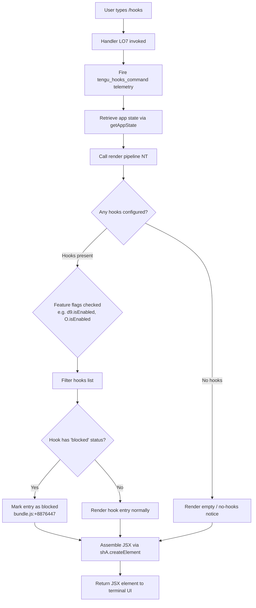

# `/hooks`

> Analysis basis: CC v2.1.132 bundle.js (AST extraction + Claude interpretation)
> Minimum version: v2.1.132

---

## Overview

The `/hooks` command renders the current hook configurations that govern tool events within a Claude Code session. It is a read-only, immediate, JSX-rendered command: it queries application state for hook definitions, assembles a structured view of those definitions (grouped by hook type, trigger condition, and action), and returns a JSX element directly to the terminal UI without spawning an agent turn. No agent conversation is initiated.

---

## Registration

| Field | Value |
|---|---|
| type | `local-jsx` |
| name | `hooks` |
| description | `View hook configurations for tool events` |
| immediate | `true` |
| module_id | `Cfq` |
| load_inline | `true` |
| handler | `LO7` (AsyncFunction, resolved via `module_id` path) |
| `loc_byte_end` | `11156342` |
| `arbor_handler.name` | `LO7` |
| `arbor_handler.kind` | `AsyncFunction` |
| `arbor_handler.resolution_path` | `module_id` |
| `arbor_handler.fqn` | `claude-2.1.132::LO7` |
| `arbor_handler.n_hits` | `0` |

Analysis basis: CC v2.1.132 bundle.js:+11156192 – +11156342

---

## Input Branching

The handler (`LO7`) is invoked synchronously on slash-command entry. Because `immediate: true` is set, no agent turn is created. The branching logic inside the rendering pipeline (`NT`) depends on the content of the hook configuration retrieved from application state and on several feature-flag / environment checks.



Analysis basis: CC v2.1.132 bundle.js:+11155963 – +11156067

---

## Behavioral Spec

### 1. Handler Entry and Telemetry

The async handler (`LO7`) begins execution as follows:

```
async function hooksCommandHandler(context):
    fireEvent("tengu_hooks_command")          // telemetry always fires first
    appState = context.getAppState()
    result   = renderHooksView(appState)
    return createElement(result)
```

The telemetry event fires unconditionally before any state is read, ensuring invocation is always counted even if hook data is empty or malformed.

Analysis basis: CC v2.1.132 bundle.js:+11155963, +11155997, +11156037, +11156067

---

### 2. Render Pipeline (`NT`)

`NT` is the primary rendering orchestrator. It receives app state and produces the JSX tree. Its responsibilities, in order:

```
function renderHooksView(appState):
    // Step 1 — Normalize tool-type identifiers
    normalizedTypes = normalizeHookTypes(appState.hooks)   // uses yH, zj

    // Step 2 — Collect active hook entries
    activeEntries = collectActiveHooks(normalizedTypes)    // uses mt, g78

    // Step 3 — Build section components for each hook group
    sections = buildHookSections(activeEntries)            // uses JGA, _L, Bt

    // Step 4 — Feature-flag gate
    if featureFlag_d9.isEnabled():
        sections = filterByFeatureFlag(sections)           // uses L.filter, tbH.has

    // Step 5 — Map entries to display models
    displayModels = sections.map(buildDisplayModel)        // uses L.map, O.isEnabled

    // Step 6 — Append metadata (MD) and include-check ($.includes)
    for each model in displayModels:
        model.meta = buildMetadata(model)
        if model.type in knownTypes:
            model.included = true

    return displayModels
```

Analysis basis: CC v2.1.132 bundle.js:+8877018, +8877057, +8877089, +8877113, +8877125, +8877212, +8877230, +8877257, +8877280, +8877356, +8877399, +8877452, +8877496

---

### 3. Hook-Type Normalization (`zj`)

Hook type identifiers arriving from configuration are normalized to a canonical form before display. The normalizer handles both CLI-originated hooks and remote/SDK-originated hooks.

```
function normalizeHookType(rawEntry):
    // Coerce to string (yH / Iq wrappers call String())
    key = String(rawEntry.type)

    // Origin classification
    if rawEntry.origin == "cli":
        entry.originLabel = "cli"
    else if rawEntry.origin == "remote":
        entry.originLabel = "remote"

    // SDK sub-type labels (sdk-ts, sdk-py, sdk-cli, local-agent)
    if entry.originLabel in SDK_TYPES:
        entry.sdkLabel = SDK_TYPE_MAP[entry.originLabel]

    // Emit tengu_slate_harbor for each normalized entry
    fireEvent("tengu_slate_harbor")

    return entry
```

Known origin values: `"cli"` (bundle.js:+3134295), `"remote"` (bundle.js:+3134306).  
Known SDK sub-type labels: `"sdk-ts"` (bundle.js:+3134552), `"sdk-py"` (bundle.js:+3134566), `"sdk-cli"` (bundle.js:+3134580), `"local-agent"` (bundle.js:+3134595).

Analysis basis: CC v2.1.132 bundle.js:+8877057, +3134143, +3134295, +3134306, +3134552

---

### 4. Active Hook Collection (`mt` / `g78`)

The collection step filters the full hook list down to entries that should be rendered, then resolves each entry's display properties.

```
function collectActiveHooks(normalizedEntries):
    active = normalizedEntries.filter(isRenderableHook)   // mt → H.filter

    for each entry in active:
        // Resolve deny-type entries (xzH uses fIA.flatMap + Q$)
        if entry.verdict == "deny":
            entry.denyDetail = resolveDenyDetail(entry)   // xzH

        // Resolve MIA sub-fields (ph8, M66, Lk)
        entry.displayMeta = buildDisplayMeta(entry)       // MIA

        // cliArg entries carry a flag label
        if entry.source == "cliArg":
            entry.label = "cliArg"                        // bundle.js:+9637220

    return active
```

The `"deny"` literal (bundle.js:+9636650) and `"cliArg"` literal (bundle.js:+9637220) are the two display-classification constants visible at this depth.

Analysis basis: CC v2.1.132 bundle.js:+8876386, +8876401, +9636573, +9636650, +9637220, +9637254, +9637271

---

### 5. Section Assembly (`Bt` / `JGA` / `_L`)

Each logical hook group is assembled into a displayable section component.

```
function buildHookSection(entry):
    // _L provides base layout scaffold
    layout = buildLayout(entry)           // _L → s6, J6H

    // MD annotates with metadata (yH string normalization)
    meta   = buildSectionMeta(entry)      // MD

    // Ij renders individual hook item within section
    item   = renderHookItem(entry)        // Ij → yH, vA

    // Conditional per-item renderers based on hook category
    if entry.category == "blocked":
        item.status = "blocked"           // literal bundle.js:+8876447

    // tdH — header renderer for the section
    header = renderSectionHeader(entry)   // tdH

    // Three action-button builders: FB4, UB4, BB4
    // Each pairs a prompt builder (dp9/Ip9/hp9) with the notification helper (nA)
    actions = [
        buildPrimaryAction(entry),        // FB4 → dp9 + nA
        buildSecondaryAction(entry),      // UB4 → Ip9 + nA
        buildTertiaryAction(entry)        // BB4 → hp9 + nA
    ]

    // JGA builds the group wrapper (cx → windows-platform check, j6 → dedup)
    group = buildGroupWrapper(entry, layout, header, item, actions)  // JGA

    // tu provides team/agent context labeling
    group.agentLabel = resolveAgentLabel(entry)   // tu → xTA, k, g_, a3

    return group
```

The platform string `"windows"` (bundle.js:+4258718) is checked inside the group-wrapper builder (`cx`), suggesting platform-specific rendering adjustments for hook entries on Windows hosts. The `--agent-teams` CLI argument string (bundle.js:+3059085) is referenced by the layout scaffold.

The `tengu_cobalt_ridge` event fires inside the group-wrapper builder (`cx` / `j6`) at bundle.js:+4258812.  
The `tengu_amber_flint` event fires inside the layout scaffold (`l1` / `j6`) at bundle.js:+3059197.

Analysis basis: CC v2.1.132 bundle.js:+8875784, +8875800, +8875904, +8875981, +8876052, +8876071, +8876112, +8876118, +8876124, +8876275, +8876316, +8876343, +4258718, +4258812, +3059197

---

### 6. Feature-Flag Gating

Two independent feature flags are checked before entries are mapped to display models.

```
function applyFeatureFlagFilters(sections):
    // Flag d9 — if disabled, filter out entries that are in the tbH set
    if not featureFlag_d9.isEnabled():
        sections = sections.filter(s => not tbH.has(s.type))

    // Flag O — maps to "stopped" / "background session" gating
    //   "stopped"            bundle.js:+14163882
    //   "background session" bundle.js:+14163925
    for each section in sections:
        if featureFlag_O.isEnabled():
            section.backgroundState = resolveBackgroundState(section)  // Q8

    return sections
```

Analysis basis: CC v2.1.132 bundle.js:+8877280, +8877356, +8877371, +8877410, +14163882, +14163925

---

### 7. Metadata and JSON Serialization Path

The display-model metadata builder (`MD`) and the include-check (`$.includes`) lead into a JSON-serialization sub-path used when hooks configuration needs to be persisted or diffed.

```
function buildMetadata(model):
    raw = normalizeToString(model)          // MD → yH

    if model.id in knownIds:
        model.included = true               // $.includes check

    // mzq serialization chain (reached if persistence needed):
    //   1. Er — error / result wrapper
    //   2. Date.now() — timestamp
    //   3. lY — atomic file write (randomBytes → writeFile → rename)
    //   4. PX6 — path join using "daemon.status.json"  bundle.js:+11389891
    //   5. RH — JSON.stringify  bundle.js:+142722
    if needsPersistence(model):
        timestamp  = Date.now()
        serialized = JSON.stringify(model)  // RH
        path       = joinPath(daemonDir, "daemon.status.json")  // PX6
        atomicWrite(path, serialized)       // lY

    return model
```

The file written is named `"daemon.status.json"` (bundle.js:+11389891). The atomic write uses 4 random bytes for the temp-file suffix encoded as `"hex"` (bundle.js:+2861130, +2861142), written with encoding `"utf8"` (bundle.js:+2861188).

Analysis basis: CC v2.1.132 bundle.js:+8877452, +8877496, +11390003, +11390035, +11389891, +2861130, +2861142, +2861188, +142722

---

### 8. Agent-Label Resolution (`tu`)

The `tu` sub-component determines how hook entries sourced from agent or multi-agent team contexts are labeled.

```
function resolveAgentLabel(entry):
    // xTA: resolve model tier
    //   "standard"  bundle.js:+9359673
    //   "tst"       bundle.js:+9359752  (threshold: 100, bundle.js:+9359765)
    //   "tst-auto"  bundle.js:+9359802
    tier = resolveModelTier(entry)     // xTA → jd9, Rn4, Iq

    // k: normalize label string
    //   Trims whitespace (H.trim)
    //   Upper-cases first token (A.toUpperCase)
    //   Checks debug flag: "debug" bundle.js:+161637
    //   Applies FN, gNH, Msq formatters
    label = normalizeLabelString(tier) // k

    // g_: provider classification
    //   "bedrock" / "foundry" / "anthropicAws" / "mantle" / "vertex"
    //   "firstParty" / "api.anthropic.com"
    provider = classifyProvider(entry) // g_

    // a3: final assembly
    return assembleAgentLabel(label, provider, tier)  // a3
```

Provider classification constants: `"bedrock"` (+1975269), `"foundry"` (+1975319), `"anthropicAws"` (+1975375), `"mantle"` (+1975429), `"vertex"` (+1975477), `"firstParty"` (+1975486), `"api.anthropic.com"` (+1976104).

The `"[ToolSearch:optimistic] disabled: Vertex AI does not accept the tool-search beta header…"` warning string (bundle.js:+9360687) is emitted when Vertex AI is detected and the tool-search feature flag is active.

Analysis basis: CC v2.1.132 bundle.js:+9360151, +9360191, +9360343, +9360365, +9359673, +9359752, +9359802, +1975269, +1976104

---

### 9. Deduplication Registry (`j6` / `uQ6`)

Hook entries pass through a deduplication registry before rendering to prevent duplicate sections.

```
function deduplicateHookEntry(entry):
    key = computeEntryKey(entry)    // hq6, Rq6, Oo

    // V5H is the primary seen-keys map
    if V5H.has(key):
        existing = V5H.get(key)
        // uQ6: merge into existing bucket
        if Kt8.has(key):
            // already in secondary set — apply Lt8 / Dt8 merge strategy
            mergeEntry(existing, entry)   // Lt8, Dt8
        else:
            Kt8.add(key)
            V5H.set(key, mergeEntry(existing, entry))
    else:
        V5H.set(key, entry)

    kq6.add(key)    // track all seen keys for final pass

    // mU is the fallback map for entries not in V5H
    if mU.has(key):
        return mU.get(key)

    // R6: build final rendered node
    //   F6, B2 — layout nodes
    //   Et8, k5H — style tokens
    //   Date.now() — insertion timestamp
    //   DPK — post-render hook callback
    node = buildRenderedNode(entry)    // R6

    return node
```

Analysis basis: CC v2.1.132 bundle.js:+3085421, +3085458, +3085493, +3085510, +3085521, +3085533, +3085547, +3085564, +3085584, +3083221, +3083245, +3083261, +3083272, +3083346

---

### 10. Notification Helper (`nA`)

The three action-button builders (`FB4`, `UB4`, `BB4`) each call the notification helper `nA`, which manages the notification/confirmation lifecycle for hook-related actions.

```
function notificationHelper(promptData, callback):
    // fwH — ES-module default marker (__esModule: true, bundle.js:+1507)
    // lP8 — load prompt body
    prompt = loadPromptBody(promptData)    // lP8

    // J06.call — invoke with current context
    result = J06.call(context, prompt)

    // j06.bind — bind the follow-up handler
    handler = j06.bind(context)

    // gdq — dispatch result
    gdq(result)

    // QFA.set — register in notification registry
    QFA.set(promptId, handler)
```

Analysis basis: CC v2.1.132 bundle.js:+1500, +1507, +1592, +1603, +1630, +1659, +1692, +8876795

---

## State & Side Effects

| Item | Detail |
|---|---|
| Telemetry — `tengu_hooks_command` | Fired unconditionally on every `/hooks` invocation (bundle.js:+11155965) |
| Telemetry — `tengu_slate_harbor` | Fired once per normalized hook-type entry during type normalization (bundle.js:+3134325) |
| Telemetry — `tengu_cobalt_ridge` | Fired inside the group-wrapper builder when hook sections are assembled (bundle.js:+4258812) |
| Telemetry — `tengu_amber_flint` | Fired inside the layout scaffold builder per hook entry (bundle.js:+3059197) |
| App state reads | `getAppState()` is called once to obtain the live hook configuration; no writes to app state are performed by the display path |
| Daemon status file | If the metadata persistence path is triggered, `daemon.status.json` is atomically written to the daemon directory (bundle.js:+11389891) |
| Notification registry | Action buttons register callbacks in `QFA` via `nA`; these persist for the session (bundle.js:+1692) |
| Deduplication sets | `V5H` (map), `Kt8` (set), `kq6` (set), `mU` (map) are mutated as hook entries are rendered; these are module-level singletons |
| JSX output | A React/JSX element tree is returned directly to the terminal renderer; no agent message is enqueued |
| Sound | None observed in depth-2 traversal |

---

## Version History

| Version | Change |
|---|---|
| v2.1.132 | Initial analysis — `local-jsx`, `immediate`, handler `LO7`, four telemetry events documented |

---

## Common Mistakes

1. **Expecting an agent response**: `/hooks` is `immediate: true` and `local-jsx` — it renders directly without starting an agent turn. No assistant message will appear in the conversation transcript.
2. **Assuming hook edits are possible here**: `/hooks` is a read-only viewer. Modifying hook configurations requires editing the appropriate config file or using a separate configuration surface; the three action buttons rendered by `FB4`/`UB4`/`BB4` trigger notification flows, not in-place edits.
3. **Misreading the SDK origin labels**: The labels `"sdk-ts"`, `"sdk-py"`, `"sdk-cli"`, and `"local-agent"` (bundle.js:+3134552–+3134595) are origin classifiers on individual hook entries, not session-level SDK indicators.
4. **Overlooking the deduplication registry**: Hook entries sharing the same computed key are merged rather than rendered twice. If an expected hook entry appears missing in the output, it may have been merged into an existing bucket by `j6`/`uQ6`.
5. **Confusing feature-flag gating with missing configuration**: Hooks hidden by the `d9` or `O` feature flags are present in app state but suppressed from display; they are not absent from the configuration.
6. **Treating `daemon.status.json` writes as guaranteed**: The atomic-write path through `mzq`/`lY`/`PX6` is only reached when the metadata persistence condition is satisfied; it is not triggered on every invocation.

---

## Appendix — Identifier Mapping

> For bundle debugging only. Identifiers change across versions.

| Identifier | Role |
|---|---|
| `LO7` | Main async handler for `/hooks` command (AsyncFunction, module `Cfq`) |
| `d` | First call from handler — likely telemetry dispatch helper |
| `NT` | Primary render pipeline orchestrator for hook view |
| `yH` | String-coercion / normalization utility (calls `String()`) |
| `zj` | Hook-type normalizer; emits `tengu_slate_harbor` |
| `ch` | Sub-helper within type normalizer |
| `Iq` | String-coercion wrapper (calls `String()`) |
| `j6` | Deduplication registry core — checks/updates `V5H`, `Kt8`, `kq6`, `mU` |
| `hq6` | Entry-key computation helper (part of dedup) |
| `Rq6` | Entry-key computation helper (part of dedup) |
| `Oo` | Entry-key computation helper using `yH` and `Mo` |
| `uQ6` | Dedup merge logic — operates on `Kt8`, `V5H`; calls `Lt8`, `Dt8` |
| `R6` | Rendered-node builder — uses `F6`, `B2`, `Et8`, `k5H`, `Date.now`, `DPK` |
| `mt` | Active-hook collector — wraps `H.filter` and `g78` |
| `H` | Hook list / array — also references `Math.random` and `setTimeout` |
| `g78` | Hook entry processor — calls `xzH`, `MIA`, `un9` |
| `xzH` | Deny-detail resolver — uses `fIA.flatMap` and `Q$` |
| `MIA` | Display-meta builder — uses `ph8`, `M66`, `Lk` |
| `un9` | Additional hook entry processing helper |
| `JGA` | Group-wrapper builder — calls `cx`, `MZH`, `nA` |
| `cx` | Group-wrapper sub-builder — performs platform (`windows`) check; emits `tengu_cobalt_ridge` |
| `nA` | Notification helper — manages prompt/callback lifecycle via `fwH`, `lP8`, `J06`, `j06`, `gdq`, `QFA` |
| `j06` | Follow-up handler bound inside `nA` |
| `_L` | Base layout scaffold builder — uses `s6`, `J6H` |
| `Bt` | Section assembly orchestrator — coordinates `_L`, `MD`, `Ij`, `tdH`, `FB4`, `UB4`, `BB4`, `JGA`, `tu` |
| `MD` | Section metadata annotator (uses `yH` for string normalization) |
| `Ij` | Individual hook-item renderer — uses `yH` and `vA` |
| `vA` | Visual/style helper used by item renderer |
| `tdH` | Section header renderer |
| `FB4` | Primary action-button builder — pairs `dp9` with `nA` |
| `UB4` | Secondary action-button builder — pairs `Ip9` with `nA` |
| `BB4` | Tertiary action-button builder — pairs `hp9` with `nA` |
| `l1` | Layout scaffold with `--agent-teams` awareness — uses `yH`, `TXK`, `j6`; emits `tengu_amber_flint` |
| `TXK` | Agent-teams layout token |
| `tu` | Agent-label resolution orchestrator — calls `xTA`, `k`, `g_`, `a3` |
| `xTA` | Model-tier resolver — uses `yH`, `jd9`, `Rn4`, `Iq` |
| `k` | Label-string normalizer — trims, upper-cases, checks debug flag |
| `g_` | Provider classifier — maps to `bedrock`/`foundry`/`anthropicAws`/`mantle`/`vertex`/`firstParty` |
| `a3` | Final agent-label assembler |
| `_` | Seen-key lookup (calls `f.toLowerCase`) |
| `f` | File/stream close helper — closes `_.close`, `q.close`; calls `K` |
| `q` | File unlink helper — calls `tgq.unlinkSync` |
| `K` | Process-exit wrapper — calls `q`, `vH`, `AZ`, `process.exit` |
| `L` | Sections/display-model array — subject to `.filter`, `.map`, `.some`, `.padEnd` |
| `eL` | Additional list or equality helper used in render pipeline |
| `O` | Feature-flag object with `.isEnabled()` — governs background-session display |
| `Q8` | Background-state resolver called when `O.isEnabled()` is true |
| `$` | Known-types registry with `.includes()` check |
| `mzq` | Serialization/persistence orchestrator — calls `Er`, `Date.now`, `lY`, `PX6`, `RH` |
| `Er` | Error/result wrapper inside serialization chain |
| `lY` | Atomic file-write utility — `randomBytes → writeFile → rename`; handles copy and unlink |
| `PX6` | Path builder for `daemon.status.json` — uses `uzq.join` and `l8` |
| `RH` | JSON serializer (calls `JSON.stringify`) |