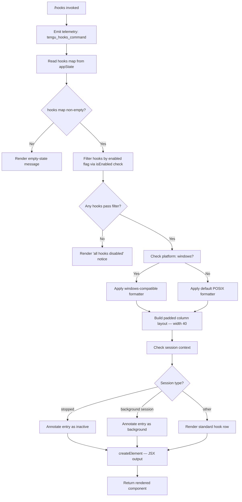

# `/hooks`

> Analysis basis: CC v2.1.132 bundle.js (AST extraction + Claude interpretation)
> Minimum version: v2.1.132

---

## Overview

The `/hooks` command displays the currently configured hook bindings that fire on tool lifecycle events (e.g., before/after tool invocations). It reads hook configuration from application state, formats each entry with alignment padding, and renders the result as an inline JSX component — no sub-shell or network call is required. The command is classified `immediate`, so it executes synchronously without opening an interactive prompt.

---

## Registration

| Field | Value |
|---|---|
| type | `local-jsx` |
| name | `hooks` |
| description | `View hook configurations for tool events` |
| immediate | `true` |
| module\_id | `Cfq` |

Analysis basis: CC v2.1.132 bundle.js:+11156192

---

## Input Branching

The command entry-point (`commandHandler`) performs four sequential decisions before handing off to the renderer:



Analysis basis: CC v2.1.132 bundle.js:+11156037, +8877018, +8877089, +8877212, +8877280, +8877356, +8877399, +4258854, +14163882, +14163925

---

## Behavioral Spec

### 1. Command Handler (entry point)

```
function commandHandler(context):
    emit_telemetry("tengu_hooks_command")
    appState = context.getAppState()
    hooksMap = appState.hooks          // map of hook-id → hook config
    return renderHooksList(hooksMap, appState)
```

Analysis basis: CC v2.1.132 bundle.js:+11155963, +11155965, +11155997, +11156037, +11156067

---

### 2. Boolean Coercion for Enabled Flag

Before filtering, the enabled field on each hook config is coerced from a loose string to a strict boolean. The values `"yes"` and `"on"` are both treated as `true` in addition to the native boolean `true`.

```
function coerceBooleanEnabled(rawValue):
    s = String(rawValue).toLowerCase()
    if s == "yes" or s == "on" or s == "1":
        return true
    return false
```

Recognized truthy string literals: `"yes"` (bundle.js:+25237), `"on"` (bundle.js:+25243).

Analysis basis: CC v2.1.132 bundle.js:+25188, +25237, +25243

---

### 3. Hook Filtering

```
function filterEnabledHooks(hooksMap):
    enabledEntries = []
    for each (hookId, hookConfig) in hooksMap:
        if isEnabled(hookConfig):          // calls coerceBooleanEnabled internally
            enabledEntries.append((hookId, hookConfig))
    return enabledEntries
```

Analysis basis: CC v2.1.132 bundle.js:+8876386, +8876401, +8877280, +8877356

---

### 4. Hook Source Classification

Each hook entry carries a `source` field that identifies where the hook was registered. The classifier maps the raw source string to a display label:

```
function classifyHookSource(sourceString):
    match sourceString:
        case "cli"          -> return display label "cli"
        case "remote"       -> return display label "remote"
        case "sdk-ts"       -> return display label "sdk-ts"
        case "sdk-py"       -> return display label "sdk-py"
        case "sdk-cli"      -> return display label "sdk-cli"
        case "local-agent"  -> return display label "local-agent"
        default             -> return sourceString as-is
```

The `tengu_slate_harbor` telemetry event fires during source classification for hooks whose source resolves to a remote or SDK-origin value.

Analysis basis: CC v2.1.132 bundle.js:+3134295, +3134306, +3134325, +3134552, +3134566, +3134580, +3134595

---

### 5. Blocked Hook Handling

If a hook's execution status is `"blocked"`, the row renderer annotates the output line with a visual indicator rather than suppressing the row entirely:

```
function resolveHookStatus(hookConfig):
    if hookConfig.status == "blocked":
        return STATUS.BLOCKED
    return STATUS.OK
```

Analysis basis: CC v2.1.132 bundle.js:+8876447

---

### 6. Column Alignment Formatter

All hook entries are rendered in a two-column layout. The left column (hook identifier / name) is padded to a fixed width of **40 characters** using `padEnd`, followed by a two-space separator.

```
function formatHookRow(hookId, hookConfig):
    platform = getPlatform()
    if platform == "windows":
        separator = windowsSafeFormat(hookId)
    else:
        leftColumn = hookId.padEnd(40)      // width = 40
        separator  = "  "                   // two-space separator
        rightColumn = formatHookDetail(hookConfig)
    return leftColumn + separator + rightColumn
```

Column width constant: **40** (bundle.js:+14154022)
Two-space separator literal: `"  "` (bundle.js:+14152051)

Analysis basis: CC v2.1.132 bundle.js:+14152017, +14152030, +14154022, +14152051, +4258854, +4258861, +4258887

---

### 7. Session-State Annotation

After formatting each row, the renderer checks the ambient session state and appends an annotation for non-standard sessions:

```
function annotateForSessionState(formattedRow, sessionContext):
    if sessionContext.state == "stopped":
        return formattedRow + " [stopped]"
    if sessionContext.type == "background session":
        return formattedRow + " [background session]"
    return formattedRow
```

Analysis basis: CC v2.1.132 bundle.js:+14163882, +14163925, +14163920

---

### 8. Hook Detail Expander

For each enabled hook, a detail object is assembled that carries the full configuration payload. It delegates to a lookup function to resolve the hook's event binding, then to a formatting function that handles multi-value conditions:

```
function buildHookDetail(hookId, hookConfig):
    detail = lookupHookBinding(hookId)       // resolves event → handler mapping
    conditions = resolveConditions(detail)
    display = formatConditionSet(conditions)
    return display
```

Analysis basis: CC v2.1.132 bundle.js:+8876945, +8876969, +8876975, +8877113

---

### 9. JSX Rendering

The final output is produced via `createElement` (React-compatible). No DOM manipulation occurs — the result is returned as a value to the CC shell renderer:

```
function renderHooksList(hooksMap, appState):
    enabled = filterEnabledHooks(hooksMap)
    if enabled is empty:
        return createElement(EmptyStateComponent, { message: "no hooks configured" })
    rows = []
    for each (hookId, hookConfig) in enabled:
        formatted = formatHookRow(hookId, hookConfig)
        annotated = annotateForSessionState(formatted, appState.session)
        rows.append(createElement(HookRowComponent, { content: annotated }))
    return createElement(HooksListComponent, {}, ...rows)
```

Analysis basis: CC v2.1.132 bundle.js:+11156067

---

## State & Side Effects

| Item | Detail |
|---|---|
| Telemetry emitted | `tengu_hooks_command` — fires once per invocation at entry (bundle.js:+11155965) |
| Telemetry emitted | `tengu_slate_harbor` — fires during hook-source classification for remote/SDK hooks (bundle.js:+3134325) |
| appState reads | `appState.hooks` (hook configuration map), `appState.session` (session context) |
| appState writes | None — the command is read-only |
| Hook registration | The command itself does not register new hooks; it only displays existing hook configuration |
| JSX output | Rendered inline by the CC shell; no file I/O, no subprocess |
| Sound | <!-- TODO: not found in depth-2 traversal; needs --depth 4 --> |
| Network | None for `cli`-sourced hooks; remote-sourced hooks may already be resolved in appState |

---

## Version History

| Version | Change |
|---|---|
| v2.1.132 | Initial analysis — `local-jsx`, `immediate`, column width 40, six source classifications |

---

## Common Mistakes

1. **Expecting interactive output**: Because `immediate: true` is set, `/hooks` returns its JSX payload synchronously. Wrapping it in an async `await` or expecting a prompt is incorrect.
2. **Assuming only boolean `true` enables a hook**: The enabled-flag coercion also accepts the strings `"yes"` and `"on"`. Hard-coding `true` comparisons in downstream tooling will miss these cases.
3. **Ignoring the `blocked` status**: A hook may appear in the enabled list yet have `status: "blocked"`. The hook is shown but its handler will not fire — callers should not assume presence in the list implies active execution.
4. **Windows column misalignment**: On Windows the formatter takes a separate path (`windowsSafeFormat`). Assuming POSIX `padEnd(40)` output on all platforms will produce garbled display on Windows hosts.
5. **Missing `tengu_slate_harbor` for remote hooks**: Hooks sourced from `"remote"`, `"sdk-ts"`, `"sdk-py"`, `"sdk-cli"`, or `"local-agent"` trigger an additional telemetry event. Filtering telemetry logs for only `tengu_hooks_command` will under-count events for installations using SDK-managed hooks.
6. **Treating session state as static**: The `"stopped"` and `"background session"` annotations are applied at render time based on live session context. Caching the `/hooks` output across session-state transitions will show stale annotations.

---

## Appendix — Identifier Mapping

> For bundle debugging only. Identifiers change across versions.

| Identifier | Role |
|---|---|
| `LO7` | Command handler / entry-point function for `/hooks` |
| `NT` | Hook list renderer — orchestrates filter, format, and JSX assembly |
| `yH` | Boolean-enabled coercion utility (string → bool) |
| `zj` | Hook source classifier (maps raw source string to display label) |
| `mt` | Hook filter — applies `isEnabled` predicate over the hooks map |
| `JGA` | Hook detail expander — resolves event binding and condition set |
| `_L` | Platform detection utility (identifies `"windows"`) |
| `Bt` | Hook row formatter — applies `padEnd` alignment, status annotation |
| `MD` | Condition set formatter — formats multi-value conditions for display |
| `eL` | Empty-state component or helper rendered when no hooks are configured |
| `_` | Lowercase normalizer used during enabled-flag coercion |
| `L` | Collection of formatted hook row strings passed to JSX renderer |
| `O` | Session-state checker (`isEnabled` / state resolution for session context) |
| `$` | Hook identifier inclusion checker (`includes` guard) |
| `d` | Telemetry emitter function |
| `A` | Application state accessor (provides `getAppState`) |