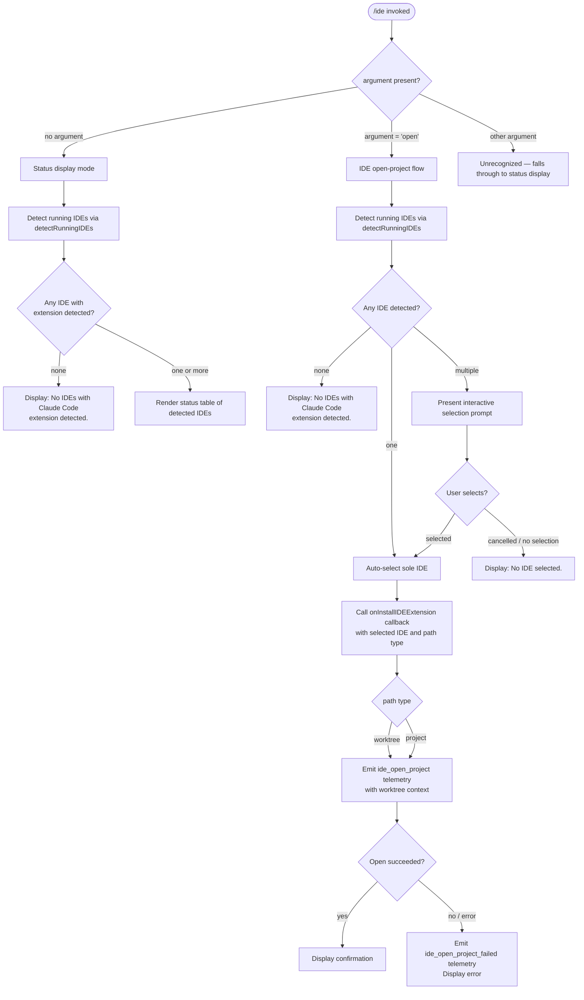

# `/ide`

> Analysis basis: CC v2.1.132 bundle.js (AST extraction + Claude interpretation)
> Minimum version: v2.1.132

---

## Overview

The `/ide` command manages IDE integrations for Claude Code, detecting running IDE instances (VS Code, Cursor, Windsurf, JetBrains family) that have the Claude Code extension installed, displaying their connection status, and optionally opening the current project in a selected IDE. When the `open` subcommand argument is provided, the command interactively presents available IDEs, lets the user select one, and instructs that IDE to open the current worktree or project directory.

---

## Registration

| Field | Value |
|---|---|
| type | `local-jsx` |
| name | `ide` |
| description | `Manage IDE integrations and show status` |
| argumentHint | `[open]` |
| module_id | `mHq` |
| load_inline | `true` |
| handler | `K97` (resolved via `module_id` path) |
| `loc_byte_end` | `10348189` |
| `arbor_handler.name` | `K97` |
| `arbor_handler.kind` | `AsyncFunction` |
| `arbor_handler.resolution_path` | `module_id` |
| `arbor_handler.fqn` | `claude-2.1.132::K97` |
| `arbor_handler.n_hits` | `0` |

Analysis basis: CC v2.1.132 bundle.js:+10348033 – +10348189

---

## Input Branching

The handler `K97` inspects the first token of the user-supplied argument string to decide its operating mode.



Analysis basis: CC v2.1.132 bundle.js:+10344093 (handler entry `K97`), +10344201 (`"open"` literal), +10344310 (`"No IDEs with Claude Code extension detected."` literal), +10344448 (`"No IDE selected."` literal)

---

## Behavioral Spec

### 1. Handler Entry Point

```
async function ideCommandHandler(context):
    emit telemetry "tengu_ext_ide_command"  // basis: +10344095

    subcommand = context.args[0] ?? null

    ideList = await detectRunningIDEs(context)  // see §2

    if subcommand == "open":
        await openProjectInIDE(context, ideList)  // see §3
    else:
        renderIDEStatusDisplay(context, ideList)   // see §4
```

Analysis basis: CC v2.1.132 bundle.js:+10344093

---

### 2. IDE Detection (`detectRunningIDEs`)

Detection is dispatched to `wUH`, which orchestrates platform-specific scanning and then normalizes results.

```
async function detectRunningIDEs(context):
    platform = detectPlatform()   // "macos" | "linux" | "wsl" | "windows"

    candidates = []

    if platform == "macos":
        // Enumerate running applications via macOS-native approach
        appList = await scanMacOSRunningApps()   // wUH → asK → Td_ → PA
        candidates = appList

    if platform == "linux" or platform == "wsl":
        // Run: ps aux | grep -E "code|cursor|windsurf|idea|pycharm|..." | grep -v grep
        // literal at +5030949
        psOutput = await runShellCommand(PS_AUX_GREP_PATTERN)
        candidates = parseProcessList(psOutput)

    if platform == "windows":
        // Windows-specific process scan
        candidates = await scanWindowsProcesses()

    // For WSL: resolve /mnt/c/Users paths, skip Public/Default/Default User/All Users
    // literals at +5024645, +5024739, +5024758, +5024778, +5024803

    emit telemetry "ide_detect"   // literal at +5027474

    results = []
    for each candidate in candidates:
        ideKind = classifyIDE(candidate)   // "vscode" | "cursor" | "windsurf" | "jetbrains" | "ide"
        connectionInfo = await resolveIDEConnection(candidate)
        results.push({ kind: ideKind, connection: connectionInfo })

    if results is empty:
        emit telemetry "ide_detect_failed"   // literal at +5027538

    return results
```

- Recognized IDE kinds: `"vscode"` (+10344508), `"cursor"` (+10344549), `"windsurf"` (+10344590), `"jetbrains"` (+5023165), `"IDE"` (+5031719)
- WSL path normalization strips Windows system-profile directories (`Public`, `Default`, `Default User`, `All Users`) and resolves paths under `/mnt/c/Users` (+5024645)
- `.lock` files (+5023379) are used to track active IDE socket registrations
- Connection types observed: `"sse-ide"` (+10342080) and `"ws-ide"` (+10342100)

Analysis basis: CC v2.1.132 bundle.js:+5026165 (`wUH`), +5027006 (`zr1` process kill), +5030072 (`"macos"`), +5030923 (`"linux"`), +5031411 (`Y5A`)

---

### 3. Open Project in IDE (`openProjectInIDE`)

```
async function openProjectInIDE(context, ideList):
    if ideList is empty:
        display "No IDEs with Claude Code extension detected."   // +10344310
        return

    if ideList.length == 1:
        selectedIDE = ideList[0]
    else:
        selectedIDE = await promptUserToSelectIDE(ideList)
        if selectedIDE is null:
            display "No IDE selected."   // +10344448
            return

    // Determine path type: worktree vs project
    pathType = determinePathType(context)   // "worktree" (+10344682) or "project" (+10344693)

    try:
        await context.callbacks.onInstallIDEExtension(selectedIDE, pathType)
        // +10345222

        emit telemetry "ide_open_project"   // literal at +10344648
        display bold(selectedIDE.displayName) + " opened successfully"

    catch error:
        emit telemetry "ide_open_project_failed"   // literal at +10344755
        display error message
        suggest "restart your IDE"   // literal at +10345313
```

Analysis basis: CC v2.1.132 bundle.js:+10344621, +10344648, +10344755, +10345222

---

### 4. Status Display (`renderIDEStatusDisplay`)

```
function renderIDEStatusDisplay(context, ideList):
    if ideList is empty:
        display "No IDEs with Claude Code extension detected."
        return

    // Render a formatted status table
    // Each row: IDE name (bold), connection type, status
    for each ide in ideList:
        row = formatIDERow(ide)   // wUH → jJ, uses Gy.basename, path info
        display row

    // Status labels observed: "connected", "enabled", "disabled",
    // "not_configured", "no_permissions", "installed", "native",
    // "local", "migrated", "unknown"
```

- IDE name display: uses `M6.bold` formatting (+10344709)
- Status strings include: `"connected"`, `"enabled"`, `"disabled"`, `"not_configured"`, `"no_permissions"`, `"installed"`, `"native"`, `"local"`, `"migrated"`, `"unknown"` (literals at +3103060–+3103266)
- The `YUH` call at +10344851 and `wG` at +10345160 contribute to building the display output
- List truncation: `, ` separator (+10347795) and `, …` ellipsis (+10347809) are applied when the connection-name list exceeds display width

Analysis basis: CC v2.1.132 bundle.js:+10344709, +10344733, +10344851, +10345160

---

### 5. IDE Detection Subsystem Detail

The `KtK` function (reached via `Y5A`) implements the macOS-specific IDE resolver:

```
async function macOSIDEResolver(appEntry):
    // Query running application list via native macOS API (rJH)
    // rJH chains: lL_, hy8, Sy8, Cy8, eq_, VH6, yy8, hL_, tq_, HL_, kL_, yH6, vL_, NL_, LL_

    appInfo = await fetchRunningAppInfo(appEntry)

    // Match against known IDE bundle identifiers / process names
    // Recognized identifiers include: code, cursor, windsurf, idea, pycharm,
    // webstorm, phpstorm, rubymine, clion, goland, rider, datagrip,
    // dataspell, aqua, gateway, fleet, android-studio, appcode
    // (ps aux grep pattern at +5030949; appcode at +5031323)

    for each (envKey, socketPath) in Object.entries(appInfo.sockets):
        if socketPath already processed: continue
        connection = await tryConnectToIDESocket(socketPath)
        if connection.valid:
            results.push(connection)

    return results
```

Analysis basis: CC v2.1.132 bundle.js:+5031411 (`KtK`), +5030060, +5030094 (`TP`), +5030363, +5030420

---

### 6. Connection Probe (`tryConnectToIDESocket`)

When an IDE socket candidate is found, the subsystem probes it:

```
async function tryConnectToIDESocket(socketPath):
    // Attempt socket connection with 5000 ms timeout (+5026165 → wUH → asK → Td_ → PA)
    try:
        conn = await connectWithTimeout(socketPath, timeout=3000ms)  // +2117237
        info = await readIDEInfo(conn)
        return { valid: true, info: info }
    catch ECONNREFUSED:
        return { valid: false }
    catch timeout:
        return { valid: false }
```

Analysis basis: CC v2.1.132 bundle.js:+2117237 (3000 ms timeout constant), +2117345 (`parseInt` for port parsing), +2117374 (`isNaN` guard)

---

## State & Side Effects

| Item | Detail |
|---|---|
| Telemetry: `tengu_ext_ide_command` | Fired at handler entry every time `/ide` is invoked (basis: +10344095) |
| Telemetry: `ide_detect` | Fired after IDE detection scan completes with results (basis: +5027474) |
| Telemetry: `ide_detect_failed` | Fired when no IDE candidates are found (basis: +5027538) |
| Telemetry: `ide_open_project` | Fired on successful `open` subcommand execution (basis: +10344648) |
| Telemetry: `ide_open_project_failed` | Fired when the IDE open request fails (basis: +10344755) |
| Telemetry: `tengu_bg_spare_enable` | Background daemon spare-session management, activated as side effect of daemon subsystem (basis: +14129457) |
| Telemetry: `tengu_bg_spare_spawn` | Fired when a background spare PTY session is spawned (basis: +14129749) |
| Telemetry: `tengu_bg_spare_claim` | Fired when a spare session is claimed for a new session (basis: +14130886) |
| Telemetry: `tengu_bg_spare_claim_fail` | Fired when spare claim fails (basis: +14131149) |
| Telemetry: `tengu_daemon_control` | Fired for daemon start/stop control operations (basis: +14164048) |
| Telemetry: `tengu_daemon_idle_exit` | Fired when the daemon exits due to idle timeout (basis: +14148068) |
| Callback invocation | `onInstallIDEExtension(ide, pathType)` is called when `open` subcommand succeeds (basis: +10345222) |
| File I/O | Detection reads `.lock` files in the Claude config directory to enumerate registered IDE sockets (basis: +5023379) |
| Socket connections | Short-lived probing connections are made to each candidate IDE socket (TCP/Unix); connections are closed after info retrieval (basis: +2117214) |
| Background daemon interaction | The command may interact with the Claude Code background daemon via the `OFA`/`w`/`LFA` subsystem for session management; this is a side effect of the daemon infrastructure, not a primary IDE command action |
| appState changes | None observed directly in the `/ide` command path; IDE selection state is transient within the command invocation |
| Sound | None |

---

## Version History

| Version | Change |
|---|---|
| v2.1.132 | Initial analysis. Supports `open` subcommand; detects VS Code, Cursor, Windsurf, JetBrains family; platform support: macOS, Linux, WSL, Windows. Connection types: `sse-ide`, `ws-ide`. |

---

## Common Mistakes

1. **Invoking `/ide open` with no IDE running**: If no IDE with the Claude Code extension is detected, the command displays `"No IDEs with Claude Code extension detected."` and exits without action. Ensure the target IDE is running and the extension is installed and enabled before invoking `/ide open`.

2. **Expecting the `open` subcommand to work without the extension**: The detection step specifically checks for the Claude Code extension connection socket, not merely whether the IDE process is running. A running VS Code without the extension will not appear in the list.

3. **WSL path confusion**: In WSL environments, paths under `/mnt/c/Users` are enumerated but system accounts (`Public`, `Default`, `Default User`, `All Users`) are skipped. If your Windows user profile is named unexpectedly, detection may miss it.

4. **Misspelling the subcommand**: Only `open` is a recognized argument (literal at +10344201). Any other argument causes the command to fall through to status-display mode silently.

5. **Assuming instant IDE detection**: The detection involves socket probing with a 3 000 ms timeout per candidate. On slow systems or when many IDEs are running, `/ide` may take several seconds to return results.

6. **JetBrains IDE not appearing on Linux**: The Linux detection path uses a `ps aux` grep covering `idea`, `pycharm`, `webstorm`, `phpstorm`, `rubymine`, `clion`, `goland`, `rider`, `datagrip`, `dataspell`, `aqua`, `gateway`, `fleet`, `android-studio`. If the IDE process name does not match one of these patterns, it will not be detected.

---

## Appendix — Identifier Mapping

> For bundle debugging only. Identifiers change across versions.

| Identifier | Role |
|---|---|
| `K97` | Main `/ide` command handler (AsyncFunction; resolved via `module_id` path) |
| `zNA` | IDE list formatting / display helper (produces IDE name list with truncation) |
| `N6` | AsyncLocalStorage context retrieval |
| `Qv6` | Store access wrapper (`gv6.getStore`) |
| `ng` | Fallback or default context value |
| `_A` | Context/state accessor |
| `wUH` | IDE detection orchestrator (platform dispatch, socket scan, result normalization) |
| `ss6` | WSL/Linux path scanner and lock-file enumerator |
| `tsK` | Individual IDE directory walker / lock-file reader |
| `asK` | macOS running-application query dispatcher |
| `Td_` | macOS native app info fetcher (uses `sh -c`, `parseInt`, `isNaN`) |
| `PA` | macOS app info runner / timeout wrapper |
| `ti1` | Process name pattern matcher (`H.match`) |
| `Y5A` | macOS IDE resolver entry (delegates to `KtK`) |
| `KtK` | macOS IDE socket connection enumerator |
| `TP` | Native macOS app list fetch (delegates to `rJH`) |
| `rJH` | Low-level macOS running-app enumeration (chains many platform helpers) |
| `jJ` | IDE info formatter (basename extraction, display name assembly) |
| `a9` | String slice/index utility |
| `zr1` | Process kill helper (`process.kill`) |
| `kc` | IDE kind classifier or connection-status resolver |
| `e17` | Final display/render step for IDE status list |
| `Y8` | IDE selection prompt helper (delegates to `PA`, `N6`) |
| `YUH` | Additional display-row builder |
| `wG` | Output/display utility |
| `vH` | String-to-string converter (`String`) |
| `AZ` | File write helper (`FNH.writeFileSync`) |
| `RH` | JSON serializer (`JSON.stringify`) |
| `B6` | JSON parser (`JSON.parse`) |
| `fH` | Error formatter / logger |
| `HA` | Error/string coercer |
| `k` | Shell command executor / log writer |
| `mf` | String redactor (`[REDACTED]` substitution) |
| `Msq` | Network/IPC send helper |
| `D8` | Error code checker (`j8`) |
| `T9` | Error throw helper |
| `W` | Debounced batch-update scheduler (clearTimeout/setTimeout/emit) |
| `BfH` | Config-change event processor |
| `aK` | Config-change handler |
| `qP` | Hook runner (dispatches to hook types: callback, mcp_tool, http, agent, prompt) |
| `uuH` | Hook-list "has any" check |
| `PcH` | Permission-exception-set clearer |
| `nt` | Hook subsystem selector |
| `OFA` | Background session state machine (job lifecycle: done/killed/stopped/failed/working/idle/blocked/crashed) |
| `LFA` | Background daemon claim sender (Unix socket IPC) |
| `NQ7` | Claim-send with timeout (5 000 ms, +14112920) |
| `kQ7` | Socket claim frame writer |
| `vQ7` | Claim frame builder (`bm.buildClaimFrame`) |
| `Ym` | Binary frame encoder (Buffer operations) |
| `qFA` | Background daemon process spawner (`Bun.spawn`, `--bg-pty-host`, `--bg-spare`) |
| `VQ7` | Spawn options assembler (`Object.assign`) |
| `yQ7` | Argument array builder (`dM` / `Array.isArray`) |
| `KN` | Socket path resolver |
| `XIH` | PTY-pids path builder |
| `HqH` | PTY-pids cleanup path builder |
| `Xm` | Spare PTY socket path resolver |
| `ylH` | PTY socket directory builder |
| `UvA` | Spare config loader |
| `SlH` | Daemon roster reader/writer |
| `Pm` | Roster file reader (JSON parse, file read) |
| `c_7` | Roster file writer (atomic write via `lY`) |
| `lY` | Atomic file writer (randomBytes temp name, writeFile, rename) |
| `mzq` | Daemon status file writer (`daemon.status.json`) |
| `PX6` | Daemon status path builder |
| `Jq` | Job list reader (stat, readFile, JSON parse, cache) |
| `jM` | Job entry writer |
| `YW` | Job cache entry deleter |
| `UL` | Jobs directory path builder |
| `DW` | Jobs base path builder |
| `tY` | Active-job counter |
| `UE` | Active-job state checker |
| `L` | Status table row formatter (`padEnd`) |
| `R` | Supervisor disposer / mtime watcher |
| `kQq` | Supervisor realpath/stat verifier |
| `tQ7` | Worker identity verifier |
| `Oq8` | Claude version directory resolver |
| `z` | Supervisor stop handler (emits `daemon_stop`, `daemon_stop_failed`) |
| `Jx` | Supervisor write helper |
| `pC` | Supervisor shutdown race (`Promise.race`, `process.exit`) |
| `w` | Background session attach/detach loop |
| `y` | Background session image-paste handler |
| `aiH` | PNG clipboard image data extractor |
| `MEq` | PNG filename path builder |
| `siH` | PNG file writer (open, writeFile, datasync, close) |
| `OEq` | PNG safe file writer |
| `zEq` | PNG write dispatcher |
| `j6` | Normalize/resolve path utility (NFC normalization, +10347638) |
| `hq6` | Path normalization helper A |
| `Rq6` | Path normalization helper B |
| `Oo` | `yH` + `Mo` path resolver |
| `Mo` | `Yx` path resolver |
| `uQ6` | Deduplication/memoization set (`Kt8`, `V5H`) |
| `Lt8` | New path entry registrar (randomUUID, event emit) |
| `Dt8` | Path-change event emitter (`U41`, `uA`, `EJ1`, `jyH`) |
| `R6` | File watch registrar (`DPK`) |
| `k5H` | Config file reader (utf-8, ENOENT, backup/copy) |
| `DPK` | File watcher (`lQ6.watchFile` / `lQ6.unwatchFile`) |
| `uQ7` | IPC message dispatcher (ping, nudge, yield, lease, leases, shutdown, list, has, dispatch, reply, kill, resize, attach, snapshot, stream, state, subscribe, permission-response, ensure-spare) |
| `mQ7` | IPC send helper |
| `M` | IPC session registry lookup |
| `sD` | Background service error constructor |
| `MFA` | IPC flow-control helper |
| `qQq` | IPC congestion/retry scheduler |
| `bQ7` | Stall counter tracker |
| `xQ7` | Attach-phase orchestrator (Jq, UL, getPhase, kill) |
| `k0` | Claude config path builder |
| `g$` | Real path resolver (realpath + normalize) |
| `UKH` | Conversation log tail reader (createInterface, createReadStream) |
| `hW6` | IPC stream writer (destroy, write) |
| `x` | Write-with-clear-timeout helper |
| `u` | Periodic keepalive timer |
| `Z` | Timer cancel helper |
| `n9H` | Session stall reporter |
| `v` | Focus/blur idle timer (3 600 000 ms horizon, 0.8 factor) |
| `p` | Transient display writer (setTimeout, Math.round) |
| `g` | Permission classifier (`aq8`, `Bt`: deny/classify/ask) |
| `Q` | Output stream writer (`pJ6`, `_e9`) |
| `G` | Graphics/render dispatcher (`Qw6`, `gX8`) |
| `P` | MCP server connection manager (connected, Connection failed) |
| `gX8` | Graphics primitive |
| `Vf` | Pre-handler validator or flag checker |
| `Z8` | Platform state reader |
| `F6` | Async file stat / error handler |
| `Et8` | File event type |
| `j` | Stream pipe connector |
| `X` | Buffered stream reader (Buffer.concat, indexOf, subarray, setTimeout) |
| `$f` | Stream end/reply helper |
| `c` | Permission filter (`r.filter`) |
| `l` | Allow-list checker (`w`, `c`) |