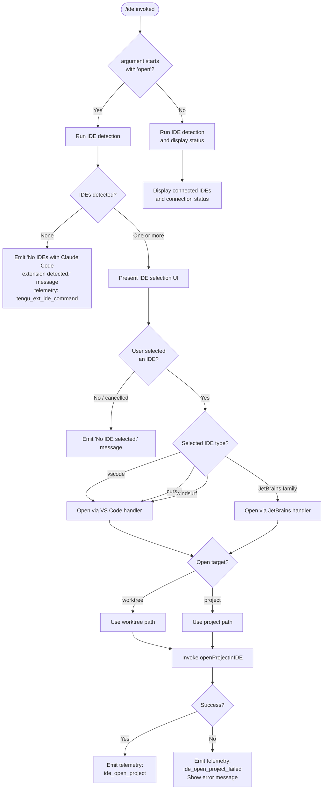

# `/ide`

> Analysis basis: CC v2.1.132 bundle.js (AST extraction + Claude interpretation)
> Minimum version: v2.1.132

---

## Overview

The `/ide` command manages IDE integrations for Claude Code by detecting running IDE instances that have the Claude Code extension installed, displaying their connection status, and optionally opening the current project in a selected IDE. When invoked with the `open` argument, it launches a UI flow that allows the user to pick from detected IDEs (VS Code, Cursor, Windsurf, and JetBrains-family editors) and then instructs the chosen IDE to open the current worktree or project path.

---

## Registration

| Field | Value |
|---|---|
| type | `local-jsx` |
| name | `ide` |
| description | `Manage IDE integrations and show status` |
| argumentHint | `[open]` |
| module_id | `mHq` |

Analysis basis: CC v2.1.132 bundle.js:+10348033

---

## Input Branching

The command entry point (command handler `ideCommandHandler`) receives the raw argument string. The primary branch point is whether the argument begins with the token `"open"`.



Analysis basis: CC v2.1.132 bundle.js:+10347687 (argument `startsWith` check), +10344201 (`"open"` literal), +10344310 (no-IDE message), +10344448 (no-selection message)

---

## Behavioral Spec

### 1. Command Entry Point

```
function ideCommandHandler(args, appContext):
    argument = args.trim()
    connectionStore = getConnectionStore()          // reads from gv6 store
    connectedIDEs  = queryConnectedIDEs(connectionStore)

    if argument.startsWith("open"):
        return runOpenFlow(connectedIDEs, appContext)
    else:
        return renderIDEStatusView(connectedIDEs)
```

Analysis basis: CC v2.1.132 bundle.js:+10347687, +10347533

---

### 2. IDE Detection (`detectRunningIDEs`)

Detection strategy differs by platform.

**macOS path:**

```
function detectIDEsOnMacOS():
    // Reads running application list via platform API (KtK)
    entries = Object.entries(runningApps)
    result  = []
    for each entry in entries:
        name = entry.name.toLowerCase()
        if name matches any known IDE identifier:
            result.push(buildIDERecord(entry))
    return result
```

**Linux path:**

```
function detectIDEsOnLinux():
    // Executes ps command to enumerate processes
    psOutput = exec(
        "ps aux | grep -E \"code|cursor|windsurf|idea|pycharm|webstorm" +
        "|phpstorm|rubymine|clion|goland|rider|datagrip|dataspell" +
        "|aqua|gateway|fleet|android-studio\" | grep -v grep"
    )
    return parseProcessList(psOutput)
```

Telemetry events emitted after detection:
- Success: `"ide_detect"` (Analysis basis: CC v2.1.132 bundle.js:+5027474)
- Failure: `"ide_detect_failed"` (Analysis basis: CC v2.1.132 bundle.js:+5027538)

Analysis basis: CC v2.1.132 bundle.js:+5030072 (`"macos"`), +5030923 (`"linux"`), +5030949 (ps command literal), +5031323 (`"appcode"` / JetBrains detection)

---

### 3. Open-Project Flow (`runOpenFlow`)

```
function runOpenFlow(detectedIDEs, appContext):
    emitTelemetry("tengu_ext_ide_command")

    if detectedIDEs is empty:
        display("No IDEs with Claude Code extension detected.")
        return

    selectedIDE = promptUserToSelectIDE(detectedIDEs)

    if selectedIDE is null:
        display("No IDE selected.")
        return

    targetPath = resolveOpenTarget(appContext)
    // targetPath is either the worktree path or the project path

    result = openProjectInIDE(selectedIDE, targetPath)

    if result.success:
        emitTelemetry("ide_open_project")
    else:
        emitTelemetry("ide_open_project_failed")
        display(result.errorMessage)
```

Analysis basis: CC v2.1.132 bundle.js:+10344095 (`tengu_ext_ide_command`), +10344310, +10344448, +10344648 (`"ide_open_project"`), +10344755 (`"ide_open_project_failed"`), +10344682 (`"worktree"`), +10344693 (`"project"`)

---

### 4. IDE Open Target Resolution

```
function resolveOpenTarget(appContext):
    worktreePath = appContext.worktreePath
    projectPath  = appContext.projectPath

    if worktreePath is defined and non-empty:
        return { kind: "worktree", path: worktreePath }
    else:
        return { kind: "project", path: projectPath }
```

Analysis basis: CC v2.1.132 bundle.js:+10344682, +10344693

---

### 5. IDE-Specific Open Dispatch

```
function openProjectInIDE(ide, target):
    ideType = ide.type.toLowerCase()

    if ideType in ["vscode", "cursor", "windsurf"]:
        return openViaVSCodeProtocol(ide, target)
    else:
        // JetBrains family (idea, pycharm, webstorm, etc.)
        return openViaJetBrainsProtocol(ide, target)
```

Known IDE type string literals found in bundle:
- `"vscode"` — Analysis basis: CC v2.1.132 bundle.js:+10344508
- `"cursor"` — Analysis basis: CC v2.1.132 bundle.js:+10344549
- `"windsurf"` — Analysis basis: CC v2.1.132 bundle.js:+10344590
- `"jetbrains"` — Analysis basis: CC v2.1.132 bundle.js:+5023165

---

### 6. Connection Store Query (`queryConnectedIDEs`)

```
function queryConnectedIDEs(store):
    rawEntries = store.getStore()          // gv6.getStore()
    normalized = []
    for each entry in rawEntries:
        record = normalizeIDEEntry(entry)  // calls ng internally
        normalized.push(record)
    return normalized
```

Analysis basis: CC v2.1.132 bundle.js:+918237 (`gv6.getStore`), +918258 (`ng` normalization call), +918288

---

### 7. IDE Status Rendering

```
function renderIDEStatusView(connectedIDEs):
    // Constructs a JSX/text view of all connected IDEs
    // showing connection type (sse-ide or ws-ide) and status
    lines = []
    for each ide in connectedIDEs:
        statusLine = formatIDEStatus(ide)
        lines.push(statusLine)

    if lines is empty:
        display("No IDEs with Claude Code extension detected.")
    else:
        display(joinLines(lines))
```

Connection protocol identifiers found in bundle:
- `"sse-ide"` — Analysis basis: CC v2.1.132 bundle.js:+10342080
- `"ws-ide"` — Analysis basis: CC v2.1.132 bundle.js:+10342100

---

### 8. Extension Install Prompt

When no IDE extension is detected, the command may trigger an install-extension callback exposed as `onInstallIDEExtension` on the app context. This path is reached after the no-IDE check.

```
function maybePromptExtensionInstall(appContext):
    if appContext.onInstallIDEExtension is callable:
        // Presents installation guidance for the Claude Code extension
        appContext.onInstallIDEExtension()
    else:
        display("restart your IDE")   // fallback hint
```

Analysis basis: CC v2.1.132 bundle.js:+10345222 (`A.onInstallIDEExtension`), +10345313 (`"restart your IDE"`)

---

### 9. Unicode Normalization of Arguments

Before argument comparison the raw input string is normalized to NFC form and `Math.floor` is applied for truncation. A display limit of 3 IDEs is enforced in the summary line (ellipsis appended if more exist).

```
function normalizeArgument(rawArg):
    normalized = rawArg.normalize("NFC")   // NFC literal
    return normalized

function buildIDESummaryLabel(ideList):
    DISPLAY_LIMIT = 3
    visible = ideList.slice(0, DISPLAY_LIMIT)
    label   = visible.map(ide => ide.name).join(", ")
    if ideList.length > DISPLAY_LIMIT:
        label = label + ", …"
    return label
```

Maximum display count: 3 IDEs before ellipsis truncation (Analysis basis: CC v2.1.132 bundle.js:+10347570)
Separator literal `", "` — Analysis basis: CC v2.1.132 bundle.js:+10347795
Ellipsis literal `", …"` — Analysis basis: CC v2.1.132 bundle.js:+10347809
NFC normalization — Analysis basis: CC v2.1.132 bundle.js:+10347638

---

### 10. Background Daemon Interaction

The open-project flow interacts with the background daemon subsystem (the `qFA` / `spawnBackgroundDaemon` family). Key behaviors observed in the call graph:

```
function spawnBackgroundDaemon(config):
    token   = randomBytes(4).toString("hex")   // 4 bytes → 8 hex chars
    socket  = buildSocketPath(token)
    dm.mkdir(socketDir, { recursive: true })
    child   = Bun.spawn(["--bg-pty-host", "200", "50", "--", "--bg-spare"], {
                  stdio: ["ignore", ...],
              })
    child.unref()                               // detach from parent lifetime

    onExit:
        child.kill("SIGTERM")
        wait up to 2000 ms
        if still running: escalate (SIGKILL path via tengu_bg_dispatch_sigkill_escalate)
```

Key literals:
- Background PTY host flag: `"--bg-pty-host"` — Analysis basis: CC v2.1.132 bundle.js:+14111299
- Spare flag: `"--bg-spare"` — Analysis basis: CC v2.1.132 bundle.js:+14111340
- PTY columns arg: `"200"` — Analysis basis: CC v2.1.132 bundle.js:+14111317
- PTY rows arg: `"50"` — Analysis basis: CC v2.1.132 bundle.js:+14111323
- Random token byte length: 4 — Analysis basis: CC v2.1.132 bundle.js:+14111099
- Token encoding: `"hex"` — Analysis basis: CC v2.1.132 bundle.js:+14111111
- Socket permissions mask: `448` (octal 700) — Analysis basis: CC v2.1.132 bundle.js:+14111175
- Graceful-kill wait: 2000 ms — Analysis basis: CC v2.1.132 bundle.js:+14129682
- SIGTERM signal: `"SIGTERM"` — Analysis basis: CC v2.1.132 bundle.js:+14111909
- SIGKILL signal: `"SIGKILL"` — Analysis basis: CC v2.1.132 bundle.js:+14130020
- Spare refill event: `"daemon_bg_spare_refill"` — Analysis basis: CC v2.1.132 bundle.js:+14111042
- Session create event: `"daemon_bg_session_create"` — Analysis basis: CC v2.1.132 bundle.js:+14130282

---

### 11. Session Claim and IPC Connection (`claimAndConnectSession`)

```
function claimAndConnectSession(sessionRef):
    claim = bm.claim(sessionRef)             // claim a spare bg session
    if claim fails:
        emitTelemetry("tengu_bg_sendclaim_failed")
        return error

    socket = sX8.connect(claim.socketPath)
    socket.on("data",    onData)
    socket.once("connect", onConnect)
    socket.write(initPayload)
    Ym(socket)                               // write kill signal setup
    socket.end()
```

Session states observed in literals:
`"done"`, `"killed"`, `"stopped"`, `"failed"`, `"blocked"`, `"crashed"`, `"working"`, `"active"`, `"bg"`, `"daemon"`, `"idle"`, `"resuming"`

Analysis basis: CC v2.1.132 bundle.js:+14133871–+14135265

---

## State & Side Effects

| Item | Detail |
|---|---|
| Telemetry — `tengu_ext_ide_command` | Fired on every `/ide open` invocation (Analysis basis: CC v2.1.132 bundle.js:+10344095) |
| Telemetry — `ide_detect` | Fired after successful IDE detection (Analysis basis: CC v2.1.132 bundle.js:+5027474) |
| Telemetry — `ide_detect_failed` | Fired when IDE detection fails (Analysis basis: CC v2.1.132 bundle.js:+5027538) |
| Telemetry — `ide_open_project` | Fired on successful project open (Analysis basis: CC v2.1.132 bundle.js:+10344648) |
| Telemetry — `ide_open_project_failed` | Fired when project open fails (Analysis basis: CC v2.1.132 bundle.js:+10344755) |
| Telemetry — `tengu_bg_spare_enable` | Fired when spare background session pool is enabled (Analysis basis: CC v2.1.132 bundle.js:+14129457) |
| Telemetry — `tengu_bg_spare_spawn` | Fired when a spare background process is spawned (Analysis basis: CC v2.1.132 bundle.js:+14129749) |
| Telemetry — `tengu_bg_dispatch_sigkill_escalate` | Fired when SIGTERM → SIGKILL escalation occurs (Analysis basis: CC v2.1.132 bundle.js:+14129972) |
| Telemetry — `tengu_bg_sendclaim_failed` | Fired when claiming a background session fails (Analysis basis: CC v2.1.132 bundle.js:+14112495) |
| Telemetry — `tengu_bg_spare_claim` | Fired when a spare session is successfully claimed (Analysis basis: CC v2.1.132 bundle.js:+14130886) |
| Telemetry — `tengu_bg_spare_claim_fail` | Fired when spare claim fails (Analysis basis: CC v2.1.132 bundle.js:+14131149) |
| Telemetry — `tengu_mcp_retry_failed_remote` | Fired when MCP remote retry is exhausted (Analysis basis: CC v2.1.132 bundle.js:+13846663) |
| Telemetry — `tengu_feature_ok` | Fired on successful feature gate check (Analysis basis: CC v2.1.132 bundle.js:+906461) |
| Telemetry — `tengu_feature_bad` | Fired on feature gate failure (Analysis basis: CC v2.1.132 bundle.js:+906517) |
| Telemetry — `tengu_feature_sad` | Fired on feature gate error/exception (Analysis basis: CC v2.1.132 bundle.js:+906587) |
| Hook registration | `onInstallIDEExtension` callback registered from app context (Analysis basis: CC v2.1.132 bundle.js:+10345222) |
| Process side effect | May spawn detached background daemon via `Bun.spawn` with `child.unref()` (Analysis basis: CC v2.1.132 bundle.js:+14111281, +14111440) |
| File system side effect | Creates socket directory (`dm.mkdir`); unlinks socket file on cleanup (`dm.unlink`, `WY.unlink`) (Analysis basis: CC v2.1.132 bundle.js:+14111142, +14111201, +14134831) |
| Lock files | `.lock` suffix used for IPC coordination (Analysis basis: CC v2.1.132 bundle.js:+5023379) |
| `appState` changes | Connection store (`gv6`) updated with IDE roster entries via `A.rosterEntry` (Analysis basis: CC v2.1.132 bundle.js:+14134939) |
| Process termination | On exit, `process.exit` called by session cleanup handler (Analysis basis: CC v2.1.132 bundle.js:+14110307) |
| Sound | <!-- TODO: not found in depth-2 traversal; needs --depth 4 --> |

---

## Version History

| Version | Change |
|---|---|
| v2.1.132 | Initial analysis. Confirmed: `local-jsx` type, `[open]` argument hint, VS Code/Cursor/Windsurf/JetBrains detection, NFC argument normalization, background daemon spawn via `Bun.spawn`. |

---

## Common Mistakes

1. **Expecting `/ide` to open an IDE without the `open` argument.** Without `open`, the command only displays connection status; it does not trigger any IDE launch.

2. **Running `/ide open` when no IDE extension is installed.** The command detects IDE processes but requires the Claude Code extension to be active inside the IDE. A running VS Code process alone is insufficient — the extension must be connected.

3. **Assuming all JetBrains IDEs are identified by a single name.** Detection uses a broad `ps` grep pattern on Linux and an application-name scan on macOS; `"appcode"` and many other JetBrains product names are each checked individually.

4. **Expecting an interactive list when only one IDE is detected.** The UI may auto-select the sole detected IDE without prompting, depending on internal selection logic.

5. **Ignoring the `"restart your IDE"` hint after installing the extension.** The extension registers itself with Claude Code only on IDE startup; the command will not detect it until the IDE is restarted (Analysis basis: CC v2.1.132 bundle.js:+10345313).

6. **Assuming the command works offline.** The open-project flow connects to the IDE via a local Unix socket or named pipe; if the background daemon socket is unavailable (e.g., `ENOENT`, `ECONNREFUSED`), the operation will fail with a telemetry event and no IDE will open (Analysis basis: CC v2.1.132 bundle.js:+14131058, +14131080).

---

## Appendix — Identifier Mapping

> For bundle debugging only. Identifiers change across versions.

| Identifier | Role |
|---|---|
| `zNA` | IDE command argument parser / top-level command handler |
| `N6` | Connection store accessor |
| `Qv6` | Connection store query wrapper |
| `_A` | App state updater / setter utility |
| `H` | Random token generator / setTimeout wrapper |
| `_` | Path normalizer (calls `toLowerCase` and `_.close`) |
| `f` | File/socket handle (calls `_.close`, `q.close`, `K`) |
| `q` | Socket / file set manager (calls `tgq.unlinkSync`) |
| `Y` | IDE connection manager / normalize entry point |
| `j6` | Connection registry lookup (checks `V5H.has`, `mU.has`, `mU.get`) |
| `$` | Disposable resource wrapper (calls `mzq`) |
| `qFA` | Background daemon spawner |
| `d` | Generic state/data record constructor |
| `fH` | Feature gate checker (calls `HA`, `yH`, `kq`, `$wL`) |
| `w` | IDE session manager / connection lifecycle handler |
| `y` | Kill signal helper (calls `aiH`, `siH`, `Y`) |
| `mH` | State helper for session records |
| `SH` | State helper variant |
| `LFA` | Session claim and IPC connector |
| `OFA` | Session task runner / lifecycle orchestrator |
| `K` | Exit / cleanup handler (calls `process.exit`) |
| `j8` | Session metadata record builder |
| `R` | Supervisor IPC writer (calls `z.write`) |
| `K97` | `/ide open` sub-command handler (JSX renderer) |
| `Vf` | IDE list filter / validation helper |
| `wUH` | IDE detection orchestrator |
| `ss6` | JetBrains lock-file scanner |
| `asK` | Lock-file path resolver (`Td_`) |
| `yH` | String coercion utility |
| `ti1` | IDE process name pattern matcher (`H.match`) |
| `L` | IDE label formatter (`padEnd`) |
| `W` | Debounced event emitter / skills notifier |
| `X` | IPC message framer / buffer parser |
| `P` | SDK connection handler |
| `zr1` | Process kill helper (`process.kill`) |
| `M` | MCP retry / remote connection manager |
| `jJ` | IDE name classifier (calls `Gy.basename`, `p0H`) |
| `A` | App context / action dispatcher |
| `Z8` | State record builder variant |
| `Y8` | IDE status view renderer |
| `PA` | IDE selection prompt UI component |
| `Y5A` | IDE detection entry point (dispatches `KtK`) |
| `KtK` | Platform-aware IDE scanner |
| `kc` | Extension-not-found handler / install prompt dispatcher |
| `e17` | IDE filter predicate for selection list |