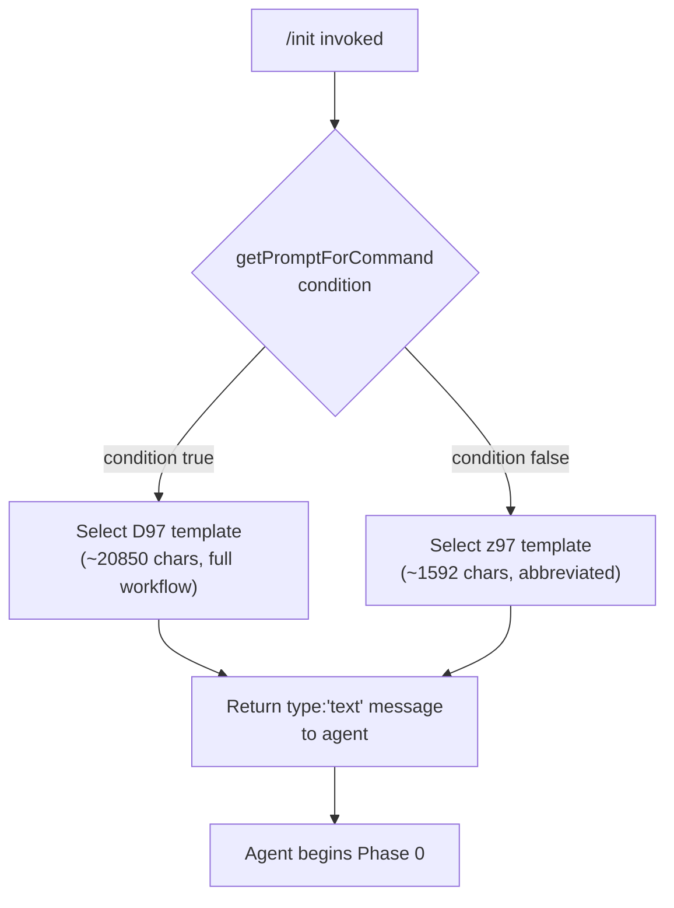
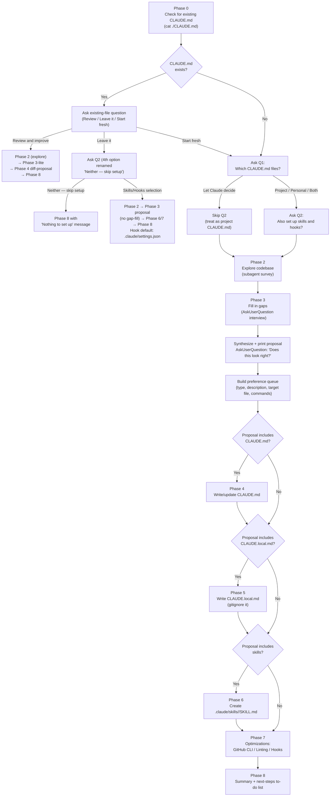

# `/init`

> Analysis basis: CC v2.1.132 bundle.js (AST extraction + Claude interpretation)
> Minimum version: v2.1.132

---

## Overview

The `/init` command bootstraps a repository's Claude Code configuration by guiding the agent through an eight-phase interactive workflow that produces one or more of the following artifacts: a project-level `CLAUDE.md`, a personal `CLAUDE.local.md`, `.claude/skills/<name>/SKILL.md` files, and lifecycle hook entries in `.claude/settings.json` or `.claude/settings.local.json`. The command is implemented as a `prompt` type: invoking it causes Claude Code to send a large instructional prompt (approximately 22,449 characters) to the agent, which then carries out all phases autonomously using its available tools. The handler resolves through the `getPromptForCommand` method inlined directly on the registration object, which selects between two template variants (`D97` at ~20,850 chars and `z97` at ~1,592 chars) before returning a single `text`-type message.

---

## Registration

| Field | Value |
|---|---|
| `type` | `prompt` |
| `name` | `init` |
| `description` | `Initialize new CLAUDE.md file(s) and optional skills/hooks with codebase documentation \| Initialize a new CLAUDE.md file with codebase documentation` |
| `handler_method` | `getPromptForCommand` (ObjectMethod inlined on the registration object) |
| `handler_method_start` (byte) | `10371618` |
| `handler_method_end` (byte) | `10371694` |
| `prompt_body.length` | `22449` characters |
| `prompt_body.trace` | `conditional; identifier→D97 (var template, 20850 chars); identifier→z97 (var template, 1592 chars)` |
| `loc_byte` | `10371302` |
| `loc_byte_end` | `10371695` |
| `loc_line` | `5990` |
| `arbor_handler.name` | `getPromptForCommand` |
| `arbor_handler.fqn` | `claude-2.1.132::getPromptForCommand` |
| `arbor_handler.kind` | `Method` |
| `arbor_handler.resolution_path` | `direct` |
| `handler_method_start` | `10371618` |
| `handler_method_end` | `10371694` |
| `arbor_handler.n_hits` | `2` |

Analysis basis: CC v2.1.132 bundle.js:+10371302

---

## Input Branching

The handler performs a conditional template selection at invocation time, then the agent executes eight sequential phases driven by the prompt body.

### Template Selection (handler level)



Analysis basis: CC v2.1.132 bundle.js:+10371618 (handler), +10371666 (`"text"` literal)

### Agent Phase Routing (prompt-driven)



Analysis basis: CC v2.1.132 bundle.js:+10371302 (registration block), +3752558 (`"CLAUDE.md"` literal), +3752733 (onboarding hint string)

---

## Behavioral Spec

### Phase 0 — Existing-File Detection

Before presenting any questions, the agent reads `./CLAUDE.md` at the project root using a plain `cat` call (no directory traversal). Only the project-root file is authoritative; files in subdirectories do not trigger the "exists" branch. The result determines which Phase 1 question is asked first.

```
function detectExistingClaudeMd():
    result = readFile("./CLAUDE.md")   // cat only; no tree walk
    if result.ok:
        return EXISTS
    else:
        return NOT_FOUND
```

Analysis basis: CC v2.1.132 bundle.js:+10371302

---

### Phase 1 — User Intent Capture

The agent prints a primer explaining `CLAUDE.md`, Skills, and Hooks as plain assistant text before issuing any `AskUserQuestion` call. Questions are issued one at a time; Q2 is never bundled with Q1.

```
function captureUserIntent(existenceState):
    printPrimer()   // CLAUDE.md / Skills / Hooks definitions

    if existenceState == EXISTS:
        answer = askUserQuestion("I found an existing CLAUDE.md. What would you like to do?",
                                 options=["Review and improve it",
                                          "Leave it, set up other things",
                                          "Start fresh (replace it)"])
        return routeExistingFile(answer)

    // No file, or "Start fresh" selected
    q1 = askUserQuestion("Which CLAUDE.md files should /init set up?",
                         options=["Project CLAUDE.md",
                                  "Personal CLAUDE.local.md",
                                  "Both project + personal",
                                  "Let Claude decide"])
    if q1 == "Let Claude decide":
        return {target: PROJECT, skipQ2: true}

    q2 = askUserQuestion("Also set up skills and hooks?",
                         options=["Skills + hooks", "Skills only",
                                  "Hooks only", "Neither, just CLAUDE.md"])
    // Q2 is a hint, not a hard filter — Phase 3 may deviate and explain why
    return {target: q1, auxiliaries: q2}
```

Analysis basis: CC v2.1.132 bundle.js:+10371302

---

### Phase 2 — Codebase Exploration

The agent launches a subagent to survey the repository. The subagent reads: manifest files (`package.json`, `Cargo.toml`, `pyproject.toml`, `go.mod`, `pom.xml`, etc.), `README`, `Makefile`/build configs, CI configs, existing `CLAUDE.md`, `.claude/rules/`, `AGENTS.md`, `.cursor/rules` or `.cursorrules`, `.github/copilot-instructions.md`, `.windsurfrules`, `.clinerules`, `.mcp.json`. It also runs `git worktree list` when a personal `CLAUDE.local.md` is in scope. Items that cannot be determined from code alone are flagged as interview questions for Phase 3.

```
function exploreCodbase(scope):
    subagent.read(MANIFEST_FILES + README + BUILD_CONFIGS + CI_CONFIGS
                  + AI_TOOL_CONFIGS + CLAUDE_CONFIGS)
    findings = {
        buildCommands, testCommands, lintCommands,
        languages, frameworks, packageManager,
        projectStructure,          // monorepo | multi-module | single
        styleDeviations,
        gotchas, envVars,
        existingSkillsDir,         // .claude/skills/ present?
        existingRulesDir,          // .claude/rules/ present?
        formatterConfig,           // prettier | biome | ruff | black | gofmt | rustfmt | unified script
        worktrees                  // only if personal CLAUDE.local.md requested
    }
    gaps = identifyUnanswerableItems(findings)
    return {findings, gaps}
```

Analysis basis: CC v2.1.132 bundle.js:+10371302

---

### Phase 3 — Gap-Fill Interview and Proposal

The agent interviews the user only about items the code cannot answer. Interview scope differs by CLAUDE.md target type. After gathering answers, the agent classifies each finding as a **Hook**, **Skill**, **CLAUDE.md note**, or file artifact, then prints a proposal as plain text before calling `AskUserQuestion("Does this look right?")`. The user's accepted response populates the **preference queue** — the shared data structure consumed by Phases 4–7.

```
function gapFillAndPropose(findings, gaps, userIntent):
    if userIntent.target in [PROJECT, BOTH, LET_CLAUDE_DECIDE]:
        ask about: non-obvious commands, gotchas, branch/PR conventions,
                   required env setup, testing quirks
        // Do NOT mark options as "recommended"

    if userIntent.target in [PERSONAL, BOTH]:
        ask about: user role, familiarity, sandbox URLs, local setup,
                   worktree topology (if worktrees found),
                   communication preferences
        // Do NOT mark options as "recommended"

    proposal = synthesize(findings, gapAnswers, userIntent)
    printProposal(proposal)     // plain assistant text, one bullet per artifact
    confirmation = askUserQuestion("Does this look right?",
                                   options=["Looks good — proceed",
                                            "Drop the hook", "Drop the skill", ...])
    // "Other" is auto-added by the tool
    preferenceQueue = buildQueue(proposal, confirmation)
    return preferenceQueue
```

**"Review and improve" lite path** — only one question is asked: whether team conventions have changed since the file was written. If the user says yes, free-text input is collected, then execution jumps to the Phase 4 diff-proposal flow.

Analysis basis: CC v2.1.132 bundle.js:+10371302

---

### Phase 4 — Write or Update `CLAUDE.md`

Triggered when the accepted proposal includes a project `CLAUDE.md` bullet, or when the user chose "Review and improve" in Phase 0.

```
function writeClaudeMd(mode, preferenceQueue, findings, gapAnswers):
    if mode == REVIEW_AND_IMPROVE:
        existing = readFile("./CLAUDE.md")
        diffs = compareAgainstFindings(existing, findings, gapAnswers)
        printDiffs(diffs)      // one-line reason per diff
        choice = askUserQuestion("Apply these edits?",
                                 options=["Apply all", "Let me pick which",
                                          "Skip — leave it as is"])
        if choice == SKIP: return
        applySelectedDiffs(choice, diffs)
        return

    // Fresh write or "Start fresh"
    content = buildMinimalContent(findings, gapAnswers)
    // Every line must pass: "Would removing this cause Claude mistakes?"
    // Include: non-standard build/test/lint commands, style deviations,
    //          testing quirks, repo etiquette, env vars, gotchas,
    //          AI-tool config content (AGENTS.md, .cursor/rules, etc.)
    // Exclude: file-by-file structure, standard conventions, generic advice,
    //          frequently-changing data (use @path/to/import refs instead),
    //          commands obvious from manifests

    noteEntries = preferenceQueue.filter(type=NOTE, target=CLAUDE_MD)
    content.appendNotes(noteEntries)   // team-level behavioral notes

    prefix = "# CLAUDE.md\n\nThis file provides guidance to Claude Code..."
    writeFile("./CLAUDE.md", prefix + content)

    if projectHasMultipleConcerns:
        suggestRulesDir(".claude/rules/")   // code-style.md, testing.md, etc.

    if projectIsMonorepoOrMultiModule:
        offerSubdirectoryClaudeMdFiles()
```

Analysis basis: CC v2.1.132 bundle.js:+10371302, +3752558 (`"CLAUDE.md"` literal), +3752733 (onboarding hint)

---

### Phase 5 — Write `CLAUDE.local.md`

Triggered when the accepted proposal includes a personal `CLAUDE.local.md` bullet.

```
function writeClaudeLocalMd(preferenceQueue, findings):
    if fileExists("./CLAUDE.local.md"):
        existing = readFile("./CLAUDE.local.md")
        proposeAdditions(existing)     // never silently overwrite
        return

    worktreeTopology = findings.worktrees

    if worktreeTopology == SIBLING_OR_EXTERNAL:
        // Upward file walk won't reach a single file from all worktrees
        actualContent = buildPersonalContent(preferenceQueue, findings)
        writeFile("~/.claude/<project-name>-instructions.md", actualContent)
        stub = "@~/.claude/<project-name>-instructions.md"
        writeFile("./CLAUDE.local.md", stub)
        // NEVER put this import in project CLAUDE.md
    else:
        // Nested worktrees or single worktree — normal path
        content = buildPersonalContent(preferenceQueue, findings)
        writeFile("./CLAUDE.local.md", content)

    noteEntries = preferenceQueue.filter(type=NOTE, target=CLAUDE_LOCAL_MD)
    appendNotes("./CLAUDE.local.md", noteEntries)

    addToGitignore("CLAUDE.local.md")
```

Analysis basis: CC v2.1.132 bundle.js:+10371302

---

### Phase 6 — Create Skills

Triggered when the accepted proposal includes one or more skill bullets.

```
function createSkills(preferenceQueue, findings):
    existingSkills = readDir(".claude/skills/")   // do not overwrite

    // Queue-sourced skills first
    for skillPref in preferenceQueue.filter(type=SKILL):
        if underspecified(skillPref):
            clarify = askUserQuestion("Which test command should <skill> run?", ...)
        content = buildSkillBody(skillPref, findings, clarify)
        skillName = deriveNameFromPreference(skillPref)
        path = ".claude/skills/" + skillName + "/SKILL.md"
        if path not in existingSkills:
            writeFile(path, frontmatter(skillName) + content)

    // Then suggest additional skills from codebase patterns
    suggestions = findRepeatedWorkflows(findings)
    for suggestion in suggestions:
        if not alreadyCoveredByExisting(suggestion, existingSkills):
            presentSuggestion(suggestion)   // name, purpose, why it fits
```

Skill files use YAML frontmatter with `name` and `description` fields. Workflows with side effects receive `disable-model-invocation: true` and use `$ARGUMENTS` for input.

Analysis basis: CC v2.1.132 bundle.js:+10371302

---

### Phase 7 — Additional Optimizations

Triggered unconditionally (GitHub CLI and linting checks run regardless of queue contents; hooks sub-section runs only if queue contains hook entries or a formatter was found).

```
function suggestOptimizations(preferenceQueue, findings, userIntent):
    // GitHub CLI check
    ghPresent = runShell("which gh")  // "where gh" on Windows
    if not ghPresent AND findings.usesGitHub:
        answer = askUserQuestion("Install GitHub CLI?", ...)
        if answer == YES: act()

    // Linting check
    if not findings.lintConfig:
        answer = askUserQuestion("Set up linting?", ...)
        if answer == YES: act()

    // Hooks from preference queue
    hookEntries = preferenceQueue.filter(type=HOOK)
    if not hookEntries AND findings.formatterConfig:
        hookEntries.add(formatOnEditFallback(findings.formatterConfig))

    if hookEntries:
        targetFile = resolveHookTargetFile(userIntent)
        // PROJECT → .claude/settings.json
        // PERSONAL → .claude/settings.local.json
        // BOTH or ambiguous → ask once for all hooks

        // Load hook reference once per /init run
        invokeSkillTool("update-config",
                        args="[hooks-only] <one-line summary of hook being built>")

        for hook in hookEntries:
            event, matcher = mapPreferenceToEvent(hook)
            // "after every edit"      → PostToolUse / Write|Edit
            // "when Claude finishes"  → Stop
            // "before running bash"   → PreToolUse / Bash
            // "before committing"     → NOT a settings hook; offer git pre-commit hook
            followUpdateConfigSkillFlow(hook, event, matcher, targetFile)
            // dedup → construct → pipe-test raw → wrap → write JSON
            // → jq -e validate → live-proof → cleanup → handoff
```

Analysis basis: CC v2.1.132 bundle.js:+10371302, +3752596 (`"workspace"` literal), +3752613 (workspace hint)

---

### Phase 8 — Summary and Next Steps

```
function summarizeAndSuggest(artifactsWritten, findings):
    printRecap(artifactsWritten)   // which files, key points in each
    remindUserFilesAreStartingPoint()
    // "Run /init again anytime to re-scan"

    todoList = []

    if findings.hasFrontend:
        todoList.add("/plugin install frontend-design@claude-plugins-official")
        todoList.add("/plugin install playwright@claude-plugins-official")

    if phase7Gaps.githubCli and userDeclinedGithubCli:
        todoList.add("Install GitHub CLI — enables PR/issue/commit workflows")

    if phase7Gaps.linting and userDeclinedLinting:
        todoList.add("Set up linting — fast feedback for Claude's own edits")

    if findings.testsCoverageIsLow:
        todoList.add("Set up a test framework for self-verification")

    // Always included:
    todoList.add("/plugin install skill-creator@claude-plugins-official")
    todoList.add("Browse official plugins with /plugin")

    printTodoList(sortByImpact(todoList))
```

The `onboarding_project_complete` telemetry event fires during the handler path that transitions through the `SH` function after completion.

Analysis basis: CC v2.1.132 bundle.js:+3753067 (`SH` call), +3753070 (`"onboarding_project_complete"` literal)

---

### Prompt Template Selection Logic

The `getPromptForCommand` method contains a conditional that selects between two pre-built string templates stored in module-level variables. The longer template (`D97`, ~20,850 characters) contains the full eight-phase workflow described above. The shorter template (`z97`, ~1,592 characters) is a condensed variant whose invocation conditions are <!-- TODO: not found in depth-2 traversal; needs --depth 4 --> but is likely triggered when the command is invoked in a constrained context (e.g., workspace mode or a non-standard session type). Both templates return a message of `type: "text"`.

Analysis basis: CC v2.1.132 bundle.js:+10371618 (handler start), +10371666 (`"text"` type literal), +10371678 (`O97` call to build the return object)

---

### Config-Lock and File-Write Safety

The file-writing operations invoked transitively through the call graph operate with config-lock protection. A contention warning fires if lock acquisition exceeds the expected threshold, and a stale-write guard refuses to persist a config that has lost authentication fields relative to the in-memory cache (see GH #3117 references in literals).

```
function saveConfigSafely(path, data, cache):
    lockAcquired = acquireLock(path, timeoutMs=60000)
    if lockAcquired took longer than expected:
        emitTelemetry("tengu_config_lock_contention")
        warn("Lock acquisition took longer than expected...")

    reRead = readConfigFromDisk(path)
    if cache.hasAuth AND not reRead.hasAuth:
        emitTelemetry("tengu_config_auth_loss_prevented")
        refuse("saveConfigWithLock: re-read config is missing auth...")
        return

    backupRotation(path, maxBackups=5)
    writeAtomically(path, data)    // temp file → fchmod → fsync → rename
```

Lock timeout: 60,000 ms (bundle.js:+3106079). Backup rotation keeps up to 5 copies (bundle.js:+3106328). File mode for new config files: octal 600 / decimal 384 (bundle.js:+3106610).

Analysis basis: CC v2.1.132 bundle.js:+3105309 (lock warning string), +3105725 (auth-loss string), +3106079 (60000 ms), +3106328 (5 backups), +3106610 (384 / octal 600)

---

## State & Side Effects

| Item | Detail |
|---|---|
| Telemetry — `tengu_config_parse_error` | Fired when a config file on disk cannot be parsed (bundle.js:+3107927) |
| Telemetry — `tengu_config_lock_contention` | Fired when config-lock acquisition is slower than expected (bundle.js:+3105398) |
| Telemetry — `tengu_config_stale_write` | Fired when a write would overwrite a newer on-disk config (bundle.js:+3105534) |
| Telemetry — `tengu_config_auth_loss_prevented` | Fired when a write is aborted to prevent wiping cached auth (bundle.js:+3105877) |
| Telemetry — `tengu_feature_ok` | Fired via `SH` on successful feature-flag evaluation (bundle.js:+906461) |
| Telemetry — `tengu_slate_harbor_experiment` | Fired via `j6`/`O97` — experiment assignment event (bundle.js:+10348263) |
| Onboarding marker | `"onboarding_project_complete"` string is used as an event/state key after the workflow ends (bundle.js:+3753070) |
| File writes | `./CLAUDE.md`, `./CLAUDE.local.md`, `.claude/skills/<name>/SKILL.md`, `.claude/settings.json`, `.claude/settings.local.json`, optionally `~/.claude/<project-name>-instructions.md` |
| `.gitignore` mutation | `CLAUDE.local.md` is appended to `.gitignore` after Phase 5 writes |
| Config backups | Up to 5 timestamped `.backup.<timestamp>` files are retained in `.claude/backups/` (bundle.js:+3106858, +3106195) |
| File-watch registration | `DPK` registers a `watchFile` listener and a corresponding `unwatchFile` cleanup during config writes (bundle.js:+3103738, +3104065) |
| Subagent launch | Phase 2 launches a subagent for codebase exploration |
| Skill tool invocation | Phase 7 invokes `update-config` skill once per `/init` run to load the hooks schema |
| Sound | None observed in call graph |
| appState changes | <!-- TODO: not found in depth-2 traversal; needs --depth 4 --> |

---

## Version History

| Version | Change |
|---|---|
| v2.1.132 | Initial analysis — eight-phase interactive workflow; dual template selection (D97 / z97); skills, hooks, and CLAUDE.local.md support |

---

## Common Mistakes

1. **Running `/init` expecting instant output.** The command is a `prompt` type: it sends instructions to the agent, which then performs all work interactively. The user must respond to `AskUserQuestion` prompts to drive the workflow forward.

2. **Assuming Q1 and Q2 are asked together.** The prompt body explicitly forbids bundling Q1 and Q2 in a single `AskUserQuestion` call. Selecting "Let Claude decide" for Q1 skips Q2 entirely.

3. **Treating Q2 as a hard filter.** Q2 ("Also set up skills and hooks?") is a hint. Phase 3 may propose hooks when the user said "Skills only" if the codebase evidence strongly supports it; the agent will note the deviation at the top of the proposal.

4. **Expecting `/init` to overwrite existing skills.** Phase 6 reads `.claude/skills/` first and only proposes new skills that complement existing ones. It never silently overwrites.

5. **Placing a worktree import stub in project `CLAUDE.md`.** The prompt body explicitly prohibits putting a `@~/.claude/<project-name>-instructions.md` import in the team-shared `CLAUDE.md`. This import belongs only in the per-worktree `CLAUDE.local.md` stub.

6. **Expecting "before committing" to map to a settings hook.** Claude Code's hook matchers cannot filter `Bash` by command content, so a "before committing" preference is routed to a git pre-commit hook (`.git/hooks/pre-commit`, husky, etc.), not to `.claude/settings.json`.

7. **Re-invoking the `update-config` skill for each hook in Phase 7.** The hook reference skill must be loaded only once per `/init` run. All subsequent hooks in the same session reuse the already-loaded schema context.

8. **Forgetting that `CLAUDE.local.md` must be gitignored.** Phase 5 adds `CLAUDE.local.md` to `.gitignore` automatically, but if Phase 5 is skipped, the file is not protected and may be committed accidentally.

---

## Appendix — Identifier Mapping

> For bundle debugging only. Identifiers change across versions.

| Identifier | Role |
|---|---|
| `__handler_init` | Synthetic BFS entry point for the `/init` command handler (not a real bundle function) |
| `EuH` | Top-level init-workflow orchestrator; calls config read, CLAUDE.md path resolver, and onboarding marker (bundle.js:+3752965) |
| `oM` | Config read/watch coordinator; calls file-read helper and file-watcher setup (bundle.js:+3108873) |
| `R6` | Config read-with-lock; calls file-read helper, date stamp, and watcher registration (bundle.js:+3104226) |
| `F6` | Path / config-root resolution utility (appears in multiple call sites) |
| `Et8` | Config deserialization / parse step (bundle.js:+3104259) |
| `k5H` | Low-level config file reader; handles ENOENT, utf-8 decode, backup creation, directory init (bundle.js:+3107284) |
| `DPK` | File-watch registration/unregistration wrapper around `lQ6.watchFile` / `lQ6.unwatchFile` (bundle.js:+3103733) |
| `Bv1` | CLAUDE.md file-path builder (calls `jAA`; bundle.js:+3752868) |
| `jAA` | Constructs the absolute path to `CLAUDE.md` using `Uv1.join` and workspace root (bundle.js:+3752528) |
| `N6` | Workspace/project root resolver (bundle.js:+918288) |
| `_N6` | Fallback project-root resolver (bundle.js:+951994) |
| `G$` | Project-config write coordinator; calls file-write helper, backup logic, and lock (bundle.js:+3109041) |
| `Nt8` | `saveConfigWithLock` — acquires lock, re-reads config, validates auth, writes atomically (bundle.js:+3105098) |
| `A` | General utility / string coercion helper |
| `K` | Filesystem abstraction module (wraps `q`/Node `fs`, adds `process.exit` error handling; bundle.js:+14110218) |
| `Wc_` | Config object merge/update helper (bundle.js:+2161307) |
| `k` | Log/debug emit helper; formats and routes messages at various log levels (bundle.js:+161661) |
| `d` | Async delay / retry utility |
| `j8` | JSON parse helper |
| `uq6` | Config-auth validation guard; enforces auth-loss prevention (bundle.js:+3109287) |
| `_` | Platform string normalizer (toLowerCase; bundle.js:+14153948) |
| `RH` | JSON stringify helper (bundle.js:+142722) |
| `kt8` | Backup-path builder; joins `.claude/backups/` with timestamp (bundle.js:+3106845) |
| `Z` | String prefix checker (used with `startsWith`) |
| `P` | MCP / SDK connection manager; handles connect, reconnect, promise coordination (bundle.js:+13983027) |
| `I` | Array slice / rotation helper |
| `QyH` | Atomic file-write utility; uses temp file → `fchmod` → `fsync` → `rename` pattern with random hex suffix (bundle.js:+952085) |
| `f` | File descriptor / stream close wrapper (bundle.js:+14139791) |
| `H` | Random delay / jitter helper (uses `Math.random` + `setTimeout`; bundle.js:+12264285) |
| `FbH` | Feature-flag / experiment evaluation helper (bundle.js:+3109140) |
| `gbH` | Timestamp helper (Date.now wrapper; bundle.js:+3104128) |
| `vt8` | CLAUDE.md content write helper; resolves dirname, checks existence, calls atomic writer (bundle.js:+3104940) |
| `SH` | Onboarding completion marker; emits `tengu_feature_ok` (bundle.js:+906459) |
| `O97` | Prompt return-value builder; assembles `{type:"text", ...}` response and fires `tengu_slate_harbor_experiment` (bundle.js:+10348222) |
| `yH` | String coercion / sanitizer used in prompt construction (bundle.js:+25188) |
| `j6` | Experiment/feature-flag lookup; checks seen-set, calls assignment logic (bundle.js:+3085421) |
| `hq6` | Experiment config getter (bundle.js:+3085421) |
| `Rq6` | Experiment variant resolver (bundle.js:+3085458) |
| `Oo` | Experiment participation checker (bundle.js:+3084243) |
| `Mo` | Growthbook feature-flag evaluator (bundle.js:+3078656) |
| `uQ6` | Experiment dedup + assignment coordinator; manages seen-set `Kt8` and calls `Lt8` (bundle.js:+3083221) |
| `Lt8` | Experiment assignment writer; assigns variant, emits `GrowthbookExperimentEvent` via `fo.emit` (bundle.js:+3079172) |
| `Dt8` | Post-assignment side-effect handler (bundle.js:+3084453) |
| `dbH` | Config accessor guard; throws `"Config accessed before allowed."` if called too early (bundle.js:+3107290 via `k5H`) |