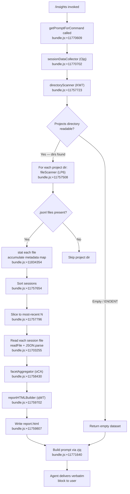

# `/insights`

> Analysis basis: CC v2.1.132 bundle.js (AST extraction + Claude interpretation)
> Minimum version: v2.1.132

---

## Overview

The `/insights` command generates a comprehensive, shareable HTML usage report by scanning the user's Claude Code session data stored in local project directories. It collects, aggregates, and renders session facets into a self-contained `report.html` file, then instructs the agent to deliver a fixed confirmation message pointing the user to the report URL, HTML file path, and facets directory. The command's entire agent-visible output is controlled by a verbatim `<message>` block embedded in the prompt.

---

## Registration

| Field | Value |
|---|---|
| type | `prompt` |
| name | `insights` |
| description | `Generate a report analyzing your Claude Code sessions` |
| handler\_method | `getPromptForCommand` (ObjectMethod, inline on registration object) |
| handler (Arbor) | `getPromptForCommand` — resolved via `direct` path |
| loc\_byte span | `11770429` – `11771751` |
| loc\_line | `8753` |
| prompt length | 518 characters |
| prompt trace | `call→zjq(...) (1 literals)` |
| `loc_byte_end` | `11771751` |
| `handler_method` | `getPromptForCommand` (inline ObjectMethod) |
| `handler_method_start` | `11770603` |
| `handler_method_end` | `11771750` |
| `prompt_body.length` | `518` chars |
| `prompt_body.trace` | `call→zjq(...) (1 literals)` |
| `arbor_handler.name` | `getPromptForCommand` |
| `arbor_handler.kind` | `Method` |
| `arbor_handler.resolution_path` | `direct` |
| `arbor_handler.fqn` | `claude-2.1.132::getPromptForCommand` |
| `arbor_handler.n_hits` | `1` |

Analysis basis: CC v2.1.132 bundle.js:+11770429

---

## Input Branching

The command accepts no user-supplied arguments. All branching is internal to the data-collection pipeline invoked by the handler.



Analysis basis: CC v2.1.132 bundle.js:+11770702

---

## Behavioral Spec

### 1. Handler Entry Point — `getPromptForCommand`

The handler is an ObjectMethod residing directly on the registration object (Arbor resolution path: `direct`). It is the sole entry point for the command.

```
async function getPromptForCommand():
    insightsData  = await sessionDataCollector()   // Ojq
    summaryText   = buildAtAGlance(insightsData)
    promptText    = buildPromptString(             // zjq
                        insightsData,
                        summaryText
                    )
    return promptText
```

Analysis basis: CC v2.1.132 bundle.js:+11770609

---

### 2. Directory Scanner — `directoryScanner`

Scans the Claude Code `projects` sub-directory (literal `"projects"`, bundle.js:+11783465) inside the application data path to enumerate per-project session directories.

```
async function directoryScanner(baseDataPath):
    projectsPath = path.join(baseDataPath, "projects")  // Mn + D$.join
    entries      = await fs.readdir(projectsPath)        // qh.readdir
    dirs         = entries.filter(e => e.isDirectory())  // L.isDirectory

    results = []
    queue   = []

    for each dir in dirs:
        sessionFiles = await fileScanner(path.join(projectsPath, dir))  // LP6
        queue.push(sessionFiles)

    // batched with setImmediate to avoid blocking event loop
    // bundle.js:+11757630
    await setImmediate()

    results.sort(/* chronological order */)  // q.sort, bundle.js:+11757654
    return results
```

Constants:
- Scan start index: `0` (bundle.js:+11757379)
- Batch size limits: `10` / `9` (bundle.js:+11757600, +11757605)
- Sort window: `50` / `200` entries (bundle.js:+11757742, +11757747)

Analysis basis: CC v2.1.132 bundle.js:+11757723

---

### 3. File Scanner — `fileScanner`

Enumerates `.jsonl` session files within a single project directory and collects their filesystem metadata.

```
async function fileScanner(projectDirPath):
    entries   = await fs.readdir(projectDirPath)       // yK.readdir
    files     = entries.filter(e =>
                    e.isFile() &&                       // L.isFile
                    filenameValidator(e.name)           // Uc → U64.test
                )
    // filenameValidator checks the ".jsonl" extension
    // literal: ".jsonl"  bundle.js:+11834151

    metaMap = new Map()
    fileList = []

    for each file in files:
        basename = path.basename(file)                  // D$.basename
        fileList.push(basename)                         // q.push
        fullPath = path.join(projectDirPath, basename)  // D$.join

    stats = await Promise.all(
        fileList.map(f => fs.stat(f))                  // yK.stat
    )
    for each [file, stat] of zip(fileList, stats):
        metaMap.set(file, stat)                        // A.set

    // mime/extension classification via k()
    // bundle.js:+11834453
    return metaMap
```

Analysis basis: CC v2.1.132 bundle.js:+11757508

---

### 4. Session Reader — `sessionReader`

Reads individual session files and deserializes their JSONL content.

```
async function sessionReader(sessionFilePath, dataRootPath):
    fullPath    = path.join(dataRootPath, sessionFilePath)   // Xg.join, n27
    usageDir    = resolveUsageDataDir(dataRootPath)          // iCA → AY8
    // sub-directories: "usage-data"  bundle.js:+11697233
    //                  "session-meta" bundle.js:+11697329
    //                  "facets"       bundle.js:+11697283

    rawBytes    = await fs.readFile(fullPath)                // qh.readFile
    parsed      = safeJsonParse(rawBytes)                    // B6 → JSON.parse
    return parsed
```

Analysis basis: CC v2.1.132 bundle.js:+11757876

---

### 5. Facet Aggregator — `facetAggregator`

Processes raw session records into structured analytics facets consumed by the report builder. Handles tool-use classification, response-time bucketing, time-of-day distribution, and error categorisation.

```
function facetAggregator(sessions, options):
    facets = {}

    for each session in sessions:
        // Tool classification labels (from literals):
        // "WebSearch", "WebFetch", "Edit", "Write",
        // "git commit", "git push", "Other"
        // bundle.js:+11697878 – +11698776

        // Response-time buckets (seconds):
        // "2-10s", "10-30s", "30s-1m", "1-2m",
        // "2-5m", "5-15m", ">15m"
        // bundle.js:+11713893 – +11713953
        // Bucket boundaries: 120s, 900s
        // bundle.js:+11714113, +11714195

        // Time-of-day slots:
        // "Morning (6-12)"   hours 7,11     bundle.js:+11714741
        // "Afternoon (12-18)" hours 12-17   bundle.js:+11714788
        // "Evening (18-24)"  hours 18-23   bundle.js:+11714842
        // "Night (0-6)"      hours 0-4     bundle.js:+11714894

        // Token windows:
        // context max: 30 000 tokens      bundle.js:+11702468
        // output max:  25 000 tokens      bundle.js:+11702489
        // total max context: 4 096 tokens bundle.js:+11704654

        // Session read limit: 500 entries  bundle.js:+11701691
        // Facet truncation:   300 items    bundle.js:+11701983
        // HTML report char limit: 8 192   bundle.js:+11713062

        // Tool error signals (literals):
        // "exit code"               bundle.js:+11698844
        // "Command Failed"          bundle.js:+11698859
        // "rejected"                bundle.js:+11698895
        // "string to replace not found" bundle.js:+11698972
        // "no changes"              bundle.js:+11699015
        // "Edit Failed"             bundle.js:+11699031
        // "modified since read"     bundle.js:+11699064
        // "File Changed"            bundle.js:+11699089
        // "exceeds maximum"         bundle.js:+11699123
        // "too large"               bundle.js:+11699154
        // "File Too Large"          bundle.js:+11699169
        // "file not found"          bundle.js:+11699205
        // "does not exist"          bundle.js:+11699235
        // "File Not Found"          bundle.js:+11699255

        aggregateIntoFacets(session, facets)

    facets["at_a_glance"] = buildAtAGlanceSummary(facets)
    // literal: "at_a_glance"  bundle.js:+11710920
    // fallback: "None captured"  bundle.js:+11710254

    return facets
```

Analysis basis: CC v2.1.132 bundle.js:+11758430

---

### 6. Report HTML Builder — `reportHTMLBuilder`

Transforms aggregated facets into a self-contained HTML report string. Uses inline chart colours and HTML-escaping helpers.

```
function reportHTMLBuilder(facets):
    // HTML-escape all user-supplied strings via S5 → H.replaceAll
    // escape map: "&amp;" "&lt;" "&gt;" "&quot;" "&apos;"
    // bundle.js:+4159589 – +4159712

    // Chart palette (hex literals):
    // #2563eb  bundle.js:+11751558
    // #0891b2  bundle.js:+11751696
    // #10b981  bundle.js:+11751868
    // #8b5cf6  bundle.js:+11752011
    // #dc2626  bundle.js:+11755274   (errors)
    // #16a34a  bundle.js:+11755523   (success)
    // #eab308  bundle.js:+11756016   (warnings)

    // Empty-state placeholders:
    // '<p class="empty">No data</p>'              bundle.js:+11713384
    // '<p class="empty">No response time data</p>' bundle.js:+11713841
    // '<p class="empty">No time data</p>'         bundle.js:+11714691
    // '<p class="empty">No tool errors</p>'       bundle.js:+11755285

    // Markdown inline formatting applied before HTML emission:
    // **bold** → <strong>$1</strong>  bundle.js:+11715599
    // list items prefixed with "• "   bundle.js:+11715642
    // newlines converted to <br>      bundle.js:+11715672

    // "Add to CLAUDE.md" suggestion link injected
    // bundle.js:+11719237

    html = assembleHTMLSections(facets)
    return html
```

Output filename: `"report.html"` (bundle.js:+11759779)

Analysis basis: CC v2.1.132 bundle.js:+11759702

---

### 7. Report Writer — `reportWriter`

Persists the rendered HTML and facet JSON data to disk, then constructs file-system paths returned to the prompt builder.

```
async function reportWriter(htmlContent, facets, dataRootPath):
    outDir     = path.join(dataRootPath, resolveInsightsDir())  // Xg.join, AY8
    await fs.mkdir(outDir, { recursive: true })                  // qh.mkdir

    htmlPath   = path.join(outDir, "report.html")
    facetsDir  = path.join(outDir, "facets")                    // literal "facets"

    await fs.writeFile(htmlPath, htmlContent, "utf-8")           // qh.writeFile
    // encoding: "utf-8"  bundle.js:+11703279

    // Per-session facet JSON files written under facetsDir
    // each serialised via RH → JSON.stringify  bundle.js:+142722

    return { htmlPath, facetsDir, reportUrl }
```

Analysis basis: CC v2.1.132 bundle.js:+11759721

---

### 8. Prompt Assembly — `promptBuilder`

Constructs the final prompt string injected into the agent context. The prompt body is assembled by `zjq` (bundle.js:+11771640) and serialised with `RH` (JSON.stringify wrapper, bundle.js:+11771658).

```
function promptBuilder(insightsData, atAGlanceSummary, paths):
    // The prompt instructs the agent to:
    // 1. Treat the injected insights data as context only.
    // 2. Output the fixed <message> block verbatim — no omissions.
    // 3. The <message> confirms the report is ready and provides
    //    the report URL and HTML path.
    // 4. Close with an open invitation: "Want to dig into any
    //    section or try one of the suggestions?"

    // Separator literal: " · "  bundle.js:+11771066
    // Fallback when no data: "_No insights generated_"
    //   bundle.js:+11771505

    // Math.round applied to numeric summary values
    //   bundle.js:+11770995

    // _Y8 (sessionMetaResolver) invoked to resolve session-meta path
    //   bundle.js:+11771717

    prompt = assemblePromptBody(insightsData, paths, atAGlanceSummary)
    return prompt
```

Analysis basis: CC v2.1.132 bundle.js:+11771640

---

### 9. Session Data Collector — `sessionDataCollector` (top-level orchestrator)

```
async function sessionDataCollector():
    dirs          = await directoryScanner()                // KW7
    recentSessions = dirs.slice(0, RECENT_LIMIT)           // _.slice
    // RECENT_LIMIT: 5  bundle.js:+11758031

    rawData = await Promise.all(
        recentSessions.map(s => sessionReader(s))           // n27
    )

    facets = facetAggregator(rawData)                       // oCA

    // warmup pass label: "warmup_minimal"  bundle.js:+11759538
    // session type label: "insights"       bundle.js:+11704545

    atAGlance = facets["at_a_glance"]

    // Full per-session report generation
    reportData = await fullReportGenerator(rawData, facets) // r27 / qW7

    paths = await reportWriter(reportData.html, facets)     // i27 / l27

    return {
        insightsData : reportData,
        atAGlance    : atAGlance,
        paths        : paths
    }
```

Constants:
- Recent session slice limit: `5` (bundle.js:+11758031)
- Role label used in message construction: `"user"` (bundle.js:+11758046)
- Internal JSON instruction marker: `"RESPOND WITH ONLY A VALID JSON OBJECT"` (bundle.js:+11758127)
- Facet record key: `"record_facets"` (bundle.js:+11758180)

Analysis basis: CC v2.1.132 bundle.js:+11770702

---

## State & Side Effects

| Item | Detail |
|---|---|
| Files written | `<dataRoot>/insights/report.html` — self-contained HTML report (bundle.js:+11759779, +11759807) |
| Files written | `<dataRoot>/insights/facets/*.json` — per-session facet JSON files (bundle.js:+11697283) |
| Directories created | `<dataRoot>/insights/` and `<dataRoot>/insights/facets/` created with `mkdir recursive` (bundle.js:+11759721) |
| Files read | All `.jsonl` session logs under `<dataRoot>/projects/*/` (bundle.js:+11834151) |
| Files read | `session-meta` sub-directory entries (bundle.js:+11697329) |
| Files read | `usage-data` sub-directory entries (bundle.js:+11697233) |
| Telemetry | No `tengu_insights_*` events found in depth-2 traversal — see note below |
| Hook registration | <!-- TODO: not found in depth-2 traversal; needs --depth 4 --> |
| appState changes | None observed at depth ≤ 2 |
| Sound | None observed |
| Network | None — fully offline report generation |
| Agent output | Fixed verbatim `<message>` block; agent must not alter or omit any line |

> **Telemetry note**: The `telemetry` array captured in the depth-2 traversal reflects events from shared infrastructure functions (daemon, MCP, voice, transcript) reached transitively. No `/insights`-specific `tengu_*` event names were found at this traversal depth. <!-- TODO: not found in depth-2 traversal; needs --depth 4 -->

---

## Version History

| Version | Change |
|---|---|
| v2.1.132 | Initial analysis — `getPromptForCommand` inline handler; HTML report with 7-colour palette; session slice limit 5; `.jsonl` file scanning; `report.html` output |

---

## Common Mistakes

1. **Expecting interactive output before the agent responds.** The command computes the entire report synchronously before the agent produces any output. There is no streaming progress indicator — the terminal appears idle during data collection.

2. **Running `/insights` in a project with no `.jsonl` session files.** If no session logs exist under the `projects` directory, the command falls back to the `"_No insights generated_"` placeholder (bundle.js:+11771505) and the report HTML will contain only empty-state panels.

3. **Assuming the agent will summarise or paraphrase the report.** The prompt explicitly instructs the agent to output the `<message>` block verbatim without omitting any line. Any attempt to ask the agent to shorten the output before it has been delivered will be overridden by the handler's instructions.

4. **Looking for the report in the current working directory.** The HTML file is written to the Claude Code data root under `insights/report.html`, not the project working directory. The exact path is surfaced in the agent's confirmation message.

5. **Expecting more than 5 sessions to be analysed.** The collector slices the sorted session list to the 5 most-recent entries (bundle.js:+11758031). Older sessions are excluded from the rendered report.

6. **Conflating `/insights` with a live dashboard.** The command is a one-shot snapshot. It does not watch for new sessions or refresh the HTML file after generation.

---

## Appendix — Identifier Mapping

> For bundle debugging only. Identifiers change across versions.

| Identifier | Role |
|---|---|
| `__handler_insights` | Synthetic BFS entry node representing the `getPromptForCommand` ObjectMethod |
| `Ojq` | `sessionDataCollector` — top-level orchestrator for data collection and report writing |
| `KW7` | `directoryScanner` — reads the `projects` directory and enumerates session subdirectories |
| `Mn` | `projectsPathBuilder` — constructs the `projects` sub-path using `D$.join` |
| `LP6` | `fileScanner` — enumerates `.jsonl` files within a single project directory |
| `Uc` | `filenameValidator` — regex test (`U64.test`) for `.jsonl` extension |
| `n27` | `sessionReader` — reads and parses a single session JSONL file |
| `iCA` | `dataSubdirResolver` — resolves `usage-data` / `session-meta` sub-paths |
| `AY8` | `insightsDirResolver` — resolves the `insights` output directory path |
| `B6` | `safeJsonParse` — wraps `JSON.parse` |
| `oCA` | `facetAggregator` — aggregates raw session records into analytics facets |
| `p27` | `sessionFacetProcessor` — processes a single session's tool-use and error records |
| `m27` | `extensionExtractor` — calls `Xg.extname` to classify file types |
| `vMH` | `diffApplier` — wraps `Lx1.diff` for diff-based facet computation |
| `EM` | `elapsedTimeCalculator` — computes per-turn elapsed time for response-time buckets |
| `rCA` | `facetPostProcessor` — post-processes aggregated facet data |
| `qW7` | `reportHTMLBuilder` — renders the full HTML report string |
| `mqH` | `toolUsageTableRenderer` — builds the tool-usage section of the HTML report |
| `HW7` | `responseTimeChartRenderer` — builds the response-time chart section |
| `AW7` | `timeOfDayChartRenderer` — builds the time-of-day distribution chart |
| `_W7` | `reportSectionSerializer` — serialises a report section via `RH` |
| `HY8` | `markdownToHtmlConverter` — converts inline Markdown to HTML fragments via `I7` |
| `I7` | `htmlEscapeAndFormat` — HTML-escapes strings via `S5` |
| `S5` | `htmlEntityReplacer` — performs `H.replaceAll` for HTML entity substitution |
| `i27` | `facetFileWriter` — writes per-session facet JSON files to the facets directory |
| `l27` | `reportFileWriter` — writes the `report.html` file |
| `r27` | `fullReportGenerator` — orchestrates complete per-session report generation |
| `d27` | `sessionBatchProcessor` — processes sessions in parallel batches via `Promise.all` |
| `F27` | `sessionContentFormatter` — formats session content for inclusion in the report |
| `HzH` | `sessionReportRenderer` — renders a single session's report fragment |
| `jf8` | `contentHasher` — computes SHA-1 hex hashes (`Ew6.createHash`, length 6) for deduplication |
| `$8` | `uuidGenerator` — calls `SG.randomUUID` |
| `lIH` | `assistantMessageExtractor` — extracts the last assistant message from a session |
| `fW` | `reportFinalizer` — finalises the rendered report fragment |
| `Mjq` | `sessionTypeClassifier` — classifies sessions via `jk` |
| `jk` | `sessionKindResolver` — resolves session kind using `zM` / `DM` |
| `vL` | `sessionFilterPredicate` — filters sessions by type via `H.filter` |
| `o27` | `statisticsAggregator` — computes median, mean, percentile statistics over facets |
| `NiH` | `facetEntryMapper` — maps facet entries via `Object.entries` |
| `a9` | `subArraySlicer` — utility for indexed slicing (`H.indexOf`, `H.slice`) |
| `$jq` | `topKSelector` — selects top-K items by frequency from sorted facet lists |
| `s27` | `globalStatsCollector` — collects global cross-session statistics |
| `fjq` | `perSessionReportJob` — the per-session async job dispatched by `s27` |
| `C27` | `sessionPathResolver` — resolves session path via `jk` |
| `U27` | `nanGuard` — guards against `NaN` in numeric facet values (`Number.isNaN`) |
| `zjq` | `promptStringBuilder` — constructs the final prompt string injected into the agent |
| `RH` | `jsonStringifyWrapper` — wraps `JSON.stringify` (bundle.js:+142722) |
| `_Y8` | `sessionMetaResolver` — resolves the session-meta directory path via `AY8` |
| `Djq` | `facetCleanup` — post-write cleanup of temporary facet files |
| `c27` | `sessionCacheReader` — reads cached session data; performs `qh.unlink` on stale entries |
| `fW7` | `facetKeyEnumerator` — enumerates facet object keys via `Object.keys` |
| `gjq` | `sessionIndexRelinker` — relinks session index entries; emits `tengu_relink_walk_broken` |
| `HnA` | `parentUuidNormaliser` — normalises `parentUuid` fields in JSONL records |
| `nW7` | `jsonlBinaryParser` — low-level binary JSONL parser using `Buffer` and `jN.openSync` / `jN.readSync` |
| `iW7` | `jsonlHeaderReader` — reads JSONL file header synchronously |
| `lW7` | `jsonlStreamParser` — streaming JSONL parser using `Buffer.concat` |
| `Jt` | `sessionIndexManager` — manages the in-memory session index maps (`C`, `q`, `L`, etc.) |
| `qY8` | `sessionIndexBuilder` — builds the session index from raw JSONL data |
| `C1H` | `chainBuilder` — builds conversation chains from session index |
| `uW7` | `chainSorter` — sorts and deduplicates conversation chain entries |
| `CW7` | `chainQueueProcessor` — processes the chain build queue |
| `xW7` | `nanTimestampFilter` — filters chains with NaN timestamps |
| `LXq` | `chainEntryAccumulator` — accumulates chain entries into the index |
| `AQH` | `messageMapper` — maps raw messages via `H.map` |
| `DbA` | `contentNormaliser` — normalises message content strings |
| `gj6` | `contentPartParser` — parses individual content parts |
| `wbA` | `attachmentChecker` — checks for image/document attachments |
| `mW7` | `imageAttachmentChecker` — checks for `"image"` type attachments |
| `pW7` | `documentAttachmentChecker` — checks for `"document"` type attachments |
| `wY8` | `summaryBuilder` — builds session summary records |
| `JY8` | `indexValueCollector` — collects index values via `Array.from(H.values())` |
| `HA` | `errorWrapper` — wraps errors with `String` coercion (bundle.js:+133910) |
| `vH` | `stringCoercer` — coerces values to `String` (bundle.js:+133978) |
| `yH` | `stringConverter` — converts values to `String` (bundle.js:+25188) |
| `fH` | `errorLogger` — logs errors via `EQ.logError` and `kyH.push` |
| `hj` | `timestampNormaliser` — normalises timestamps in index entries |
| `TW7` | `indexInitialiser` — initialises the session index data structures |
| `xu` | `uuidValidator` — validates UUID fields in session records |
| `gjq` | `relinkWalker` — walks broken parent links; emits `tengu_relink_walk_broken` (bundle.js:+11803362) |