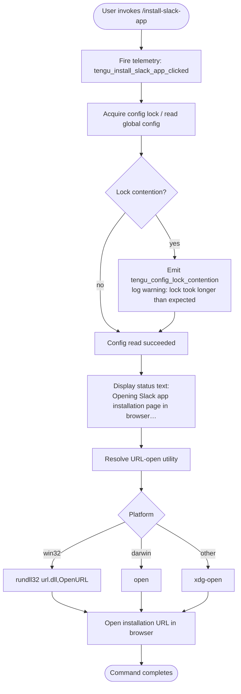

# `/install-slack-app`

> Analysis basis: CC v2.1.132 bundle.js (AST extraction + Claude interpretation)
> Minimum version: v2.1.132

---

## Overview

The `/install-slack-app` command is a local, non-interactive slash command that opens the Claude Slack application installation page in the user's default browser. It fires a telemetry event at invocation, displays a short status message, resolves the OS-appropriate browser-open mechanism, and then delegates to a URL-opening utility — all without requiring any user input or producing further interactive output.

---

## Registration

| Field | Value |
|---|---|
| type | `local` |
| name | `install-slack-app` |
| description | `Install the Claude Slack app` |
| supportsNonInteractive | `false` |
| module_id | `a6q` |
| load_inline | `true` |
| handler | `h97` (AsyncFunction, resolved via `module_id`) |
| `loc_byte_end` | `10434951` |
| `arbor_handler.name` | `h97` |
| `arbor_handler.kind` | `AsyncFunction` |
| `arbor_handler.resolution_path` | `module_id` |
| `arbor_handler.fqn` | `claude-2.1.132::h97` |
| `arbor_handler.n_hits` | `0` |

Analysis basis: CC v2.1.132 bundle.js:+10434765 – +10434951

---

## Input Branching

The command accepts no user-supplied arguments. All branching is driven by the runtime environment (operating system) rather than by input content.



Analysis basis: CC v2.1.132 bundle.js:+10434369, +10434409, +10434484, +10434517, +7355523, +7355558, +7355574, +7355658, +7355732, +7355739

---

## Behavioral Spec

### 1. Command Entry Point

The async handler `h97` (resolved via `module_id: "a6q"`) is the top-level entry point for this command.

```
async function installSlackAppHandler(context):
    fire telemetry event "tengu_install_slack_app_clicked"
    call saveGlobalConfig(context)          // persists any pending config state
    call openUrlInBrowser(installationUrl)  // opens the Slack install page
    return text result "Opening Slack app installation page in browser…"
```

Analysis basis: CC v2.1.132 bundle.js:+10434369 (telemetry), +10434409 (config save call), +10434484 (browser-open call), +10434504 (return type `"text"`), +10434517 (status string)

---

### 2. Config Persistence (saveGlobalConfig)

Before opening the browser, the handler calls a config-save utility that acquires a file-system lock on the global config file (`~/.claude.json`) and writes any pending state. The depth-2 traversal reveals a multi-step locking protocol used by this utility.

```
async function saveGlobalConfig(context):
    acquire filesystem lock on globalConfigPath
    if lock acquisition exceeds timeout:
        emit telemetry "tengu_config_lock_contention"
        log warning "Lock acquisition took longer than expected - another Claude instance may be running"

    reRead = readConfigFromDisk(globalConfigPath)

    if cachedConfig has auth AND reRead is missing auth:
        emit telemetry "tengu_config_auth_loss_prevented"
        log warning "saveGlobalConfig fallback: re-read config is missing auth that cache has; refusing to write. See GH #3117."
        releaseLock()
        return

    if configHasBeenModifiedElsewhere(reRead):
        emit telemetry "tengu_config_stale_write"

    mergedConfig = merge(reRead, pendingChanges)
    atomicWriteConfig(globalConfigPath, mergedConfig)
    releaseLock()
```

Key constants observed in the traversal:

- Lock-wait warning string: `"Lock acquisition took longer than expected - another Claude instance may be running"` (bundle.js:+3105309)
- Config access guard error string: `"Config accessed before allowed."` (bundle.js:+3107290)
- Auth-loss prevention log message references GH issue #3117 (bundle.js:+3102607, +3105725)
- Backup file infix: `".backup."` (bundle.js:+3106195)
- Maximum backup copies retained: `5` (bundle.js:+3106328)
- Config file encoding: `"utf-8"` (bundle.js:+3107373)
- Lock-wait timeout: `60000` ms (bundle.js:+3106079)
- Config directory mode (octal): `384` (= `0o600`) (bundle.js:+3106610)

Analysis basis: CC v2.1.132 bundle.js:+3102400, +3105098, +3105266, +3105309, +3105398, +3105534, +3105725, +3105877

---

### 3. Atomic Config Write (writeConfigAtomically)

The config write path uses a temp-file + rename strategy to prevent partial writes.

```
function writeConfigAtomically(targetPath, data):
    tempPath = join(dirname(targetPath), randomHexBytes(6) + ".tmp")  // 6 random bytes → hex string
    originalMode = statSync(targetPath).mode  // preserve existing file permissions
    writeFileSync(tempPath, serialize(data), encoding="utf-8")
    fchmodSync(tempPath, originalMode)
    fsyncSync(tempPath)
    log debug "Applied original permissions to temp file"
    renameSync(tempPath, targetPath)          // atomic on POSIX
    if old temp file exists: unlinkSync(old)
```

Constants:
- Random bytes for temp name: `6` (bundle.js:+952813), encoded as `"hex"` (bundle.js:+952825)
- Permission bits examined via `fchmodSync` after temp write (bundle.js:+953291)
- fsync called before rename to flush kernel buffers (bundle.js:+953357)
- Log string: `"Applied original permissions to temp file"` (bundle.js:+953312)

Analysis basis: CC v2.1.132 bundle.js:+952797, +952862, +952964, +953233, +953291, +953357, +953485

---

### 4. Browser URL Opening (openUrlInBrowser)

```
function openUrlInBrowser(url):
    validate url scheme is "http:" or "https:"   // rejects other schemes
    platform = process.platform

    if platform == "win32":
        spawn("rundll32", ["url.dll,OpenURL", url])
    else if platform == "darwin":
        spawn("open", [url])
    else:                                         // Linux / other POSIX
        spawn("xdg-open", [url])
```

Constants:
- Accepted schemes: `"http:"` (bundle.js:+7355286), `"https:"` (bundle.js:+7355308)
- Windows check string: `"win32"` (bundle.js:+7355574)
- macOS check string: `"darwin"` (bundle.js:+7355558)
- Windows launcher: `"rundll32"` with argument `"url,OpenURL"` (bundle.js:+7355658, +7355670)
- macOS launcher: `"open"` (bundle.js:+7355732)
- Linux launcher: `"xdg-open"` (bundle.js:+7355739)

Analysis basis: CC v2.1.132 bundle.js:+7355523, +7355236 (Error on invalid URL), +7355607

---

### 5. Background Daemon / Spare-Session Interactions

The call graph reaches the background session management layer (`w`, `Y`, `PA`, `rJH`) through the config-write and URL-open paths. These are shared infrastructure utilities rather than behavior specific to this command. The relevant observed behavior is:

- Spare background sessions are spawned proactively with `bm.spawn` and claimed on demand (bundle.js:+14130767, +14130886).
- A SIGKILL escalation path exists for unresponsive background sessions with a 30-second initial timeout and 15-second escalation window (bundle.js:+14129927, +14129938, +14130013, +14130020).
- Daemon session creation is recorded under telemetry event `"daemon_bg_session_create"` (bundle.js:+14130282).

These interactions are **not triggered by normal command execution** but surface in the traversal because they share helper modules with the config-write subsystem.

Analysis basis: CC v2.1.132 bundle.js:+14129749, +14130282, +14130309, +14130767, +14130886

---

## State & Side Effects

| Item | Detail |
|---|---|
| Telemetry (primary) | `tengu_install_slack_app_clicked` — fired immediately on handler entry (bundle.js:+10434371) |
| Telemetry (config layer) | `tengu_config_lock_contention` — lock wait exceeded threshold (bundle.js:+3105398) |
| Telemetry (config layer) | `tengu_config_stale_write` — on-disk config diverged from cache at write time (bundle.js:+3105534) |
| Telemetry (config layer) | `tengu_config_parse_error` — config JSON parse failure (bundle.js:+3107927) |
| Telemetry (config layer) | `tengu_config_auth_loss_prevented` — refused write to avoid wiping auth (bundle.js:+3105877) |
| Telemetry (bg daemon) | `tengu_bg_spare_spawn`, `tengu_bg_spare_enable`, `tengu_bg_spare_claim`, `tengu_bg_spare_claim_fail`, `tengu_bg_dispatch_sigkill_escalate` — background session lifecycle (shared infrastructure) |
| File system | Global config file (`~/.claude.json`) may be rewritten with an atomic temp-file rename. Backup files (infix `".backup."`) kept up to 5 copies. |
| Browser | Default OS browser is launched with the Slack app installation URL. |
| stdout / return | A single `text`-type result containing `"Opening Slack app installation page in browser…"` is returned to the CLI renderer. |
| Hook registration | <!-- TODO: not found in depth-2 traversal; needs --depth 4 --> |
| appState changes | <!-- TODO: not found in depth-2 traversal; needs --depth 4 --> |
| Sound | None observed. |

---

## Version History

| Version | Change |
|---|---|
| v2.1.132 | Initial analysis — command registered as `local` type, handler `h97`, opens Slack install URL via OS browser launcher |

---

## Common Mistakes

1. **Running in non-interactive mode**: `supportsNonInteractive` is `false`. Invoking this command in a headless or piped session (e.g., `echo "" | claude /install-slack-app`) will be rejected or produce no useful output because a browser cannot be opened.

2. **Expecting in-CLI output beyond the status line**: The command emits exactly one text message (`"Opening Slack app installation page in browser…"`) and then exits. Any further Slack setup must be completed in the browser.

3. **Assuming no file I/O occurs**: The command calls the global config save routine before opening the browser. If another Claude process holds the config lock, this command will block and emit a lock-contention warning. Running multiple Claude instances simultaneously can cause unexpected delays.

4. **Missing browser on Linux**: The command delegates to `xdg-open` on non-macOS, non-Windows platforms. If `xdg-open` is absent (e.g., minimal server environments), the command will fail silently or throw an error, because no fallback browser launcher is defined within the traversed depth.

5. **URL scheme assumptions**: Only `http:` and `https:` URLs are accepted by the browser-open utility. Any future reconfiguration pointing to a non-HTTP URL would cause an `Error` to be thrown before the browser is launched.

---

## Appendix — Identifier Mapping

> For bundle debugging only. Identifiers change across versions.

| Identifier | Role |
|---|---|
| `h97` | Main async handler for `/install-slack-app` (entry point, AsyncFunction) |
| `d` | Telemetry event emitter utility |
| `A8` | Save-global-config top-level function |
| `Nt8` | Config lock acquire + read + write orchestrator |
| `A` | Filesystem abstraction (used for `readdirStringSync`, `statSync`) |
| `F6` | File existence / access check helper |
| `K` | Filesystem module reference (used for `mkdirSync`, `statSync`, `readdirStringSync`, `copyFileSync`, `unlinkSync`) |
| `q` | Secondary filesystem module (used for `unlinkSync`, `readFileSync`, `statSync`, `mkdirSync`, `readdirStringSync`, `copyFileSync`) |
| `vH` | String serialization helper for config data |
| `AZ` | File write helper (wraps `writeFileSync`, `join`) |
| `Wc_` | Config merge / Object.assign wrapper |
| `Bg8` | Config object builder called by `Wc_` |
| `k` | HTTP request / API call helper (used by config and network layers) |
| `Lsq` | Request construction sub-helper |
| `H` | Random/retry utility (uses `Math.random`, `setTimeout`) |
| `RH` | JSON serialization helper (wraps `JSON.stringify`) |
| `mf` | String path manipulation helper |
| `gNH` | String utility wrapping `slA` |
| `Msq` | Chunked HTTP send helper (uses `Buffer.byteLength`, `ZE6.then`, `fsq.bind`) |
| `j8` | Debug / trace logger |
| `k5H` | Config read + backup rotation function |
| `B6` | JSON parse wrapper |
| `Fh` | String prefix-strip helper (`startsWith` + `slice`) |
| `bJ1` | Directory listing / backup file finder |
| `fH` | Error handler / logger (uses `EQ.logError`) |
| `kt8` | Path join + label helper |
| `w` | Background process manager (spawn, kill, retry) |
| `uq6` | Config validation helper |
| `_` | Case-normalization utility (`toLowerCase`) |
| `f` | Connection/session close handler |
| `Z` | Config key filter (uses `startsWith`) |
| `P` | MCP/SDK connection manager (`Promise.all`, `fH`, `HA`) |
| `gX8` | SDK transport initializer |
| `HA` | Error wrapping utility |
| `I` | Array slice helper for backup list |
| `QyH` | Atomic file write utility (temp file + rename) |
| `O` | File stats / symbolic-link checker |
| `D8` | Logging helper wrapping `j8` |
| `FbH` | Config diff / change-detection helper |
| `CJ1` | Object entries iterator helper |
| `gbH` | Timestamp / Date.now wrapper |
| `vt8` | Config path resolution helper (uses `QyH`) |
| `LL` | Browser URL-open orchestrator |
| `T04` | URL scheme validator (throws `Error` on invalid scheme) |
| `Y8` | Browser launch dispatcher (platform detection + spawn) |
| `PA` | Child-process spawn wrapper |
| `rJH` | Spawn option builder (sets stdio, env, signals) |
| `Y` | Background session lifecycle manager |
| `ujL` | Spawn output string converter |
| `N6` | Async-local-storage context resolver |
| `Qv6` | Store accessor (`gv6.getStore`) |
| `_A` | Context fallback resolver |