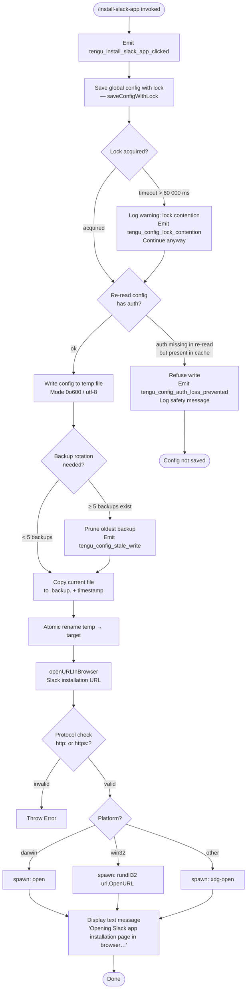

# `/install-slack-app`

> Analysis basis: CC v2.1.132 bundle.js (AST extraction + Claude interpretation)
> Minimum version: v2.1.132

---

## Overview

The `/install-slack-app` command provides a one-step shortcut to install the Claude Slack integration. When invoked, it emits a telemetry event, persists the current global configuration to disk (with file-lock protection), and opens the Slack app installation URL in the user's default browser. The command does not accept arguments and does not support non-interactive (headless) execution.

---

## Registration

| Field | Value |
|---|---|
| type | `local` |
| name | `install-slack-app` |
| description | Install the Claude Slack app |
| supportsNonInteractive | `false` |
| module\_id | `a6q` |

Analysis basis: CC v2.1.132 bundle.js:+10434765

---

## Input Branching

The command's execution path splits across three concerns: telemetry emission, config persistence (with its own internal branching), and browser launch.



Analysis basis: CC v2.1.132 bundle.js:+10434369, +10434484, +7355523, +7355558

---

## Behavioral Spec

### 1. Command Entry Point

```
function installSlackAppCommand(context):
    emitTelemetry("tengu_install_slack_app_clicked")       // +10434371
    saveGlobalConfigWithLock(context.appState)             // +10434409
    openURLInBrowser(SLACK_INSTALL_URL)                    // +10434484
    yield textMessage("Opening Slack app installation page in browser…")
                                                           // +10434504, +10434517
```

Analysis basis: CC v2.1.132 bundle.js:+10434369

---

### 2. Global Config Save with Lock (`saveConfigWithLock`)

This routine serialises the current in-memory configuration to `~/.claude.json` using a file-system lock directory to guard against concurrent writes from multiple Claude instances.

```
function saveConfigWithLock(configCache):

    lockDir = resolveLockDirectory()                       // Xz.dirname + F6
    fs.mkdirSync(lockDir, { recursive: true })             // +3105125

    startTime = Date.now()                                 // +3105170
    acquired  = false

    repeat up to 100 iterations:                           // +3105303
        try:
            fs.mkdirSync(lockPath, { exclusive: true })    // EEXIST branch +3106056
            acquired = true
            break
        catch EEXIST:
            sleep(randomJitter())                          // jitter via Math.random + setTimeout
        if Date.now() - startTime > 60000:                 // +3106079
            logWarning("Lock acquisition took longer than expected…")
                                                           // +3105309
            emitTelemetry("tengu_config_lock_contention")  // +3105398
            break

    reReadConfig = readConfigFromDisk()

    if cacheHasAuth(configCache) and not reReadConfig.hasAuth():
        logError("saveConfigWithLock: re-read config is missing auth…")
                                                           // +3105725
        emitTelemetry("tengu_config_auth_loss_prevented")  // +3105877
        releaseLock(lockDir)
        return  // refuse write

    tempPath = buildTempPath()
    serialised = JSON.stringify(configCache, null, 2)
    fs.writeFileSync(tempPath, serialised,
                     { encoding: "utf-8", mode: 0o600 })   // +3106597, +3106610

    rotateBackups(configPath)                              // see §3
    fs.renameSync(tempPath, configPath)

    releaseLock(lockDir)
```

Analysis basis: CC v2.1.132 bundle.js:+3102400, +3105098, +3105170, +3105183

---

### 3. Backup Rotation (`rotateOldBackups`)

Keeps at most 5 timestamped backup copies of `~/.claude.json`. Backup filenames contain the prefix `.backup.` followed by a numeric timestamp segment.

```
function rotateOldBackups(configPath):
    dir      = Xz.dirname(configPath)                      // +3105104
    base     = Xz.basename(configPath)                     // +3105994
    entries  = fs.readdirStringSync(dir)                   // +3106087

    backups  = []
    for each entry in entries:
        if entry.startsWith(base + ".backup."):            // +3106122 / ".backup." +3106195
            parts     = entry.split(".")                   // +3106187
            timestamp = Number(lastPart(parts))            // +3106180
            if not Number.isNaN(timestamp):                // +3106218
                backups.append({ name: entry, timestamp })

    sort backups ascending by timestamp

    while backups.length >= 5:                             // +3106328
        oldest = backups.shift()
        fs.unlinkSync(Xz.join(dir, oldest.name))           // +3106446

    destName = base + ".backup." + Date.now()
    fs.copyFileSync(configPath, Xz.join(dir, destName))    // +3106302
```

Analysis basis: CC v2.1.132 bundle.js:+3106087, +3106195, +3106328, +3106446

---

### 4. Global Config Fallback Save (`saveGlobalConfigFallback`)

A secondary, non-locking config persistence path that applies the same auth-safety guard described in §2.

```
function saveGlobalConfigFallback(configCache):
    reReadConfig = readConfigFromDisk()

    if cacheHasAuth(configCache) and not reReadConfig.hasAuth():
        logError("saveGlobalConfig fallback: re-read config is missing auth…")
                                                           // +3102607
        return  // refuse write

    persistConfig(configCache)
```

Analysis basis: CC v2.1.132 bundle.js:+3102404, +3102607

---

### 5. URL Opener (`openURLInBrowser`)

```
function openURLInBrowser(url):
    parsed = parseURL(url)

    if parsed.protocol not in ["http:", "https:"]:         // +7355286, +7355308
        throw Error("Invalid URL protocol")                // +7355236

    platform = process.platform

    if platform == "darwin":                               // +7355558
        spawnDetached("open", [url])                       // +7355732
    else if platform == "win32":                           // +7355574
        spawnDetached("rundll32", ["url,OpenURL", url])    // +7355658, +7355670
    else:
        spawnDetached("xdg-open", [url])                   // +7355739
```

Analysis basis: CC v2.1.132 bundle.js:+7355523, +7355607

---

### 6. Config Read with Access Guard (`readConfigFromDisk`)

```
function readConfigFromDisk():
    if configAccessNotYetAllowed():
        throw Error("Config accessed before allowed.")     // +3107290

    raw  = fs.readFileSync(configFilePath, "utf-8")        // +3107346
    try:
        parsed = JSON.parse(raw)
        return parsed
    catch parseError:
        emitTelemetry("tengu_config_parse_error")          // +3107927
        return defaultConfig()
```

Analysis basis: CC v2.1.132 bundle.js:+3107284, +3107346, +3107927

---

### 7. Jitter-Backoff Sleep Helper

```
function jitteredSleep():
    delayMs = Math.random() * BASE_DELAY                  // +12264285
    setTimeout(resolve, delayMs)                           // +12264322
```

Analysis basis: CC v2.1.132 bundle.js:+12264285

---

## State & Side Effects

| Item | Detail |
|---|---|
| Telemetry — `tengu_install_slack_app_clicked` | Fired immediately on command invocation (bundle.js:+10434371) |
| Telemetry — `tengu_config_lock_contention` | Fired when lock acquisition exceeds 60 000 ms (bundle.js:+3105398) |
| Telemetry — `tengu_config_stale_write` | Fired during backup rotation when the backup set must be pruned (bundle.js:+3105534) |
| Telemetry — `tengu_config_auth_loss_prevented` | Fired when a write is refused to protect existing auth credentials (bundle.js:+3105877) |
| Telemetry — `tengu_config_parse_error` | Fired when the on-disk config JSON cannot be parsed (bundle.js:+3107927) |
| File write | `~/.claude.json` updated atomically (temp-file + rename) with mode `0o600` (bundle.js:+3106610) |
| Backup files | Up to 5 `.backup.<timestamp>` copies retained alongside `~/.claude.json` (bundle.js:+3106328) |
| Lock directory | Temporary lock directory created and removed around each config write (bundle.js:+3105125) |
| Browser process | A detached child process (`open` / `rundll32` / `xdg-open`) is spawned; no stdout/stderr captured (bundle.js:+7355607) |
| appState changes | In-memory config cache flushed to disk; no other appState fields mutated by this command |
| Sound | None observed in depth-2 traversal |
| Non-interactive support | `false` — command must not be called in headless/pipe mode (bundle.js:+10434765) |

---

## Version History

| Version | Change |
|---|---|
| v2.1.132 | Initial analysis — command registered; telemetry, config-lock, backup rotation, and platform-aware browser launch documented |

---

## Common Mistakes

1. **Running in non-interactive mode**: `supportsNonInteractive` is `false`. Invoking `/install-slack-app` in a script or CI pipeline will fail or be silently skipped. Use it only in an interactive terminal session.

2. **Multiple concurrent Claude instances**: If two or more Claude Code processes share the same `~/.claude.json`, lock contention will occur. The lock timeout is 60 000 ms; exceeding it triggers a warning and telemetry but does not abort the write, which may result in a race condition.

3. **Corrupted `~/.claude.json`**: If the file is not valid JSON, `tengu_config_parse_error` is emitted and the command falls back to a default config. Any unsaved customisations will be lost. Keep a manual backup if editing the file by hand.

4. **Auth credential loss guard**: If the on-disk config is somehow missing authentication fields while the in-memory cache still holds them, the command deliberately refuses to write. This is a safety measure (see GH #3117). Do not manually strip auth fields from `~/.claude.json` while Claude Code is running.

5. **Firewall / browser not configured**: The URL opener spawns the system browser via `open`, `rundll32`, or `xdg-open`. If no default browser is registered (common on headless Linux servers), the spawned process will exit without opening any page and no error will be surfaced to the CLI.

6. **Stale backups consuming disk space**: Up to 5 `.backup.<timestamp>` files are retained. They are never auto-expired beyond the count limit. On systems with very limited disk space, users should periodically clean `~/.claude.json.backup.*` files manually.

---

## Appendix — Identifier Mapping

> For bundle debugging only. Identifiers change across versions.

| Identifier | Role |
|---|---|
| `h97` | Command handler — install-slack-app entry point |
| `d` | Telemetry emit utility |
| `A8` | Save global config with lock (top-level coordinator) |
| `Nt8` | Config file write with lock acquire / release and backup rotation |
| `H` | Jitter-backoff sleep helper (Math.random + setTimeout) |
| `FbH` | Lock directory path builder |
| `CJ1` | Config object serialiser / Object.entries iterator |
| `gbH` | Timestamp utility (Date.now wrapper) |
| `k` | Logger / debug output utility |
| `k5H` | Config read from disk with access guard |
| `uq6` | Auth presence checker on config object |
| `vt8` | Config path resolver (dirname + basename utilities) |
| `LL` | URL browser-open orchestrator |
| `T04` | URL protocol validator (throws on non-http/https) |
| `Y8` | Platform-dispatch spawner (darwin / win32 / other) |