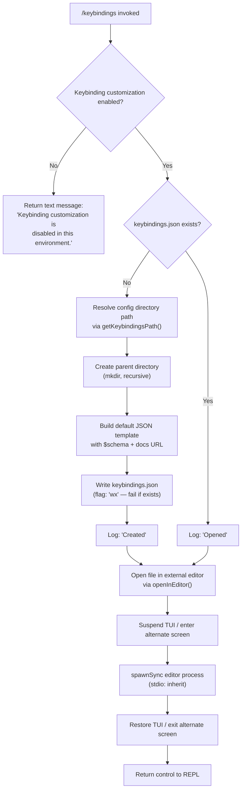

# `/keybindings`

> Analysis basis: CC v2.1.132 bundle.js (AST extraction + Claude interpretation)
> Minimum version: v2.1.132

---

## Overview

The `/keybindings` command opens or creates the user's `keybindings.json` configuration file in their preferred editor. When the file does not yet exist, the command bootstraps it with a valid JSON template (including a JSON Schema reference and documentation URL) before opening it. If keybinding customization is disabled in the current environment, the command returns an informational message and exits early without touching the filesystem.

---

## Registration

| Field | Value |
|---|---|
| type | `local` |
| name | `keybindings` |
| description | `Open or create your keybindings configuration file` |
| supportsNonInteractive | `false` |
| module_id | `iHq` |
| load_inline | `true` |
| handler (arbor) | `j97` (AsyncFunction, resolved via `module_id`) |
| `loc_byte_end` | `10383188` |
| `arbor_handler.name` | `j97` |
| `arbor_handler.kind` | `AsyncFunction` |
| `arbor_handler.resolution_path` | `module_id` |
| `arbor_handler.fqn` | `claude-2.1.132::j97` |
| `arbor_handler.n_hits` | `0` |

Analysis basis: CC v2.1.132 bundle.js:+10382994–+10383188

---

## Input Branching

The command accepts no user-supplied arguments. All branching is driven by environment state detected at invocation time.



Analysis basis: CC v2.1.132 bundle.js:+10382388, +10382485, +10382502, +10382553, +10382569, +10382617, +10382664

---

## Behavioral Spec

### 1. Early Exit — Customization Disabled

When the runtime environment has keybinding customization disabled, the handler immediately resolves with a single `text`-type response message.

```
async function keybindingsHandler(context):
    if not isKeybindingCustomizationEnabled(context):
        return { type: "text",
                 content: "Keybinding customization is disabled in this environment." }
    // proceed to file handling
```

The response type literal `"text"` and the exact message string are both embedded as constants.
Analysis basis: CC v2.1.132 bundle.js:+10382405, +10382418

---

### 2. Config File Path Resolution

The target file path is resolved by joining the user's Claude config directory with the fixed filename `"keybindings.json"`.

```
function getKeybindingsPath():
    configDir = getClaudeConfigDirectory()   // platform-aware base dir
    return path.join(configDir, "keybindings.json")
```

The filename `"keybindings.json"` is a hard-coded string constant.
Analysis basis: CC v2.1.132 bundle.js:+10382485, +3602818, +3602804

---

### 3. File Creation (First-Run Bootstrap)

When `keybindings.json` does not already exist, the handler creates the necessary directory tree and writes a default JSON template. The write uses the `"wx"` flag, which causes the operation to fail atomically if the file was created by a concurrent process between the existence check and the write.

```
async function bootstrapKeybindingsFile(filePath):
    parentDir = path.dirname(filePath)
    await fs.mkdir(parentDir, { recursive: true })

    template = buildDefaultTemplate()
    // template contains:
    //   "$schema": "https://www.schemastore.org/claude-code-keybindings.json"
    //   (documentation link: "https://code.claude.com/docs/en/keybindings")
    //   keybindings array entries derived from eL6 map, serialized via JSON.stringify

    await fs.writeFile(filePath, template, { flag: "wx" })
    log("Created")
```

The JSON Schema URL (`https://www.schemastore.org/claude-code-keybindings.json`) and the documentation URL (`https://code.claude.com/docs/en/keybindings`) are embedded as string literals.
Analysis basis: CC v2.1.132 bundle.js:+10382502, +10382512, +10382553, +10382598, +10382141, +10382206, +10382720

---

### 4. Default Template Construction

The template builder (`buildDefaultTemplate` / `cHq` → `J97`) enumerates the registered keybinding entries from a map, applies a trimming normalizer to key names, then serializes the result to a JSON string.

```
function buildDefaultTemplate(keybindingRegistry):
    entries = keybindingRegistry.map(entry => normalizeKeyName(entry))
    // normalizeKeyName trims whitespace; "space" is a recognized key literal

    filtered = entries
        .filter(entry => not in excludedSet)     // A.has check
        .mapKeys(key => Object.entries(key))     // Object.entries / Object.keys

    return jsonSerialize({ "$schema": SCHEMA_URL, keybindings: filtered })
```

The string `"space"` is a recognized key name constant used during normalization.
Analysis basis: CC v2.1.132 bundle.js:+10382261, +10381905, +10381918, +10381938, +10381974, +10382005, +10382077, +3591801, +10382278

---

### 5. Editor Launch via `openInEditor`

After ensuring the file exists, the handler calls `openInEditor` (`Gm`), which performs the following sequence:

```
async function openInEditor(filePath):
    editorCmd = resolveEditorCommand()   // checks $VISUAL, $EDITOR, fallback list
    if editorCmd is null:
        throw Error("Ink instance not found - cannot pause rendering")

    stat = fs.statSync(filePath)         // verify file is accessible

    detectEditorKind(editorCmd)          // classifies as IDE or terminal editor
    // "IDE" is a recognized classification constant

    tui.enterAlternateScreen()
    tui.pause()
    tui.suspendStdin()

    argv  = editorCmd.split(" ")
    args  = argv.slice(1).concat([filePath])
    result = child_process.spawnSync(argv[0], args, { stdio: "inherit" })

    tui.exitAlternateScreen()
    tui.resumeStdin()
    tui.resume()

    newContent = fs.readFileSync(filePath)
    return newContent
```

The `stdio: "inherit"` option passes the terminal directly to the spawned editor process, enabling full interactive use of terminal-based editors (e.g., `vim`, `nano`).
Analysis basis: CC v2.1.132 bundle.js:+10382664, +10321372, +10321414, +10321477, +10321513, +10321573, +10321603, +10321613, +10321652, +10321677, +10321695, +10321727, +10321795, +10321997, +10322075, +10322104, +10322120

---

### 6. Editor Detection

The editor resolution helper (`jJ`) lowercases the resolved editor command, extracts the basename, and checks against a known set of IDE identifiers to classify the editor kind.

```
function detectEditorKind(editorCommand):
    lower   = editorCommand.toLowerCase()
    base    = path.basename(lower)
    // a9 extracts substring via indexOf + slice
    kind    = lookupEditorKind(base)    // checks p0H registry
    return kind    // e.g., "IDE" for VS Code / Cursor / etc.
```

Analysis basis: CC v2.1.132 bundle.js:+10321795, +5031774, +5031818, +5031832, +5031906, +5031719

---

### 7. Config File Read Internals

The internal config reader (`k5H`) used in the broader file-open chain handles several filesystem edge cases:

```
function readConfigFileSafe(filePath):
    if not configAccessAllowed():
        throw Error("Config accessed before allowed.")

    try:
        raw = fs.readFileSync(filePath, "utf-8")
    except ENOENT:
        return defaultValue

    try:
        parsed = JSON.parse(raw)
    except:
        emitTelemetry("tengu_config_parse_error")
        log("error")
        return defaultValue

    // backup logic:
    //   stat the file
    //   if backup dir missing: mkdirSync (ignoring EEXIST)
    //   enumerate files with readdirStringSync, filter by prefix
    //   copy file with timestamp: Date.now(), copyFileSync

    return parsed
```

A parse error emits the `tengu_config_parse_error` telemetry event and returns a safe default rather than propagating the exception.
Analysis basis: CC v2.1.132 bundle.js:+3107284, +3107290, +3107346, +3107373, +3107393, +3107520, +3107771, +3107841, +3107868, +3107887, +3107925, +3108079, +3108096, +3108106, +3108141, +3108164, +3108199, +3108318, +3108417, +3108435, +3107927

---

### 8. File Watcher (Config Hot-Reload)

The config subsystem (`DPK`) attaches a `watchFile` listener to the keybindings config path so that changes made in the external editor are picked up without restarting the CLI.

```
function watchConfigFile(filePath, onChange):
    lQ6.watchFile(filePath, callback)

    callback = (curr, prev) =>
        if curr.mtime != prev.mtime:
            reload = readConfigFileSafe(filePath)
            onChange(reload)

    return () => lQ6.unwatchFile(filePath)    // teardown handle
```

Analysis basis: CC v2.1.132 bundle.js:+3103733, +3103738, +3103819, +3103902, +3103905, +3103963, +3103971, +3104052, +3104065

---

## State & Side Effects

| Item | Detail |
|---|---|
| Telemetry — `tengu_config_parse_error` | Emitted if `keybindings.json` exists but cannot be parsed as JSON (bundle.js:+3107927) |
| Telemetry — `tengu_keybinding_customization_release` | Emitted during the keybinding-customization feature-flag check path (bundle.js:+3602304) |
| Filesystem — directory creation | `mkdir(recursive)` on the config parent directory if it does not exist (bundle.js:+10382502) |
| Filesystem — file creation | `writeFile` with flag `"wx"` writes the default template only when the file is absent (bundle.js:+10382553, +10382598) |
| Filesystem — file watcher | `watchFile` registered on `keybindings.json`; teardown via `unwatchFile` (bundle.js:+3103738, +3104065) |
| TUI state | `enterAlternateScreen` / `pause` / `suspendStdin` before editor spawn; restored via `exitAlternateScreen` / `resumeStdin` / `resume` after (bundle.js:+10321573, +10322075) |
| appState changes | Keybinding map reloaded from disk after the editor exits and after file-watcher callbacks (bundle.js:+3103963) |
| Sound | None observed in depth-2 traversal |
| `supportsNonInteractive` | `false` — command must not be invoked in non-interactive/pipe mode |

---

## Version History

| Version | Change |
|---|---|
| v2.1.132 | Initial analysis. Handler `j97`; schema URL `https://www.schemastore.org/claude-code-keybindings.json`; docs URL `https://code.claude.com/docs/en/keybindings`. |

---

## Common Mistakes

1. **Running in non-interactive mode** — Because `supportsNonInteractive: false`, invoking `/keybindings` in a piped or headless session will not work; the TUI suspension logic requires an attached terminal.
2. **Expecting the command to accept arguments** — The command ignores all user-supplied text after `/keybindings`; it always acts on the fixed path `~/<config_dir>/keybindings.json`.
3. **Editing the file while the watcher is active and then immediately rerunning the command** — Because a `watchFile` listener is already attached, a second invocation while the editor is still open may trigger a hot-reload race; the `"wx"` write flag prevents a second file creation but the watcher callback may fire redundantly.
4. **Assuming an IDE is always launched** — The editor selection follows `$VISUAL` → `$EDITOR` → fallback list. If only a terminal editor is configured, the TUI will be fully suspended and the alternate screen used; the caller should not assume VS Code or Cursor will open.
5. **Ignoring the disabled-environment case** — In managed or restricted environments, the command returns a plain text message rather than opening any file. Scripts that invoke `/keybindings` should check the response type (`"text"`) for this sentinel.

---

## Appendix — Identifier Mapping

> For bundle debugging only. Identifiers change across versions.

| Identifier | Role |
|---|---|
| `j97` | Main async handler for `/keybindings` command (entry point, AsyncFunction) |
| `hx` | Keybinding customization feature-flag check |
| `j6` | Feature-flag evaluation core (GrowthBook / config gate) |
| `hq6` | Feature-flag sub-helper A (called from flag evaluation) |
| `Rq6` | Feature-flag sub-helper B (called from flag evaluation) |
| `Oo` | Platform / environment resolver inside flag check |
| `yH` | String coercion utility used by environment resolver |
| `Mo` | Config value accessor (used by environment resolver and dedupe cache) |
| `uQ6` | Deduplication / cache-check wrapper for flag evaluation |
| `Lt8` | Cache-miss handler; emits GrowthBook experiment event |
| `Dt8` | Cache-hit handler; resolves cached flag value |
| `R6` | File-open orchestrator (calls reader and watcher) |
| `F6` | Config directory base-path resolver |
| `Et8` | File metadata / stat helper |
| `k5H` | Safe config file reader (handles ENOENT, parse errors, backups) |
| `DPK` | File watcher registration (watchFile / unwatchFile) |
| `RAH` | Keybindings path builder (`join(configDir, "keybindings.json")`) |
| `cHq` | Default template builder coordinator (calls `J97` then `RH`) |
| `J97` | Keybinding entry enumerator and filter |
| `m2H` | Key-name normalizer (trim, space handling) |
| `H` | General utility (map, indexOf, slice, random, setTimeout) |
| `A` | Filesystem wrapper (readFileSync, statSync, includes) |
| `RH` | JSON serializer wrapper (`JSON.stringify`) |
| `j8` | Result/response constructor |
| `Gm` | `openInEditor` — external editor launcher with TUI lifecycle management |
| `b17` | Editor resolution helper (calls `_NA`) |
| `_NA` | Editor command parser (basename, extension extraction, known-editor lookup) |
| `a9` | Substring extractor (indexOf + slice pattern) |
| `_` | TUI / Ink interface (enterAlternateScreen, exitAlternateScreen, pause, resume, suspendStdin, resumeStdin, toLowerCase) |
| `f` | Process / stream handle (close, slice) |
| `q` | Low-level OS interface (close, unlinkSync) |
| `K` | Process exit handler (calls `q`, `vH`, `AZ`, `process.exit`) |
| `jJ` | Editor-kind classifier (lowercase basename lookup against IDE registry) |