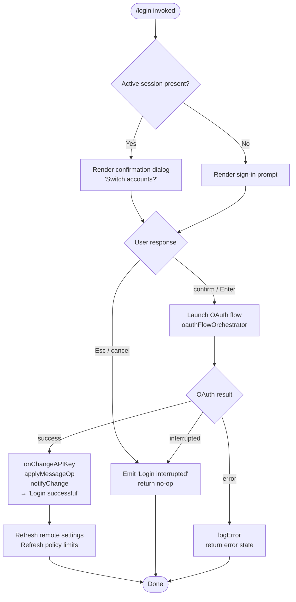

# `/login`

> Analysis basis: CC v2.1.132 bundle.js (AST extraction + Claude interpretation)
> Minimum version: v2.1.132

---

## Overview

The `/login` command allows the user to switch Anthropic accounts or sign in with an Anthropic account from within an active Claude Code session. It is a `local-jsx` type command that renders an interactive JSX confirmation UI, orchestrates an OAuth authentication flow, and — on success — propagates the new API key and OAuth token through the application state, credentials storage, remote-settings subsystem, and policy-limits subsystem.

---

## Registration

| Field | Value |
|---|---|
| type | `local-jsx` |
| name | `login` |
| description | `Switch Anthropic accounts \| Sign in with your Anthropic account` |
| module_id | `kT9` |
| load_inline | `true` |
| handler (Arbor) | `sHq` (resolution path: `direct`) |
| loc_byte span | `10383212` – `10383445` |
| `loc_byte_end` | `10383445` |
| `arbor_handler.name` | `sHq` |
| `arbor_handler.kind` | `Function` |
| `arbor_handler.resolution_path` | `direct` |
| `arbor_handler.fqn` | `claude-2.1.132::sHq` |
| `arbor_handler.n_hits` | `2` |

Analysis basis: CC v2.1.132 bundle.js:+10383212

---

## Input Branching

The command accepts no free-text arguments. All branching is driven by the current authentication state and by user interaction with the confirmation UI.



Analysis basis: CC v2.1.132 bundle.js:+7984022, +7984425, +7984444

---

## Behavioral Spec

### 1. Confirmation UI (JSX component)

The handler `sHq` (Arbor-resolved, `direct`) renders a `local-jsx` component. The component is memoized (React memo cache sentinel literal observed at `+7984619`). It presents:

- A labeled prompt area titled **"Login"** (`+7985121`).
- A **"Confirmation"** sub-panel (`+7984700`) with `Esc` / **cancel** bindings (`+7984724`, `+7984742`) to abort.
- The confirmation key sequence `confirm:no` (`+7984679`) guards the destructive account-switch path.

```
function loginJsxComponent(props):
    appState = getAppState()                  // H.getAppState +7984145
    [state, dispatch] = useReducer(...)       // ZT9 via vD
    useMemo(...)                              // vD +7982727

    render ConfirmationDialog(
        title    = "Login",                   // +7985121
        escLabel = "Esc",                     // +7984724
        cancelLabel = "cancel",               // +7984742
        onConfirm  = handleConfirm,
        onCancel   = handleInterrupt
    )

function handleInterrupt():
    emit("Login interrupted")                 // +7984444
    props.onDone()                            // vOH +7984544

function handleConfirm():
    launchOAuthFlow()
```

Analysis basis: CC v2.1.132 bundle.js:+7984365, +7984412, +7984490, +7984509

---

### 2. OAuth Flow Orchestration

The top-level JSX component calls through the call chain `mN4 → YL8`, which wires together several sub-systems. The actual interactive OAuth browser flow is delegated to the handler chain rooted at `mz6` (policy-limits orchestration) and `_$A` (trusted-device enrollment + OAuth token acquisition).

```
function oauthFlowOrchestrator(context):
    // Phase 1 — resolve existing API-key / OAuth config
    apiKeyConfig = resolveApiKeyConfig()      // eM6 +7984061
      which calls:
        credentialStore()                     // ec  +6566084
        apiKeyHelperCheck()                   // "apiKeyHelper" +2868201
        envVarCheck("ANTHROPIC_API_KEY")      // +2868107

    // Phase 2 — open browser / local auth server
    authResult = runInteractiveAuth()         // mz6 +7984067
      which calls:
        clearTimeout on prior attempts        // UIA +9765294
        launchLocalAuthServer()               // jM8 +9770163
          setTimeout guard (+9765410) for timeout
        waitForCallback()                     // zm  +9770170
        unlinkTempFile()                      // zJ6.unlink +9770192
        fetchPolicyLimits()                   // DJ6 +9770223

    if authResult.interrupted:
        emit("Login interrupted")             // +7984444
        return

    // Phase 3 — store credentials
    persistCredentials(authResult)            // _$A +7984097
      checks:
        CLAUDE_TRUSTED_DEVICE_TOKEN env var   // +6448649
        OAuth token presence                  // +6448992
        essential-traffic flag                // +6449077
      then:
        POST enrollment request               // J8.post +6449186
          Content-Type: application/json      // +6449331/6449346
          timeout: 10 000 ms                  // +6449374
          retry budget: 500 ms                // +6449400
        on 201 response: write device_token   // +6449562
        on missing field: log "missing_token" // +6449860
        on storage fail: log "storage_failed" // +6450010
        write credentials to storage          // q.update +6450064

    // Phase 4 — propagate new key into live session
    onChangeAPIKey(newKey)                    // YL8 → H.onChangeAPIKey +7983980
    applyMessageOp("update")                  // YL8 → H.applyMessageOp +7983999; literal "update" +7984022
    setAppState(...)                          // H.setAppState +7984277

    emit("Login successful")                  // +7984425
```

Analysis basis: CC v2.1.132 bundle.js:+7983980, +7983999, +7984067, +7984097, +7984277

---

### 3. Remote-Settings Refresh After Login

Immediately after credential propagation, the command triggers a remote-managed-settings refresh via `eM6` → `RK9`.

```
function refreshRemoteSettingsAfterLogin():
    // Re-fetch managed settings using new auth token
    fetchRemoteSettings()                     // RK9 +6566199
      intervalPoller = setupIntervalPoller()  // Xi6 +6566654
      onSuccess:
          applySettings()                     // Q54 +6566667
          notifyChange()                      // dS.notifyChange +6566556
          log("Remote settings: Refreshed after auth change")  // +6566144

    // Subsidiary: re-check policy limits
    policyLimitsPoller()                      // DJ6 / Qt4 +9770415
      log("Policy limits: Refreshed after auth change")        // +9770231
```

Analysis basis: CC v2.1.132 bundle.js:+6566144, +6566199, +9770231

---

### 4. Credential Resolution & API-Key Validation

```
function resolveApiKeyConfig():
    // Provider type detection
    provider = detectProvider()               // g_ +6560552
      candidates: "bedrock"    (+1975269)
                  "foundry"    (+1975319)
                  "anthropicAws" (+1975375)
                  "mantle"     (+1975429)
                  "vertex"     (+1975477)
                  "firstParty" (+1975486)
      default host: "api.anthropic.com"       // +1976104

    // Read existing credential (first 20 chars logged)
    rawKey = credentialStore.read()           // ec +6560880; qS truncates to 20 chars +1993656
    if not rawKey:
        error("ANTHROPIC_API_KEY or CLAUDE_CODE_OAUTH_TOKEN env var is required")
               // +2868528

    // Fallback to file-descriptor key
    fdKey = readFromFD("CLAUDE_CODE_API_KEY_FILE_DESCRIPTOR")  // _B8 +2868366; +1992314
    return resolvedConfig
```

Analysis basis: CC v2.1.132 bundle.js:+1975269, +1992314, +2868107, +2868528

---

### 5. Trusted-Device Enrollment (macOS path)

Enrollment only runs when all three guards pass:

| Guard | Literal / source |
|---|---|
| `CLAUDE_TRUSTED_DEVICE_TOKEN` env var NOT set | `+6448649` |
| OAuth token present | `+6448992` |
| Not in essential-traffic-only mode | `+6449077` |

Platform check: `"darwin"` (`+6449281`) — enrollment POST is skipped on non-macOS. On failure the telemetry event `bridge_trusted_device_enroll` is emitted (`+6449476`).

Analysis basis: CC v2.1.132 bundle.js:+6448649, +6449281, +6449476

---

### 6. Policy-Limits Fetch

```
function fetchPolicyLimits():
    // Retry with exponential back-off (Ws: Math.min/pow/random/max)
    // Max delay cap: 32 000 ms (+9760419), base jitter factor 0.25 (+9760482)
    // Max retries: 10 (+9760512)

    response = httpGet(policyEndpoint)
    if HTTP 304:
        log("Policy limits: Cache still valid (304 Not Modified)")  // +9769053
    if HTTP 200:
        log("Policy limits: Applied new restrictions successfully") // +9769207
    on timeout:
        log("Policy limits: Loading promise timed out, resolving anyway") // +9765439
    on fetch failure:
        log("Policy limits: Using stale cache after fetch failure") // +9768884
    on unexpected error:
        log("Policy limits: Using stale cache after error")         // +9769339

    telemetry: tengu_policy_limits_fetch  // +9768677
               tengu_slate_kestrel        // +9766163
```

Analysis basis: CC v2.1.132 bundle.js:+9760419, +9768677, +9769053

---

## State & Side Effects

| Item | Detail |
|---|---|
| Telemetry — `tengu_feature_ok` | Emitted on successful feature gate check (`+906461`) |
| Telemetry — `tengu_feature_bad` | Emitted on failed feature gate check (`+906517`) |
| Telemetry — `tengu_feature_sad` | Emitted on feature gate error path (`+906587`) |
| Telemetry — `tengu_managed_settings_security_dialog_shown` | Emitted when the managed-settings security dialog is presented (`+6559613`) |
| Telemetry — `tengu_managed_settings_security_dialog_accepted` | Emitted on user acceptance (`+6559708`) |
| Telemetry — `tengu_managed_settings_security_dialog_rejected` | Emitted on user rejection (`+6559758`) |
| Telemetry — `tengu_policy_limits_fetch` | Emitted after each policy-limits HTTP round-trip (`+9768677`) |
| Telemetry — `tengu_slate_kestrel` | Emitted during policy-limits flow (`+9766163`) |
| Telemetry — `tengu_disable_bypass_permissions_mode` | Emitted when bypass-permissions mode is disabled during the session (`+9664702`) |
| Telemetry — `tengu_auto_mode_config` | Emitted when auto-mode configuration is evaluated (`+9662771`) |
| Telemetry — `tengu_daemon_config_reload` | Emitted on daemon config reload triggered by auth change (`+14143280`) |
| `H.onChangeAPIKey` | Called with new key; propagates into live session (`+7983980`) |
| `H.applyMessageOp("update")` | Applies an "update" message operation to the current conversation (`+7983999`) |
| `H.setAppState` | Updates top-level application state with new auth context (`+7984277`) |
| `dS.notifyChange` (×2) | Fires subscriber notifications after settings refresh (`+6566239`, `+6566556`) |
| Credential storage write | OAuth token / device_token written via `q.update` (`+6450064`) |
| Remote-settings cache file | Written via `F54` → `_.writeFile` + `_.datasync` (`+6563923`, `+6563974`) |
| Temp file unlink | Auth callback temp file removed via `zJ6.unlink` (`+9770192`) |
| `clearTimeout` / `clearInterval` | Prior auth timers cancelled on re-entry (`+9765294`, `+9770103`) |
| Process event listeners | `process.off`, `process.removeListener` called during session cleanup (`ubH`, `wt8`) |
| Cache sets cleared | `s06.clear`, `j28.clear` (`C2`, `+24901`, `+24913`); `V5H.clear`, `kq6.clear`, `Kt8.clear`, `mU.clear` (`ubH`) |
| Sound | None observed in depth-2 traversal |

---

## Version History

| Version | Change |
|---|---|
| v2.1.132 | Initial analysis |

---

## Common Mistakes

1. **Invoking `/login` with arguments**: The command takes no arguments; any trailing text is ignored. The UI flow is entirely interactive.
2. **Expecting instant effect on in-flight requests**: `H.onChangeAPIKey` and `H.applyMessageOp` are called only after the OAuth callback completes. Any request already in-flight uses the previous credentials.
3. **Running in essential-traffic-only mode**: When the `essential-traffic` flag is active (`+910638`), trusted-device enrollment is skipped silently (`+6449077`). Login itself still succeeds, but the device token is not persisted.
4. **Non-macOS trusted-device enrollment**: The enrollment POST to the bridge endpoint is gated on `"darwin"` (`+6449281`). On Linux/Windows the step is skipped without error.
5. **Pressing Esc during the confirmation dialog**: Pressing `Esc` emits "Login interrupted" and exits immediately; no credentials are modified. Users must re-issue `/login` to retry.
6. **Environment variable `CLAUDE_TRUSTED_DEVICE_TOKEN` interference**: If this env var is set, enrollment is unconditionally skipped (`+6448649`), and the device token in storage will not be refreshed.

---

## Appendix — Identifier Mapping

> For bundle debugging only. Identifiers change across versions.

| Identifier | Role |
|---|---|
| `sHq` | Top-level `/login` handler (Arbor-resolved, `direct`) |
| `YL8` | Login JSX logic coordinator / sub-system wiring function |
| `mN4` | React element factory wrapper for the login component |
| `vOH` | Outer JSX component shell (renders `vD`, wires `onDone`) |
| `vD` | Inner JSX component; holds `useReducer` / `useMemo` / `Wq` / `r2` |
| `ZT9` | Auth-state reducer component (`useReducer` + `useEffect`) |
| `H` | Ambient context / app-state object (carries `onChangeAPIKey`, `applyMessageOp`, `getAppState`, `setAppState`) |
| `eM6` | Remote-settings orchestrator (post-login refresh entry point) |
| `ec` | Credential-store accessor |
| `g_` | Provider-type detector |
| `o$` | API-key resolution / validation pipeline |
| `_B8` | File-descriptor key reader (`CLAUDE_CODE_API_KEY_FILE_DESCRIPTOR`) |
| `qS` | API-key truncator (20-char slice for logging) |
| `l$A` | Policy-settings notifier (`dS.notifyChange` + `fH`) |
| `fH` | Settings change broadcaster |
| `i$A` | Remote-managed-settings fetch-and-apply handler |
| `m54` | Settings object hasher (`yK9.createHash` sha256) |
| `U54` | Remote-settings HTTP fetch coordinator |
| `B54` | HTTP request executor for remote settings |
| `Ws` | Exponential back-off calculator (`Math.min/pow/random/max`) |
| `o8` | Async timeout/abort wrapper (`setTimeout` + `clearTimeout` + `AbortController`) |
| `IK9` | Remote-settings security-check orchestrator |
| `pBH` | Managed-settings entry normaliser (`Object.entries` + `toUpperCase`) |
| `gH8` | Settings key enumerator (`Object.keys`) |
| `GL9` | Settings structure validator |
| `tT` | Security-check gate function |
| `Nx` | Notification dispatcher (`VT1` / `TZ1`) |
| `qF` | Security-check result handler |
| `kK9` | Settings deep-clone helper (`BN` → `structuredClone`) |
| `BN` | Structured-clone wrapper |
| `bb` | Settings persistence helper (`lPL` / `iPL`) |
| `VK9` | Settings application pipeline |
| `qL` | Settings write sequencer (`F1`, `WUH`, `X5A`, `P5A`) |
| `F54` | Atomic settings file writer (`yGH.open` + `_.writeFile` + `_.datasync` + `_.close`; 384-byte buffer `+6563908`) |
| `RK9` | Background remote-settings poller setup |
| `Xi6` | Interval poller factory (`setInterval` / `clearInterval`) |
| `Q54` | Background-poll change handler |
| `N1` | State-update notify helper (`J08.add/delete`, `Object.assign`) |
| `mz6` | Interactive OAuth / policy-limits orchestrator |
| `UIA` | Prior-timeout canceller |
| `jM8` | Local auth-server launcher (`setTimeout` guard) |
| `zm` | OAuth callback waiter / token extractor |
| `XM8` | Auth temp-file path builder (`Lr9.join` + `l8`) |
| `DJ6` | Policy-limits fetch orchestrator (post-login) |
| `fr9` | Policy-limits HTTP fetch core |
| `Kr9` | Policy-limits cache reader (`qr9.readFileSync`) |
| `ut4` | Policy-limits response hasher (`_r9.createHash`) |
| `pt4` | Policy-limits retry scheduler (`Ws` back-off) |
| `Bt4` | Policy-limits cache writer (`zJ6.writeFile`) |
| `$r9` | Policy-limits background poller |
| `Qt4` | Policy-limits poll change handler |
| `_$A` | Trusted-device enrollment + OAuth credential persistence |
| `NS` | Trusted-device enrollment dispatcher |
| `OL9` | Module namespace resolver for enrollment |
| `nA` | Module-factory initialiser |
| `__` | OAuth URL validator / environment selector |
| `W__` | OAuth environment constant map |
| `eDL` | OAuth endpoint selector |
| `A$A` | App-state read/update coordinator |
| `H$H` | App-state change event emitter |
| `EK` | Persistent store reader (wraps `f41`) |
| `f41` | Multi-table CRUD abstraction (`read`, `readAsync`, `update`, `delete`) |
| `aPH` | Session cleanup / teardown handler |
| `ubH` | Cache and listener clearing routine |
| `wt8` | Interval + process-listener removal handler |
| `Oo` | Active-session checker |
| `Mo` | Session model accessor (`Yx`) |
| `Yx` | Session record resolver (`rjK`, `YH6`) |
| `Cz6` | App-state subscriber setup (`DL8`, `EGH`) |
| `DL8` | App-state change listener registrar |
| `Yt8` | App-state diff evaluator |
| `EGH` | Permission-mode change handler (`cf`) |
| `cf` | Permission rules applicator (`setMode`, `addRules`, `replaceRules`, `removeRules`, etc.) |
| `i4` | Permission policy parser |
| `bz6` | Auto-mode + settings watcher (`xz6`) |
| `xz6` | Auto-mode configuration evaluator |
| `zo` | Auto-mode gate (`mQ6` → `TJ1`) |
| `jIA` | Auto-mode opt-in state checker |
| `JIA` | Auto-mode circuit-breaker evaluator |
| `xq` | Model-string parser (`OU`, `Wq`, `Kj`) |
| `Wq` | Model alias normaliser (trim / toLowerCase / replace) |
| `Kj` | Model string tokeniser |
| `OU` | Model-string structured decoder |
| `AbH` | Model capability resolver (`Gq`, `j6`) |
| `Gq` | Model profile lookup |
| `Gr` | Model feature-flag evaluator (`F9`) |
| `LlH` | Auto-mode permission bridge (`Fp`) |
| `Fp` | Permission-mode resolver for auto-mode |
| `D` | Supervisor / daemon config reload handler |
| `lDH` | Config file reader (`eYq.readFile`) |
| `Hwq` | Config diff calculator |
| `f` | Supervisor connection handle |
| `E` | Remote-control event handler |
| `VQq` | Heartbeat sender (`Do`) |
| `Sa` | Settings-event emitter (`T4`) |
| `T4` | Structured event builder and emitter |
| `g9H` | Settings map renderer |
| `O6` | App-state context accessor (`useSyncExternalStore`) |
| `N8A` | App-state context hook |
| `ZX` | Additional context consumer (`o2H.useContext`) |
| `$o` | Subscription effect helper (`xbH.subscribe`) |
| `XJ1` | Async subscription resolver |
| `r2` | Rendering pipeline root |
| `R_` | Render-tree walker (`nY`, `fU`, `E_`) |
| `nY` | Node renderer (`tL`, `GS`, `yH`, `K_`, `o$`, `B96`) |
| `fU` | Boolean coercion helper |
| `W7H` | Widget renderer (`F9`, `ar`) |
| `F9` | Base widget factory (`wx_`, `Yx_`, `nY`, `E_`) |
| `ar` | Animated renderer (`Dx_`, `nY`, `E_`) |
| `ERH` | Error-boundary renderer (`F9`, `R41`) |
| `R41` | Error display widget (`g7`) |
| `jk` | Ink layout primitive (`zM`, `DM`) |
| `zM` | Box layout element (`g_`) |
| `DM` | Text layout element (`MNH`, `XaL`, `Kx_`, `ub6`, `g_`) |
| `qj` | Query-renderer (`O8H`, `z8H`, `g_`, `R_`, `F9`) |
| `FV` | Flex layout helper (`zM`, `DM`) |
| `mH` | Log / debug emitter helper |
| `SH` | State-save helper (`d`) |
| `Z8` | State-load helper (`d`) |
| `fNH` | Timestamp helper (`Date.now`) |
| `CK9` | Credential-store factory |
| `g$A` | Credential getter (`f9_`) |
| `D6H` | Credential type discriminator |
| `a3` | Request header builder |
| `E_` | Element equality checker |
| `tL` | String formatter (`yH`) |
| `zx` | Flag-settings accessor (`tL`, `R8`, `K_`) |
| `co8` | Config option reader |
| `HZ` | Auth-mode resolver |
| `$aH` | VSCode-environment detector (`vA`; literal `"claude-vscode"` `+46102`) |
| `R6` | HTTP request executor (`F6`, `B2`, `Et8`, `k5H`, `DPK`, `Date.now`) |
| `HA` | Error serialiser (`Error`, `String`) |
| `kq` | Log queue flusher (`h1_`) |
| `$wL` | Log ring buffer (`uv6.shift/push`) |
| `k` | File-system request builder (`Lsq`, `RH`, `mf`, `gNH`, `Msq`, `FN`) |
| `Lsq` | File path resolver (`_Z`, `qsq`, `rdA`) |
| `mf` | Path redactor (`[REDACTED]` literal `+154106`) |
| `gNH` | Path sanitiser (`slA`) |
| `Msq` | File-system operation dispatcher (`GNH`, `F6`, `JG8`, `jnA`, `JnA`, `PnA`, `N1`) |
| `w6H` | Session-cache flusher (`Y6H`, `xwL`, `C2`) |
| `xwL` | Request-queue drainer (`wE`, `PH6`, `B6`, `Fh`, `Array.isArray`) |
| `C2` | Dual-cache clearer (`s06.clear`, `j28.clear`) |
| `c$A` | Deep-settings serialiser (recursive `Object.keys` / `Array.isArray` / `H.map`) |
| `u54` | Remote-settings URL builder |
| `SyH` | Settings schema validator |
| `Nx` | Notification dispatcher |
| `q` | File-system async helper (`tgq.unlinkSync`) |
| `_` | Lower-case file-extension helper (`f.toLowerCase`) |
| `IT9` | Auto-mode gate-denial notifier |
| `j6` | Telemetry event batcher (`hq6`, `Rq6`, `Oo`, `V5H.has`, `uQ6`, `kq6.add`, `mU.has/get`, `R6`) |
| `uQ6` | Telemetry deduplicate-and-enqueue helper (`Kt8`, `V5H`, `Lt8`, `Dt8`) |
| `Lt8` | Telemetry event builder (`_t8.randomUUID`, `RH`, `BXK`, `fo.emit`) |
| `Dt8` | Telemetry dispatch helper (`U41`, `uA`, `EJ1`, `jyH`) |
| `TJ1` | Telemetry conditional dispatcher (`hq6`, `Rq6`, `Oo`, `KW`, `mU`, `K.getFeatureValue`, `uQ6`) |
| `K` | Process-exit / feature-flag gateway (`q`, `vH`, `AZ`, `process.exit`) |
| `NS` | Trusted-device enrollment orchestrator |
| `vrq` | Undefined-value sentinel checker |
| `j06` | Module-initialiser bind target |