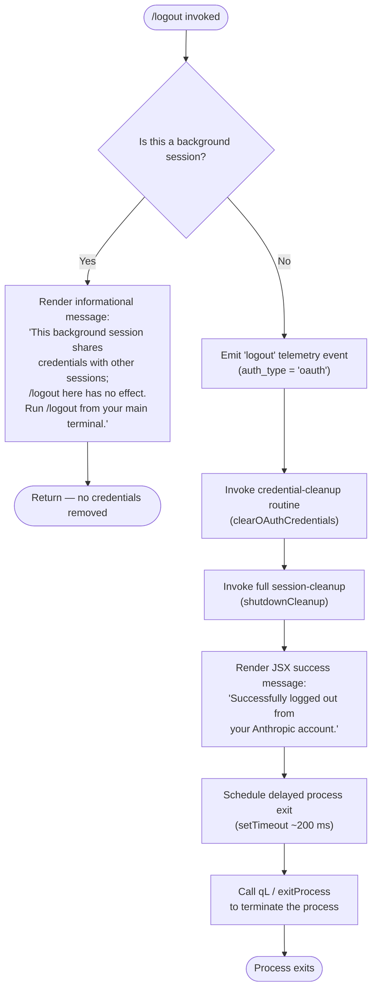

# `/logout`

> Analysis basis: CC v2.1.132 bundle.js (AST extraction + Claude interpretation)
> Minimum version: v2.1.132

---

## Overview

The `/logout` command signs the user out of their Anthropic account by clearing OAuth credentials and removing authentication artifacts from disk. It detects whether it is running in a background session and, if so, refuses to act, displaying an informational message instead. In a normal (foreground) session it clears credentials, emits a telemetry event, renders a success confirmation, and exits the process.

---

## Registration

| Field | Value |
|---|---|
| type | `local-jsx` |
| name | `logout` |
| description | `Sign out from your Anthropic account` |
| module_id | `zw9` |
| load_inline | `true` |
| handler | `E04` (AsyncFunction, resolved via `module_id`) |
| loc_byte span | `10383506 – 10383694` |
| `loc_byte_end` | `10383694` |
| `arbor_handler.name` | `E04` |
| `arbor_handler.kind` | `AsyncFunction` |
| `arbor_handler.resolution_path` | `module_id` |
| `arbor_handler.fqn` | `claude-2.1.132::E04` |
| `arbor_handler.n_hits` | `0` |

Analysis basis: CC v2.1.132 bundle.js:+10383506

---

## Input Branching

The handler `E04` performs a background-session guard before taking any destructive action.



Analysis basis: CC v2.1.132 bundle.js:+7353848 (handler `E04` entry), +7353981 (background-session message literal), +7354156 (success message literal), +7354219 (setTimeout), +7354235 (exit call)

---

## Behavioral Spec

### 1. Background-Session Guard

When `/logout` is invoked, the handler immediately checks whether the current session is a background session (i.e., a session type of `"bg"`, `"daemon"`, or `"daemon-worker"`, resolved via the session-type helper `G9` / `Tr`).

```
async function logoutHandler(context):
    sessionType = getSessionType()          // G9 → Tr
    if isBackgroundSession(sessionType):
        return renderInfoMessage(
            "This background session shares credentials ..."
        )
    // Foreground path continues below
```

Analysis basis: CC v2.1.132 bundle.js:+7353848, +7353981; session-type literals at +2121040, +2121050, +2121064

---

### 2. Telemetry Emission

Before any destructive operation, the handler records a `"logout"` event with the authentication type `"oauth"`.

```
function emitLogoutTelemetry():
    emit(event = "logout", auth_type = "oauth")
```

Analysis basis: CC v2.1.132 bundle.js:+7353871 (`"logout"` literal), +7353902 (`"oauth"` literal)

The string `"oauth_logout"` also appears in the implementation (bundle.js:+7353650), suggesting a secondary event key or property name used during the credential-clear step.

---

### 3. OAuth Credential Removal (`clearOAuthCredentials` — `omH`)

The credential-removal function resolves the current user identifier, then removes stored OAuth credentials. Internally it:

1. Looks up the current user identity (`OV` → `vH`).
2. Calls the token-storage clear routine (`T4`), which:
   - Reads the credential store (`LW8`).
   - Iterates over stored entries and removes the matching OAuth token.
   - Emits an event on the credential-store event bus (`_.emit`).
3. Converts any result to a string for logging (`omH` → `String`).

```
async function clearOAuthCredentials():
    userId = resolveCurrentUser()           // OV → vH
    tokenStore = readTokenStorage()         // T4 → LW8
    for entry in tokenStore.entries():
        if entry.matches(userId):
            tokenStore.delete(entry)
    tokenStore.emitChange()                 // _.emit
    log(String(result))
```

Analysis basis: CC v2.1.132 bundle.js:+7353859 (`omH` call), +4401746, +4401763, +4400924

---

### 4. Full Session Cleanup (`shutdownCleanup` — `m$6` via `u$6`)

After credential removal, a comprehensive session-cleanup routine runs. Based on the call graph, this involves several sub-steps executed in order:

#### 4a. Process-level cleanup (`aPH` → `ubH`)

- Clears all active intervals (`wt8` → `clearInterval`).
- Removes `process` listeners for `"exit"` and `"beforeExit"` events (`wt8` → `process.removeListener`; `ubH` → `process.off`).
- Clears multiple internal registries: `V5H`, `kq6`, `Kt8`, `mU` (all `.clear()`).
- Emits a shutdown signal on an internal event bus (`xbH.emit`).

```
function processLevelCleanup():
    clearAllIntervals()                     // wt8 → clearInterval
    process.removeListener("exit", ...)
    process.removeListener("beforeExit", ...)
    process.off(...)
    [V5H, kq6, Kt8, mU].forEach(r => r.clear())
    shutdownBus.emit(...)                   // xbH.emit
```

Analysis basis: CC v2.1.132 bundle.js:+3086977, +3087012, +3086332, +3086390, +3087035, +3086451, +3086463, +3086475, +3086487, +3086204

#### 4b. MCP / SDK session teardown (`SK9`)

- Clears the MCP connection map (`CK9`).
- Calls the MCP session teardown helper (`g$A` → `f9_`).
- Removes the MCP session-related directory or socket file (`yGH.unlink`).
- Resolves the session path via `PH6` (joining path components with `K9_.join`).

```
function mcpSessionTeardown():
    mcpConnectionMap.clear()                // CK9
    teardownMcpSession()                    // g$A → f9_
    resolveMcpPath()                        // PH6 → K9_.join
    fs.unlink(mcpSocketPath)                // yGH.unlink
```

Analysis basis: CC v2.1.132 bundle.js:+6564168, +6564174, +6564197, +6564220, +6564232

#### 4c. Watch / lock file cleanup (`KwA`)

- Clears a pending timeout (`UIA` → `clearTimeout`).
- Removes a lock or watch file (`zJ6.unlink`).
- Resolves the path via `XM8` (`Lr9.join`).

```
function watchFileCleanup():
    clearTimeout(pendingTimer)              // UIA → clearTimeout
    fs.unlink(lockFilePath)                 // zJ6.unlink
    lockFilePath = path.join(Lr9, ...)      // XM8 → Lr9.join
```

Analysis basis: CC v2.1.132 bundle.js:+9770298, +9765294, +9770314, +9770325

#### 4d. Config persistence (`$a8` → `A8`)

- Acquires the global config lock before writing.
- Calls `saveConfigWithLock` (`Nt8`) to persist the updated configuration (with OAuth tokens removed).
- Protects against auth-loss: if the re-read config is missing auth data that is present in cache, the write is refused (literal: `"saveConfigWithLock: re-read config is missing auth that cache has; refusing to write to avoid wiping ~/.claude.json. See GH #3117."` at bundle.js:+3105725).
- Maintains up to 5 rotating backups in a `"backups"` subdirectory (bundle.js:+3106858), keeping the most recent 5 copies (constant: `5` at bundle.js:+3106328).
- Lock acquisition timeout: 60 000 ms (bundle.js:+3106079). If exceeded, logs: `"Lock acquisition took longer than expected - another Claude instance may be running"` (bundle.js:+3105309).
- Uses atomic write via `QyH` (open → write → fsync → rename) to prevent partial writes.

```
function persistUpdatedConfig():
    acquireConfigLock(timeoutMs = 60000)    // Nt8
    reReadConfig = readConfigFromDisk()
    if reReadConfig.hasMissingAuth(cache):
        logWarning("saveConfigWithLock: re-read config is missing auth ...")
        emit("tengu_config_auth_loss_prevented")
        return
    writeConfigAtomically(reReadConfig)     // QyH → open/write/fsync/rename
    rotateBackups(maxCount = 5)
```

Analysis basis: CC v2.1.132 bundle.js:+3105725, +3105309, +3106079, +3106328, +3106858, +3105877

#### 4e. Credential store write-back (`EK` → `f41`)

- Reads both primary (`H`) and secondary (`A`) credential stores.
- Deletes the OAuth entry from both.
- Writes back the updated credential set.
- Emits appropriate telemetry: `"secure_storage_credentials_write"` on success (bundle.js:+2858636), `"plaintext_fallback_used"` if secure storage is unavailable (bundle.js:+2858774), or `"primary_and_fallback_failed"` if both fail (bundle.js:+2858877).

```
function credentialStoreWriteBack():
    primary = H.read()
    fallback = A.read()
    H.delete(oauthEntry)
    A.delete(oauthEntry)
    result = writeCredentials(primary, fallback)
    if result == "ok":
        emit("secure_storage_credentials_write")
    elif result == "plaintext_fallback":
        emit("plaintext_fallback_used")
    else:
        emit("primary_and_fallback_failed")
```

Analysis basis: CC v2.1.132 bundle.js:+2858615, +2858636, +2858774, +2858877

---

### 5. Success Rendering and Process Exit

After all cleanup completes, the handler:

1. Creates a JSX element (`x$6.createElement`) rendering the success message `"Successfully logged out from your Anthropic account."` (bundle.js:+7354156).
2. Schedules a `setTimeout` of approximately 200 ms (constant at bundle.js:+7354251) before triggering the exit sequence.
3. Calls the process-exit routine (`qL`) which coordinates the Ink UI unmount, flushes pending stdout writes, and then calls `process.exit` or `process.kill(SIGKILL)` as a fallback.

```
async function renderSuccessAndExit():
    render(
        createElement("Successfully logged out from your Anthropic account.")
    )
    await sleep(200)                        // setTimeout 200 ms
    exitProcess()                           // qL → F1 → P5A → process.exit
```

Analysis basis: CC v2.1.132 bundle.js:+7353956, +7354156, +7354219, +7354251, +7354235

---

### 6. Process Exit Internals (`qL` → `F1` → `P5A`)

The exit orchestrator:

1. Unmounts the Ink/React UI (`WUH` → `H.unmount`).
2. Flushes remaining stdout output (`XUH.writeSync`).
3. Waits for pending async work with a race between `Promise.all` and an `AbortSignal.timeout` of 2 000 ms (bundle.js:+5044458).
4. Clears the exit timeout with `clearTimeout`.
5. Calls `process.exit`. If the process does not exit within the grace window, sends `SIGKILL` (`process.kill` with `"SIGKILL"`, bundle.js:+5043097).

```
async function exitProcess():
    unmountUI()                             // WUH → H.unmount
    flushStdout()                           // XUH.writeSync
    await Promise.race([
        Promise.all(pendingWork),
        AbortSignal.timeout(2000)
    ])
    clearTimeout(exitTimer)
    process.exit(0)
    // fallback after timeout:
    process.kill(process.pid, "SIGKILL")
```

Analysis basis: CC v2.1.132 bundle.js:+5042447, +5042839, +5044458, +5044470, +5043047, +5043072, +5043097

---

## State & Side Effects

| Item | Detail |
|---|---|
| **Telemetry — logout event** | `"logout"` event with `auth_type = "oauth"` emitted before credential removal (bundle.js:+7353871, +7353902) |
| **Telemetry — oauth_logout** | `"oauth_logout"` string referenced during credential-clear phase (bundle.js:+7353650) |
| **Telemetry — config lock contention** | `tengu_config_lock_contention` fired if config lock takes > 60 000 ms (bundle.js:+3105398) |
| **Telemetry — stale config write** | `tengu_config_stale_write` fired on stale-write detection (bundle.js:+3105534) |
| **Telemetry — config parse error** | `tengu_config_parse_error` fired on JSON parse failure of config (bundle.js:+3107927) |
| **Telemetry — auth loss prevented** | `tengu_config_auth_loss_prevented` fired when auth-protection guard triggers (bundle.js:+3105877) |
| **Telemetry — feature gates** | `tengu_feature_ok` / `tengu_feature_bad` / `tengu_feature_sad` used by credential-store helpers (bundle.js:+906461, +906587, +906517) |
| **Telemetry — cache eviction** | `tengu_cache_eviction_hint` may fire during session shutdown (bundle.js:+5044609) |
| **Telemetry — scroll summary** | `tengu_scroll_summary` may fire during UI teardown (bundle.js:+5043828) |
| **Telemetry — startup perf** | `tengu_startup_perf` reachable through shutdown path (bundle.js:+170315) |
| **Telemetry — pewter brook** | `tengu_pewter_brook` reachable via fullscreen/render teardown (bundle.js:+3189030) |
| **Telemetry — daemon config reload** | `tengu_daemon_config_reload` reachable via supervisor config path (bundle.js:+14143280) |
| **Disk — credential deletion** | OAuth tokens removed from primary keychain/secure storage and plaintext fallback file |
| **Disk — config rewrite** | `~/.claude.json` rewritten atomically (open → write → fsync → rename) with OAuth fields cleared; up to 5 backups retained |
| **Disk — MCP socket/lock removal** | MCP session socket or lock file removed via `yGH.unlink` and `zJ6.unlink` |
| **Process listeners** | All `"exit"` and `"beforeExit"` listeners removed from `process` |
| **Interval clearing** | All registered `setInterval` handles cleared |
| **Internal caches** | Multiple internal registries (`V5H`, `kq6`, `Kt8`, `mU`, `G41`, `RF6`) cleared |
| **UI** | Ink/React component tree unmounted; stdout flushed |
| **Process exit** | `process.exit` called after ~200 ms delay; `SIGKILL` sent as fallback |
| **Background-session guard** | If session type is `"bg"`, `"daemon"`, or `"daemon-worker"`: **no credentials are removed and no files are written**; only an informational message is rendered |

---

## Version History

| Version | Change |
|---|---|
| v2.1.132 | Initial analysis |

---

## Common Mistakes

1. **Running `/logout` in a background/daemon session**: The command detects background sessions and refuses to log out, displaying an informational message. You must run `/logout` from your main (foreground) terminal. This is by design to prevent shared-credential corruption.

2. **Expecting instant termination**: The process does not exit immediately. There is a ~200 ms delay for UI rendering followed by async cleanup. If the cleanup stalls, a `SIGKILL` is sent automatically after a grace period.

3. **Concurrent Claude instances holding the config lock**: If another Claude instance is running, config lock acquisition may be delayed up to 60 000 ms. A warning is logged and the `tengu_config_lock_contention` event is emitted. The logout will eventually proceed.

4. **Assuming re-login is immediate**: After `/logout`, all local credential files and keychain entries are removed. A fresh login flow (OAuth) is required before Claude Code can make API calls again.

5. **Mistaking no-output for success in daemon mode**: In background sessions, the command returns silently after the informational message. No files are altered; this is not an error condition.

---

## Appendix — Identifier Mapping

> For bundle debugging only. Identifiers change across versions.

| Identifier | Role |
|---|---|
| `E04` | Main `/logout` handler (AsyncFunction, resolved via `module_id` path) |
| `m$6` | Session-cleanup / shutdown orchestrator |
| `u$6` | Sub-cleanup dispatcher (coordinates process cleanup, MCP teardown, lock removal) |
| `omH` | OAuth credential removal — clears token for current user |
| `T4` | Token-storage manipulation (read/delete/emit) |
| `LW8` | Token store reader |
| `rmH` | Credential-store write-back helper |
| `hU` | Secure-storage random-key generator |
| `OV` | Current-user identity resolver |
| `vH` | String conversion / identity value helper |
| `G9` | Session-type accessor |
| `Tr` | Session-type resolver (maps session kind strings) |
| `aPH` | Process-level cleanup coordinator |
| `ubH` | Listener and registry teardown helper |
| `wt8` | Interval and process-listener cleaner |
| `RF6` | Internal registry clear (`G41.clear`) |
| `SK9` | MCP session teardown coordinator |
| `CK9` | MCP connection map (cleared on logout) |
| `g$A` | MCP session teardown callable |
| `f9_` | MCP session teardown implementation |
| `PH6` | MCP path resolver |
| `Y6H` | Path component helper |
| `KwA` | Watch/lock file cleanup coordinator |
| `UIA` | Lock-file timeout clearer |
| `QIA` | Lock-file helper (inner) |
| `XM8` | Lock file path builder (`Lr9.join`) |
| `$a8` | Config persistence dispatcher |
| `A8` | Global config save helper (`saveGlobalConfig`) |
| `Nt8` | Config lock + atomic write implementation (`saveConfigWithLock`) |
| `k5H` | Config file reader |
| `Wc_` | Config object merger (`Object.assign`) |
| `QyH` | Atomic file writer (open → write → fsync → rename) |
| `kt8` | Backup path resolver |
| `vt8` | Config write-path resolver |
| `h41` | Config + credential path resolver |
| `Vx_` | User-info / environment resolver |
| `Jk` | Machine-ID / hash generator (`sha256`) |
| `uV` | OS user-info reader (`os.userInfo`) |
| `EK` | Credential-store accessor (primary + fallback) |
| `f41` | Credential-store CRUD dispatcher |
| `SH` | Feature-gate "ok" recorder (`tengu_feature_ok`) |
| `Z8` | Feature-gate "sad" recorder (`tengu_feature_sad`) |
| `mH` | Feature-gate "bad" recorder (`tengu_feature_bad`) |
| `qL` | Process-exit orchestrator (UI unmount + flush + exit) |
| `F1` | Core exit implementation (race timeout, kill fallback) |
| `WUH` | UI unmount + stdout flush helper |
| `P5A` | Final process termination (`process.exit` / `SIGKILL`) |
| `X5A` | Terminal output formatter (pre-exit) |
| `Tf6` | File-path stat checker (pre-exit) |
| `k$` | Path/version resolver (pre-exit) |
| `ENH` | Parallel async-cleanup runner (`Promise.all` + `Array.from`) |
| `D` | Supervisor session stop/start coordinator |
| `lDH` | Supervisor config file reader |
| `Hwq` | Supervisor config diff calculator |
| `VQq` | Heartbeat handler |
| `WsH` | Startup-perf / config flush writer |
| `SnA` | Telemetry aggregator / metric flusher |
| `hnA` | Startup-perf path builder |
| `KE` | Atomic fsync file writer (startup-perf) |
| `VnA` | Profiling checkpoint report builder |
| `ft6` | Scroll-summary telemetry recorder |
| `Sr1` | Scroll-summary stat calculator |
| `r_` | Fullscreen / render-mode detector |
| `soH` | Cache-eviction hint emitter |
| `mzq` | Session-end event emitter |
| `nc6` | Terminal cursor-save/restore helper (`\x1b7` / `\x1b8`) |
| `fH` | Essential-traffic logger |
| `HA` | Error classifier (HTTP status, network error type) |
| `kq` | Essential-traffic queue flusher |
| `$wL` | Essential-traffic queue manager (shift/push) |
| `A` | Config / path accessor (context-dependent) |
| `k` | Log-level / debug helper |
| `d` | Low-level diagnostic/debug emitter |
| `j8` | ENOENT / error-code checker |
| `RH` | JSON stringifier wrapper |
| `uq6` | Config utility (context-dependent) |
| `Z` | String / path helper (context-dependent) |
| `P` | SDK connection manager |
| `H` | Primary credential store / generic Map (context-dependent) |
| `FbH` | Config field accessor |
| `CJ1` | Config entry iterator (`Object.entries`) |
| `gbH` | Config timestamp recorder (`Date.now`) |
| `go8` | Config auxiliary helper |
| `ZHH` | Subscription-switch state helper |
| `OLA` | OTEL attribute setter (`yH`) |
| `g7` | OTEL metric recorder |
| `Nm1` | OTEL span helper (`ZFK`, `TFK`) |
| `jaH` | OTEL event emitter helper |
| `omH` (also above) | See OAuth credential removal |
| `O` | Background-session type checker |
| `Q8` | Background-session literal (`"background session"`) |
| `o8` | Abort/timeout helper |
| `E` | Remote-control / `remoteControlAtStartup` event handler |
| `L` | Column-padding / map helper |
| `mk` | Ink render instance manager |
| `Cr1` | Terminal escape-sequence sanitizer |
| `Rr1` | Scroll-summary auxiliary |
| `tT` | Terminal type accessor |
| `vh` | Viewport/height accessor |
| `v6` | Version string accessor |
| `nY` | OTEL metric name resolver |
| `R6` | OTEL resource builder |