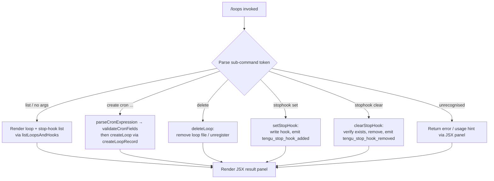

# `/loops`

> Analysis basis: CC v2.1.132 bundle.js (AST extraction + Claude interpretation)
> Minimum version: v2.1.132

---

## Overview

The `/loops` command provides a management interface for **recurring loops** (cron-scheduled agentic tasks) and **stop-hooks** (shell commands that execute when a Claude Code session ends). Users can list existing loops and stop-hooks, create new ones, and delete them — all from within the CLI without leaving the session. The command renders an inline JSX panel (`local-jsx` type) and is driven by the async handler `DO7`.

---

## Registration

| Field | Value |
|---|---|
| type | `local-jsx` |
| name | `loops` |
| description | `List, create, and delete recurring loops and stop-hooks` |
| immediate | `true` |
| module_id | `gfq` |
| load_inline | `true` |
| handler (Arbor) | `DO7` (AsyncFunction, resolved via `module_id` path) |
| loc_byte span | `11166709` – `11166891` |
| `loc_byte_end` | `11166891` |
| `arbor_handler.name` | `DO7` |
| `arbor_handler.kind` | `AsyncFunction` |
| `arbor_handler.resolution_path` | `module_id` |
| `arbor_handler.fqn` | `claude-2.1.132::DO7` |
| `arbor_handler.n_hits` | `0` |

Analysis basis: CC v2.1.132 bundle.js:+11166709

---

## Input Branching

The handler `DO7` dispatches to one of several sub-operations based on the sub-command token(s) present in the user's input. The flowchart below summarises the top-level branching derived from the call graph.



Analysis basis: CC v2.1.132 bundle.js:+11165673

---

## Behavioral Spec

### 1. Handler Entry — `loopsCommandHandler` (`DO7`)

```
async function loopsCommandHandler(context):
    emit telemetry("tengu_loops_command")          // +11165675
    appState = context.getAppState()               // +11165725
    loopEntries = loadLoopEntries(appState)        // iO8 +11165721
    stopHookEntries = readStopHookConfig(context)  // jMH +11165713

    subCmd = parseSubCommand(context.input)        // d   +11165673

    if subCmd == "create" or subCmd starts with "cron":
        cronSpec = parseCronToken(subCmd)          // zO7 +11166225
        result = createLoop(cronSpec, loopEntries) // lr6 +11166323
    else if subCmd == "delete":
        result = deleteLoop(subCmd.id, loopEntries)// K_H +11165960
    else if subCmd == "stophook set":
        result = setStopHook(subCmd.cmd, context)  // QnH +11166405
    else if subCmd == "stophook clear":
        result = clearStopHook(subCmd.id, context) // dnH +11166099
    else:
        result = listLoopsAndHooks(loopEntries, stopHookEntries)

    return renderJSXPanel(result)                  // ehA.createElement +11166469
```

Analysis basis: CC v2.1.132 bundle.js:+11165673

---

### 2. Loop File Loading — `loadLoopEntries` (`iO8`)

```
function loadLoopEntries(appState):
    entries = []
    statusMap = buildStatusMap(appState)           // uOH +11164233
    for each loop in statusMap:
        entries.push(formatLoopRow(loop))          // _.push +11164357
    return entries
```

The status map is built by `uOH`, which calls `L.set` (+8194303) and `iv9` (which maps over loop records). Each row is padded to 40 characters (`f.padEnd`, literal `40` at +14154022) with a two-space separator (literal `"  "` at +14152051).

Analysis basis: CC v2.1.132 bundle.js:+11164233

---

### 3. Stop-Hook Configuration Loading — `loadStopHookConfig` (`jMH`)

```
function loadStopHookConfig(context):
    rawConfig = readLoopConfigFile(context)        // CWH +4240378
    hookList  = parseHookEntries(rawConfig)        // CN  +4240414
    return hookList
```

`readLoopConfigFile` (`CWH`) performs:

```
function readLoopConfigFile(context):
    configPath = buildConfigPath(context)          // L_H +4238321
                                                   //   uses dr6.join + mK
    raw = A.readFile(configPath, "utf-8")          // +4238390, literal "utf-8" +4238418
    if error.code in ["ENOENT","EACCES","EPERM","ENOTDIR","ELOOP"]:
        return null                                // HA  +4238371 checks these codes
    parsed = parseLoopFileFormat(raw)              // T9→j8 +4238440
    validated = validateEntries(parsed)            // fH  +4238462
    if Array.isArray(parsed):                      //     +4238534
        return buildEntryMap(validated)            // k   +4238713
    stringified = RH(validated)                    // JSON.stringify +4238760
    return parseTokens(stringified)                // cZ  +4238782
```

`validateEntries` (`fH`) cycles through up to a rolling window of entries (queue shift/push via `$wL`), pushes results to the hook list (`kyH.push` +911901), and logs errors via `EQ.logError` (+911941) with level `"error"` (literal +911916). The essential-traffic queue identifier literal `"essential-traffic"` appears at +910638.

Analysis basis: CC v2.1.132 bundle.js:+4240378

---

### 4. Cron Expression Parsing — `parseCronExpression` (`zO7`)

```
function parseCronExpression(input):
    trimmed = input.trim()
    match = trimmed.match(cronPattern)             // H.match +11165261
    if no match:
        return humanReadableDefault(trimmed)

    minutes = parseInt(match.minutes)             // parseInt +11165298
    hours   = max(parsed.hours, 0)                // Math.max +11165383
    days    = ceil(parsed.days)                   // Math.ceil +11165394
    result  = round(normalise(minutes,hours,days))// Math.round +11165467

    // Boundary constants applied:
    // minutes: 0–59  (literals +11165440, +11165406)
    // hours:   0–23  (literal  +11165511)
    // days:    1–31  (literal  +11165564)

    tokenised = tokeniseCronSpec(result)           // cZ +11165631
    return tokenised
```

Human-readable aliases resolved inside `lE` (+4236162):
- `"Every minute"` (literal +4236282)
- `"Every hour"` (literal +4236499)
- Range string `"1-5"` appears at +4237206

Day-of-week calculation uses UTC methods (`j.getUTCDay`, `j.setUTCDate`, `j.getUTCDate`, `j.setUTCHours`, `j.getDay`) starting from +4237039.

Cron-type loop records are typed as `"cron"` (literal +11165771).

Analysis basis: CC v2.1.132 bundle.js:+11165261

---

### 5. Loop Record Creation — `createLoop` (`lr6`)

```
async function createLoop(cronSpec, existingEntries):
    id        = Nb1.randomUUID()                   // +4239718
    timestamp = Date.now()                         // +4239780
    meta      = buildLoopMeta(cronSpec, id)        // NwH +4239826
    config    = readLoopConfigFile(context)        // CWH +4239870

    loopDir   = path.join(".claude", ...)          // literal ".claude" +4239559
                                                   // Qr6.mkdir +4239538
    for each line in meta.lines:                   // H.map  +4239599
        Qr6.writeFile(loopDir, line)               // +4239635
    configHash = RH(config)                        // +4239656 (stringify)

    entries.push(newEntry)                         // M.push +4239883
    scheduleWithDaemon(newEntry)                   // v6 +4239915
    emitLoopRecord(newEntry)                       // Er +4239964
    persistConfig(config, loopDir)                 // kmH +4239977
    return newEntry
```

UUID generation uses 8 random bytes (literal `8` at +4239743) via `Nb1.randomUUID`.

Analysis basis: CC v2.1.132 bundle.js:+4239718

---

### 6. Loop Deletion — `deleteLoop` (`K_H`)

```
function deleteLoop(id, entries):
    exists = checkExists(id)                       // zi→A.has +47032
    config = readLoopConfigFile(context)           // CWH +4240097
    filtered = entries.filter(e => e.id != id)    // q.filter +4240106
    if not _.has(id):                              // +4240121
        return notFoundError()
    persistUpdatedConfig(filtered, config)         // kmH +4240170
    return successResult()
```

Analysis basis: CC v2.1.132 bundle.js:+11165960

---

### 7. Stop-Hook — Set (`setStopHook`, `QnH`)

```
async function setStopHook(hookCommand, context):
    sessionState = context.getAppState()           // A.getAppState +11164422
    loopEntries  = loadLoopEntries(sessionState)   // iO8 +11164418
    scheduleRef  = v6(...)                         // +11164400

    appState.setActiveGoal(hookCommand)            // +11164548
    timestamp = Date.now()                         // +11164596
    emit telemetry("tengu_stop_hook_added")        // +11164611

    writeToSession(context, hookCommand)           // d   +11164609
    triggerUIRefresh()                             // SH  +11164671
    emitTelemetryLabel("goal_set")                 // literal +11164674
    return "Stop hook set"                         // literal +11166426
```

Analysis basis: CC v2.1.132 bundle.js:+11164400

---

### 8. Stop-Hook — Clear (`clearStopHook`, `dnH`)

```
async function clearStopHook(id, context):
    sessionState = context.getAppState()           // H.getAppState +11164719
    loopEntries  = loadLoopEntries(sessionState)   // iO8 +11164715
    scheduleRef  = v6(...)                         // +11164708

    if hookNotFound(id):
        return "Stop hook not found"               // literal +11166117

    appState.setActiveGoal(null)                   // H.setActiveGoal +11164848
    appState.applyMessageOp({                      // H.applyMessageOp +11164872
        type: "append",                            // literal +11164895
        role: "goal",                              // literal +11164957
        kind: "attachment",                        // literal +11164996
        subtype: "goal_status"                     // literal +11165083
    })
    newMsgId = generateId()                        // $O7→Ffq.randomUUID +11165014
    emit telemetry("tengu_stop_hook_removed")      // +11164926
    writeSession(context)                          // d +11164924
    return "Stop hook cleared"                     // literal +11166139
```

Analysis basis: CC v2.1.132 bundle.js:+11166099

---

### 9. Loop Lifecycle / Daemon Interaction

Background loop execution is managed by the daemon subsystem. Key states observed in literals:

| State string | loc_byte |
|---|---|
| `"active"` | +3881186 |
| `"working"` | +14134065 |
| `"idle"` | +14134625 |
| `"blocked"` | +14133991 |
| `"crashed"` | +14134005 |
| `"done"` | +14133871 |
| `"killed"` | +14133889 |
| `"stopped"` | +14133898 |
| `"failed"` | +14133908 |
| `"bg"` | +14134190 |
| `"daemon"` | +14134510 |
| `"resuming"` | +14135265 |

The daemon is instructed to spawn new background sessions via `bm.spawn` (+14131208) and claim spare workers via `bm.claim` (+14112369). A SIGKILL escalation path exists (`"SIGKILL"` literal +14130020) for processes that do not terminate after SIGTERM (`"SIGTERM"` +14112733) within a grace period.

Daemon claim frames are serialised with `bm.buildClaimFrame` (+14112796); send-claim timeout is **5000 ms** (literal +14112920). After a `"ECONNREFUSED"` error (literal +14113068), a retry delay of **500 ms** (literal +14113124) is applied.

Analysis basis: CC v2.1.132 bundle.js:+14112369

---

### 10. Token Parsing — `parseTokens` (`cZ`)

```
function parseTokens(input):
    trimmed = input.trim()                         // H.trim +4234991
    tokens  = splitAndParse(trimmed)               // wpK   +4235077

    // wpK internals:
    //   H.split on whitespace                     // +4234411
    //   K.match against pattern                   // +4234431
    //   parseInt for numeric fields               // +4234476
    //   L.add to deduplicate                      // +4234537
    //   Array.from for final collection           // +4234939
    //   max token window: 10 (literal +4234490)
    //   limits: 3, 6, 7 (literals +4234652, +4234688, +4234694)
    //   result cap: 5    (literal +4235027)
    //   field count: 4   (literal +4235190)

    output.push(tokens)                            // _.push +4235112
    return output
```

Analysis basis: CC v2.1.132 bundle.js:+4235077

---

## State & Side Effects

| Item | Detail |
|---|---|
| **Telemetry — primary** | `tengu_loops_command` emitted on every invocation (+11165675) |
| **Telemetry — stop-hook add** | `tengu_stop_hook_added` (+11164611) |
| **Telemetry — stop-hook remove** | `tengu_stop_hook_removed` (+11164926) |
| **Telemetry — daemon** | `tengu_daemon_control` (+14164048), `tengu_daemon_yield` (+14147314) |
| **Telemetry — bg spare** | `tengu_bg_spare_enable` (+14129457), `tengu_bg_spare_spawn` (+14129749), `tengu_bg_spare_claim` (+14130886), `tengu_bg_spare_claim_fail` (+14131149) |
| **Telemetry — bg dispatch** | `tengu_bg_dispatch_sigkill_escalate` (+14129972), `tengu_bg_sendclaim_failed` (+14112495) |
| **Telemetry — MCP** | `tengu_mcp_retry_failed_remote` (+13846663) |
| **Telemetry — feature** | `tengu_feature_ok` (+906461), `tengu_feature_bad` (+906517) |
| **File I/O** | Reads/writes loop config under `.claude/` directory; uses `Qr6.writeFile`, `Qr6.mkdir`, `WY.unlink` |
| **appState changes** | `setActiveGoal`, `applyMessageOp` (for stop-hook set/clear) |
| **Process management** | Daemon background sessions spawned/killed; SIGTERM then SIGKILL escalation |
| **Hook registration** | Stop-hooks written to config; removed via `tgq.unlinkSync` path (queue managed by `$wL`) |
| **Sound** | <!-- TODO: not found in depth-2 traversal; needs --depth 4 --> |
| **MCP side-effects** | Loop creation may trigger MCP server refresh (`H.applyMcpUpdate` via `ZBq`) |

---

## Token / Field Limits (from literals)

| Constraint | Value | loc_byte |
|---|---|---|
| Max token window (`wpK`) | 10 | +4234490 |
| Result cap (`cZ`) | 5 | +4235027 |
| Field count limit | 4 | +4235190 |
| Column pad width | 40 chars | +14154022 |
| Cron minutes upper bound | 59 | +11165440 |
| Cron hours upper bound | 23 | +11165511 |
| Cron days upper bound | 31 | +11165564 |
| Daemon send-claim timeout | 5000 ms | +14112920 |
| Daemon claim retry delay | 500 ms | +14113124 |
| Stop-hook SIGTERM→SIGKILL grace | 2000 ms | +14129682 |
| Spare worker kill timeout (30 s) | 30 | +14129927 |
| Spare worker check interval (15 s) | 15 | +14129938 |

---

## Version History

| Version | Change |
|---|---|
| v2.1.132 | Initial analysis; `local-jsx` immediate command; handler `DO7` confirmed via Arbor `module_id` resolution |

---

## Common Mistakes

1. **Omitting the sub-command**: invoking `/loops` with no argument triggers the list view, not an error — but users expecting interactive creation must supply `create` or `cron <spec>`.
2. **Malformed cron expressions**: the parser (`zO7`) clamps minutes to 0–59, hours to 0–23, and days to 1–31. Values outside these ranges are silently normalised rather than rejected.
3. **Clearing a non-existent stop-hook**: the handler returns the literal `"Stop hook not found"` (+11166117) but does not throw; callers should not rely on an exception.
4. **Assuming the `.claude/` directory exists**: `createLoop` calls `Qr6.mkdir` before writing files. External tooling that pre-deletes this directory between invocations may race with the command.
5. **Confusing loop type `"cron"` with stop-hook type `"stophook"`**: the list view distinguishes them (`"cron"` +11165771, `"stophook"` +11165857); deletion must target the correct type.
6. **Treating the rendered panel as text output**: `/loops` is `local-jsx`, so its output is a rendered React component, not plain text. Piping or scripting against raw stdout will not capture the panel content.

---

## Appendix — Identifier Mapping

> For bundle debugging only. Identifiers change across versions.

| Identifier | Role |
|---|---|
| `DO7` | Main async handler for `/loops` command |
| `d` | Session write / context helper (shared utility) |
| `jMH` | Stop-hook config loader (top-level) |
| `CWH` | Loop config file reader |
| `F6` | File-system helper (used inside config reader and MCP path) |
| `L_H` | Config path builder (joins `dr6` + `mK`) |
| `mK` | Base directory resolver |
| `T9` | Loop file parser (calls `j8`) |
| `j8` | Low-level parse utility |
| `fH` | Entry validator / essential-traffic queue processor |
| `HA` | Error code classifier (`ENOENT`, `EACCES`, etc.) |
| `yH` | String coercion utility |
| `kq` | Traffic-queue helper (calls `h1_`) |
| `$wL` | Rolling queue shift/push (entry window manager) |
| `k` | Entry map builder / tool-call dispatch |
| `Lsq` | Sub-entry constructor (calls `_Z`, `qsq`, `rdA`) |
| `RH` | JSON serialiser (`JSON.stringify` wrapper) |
| `mf` | Path redaction utility (replaces paths, uses `[REDACTED]`) |
| `gNH` | Supplementary entry helper (calls `slA`) |
| `Msq` | Config persistence helper (writes via `F6`, `jnA`, `JnA`, etc.) |
| `cZ` | Token list parser |
| `wpK` | Token splitter / numeric field parser |
| `K` | Process / file write dispatcher (calls `q`, `vH`, `AZ`, `process.exit`) |
| `q` | Unlink-sync wrapper (`tgq.unlinkSync`) |
| `vH` | String coercion (thin `String()` wrapper) |
| `AZ` | File write helper (`FNH.writeFileSync`, `IG8.join`) |
| `CN` | Hook-list finaliser |
| `iO8` | Loop entry loader (calls `uOH`, `_.push`) |
| `uOH` | Status-map builder (`L.set`, `iv9`) |
| `iv9` | Loop record mapper (`H.map`) |
| `v6` | Daemon schedule reference builder |
| `lE` | Cron field evaluator (date/time math, human-readable aliases) |
| `w` | Loop execution runner (spawn, kill, claim, timeout) |
| `y` | Signal dispatcher (SIGKILL/SIGTERM via `aiH`, `siH`) |
| `aiH` | SIGKILL send helper |
| `siH` | SIGTERM send helper |
| `Y` | Spare-worker lifecycle manager (enable, spawn, dispose) |
| `mH` | Telemetry emit helper for `tengu_feature_bad` |
| `SH` | UI refresh trigger / `tengu_feature_ok` helper |
| `j6` | Session-claim coordinator (checks `V5H`, `mU`, calls `R6`, `uQ6`) |
| `hq6` | Session set initialiser |
| `Rq6` | Session registry helper |
| `Oo` | Claim format builder (calls `yH`, `Mo`) |
| `uQ6` | Dedup-claim helper (`Kt8.has/add`, `V5H.get`, `Lt8`, `Dt8`) |
| `R6` | Claim record constructor (`F6`, `B2`, `Et8`, `k5H`, `DPK`) |
| `LFA` | Claim sender over IPC socket (`bm.claim`, `bm.buildClaimFrame`) |
| `NQ7` | Claim timeout / retry handler |
| `vQ7` | Claim frame serialiser |
| `Ym` | Binary frame encoder (`Buffer.from/allocUnsafe`, `writeUInt32BE`, `writeUInt8`) |
| `OFA` | Background-session runner / state machine |
| `UL` | Path join helper for session dirs |
| `Jq` | Session file cache manager (`vX.stat`, `vX.readFile`, `bfH.*`) |
| `tY` | Session activation helper (calls `UE`) |
| `jM` | Session metadata writer (`lY`, `NX.join`, `RH`, `YW`) |
| `SlH` | Session hook executor (timestamp, `c_7`, `.catch`) |
| `HqH` | Hook path resolver (`$$.join`, `XIH`) |
| `KN` | Hook invocation helper (`s6`, `$$.join`, `XIH`, `H.split`) |
| `Xm` | Hook state updater (`s6`, `UvA`, `$$.join`, `ylH`) |
| `R` | Supervisor watcher (`kQq`, `tQ7`, `z.write`) |
| `kQq` | Realpath/stat resolver (`_P8.realpath`, `_P8.stat`) |
| `tQ7` | Change detector (`Oq8`) |
| `z` | Supervisor write helper (`SH`, `mH`, `Jx`, `pC`) |
| `J` | Kill-all helper (`_.values`, `v.kill`) |
| `v` | Process kill with backoff (`BU`, `Date.now`, `Math.min`, `Z`, `I`, `HRq`) |
| `BU` | Kill backoff base |
| `$` | Session ID generator entry point (calls `mzq`) |
| `mzq` | Session ID generator (`Er`, `Date.now`, `lY`, `PX6`, `RH`) |
| `Er` | ID format helper (`G7H`) |
| `lY` | Atomic file writer (`Uo8.randomBytes`, `or.writeFile/rename/copyFile/unlink`) |
| `PX6` | Status file path builder (`uzq.join`, `l8`) |
| `j` | Date utility wrapper (calls `w`) |
| `K_H` | Loop deletion handler |
| `zi` | Existence checker (`A.has`) |
| `kmH` | Config persistence writer (`mK`, `Qr6.mkdir/writeFile`, `dr6.join`, `L_H`, `RH`) |
| `dnH` | Stop-hook clear handler |
| `$O7` | Message ID generator (`Ffq.randomUUID`) |
| `zO7` | Cron expression parser (boundary clamping, `Math.max/ceil/round`) |
| `lr6` | Loop record creator (`Nb1.randomUUID`, `Date.now`, `NwH`, `CWH`, `M.push`) |
| `NwH` | Loop metadata builder |
| `M` | MCP client loop connector (`UZH`, `ZBq`, `K.get/values`, `j6`, `$F7`) |
| `UZH` | MCP server session orchestrator |
| `qt` | MCP tool descriptor builder (`PF`, `VEH`, `c$H`, `_t`, `LO6`) |
| `wI` | MCP wire-format helper (`oM`, `nwA`) |
| `qA` | MCP argument validator (`A`) |
| `Qw6` | MCP session filter |
| `Nr4` | MCP stats recorder (`XZA`, `Date.now`) |
| `a18` | MCP capability enumerator (`jl`, `Object.keys`, `o18`, `WJ`) |
| `K8` | MCP debug logger (`kyH.push`, `EQ.logMCPDebug`) |
| `tTA` | MCP tool executor (`Ci4`, `Bp`, `hi4`, `ot`, `pcH`, `Promise.race`) |
| `eTA` | MCP OAuth token-exchange helper (`Bp`, `Si4`, `mcH`, `UcH`) |
| `mc9` | MCP state file writer (`p9H.writeFile`, `XZA`, `Qf8`, `RH`) |
| `aTA` | MCP auth-state updater (`WJ`, `EK`, `Nw6`) |
| `gwA` | MCP feature-flag checker (`A8`, `_.includes`) |
| `S` | MCP output writer (`z.write`, `d`) |
| `Z7` | MCP error logger (`kyH.push`, `EQ.logMCPError`) |
| `Cc9` | MCP cleanup helper (`zMH`) |
| `dw6` | MCP integer parser (timeout field) |
| `PZA` | MCP integer parser (retry field) |
| `ZBq` | MCP update applicator (`H.applyMcpUpdate`, `df8`, `_.cleanup`, `bI`, `YD`) |
| `df8` | MCP diff serialiser (`RH`) |
| `bI` | MCP client cleanup (`dcH`, `L.cleanup`) |
| `$F7` | MCP client reconnect orchestrator |
| `t18` | MCP connection filter (`KE4.has`, `fE4.has`) |
| `o8` | Abort-with-timeout helper (`Error`, `setTimeout`, `clearTimeout`, `K.unref`) |
| `dcH` | MCP connection hash serialiser (`RH`) |
| `QnH` | Stop-hook set handler |