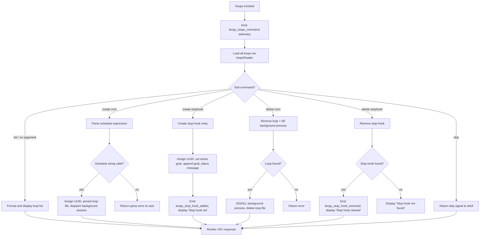

# `/loops`

> Analysis basis: CC v2.1.132 bundle.js (AST extraction + Claude interpretation)
> Minimum version: v2.1.132

---

## Overview

The `/loops` command is a local JSX slash-command that provides a unified management interface for two recurring automation primitives in Claude Code: **cron-style loops** (scheduled recurring prompts) and **stop-hooks** (callbacks that fire when a session ends). It supports listing all active loops and stop-hooks, creating new ones, and deleting existing ones. The command is registered as `immediate`, meaning it renders and executes its UI layer without waiting for a prior turn to complete.

---

## Registration

| Field | Value |
|---|---|
| type | `local-jsx` |
| name | `loops` |
| description | List, create, and delete recurring loops and stop-hooks |
| immediate | `true` |
| module_id | `gfq` |

Analysis basis: CC v2.1.132 bundle.js:+11166709

---

## Input Branching

The command's top-level handler (`DO7`) inspects the sub-command string and routes to one of several operation handlers. The loop type discriminator (`"cron"` vs `"stophook"`) further sub-divides creation and deletion paths.



Analysis basis: CC v2.1.132 bundle.js:+11165673 – +11166543

---

## Behavioral Spec

### 1. Command Entry and Telemetry

```
function loopsCommandHandler(input, appContext):
    emit telemetry("tengu_loops_command")          // always first
    loops     = readAllLoops(appContext)            // calls loopsReader
    stophooks = readAllStopHooks(appContext)
    subCommand = parseSubCommand(input)
    route(subCommand, loops, stophooks, appContext)
```

Analysis basis: CC v2.1.132 bundle.js:+11165673, +11165675

---

### 2. Reading Persisted Loops (`loopsReader`)

```
function readAllLoops(appContext):
    configPath = resolveConfigPath(appContext)      // uses F6
    raw        = filesystem.readFile(configPath, "utf-8")
    parsed     = parseLoopEntries(raw)             // validates Array.isArray
    result     = []
    for entry in parsed:
        validated = validateEntry(entry)           // RH + cZ
        if validated:
            result.push(validated)
    return result
```

- File encoding is always `"utf-8"`. Analysis basis: CC v2.1.132 bundle.js:+4238418
- Array shape is verified with `Array.isArray` before iteration. Analysis basis: CC v2.1.132 bundle.js:+4238534
- Invalid entries are silently dropped (push only on success). Analysis basis: CC v2.1.132 bundle.js:+4238877

---

### 3. Listing Loops and Stop-Hooks

```
function listLoops(loops, stophooks):
    cronEntries     = loops.filter(e => e.type == "cron")
    stophookEntries = loops.filter(e => e.type == "stophook")
    lines = []
    for entry in cronEntries:
        label = entry.label.padEnd(40, " ")        // column width 40
        lines.push(label + "  " + entry.schedule)
    for entry in stophookEntries:
        lines.push(formatStophook(entry))
    return renderJSX(lines)
```

- Column padding width: **40 characters**. Analysis basis: CC v2.1.132 bundle.js:+14154022
- Column separator: two spaces (`"  "`). Analysis basis: CC v2.1.132 bundle.js:+14152051

---

### 4. Schedule String Parsing (`scheduleParser`)

The schedule parser accepts a human-readable or numeric interval string and converts it to internal cron fields.

```
function parseScheduleString(input):
    trimmed = input.trim()

    if trimmed matches "Every minute" pattern:
        return { intervalMinutes: 1 }

    if parseInt(trimmed) succeeds and value <= 10:
        // treat as minutes
        return { intervalMinutes: parsedValue }

    if trimmed matches "Every hour" pattern:
        return { intervalMinutes: 60 }

    // Validate numeric fields
    minutes = extractField(trimmed, range=[0, 59])
    hours   = extractField(trimmed, range=[0, 23])
    days    = extractField(trimmed, range=[1, 31])

    // Weekday handling
    dayOfWeek = date.getUTCDay()
    adjustedDate = date.setUTCDate(...) + date.getUTCDate()
    date.setUTCHours(...)

    // Validate weekday range "1-5" for business-day loops
    if weekdayToken == "1-5":
        applyWeekdayFilter()

    return cronSpec
```

- `"Every minute"` label literal. Analysis basis: CC v2.1.132 bundle.js:+4236282
- `"Every hour"` label literal. Analysis basis: CC v2.1.132 bundle.js:+4236499
- Minimum interval threshold for numeric parsing: **10** (values above this are not treated as bare minutes). Analysis basis: CC v2.1.132 bundle.js:+4236352
- Minute field max: **59**. Analysis basis: CC v2.1.132 bundle.js:+11165440
- Hour field max: **23**. Analysis basis: CC v2.1.132 bundle.js:+11165511
- Day-of-month max: **31**. Analysis basis: CC v2.1.132 bundle.js:+11165564
- Modulo base for minute rounding: **60**. Analysis basis: CC v2.1.132 bundle.js:+11165406
- Business-day token: `"1-5"`. Analysis basis: CC v2.1.132 bundle.js:+4237206
- `Math.max`, `Math.ceil`, `Math.round` are all applied during normalization. Analysis basis: CC v2.1.132 bundle.js:+11165383, +11165394, +11165467

---

### 5. Creating a Cron Loop (`loopCreator`)

```
function createCronLoop(scheduleInput, promptText, appContext):
    cronSpec = parseScheduleString(scheduleInput)
    if cronSpec is error:
        return renderError(cronSpec.message)

    id        = crypto.randomUUID()                // Nb1.randomUUID
    createdAt = Date.now()
    loopEntry = {
        id:        id,
        type:      "cron",
        schedule:  cronSpec,
        prompt:    promptText,
        createdAt: createdAt
    }

    persistLoopEntry(loopEntry, appContext)         // kmH: mkdir + writeFile
    dispatchBackgroundSession(loopEntry, appContext) // Er -> G7H
    updateLoopRegistry(loopEntry)                   // M.push

    return renderSuccess("Loop created: " + id)
```

- UUID generated via `randomUUID`. Analysis basis: CC v2.1.132 bundle.js:+4239718
- `Date.now()` used for `createdAt`. Analysis basis: CC v2.1.132 bundle.js:+4239780
- Loop type discriminator stored as string `"cron"`. Analysis basis: CC v2.1.132 bundle.js:+11165771
- Loop files are written to the `.claude` directory. Analysis basis: CC v2.1.132 bundle.js:+4239559
- Persistence uses `mkdir` then `writeFile` (atomic directory-first pattern). Analysis basis: CC v2.1.132 bundle.js:+4239538, +4239635

---

### 6. Creating a Stop-Hook (`stopHookCreator`)

```
function createStopHook(promptText, appContext):
    id       = crypto.randomUUID()                 // $O7 -> Ffq.randomUUID
    appState = appContext.getAppState()
    appContext.setActiveGoal({
        id:     id,
        type:   "goal",
        prompt: promptText
    })
    appContext.applyMessageOp({
        op:      "append",
        role:    "system",
        content: { type: "attachment", kind: "goal_status", text: promptText }
    })

    emit telemetry("tengu_stop_hook_added")
    display("Stop hook set")
    return renderSuccess()
```

- Message op type: `"append"`. Analysis basis: CC v2.1.132 bundle.js:+11164895
- Content kind: `"attachment"`. Analysis basis: CC v2.1.132 bundle.js:+11164996
- Goal type field value: `"goal"`. Analysis basis: CC v2.1.132 bundle.js:+11164957
- Goal status field name: `"goal_status"`. Analysis basis: CC v2.1.132 bundle.js:+11165083
- Confirmation string: `"Stop hook set"`. Analysis basis: CC v2.1.132 bundle.js:+11166426

---

### 7. Deleting a Cron Loop (`loopDeleter`)

```
function deleteCronLoop(loopId, appContext):
    loops = readAllLoops(appContext)               // CWH
    match = loops.find(e => e.id == loopId)

    if match is null:
        return renderError("Loop not found")

    backgroundProcess = findBackgroundProcess(match)
    if backgroundProcess exists:
        backgroundProcess.kill("SIGKILL")          // y.kill("SIGKILL")
        setTimeout(cleanupAfterKill, 100ms)

    filesystem.unlinkSync(loopFilePath(match))     // tgq.unlinkSync
    return renderSuccess("Loop deleted")
```

- Kill signal: `"SIGKILL"`. Analysis basis: CC v2.1.132 bundle.js:+14130020
- Post-kill cleanup delay: **100 ms**. Analysis basis: CC v2.1.132 bundle.js:+14130044
- File removal is synchronous (`unlinkSync`). Analysis basis: CC v2.1.132 bundle.js:+14110155

---

### 8. Deleting a Stop-Hook (`stopHookDeleter`)

```
function deleteStopHook(appContext):
    appState = appContext.getAppState()
    hook = findActiveStopHook(appState)

    if hook is null:
        display("Stop hook not found")
        return

    emit telemetry("tengu_stop_hook_removed")
    clearActiveGoal(appState)
    display("Stop hook cleared")
    return renderSuccess()
```

- Not-found message literal: `"Stop hook not found"`. Analysis basis: CC v2.1.132 bundle.js:+11166117
- Cleared message literal: `"Stop hook cleared"`. Analysis basis: CC v2.1.132 bundle.js:+11166139

---

### 9. Loop Registry and State Handler (`loopRegistryHandler`)

```
function updateLoopRegistry(entry):
    registry = getLoopRegistryMap()                // L.set / uOH
    registry.set(entry.id, entry)
    iv9(entry)                                     // internal index update
```

Analysis basis: CC v2.1.132 bundle.js:+8194303, +8194311

---

### 10. Stop-Hook Goal Lifecycle (`goalLifecycleManager`)

```
function setActiveGoalWithTimestamp(goalSpec, appContext):
    appContext.setActiveGoal(goalSpec)
    appContext.setTimestamp(Date.now())            // QnH path
    emit telemetry("tengu_stop_hook_added")
    // if already set: emit "goal_set" marker
```

- `"goal_set"` marker string. Analysis basis: CC v2.1.132 bundle.js:+11164674
- `Date.now()` called at goal creation. Analysis basis: CC v2.1.132 bundle.js:+11164596

---

### 11. Background Session Dispatch (`backgroundSessionDispatcher`)

The background session mechanism is shared between the loops system and the daemon infrastructure. Key behaviors within depth-2 traversal:

```
function dispatchBackgroundSession(loopEntry, appContext):
    spareSession = claimSpareSession()             // tengu_bg_spare_claim
    if spareSession available:
        emit telemetry("tengu_bg_spare_claim")
        configureSession(spareSession, loopEntry)
    else:
        emit telemetry("tengu_bg_spare_claim_fail")
        spawn new session via bm.spawn()
        emit telemetry("tengu_bg_spare_spawn")

    emit telemetry("tengu_bg_spare_enable")

    // On repeated duplicate failures:
    if retryCount exhausted:
        emit telemetry("tengu_bg_dispatch_sigkill_escalate")
        kill("SIGKILL") after 30s then 15s grace
        emit "dup_retry_exhausted"
```

- SIGKILL escalation delays: **30 s** and **15 s**. Analysis basis: CC v2.1.132 bundle.js:+14129927, +14129938
- Retry-exhausted literal: `"dup_retry_exhausted"`. Analysis basis: CC v2.1.132 bundle.js:+14130309
- Background session create event: `"daemon_bg_session_create"`. Analysis basis: CC v2.1.132 bundle.js:+14130282
- Spare session re-spawn delay: **2000 ms**. Analysis basis: CC v2.1.132 bundle.js:+14129682
- SIGTERM used for graceful stop-hook teardown. Analysis basis: CC v2.1.132 bundle.js:+14131382
- Windows platform receives separate handling path (`"windows"` literal). Analysis basis: CC v2.1.132 bundle.js:+14129552

---

### 12. `skip` Sub-Command

```
function handleSkip():
    return { signal: "skip" }
```

- Literal `"skip"` returned as sub-command signal. Analysis basis: CC v2.1.132 bundle.js:+11166575

---

### 13. JSX Rendering and Close Handlers

```
function renderLoopsUI(content):
    element = React.createElement(...)             // ehA.createElement
    onClose = function():
        closeStream1()                             // f -> _.close
        closeStream2()                             // f -> q.close
        cleanupRegistry()                          // f -> K
    return element
```

Analysis basis: CC v2.1.132 bundle.js:+11166469, +14139791, +14139801

---

## State & Side Effects

| Item | Detail |
|---|---|
| Telemetry — `tengu_loops_command` | Fired on every `/loops` invocation (bundle.js:+11165675) |
| Telemetry — `tengu_stop_hook_added` | Fired when a stop-hook is successfully created (bundle.js:+11164611) |
| Telemetry — `tengu_stop_hook_removed` | Fired when a stop-hook is successfully deleted (bundle.js:+11164926) |
| Telemetry — `tengu_bg_spare_enable` | Fired when a spare background session is activated (bundle.js:+14130767) |
| Telemetry — `tengu_bg_spare_claim` | Fired when a spare session is successfully claimed (bundle.js:+14130886) |
| Telemetry — `tengu_bg_spare_claim_fail` | Fired when no spare session is available (bundle.js:+14131149) |
| Telemetry — `tengu_bg_spare_spawn` | Fired when a new spare session is spawned (bundle.js:+14129749) |
| Telemetry — `tengu_bg_dispatch_sigkill_escalate` | Fired when a background process is force-killed after retry exhaustion (bundle.js:+14129972) |
| Telemetry — `tengu_mcp_retry_failed_remote` | Fired when MCP remote retry fails during loop dispatch (bundle.js:+13846663) |
| Telemetry — `tengu_feature_ok` | Fired on successful feature gate check (bundle.js:+906461) |
| Hook registration | Stop-hooks are stored as active goals via `setActiveGoal` in app state |
| appState changes | `setActiveGoal`, `applyMessageOp` (append/system/attachment) mutate session app state |
| File system | Loop entries written to `.claude/` directory; removed with `unlinkSync` on delete |
| Background process | Cron loops spawn or claim a background session via `bm.spawn` / spare pool |
| Sound | <!-- TODO: not found in depth-2 traversal; needs --depth 4 --> |

---

## Version History

| Version | Change |
|---|---|
| v2.1.132 | Initial analysis |

---

## Common Mistakes

1. **Supplying a bare integer greater than 10 for schedule**: Values above `10` are not interpreted as a minute count by the parser's fast path — they are passed through full cron-field validation. Use `"Every minute"` or `"Every hour"` for named intervals, or a properly formatted cron expression for other schedules. Analysis basis: CC v2.1.132 bundle.js:+4236352

2. **Expecting stop-hooks to survive session restart**: Stop-hooks are stored as active goals in app state. Clearing app state (e.g., starting a new session) will not automatically re-register a stop-hook that was set in a prior session.

3. **Assuming `/loops` blocks the current turn**: The command is registered as `immediate: true`, so it executes and renders independently of any in-progress agent turn. Issuing it mid-turn will not interrupt the agent.

4. **Deleting a loop by label instead of ID**: The delete sub-command matches on the internal UUID, not on the human-readable label or schedule string. Use `/loops` (list) first to obtain the correct ID.

5. **Expecting instant process termination on loop delete**: After `SIGKILL` is sent to the background process, a 100 ms cleanup window elapses before the loop file is unlinked. Brief transient state may exist during this window. Analysis basis: CC v2.1.132 bundle.js:+14130044

6. **Registering multiple stop-hooks**: The `setActiveGoal` path replaces the current active goal. Calling create-stophook a second time overwrites the first hook; there is no multi-hook queue visible at this traversal depth.

---

## Appendix — Identifier Mapping

> For bundle debugging only. Identifiers change across versions.

| Identifier | Role |
|---|---|
| `DO7` | Top-level loops command handler / router |
| `d` | General utility / logger dependency (called from command entry and sub-handlers) |
| `jMH` | Loop collection reader orchestrator |
| `CWH` | Loop file reader and entry validator |
| `CN` | Post-read collection finalizer |
| `iO8` | Loop registry updater |
| `uOH` | Registry map setter (wraps `L.set` + index update) |
| `_` | Lodash-style utility library (get / set / push / has / values / map) |
| `A` | App context / state accessor object |
| `v6` | Sub-command string resolver / dispatcher |
| `lE` | Schedule string parser |
| `H` | Date/time helper and random jitter utility |
| `L` | Column formatter / label padder |
| `w` | Background session lifecycle manager |
| `K` | Process/session registry and exit handler |
| `J` | Bulk session teardown utility |
| `Y` | Spare background session spawner |
| `$` | MCP / remote session handler |
| `j` | UTC date arithmetic helper |
| `q` | Loop file entry and stream handler |
| `K_H` | Loop persistence orchestrator (filter + write) |
| `zi` | Feature gate checker |
| `kmH` | Loop file writer (mkdir + writeFile) |
| `dnH` | Stop-hook creation handler |
| `$O7` | UUID generator wrapper for stop-hooks |
| `zO7` | Cron schedule normalizer (Math.max / ceil / round) |
| `cZ` | Schedule token validator and field extractor |
| `lr6` | Cron loop creation orchestrator |
| `NwH` | Loop entry constructor / factory |
| `M` | Loop registry push and MCP retry handler |
| `Er` | Background session dispatcher bridge |
| `QnH` | Stop-hook goal lifecycle manager (timestamp + telemetry) |
| `SH` | Feature-ok gate and utility wrapper |
| `f` | JSX close / cleanup handler |