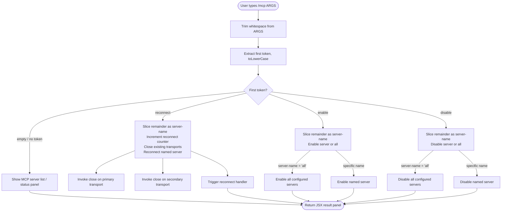

# `/mcp`

> Analysis basis: CC v2.1.132 bundle.js (AST extraction + Claude interpretation)
> Minimum version: v2.1.132

---

## Overview

The `/mcp` command provides in-session management of Model Context Protocol (MCP) servers. It allows the user to enable, disable, reconnect, or inspect servers by name, and takes effect immediately without requiring a session restart. The command trims and normalizes its input before branching on a recognized sub-command keyword.

## Registration

| Field | Value |
|---|---|
| type | `local-jsx` |
| name | `mcp` |
| description | `Manage MCP servers` |
| argumentHint | `[enable\|disable [server-name]]` |
| immediate | `true` |
| module_id | `RAq` |

Analysis basis: CC v2.1.132 bundle.js:+10666767

---

## Input Branching

The command handler trims whitespace from the raw argument string, converts the first token to lowercase, and routes execution to a sub-feature based on the result.



Analysis basis: CC v2.1.132 bundle.js:+10666238 (trim), +10666270 (no-redirect flag), +10666347 (reconnect literal), +10666362 (counter increment), +10666414 (slice for server-name), +10666460 (enable literal), +10666477 (disable literal), +10666576 (all literal)

---

## Behavioral Spec

### Input Normalization

```
function normalizeInput(rawArgs):
    trimmed = trim(rawArgs)                     // whitespace stripped both ends
    firstToken = split(trimmed)[0].toLowerCase()
    remainder  = slice(trimmed, len(firstToken)).trim()
    return (firstToken, remainder)
```

Analysis basis: CC v2.1.132 bundle.js:+10666238 (trim call), +14153948 (toLowerCase call)

---

### Reconnect Sub-command

When the first token is `"reconnect"`, the handler:

1. Reads the remainder string as the target server name.
2. Increments an internal reconnect attempt counter (starting value `0`, increment step `1`).
3. Calls close on the primary transport connection.
4. Calls close on the secondary transport connection.
5. Invokes the reconnect handler to re-establish the named server's MCP session.

```
function handleReconnect(serverName):
    reconnectCounter = reconnectCounter + 1      // step = 1
    primaryTransport.close()
    secondaryTransport.close()
    invokeReconnectHandler(serverName)
```

The `no-redirect` flag is set during this flow, preventing the session from being redirected to a different endpoint during reconnection.

Analysis basis: CC v2.1.132 bundle.js:+10666270 ("no-redirect"), +10666347 ("reconnect"), +10666362 (increment by 1), +14139789 (initial value 0), +14139791 (primary close), +14139801 (secondary close), +14139941 (reconnect handler invocation)

---

### Enable Sub-command

When the first token is `"enable"`, the remainder is interpreted as the server name to enable.

```
function handleEnable(serverName):
    if serverName == "all":
        for each configuredServer in mcpServerList:
            setServerEnabled(configuredServer, enabled=true)
    else:
        setServerEnabled(serverName, enabled=true)
    return renderStatusPanel()
```

Analysis basis: CC v2.1.132 bundle.js:+10666460 ("enable"), +10666576 ("all")

---

### Disable Sub-command

When the first token is `"disable"`, the remainder is interpreted as the server name to disable.

```
function handleDisable(serverName):
    if serverName == "all":
        for each configuredServer in mcpServerList:
            setServerEnabled(configuredServer, enabled=false)
    else:
        setServerEnabled(serverName, enabled=false)
    return renderStatusPanel()
```

Analysis basis: CC v2.1.132 bundle.js:+10666477 ("disable"), +10666576 ("all")

---

### Display Limit

The status/list panel renders at most **40** items.

Analysis basis: CC v2.1.132 bundle.js:+14154022 (literal `40`)

---

### File Cleanup on Transport Close

When a transport is torn down (as part of reconnect or disable), a file-system unlink operation is performed to remove the transport's socket or lock file.

```
function teardownTransport(transport):
    transport.close()
    fileSystem.unlinkSync(transport.socketPath)
```

Analysis basis: CC v2.1.132 bundle.js:+14110155 (unlinkSync call)

---

## State & Side Effects

| Item | Detail |
|---|---|
| Telemetry | None — no `tengu_*` events found in depth-2 traversal |
| Hook registration | `immediate: true` — the command handler is invoked synchronously without waiting for a confirmation prompt |
| appState changes | Enable/disable sub-commands mutate the per-server enabled flag in the MCP server configuration store |
| Reconnect counter | An internal numeric counter is incremented on each `reconnect` invocation (initial value `0`, step `1`) |
| Transport file cleanup | `unlinkSync` is called on the transport socket/lock file when a transport is closed during reconnect |
| Sound | <!-- TODO: not found in depth-2 traversal; needs --depth 4 --> |

---

## Version History

| Version | Change |
|---|---|
| v2.1.132 | Initial analysis — enable, disable, reconnect sub-commands; `all` wildcard; 40-item display cap; file cleanup on transport teardown |

---

## Common Mistakes

1. **Omitting the server name after `reconnect`/`enable`/`disable`**: Without a server name (and without using `all`), the remainder string is empty; behavior for an empty target name is <!-- TODO: not found in depth-2 traversal; needs --depth 4 -->.
2. **Expecting telemetry events**: This command emits no `tengu_*` telemetry events; integration tests that assert on analytics events will find nothing.
3. **Assuming non-immediate behavior**: Because `immediate: true` is set, the command fires without a secondary confirmation step, so UX flows that expect a prompt between input and execution will not match observed behavior.
4. **Case-sensitivity on the sub-command keyword**: Only the first token is lowercased before matching; the server name in the remainder is passed through as-is (case-sensitive).
5. **Expecting `all` to work with `reconnect`**: The `all` wildcard literal is only observed in the enable/disable branch paths; whether it is accepted by `reconnect` is <!-- TODO: not found in depth-2 traversal; needs --depth 4 -->.

---

## Appendix — Identifier Mapping

> For bundle debugging only. Identifiers change across versions.

| Identifier | Role |
|---|---|
| `EL7` | Top-level command handler function — normalizes input and dispatches to sub-command branches |
| `_` | Input-routing helper — performs toLowerCase and delegates to enable/disable/reconnect logic |
| `f` | Transport teardown function — calls close on primary and secondary transports, invokes reconnect handler |
| `q` | File-system cleanup function — performs `unlinkSync` on the transport socket/lock file path |